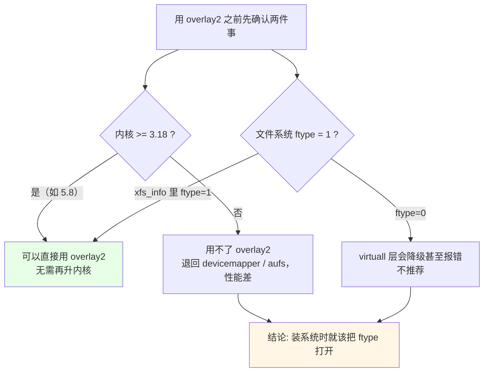
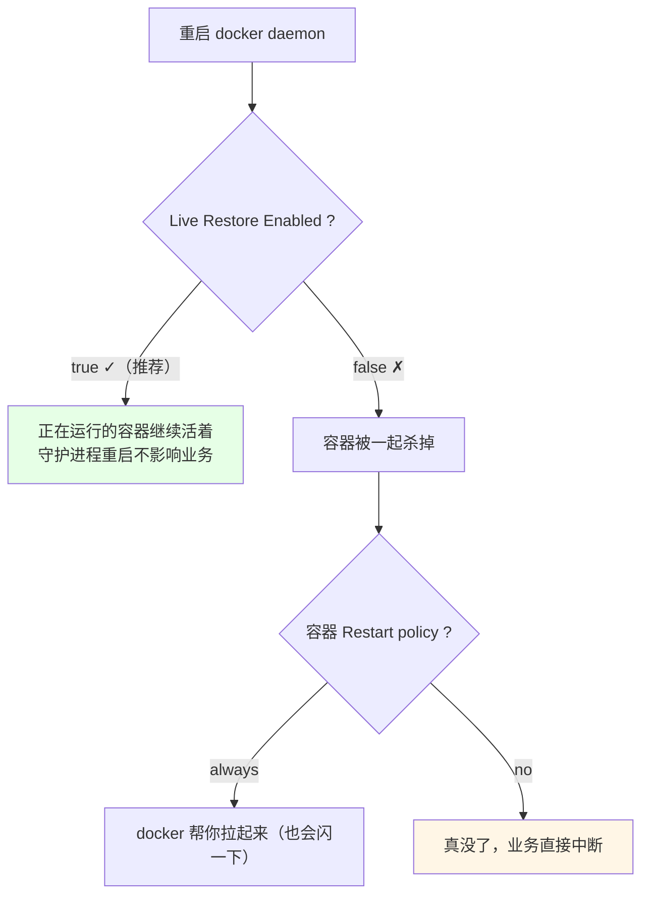
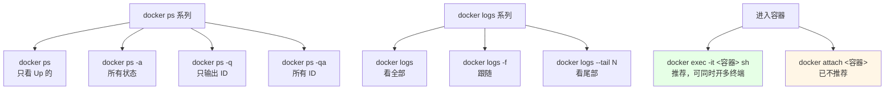

# Kubernetes 集群部署: Docker 基本命令上（version / info / 镜像搜索拉取推送 / 容器启停）

用 k8s 时 Docker 被封装在内部，`docker` 命令几乎不用敲 —— 但**你做了自己的应用镜像，总得验证它好不好使**，这就绕不开基本命令。这一节挑的都是最常用的那一批。

结论先给：

- **`docker version` 看客户端 / server 两侧版本，`docker info` 看运行态**：容器数、镜像数、存储驱动、日志驱动、`Docker Root Dir` 全在里面；
- **存储驱动用 `overlay2`，但它要求两件事**：内核 ≥ 3.18（课程里升级过的 5.8 天然支持），**且文件系统挂 `ftype=1`**（`xfs_info` 里看 `ftype=1`）—— 装系统时 `ftype` 没开就用不了 overlay2；
- **`live-restore=true` 生产必须开**：重启 docker daemon 时它**不会把正在跑的容器一起杀掉**；设成 false 又没配 `Restart: always`，容器是真没了；
- **镜像只用官方的（带 `OFFICIAL` 列）或自己做的**，第三方镜像有被塞进挖矿程序的风险；
- **`docker run` 启动的进程必须前台运行**（`nginx -g "daemon off;"` 这种），跑完就退，容器立刻变 `Exited`；
- `docker exec -it` 进容器要带 `-it`，`docker attach` 已不推荐。

## 纲要

- docker version：client 与 server
- docker info：存储驱动、日志驱动与生产配置
- overlay2 的两个前提条件
- live-restore 为什么必须开
- 镜像的搜索、拉取、打标、推送与登录
- docker run 的前台与后台启动
- 容器启停、日志与进入容器
- 常见排错

## docker version：client 与 server

```bash
docker version
```

```text
Client 段（本机敲命令的这一端）
├── Docker Engine - Community: 19.03.12
├── API version: 1.40（默认）
├── Go version: go1.12.12（Docker 是 Go 写的，这里顺带显示 Go 版本）
├── Git commit: 48a45b96（这次发布的提交号）
└── OS / Arch: linux / amd64（64 位）

Server 段（真正跑容器的守护进程那一端）
├── Engine version: 19.03.12
├── Containerd version: 1.2.13（CentOS 8 上要手动装；CentOS 7 跟着依赖来）
├── runc version: 1.0.0-rc92
├── init version: 1.0.0
└── 构建时间
```

| 字段 | 含义 | 注意点 |
| --- | --- | --- |
| `API version` | 客户端与 daemon 通信的接口版本 | 1.40 对应 19.03 |
| `Go version` | 编译 Docker 用的 Go 版本 | 与你的运行时无关 |
| `Git commit` | 该版本的构建提交号 | 升级对比用 |
| `Containerd` | 容器运行时 Manager | **CentOS 8 的 Docker 包可能没带上，需要手动装** |
| `runc` | 真正 `create/start/delete` 容器的标准实现 | **Docker 最核心的部分** |

> `runc` 是 OCI（容器运行时标准）的实现，**容器的创建、运行、销毁最终都是调 runc 完成的** —— 所以 `docker info` 里的 `Runtimes: runc` 那一行才是「容器到底怎么跑起来」的线索。而 `containerd` 在 CentOS 7 上你对它无感知（跟着依赖装好了），CentOS 8 上要单独装回来。

## docker info：存储驱动、日志驱动与生产配置

```bash
docker info
```

```text
Server:
├── Server Version: 19.03.12
├── Storage Driver: overlay2        # 官方默认 + 官方建议
├── Logging Driver: json-file       # 日志存本地
├── Cgroup Driver: systemd
├── Docker Root Dir: /var/lib/docker
├── Registry: https://index.docker.io/v1/
├── Index Server Address: https://index.docker.io/v1/
├── Registry Mirrors: https://xxx.aliyuncs.com/   # 已在 daemon.json 里配好
├── Insecure Registries: 10.0.0.1:5000   # 没配 HTTPS 的私有仓库
├── Live Restore Enabled: true
├── Docker Desktop... (本机信息)
├── Container: 4 (Running) / 0 (Paused) / 4 (Stopped)
├── Images: 8
├── Server Version / Kernel Version / Operating System / OSType / Arch
├── CPUs / Total Memory / Name / ID
├── Experimental: false
├── Cluster store: (none)
├── NFDMode / Registry Config...
└── WARNING: No swap limit support  # 可忽略
```

### overlay2 的两个前提条件



overlay2 性能好、存储效率高，是 Docker 官方默认和推荐的驱动，但两个前提一个都不能少：

```bash
# 看内核（课程里升级过的 5.8 远超 3.18）
uname -r

# 看文件系统支不支持 d_type（关键！）
xfs_info / | grep ftype
# ftype=1     <- 有这一行才可以用 overlay2
# ftype=0     <- 装系统时没开，overlay2 会出问题

# 看当前驱动
docker info | grep -i 'storage driver'
# Storage Driver: overlay2
```

| 存储驱动 | 内核要求 | 状态 |
| --- | --- | --- |
| `overlay2` | ≥ 3.18 且 `ftype=1` | **官方默认 + 推荐** |
| `overlay` | 较老 | 过渡方案 |
| `aufs` | 需要内核补丁 | 逐渐淘汰 |
| `devicemapper` | 低 | 性能差，避免 |

### 日志驱动与 Docker 的目录

```text
/var/lib/docker 目录结构（json-file 驱动下）：
├── containers/
│   └── <容器ID>/
│       └── <容器ID>-json.log     # 容器 stdout/stderr 落到这里
├── overlay2/                     # overlay2 的层目录
├── volumes/
├── image/
└── tmp/
```

`docker logs` 看到的内容和这个文件里的内容**是一样的，只是做了格式化**。

三点生产经验：

1. **日志目录会撑爆磁盘**：`/var/lib/docker` 必须**挂独立磁盘**（条件好用 SSD），绝不能和宿主机根分区共用 —— 根分区被打满，整个节点的所有容器一起挂；
2. **`json-file` 存本地，容器重启/删除时日志可能跟着被清掉**，所以重要日志要往控制台打（后面 k8s 章节会接日志收集中心）；
3. **`log-driver` 可以换成 syslog / fluentd / 系统日志**，但课程里保持默认 `json-file`，因为「输出到控制台」排查起来最简单。

### live-restore：生产必开



```bash
# daemon.json 里三个关键配置
cat /etc/docker/daemon.json
{
  "exec-opts": ["native.cgroupdriver=systemd"],
  "registry-mirrors": ["https://docker.mirrors.ustc.edu.cn"],
  "insecure-registries": ["10.0.0.1:5000"],
  "live-restore": true,
  "log-driver": "json-file",
  "log-opts": { "max-size": "100m", "max-file": "3" }
}

docker info | grep -i 'live restore'
# Live Restore Enabled: true
```

| 配置项 | 作用 | 不配的后果 |
| --- | --- | --- |
| `live-restore: true` | 重启 daemon 不杀运行中容器 | 生产改配置 = 业务闪断 |
| `insecure-registries` | 允许 HTTP 私有仓库 | 推拉内网仓库报错 |
| `registry-mirrors` | 国内镜像加速 | 拉镜像慢到超时 |
| `log-opts` | 日志轮转 | 磁盘被日志吃满 |

`swarm` 在 `docker info` 里是 `inactive`（没启动）。它是 Docker 官方的容器编排工具，但**在容器编排的竞争中 k8s 脱颖而出**，swarm 现在基本不用了。

## 镜像的搜索、拉取、打标、推送与登录

```bash
# 搜镜像（实际更多人在 Docker Hub 网页上搜）
docker search centos
```

docker search 结果里有一列 `OFFICIAL`，**带 `OK` 的就是官方镜像**：

```text
NAME                       DESCRIPTION                  STARS  OFFICIAL  AUTOMATED
centos                     The CentOS Linux ...          6006   [OK]
nginx                      Stable NGINX ...              14k    [OK]
alpine                     A minimal ...                 6k     [OK]
somebody/centos-utils      （第三方，慎用）              12
```

> **只用官方镜像（OFFICIAL=OK）或自己做的镜像，别用第三方**：k8s 集群被攻击后变成挖矿工具的事故里，很多都是从拉了一个来路不明的第三方镜像开始的。

```bash
# 拉取：不带仓库地址 -> 默认官方仓库；不写 tag -> 默认 latest
docker pull nginx                 # = nginx:latest
docker pull nginx:1.14.2          # 指定版本
docker pull registry.example.com/library/nginx:1.14.2   # 指定私有仓库

# 本地已经有这个镜像，就不会重复拉（只拉缺失的层）
docker pull nginx
# Digest: sha256:...
# Status: Image is up to date for nginx:latest
```

| 命令形式 | 含义 |
| --- | --- |
| `docker pull nginx` | 官方仓库 + `latest` |
| `docker pull nginx:1.14.2` | 官方仓库 + 指定 tag |
| `docker pull 10.0.0.1:5000/centos:7` | 私有仓库（没 HTTPS 要配 `insecure-registries`） |
| `docker images` | 看本地已拉的镜像 |

**推送前要打标 + 登录**：

```bash
# 1. 把自己的镜像打上仓库地址前缀
docker tag chedalicoal/nginx:1.0 registry.example.com/chedalicoal/nginx:1.0
#   - 不写 tag 默认就是 latest
#   - 仓库地址不写就推到 Docker Hub 官方仓库

# 2. 登录（默认登官方；带地址就登那一个）
docker login                              # 登 Docker Hub
docker login registry.example.com         # 登指定仓库

# 3. 推
docker push registry.example.com/chedalicoal/nginx:1.0
```


## docker run 的前台与后台启动

```bash
# 前台启动（调试镜像对不对的时候用）
docker run -it centos:8 /bin/bash
# -i  交互式（保持 stdin 打开）
# -t  分配一个伪终端
# 不带镜像时容器会先自动 pull

# 后台启动（生产用这个）
docker run -d nginx:1.14.2
```

> **镜像启动的坑（Dockerfile 里也一样）**：容器里的**所有进程必须以前台方式运行**。进程一跑完，容器就 `Exited`。NGINX 默认会 daemonize 到后台，镜像里要写成：
> ```dockerfile
> ENTRYPOINT ["nginx", "-g", "daemon off;"]
> ```

```text
两种启动方式对比：
├── 前台: docker run -it <image> <cmd>
│   ├── 终端变成容器里的终端（你敲的命令跑在容器里）
│   ├── 适合: 本地验证刚 build 出来的镜像
│   └── 退出后容器一般也就结束了
└── 后台: docker run -d <image> <cmd>
    ├── docker 回到你的终端，容器在后台跑
    ├── 终端仍然是宿主机的终端
    ├── 如果容器内进程跑完就退出 -> 状态变 Exited (Completed)
    └── 适合: 生产、长期运行的服务
```

```bash
# 后台跑一个短命任务，看它跑完就退
docker run -d centos:8 /bin/sh -c "echo hello; sleep 3"
docker ps -a
# STATUS: Exited (0)    <- 因为进程没有持续的前台进程
```

| 镜像 | 里面的 shell | 说明 |
| --- | --- | --- |
| `centos:8` | `/bin/bash` | 有 bash |
| `alpine` | `/bin/sh` | **没有 bash，要用 `sh`** |
| `scratch` | 无 shell | 只能 exec 已存在的二进制（后面 Scratch 那节会讲） |

```bash
# alpine 里想进去 shell
docker run -it alpine /bin/sh

# 后台起 nginx，前台保持
docker run -d --name web nginx:1.14.2
docker ps
# CONTAINER ID   IMAGE          STATUS
# 3f2b1c...      nginx:1.14.2   Up 5 seconds
```

## 容器启停、日志与进入容器

```bash
# 看正在运行的容器
docker ps

# 看所有容器（退出的、报错的都显示）
docker ps -a

# 只看容器 ID（批量操作/AFTER 脚本里常用）
docker ps -q
docker ps -qa

# 先看容器名或 ID
docker ps -a

# 看日志
docker logs "$CN_NAME"
docker logs -f "$CN_NAME"        # 动态跟随
docker logs --tail 100 "$CN_NAME"  # 只看最后 100 行

# 进入运行中的容器（必须加 -it）
docker exec -it "$CN_NAME" /bin/bash
docker exec -it "$CN_NAME" /bin/sh

# 停止 / 启动 / 删除
docker stop "$CN_NAME"
docker start "$CN_NAME"
docker rm "$CN_NAME"
docker rm -f "$CN_NAME"          # 强制删正在跑的
```



注意一个**单元粒度的差别**：

| 视角 | 最小单元 | 命令 |
| --- | --- | --- |
| Docker | **容器（Container）** | `docker run` 直接起一个容器 |
| Kubernetes | **Pod** | `kubectl run` 实际先建 Pod，Pod 里再起容器 |

所以 `docker exec` 进的是**容器**，`kubectl exec` 进的是**Pod 里的某个容器**，两者是嵌套关系。

## 常见排错

| 现象 | 原因 | 处理 |
| --- | --- | --- |
| `docker info` 里 Storage Driver 是 `devicemapper` | 文件系统 `ftype=0` 或内核太低 | `xfs_info / \| grep ftype` 确认，重装时开 `ftype=1` |
| 拉镜像超时 | 官方仓库国内慢 | 配 `registry-mirrors`（阿里云 / 中科大） |
| 内网仓库报 `server gave HTTP response` | 私有仓库是 HTTP，没配 insecure | daemon.json 加 `insecure-registries` |
| push 报 `unauthorized: authentication required` | 没登录或 tag 前缀不对 | `docker login <仓库>` + `docker tag` 加上仓库地址 |
| 容器起来立刻 `Exited` | 进程跑完就退 / 应用 daemonize 到后台 | 应用改成前台（`nginx -g "daemon off;"`） |
| `docker exec` 报 `container not running` | 容器已退出 | `docker ps -a` 找原因，看 `docker logs` |
| `docker exec -it` 提示需要 tty | 少了 `-t` | 加 `-it` |
| alpine 容器里 `bash: not found` | alpine 没 bash | 用 `/bin/sh` |
| 磁盘突然满 | `/var/lib/docker` 和根分区共用 + 日志没轮转 | 挂独立盘 + 配 `log-opts` |
| 重启 docker 后容器全没 | `live-restore` 没开 | daemon.json 开 `live-restore: true` |

## API 速览

| 能力 | 做法 | 关键参数 |
| --- | --- | --- |
| 看客户端/server 版本 | `docker version` | API version / Go / containerd / runc |
| 看运行态与生产配置 | `docker info` | Storage Driver / Logging Driver / Live Restore |
| 确认能上 overlay2 | `xfs_info / \| grep ftype` | `ftype=1` + 内核 ≥ 3.18 |
| 守护进程不杀容器 | daemon.json | `live-restore: true` |
| 内网 HTTP 仓库 | daemon.json | `insecure-registries` |
| 找镜像 | `docker search`（看 OFFICIAL 列） | 只用官方或自建 |
| 拉镜像 | `docker pull <仓库>/<名>:<tag>` | 不带仓库走官方、不写 tag 走 latest |
| 推镜像 | `tag` → `login` → `push` | 顺序不能乱 |
| 调试用前台启动 | `docker run -it  sh` | `-i` + `-t` |
| 生产用后台启动 | `docker run -d  <cmd>` | 进程必须前台运行 |
| 看日志 | `docker logs [-f] [--tail N]` | 内容等同 `<id>-json.log` |
| 进容器 | `docker exec -it <容器> sh` | 只能进 running 的容器 |
| 查容器 | `docker ps` / `-a` / `-q` | `-a` 看退出的，`-q` 只出 ID |

## Demo 示例

一个**从搜镜像到起容器再到排障**的全流程脚本，覆盖本节所有命令：

```bash
#!/usr/bin/env bash
# docker-basics.sh —— Docker 基本命令的实战串联
set -euo pipefail

IMAGE="${IMAGE:-nginx:1.14.2}"
REGISTRY="${REGISTRY:-registry.example.com}"

log() { printf '\n[docker] %s\n' "$*"; }

log "1. 版本"
docker version --format '  {{.Client.Version}}  (client) / {{.Server.Version}}  (server)'

log "2. 存储驱动与 d_type 检查（overlay2 的前提）"
docker info --format '  Storage Driver: {{.Driver}}' 2>/dev/null || true
KER=$(uname -r)
FTYPE=$(xfs_info / 2>/dev/null | grep -o 'ftype=[01]' || echo "ftype=?")
echo "  内核:      $KER"
echo "  文件系统:  $FTYPE"
if [ "$FTYPE" = "ftype=0" ]; then
  echo "  [WARN] ftype=0，overlay2 会出问题，建议重装系统时打开 ftype=1"
fi

log "3. 生产必开项自检"
docker info --format '  Live Restore Enabled: {{.LiveRestoreEnabled}}'
docker info --format '  Cgroup Driver: {{.CgroupDriver}}'
docker info --format '  Registry: {{.RegistryConfig.IndexServerAddress}}'

log "4. 搜镜像，只挑 OFFICIAL 的"
docker search --limit 5 nginx | cut -c1-80 | sed 's/^/  /'

log "5. 拉镜像（本地有就只拉差量层）"
docker pull "$IMAGE"

log "6. 打标 + 登录 + 推私有仓库"
docker tag "$IMAGE" "${REGISTRY}/${IMAGE}"
docker login "$REGISTRY"
docker push "${REGISTRY}/${IMAGE}"

log "7. 后台启动并检查是否立刻退出"
CN_NAME="demo-web"
docker rm -f "$CN_NAME" >/dev/null 2>&1 || true
docker run -d --name "$CN_NAME" "$IMAGE"
sleep 2
docker ps -a --filter "name=^${CN_NAME}$" --format '  {{.Names}}  {{.Status}}'

log "8. 前台启动验证（临时容器，跑完即删）"
docker run --rm -it "$IMAGE" /bin/sh -c 'nginx -v; exit 0' || true

log "9. 日志与进入容器"
docker logs --tail 5 "$CN_NAME" 2>/dev/null | sed 's/^/  /' || echo "  (该镜像无控制台输出)"
docker exec -it "$CN_NAME" /bin/sh -c 'nginx -v' 2>/dev/null | sed 's/^/  ' || true

log "10. 收尾"
docker ps -q | xargs -r docker ps --format '  {{.Names}}\t{{.Status}}'
cat <<TIP
  排障三板斧:
    docker ps -a            容器到底在不在、什么状态、退出码多少
# 下面命令中的变量按你的集群环境赋值后再执行
    docker logs $CONTAINER      看 stdout/stderr
    docker exec -it $CONTAINER sh  进去看进程和文件
  记住: 容器里的进程必须前台跑，跑完就 Exited
TIP
```

## 总结

Docker 基本命令不多，真正容易踩的是**配置项和进程模型**这两类。

- **`docker version` 看版本两侧，`docker info` 看运行态**：容器/镜像数量、存储驱动、日志驱动、`Docker Root Dir`、`live-restore` 都在 `info` 里，排障第一步就是刷一眼它。
- **`overlay2` 的两个前提是硬约束**：内核 ≥ 3.18 + 文件系统 `ftype=1`。装系统时没开 `ftype`，后面要么用不了要么性能打折，用 `xfs_info / | grep ftype` 提前确认。
- **`live-restore: true` 生产必开**：重启 docker daemon 时它保住正在跑的容器；不开 + `Restart: no` 的话，改一次配置就是一次业务中断。
- **镜像只用官方（OFFICIAL=OK）或自己做的**，push 前顺序是 `tag → login → push`，不写 tag 默认 `latest`，内网 HTTP 仓库要配 `insecure-registries`。
- **`docker run` 的进程必须前台运行**：NGINX 要写 `nginx -g "daemon off;"`，否则容器进程一结束就 `Exited`；调试用 `-it` 前台，生产用 `-d` 后台。
- **看日志用 `docker logs -f`，进容器用 `docker exec -it`（不是 attach）**；Docker 的最小单元是容器，k8s 的是 Pod，exec 的落点差一层。

