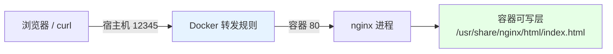
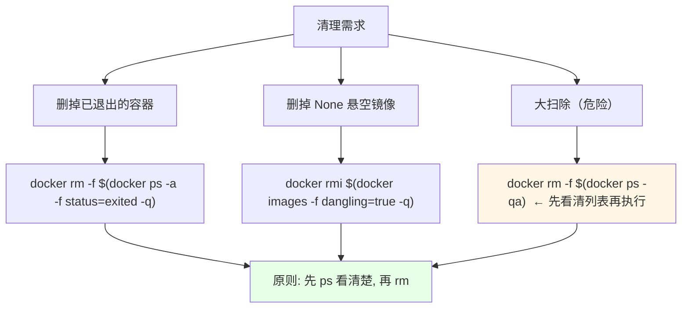

# Kubernetes 集群部署: Docker 基本命令下（-P 端口映射 / copy / commit / 容器清理）

镜像已经拉下来了，这一节把「怎么让它真的对外提供服务、怎么把容器里的改动固化成镜像、怎么收拾一堆退出的垃圾容器」三件事讲完。

结论先给：

- **前台启动靠的是镜像里的 `CMD`/`ENTRYPOINT`**：官方 nginx 镜像已经写成 `nginx -g "daemon off;"`，所以 `docker run` 不指定命令也能一直跑；反之一句裸 `nginx` 打完就退，容器立刻 `Exited`；
- **`-p` 是端口映射**：`-p 12345:80` 把宿主机 12345 打到容器 80，只有 65535 以内的端口才该往外挂；
- **`docker cp` 双向都能拷**：宿主机 → 容器（`docker cp x CONTAINER:/path`）和容器 → 宿主机，路径搞错就是「拷进去了但访问不到」；
- **`docker commit` 把运行中的容器固化成一个新镜像**：适合临时验证，正式交付还是要走 Dockerfile（后面那节）；
- **`docker run --rm -it` 退出即删** —— 这是避免机器上一堆 `Exited` 垃圾容器的正确姿势；
- **`docker rm -f $(docker ps -qa)` 是危险命令**，真用之前先确认过滤条件。

## 纲要

- 前台启动的真正来源：镜像的 CMD
- -p 端口映射与访问验证
- docker cp：双向拷贝文件
- docker history / commit：看变更与固化状态
- 删除镜像、容器与批量清理
- stop / start 的状态变化
- 常见排错

## 前台启动的真正来源：镜像的 CMD

```mermaid
flowchart TD
    A["官方 nginx 镜像的 Dockerfile 末尾"] --> B['ENTRYPOINT/CMD: nginx -g "daemon off;"']
    B --> C["docker run 不指定命令 -> 按 CMD 执行"]
    C --> D["nginx 在前台跑 -> 容器一直 Up"]
    E["裸敲 docker run nginx nginx"] --> F["nginx 自己 daemonize 到后台"]
    F --> G["容器里没有前台进程 -> 立刻 Exited"]
    D --> H["结论: 做镜像必须把应用放前台"]
    G --> H
    style H fill:#e6ffe6
    style F fill:#fff6e6
```

可以直接看官方镜像里是怎么写的：

```bash
# 看镜像的配置（CMD / Entrypoint / ExposedPorts 都在里面）
docker inspect nginx:1.14.2 --format '  Cmd: {{.Config.Cmd}}'
#   Cmd: [nginx -g daemon off;]
docker inspect nginx:1.14.2 --format '  ExposedPorts: {{json .Config.ExposedPorts}}'
#   ExposedPorts: {"80/tcp":{}}
```

```bash
# 场景一：因为镜像自带前台 CMD，直接跑就一直挂着
docker run -it nginx:1.14.2
#   （无输出，前台挂着，终端变成容器里的终端）

# 场景二：裸敲一个 nginx，执行完就退出
docker run nginx:1.14.2 nginx
#   STATUS: Exited (0)

# 场景三：加上 -g "daemon off;" 就能一直跑
docker run -d nginx:1.14.2 nginx -g "daemon off;"
docker ps
#   Up X seconds
```

| 写法 | 结果 |
| --- | --- |
| `docker run nginx` | 用镜像自带 CMD（前台）→ `Up` |
| `docker run nginx nginx` | nginx daemonize 到后台 → 立刻 `Exited` |
| `docker run nginx nginx -g "daemon off;"` | 显式前台 → `Up` |
| `docker run -it nginx` | 前台 + 交互终端，适合调试 |

**这条规则在做 Dockerfile 时同样适用**：镜像里所有进程都要前台启动，否则容器存在感只有零点几秒。

## -p 端口映射与访问验证

```bash
# 把宿主机端口映射到容器端口：  宿主端口:容器端口
docker run -d -p 12345:80 nginx:1.14.2

# 看映射关系
docker ps
# PORTS
# 0.0.0.0:12345->80/tcp

docker port "$CN_NAME"
# 80/tcp -> 0.0.0.0:12345
```

```text
-p 参数拆解（以 -p 12345:80 为例）：
├── 12345  宿主机（Node）上的端口
├── 80     容器里的业务端口（nginx 默认 80）
└── 规则: 宿主机 -p 参数 -> 容器端口
```



```bash
# 本机访问验证（前台跑的那台，用了 -it 也能另开窗口 curl）
curl -s -o /dev/null -w '%{http_code}\n' http://127.0.0.1:12345
# 200

# 看访问日志（前台启动的容器日志会打到控制台）
docker logs "$CN_NAME"
# 10.0.0.1 - - [..] "GET / HTTP/1.1" 200
```

> 端口只在 **65535 以内**才有意义，别拿一个大得离谱的数当宿主机端口；宿主机端口被占用时会报 `Bind: address already in use`，换一个即可。

## docker cp：双向拷贝文件

```bash
# 1. 先看容器里文件在哪（官方 nginx 的 html 在 /usr/share/nginx/html）
docker exec -it "$CN_NAME" ls /usr/share/nginx/html
# index.html  50x.html ...

# 2. 准备一个自己的页面
# 下面命令中的变量按你的集群环境赋值后再执行
printf '$H1hello from docker cp</h1>\n' > /tmp/index.html

# 3. 宿主机 -> 容器
docker cp /tmp/index.html "$CN_NAME":/usr/share/nginx/html/index.html

# 4. 再访问（缓存的话加 -H 'Cache-Control: no-cache'）
curl -s http://127.0.0.1:12345
# <h1>hello from docker cp</h1>
```

反过来也行：**容器 → 宿主机**。

```bash
# 把容器里的文件拷回本地
docker cp "$CN_NAME":/usr/share/nginx/html/50x.html /tmp/50x.html
ls -l /tmp/50x.html
```

| 方向 | 命令 | 常见坑 |
| --- | --- | --- |
| 宿主机 → 容器 | `docker cp /tmp/x.html $CN:/usr/share/nginx/html/index.html` | 目标路径要写**完整文件路径**，目录不存在就报错 |
| 容器 → 宿主机 | `docker cp $CN:/usr/share/nginx/html/50x.html /tmp/` | 宿主机目录要先存在 |
| 拷目录 | `docker cp /data $CN:/data` | 不带尾斜杠时目录会被整体拷进去 |

> 容器删了，`docker cp` 进去的文件**一起没了**（不 commit 的话）。所以上节那句「不 commit 的话文件会丢失」和这里是同一件事。

## docker history / commit：看变更与固化状态

```bash
# 看一个镜像的层级修改记录
docker history registry.example.com/nginx:1.14.2 --human
# IMAGE          CREATED       SIZE      CREATED BY
# <none>         3 weeks ago   1.16MB    nginx -g daemon off;
# <none>         3 weeks ago   0B        /bin/sh -c #(nop)  COPY file:...
# <none>         3 weeks ago   4.62MB    /bin/sh -c #(nop)  ADD deb...
```

**`commit` 用来把「一个跑着、改过东西的容器」固化成新镜像**：

```bash
# 场景: 往容器里塞了自己的 index.html，想把这台容器的状态保存下来
# 下面命令中的变量按你的集群环境赋值后再执行
printf '$H1saved by commit</h1>\n' > /tmp/index.html
docker cp /tmp/index.html "$CN_NAME":/usr/share/nginx/html/index.html

docker commit -a "itcodeba" -m "my nginx with custom index" "$CN_NAME" "mynginx:1.0"
# sha256:...

# 用新镜像起一个，确认文件在里面
docker run --rm -it mynginx:1.0 /bin/sh -c 'cat /usr/share/nginx/html/index.html'
# <h1>saved by commit</h1>
```

> `docker commit` 适用于**临时抢救/验证**；正式交付请走 Dockerfile（可复现、可 review、能重建），这是后面那节的主角。
> 忘记命令怎么写时用 `docker commit --help` 看参数：`-a` 作者、`-m` 说明、`-p` 提交时暂停容器。

## 删除镜像、容器与批量清理

```bash
# 看本地镜像
docker images

# 删镜像（要先删掉依赖它的容器）
docker rmi mynginx:1.0

# 删容器
docker rm "$CN_NAME"

# 强制删正在跑的容器
docker rm -f "$CN_NAME"

# 批量删已退出的容器
docker rm -f $(docker ps -a -f status=exited -q)

# 危险命令：根据 ID 把所有容器都删掉
docker rm -f $(docker ps -qa)
```



`docker images` 里那个 **`none` 的悬空镜像**：通常是某个镜像被打标覆盖后留下的旧层，确认没人用就能 `docker rmi` 掉。

## stop / start 的状态变化

```bash
docker ps -a --format '  {{.Names}}  {{.Status}}'

# 停掉（优雅退出，默认 10s 超时）
docker stop "$CN_NAME"
docker ps -a --format '  {{.Names}}  {{.Status}}'
#   demo-web  Exited (0)

# 再拉起来（不会重新创建，还是原来那个容器）
docker start "$CN_NAME"
docker ps --format '  {{.Names}}  {{.Status}}'
#   demo-web  Up 2 seconds
```

| 命令 | 语义 | 现象 |
| --- | --- | --- |
| `docker stop` | 停止容器 | 状态变 `Exited`，容器还在，`start` 能拉回来 |
| `docker start` | 启动已停止的容器 | 变 `Up`，**不会新建容器**，之前 `cp` 进去的文件还在 |
| `docker rm` | 删除容器 | 容器没了，`start` 也回不来 |
| `docker rm -f` | 强删（含运行中的） | 同上，但不等优雅退出 |

## 用 --rm 从源头少造垃圾容器

```bash
# 临时进去看一眼，退出就自动删掉，不留 Exited
docker run --rm -it nginx:1.14.2 /bin/sh

# 跑个命令拿个结果就走
docker run --rm nginx:1.14.2 nginx -v
# nginx version: nginx/1.14.2
```

```text
带 --rm 与不带 --rm 的区别：
├── 不带 --rm
│   ├── 每次 docker run 都留下一个容器记录
│   ├── 退出/报错的一堆堆积成 ps -a 的垃圾
│   └── 需要手动 docker rm -f $(docker ps -qaf status=exited)
└── 带 --rm
    ├── 终端一关容器自动删除
    ├── 适合短命令、临时调试
    └── 注意: 容器里的改动同样不会保留
```

## 常见排错

| 现象 | 原因 | 处理 |
| --- | --- | --- |
| 容器起来立刻 `Exited` | 没有前台进程 / 应用 daemonize 了 | 加 `-g "daemon off;"` 或改用 `ENTRYPOINT` 前台写法 |
| `-p` 起不来报 `address already in use` | 宿主机端口被别的容器/进程占了 | `ss -lnt \| grep 端口` 找占用者，或换端口 |
| `docker cp` 后访问还是老页面 | 拷错路径 / 浏览器缓存 | 进容器 `ls` 确认路径；curl 加 `Cache-Control: no-cache` |
| `docker cp` 报 `no such directory` | 目标目录不存在 | 先 `docker exec` 创建目录再拷 |
| `docker rmi` 报 `image is being used by running container` | 有容器在用 | 先 `docker rm -f <容器>` 再删 |
| `docker rm -f $(docker ps -qa)` 误删了要留的容器 | 过滤条件没写 | 批量前先 `docker ps -a` 看一眼列表 |
| commit 完新镜像起不来 | 原容器已停、进程没了 | commit 前确认容器是 `Up` 状态 |

## API 速览

| 能力 | 做法 | 关键参数 |
| --- | --- | --- |
| 看镜像前台命令是什么 | `docker inspect  --format '{{.Config.Cmd}}'` | 决定 run 后能否持久 |
| 对外暴露服务 | 端口映射 | `-p 宿主端口:容器端口` |
| 看映射关系 | `docker port <容器>` | 输出 `80/tcp -> 0.0.0.0:12345` |
| 宿主机 → 容器 | `docker cp 本地文件 容器:绝对路径` | 路径必须是容器里的完整路径 |
| 容器 → 宿主机 | `docker cp 容器:路径 本地目录` | 本地目录先建好 |
| 看镜像每层变更 | `docker history ` | 定位哪一层变大了 |
| 固化容器状态 | `docker commit -a -m <容器> <新镜像>` | 正式交付改用 Dockerfile |
| 删容器 | `docker rm` / `docker rm -f` | 正在跑的用 `-f` |
| 删镜像 | `docker rmi <镜像>` | 先删依赖它的容器 |
| 清退出容器 | `docker rm -f $(docker ps -a -f status=exited -q)` | 批量前先看列表 |
| 退出即删 | `docker run --rm -it  sh` | 防垃圾堆积 |
| 停 / 启容器 | `docker stop` / `docker start` | `start` 是复用原容器 |

## Demo 示例

一条龙脚本：**起 nginx → 映射端口 → 拷文件 → commit → 用新镜像起 → 清理**，把本节命令串起来验证。

```bash
#!/usr/bin/env bash
# docker-basics2.sh —— 端口映射 / cp / commit / 清理 全流程
set -euo pipefail

IMAGE="${IMAGE:-nginx:1.14.2}"
HOST_PORT="${HOST_PORT:-12345}"
CN_NAME="${CN_NAME:-demo-web}"
IMG_AFTER_COMMIT="mynginx:1.0"

log() { printf '\n[docker2] %s\n' "$*"; }
die() { printf '\n[docker2] ERROR: %s\n' "$*" >&2; exit 1; }

log "1. 起容器并映射宿主机端口"
docker rm -f "$CN_NAME" >/dev/null 2>&1 || true
docker run -d --name "$CN_NAME" -p "${HOST_PORT}:80" "$IMAGE"
sleep 2
docker ps --filter "name=^${CN_NAME}$" --format '  {{.Names}}  {{.Status}}  {{.Ports}}'

log "2. 验证端口通不通"
CODE="$(curl -s -o /dev/null -w '%{http_code}' "http://127.0.0.1:${HOST_PORT}")"
[ "$CODE" = "200" ] || die "访问 http://127.0.0.1:${HOST_PORT} 返回 ${CODE}"
echo "  [OK] HTTP $CODE"

log "3. 看镜像的前台启动命令（决定容器能不能一直挂着）"
docker inspect "$IMAGE" --format '  Cmd: {{.Config.Cmd}}'

log "4. 拷一个自己的页面进去"
# 下面命令中的变量按你的集群环境赋值后再执行
printf '$H1hello from docker cp</h1>\n' > /tmp/index.html
docker exec -it "$CN_NAME" ls -l /usr/share/nginx/html 2>/dev/null | sed 's/^/  /' || true
docker cp /tmp/index.html "${CN_NAME}":/usr/share/nginx/html/index.html
echo "  [OK] 已拷入 $(curl -s "http://127.0.0.1:${HOST_PORT}")"

log "5. commit 成新镜像"
docker commit -a "itcodeba" -m "custom index" "$CN_NAME" "$IMG_AFTER_COMMIT" | sed 's/^/  /'
echo "  [OK] ${IMG_AFTER_COMMIT}"
docker history "$IMG_AFTER_COMMIT" --human | head -3 | sed 's/^/  /'

log "6. 用新镜像起一个，确认改动在里面"
docker run --rm -d --name "verify-${CN_NAME}" -p "${HOST_PORT}2:80" "$IMG_AFTER_COMMIT"
sleep 2
curl -s "http://127.0.0.1:${HOST_PORT}2" | sed 's/^/  /'
docker rm -f "verify-${CN_NAME}" >/dev/null

log "7. 清理: 删测试容器 + 悬空镜像 + 已退出容器"
docker rm -f "$CN_NAME" >/dev/null || true
docker rmi "$IMG_AFTER_COMMIT" >/dev/null || true
docker rm -f $(docker ps -a -f status=exited -q) 2>/dev/null | sed 's/^/  rm: /'
docker rmi $(docker images -f dangling=true -q) 2>/dev/null | sed 's/^/  rmi: /' || true

log "8. 自检: 现在机器上还有多少容器/镜像"
docker ps -a --format '  {{.Names}}  {{.Status}}'
docker images --format '  {{.Repository}}:{{.Tag}}  {{.Size}}'

log "9. 提示"
cat <<TIP
  正式交付别用 commit, 写 Dockerfile 去 build
  排障四步: ps -a -> logs -> exec -it -> inspect
  临时调试一律加 --rm, 少留垃圾容器
TIP
```

## 总结

基本命令下这一节，真正需要在意的还是「容器状态和文件存亡」两条线。

- **容器能不能一直挂，取决于镜像里的进程是不是前台**：`docker inspect` 看 `Config.Cmd`，官方 nginx 是 `nginx -g "daemon off;"`，裸敲 `nginx` 就会秒退。
- **`-p 宿主端口:容器端口` 是唯一的对外暴露方式**，宿主机端口别超 65535，被占用会报 `address already in use`；`docker port` 能看到实际映射。
- **`docker cp` 两个方向都能用**，但进容器的路径必须是完整绝对路径，且容器一删改动全没 —— 这是 commit 存在的前提。
- **`docker commit -a -m` 把容器固化成新镜像**，适合临时验证；正式交付请写 Dockerfile，可复现可 review。
- **清理要讲顺序**：`docker rm -f $(docker ps -a -f status=exited -q)` 清退出的，`docker rmi $(docker images -f dangling=true -q)` 清悬空镜像；`docker rm -f $(docker ps -qa)` 这种全删命令执行前一定先 `docker ps -a` 看一眼列表。
- **`docker run --rm` 是防垃圾的最佳习惯**：临时调试、跑个命令就走，退出自动删除；`docker stop` 只是停，`docker start` 会复用原容器（里面拷进去的文件还在）。

