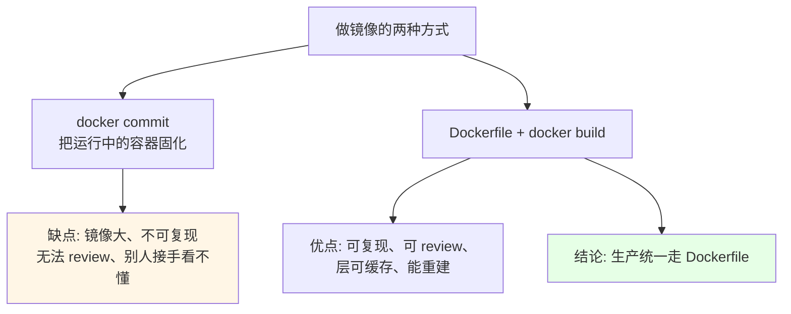
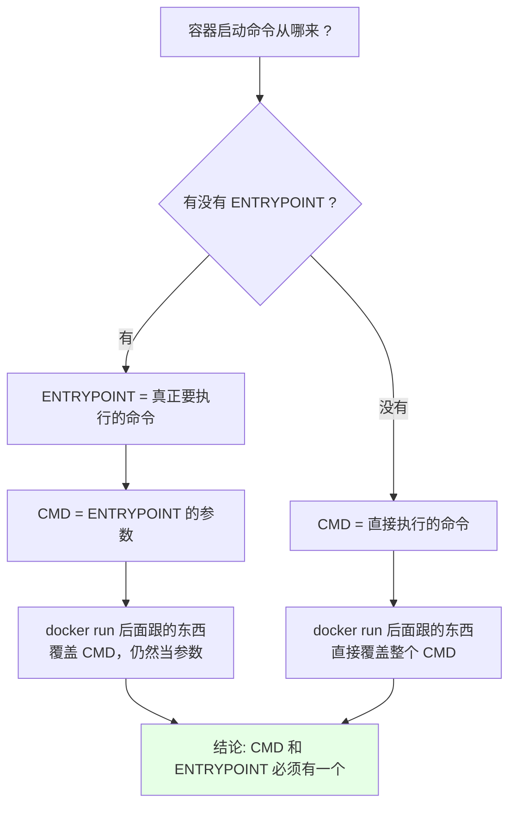
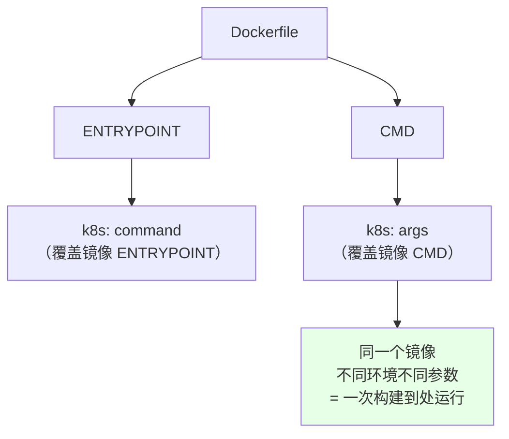
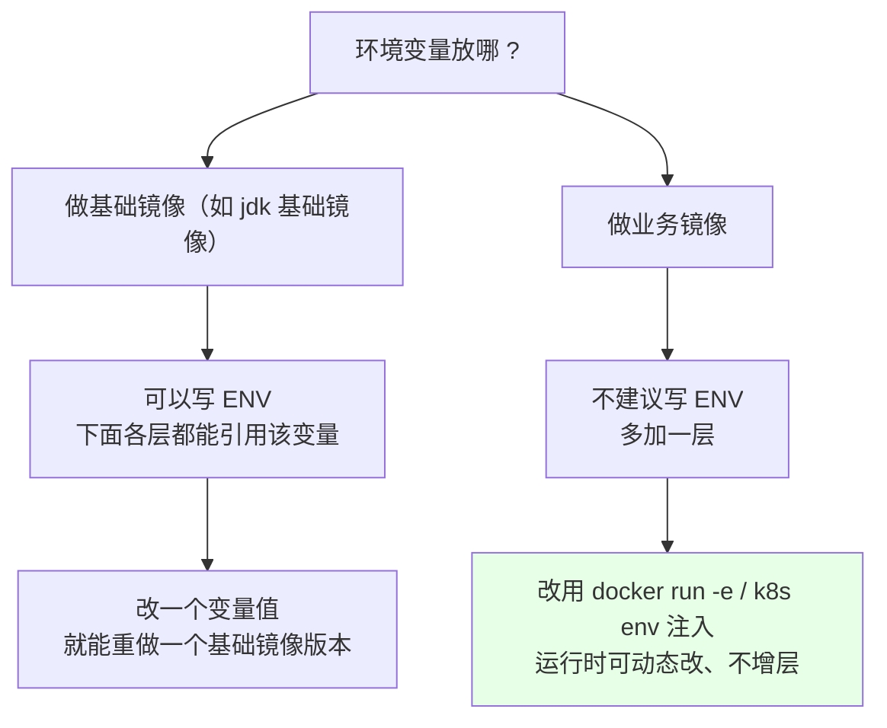
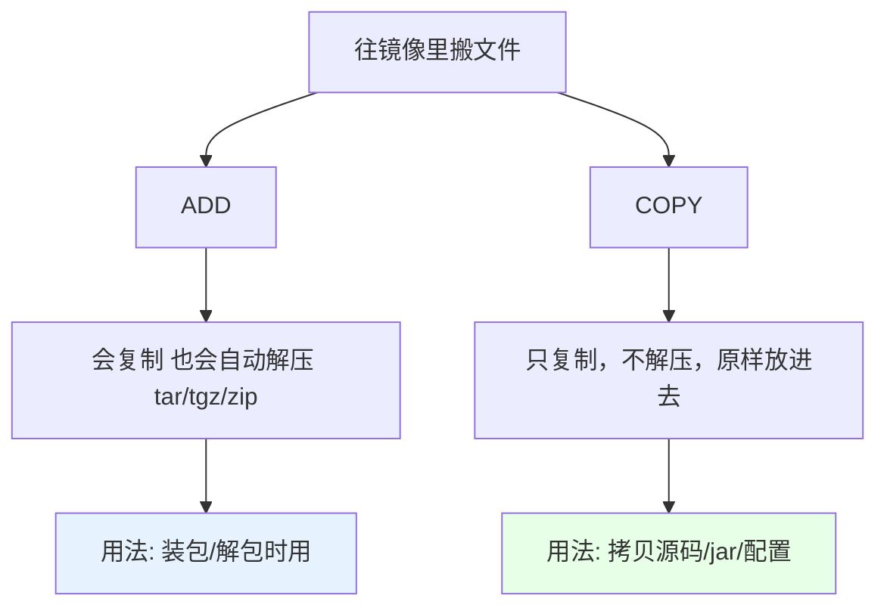
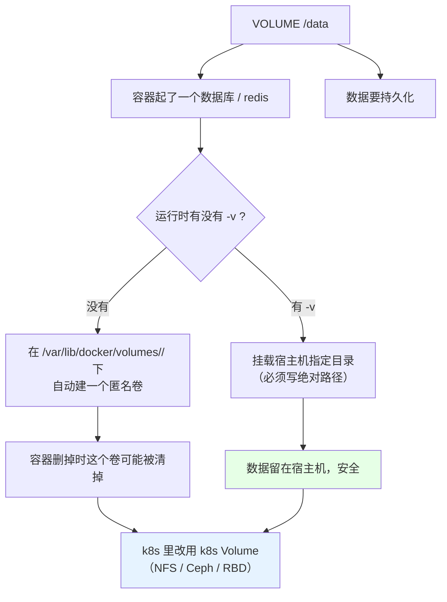
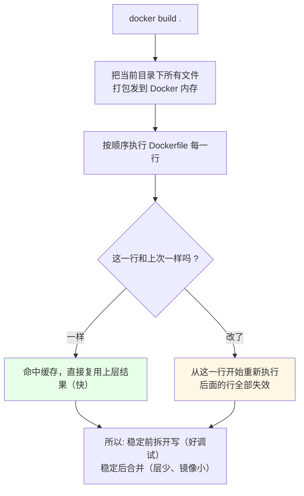

# Kubernetes 集群部署: Dockerfile 用法（FROM / RUN / COPY / ADD / ENTRYPOINT / CMD / VOLUME 全解）

上一节用 `commit` 也能做镜像，但**生产环境不建议用 commit** —— 它往往把镜像做得很大且不可复现。正式做法永远是写一个 Dockerfile 去 `build`。

结论先给：

- **指令那么多，真正天天写的是这几个**：`FROM` / `RUN` / `COPY` / `ADD` / `WORKDIR` / `ENV` / `EXPOSE` / `ENTRYPOINT` / `CMD` / `USER` / `VOLUME` / `LABEL`；
- **`ENTRYPOINT` + `CMD` 是「命令 + 参数」的组合关系**，不是二选一：有 ENTRYPOINT 时，CMD 会**变成它的参数**；两个必须有一个；
- **`ENTRYPOINT` 对应 k8s 的 `command`，`CMD` 对应 k8s 的 `args`**：所以生产常用的做法是「相同部分写进 ENTRYPOINT，不同环境参数交给 k8s 注入」；
- **`ADD` 与 `COPY` 的关键差异：ADD 会自动解压 tar 包，COPY 只复制不解压**；且 `COPY t/ /data` 拷进去的是目录里的**内容**而不是目录本身；
- **`docker build` 会把当前目录下所有文件发到构建上下文**，文件必须在 build 目录之下、用相对路径；
- **`RUN` 调试时一定加 `--rm`**，否则一堆 `Exited` 容器堆满机器；调试阶段多条 RUN 分开写，稳定后再合并成 `&&` 减少层数。

## 纲要

- 为什么不用 commit：Dockerfile vs commit
- FROM / LABEL / RUN：基础与执行指令
- EXPOSE：声明端口
- ENTRYPOINT 与 CMD 的组合与覆盖
- 对应到 k8s 的 command 与 args
- ENV：环境变量该写进镜像还是运行时注入
- ADD 与 COPY 的差异与目录陷阱
- WORKDIR / USER：工作目录与非 root 运行
- VOLUME：匿名卷与宿主机挂载
- 构建上下文、缓存与分层优化
- 常见排错

## 为什么不用 commit



| 维度 | `docker commit` | Dockerfile |
| --- | --- | --- |
| 可复现 | ❌ 依赖那台机器的状态 | ✅ 一份文件重建任意次 |
| 体积 | 往往偏大 | 可控（可合并 RUN） |
| 审查 | 看不到改了什么 | `git` 里能 review 每一行 |
| 缓存 | 无 | ✅ 命中层缓存，快 |
| 团队协作 | 传镜像 | 传代码 |

## FROM / LABEL / RUN

```dockerfile
# 1. 从哪个基础镜像出发
FROM openjdk:3.1-jdk-alpine       # 课程示例：nginx 基于 openjdk:3.1 装 nginx

# 2. 镜像元数据（作者信息，邮箱/姓名可以写）
LABEL author="itcodeba"
LABEL version="1.0" description="demo image"

# 3. 执行 shell 命令
RUN apk add --no-cache nginx
```

```text
RUN 里可能的包管理器（看基础镜像是哪个发行版）：
├── alpine  -> apk add          （最轻，演示常用）
├── centos  -> yum install -y   （新东源系）
└── ubuntu  -> apt-get install  （乌班图系）
```

| 指令 | 作用 | 注意点 |
| --- | --- | --- |
| `FROM` | 指定基础镜像 | 必须是第一条有效指令 |
| `LABEL` | 加标签（作者、版本、说明） | 旧写法 `MAINTAINER` 新版 Docker 不推荐，用 `LABEL` |
| `RUN` | 构建阶段执行命令 | 每一行一层，调试完要合并 |

**RUN 的分层优化（这一条很值钱）**：

```text
调试阶段（分开写，改一条只重跑它后面）：
├── RUN useradd -u 1010 app
├── RUN mkdir -p /home/app/data
└── RUN chown -R app:app /home/app
    # 第 18 行写错，重 build 时前 17 行命中缓存不再执行
    # 调试期这么写最省时间

稳定之后（合并，减少层数与体积）：
└── RUN set -eux; useradd -u 1010 app \
      && mkdir -p /home/app/data \
      && chown -R app:app /home/app
    # 层数少一层，镜像就小一截
```

`docker build -t` 之后**记得推到仓库**；`build -t` 没写仓库地址，`push` 就默认推到 Docker Hub 官方仓库了。

## EXPOSE：声明端口

```dockerfile
EXPOSE 80
```

`EXPOSE` 只是**声明这个镜像用哪个端口**，容器实际对外暴露还是靠 `docker run -p` / k8s 的端口配置。nginx 起的是 80，就 `EXPOSE 80`；写成别的或者不写都不影响启动。

## ENTRYPOINT 与 CMD 的组合

这是 Dockerfile 里最容易搞混的一对：



```dockerfile
FROM openjdk:3.1-jdk-alpine
ENTRYPOINT ["java", "-jar", "/app/demo.jar"]
CMD ["--spring.profiles.active=test"]
```

```bash
# 1) 只跟参数 -> 参数进 CMD
docker run myapp:1.0
# 实际执行: java -jar /app/demo.jar --spring.profiles.active=test

# 2) 换参数 -> 覆盖 CMD
docker run myapp:1.0 --spring.profiles.active=uit
# 实际执行: java -jar /app/demo.jar --spring.profiles.active=uit

# 3) 整个启动命令换掉 -> 用 --entrypoint（比覆盖 CMD 麻烦）
docker run --entrypoint java myapp:1.0 -version
```

```text
覆盖方式对比：
├── CMD 的覆盖（简单）
│   └── docker run <镜像> <新命令/新参数>     # 后面直接跟
└── ENTRYPOINT 的覆盖（麻烦）
    └── docker run --entrypoint <新入口> <镜像> <参数>
```

| 规则 | 说明 |
| --- | --- |
| 二者必须有一个 | 都没有容器起不来 |
| `CMD` 可被覆盖 | `docker run` 后面直接跟就覆盖了 |
| 有 ENTRYPOINT 时 | `CMD` 退化成 ENTRYPOINT 的**参数** |
| ENTRYPOINT 覆盖 | 只能 `--entrypoint`，麻烦，所以少动 |

## 对应到 k8s 的 command 与 args



| Dockerfile | Kubernetes | 语义 |
| --- | --- | --- |
| `ENTRYPOINT` | `command` | 容器真正启动的命令 |
| `CMD` | `args` | 传给命令的参数 |

**生产推荐做法**：把「相同部分」打进 ENTRYPOINT，把「随环境变的参数」留在 CMD，由 k8s 资源文件注入：

```dockerfile
# 镜像里只固化「不变的骨架」
ENTRYPOINT ["java", "-jar", "/app/demo.jar"]
CMD ["--spring.profiles.active=test"]
```

```yaml
apiVersion: apps/v1
kind: Deployment
metadata:
  name: demo-app
spec:
  replicas: 2
  selector:
    matchLabels:
      app: demo-app
  template:
    metadata:
      labels:
        app: demo-app
    spec:
      containers:
        - name: demo
          image: registry.example.com/demo:1.0
          command: ["java", "-jar", "/app/demo.jar"]
          args: ["--spring.profiles.active=prod"]
```

好处很直接：**同一个镜像既能跑测试环境又能跑生产环境，只靠 `args` 区分** —— 这就是 k8s 那句「一次构建到处运行」的落地方式。

## ENV：写进镜像还是运行时注入

```dockerfile
# 写法一：KV 形式
ENV JAVA_HOME=/usr/lib/jvm/java-11
ENV PATH=$PATH:/usr/lib/jvm/java-11/bin

# 写法二：等号形式（等价）
ENV JAVA_HOME=/usr/lib/jvm/java-11
```



| 场景 | 做法 | 理由 |
| --- | --- | --- |
| 基础镜像（jdk / nginx） | `ENV` 写进 Dockerfile | 下层可引用，改值即换版本 |
| 业务镜像 | `docker run -e KEY=VALUE` 或 k8s `env` | **不产生额外层**，且能按环境动态调整 |

另外 **ENV 的书写顺序要注意**：已经执行过的层里没有这个变量，写在前面的行会引用失败；**新变量尽量往下面写，才能复用已有的缓存层**。

## ADD 与 COPY 的差异与目录陷阱



```dockerfile
# ADD：会自动解压
ADD demo.tar.gz /app/          # 包会被解开到 /app/
ADD https://example.com/x.tar.gz /tmp/   # ADD 还支持 URL（COPY 不支持）

# COPY：原样拷贝
COPY target/demo.jar /app/demo.jar
COPY nginx.conf /etc/nginx/nginx.conf
```

**目录拷贝的坑**：

```text
当前目录:
├── Dockerfile
└── t/
    ├── a.txt
    └── b.txt

COPY t /data          -> /data 下是 a.txt b.txt？ 不是
                         实际: t 这个目录本身没进来
                         结果: /data 不存在（镜像构建会失败）
COPY t/ /data/        -> 拷进去的是 t 目录里的内容
COPY t /data/t        -> /data/t 下才是 a.txt b.txt（推荐，看得清）
```

| 指令 | 解压 | URL | 用途 |
| --- | --- | --- | --- |
| `ADD` | ✅ 自动解 tar/tgz/zip | ✅ 支持 | 放已经打好包的依赖 |
| `COPY` | ❌ 不解压 | ❌ 不支持 | **日常首选**，拷源码/jar/配置 |

**还有一个构建上下文的硬约束**：`docker build` 会把**当前目录（构建上下文）下所有文件**打包发到 Docker 的内存里再构建，所以：

- 你的文件必须在执行 build 的那个目录之下；
- 用相对路径引用，写绝对路径会报找不到文件；
- 目录里东西太多会拖慢构建 —— 用 `.dockerignore` 排除无关文件（类似 `.gitignore`）。

## WORKDIR / USER

```dockerfile
FROM registry.example.com/openjdk:11-jre-alpine

# 建用户（1010 是 UID）
RUN set -eux; addgroup -g 1010 app; adduser -u 1010 -G app -s /sbin/nologin app

# 切换工作目录：进容器默认就在这里，相对路径以它为基准
WORKDIR /home/app

# 拷应用
COPY demo.jar /home/app/demo.jar
COPY config/ /home/app/config/

# 以非 root 身份运行（业务容器不建议用 root）
USER 1010

EXPOSE 8080
ENTRYPOINT ["java", "-jar", "/home/app/demo.jar"]
CMD ["--server.port=8080"]
```

```text
WORKDIR 的作用（拿 nginx 举例）：
├── 不设 WORKDIR: docker exec 进去默认在 /
└── 设 WORKDIR /usr/share/nginx/html
    └── 进去就在 /usr/share/nginx/html，直接能看到代码文件
    └── 配合 USER 非 root: 既切了目录又保证安全
```

| 指令 | 作用 | 生产建议 |
| --- | --- | --- |
| `WORKDIR` | 设工作目录，后续的 `COPY`/`RUN` 相对路径都基于它 | 必设，方便调试与排障 |
| `USER` | 指定运行容器的用户（默认 root） | **业务镜像一律非 root**，root 跑容器对宿主机有风险 |

`nginx` 官方镜像把代码放在 `/usr/share/nginx/html`，把 `WORKDIR` 设成那里，进容器直接就能看到文件，不用再 `cd`。

## VOLUME：匿名卷与宿主机挂载

```dockerfile
# 在容器里创建一个挂载点（匿名卷）
VOLUME /data
```



```bash
# 匿名卷：不指定 -v 也能起，Docker 自动在 volumes 目录建一份
docker run -d mysql:5.7
docker inspect "$CN_NAME" --format '  {{range .Mounts}}{{.Name}}{{end}}'

# 挂载宿主机目录：必须写绝对路径
docker run -d -v /data/mysql:/var/lib/mysql mysql:5.7
```

`VOLUME` 主要解决一个实际问题：**有些不是为容器开发的程序，习惯把日志/数据写死在某个目录，容器里没这个目录、又限制了用户没权限创建，程序直接起不来** —— 用 `VOLUME` 或 `RUN mkdir` 把这个目录先造出来即可。

> 到了 k8s 编排阶段，**Docker 的 volume 用得很少**。k8s 有自己生命周期更长的 Volume 概念（Pod 删了卷还在），通常配 NFS / Ceph / RBD 这种，通过资源文件挂到容器目录里。

## 构建上下文、缓存与分层优化

```bash
# 默认找当前目录下的 Dockerfile
docker build -t demo:1.0 .

# 指定文件名 + 指定上下文目录
docker build -f ./t/Dockerfile -t demo:1.0 ./t

# 调试时一定加 --rm（-t 分配终端，--rm 退出即删容器）
docker build --rm -t demo:1.0 .
```



缓存的实际表现：第一次 build 慢（要真正执行），第二次 build 快很多（前面几层直接复用）。**改动越靠后，缓存命中越多；改动 `FROM` 那一行，后面全是新的。**

```text
一次典型的 build 输出（能看出层与缓存）：
Step 1/9 : FROM openjdk:3.1-jdk-alpine
 ---> 3f2b1c9a4d5e
Step 2/9 : LABEL author="itcodeba"
 ---> Using cache
 ---> 8a1c0d3e77b4
Step 3/9 : RUN set -eux; apk add --no-cache nginx
 ---> Running in 1f2e3d4c5b6a
 ---> 出错了 / 完成
Successfully tagged demo:1.0
```

| 现象 | 原因 | 处理 |
| --- | --- | --- |
| build 报 `COPY failed: file not found` | 文件不在构建上下文里 / 写了绝对路径 | 文件放进 build 目录，用相对路径 |
| 第二层里 `echo $JAVA_HOME` 为空 | ENV 写在后面，前面的层还没定义 | 新变量往 Dockerfile 下面写 |
| 镜像越来越大 | RUN 层数太多 | 稳定后合并 RUN 为 `&&` 链式 |
| build 很慢 | 上下文里带了 big 目录 | 加 `.dockerignore` 排除 |
| 容器起完就退出 | CMD 进程不是前台 | 应用放前台（见上一节） |
| 用 `COPY t /data` 目录没进去 | 拷的是目录里的内容，不含目录本身 | 写 `COPY t /data/t` |

## API 速览

| 能力 | Dockerfile 写法 | k8s / 运行时的对应 |
| --- | --- | --- |
| 选基础镜像 | `FROM openjdk:11-jre-alpine` | — |
| 加元数据 | `LABEL author=...` | 旧 `MAINTAINER` 已不推荐 |
| 构建期跑命令 | `RUN apk add --no-cache nginx` | 调试加 `--rm` |
| 声明端口 | `EXPOSE 80` | `containerPort` / Service |
| 固定启动命令 | `ENTRYPOINT ["java","-jar","/app/x.jar"]` | `command` |
| 环境参数 | `CMD ["--spring.profiles.active=test"]` | `args` |
| 环境变量（基础镜像） | `ENV JAVA_HOME=/path` | 业务镜像改用 `-e` / `env` |
| 拷文件（不解压） | `COPY demo.jar /app/` | 日常首选 |
| 拷包并解压 | `ADD x.tar.gz /app/` | 用 tar 包时 |
| 设工作目录 | `WORKDIR /home/app` | `workingDir` |
| 非 root 运行 | `USER 1010` | `securityContext.runAsUser` |
| 声明数据卷 | `VOLUME /data` | k8s Volume / PVC |
| 控制层与缓存 | 调试拆开、稳定合并 | `.dockerignore` |

## Demo 示例

一个**可直接 build 跑通**的 Dockerfile 工程：普通用户 + 非 root + 前台启动 + 可注入参数。

```text
demo 构建上下文目录:
├── Dockerfile
├── .dockerignore
├── src
│   └── app.jar
└── config
    └── application.properties
```

```dockerfile
# ---- 构建阶段（多阶段写法会在下一节展开）----
FROM registry.example.com/openjdk:11-jre-alpine AS builder

WORKDIR /build
COPY src /build/src
RUN set -eux; ls -l /build/src

# ---- 运行阶段 ----
FROM registry.example.com/openjdk:11-jre-alpine

# 1) 元信息
LABEL author="itcodeba"
LABEL version="1.0"

# 2) 建普通用户（不用 root 跑业务）
RUN set -eux; \
    addgroup -g 1010 app && \
    adduser -u 1010 -G app -s /sbin/nologin app

# 3) 工作目录 + 拷配置与 jar（注意 COPY 的是目录里的内容）
WORKDIR /home/app
COPY config/ /home/app/config/
COPY src/app.jar /home/app/app.jar

# 4) 声明端口 / 数据卷
EXPOSE 8080
VOLUME /home/app/logs

# 5) 非 root 运行
USER 1010

# 6) 固定骨架 + 可注入参数（同一个镜像跑不同环境）
ENTRYPOINT ["java", "-jar", "/home/app/app.jar"]
CMD ["--spring.profiles.active=test"]
```

```bash
#!/usr/bin/env bash
# build-demo.sh —— 构建并验证这个 Dockerfile
set -euo pipefail

IMG="${IMG:-registry.example.com/demo:1.0}"
CTX="${CTX:-$(pwd)}"

log() { printf '\n[build] %s\n' "$*"; }

log "0. 构建上下文自检（文件必须在上下文里）"
ls -l "$CTX"/Dockerfile "$CTX"/src/app.jar | sed 's/^/  /'

log "1. build（--rm 保证不留垃圾中间容器）"
docker build --rm -t "$IMG" "$CTX"

log "2. 看层与体积（有没有多余的层）"
docker history "$IMG" --human | head -10 | sed 's/^/  /'

log "3. 用默认参数起（CMD 生效）"
docker run --rm -d --name demo-test -p 8080:8080 "$IMG"
docker exec demo-test whoami | sed 's/^/  运行用户: /'
docker exec demo-test pwd | sed 's/^/  工作目录: /'
docker rm -f demo-test >/dev/null

log "4. 覆盖 CMD：换成生产参数"
docker run --rm "$IMG" --spring.profiles.active=prod

log "5. 覆盖 ENTRYPOINT：整个换命令"
docker run --rm --entrypoint java "$IMG" -version

log "6. 运行期注入环境变量（不增镜像层）"
docker run --rm -e "JAVA_OPTS=-Xmx256m" "$IMG" --spring.profiles.active=uit

log "7. 收尾提示"
cat <<TIP
  构建期记得推仓库: docker push ${IMG}
  调试时把 RUN 拆开写，稳定后合并成 && 减少层数
# 下面命令中的变量按你的集群环境赋值后再执行
  排障: docker history $IMAGE   看层
        docker run --rm -it $IMAGE sh   进去看文件与用户
TIP
```

## 总结

Dockerfile 写的不是命令列表，而是**一层一层的构建契约**。

- **生产做镜像统一走 Dockerfile，不用 commit**：可复现、可 review、能命中层缓存、体积可控。
- **`ENTRYPOINT` 是命令、`CMD` 是参数**：有 ENTRYPOINT 时 CMD 退化成它的参数；两者必居其一。ENTRYPOINT 对应 k8s 的 `command`，CMD 对应 `args` —— 所以同一个镜像跑测试/生产只改 `args` 就够。
- **`COPY` 是日常首选，`ADD` 只在需要自动解压 tar 包时用**；`COPY t /data` 拷进去的是目录内容而不是目录本身，想保留目录就写 `COPY t /data/t`。
- **`ENV` 留给基础镜像，业务镜像用运行期注入**（`docker run -e` / k8s `env`）：少一层、可动态改。新变量往下面写，才能复用前面的缓存层。
- **`WORKDIR` + `USER` 是安全与体验的组合**：WORKDIR 让进容器就能看到代码，USER 让业务不跑 root（对应 k8s 的 `runAsUser`）。
- **`RUN` 调试拆开、稳定合并**：拆开命中缓存好调试，合并成 `&&` 少一层少一点体积；build 一定加 `--rm`，并用 `.dockerignore` 控制上下文大小。

