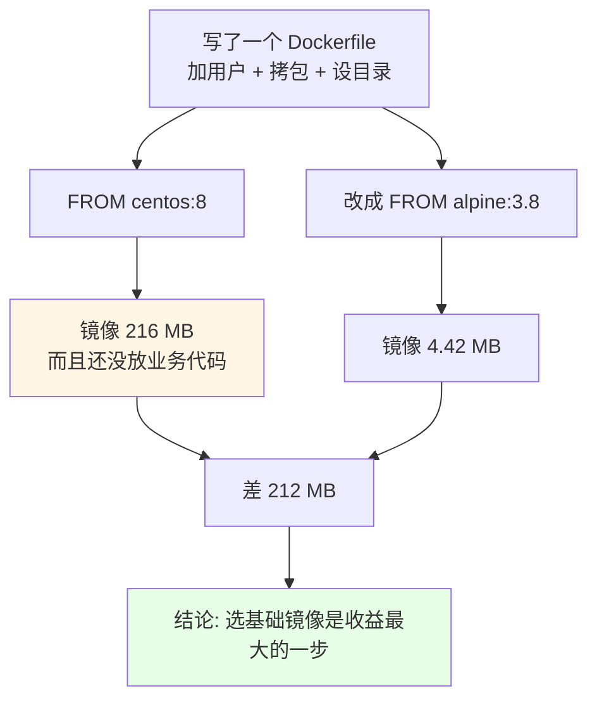
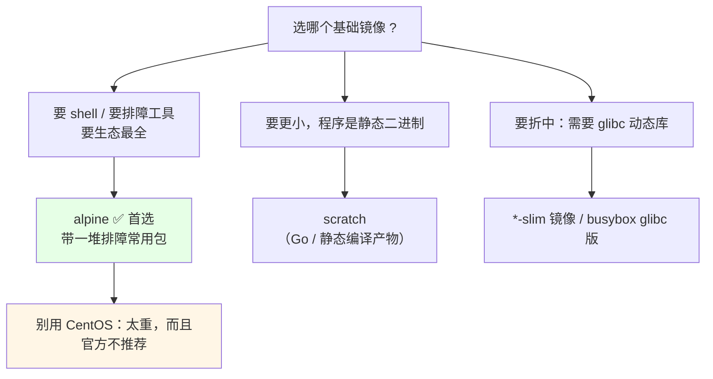
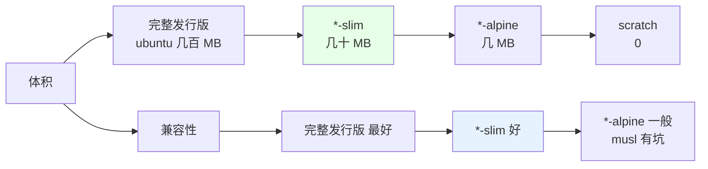

# Kubernetes 集群部署: 制作小镜像上（基础镜像选型与 alpine 精简实测）

Dockerfile 会写了，但**写出来的镜像未必小**。课程演示环境是 CentOS，做出来的镜像 **216 MB**，而里面其实只加了几个用户、拷了个包，还没放业务代码 —— 真把代码加上，几百兆甚至上 G 都很正常。

结论先给：

- **生产绝不要用 CentOS 做基础镜像**：换成 `alpine`（官方推荐），**同样功能从 216 MB 直接掉到 4.42 MB，省了 212 MB**；
- `busybox` 也能用，但它**本身带着一些 bug**（部分 shell 语法不好使），首选仍是 alpine；
- `scratch` 是真正的空镜像（什么都没有），适合 Go 这类**静态二进制**；
- **优先选官方镜像的 `-slim` 变体**，别从零自己搓基础镜像 —— 官方那套「装完就清缓存」的 Dockerfile 做得比你好；
- **alpine 用的是 musl libc，不是 glibc**：你的 Go/C Python 如果开了 `CGO` 依赖系统库，塞进 alpine 会跑不起来，这时用 `*-slim` 或 busybox/glibc 镜像；
- **语言镜像（nodejs / php / golang / python）直接用官方现成的 tag**，别重复造轮子。

## 纲要

- 为什么镜像会变大：先看实测数字
- 基础镜像选型：alpine / busybox / scratch
- CentOS → alpine 改写实战
- alpine 与 glibc / CGO 的兼容问题
- slim 镜像是什么、什么时候用
- 各语言镜像怎么选
- 常见排错

## 为什么镜像会变大：先看实测数字



| 基础镜像 | 体积 | 备注 |
| --- | --- | --- |
| `centos:8` | **215 MB** | 演示用，生产不用 |
| `alpine:3.8` | **4.42 MB** | 官方推荐首选，还自带排障工具 |
| `busybox` | 更小 | 有部分 bug，shell 语法兼容性一般 |
| `scratch` | 0（空） | 只能装静态二进制 |
| `alpine + slim` 变体 | 几 MB 级 | 预装常用动态库，折中方案 |

**这一步是整个瘦身流程里性价比最高的**：换一行 `FROM`，百来兆直接消失；后面的多阶段构建、scratch 都是在它基础上再抠。

## 基础镜像选型：alpine / busybox / scratch



```text
常见基础镜像的取舍：
├── centos:8 / ubuntu:20.04
│   └── 完整发行版，体积大（几百 MB），生产不推荐
├── alpine:latest
│   ├── 官方推荐首选
│   ├── 极轻（4~6 MB）
│   ├── 自带排障常用工具（curl / sh / wget ...）
│   └── 注意: musl libc，不是 glibc
├── busybox
│   ├── 更小，但自带一些 bug，部分 shell 语法不好使
│   └── 适合极简容器
├── scratch
│   ├── 完全空白，连 shell 都没有
│   └── 只能跑自己静态链接进去的二进制（Go 最合适）
└── *-slim（node:*-slim / python:*-slim）
    └── 官方的精简变体，预装常用动态库，折中选择
```

## CentOS → alpine 改写实战

同一个 Dockerfile，只换 `FROM` 和几条命令：

```dockerfile
# ❌ 演示版：CentOS 底座
FROM centos:8
LABEL author="itcodeba"
RUN useradd -u 1010 app
RUN mkdir -p /home/app
WORKDIR /home/app
```

```dockerfile
# ✅ 生产版：alpine 底座
FROM alpine:3.8
LABEL author="itcodeba"

# 1) alpine 上没有 useradd，用 adduser
#    加 -D 表示不设密码（容器里没必要设密码）
RUN adduser -D -u 1010 app

# 2) alpine 没有 mkdir -p？有的，但需要 -p 显式
RUN mkdir -p /home/app

WORKDIR /home/app
```

```bash
# 构建
docker build --rm -t demo:alpine .

# 对比体积
docker images demo --format '  {{.Repository}}:{{.Tag}}  {{.Size}}'
#   demo:centos   216MB
#   demo:alpine   4.42MB

# 进去确认：alpine 里 shell 是 /bin/sh，不是 bash
docker run --rm -it demo:alpine /bin/sh
/ # whoami
1010
/ # apk info | head        # alpine 的包管理器是 apk
```

```text
alpine 与centos 的命令差异（照抄会失败的地方）：
├── 用户管理
│   ├── centos: useradd -u 1010 app
│   └── alpine: adduser -D -u 1010 app
├── 包管理
│   ├── centos: yum install -y xxx
│   └── alpine: apk add --no-cache xxx
├── shell
│   ├── centos: /bin/bash
│   └── alpine: /bin/sh（没有 bash）
└── 目录
    └── 两者都要 mkdir -p，都能用
```

官方镜像（比如官方 nginx）就是这么干的：**基于 alpine → `apk add` → 用完清缓存**，一层 `RUN` 里 `apk add` 和 `rm -rf /var/cache/apk/*` 一起做，缓存不留在层里。

## alpine 与 glibc / CGO 的兼容问题


```bash
# 用 CGO 的话，放进 alpine 会报这类错
docker run --rm -v "$PWD":/app my-go:1.0 /app/server
# standard_init_linux.go:190: exec-user: no such file or directory
# 或: error while loading shared libraries: libxxx.so.1

# 解法一：Go 编译期关掉 CGO（最干净）
CGO_ENABLED=0 GOOS=linux go build -a -ldflags '-s -w' -o server .
# -s -w 还能顺手去掉符号表，二进制再瘦一圈

# 解法二：换 slim 镜像
docker build -f Dockerfile.slim -t my-go:slim .
```

| 场景 | 推荐基础镜像 |
| --- | --- |
| 纯静态二进制（Go/静态编译 C++） | `scratch` 或 `alpine` |
| Go 用了 net / os/user（要解析域名、读 /etc/passwd） | **必须关 CGO 或上 slim** |
| Python 装了图像识别 / numpy / 人工智能相关包 | `python:*-slim` |
| Python 只写代码不碰系统库 | `python:*-alpine` |
| Node / PHP / Java | 官方镜像现成 tag，别自己搓 |
| 确实要 glibc | busybox 的 glibc 版 / `debian:*-slim` |

> 别为了「省几兆」纠结，真正值钱的是**几百兆**的差距。Python 一旦装上图像/AI 相关的依赖，体积很容易从几十 M 冲到 1G+，这时候换 slim 才有意义。

## slim 镜像是什么、什么时候用

```text
slim 的理念（折中方案）：
├── 不是 alpine（musl，可能有兼容问题）
├── 也不是完整发行版（glibc + 一堆包，几百 MB）
└── 是「带常用动态库的精简 glibc 环境」
    ├── node:14-slim      # 有 glibc 常用库 + node 运行时
    ├── python:3.9-slim
    └── debian:bullseye-slim
```



`*-slim` 相当于一个「中和」选项：**它已经把你可能需要的那些动态库装好了**，不用自己去 alpine 里硬装 `glibc`（那非常痛苦）。alpine 里想装 glibc 也能装，但过程麻烦，不如直接用官方的 slim。

## 各语言镜像怎么选

```text
语言基础镜像的选型原则 —— 别重复造轮子：
├── Java
│   ├── openjdk:*-jre-alpine / openjdk:*-jdk-alpine
│   └── FROM 一个装好 JDK 的官方镜像，只 COPY 你的 jar
├── NodeJS
│   ├── node:14-alpine / node:14-slim
│   └── 有装好 node 版本的 tag，直接拿
├── PHP
│   ├── php:7.4-fpm-alpine
│   └── 官方已包好 php 版本，别从零装
├── Go
│   ├── 官方 golang:*-alpine 做构建阶段（多阶段构建，下一节）
│   └── 运行阶段放 scratch / alpine / distroless
└── Python
    ├── python:3.9-alpine    # 纯 python 包
    └── python:3.9-slim      # 有 C 扩展依赖（numpy / PIL / AI 相关）
```

> **推荐做法：基于「已经装好语言版本」的官方镜像去做修改，而不是从零开始装一个语言。** 你手搓的基础镜像不会比官方做得好，还多了一堆包管理器的缓存层。

| 你想做的事 | 别这么做 | 应该这么做 |
| --- | --- | --- |
| 部署 Java | `FROM centos` + `yum install jdk` | `FROM openjdk:11-jre-alpine` + `COPY app.jar` |
| 部署 Node | `FROM ubuntu` + `apt install nodejs` | `FROM node:14-alpine` |
| 部署 PHP | `FROM centos` + `yum install php` | `FROM php:7.4-fpm-alpine` |
| 部署 Go | 自己装 Go 环境 | 多阶段构建（下一节），运行期用 `scratch` |

## 常见排错

| 现象 | 原因 | 处理 |
| --- | --- | --- |
| `adduser: no such user` 或 `useradd: command not found` | alpine 没有 `useradd` | 用 `adduser -D -u 1010 app` |
| `/bin/bash: not found` | alpine 没 bash | 用 `/bin/sh` |
| 程序报 `no such file or directory` | musl 缺动态库 / 静态二进制缺 shell | 换 slim 或关 CGO 重编 |
| `standard_init_linux.go: exec-user` 报错 | 用了 CGO 依赖 glibc | `CGO_ENABLED=0` 重编译或换 slim |
| `apk add` 后镜像没瘦 | 缓存留在了层里 | 一条 RUN 里 `apk add ... && rm -rf /var/cache/apk/*` |
| 镜像还是几百 MB | 基础镜像就那么大 | 换 alpine/slim，先看 `FROM` |
| 容器内没有 curl / wget 排障 | alpine 默认没装 | `RUN apk add --no-cache curl` 或保留完整系镜像 |

## API 速览

| 能力 | 做法 | 关键点 |
| --- | --- | --- |
| 换小底座 | `FROM alpine:3.8` | 216MB → 4.42MB，收益最大 |
| 建用户 | `RUN adduser -D -u 1010 app` | `-D` 不设密码，别用 `useradd` |
| 装包并清缓存 | `RUN apk add --no-cache curl` | --no-cache 自带清理 |
| 静态二进制底座 | `FROM scratch` | 只能放静态产物 |
| CGO 依赖兜底 | `FROM node:14-slim` | 预装常用动态库 |
| Go 关 CGO | `CGO_ENABLED=0 go build` | 同时 `-ldflags '-s -w'` 再瘦一圈 |
| 语言镜像选型 | 官方 `*-alpine` / `*-slim` tag | 别自己装语言 |
| 看体积 | `docker images / docker history` | 先用 FROM 砍几百兆 |

## Demo 示例

一个**同一个 Dockerfile 的 CentOS 版与 alpine 版对比**脚本，实测体积差：

```bash
#!/usr/bin/env bash
# shrink-baseline.sh —— 对比 centos / alpine 底座的镜像体积
set -euo pipefail

log() { printf '\n[shrink] %s\n' "$*"; }

log "1. 准备 Dockerfile（-CentOS 版）"
mkdir -p /tmp/ctx-centos
cat > /tmp/ctx-centos/Dockerfile <<'EOF'
FROM centos:8
LABEL author="itcodeba"
RUN useradd -u 1010 app
RUN mkdir -p /home/app
WORKDIR /home/app
EOF

log "2. 准备 Dockerfile（-alpine 版，同一个功能）"
mkdir -p /tmp/ctx-alpine
cat > /tmp/ctx-alpine/Dockerfile <<'EOF'
FROM alpine:3.8
LABEL author="itcodeba"
RUN adduser -D -u 1010 app
RUN mkdir -p /home/app
WORKDIR /home/app
EOF

log "3. 分别构建"
docker build --rm -t demo-centos:1.0 /tmp/ctx-centos
docker build --rm -t demo-alpine:1.0 /tmp/ctx-alpine

log "4. 体积对比"
docker images demo-centos:1.0 demo-alpine:1.0 \
  --format '  {{.Repository}}:{{.Tag}}  {{.Size}}'

log "5. 进去看实际差异（shell / 用户 / 有没有 curl）"
echo "  ---- alpine ----"
docker run --rm demo-alpine:1.0 /bin/sh -c 'echo pwd=$(pwd); echo user=$(whoami); command -v curl || echo "curl 未装"'
echo "  ---- 说明 ----"
cat <<TIP
  alpine 里 shell 是 /bin/sh, 包管理是 apk
  用 apk --no-cache 装包不会留缓存层
  如果程序跑不起来(缺 so), 换成 *-slim 或关掉 CGO
TIP

log "6. 产物清单"
docker images | head -5 | sed 's/^/  /'
```

## 总结

镜像瘦身的第一步不在 Dockerfile 的末段，而在第一行 `FROM`。

- **生产别用 CentOS 做基础镜像**：实测同样功能 centos 216 MB、alpine 4.42 MB，**一步省 212 MB**，这是所有优化手段里最划算的。
- **alpine 是官方推荐首选**，自带排障常用包；busybox 更小但有 bug；scratch 是完全空白，只能放静态二进制。
- **alpine 用 musl 而不是 glibc**：开了 `CGO` 的程序（Go 解析域名/读 /etc/passwd、Python 装 numpy/PIL）塞进去会跑不起来 —— 要么 `CGO_ENABLED=0`，要么换 `*-slim`。
- **`*-slim` 是「带常用动态库的折中底座」**，不想在 alpine 里硬装 glibc 就用它；别为了几兆纠结，要看几百兆的差距。
- **语言镜像直接用官方 tag**（`openjdk:11-jre-alpine` / `node:14-alpine` / `php:7.4-fpm-alpine` / `python:3.9-slim`），**在你的应用那一层做修改即可，别重复造轮子**。
- 换完 `FROM` 别忘验证：`adduser -D -u 1010 app`（没有 `useradd`）、`/bin/sh`（没有 bash）、`apk add --no-cache`（装完清缓存）。

