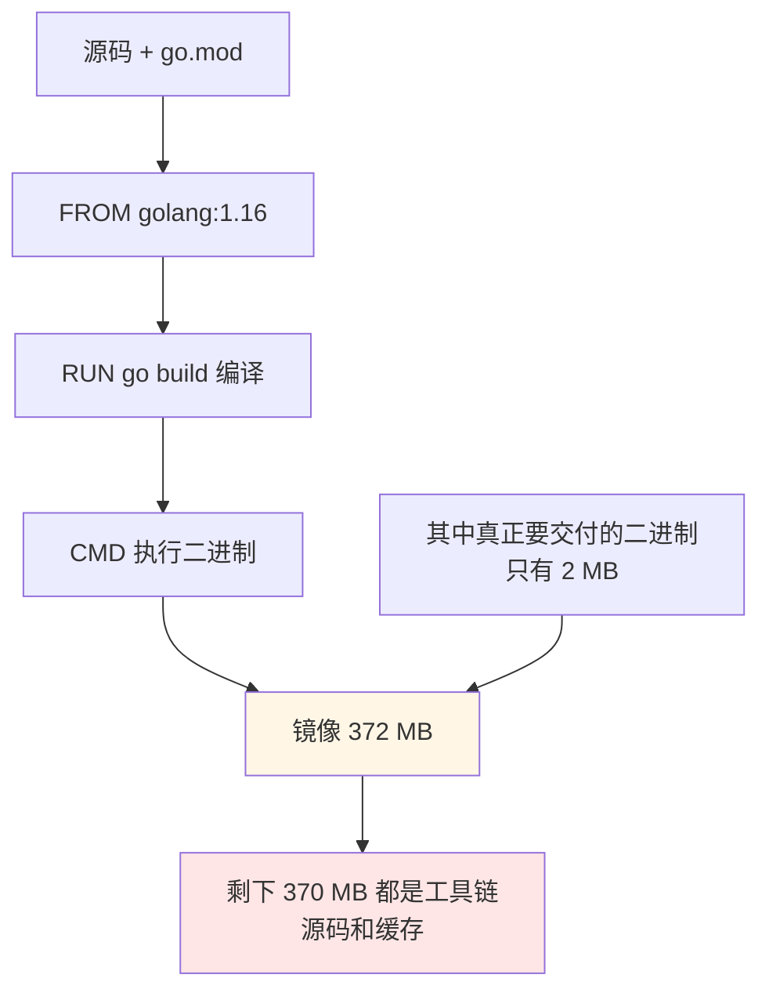
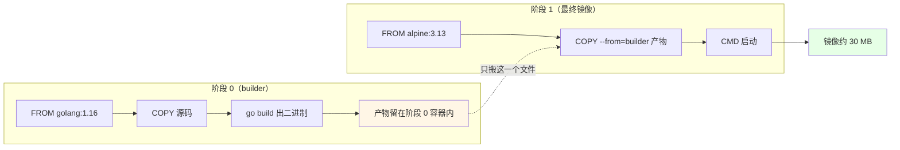
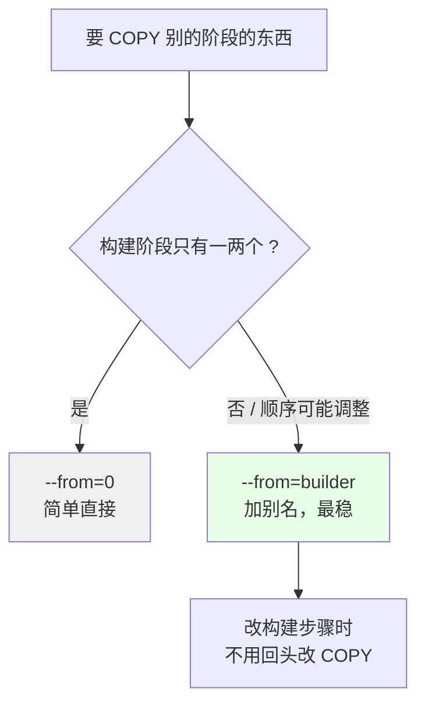
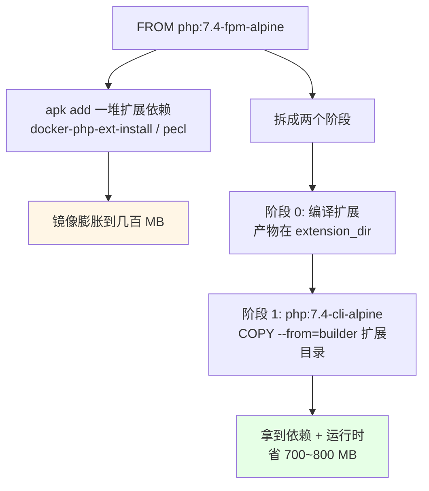
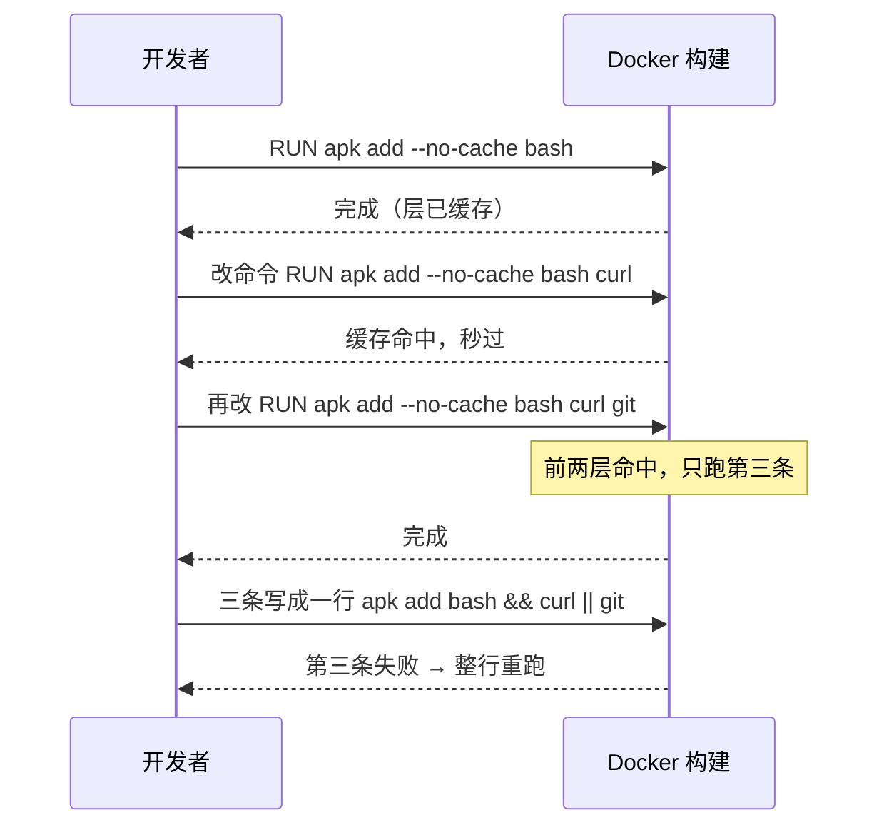
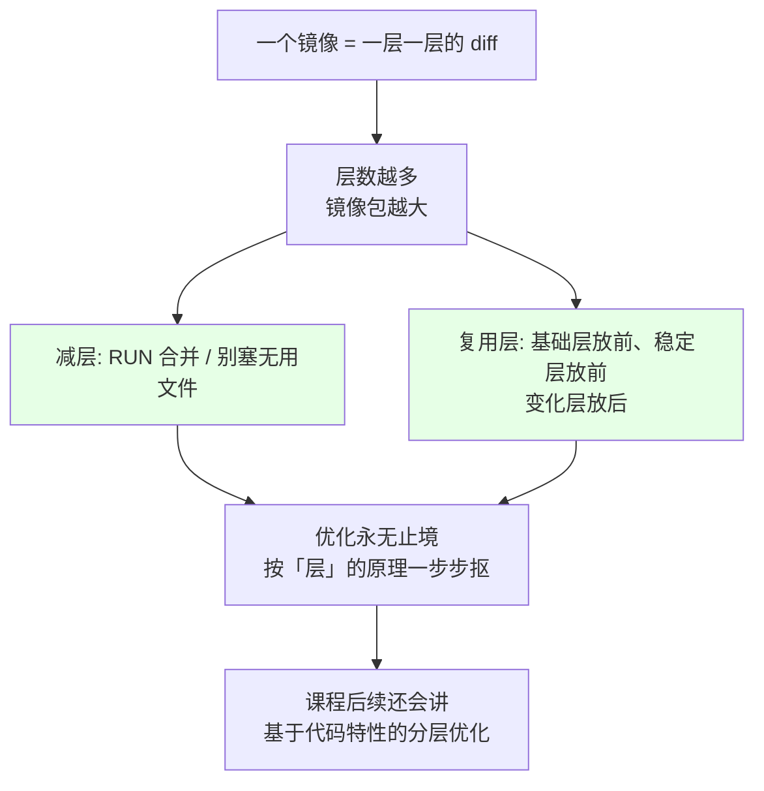
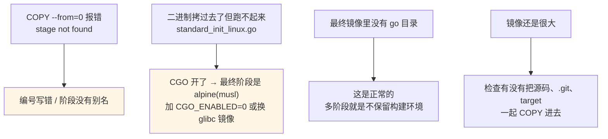

# Kubernetes 集群部署: 多阶段制作小镜像下（Go 与 PHP 构建分离实战）

上一节换 alpine 基础镜像，CentOS 216 MB 掉到 4.42 MB，看着很爽。可课程里换个 Go 程序一测，**单阶段构建出来的镜像还是 372 MB —— 而里面真正干活的那份二进制只有 2 MB**。编译工具链、源码、模块缓存全被一起打进去了。

结论先给：

- **编译 ≠ 运行**：镜像里只需要「能跑的最终产物」，编译器、源码、`.git`、中间文件都是累赘；
- **多阶段构建 = 一个 Dockerfile 里写多个 `FROM`**：第一个 `FROM` 负责编译，最后一个 `FROM` 负责交付，中间阶段的中间产物不会留存在最终镜像；
- **只拷产物**：`COPY --from=0` 或 `COPY --from=<别名>` 从指定阶段把它生成的文件搬到最终阶段；
- **实测差距**：同样一个 hello 程序，**单阶段 372 MB → 多阶段约 30 MB（差 300 多 MB）**；PHP 装一堆扩展的场景，多阶段能**省掉 700~800 MB**；
- **构建期的命令先拆开写、测通了再合并**：拆着写某一条失败只重跑那一条（能命中缓存），全写一行就得整行重跑；
- 镜像优化**永无止境**，主线只有两条：**减少层数、尽量复用层**。

## 纲要

- 先看实测：372 MB 的 Go 镜像里到底装了什么
- 多阶段构建是什么：多个 FROM 的执行顺序
- Go 实战：单阶段改多阶段
- `--from=0` 与 `--from=<别名>` 怎么选
- PHP 扩展编译场景：把编译好的扩展目录拷过去
- 构建期命令为什么要拆开写
- 镜像分层的优化主线：减层、复用层
- 常见排错

## 先看实测：372 MB 的 Go 镜像里到底装了什么



| 组成 | 占镜像多少 | 运行期需要吗 |
| --- | --- | --- |
| 编译产物二进制 | 2 MB | ✅ 必需 |
| Go 工具链（go compiler / stdlib） | ~200 MB | ❌ 完全不需要 |
| 依赖模块与缓存（`$GOPATH/pkg/mod`） | 上百 MB | ❌ 不需要 |
| 源码 / go.mod / 中间文件 | 几 MB ~ 几十 MB | ❌ 不需要 |
| **合计** | **372 MB** | 只需要 2 MB |

生产环境里这个数字是不可接受的：镜像大 → 拉取慢、占用节点磁盘、启动慢、故障回滚慢，还把源码泄进镜像。

## 多阶段构建是什么：多个 FROM 的执行顺序



要点：

- Dockerfile 里**每出现一次 `FROM`，就是一个新阶段**，按顺序从 0 开始编号；
- **只有最后一个 `FROM` 会变成最终镜像**，中间阶段的容器在阶段结束后就被丢弃；
- 阶段之间**唯一的通道是 `COPY --from=`**（或 `RUN --mount`）；
- 阶段必须有**名字（别名）**，否则只能靠编号引用。

## Go 实战：单阶段改多阶段

```text
.
├── Dockerfile
├── go.mod
└── hello.go
```

单阶段版本（372 MB）：

```dockerfile
FROM golang:1.16

RUN mkdir -p /opt/src
COPY hello.go /opt/src/
WORKDIR /opt/src
RUN go build -o /opt/hello .
CMD ["/opt/hello"]
```

多阶段版本（约 30 MB）：

```dockerfile
FROM golang:1.16 as builder

WORKDIR /src
COPY go.mod .
COPY hello.go .
RUN CGO_ENABLED=0 go build -o /opt/hello .

FROM alpine:3.13

COPY --from=builder /opt/hello /usr/local/bin/hello
CMD ["/usr/local/bin/hello"]
```

差异集中在三行：多了一个 `FROM golang:1.16 as builder`、多了一个 `FROM alpine:3.13`、产物用 `COPY --from=builder` 搬过去。**alpine 阶段的镜像里没有 go 编译器、没有源码目录，只有那一个 2 MB 的二进制。**

## `--from=0` 与 `--from=<别名>` 怎么选

| 写法 | 含义 | 什么时候用 |
| --- | --- | --- |
| `COPY --from=0 ...` | 取**编号为 0** 的阶段 | 构建步骤只有两个，且第一个就是编译阶段 |
| `COPY --from=1 ...` | 取编号为 1 的阶段 | 明确知道顺序时用 |
| `COPY --from=builder ...` | 取**别名为 builder** 的阶段 | **推荐**：构建步骤多、顺序会调整时用 |
| `COPY --from=<其他镜像> ...` | 从任意镜像拷文件 | 直接复用现成产物，如 `COPY --from=busybox:1.32 /bin/busybox /bin/busybox` |



## PHP 扩展编译场景：把编译好的扩展目录拷过去

PHP 的另外一类典型麻烦：**功能其实就多装几个扩展，但 apt/apk 装一堆扩展依赖后镜像暴涨**。



扩展编译版 Dockerfile：

```dockerfile
FROM php:7.4-fpm-alpine as builder

RUN apk add --no-cache $PHPIZE_DEPS \
    && pecl install redis \
    && docker-php-ext-enable redis \
    && apk del .phpexts-build-deps

FROM php:7.4-cli-alpine

COPY --from=builder /usr/local/lib/php/extensions /usr/local/lib/php/extensions
COPY --from=builder /usr/local/etc/php/conf.d /usr/local/etc/php/conf.d
CMD ["php", "-a"]
```

关键点：

- `$PHPIZE_DEPS` 是**编译扩展必须的开发头文件和工具链**（autoconf、gcc、make、libc-dev），装完用 `apk del` 拆掉；
- PHP 扩展编译完落在 `extension_dir`（`php -i | grep extension_dir`）和 `conf.d` 下的 ini 文件里，**这两个目录拷过去就够了**，编译过程、工具链全不带走；
- 最终阶段用同一大版本的轻量镜像（如 `php:7.4-cli-alpine`），保证 ABI 一致，扩展能加载；
- 课程实测：这招**能省 700~800 MB**。

## 构建期命令为什么要拆开写



| 写法 | 某一步失败时 | 适合阶段 |
| --- | --- | --- |
| 拆成多个 `RUN`（但上层要变） | 只重跑本行，命中下层缓存 | **调试期** |
| 全部 `&&` 合并成一行 | 整行重跑，之前的时间全浪费 | **稳定之后** |
| 拆开写但上层依赖没变 | 全程缓存命中 | 任何时候都划算 |

原则：**先用拆开的写法把每一步测试通过，确认没问题后再用 `&&` 合并、减层**。课程里编译类命令尤其要这么干 —— 编译动辄几分钟，重跑一次很心疼。

## 镜像分层的优化主线：减层、复用层



- 每一条 `RUN/COPY/ADD` 大约贡献一层，层数多 → 包大、构建慢、拉取慢；
- 把**不变的东西放前面、常变的放后面**：改一行代码只重建后面几层，前面全部命中缓存；
- 层是**只读的、可共享的**：同一个基础层（比如 `golang:1.16`）被十个镜像复用，`docker pull` 只下一份；
- 演进顺序建议：**选对基础镜像（4-5）→ 多阶段构建（本篇）→ 按代码特性再分层 → 交付阶段尽量复用层**。

## 常见排错



| 现象 | 原因 | 处理 |
| --- | --- | --- |
| `stage "0" not found` | 编号越界（`FROM` 只有 1 个却写 1） | 数一遍 `FROM` 个数，或用别名 |
| 拷过来了但 `no such file or directory` | 源路径拼错（产物在别的阶段路径下） | `docker run` 进构建阶段 `ls` 确认绝对路径 |
| alpine 上跑 C 程序报 `standard_init_linux.go` | musl stdc 缺失 | `CGO_ENABLED=0` 静态编译，或换 `*-slim`/glibc 镜像 |
| `COPY --from` 复制目录拷多了 | 目录本身也被拷进去 | 拷目录内容（末尾不带目录名）或逐文件拷 |
| 镜像体积没变 | 最终阶段忘了改 `FROM`，还在构建镜像 | 最后一行 `FROM` 才是交付镜像 |

## API 速览

| 能力 | 做法 | 关键点 |
| --- | --- | --- |
| 拆开编译与交付 | 一个 Dockerfile 写多个 `FROM` | 只有最后一个 `FROM` 进最终镜像 |
| 给阶段起名字 | `FROM golang:1.16 as builder` | 别名大小写不敏感，建议小写 |
| 引用某个阶段 | `COPY --from=builder 源 目标` | 编号 0 起，别名更抗改动 |
| 从别的镜像拿文件 | `COPY --from=busybox:1.32 /bin/busybox /bin/busybox` | 不用先 `RUN docker pull` |
| 跳过最终镜像的构建环境 | 最终阶段用最小运行时镜像 | alpine / `*-slim` / scratch |
| 减层 | 稳定后把多条 `RUN` 用 `&&` 合并 | 调试期先拆开写 |
| 保留构建缓存到别处 | `--cache-from=<镜像>` | CI 里用，复用上一层缓存 |
| 看每阶段产物 | `docker build --target builder -t tmp:1 .` | 单独保留构建阶段调试 |
| 对比体积 | `docker images \| grep <镜像名>` | 改前后各量一次 |
| 对照 k8s | 镜像小 → 拉取快、调度快、回滚快 | 节点磁盘和启动延迟直接受益 |

## Demo 示例

```bash
# 1. 准备构建上下文
mkdir -p multi-stage-demo && cd multi-stage-demo

cat > go.mod <<'EOF'
module hello

go 1.16
EOF

cat > hello.go <<'EOF'
package main

import "fmt"

func main() {
    fmt.Println("hello from multi-stage image")
}
EOF

# 2. 单阶段版本（会得到 372 MB 左右的镜像）
cat > Dockerfile.single <<'EOF'
FROM golang:1.16
RUN mkdir -p /opt/src
COPY hello.go /opt/src/
WORKDIR /opt/src
RUN go build -o /opt/hello .
CMD ["/opt/hello"]
EOF

# 3. 多阶段版本（最终镜像约 30 MB）
cat > Dockerfile.multi <<'EOF'
FROM golang:1.16 as builder
WORKDIR /src
COPY go.mod .
COPY hello.go .
RUN CGO_ENABLED=0 go build -o /opt/hello .

FROM alpine:3.13
COPY --from=builder /opt/hello /usr/local/bin/hello
CMD ["/usr/local/bin/hello"]
EOF

# 4. 分别构建，注意体积差
docker build -f Dockerfile.single -t hello:single .
docker build -f Dockerfile.multi -t hello:multi .

docker images | grep hello

# 5. 只构建构建阶段，进去看看产物在哪（不生成最终交付镜像）
docker build --target builder -t hello:builder .

# 6. 跑一下，确认功能一致
docker run --rm hello:multi
docker run --rm hello:single

# 7. 顺手看下最终镜像里到底有没有 go 编译器
docker run --rm hello:multi sh -c "ls -l /usr/local/bin/hello; which go; echo exit=$?"
```

```bash
# PHP 扩展场景：把编译好的扩展目录单独搬过来
# 先跑构建阶段，确认扩展目录路径
docker run --rm --entrypoint sh php:7.4-fpm-alpine -c "php -i | grep extension_dir"

# 构建阶段单独留一个镜像看产物
docker build --target builder -t php-ext-builder . -f Dockerfile.php

# 最终镜像只带走扩展目录（省 700~800 MB）
docker images | grep php-ext
```

### 总结

- **372 MB 里只有 2 MB 有用**：编译环境和源码不该进交付镜像，多阶段构建就是把两者拆开；
- **一个 Dockerfile 多个 `FROM`**：`COPY --from=builder`（或 `--from=0`）是阶段之间唯一通道，最后一行 `FROM` 才是交付镜像；
- **实测收益**：Go 约 372 MB → 30 MB（差 300+ MB），PHP 扩展场景约省 700~800 MB；
- **构建期命令先拆后合**：调试期拆开写，某一步失败只重跑那一步；全部测通再 `&&` 合并减层；
- **优化主线只有两个动词**：减少层数、尽量复用层 —— 换小基础镜像（4-5）和多阶段构建（本篇）都是这套原理的具体落地。

