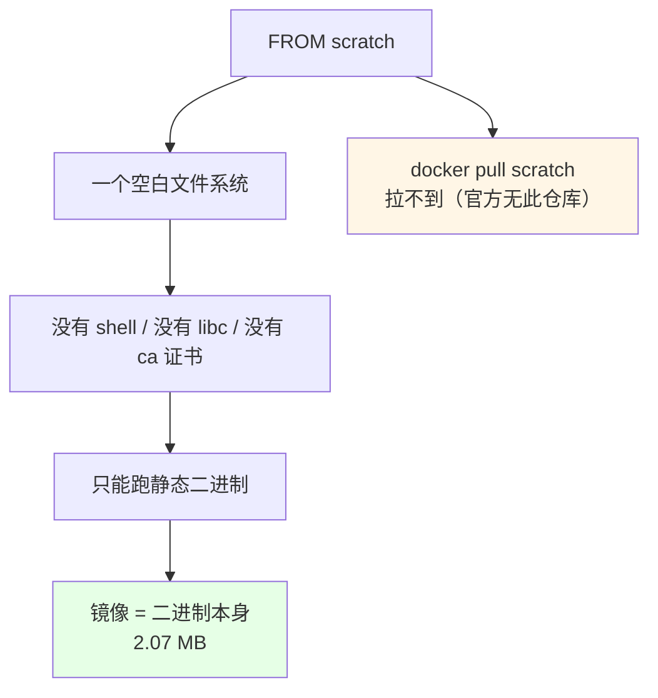
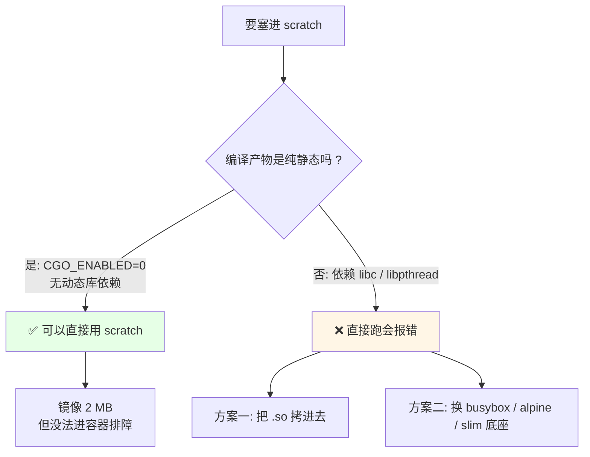
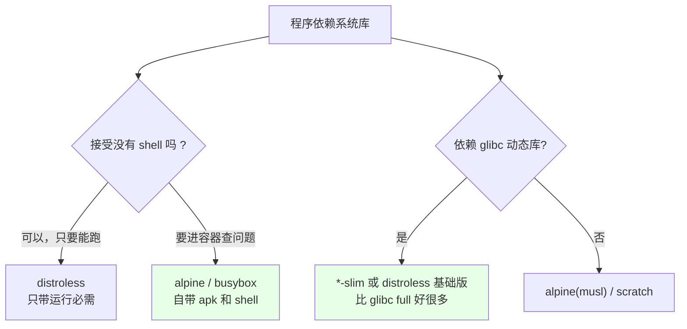
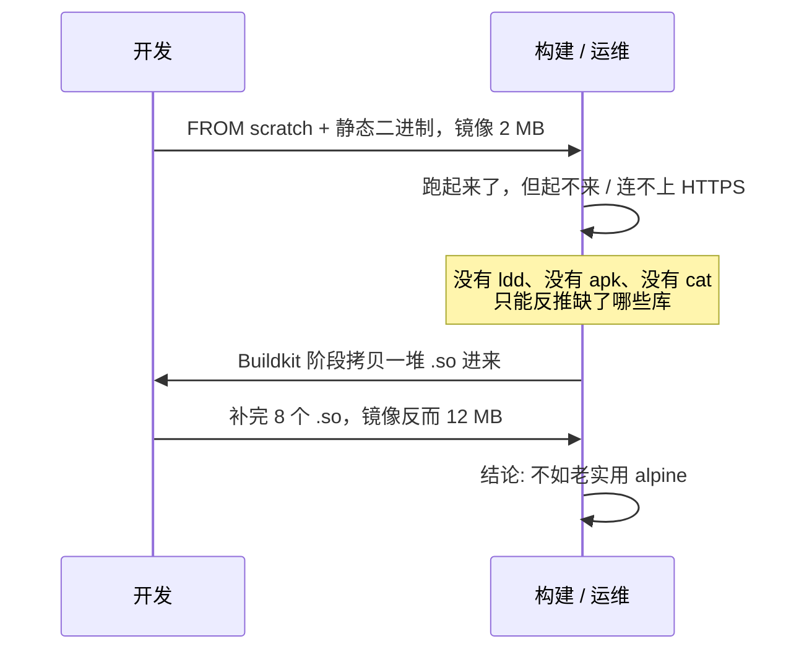
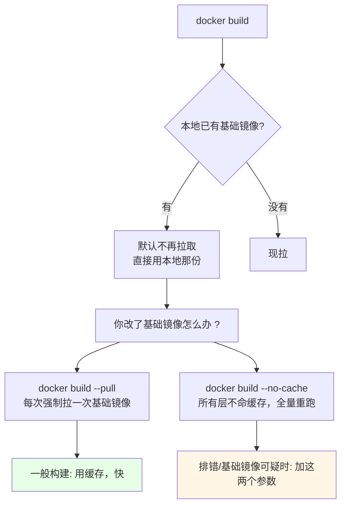

# Kubernetes 集群部署: 特殊镜像 scratch（纯静态极限瘦身的边界与 build --pull）

前面两节把镜像从 216 MB 干到 30 MB，追到底会发现一个叫 **scratch** 的东西 —— 它被 Docker 定义成「完全空的镜像，什么都没有」，连 `docker pull scratch` 都拉不到（官方就没这个仓库）。

结论先给：

- **scratch 是空镜像**：没有 shell、没有 libc、没有排障工具，直接 `FROM scratch` 塞一个**纯静态**二进制进去就能跑（课程实测 **2.07 MB**，就是那个二进制本身的大小）；
- **能用 scratch 的前提是「全静态、零依赖」**：Go 关掉 CGO（`CGO_ENABLED=0`）就能把运行时全链接进二进制；
- **绝大多数程序用不了 scratch**：Go/C 默认依赖动态库和系统库，塞进空镜像就要报 `standard_init_linux.go: exec format error` 或 `no such file or directory`；
- **three 条退路**：把用到的 `.so` 逐个拷进 scratch；或用 **distroless / busybox / alpine / `*-slim`** 镜像当底座；
- **别纠结那 2 MB**：从 4.42 MB 降到 2 MB 省下的一点体积，换来「没有任何排障手段」的镜像，性价比很差 —— **优先 alpine / distroless，不是 scratch**；
- 附带一个实操坑：`FROM` 写的是自己改过的私有基础镜像时，**本地有就不去拉**，改了基础镜像要加 **`docker build --pull`**。

## 纲要

- scratch 是什么：拉不到、装不了的空镜像
- 实测：2 MB 的 scratch 镜像
- 什么样的程序能用 scratch
- 依赖动态库时怎么办
- 三条退路：拷贝库 / busybox / distroless-slim
- 为什么不推荐硬上 scratch
- 附：`docker build --pull` 与 `--no-cache`
- 常见排错

## scratch 是什么：拉不到、装不了的空镜像



| 镜像 | 体积 | 有 shell | 有动态库 | 适合 |
| --- | --- | --- | --- | --- |
| `centos:8` | 215 MB | ✅ | ✅ | 演示，不用 |
| `alpine:3.13` | 4.42 MB | ✅ | musl | **常用首选** |
| `*-slim` | 几十 MB 级 | ✅ | glibc（常用库） | 需要 glibc 的程序 |
| `distroless` | 20~50 MB | ❌ | 只带运行所需 | 只跑一个二进制、能接受无 shell |
| **`scratch`** | **二进制大小（2 MB）** | ❌ | ❌ | 纯静态二进制 |

**scratch 不是"更小的 alpine"，它是"什么都没有"**：把 alpine 的 4.42 MB 换成 scratch 的 2 MB，只少 2 MB，却要把 shell、库、证书、时区数据自己一个个补回来，补完往往比 alpine 还大。

## 实测：2 MB 的 scratch 镜像

构建上下文：

```text
.
├── Dockerfile
└── hello        # CGO_ENABLED=0 编译出来的静态二进制
```

Dockerfile：

```dockerfile
FROM scratch

COPY hello /hello
CMD ["/hello"]
```

效果：

```bash
# 构建
docker build -t hello:scratch .

# 镜像只有 2.07 MB —— 就是那个二进制的大小
docker images | grep hello:scratch

# 能直接跑
docker run --rm hello:scratch

# 注意：进去什么都没有，连 sh 都没有
docker run --rm -it hello:scratch sh
# 实际结果: exec format / executable file not found in $PATH
```

## 什么样的程序能用 scratch



| 语言 / 场景 | 能否静态链接 | 说明 |
| --- | --- | --- |
| Go（`CGO_ENABLED=0`） | ✅ 可以 | 运行时全打进二进制，最适合 scratch |
| Go（默认，用了 net/cgo） | ❌ 默认带动态依赖 | 必须 `CGO_ENABLED=0` 或改用 glibc 底座 |
| C/C++ | 看编译选项 | `-static` 才行，动态链接的话要带 `.so` |
| Rust | ✅ 可以 | 默认静态链接，适合 distroless/scratch |
| Java（JRE 打包） | ❌ | 需要 JRE，alpine 版 JRE 也有几十 MB |
| PHP / Node / Python | ❌ | 解释器 + 模块 + 证书缺一不可 |
| Redis / Nginx 等 C 程序 | ❌ | 依赖系统库，得手动补一大堆 |

## 依赖动态库时怎么办

思路一：**把用到的库逐个拷进 scratch**（只拷真用到的，别整 `/lib64` 往里灌）：

```bash
# 1. 先看缺什么
docker run --rm hello:scratch ./hello
# 报错: standard_init_linux.go: exec user process caused "no such file or directory"

# 2. 在构建机（或带 glibc 的临时镜像）里确认依赖清单
docker run --rm --entrypoint ldd alpine:3.13 /hello

# 3. 把自己机器上这几个 .so 拷进构建上下文的 lib 目录
mkdir -p lib-src
cp /lib64/libc.so.6 lib-src/
cp /lib64/libpthread.so.0 lib-src/
cp /usr/lib/libssl.so.1.1 lib-src/
```

对应 Dockerfile：

```dockerfile
FROM scratch

COPY lib-src/lib /lib
COPY lib-src/usr/lib /usr/lib
COPY hello /hello
CMD ["/hello"]
```


思路二（**推荐**）：换底座 —— **busybox / alpine / `*-slim` / distroless**。课程建议的优先级是：



- **`*-slim` 比 glibc 完整镜像好**：真用到动态库时，slim 是「常用动态库够用、体积又小」的折中，比-fat 版省一大截；
- **busybox / alpine 自带包管理**：出问题能 `apk add` 临时补一个库，scratch 补不了；
- **distroless 与 scratch 一样没有 shell**：排障只能靠 `docker cp` 把文件拖出来看，或提前在镜像里装好探针（如 nonroot 用户、healthcheck）。

## 为什么不推荐硬上 scratch



- **省的那 2 MB 不值那个时间成本**：课程原话是「不要在意这两兆」；
- **没有 shell = 没有排障入口**：线上起不来时，`kubectl exec` 进去连 `sh` 都敲不了，`ls`、`cat`、`curl` 全没有；
- **没有 CA 证书**：HTTPS/域名访问直接失败，得再拷 `/etc/ssl/certs/ca-certificates.crt`；
- **没有 /etc/passwd、/etc/hosts**：以非 root 运行时用户解析会出问题（k8s 的 `runAsUser` 场景尤其明显）；
- **结论**：**默认用 alpine / distroless，只有确认是纯静态二进制且排障需求极低时，才上 scratch**。

## 附：docker build --pull 与 --no-cache



| 参数 | 作用 | 什么时候加 |
| --- | --- | --- |
| `--pull` | 每次构建**强制拉取基础镜像**（`FROM` 后面那个） | 基础镜像是团队自建、经常改的时候 |
| `--no-cache` | **完全不用缓存**，每条指令重建一层 | 怀疑缓存污染、调试 Dockerfile 时 |
| （不加） | 命中缓存，构建飞快 | **日常构建默认就这么干** |
| `-t <标签>` | 打标签，方便回头 `docker images` 对比 | 每次都打，好事后比对体积 |

```bash
# 日常构建：吃缓存，快
docker build -t myapp:1.0 .

# 基础镜像是我们自己改过的私有镜像，本地有旧版 → 强制拉一次
docker build --pull -t myapp:1.0 .

# Dockerfile 反复改不动对时，全量重来一次
docker build --no-cache -t myapp:1.0 .

# 想单独看某个阶段（课程里调构建阶段产物时用到）
docker build --target builder -t myapp:builder .
```

## 常见排错

| 现象 | 原因 | 处理 |
| --- | --- | --- |
| `exec format error` / `no such file or directory` | 缺动态库 | `ldd` 查依赖，拷 `.so` 或换 alpine |
| `standard_init_linux.go: exec user process caused ...` | scratch 空镜像缺库 | 同上，或放弃 scratch |
| `docker pull scratch` 报错 | 官方没有这个仓库 | scratch 只能 `FROM scratch`，不能 pull |
| 镜像里进不去 shell | scratch / distroless 无 shell | 改用 alpine / busybox |
| HTTPS 请求报证书错误 | 没有 CA 证书包 | 拷 `ca-certificates.crt` 进 `/etc/ssl/certs` |
| 改了基础镜像但构建结果没变 | 本地缓存了旧基础镜像 | 加 `--pull` |
| 改了 Dockerfile 但某些层秒过没重跑 | 层缓存命中 | 加了缓存的指令（如 `COPY`）内容没变才会命中，可疑时加 `--no-cache` |

## API 速览

| 能力 | 做法 | 关键点 |
| --- | --- | --- |
| 造一个空镜像底座 | `FROM scratch` | 官方仓库没有，不能 pull |
| 塞静态二进制 | `COPY hello /hello` | 镜像体积 = 二进制体积 |
| 编译纯静态 Go | `CGO_ENABLED=0 go build` | 否则会带动态库依赖 |
| 查二进制缺什么 | `ldd <二进制路径>` | 在带 glibc 的临时镜像里跑 |
| 补动态库 | `COPY lib-src/lib /lib` | 只拷用到的那几个 `.so` |
| 不要 shell 又想小 | `distroless` | 排障得靠 `docker cp` 或预置探针 |
| 需要 shell 又要小 | `alpine` / `busybox` | 自带 apk，`apk add` 临时补库 |
| 依赖 glibc 但要小 | `*-slim` | 比完整 glibc 镜像省一大截 |
| 强制拉基础镜像 | `docker build --pull` | 自建基础镜像改动后必加 |
| 弃用缓存构建 | `docker build --no-cache` | 排错时加，平时不要 |
| 只跑构建阶段 | `docker build --target builder` | 保留中间阶段用于查产物 |

## Demo 示例

```bash
# 1. 编一个纯静态的 Go 二进制
mkdir -p scratch-demo && cd scratch-demo

cat > hello.go <<'EOF'
package main

import "fmt"

func main() {
    fmt.Println("hello from scratch")
}
EOF

CGO_ENABLED=0 GOOS=linux go build -o hello .

# 2. 确认它是静态的（没有 "not a dynamic executable" 之外的依赖）
file hello
ldd hello
# 期望看到: statically linked

# 3. scratch 版本
cat > Dockerfile.scratch <<'EOF'
FROM scratch
COPY hello /hello
CMD ["/hello"]
EOF

docker build -f Dockerfile.scratch -t hello:scratch .
docker images | grep hello:scratch
docker run --rm hello:scratch

# 4. 对比 alpine 版本
cat > Dockerfile Alpine <<'EOF'
FROM alpine:3.13
COPY hello /hello
CMD ["/hello"]
EOF

docker build -f Dockerfile Alpine -t hello:alpine .
docker images | grep hello

# 5. 演示 --pull 与 --no-cache
docker build --pull -f Dockerfile.scratch -t hello:scratch .
docker build --no-cache -f Dockerfile.scratch -t hello:scratch .
```

```bash
# 6. 依赖动态库的程序：先看缺什么，再决定是拷库还是换底座
docker run --rm --entrypoint sh alpine:3.13 -c "ldd /hello" || true

# 换个底座，一行的事，比拷八个 .so 划算
cat > Dockerfile.glibc <<'EOF'
FROM debian:buster-slim
COPY hello /hello
CMD ["/hello"]
EOF

docker build -f Dockerfile.glibc -t hello:slim .
docker run --rm hello:slim
```

### 总结

- **scratch 是空镜像**，只有「纯静态二进制」能直接用，镜像体积就等于二进制体积（实测 2.07 MB）；
- **判据只有一条**：能不能静态链接、有没有动态库依赖；Go 要 `CGO_ENABLED=0`，依赖系统库的程序（Redis、Nginx 这类）劝退；
- **硬上 scratch 要自己补库、补 CA 证书、补 `/etc/passwd`**，补完常常比 alpine 还大，省的那 2 MB 完全不值；
- **生产默认选 alpine / distroless / `*-slim`**：有包管理、能进容器排障，体积已经足够小；
- **附带两个构建参数**：基础镜像是团队自建的用 `docker build --pull` 强制拉，Dockerfile 改动不生效怀疑缓存时用 `--no-cache`，平时不加、构建才快。

