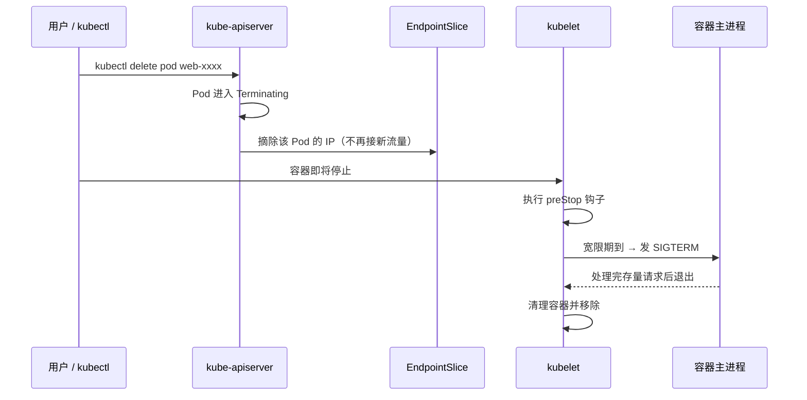
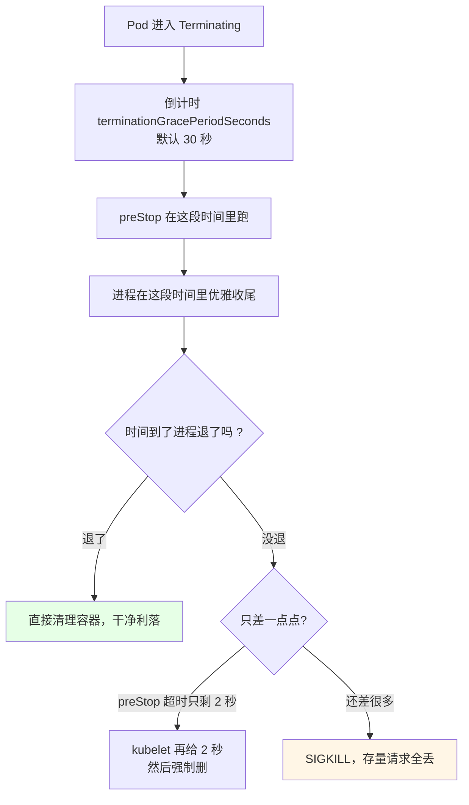
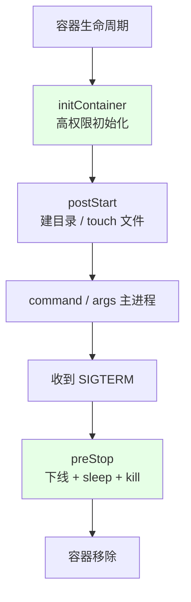
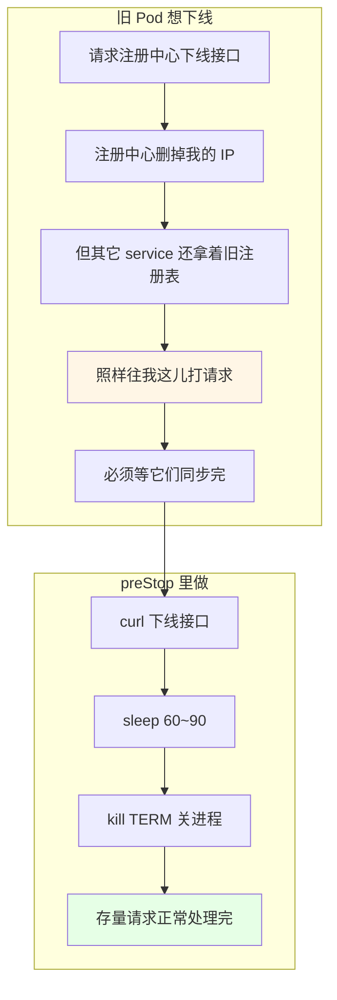
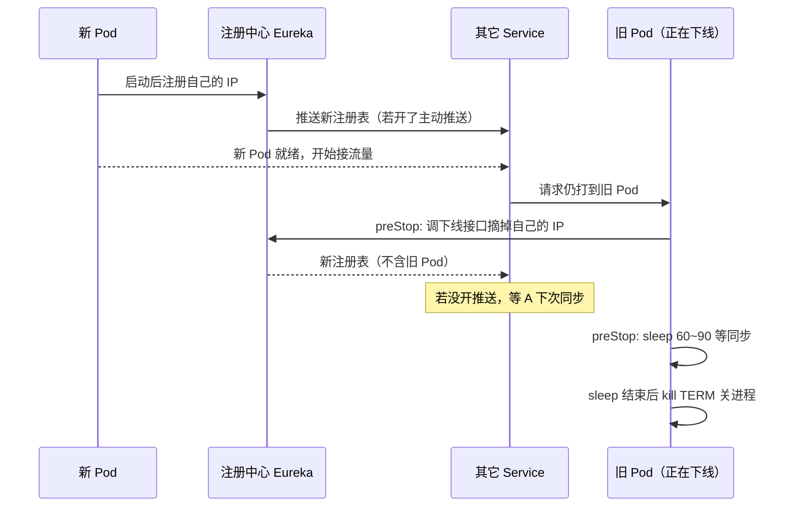
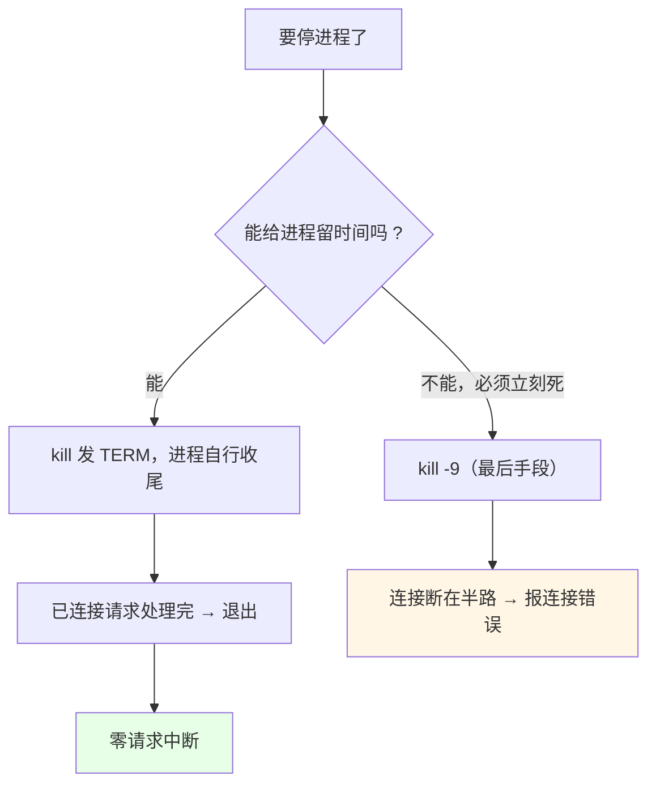
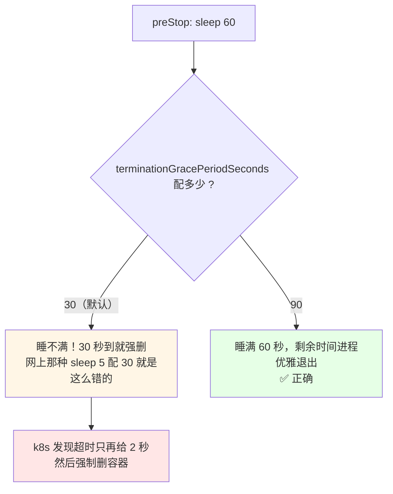

# Kubernetes 集群部署: 零宕机必备知识（Pod 退出流程与 preStop 实战）

上一节配好健康检查，只能保证「启动过程」判断得准，**保证不了发布时零宕机**。真正会出事的是退出那一瞬间：**NGINX 这类进程里还有一堆请求没处理完，就被强杀掉了**。健康检查不管退出，所以退出侧也要有一套逻辑。

结论先给：

- **一个 Pod 被删除时，k8s 同时干三件事**：Pod 进入 `Terminating`、Endpoint 摘掉这个 Pod 的 IP、执行 `preStop` 钩子；
- **宽限期默认 30 秒**（`terminationGracePeriodSeconds`），这段时间就是留给「收尾」的，可以按需改大；
- **`preStop` 是容器被杀之前执行的命令**，这是做零宕机发布的核心抓手；
- **大坑：`preStop` 里写 `sleep 90`，但宽限期还是 30 秒 → 睡不满就被强删**。超时期限一到，k8s 只再给 2 秒就强制删容器；所以 `sleep` 多长，**宽限期就必须配置多长**；网上的「`sleep 5` 配 30 秒」是错误示范；
- **停进程只能用 `kill`（SIGTERM），绝不能用 `kill -9`**：`kill -9` 没有优雅关闭，已建立的连接和未完成的请求直接丢；
- **经典场景是 Spring Cloud + 注册中心**：下线时要先从注册中心摘自己，再等其它应用同步完注册表，最后才停进程。

## 纲要

- 健康检查管不到「退出」这件事
- Pod 退出三件事：状态、Endpoint、preStop
- 宽限期 terminationGracePeriodSeconds 到底给谁用
- preStop 与 postStart 的定位差异
- 零宕机下线的标准动作
- Spring Cloud 场景：注册中心下线 + sleep 等同步
- 进程该在 sleep 前还是 sleep 后关
- sleep 与宽限期的配套关系（最容易配错）
- 常见排错

## 健康检查管不到「退出」这件事


| 阶段 | 谁负责 | 工具 |
| --- | --- | --- |
| 启动中 | 判断「起来没」 | `startupProbe` / `readinessProbe` |
| 运行中 | 判断「活着没」 | `livenessProbe` |
| **退出前** | **判断「能不能关」** | **`preStop` + 宽限期** |

## Pod 退出三件事：状态、Endpoint、preStop



```text
kubectl delete pod web-7d9f
        │
        ▼
   Terminating  ← 状态立刻变，肉眼可见
        │
        ├─ 同时发生 1: Endpoint 里摘掉这个 Pod 的 IP
        ├─ 同时发生 2: 执行 preStop 钩子
        └─ 同时发生 3: 启动 30 秒倒计时（宽限期）
                              │
                              ▼
                  倒计时结束 → SIGTERM → 进程优雅退出
```

| 动作 | 谁干的 | 作用 |
| --- | --- | --- |
| Pod 变 `Terminating` | apiserver | 对外暴露「正在下线」 |
| Endpoint 摘 IP | Endpoint 控制器 | **新的请求不再打进来** |
| 执行 `preStop` | kubelet | 留给你的**最后几秒做收尾** |
| 宽限期倒计时 | kubelet | 等 preStop 跑完 / 等进程自己退 |

注意两处细节：**Endpoint 只摘「被删的那一个」Pod 的 IP**（一个 Deployment 有多个副本时，只摘这一个）；preStop 与摘 IP 是**并行**发生的，不是串行。

## 宽限期 terminationGracePeriodSeconds 到底给谁用



| 配置项 | 默认 | 什么时候改 |
| --- | --- | --- |
| `terminationGracePeriodSeconds` | 30 | 注册中心同步慢、进程关闭慢 → **改大** |
| preStop 里的 `sleep N` | 无 | 和上面必须配套，N ≤ 宽限期 |
| 超时后额外宽限 | 2 秒 | 不能配，只能靠拉长宽限期 |

## preStop 与 postStart 的定位差异

- **`postStart`**：容器创建完成、启动之前执行的命令；
- **`preStop`**：容器被删除/清理之前执行的命令 —— 本篇主角。



| 钩子 | 执行时机 | 特性 | 适合干什么 |
| --- | --- | --- | --- |
| `initContainer` | 主容器之前 | **高权限、跑完即退** | 需要特权的操作、初始化脚本 |
| `postStart` | 容器创建后、启动前 | **不保证一定早于主 command 执行**（可能并行） | 建目录、touch 标记文件 |
| `preStop` | 容器被杀之前 | 一定在 SIGTERM 之前 | 注册中心下线、sleep 等同步、优雅停进程 |

两个坑：

1. **`postStart` 不保证先于 `command` 执行**，所以它不适合承载「必须跑在主进程之前」的逻辑（比如改配置、等依赖就绪），这类用 `initContainer`；
2. `postStart` 是**在容器本身的环境里执行**的（同样的镜像、同样的用户），**`initContainer` 可以指定高权限用户**，跑特权操作更合适。

## 零宕机下线的标准动作

```text
spring-cloud 应用（Eureka 注册表）的 preStop 编排
├── 第一步: 先从注册中心摘掉自己
│   └── curl 注册中心的下线接口（Eureka / Nacos / Consul 都类似）
├── 第二步: sleep，等其它应用拉到新注册表
│   └── sleep 60 / sleep 90（必须 ≤ terminationGracePeriodSeconds）
└── 第三步: 优雅停掉自己的进程
    └── kill 发送 TERM 信号，绝不用 kill -9
```



## Spring Cloud 场景：注册中心下线 + sleep 等同步

课程里举的是 Spring Cloud 整套搬到 k8s、注册中心（Eureka）也跑在集群里的常见形态：



关键在于：**即使注册中心里已经没有我了，别的 service 也未必知道** —— 它手上的注册表还是旧的，仍然会往我这儿打请求。所以「注册中心摘 IP」和「容器真正关掉」之间，必须隔一段等待时间。

## 进程该在 sleep 前还是 sleep 后关

**一般放在 sleep 之后**，原因很实在：

- 走注册中心下线的过程中，**其它 service 可能还在连我**；
- 一上来就把进程停掉，正在飞的请求和长连接直接断，等于白配；
- 所以顺序是：先宣告下线 → 等同步 → 最后再关进程。

停进程的正确姿势：

| 做法 | 结果 |
| --- | --- |
| `kill <进程号>`（默认 SIGTERM） | ✅ 进程有机会关连接、刷日志、走完 shutting down |
| `kill -TERM <进程号>` | ✅ 同上，显式一点 |
| `kill -9 <进程号>` | ❌ **强制杀，没有优雅关闭，存量请求全丢** |
| 直接让容器被 SIGKILL | ❌ kubelet 抢在进程之前强删，一样丢请求 |



## sleep 与宽限期的配套关系（最容易配错）

**这是本篇最值钱的一条**：`preStop` 里的 `sleep 90` 要想真的睡满 90 秒，宽限期就必须 ≥ 90 秒。



| preStop 里写的 | 宽限期 | 实际效果 |
| --- | --- | --- |
| `sleep 5` | 30（默认） | 进程 5 秒内关完才生效；关不完就只能等满 30 秒 |
| `sleep 5` | 30 + 预想「只睡 5 秒」 | ❌ **配错**：k8s 不看 sleep，只看宽限期倒计时 |
| `sleep 90` | 30 | ❌ 睡不满，超时后只给 2 秒强删 |
| `sleep 90` | 90 / 120 | ✅ 按预期收尾 |

原则：**先定「需要等多久」（注册表刷新周期 + 余量），再把这个数写进 `terminationGracePeriodSeconds`**。别反过来 —— 网上很多「零宕机滚动发布」的示例只写了 `sleep`，忘了改宽限期，照抄就翻车。

## 常见排错

| 现象 | 原因 | 处理 |
| --- | --- | --- |
| 发布时业务报 502 / 连接失败 | 进程被强杀，请求没处理完 | 配 `preStop` + 拉长宽限期 |
| preStop 明明 sleep 90，日志只看到几秒就没了 | 宽限期只有 30 | 设 `terminationGracePeriodSeconds: 90` |
| 删除 Pod 卡在 Terminating 很久 | 进程不响应 SIGTERM | 检查应用 shutdown hook，或临时调大宽限期 |
| 下线后其它服务还打到已删 Pod | 注册表没同步完就关了进程 | preStop 里先 sleep，等其它应用拉到新注册表 |
| 用了 `kill -9` 后请求全断 | 没有优雅关闭 | 改 `kill <进程号>` 发 TERM 信号 |
| postStart 里的初始化没跑就报主进程错 | 不保证早于 command | 改用 `initContainer` |
| Endpoint 里 IP 还在 | 状态没进 Terminating / EP 未同步 | 先 `kubectl get pod -o wide` 看状态与 IP |

## API 速览

| 能力 | 做法 | 关键点 |
| --- | --- | --- |
| 看退出状态 | `kubectl get pod` 看到 `Terminating` | 删除后先别急着删命令 |
| 看宽限期 | `kubectl get pod <名称> -o yaml \| grep -A2 terminationGracePeriod` | 默认 30 秒 |
| 摘流量 | Endpoint / EndpointSlice 自动摘 IP | 不需要你手动改 |
| 退出前执行命令 | `lifecycle.preStop.exec.command` | 只能是 exec / httpGet / tcpSocket |
| 拉长等待时间 | `spec.terminationGracePeriodSeconds` | 必须 ≥ preStop 里 sleep 的时间 |
| 初始化特权操作 | `initContainers` | 高权限、跑完即退 |
| 建目录打标记 | `lifecycle.postStart` | 不保证早于主 command |
| 优雅停进程 | `kill <进程号>`（TERM） | 禁 `kill -9` |
| 查优雅退出日志 | `kubectl describe pod` 看 Last State / Message | 收尾是否成功看这里 |
| 强制删卡住的 Pod | `kubectl delete pod --grace-period=0 --force` | 最后一招，会直接丢请求 |

## Demo 示例

```bash
# 1. 先看默认宽限期是 30 秒
kubectl get pod web-7d9f5c8b4-x2k9p -o yaml | grep -A2 terminationGracePeriodSeconds

# 2. 制造一次"退出"，观察状态变化
kubectl delete pod web-7d9f5c8b4-x2k9p
kubectl get pod web-7d9f5c8b4-x2k9p
# 立刻看到 Terminating

# 3. 边删边看 Endpoint 里有没有摘掉这个 IP
kubectl get pod web-7d9f5c8b4-x2k9p -o wide --watch &
kubectl get endpoints web-svc -o wide

# 4. 临时把卡住的 Pod 强删（会丢请求，别在生产随便用）
kubectl delete pod web-7d9f5c8b4-x2k9p --grace-period=0 --force
```

带 `preStop` 的 Pod 清单（退出前先下线、再等待、最后优雅停进程）：

```yaml
apiVersion: v1
kind: Pod
metadata:
  name: web
  labels:
    app: web
spec:
  terminationGracePeriodSeconds: 90
  containers:
  - name: web
    image: nginx:1.19
    ports:
    - containerPort: 80
    lifecycle:
      postStart:
        exec:
          command:
          - /bin/sh
          - -c
          - mkdir -p /var/log/prestart && touch /var/log/prestart/booted
      preStop:
        exec:
          command:
          - /bin/sh
          - -c
          - |
            echo "[preStop] 从注册中心摘除自己"
            curl -s -X POST "http://eureka:8761/eureka/apps/WEB/$HOSTNAME"
            echo "[preStop] 等待其它应用同步注册表"
            sleep 60
            echo "[preStop] 优雅停止主进程"
            kill $(cat /var/run/nginx.pid)
```

```bash
# 5. 验证：删除后 60 秒左右 preStop 的日志才刷完
kubectl delete pod web
kubectl logs web -c web
# 预期末尾能看到三条 preStop 日志，且 Pod 大约 60 秒后消失

# 6. 如果只想看 preStop 是否配错（宽限期短了），看删除耗时
time kubectl delete pod web --wait=true
```

```yaml
# 备选写法：preStop 用 HTTP 方式（请求注册中心下线接口）
apiVersion: apps/v1
kind: Deployment
metadata:
  name: order
spec:
  replicas: 3
  selector:
    matchLabels:
      app: order
  template:
    metadata:
      labels:
        app: order
    spec:
      terminationGracePeriodSeconds: 120
      containers:
      - name: order
        image: registry/order-service:1.0
        lifecycle:
          preStop:
            httpGet:
              host: eureka
              path: /eureka/apps/ORDER/$HOSTNAME
              port: 8761
              scheme: HTTP
```

### 总结

- **Pod 退出是三件事并行**：状态转 `Terminating`、Endpoint 摘掉这个 IP、执行 `preStop`；三件事都发生在容器被杀之前；
- **宽限期（默认 30 秒）是留给收尾的预算**，preStop 里的 `sleep`、进程的优雅关闭都在这个预算里完成；
- **`sleep` 多长，宽限期就配多长**：`sleep 90` 配默认 30 会睡不满，k8s 超时后只再给 2 秒就强删 —— 网上「sleep 5 配 30」是错误示范；
- **停进程用 `kill` 发 TERM，禁用 `kill -9`**：前者能让进程关连接、处理完存量请求，后者直接丢请求；
- **经典零宕机下线路线**：preStop 里「先调注册中心下线接口 → 再 sleep 等其它应用同步 → 最后 kill 关进程」，顺序和时长都要按注册中心刷新周期来定；`postStart` 只适合建目录这类小动作，要特权就用 `initContainer`。

