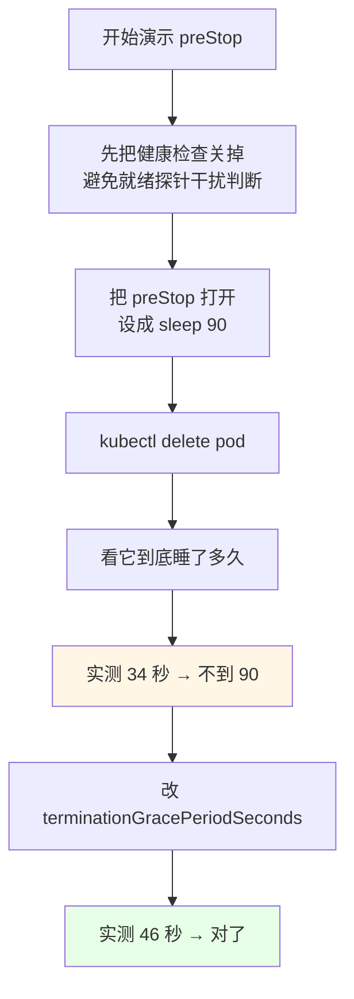
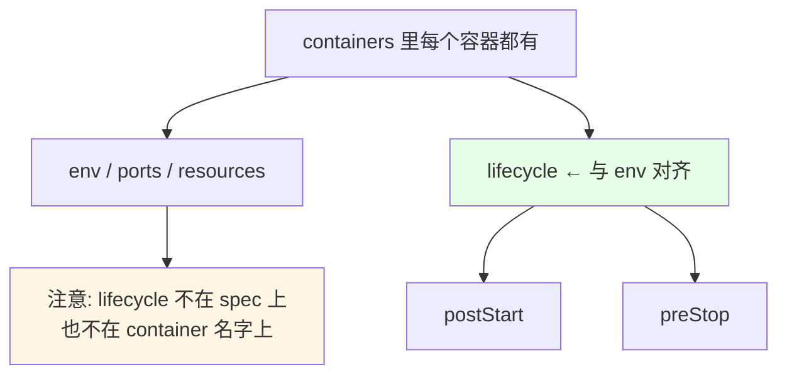
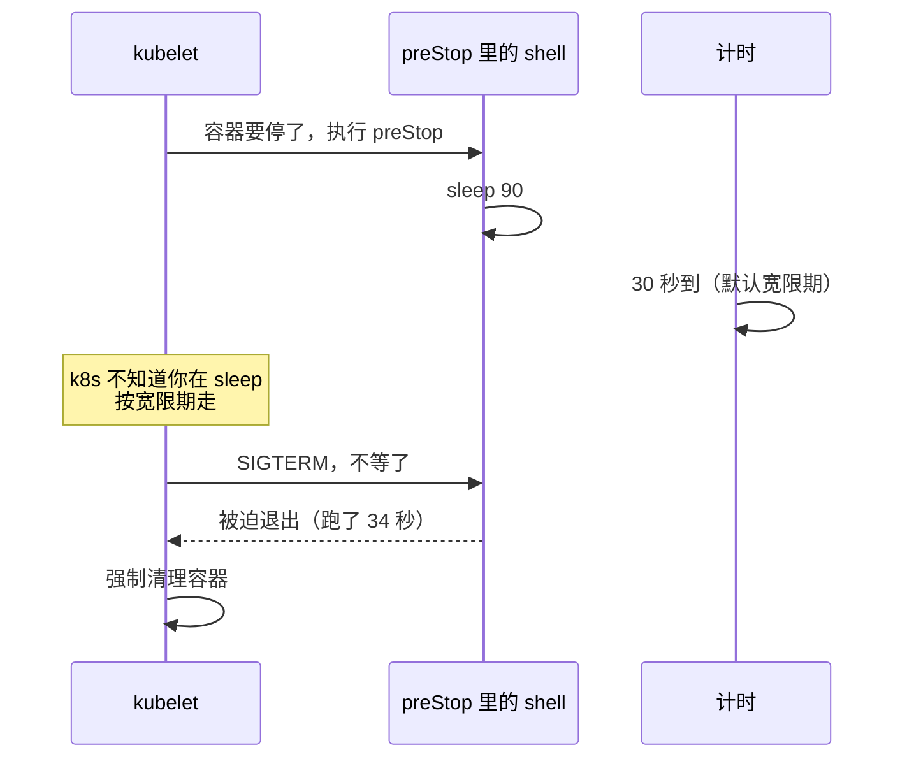
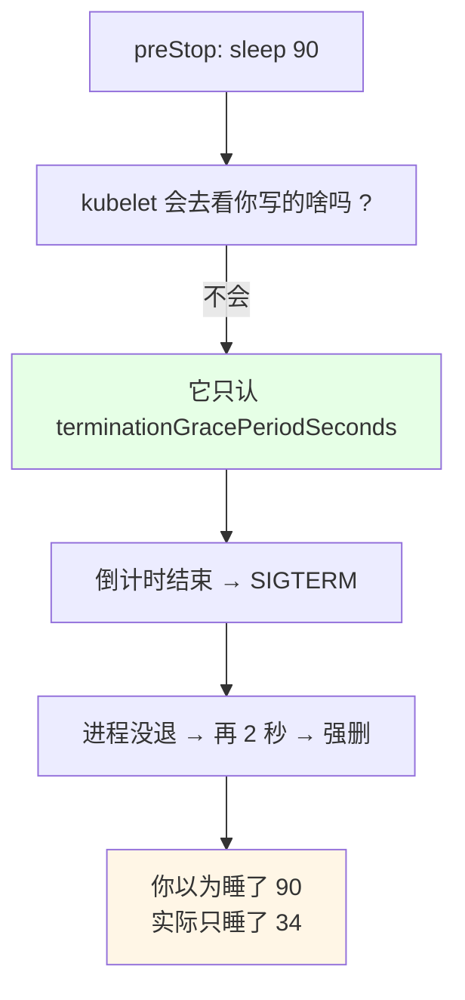
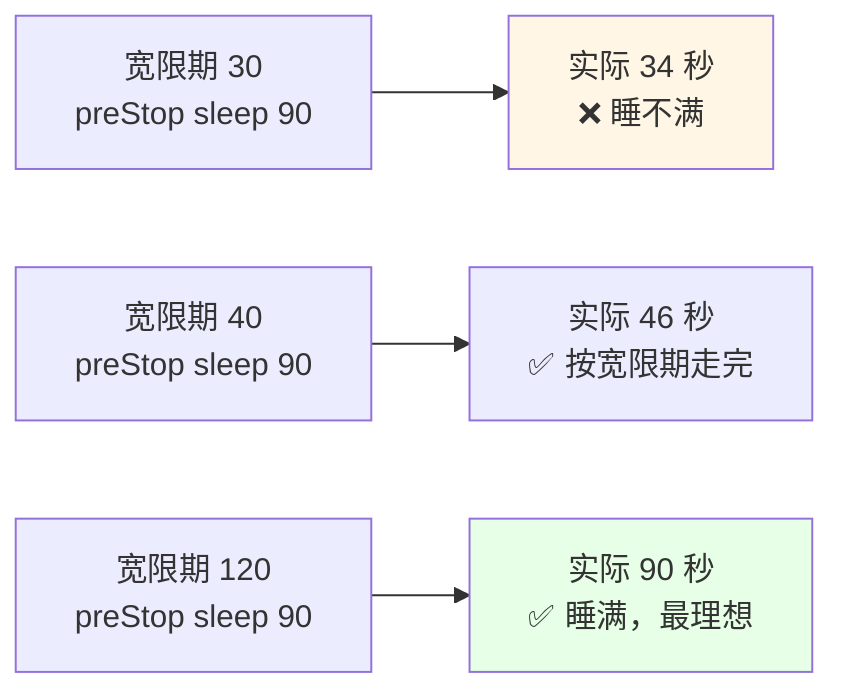
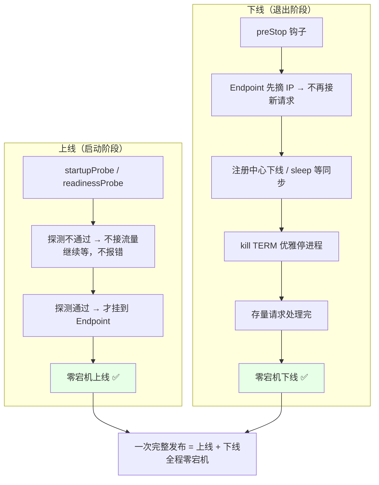

# Kubernetes 集群部署: 零宕机必备知识（PreStop 用法实测与宽限期联动）

上一篇把「Pod 退出会同时做三件事」讲清楚了，这一篇把它**真的跑一遍**：把 `preStop` 配成 `sleep 90`，然后删 Pod 看它到底睡不睡得满 90 秒。

结论先给（实测打脸）：

- **配了 `sleep 90`，实测只跑了 34 秒**：k8s 根本不知道你 preStop 里写的是 `sleep` 还是别的东西，它**无法预判时长**，到点就强制删；
- **真正控制等待时长的是 `terminationGracePeriodSeconds`**（Pod 级，默认 30 秒），不是 `preStop` 里的 `sleep`；
- **联动做法**：实测把宽限期改成 40 秒，删除后跑了约 46 秒 —— 想等多久，宽限期就配多大；
- **写位置别写错**：`lifecycle` 与 `env` **在容器下平级**，`preStop` 是 `lifecycle` 的子级（多缩进两级），这是最容易写歪的地方；
- **`lifecycle` 属于容器**：每个容器都可以配自己的 `lifecycle`；
- **排障靠 `kubectl describe` 的 Events**：`sleep` 本身没日志，describe 看不到执行内容，只能靠事件和时间反推；
- **上线靠健康检查、下线靠 preStop** —— 两个凑齐才是「零宕机发布」。

## 纲要

- 准备：先关掉健康检查，避免干扰
- preStop 该写在哪个层级（缩进对照）
- 实测一：sleep 90，实际只跑 34 秒
- 为什么 k8s 不等你：它无法预判 preStop 时长
- 实测二：宽限期改成 40，跑到 46 秒
- describe 的 Events 怎么用
- 「上线 + 下线」组合出零宕机
- 常见排错

## 准备：先关掉健康检查，避免干扰



| 步骤 | 动作 | 目的 |
| --- | --- | --- |
| 1 | 去掉 / 注释掉 `readinessProbe`、`livenessProbe` | 排除探针干扰，只看退出链路 |
| 2 | 补上 `lifecycle.preStop` = `sleep 90` | 看 preStop 会不会真的睡 90 秒 |
| 3 | `kubectl apply` 重建 Pod | 拿到带钩子的 Pod |
| 4 | `kubectl delete pod` 掐表 | 量真实耗时 |
| 5 | 改宽限期再删一次 | 验证联动 |

## preStop 该写在哪个层级（缩进对照）

`lifecycle` **在容器里面**，所以跟 `env` 是**平级**的；`preStop` 是 `lifecycle` 的子级，要多缩进两级。

```text
apiVersion: v1
kind: Pod
metadata:
  name: web
spec:                          ← Pod 级
├── containers:
│   └── name: web              ← 容器定义
│       ├── image: nginx:1.19
│       ├── env:               ← 容器配置（键）
│       ├── ports:             ← 容器配置（键）
│       └── lifecycle:         ← 与 env 平级（对齐写）
│           ├── postStart:     ← lifecycle 的子级（缩进两级）
│           └── preStop:       ← lifecycle 的子级（缩进两级）
│               └── exec:
│                   └── command:
│                       - /bin/sh
│                       - -c
│                       - sleep 90
```



写错的后果：缩进不对 → `lifecycle` 变成容器外的键（apiserver 直接拒），或者 `preStop` 挂到 `env` 下面（静默不生效，最坑）。

## 实测一：sleep 90，实际只跑 34 秒

```yaml
apiVersion: v1
kind: Pod
metadata:
  name: web
spec:
  containers:
  - name: web
    image: nginx:1.19
    lifecycle:
      preStop:
        exec:
          command:
          - /bin/sh
          - -c
          - sleep 90; echo preStop done
```

```bash
# 建 Pod
kubectl apply -f web-prestop.yaml

# 掐表删
time kubectl delete pod web
# 观察实际耗时：约 34 秒（不是 90 秒）

# 看事件，确认 preStop 被执行过
kubectl describe pod web
```



| 预期 | 实测 |
| --- | --- |
| preStop 跑满 90 秒 | ❌ 只跑了 **34 秒** |
| 原因 | 宽限期默认 **30 秒**，到点强删（再留 2 秒收尾） |
| 想睡 90 秒怎么办 | 必须把宽限期也配成 90 |

## 为什么 k8s 不等你：它无法预判 preStop 时长



关键点：**k8s 并不知道你的 preStop 是 `sleep`、是 `curl` 还是编译**，它无法预判这个回调要跑多久，所以只能死板地按宽限期倒计时走。网上那些「直接写个 `sleep 5` 就完事」的零宕机示例，多数忘了联动宽限期 —— **照抄必翻车**。

## 实测二：宽限期改成 40，跑到 46 秒

```yaml
apiVersion: v1
kind: Pod
metadata:
  name: web
spec:
  terminationGracePeriodSeconds: 40
  containers:
  - name: web
    image: nginx:1.19
    lifecycle:
      preStop:
        exec:
          command:
          - /bin/sh
          - -c
          - sleep 90; echo preStop done
```

```bash
kubectl apply -f web-prestop.yaml

# 确认宽限期生效
kubectl get pod web -o yaml | grep -A2 terminationGracePeriodSeconds

# 再掐表删
time kubectl delete pod web
# 这次约 46 秒
```



| 配置 | preStop | 宽限期 | 实测耗时 | 判定 |
| --- | --- | --- | --- | --- |
| 一 | `sleep 90` | 30（默认） | 34 秒 | ❌ 睡不满 |
| 二 | `sleep 90` | 40 | 46 秒 | ✅ 正常收尾 |
| 三 | `sleep 90` | 120 | 90 秒 | ✅ 睡满，最理想 |

规律：**实际耗时 = min(preStop 想跑多久, 宽限期) + 少量收尾时间**。所以要么把 `sleep` 调小去适配宽限期，要么把宽限期调大去适配 `sleep`，**两个必须一起看**。

## describe 的 Events 怎么用

```mermaid
flowchart TD
    A["kubectl apply"] --> B["kubectl get pod 看状态"]
    B --> C["kubectl describe pod"]
    C --> D["看 Events 区"]
    D --> E["确认 preStop 触发过<br/>确认删除耗时")
    E --> F["sleep 没日志<br/>只能靠事件和时间反推"]
    style D fill:#e6ffe6
    style F fill:#fff6e6
```

`kubectl describe` 看 Events 的两个价值：

1. **排错**：apply 写错字段、钩子执行失败，事件区都会挂一条；
2. **当监控用**：事件里能看到 Pod 状态迁移和异常，生产上把 Events 采集出来比翻日志省事。

注意一个实测细节：**`sleep` 本身不产生任何日志**，所以 describe 里看不到「我在执行 sleep」这种输出，只能通过结束时间和状态变化反推它跑没跑、跑了多久。

## 「上线 + 下线」组合出零宕机



| 阶段 | 工具 | 作用 |
| --- | --- | --- |
| 启动 | 探针（`startupProbe` / `readinessProbe`） | 没起来就不接流量 |
| 退出 | `preStop` + 宽限期 | 摘流量、做收尾、优雅停 |
| 两者齐备 | — | **零宕机发布** |

## 常见排错

| 现象 | 原因 | 处理 |
| --- | --- | --- |
| preStop 里 `sleep 90` 只跑 30 多秒 | 宽限期是默认 30 | 设 `terminationGracePeriodSeconds` |
| 配了 lifecycle 却没效果 | 缩进写错，挂到了容器外或 env 下 | 按缩进对照表检查 |
| apply 被 apiserver 拒绝 | 缩进越界，schema 不认识 | 对齐 `env` 那一层 |
| describe 里看不到 sleep 日志 | `sleep` 无输出 | 加 `echo` 打点，或看删除耗时 |
| delete 后卡在 Terminating 很久 | 进程不响应 SIGTERM | 检查应用 shutdown hook |
| 想强删卡住的 Pod | — | `kubectl delete pod --grace-period=0 --force` |

## API 速览

| 能力 | 做法 | 关键点 |
| --- | --- | --- |
| 容器级钩子 | `containers[].lifecycle` | 每个容器一份，与 `env` 平级 |
| 退出前执行 | `lifecycle.preStop.exec.command` | exec / httpGet / tcpSocket 三选一 |
| 打印钩子触发 | `command` 里加 `echo` 或 `sleep` 打点 | `sleep` 自身没有日志 |
| 控制等待时长 | `spec.terminationGracePeriodSeconds` | **真正决定等多久** |
| 看钩子和事件 | `kubectl describe pod` 的 Events | 也是日常监控入口 |
| 量实际耗时 | `time kubectl delete pod <名称>` | 实测最直观 |
| 看宽限期生效 | `kubectl get pod <名称> -o yaml` | grep `terminationGracePeriod` |
| 零宕机发布 | 探针 + preStop 组合 | 上线靠探针、下线靠 preStop |
| 强制删除 | `kubectl delete pod <名称> --grace-period=0 --force` | 会丢请求，慎用 |
| 多 Pod 批量看 | `kubectl get pods` | 默认值不加名字 |

## Demo 示例

```bash
# 1. 写一份最小 Pod：只有 preStop sleep 90 + 宽限期配置
cat > prestop-demo.yaml <<'EOF'
apiVersion: v1
kind: Pod
metadata:
  name: web
spec:
  terminationGracePeriodSeconds: 40
  containers:
  - name: web
    image: nginx:1.19
    lifecycle:
      preStop:
        exec:
          command:
          - /bin/sh
          - -c
          - echo "[preStop] start"; sleep 90; echo "[preStop] done"
EOF

# 2. 建立
kubectl apply -f prestop-demo.yaml
kubectl get pod web

# 3. 确认宽限期已经写进去了
kubectl get pod web -o yaml | grep -A2 terminationGracePeriodSeconds

# 4. 掐表删除，对比默认 30 秒的区别
kubectl delete pod web
time kubectl get pod web
# 宽限期 40 时，这里大约 40 秒上下

# 5. 看事件区，确认钩子触发过（sleep 本身没日志，靠 echo 打点）
kubectl describe pod web

# 6. 对比实验：把宽限期改回默认，再删一次，感受差距
kubectl patch pod web -p '{"spec":{"terminationGracePeriodSeconds":30}}' --type=merge
kubectl delete pod web --now
kubectl describe pod web | grep -i -A5 events
```

```bash
# 7. 生产向写法：preStop 里先下线再 sleep 再优雅停，宽限期配套
cat > graceful-down.yaml <<'EOF'
apiVersion: apps/v1
kind: Deployment
metadata:
  name: web
spec:
  replicas: 3
  selector:
    matchLabels:
      app: web
  template:
    metadata:
      labels:
        app: web
    spec:
      terminationGracePeriodSeconds: 120
      containers:
      - name: web
        image: registry/web:1.0
        readinessProbe:
          httpGet:
            path: /health/ready
            port: 8080
          periodSeconds: 5
        lifecycle:
          preStop:
            exec:
              command:
              - /bin/sh
              - -c
              - echo "[preStop] 从注册中心摘除"; sleep 100; echo "[preStop] 停进程"; kill $(cat /app/web.pid)
EOF

kubectl apply -f graceful-down.yaml
kubectl rollout restart deployment web
kubectl describe pod -l app=web
```

### 总结

- **实测打脸**：`preStop` 写 `sleep 90`，Pod 34 秒就没了 —— 因为 k8s 不知道你在 sleep，它只认宽限期；
- **真正管时长的是 `spec.terminationGracePeriodSeconds`**（默认 30 秒），想等 90 秒就配 90 秒，不是靠 `sleep` 单方面努力；
- **实际耗时 ≈ min(「preStop 想跑多久」, 宽限期) + 收尾开销**，配的时候两个一起算；
- **层级别写错**：`lifecycle` 与 `env` 在容器下平级，`preStop` 在 `lifecycle` 里多缩进两级，写歪了会静默失效；
- **`sleep` 没日志，`kubectl describe` 的 Events 是唯一抓手**：排错要 `echo` 打点，量时间靠掐表；
- **零宕机是个组合拳**：上线靠探针（`startupProbe` / `readinessProbe`）、下线靠 `preStop` + 宽限期，两件齐了发布才真的无感。

