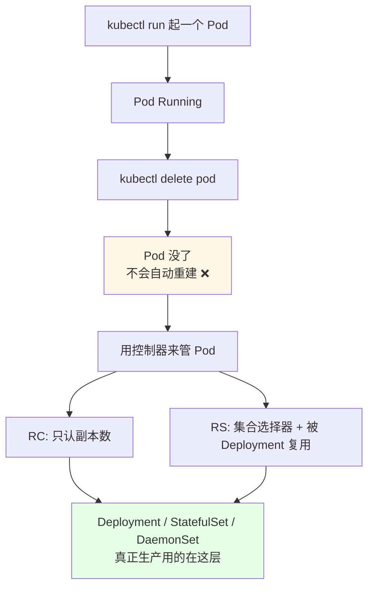
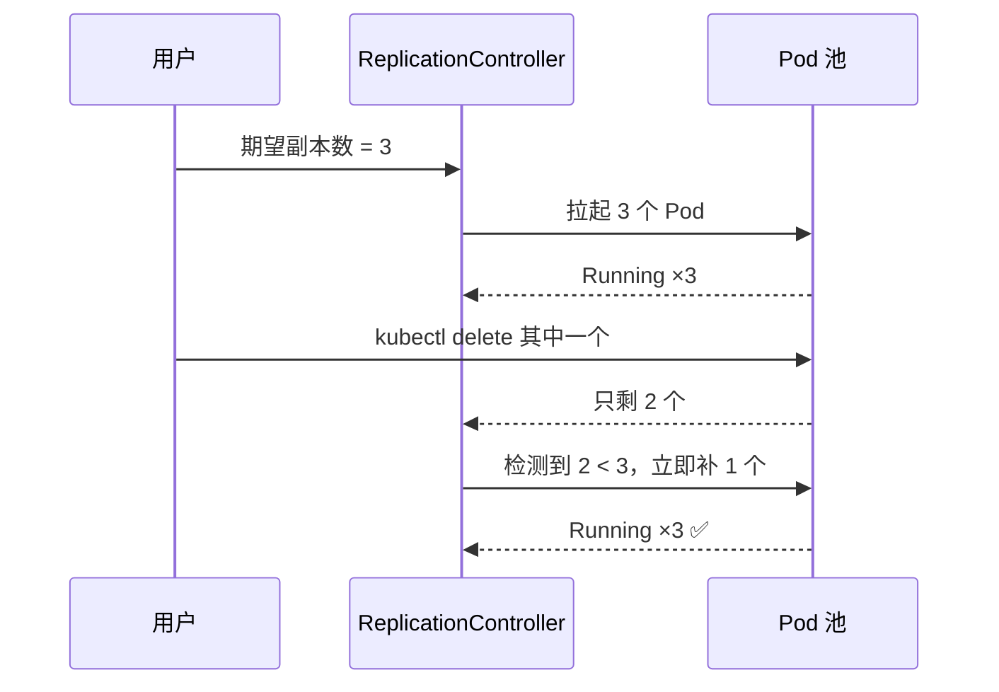
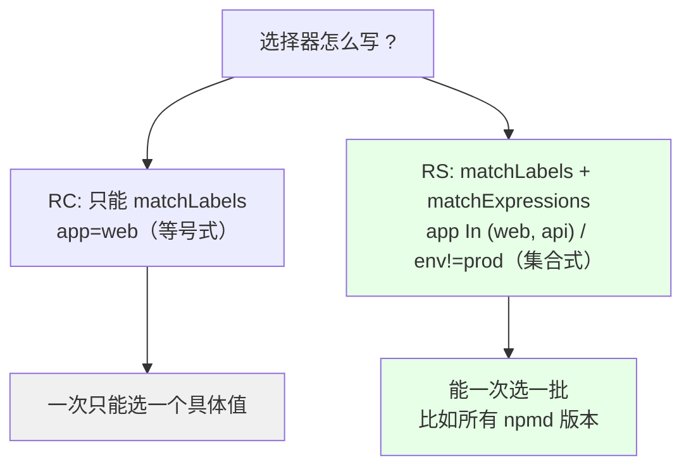
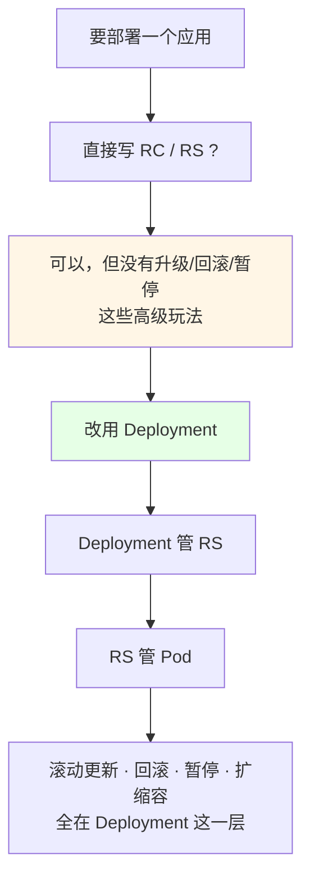
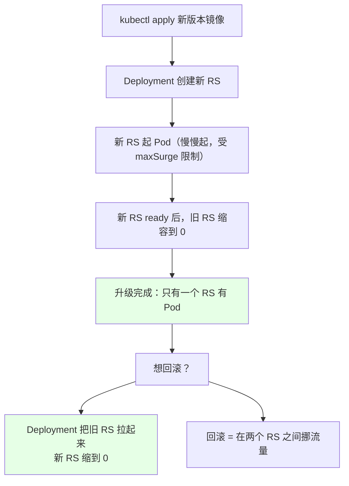

# Kubernetes 集群部署: RC 与 ReplicaSet（复制控制器与复制集的区别和定位）

Pod 讲完你会发现：**很多事配置一下就行，不用写一堆脚本**。但 Pod 本身有个死穴 —— 你手动 `kubectl delete` 一个 Pod，它**不会自己再冒出来**。要「永远保持 N 个副本」，就得有人在后面盯着、补位。这就是复制类控制器的活。

结论先给：

- **RC（ReplicationController，复制控制器）**：保证 Pod 副本数始终等于期望值；删掉一个会自动补一个 —— **已基本废弃，生产见不到了**；
- **RS（ReplicaSet，复制集）**：RC 的下一代，**支持基于集合的标签选择器**，日常**不单独用**；
- **唯一的区别就一句**：RS 支持集合式 selector（`matchExpressions`），RC 只吃等号式 selector（`matchLabels`）；
- **真正干活的是 Deployment**：我们一般不直接创建 RC / RS，而是用 **Deployment 去管 RS、RS 去管 Pod**；
- **RS 是被 Deployment 接管出来的**：每次滚动更新会**新生成一个 RS**（老的慢慢缩到 0），Deployment 的回滚就是「把流量切回旧 RS」；
- **RS 本身不支持回滚**，升级策略、回滚、暂停都挂在 Deployment 上。

## 纲要

- Pod 删了不会自己回来：需要控制器兜底
- RC：复制控制器，副本数永远回到期望值
- RS：复制集，基于集合的标签选择器
- RC 与 RS 的唯一区别：选择器写法
- 生产里为什么几乎不单独创建它们
- 看一眼真实集群：谁在被谁管理
- RS 与滚动更新、回滚的关系
- 常见排错

## Pod 删了不会自己回来：需要控制器兜底



YouTube 上你自己 `kubectl run` 出来的 Pod 单打独斗，删了就没了；交给控制器之后，「期望 3 个，就永远给你 3 个」变成集群的持续承诺。

## RC：复制控制器，副本数永远回到期望值



| 能力 | RC |
| --- | --- |
| 维持副本数 | ✅ 删了自动补 |
| 手动扩缩容 | ✅ `kubectl scale` |
| 直接改配置 | ✅ edit / apply |
| 滚动升级 | 有基础能力（旧 RC 慢慢降、新 RC 慢慢起） |
| 单独使用 | ❌ 已废弃，别在新集群里用 |

**一句话**：RC 干的活就是「确保这一组同类 Pod 总是可用」。

## RS：复制集，基于集合的标签选择器

- 官方定位：**next-generation replication controller，支持基于集合的标签选择器**；
- 主要用途：**与 Deployment 协同**，替 Deployment 去真正创建 / 删除 / 更新 Pod；
- 和 RC 的区别**只有选择器**：



| 维度 | RC | RS |
| --- | --- | --- |
| 全名 | ReplicationController | ReplicaSet |
| 中文 | 复制控制器 | 复制集 |
| 选择器 | 只支持 `matchLabels`（等式） | `matchLabels` + **`matchExpressions`（集合）** |
| 状态 | **已废弃** | 仍在用，但**不单独创建** |
| 谁来管它 | 没人（直接用） | **Deployment 管它** |
| 是否支持回滚 | 不支持 | RS 本身不支持，回滚靠 Deployment |

## RC 与 RS 的选择器写法对照

```yaml
# RC：只能写 matchLabels，等号式
apiVersion: v1
kind: ReplicationController
metadata:
  name: web-rc
spec:
  replicas: 3
  selector:
    app: web
  template:
    metadata:
      labels:
        app: web
    spec:
      containers:
      - name: web
        image: registry/web:1.0
        ports:
        - containerPort: 8080
```

```yaml
# RS：额外支持 matchExpressions 集合式选择器
apiVersion: apps/v1
kind: ReplicaSet
metadata:
  name: web-rs
spec:
  replicas: 3
  selector:
    matchLabels:
      app: web
    matchExpressions:
    - key: release
      operator: In
      values:
      - canary
      - stable
  template:
    metadata:
      labels:
        app: web
        release: canary
    spec:
      containers:
      - name: web
        image: registry/web:1.0
        ports:
        - containerPort: 8080
```

| 写法 | 含义 | RC | RS |
| --- | --- | --- | --- |
| `app: web` | 等于 web | ✅ | ✅ |
| `app In (a,b)` | 属于集合 | ❌ | ✅ |
| `key NotIn` / `Exists` / `DoesNotExist` | 存在性判断 | ❌ | ✅ |

## 生产里为什么几乎不单独创建它们



**现实情况**：现在生产集群里几乎不可能见到单独创建的 RC / RS，因为上层都有更顺手的资源去管它们 —— **Deployment（无状态）、StatefulSet（有状态）、DaemonSet（每节点一个）**。

## 看一眼真实集群：谁在被谁管理

课程里用 kube-system 下的 metrics-server 举例，你随便打开一个在跑的 Deployment 就能看到这层关系：

```text
kubectl get deploy -n kube-system
├── metrics-server
│       └── 它的.spec.template 里定义了 RS 期望
│
kubectl get rs -n kube-system
├── metrics-server-5b8f9c7d44   ← 第一次创建的 RS（现在缩到 0）
└── metrics-server-6c9d7f8b21    ← 升级后生成的 RS（当前在用）
        └── 它下面挂着 1 个 Pod
```

```bash
# 看 Deployment 当前由哪个 RS 在管
kubectl get deploy metrics-server -n kube-system -o yaml | grep -A5 template

# 看 RS 列表，每个版本一个
kubectl get rs -n kube-system

# 看 RS 下面挂了哪些 Pod
kubectl get pod -n kube-system -o wide
```

## RS 与滚动更新、回滚的关系



| 动作 | 谁在做 | 落到哪 |
| --- | --- | --- |
| 滚动更新 | Deployment | 新建 RS，逐步替换旧 RS 的 Pod |
| 扩容 | Deployment → RS | RS 按 `replicas` 补 Pod |
| 回滚 | `kubectl rollout undo` | 把旧 RS 的副本数拉回、新 RS 缩到 0 |
| 暂停 / 继续 | `kubectl rollout pause/resume` | 冻住当前 RS 状态 |
| **RS 自己能不能回滚** | ❌ 不行 | 这些能力只挂在 Deployment 上 |

**记法**：Deployment 是「导演」，RS 是「剧组」，Pod 是「演员」。导演可以重拍、可以回退到上一个版本；RS 本身只会执行当前这一版。

## 常见排错

| 现象 | 原因 | 处理 |
| --- | --- | --- |
| 集群里找不到单独创建的 RC / RS | 生产都用 Deployment，RS 是它自动建的 | 去看 `kubectl get rs -o wide` 里的多余 RS |
| RS 创建了但 Pod 一个都没有 | selector 匹配不到 template 的 labels | 对齐 `selector` 和 `template.metadata.labels` |
| 两个控制器抢同一批 Pod | selector 有重叠 | 保证一个 Pod 只被一个控制器管，否则会互相打架扩缩 |
| 想回滚但 `rollout undo` 报不支持 | 直接对 RS 操作了 | 回滚只能在 Deployment 上做 |
| 升级后旧 RS 一直不缩到 0 | `maxUnavailable` 卡住 / Pod 卡 Terminating | 查 Pod 退出，见 preStop 那一篇 |
| RC 还留在集群里 | 老集群迁移遗留 | 确认无引用后删除，别留个没人管的孤儿 |

## API 速览

| 能力 | 做法 | 关键点 |
| --- | --- | --- |
| 维持副本数 | `kind: ReplicationController` / `ReplicaSet` + `replicas` | 删 Pod 自动补 |
| 集合式选择器 | `selector.matchExpressions` | 只有 RS 支持，RC 不行 |
| 创建方式 | 写 yaml，`kubectl apply` | 和 Pod 一样用清单 |
| 看副本关系 | `kubectl get rs -o wide` / `kubectl get deploy` | 谁在管谁一目了然 |
| 手动扩缩 | `kubectl scale` | RC / RS / Deployment 都吃 |
| 滚动更新 | 交给 Deployment | **别在 RC/RS 上手搓** |
| 回滚到上一版 | `kubectl rollout undo deployment <名称>` | 靠新旧两个 RS 切换 |
| 暂停更新 | `kubectl rollout pause deployment web` | 灰度分批用 |
| 继续更新 | `kubectl rollout resume deployment web` | 接着往下滚 |
| 看更新状态 | `kubectl rollout status deployment <名称>` | 卡住了第一时间发现 |
| 生产推荐资源 | Deployment / StatefulSet / DaemonSet | 直接用这三个，别单独建 RC/RS |

## Demo 示例

```bash
# 1. 看一眼真实集群里的三层关系：Deployment → RS → Pod
kubectl get deploy -A | head -20
kubectl get rs -A | head -20
kubectl get pod -A -o wide | head -20

# 2. 手动建一个 RS（生产不这么干，但用来看行为）
cat <<'EOF' | kubectl apply -f -
apiVersion: apps/v1
kind: ReplicaSet
metadata:
  name: web-rs
spec:
  replicas: 3
  selector:
    matchLabels:
      app: web
  template:
    metadata:
      labels:
        app: web
    spec:
      containers:
      - name: web
        image: registry/web:1.0
        ports:
        - containerPort: 8080
EOF

# 3. 删掉 RS 管下的一个 Pod，看它会不会补回来
kubectl get pods -l app=web
POD_NAME=$(kubectl get pods -l app=web -o jsonpath='{.items[0].metadata.name}')
kubectl delete pod "$POD_NAME"
kubectl get pods -l app=web
# 期望：副本数很快回到 3

# 4. 感受「RS 自己不支持回滚」：升级要在 Deployment 层做
kubectl set image deployment/web web=registry/web:2.0
kubectl rollout status deployment web
kubectl get rs
# 会看到新旧两个 RS，旧 RS 逐渐缩到 0

# 5. 回滚到上一个版本（只有 Deployment 能做）
kubectl rollout undo deployment web
kubectl rollout status deployment web
kubectl get rs
```

```yaml
# 6. 生产正解：只写 Deployment，RS 让 k8s 自己生成
apiVersion: apps/v1
kind: Deployment
metadata:
  name: web
spec:
  replicas: 3
  strategy:
    type: RollingUpdate
    rollingUpdate:
      maxSurge: 1
      maxUnavailable: 0
  selector:
    matchLabels:
      app: web
  template:
    metadata:
      labels:
        app: web
    spec:
      containers:
      - name: web
        image: registry/web:1.0
        ports:
        - containerPort: 8080
```

### 总结

- **RC 的作用是「保证副本数」**：期望 3 个就永远给你 3 个，删一个补一个；但**它已经废弃，别在新集群里用**；
- **RS 是 RC 的下一代，唯一的区别是选择器**：RS 支持 `matchExpressions` 集合式选择器，RC 只支持等号；
- **生产里几乎不单独创建 RC / RS** —— 直接用 **Deployment / StatefulSet / DaemonSet**，这是判断「你写得专不专业」的一条分水岭；
- **层级是 Deployment 管 RS、RS 管 Pod**：看 `kubectl get rs` 能清楚看到每次升级生成的新旧 RS；
- **回滚的本质是「新旧两个 RS 之间挪流量」**：RS 自己不会回滚，升级策略、回滚、暂停全在 Deployment 上配；
- 真要排查，抓三行命令就够：`kubectl get deploy`、`kubectl get rs`、`kubectl get pod -o wide`。

