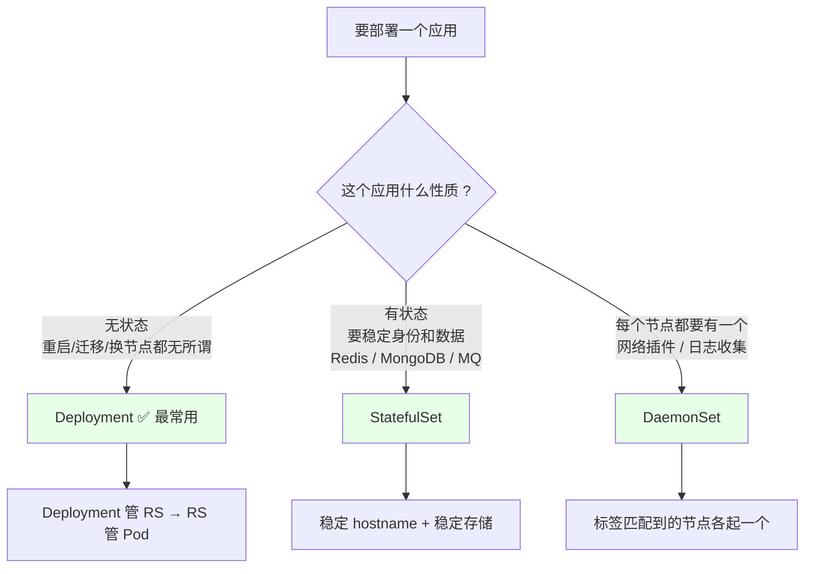
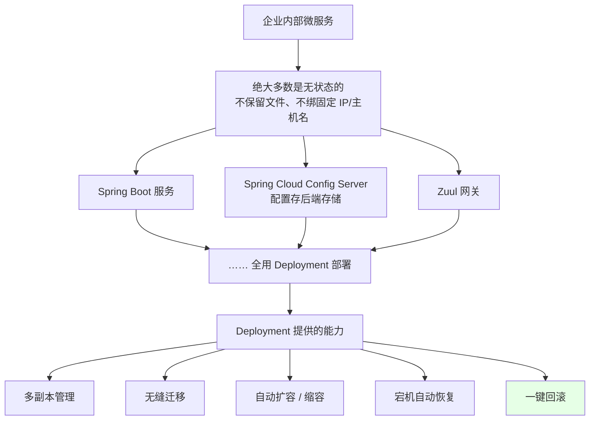
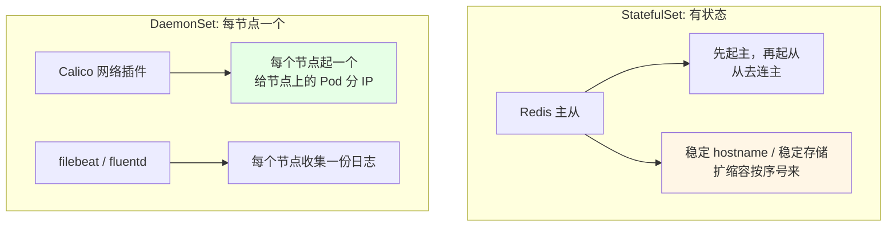
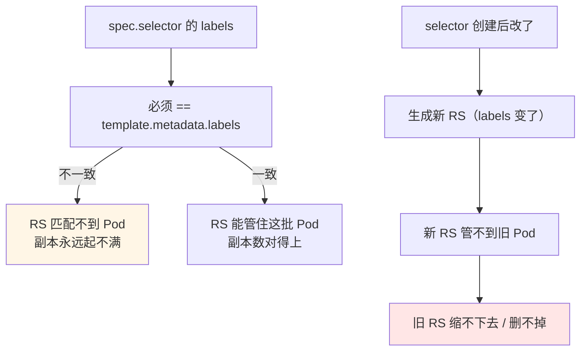
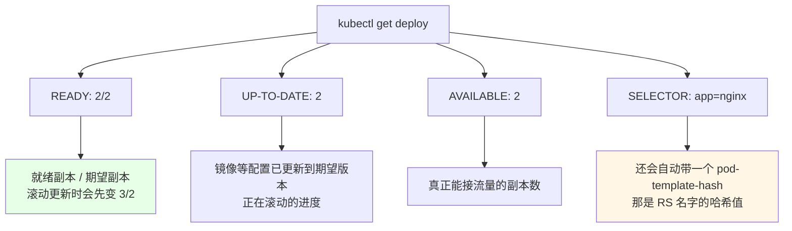
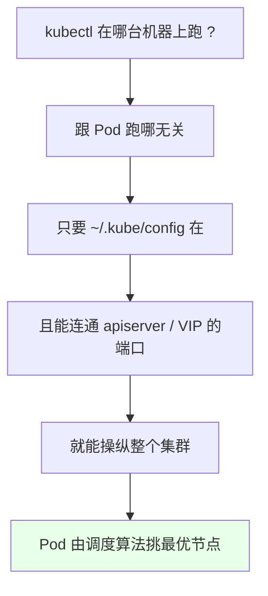

# Kubernetes 集群部署: 无状态服务 Deployment 概念（与 StatefulSet / DaemonSet 的区别）

Pod 和 RC / RS 都讲完了，但**生产里几乎没人直接创建它们** —— Pod 偶尔起一个做调试，RS / RC 基本见不到。真正干活的是 k8s 三种最常用的部署方式。

结论先给：

- **三种控制器分工**：**Deployment** 管无状态、**StatefulSet** 管有状态、**DaemonSet** 管「每个节点都得有一个」；
- **Deployment 是日常主力**：企业内部以微服务为主，微服务绝大多数是无状态的（Spring Boot、Spring Cloud 的 configserver、Zuul 网关……），**都用 Deployment 部署**；
- **Deployment 不直接管 Pod**：它是 **Deployment 管 RS、RS 管 Pod**，中间这层 RS 是为了保留历史版本，好支持回滚；
- **Deployment 有 RS 没有的高级能力**：多副本管理、无缝迁移、**自动扩缩容**、**自动宕机恢复**、**一键回滚**；
- **坑一：`spec.selector` 创建后不可改**（新版本 k8s 直接拒绝）。改了会生成新 RS 管不到旧 Pod，旧 RS 删不掉，特别危险；
- **坑二：`matchLabels` 必须与 `template.metadata.labels` 写一样**，否则它管不了你的 Pod；
- **Pod 调度不是「在哪创建就跑哪」**：kubectl 只是控制面工具，Pod 落在哪个节点由调度算法算。

## 纲要

- 三种部署方式先分清楚
- Deployment：无状态服务的首选
- StatefulSet / DaemonSet 各自解决什么
- 用命令创建第一个 Deployment
- 把 yaml 导出来逐段解读
- selector 为什么不能改
- Deployment 状态字段怎么看
- Pod 到底落在哪个节点
- 常见排错

## 三种部署方式先分清楚



| 控制器 | 适用场景 | 典型例子 | 关键特征 |
| --- | --- | --- | --- |
| **Deployment** | 无状态服务 | Spring Boot、configserver、Zuul 网关 | 多副本、滚动更新、回滚、扩缩容 |
| **StatefulSet** | 有状态应用 | Redis、MongoDB、Kafka | 稳定身份、启动顺序、独立存储 |
| **DaemonSet** | 每节点一个 | Calico、filebeat、fluentd | 按节点跑、节点多了自动补 |

生产上的理想形态：**应用尽量做成无状态**，要保留的数据（头像、文件、缓存）用后面的存储单独挂盘 —— 这既符合云原生趋势，也让应用随便重启、发布、回滚、换节点。

## Deployment：无状态服务的首选



**Deployment 提供的这些高级功能，RS / RC 是没有的** —— 这就是非要套一层 Deployment 的原因。

## StatefulSet / DaemonSet 各自解决什么



- **StatefulSet**：想让 Redis 先起主、再起从，从节点主动连到主节点 —— 这种「有先后顺序、有身份」的活它干；
- **DaemonSet**：Calico 要在每个节点上都起一个容器给 Pod 分 IP，filebeat 要在每个节点收集日志 —— 标签匹配到哪些节点就铺哪些节点。

## 用命令创建第一个 Deployment

```bash
# 1. 命令行快速起一个（等于给你生成一份可用的清单）
kubectl create deployment nginx --image=nginx:1.15.2 --image-pull-policy=IfNotPresent

# 2. 看状态
kubectl get deploy nginx

# 3. 把清单导出来，后面都靠它改
kubectl get deploy nginx -o yaml > nginx-deploy.yaml

# 4. 改副本数，再 apply 上去
kubectl replace -f nginx-deploy.yaml
kubectl get deploy nginx

# 5. 也可以直接在线编辑（vim 操作，按 Shift+ZZ 保存退出）
kubectl edit deployment nginx

# 6. 没指定 namespace，默认落在 default
kubectl get deploy -n default
```

```text
nginx-deploy.yaml 的骨架（导出来之后建议先删掉这些）:
├── apiVersion: apps/v1
├── kind: Deployment
├── metadata:
│   ├── name: nginx
│   └── labels:            ← 这是 Deployment 自己的标签
│       └── app: nginx
├── spec:
│   ├── replicas: 1        ← 副本数，可按需改
│   ├── selector:          ← 选谁管（不可变！）
│   ├── template:
│   │   ├── metadata.labels   ← 必须跟 selector 一致
│   │   └── spec.containers
│   └── strategy           ← 滚动更新策略（后续章节展开）
├── status:                ← 自动生成的，手写时删掉
│   ├── readyReplicas
│   └── conditions
└── ...                    ← 1.16+ 新增的一堆 status 字段，删掉更清爽
```

## 把 yaml 导出来逐段解读

```yaml
apiVersion: apps/v1
kind: Deployment
metadata:
  name: nginx
  labels:
    app: nginx
spec:
  replicas: 1
  revisionHistoryLimit: 2
  selector:
    matchLabels:
      app: nginx
  strategy:
    type: RollingUpdate
    rollingUpdate:
      maxSurge: 1
      maxUnavailable: 0
  template:
    metadata:
      labels:
        app: nginx
    spec:
      containers:
      - name: nginx
        image: nginx:1.15.2
        imagePullPolicy: IfNotPresent
        ports:
        - containerPort: 80
```

| 字段 | 含义 | 注意点 |
| --- | --- | --- |
| `metadata.labels` | **Deployment 自己**的标签 | 跟 Pod 无关，只是给这个控制器贴标 |
| `spec.selector.matchLabels` | 这个 Deployment 管哪些 Pod | **创建后不可改** |
| `spec.template.metadata.labels` | Pod 模板的标签 | **必须与 selector 一模一样**，否则管不住 Pod |
| `spec.replicas` | 期望副本数 | 改它触发扩/缩容 |
| `spec.revisionHistoryLimit` | 保留多少个历史版本 | 回滚时要用，太小会丢历史 |
| `spec.strategy` | 滚动更新策略 | 后续章节单独讲 |
| `spec.template.spec.containers` | 容器定义，和写 Pod 完全一样 | 直接照搬 Pod 的 spec |
| `status.*` | 运行时状态 | 自己写清单时删掉 |



**`selector` 一旦创建就不许改** —— 新版本 k8s 改的时候会直接报错提示不可变；旧版本可能放行，但改完新 RS 认不了老 Pod，旧的 RS 卡着删不掉，这是实打实踩过的坑。

## Deployment 状态字段怎么看

```bash
kubectl get deploy nginx
```

```text
NAME    READY   UP-TO-DATE   AVAILABLE   AGE   CONTAINERS   IMAGES          SELECTOR
nginx   2/2     2            2           5m    nginx        nginx:1.15.2   app=nginx
```



| 列 | 含义 | 什么时候会变 |
| --- | --- | --- |
| `READY` | 就绪副本 / 期望副本（如 `2/2`） | 滚动更新时可能先看到 `3/2` |
| `UP-TO-DATE` | 已经升级到**当前期望版本**的副本数 | 更新镜像时先涨后落 |
| `AVAILABLE` | 真正可用的副本数 | 更新完成后稳定下来 |
| `AGE` | 应用跑了多久 | — |
| `CONTAINERS` / `IMAGES` | 容器名和镜像 | 改镜像时变 |
| `SELECTOR` | 它管的 Pod 标签 | 含自动生成的 `pod-template-hash` |

那个 **`pod-template-hash`** 是Deployment 自动生成并打上的，它就是 RS 名字的一部分 —— Deployment 靠「记住历史 RS」来实现回滚。

## Pod 到底落在哪个节点



```bash
kubectl get pods -o wide
# NODE 列显示的才是真实落点，不是你执行 kubectl 的那台机器
```

kubectl 只是整个集群的**控制工具**：你拿着 kubeconfig，在哪台机器上敲都一样，跟集群的连接通就行。**Pod 落在哪个节点是调度算法算出来的**（资源余量、亲和性、污点等，后面章节会展开），不是「在哪个节点创建的就跑哪」。

## 常见排错

| 现象 | 原因 | 处理 |
| --- | --- | --- |
| `selector` 改不动，apply 报错 | 新版本 k8s 判定不可变 | 重建一个 Deployment，别改原来的 |
| Pod 起不满，`READY` 一直 0/2 | `selector` 与 `template.labels` 不一致 | 对齐这两处 |
| 旧 RS 一直缩不到 0 | 改过 selector，新旧 RS 抢 Pod | 确认没遗留引用后重建 Deployment |
| 想回滚但说版本不够 | `revisionHistoryLimit` 太小 | 把它调大（默认 10，可设更大） |
| 导出的 yaml 里一堆字段看不懂 | `status` 部分是运行时生成的 | 手写清单时删掉 `status` |
| Pod 不知道怎么排到这台机器 | 以为是「在哪创建跑哪」 | 看 `-o wide` 的 NODE 列，调度由算法决定 |
| 忘了指定 namespace | 默认落在 `default` | 生产一律显式写 namespace |

## API 速览

| 能力 | 做法 | 关键点 |
| --- | --- | --- |
| 命令行创建 | `kubectl create deployment <名称> --image=<镜像>` | 顺手生成可用清单 |
| 指定拉取策略 | `--image-pull-policy=IfNotPresent` | 避免每次都拉 |
| 导出清单 | `kubectl get deploy <名称> -o yaml > <文件>.yaml` | 改之前先导出 |
| 应用修改 | `kubectl replace -f <文件>` / `kubectl apply -f` | 二者都能改配置 |
| 在线改 | `kubectl edit deployment <名称>` | Shift+ZZ 保存退出 |
| 看状态 | `kubectl get deploy` | 看 READY / UP-TO-DATE / AVAILABLE |
| 看落点 | `kubectl get pod -o wide` | NODE 列才是真答案 |
| 指定 namespace | `-n <命名空间>` | 不写就是 default |
| 看历史 RS | `kubectl get rs` | 回滚要靠它 |
| 副本数 | `spec.replicas` | 改了触发扩缩容 |
| 历史版本数 | `spec.revisionHistoryLimit` | 回滚保留条数 |

## Demo 示例

```bash
# 1. 起一个 Deployment（容器名 nginx，镜像 nginx:1.15.2）
kubectl create deployment nginx --image=nginx:1.15.2 --image-pull-policy=IfNotPresent
kubectl get deploy nginx

# 2. 导出清单，删掉 status 相关字段后留作模板
kubectl get deploy nginx -o yaml > nginx-deploy.yaml
kubectl replace -f nginx-deploy.yaml

# 3. 改副本数看效果：先起 2 个
kubectl scale deployment nginx --replicas=2
kubectl get deploy nginx
kubectl get pods -o wide

# 4. 看这个 Deployment 管着的 RS（带 pod-template-hash 的那一串）
kubectl get rs -o wide | grep nginx
kubectl get pod --show-labels

# 5. 试试改 selector（新版本会拒绝，或被拦住）
kubectl edit deployment nginx
# 把 select 里的 app: nginx 改成 app: ng1 后保存
# 期望: apiserver 报 immutable 类错误，提示不可修改

# 6. 清理
kubectl delete deployment nginx
```

```yaml
# 7. 手写一份干净的 Deployment（生产模板骨架）
apiVersion: apps/v1
kind: Deployment
metadata:
  name: web
  namespace: production
  labels:
    app: web
spec:
  replicas: 3
  revisionHistoryLimit: 5
  selector:
    matchLabels:
      app: web
  template:
    metadata:
      labels:
        app: web
    spec:
      containers:
      - name: web
        image: registry/web:1.0
        imagePullPolicy: IfNotPresent
        ports:
        - containerPort: 8080
```

### 总结

- **三选一记住**：无状态用 **Deployment**、有状态（Redis / MongoDB / MQ）用 **StatefulSet**、每节点一个（Calico、日志采集）用 **DaemonSet**；
- **Deployment 是日常主力**：微服务基本都是无状态的（Spring Boot、configserver、Zuul），生产理想状态是**应用尽量无状态，数据走存储**；
- **层级是 Deployment → RS → Pod**，RS 那层存在的意义是保存历史版本，好让回滚「把旧 RS 拉起来、新 RS 缩到 0」；
- **`spec.selector` 创建后不可变，`matchLabels` 必须与 Pod 模板标签完全一致** —— 前者改了会造成旧 RS 删不掉，后者不一致会永远起不满副本；
- **状态看四列就够**：`READY`（就绪/期望）、`UP-TO-DATE`（进度）、`AVAILABLE`（可用）、`SELECTOR`（含自动生成的 `pod-template-hash`）；
- **Pod 落在哪个节点跟你在哪敲命令无关**，调度算法自己算，`kubectl get pod -o wide` 看 NODE 列才是真相。

