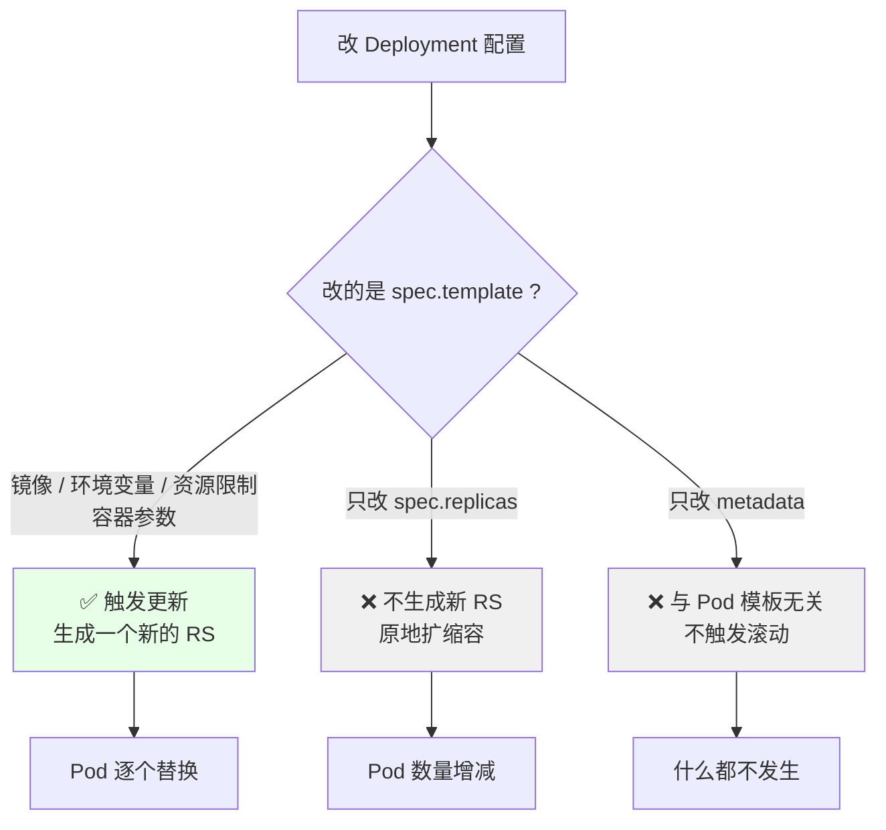
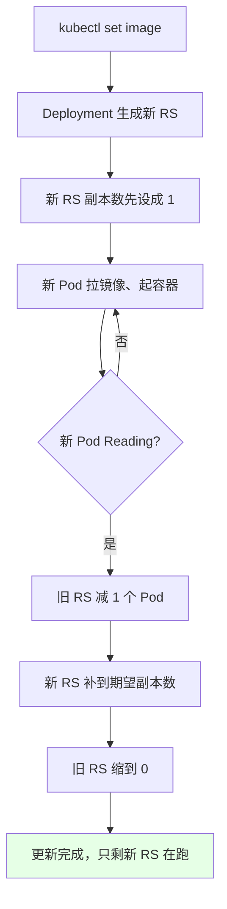
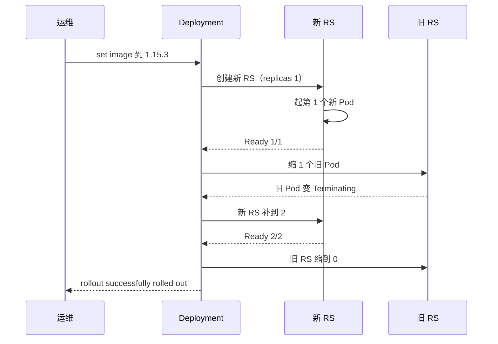
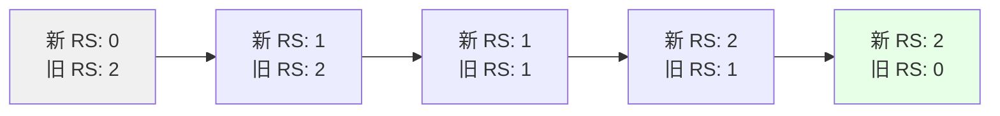
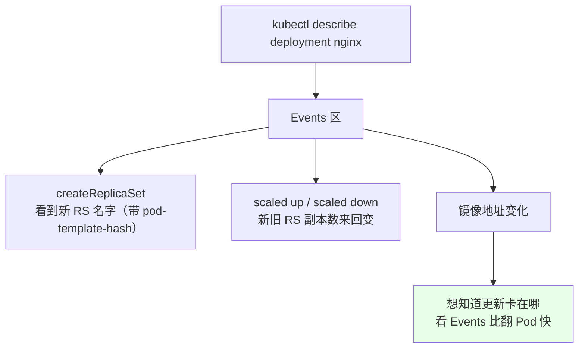
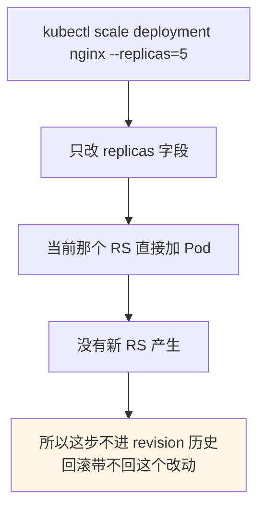

# Kubernetes 集群部署: Deployment 的更新（滚动发布过程与 set image --record）

Deployment 建完之后配置不可能一成不变 —— 改副本数、改镜像地址、改镜像版本、改 CPU / 内存，天天都在改。

结论先给：

- **k8s 有个硬约束：只有改了 `spec.template` 里面的东西才会触发更新**（并生成新 RS）；**改 `replicas` 不会生成新 RS**；
- **CI/CD 里最常用的触发方式**：`kubectl set image deployment nginx nginx=nginx:1.15.3`；
- 一个 Deployment 里可能挂多个同名容器，**改哪个容器必须把容器名写上**，`set` 语法是 `deployment/<名称> <容器名>=<镜像>`；
- **加 `--record`**：把这次改动记进 revision 历史，后面 `rollout history` 才能看到「每一版到底改了什么参数」；
- **`kubectl rollout status deployment <名称>`** 看滚动更新进度，比睁眼盯 Pod 靠谱；
- **滚动发布的真实节奏**：先建新 RS，新 RS 起 1 个 → 老 RS 减 1 个 → 新 RS 补到期望值 → 老 RS 归零；
- **默认策略就是 RollingUpdate（滚动发布）**，节奏参数在 `spec.strategy` 里配。

## 纲要

- 什么改动才会触发更新
- 用命令触发一次镜像升级
- rollout status 看更新过程
- 滚动发布的真实节奏（新 RS / 旧 RS 怎么换）
- describe 的事件里能看到什么
- 副本数改动为什么不生成新 RS
- 常见排错

## 什么改动才会触发更新



| 改动 | 触发滚动更新 | 生成新 RS | 表现 |
| --- | --- | --- | --- |
| 镜像版本 `image` | ✅ | ✅ | Pod 逐个换新 |
| 环境变量 `env` | ✅ | ✅ | Pod 逐个换新 |
| 资源限制 CPU / 内存 | ✅ | ✅ | Pod 逐个换新 |
| 容器名 / 启动命令 | ✅ | ✅ | Pod 逐个换新 |
| **副本数 `replicas`** | ❌ | ❌ | 只是多起 / 少起几个 Pod |
|  Deployment 自己的 label | ❌ | ❌ | 不影响 Pod |

**这条判据很重要**：日常扩容别指望它产生新版本，也别指望它能进回滚历史 —— 改 `replicas` 只是给当前 RS 加减人。

## 用命令触发一次镜像升级

```bash
# 1. 当前版本
kubectl get deploy nginx -o wide | grep nginx
# IMAGE 列: nginx:1.15.2

# 2. 改镜像版本，容器名 nginx 必须写，--record 记一笔改动历史
kubectl set image deployment/nginx nginx=nginx:1.15.3 --record=true

# 3. 立刻就能看到 Deployment 的镜像变了
kubectl get deploy nginx

# 4. 盯滚动更新过程
kubectl rollout status deployment/nginx

# 5. 看历史里记了什么
kubectl rollout history deployment/nginx
```



| 参数 | 作用 |
| --- | --- |
| `deployment/nginx` | 目标资源类型 + 名字 |
| 第二个 `nginx` | **容器名**（一个 Deployment 里可能有多个容器，不写就改错） |
| `=nginx:1.15.3` | 新的镜像地址与 tag |
| `--record=true` | 把这次改动写进 revision 历史，回滚时能说清改了啥 |

## rollout status 看更新过程

```bash
# 边滚边看，更新完自动返回
kubectl rollout status deployment/nginx

# 想实时刷就加 --watch
kubectl rollout status deployment/nginx --watch

# 卡住了想看细节
kubectl describe deployment nginx
kubectl describe rs | head -40
```

```text
kubectl rollout status 的输出里会告诉你:
- Waiting for rollout to finish: 1 out of 2 new replicas have been updated...
- Waiting for deployment spec update to be observed...
- deployment "nginx" successfully rolled out
```



## 滚动发布的真实节奏（新 RS / 旧 RS 怎么换）

课程里用 `describe` 逐帧拆过一次，逻辑是这样的：

```text
kubectl describe deployment nginx   ← 看 Events 区最清楚

第 1 步: createReplicaSet "nginx-5c8d7f6b9c"   ← 新 RS 诞生
第 2 步: scaled up replica set "nginx-5c8d7f6b9c" to 1
第 3 步: 新 Pod Running / Ready  (1/1)
第 4 步: scaled down replica set "nginx-4697b8f5d" to 1   ← 旧 RS 少一个
第 5 步: scaled up replica set "nginx-5c8d7f6b9c" to 2   ← 新 RS 补满
第 6 步: scaled down replica set "nginx-4697b8f5d" to 0   ← 旧 RS 归零
第 7 步: 更新结束，集群里只剩新 RS
```

| 阶段 | 新 RS | 旧 RS | 目的 |
| --- | --- | --- | --- |
| 起点 | 0 | 2 | 老版本在跑 |
| 建新 RS | 1 | 2 | 先试一个，确认能起 |
| 新 Pod Ready | 1 | 2 | 观察通过 |
| 换第一个 | 1 | 1 | 旧的下、新的上 |
| 补满 | 2 | 1 | 逐步替换 |
| 收尾 | 2 | 0 | 旧版全下线 |



**「一次起几个新的、同时允许几个旧的挂着」由 `spec.strategy.rollingUpdate` 的 `maxSurge` / `maxUnavailable` 决定**（默认 `maxSurge: 25%`、`maxUnavailable: 25%`），所以你在过程里看到 READY 一度是 `3/2` 之类的中间态是对的。

## describe 的事件里能看到什么



`describe` 比 `rollout status` 更细：status 只告诉你「完了没」，describe 能让你看清**每一步是谁在被扩容、谁在被缩容**。回滚和排障都靠它。

更新这件事上，你手边其实只有四样东西：

```text
工作目录
├── nginx-deploy.yaml          ← 导出的清单，改配置的主战场
├── rollout-status.sh          ← 封装 watch 刷新的小脚本
└── 集群里的实时视图
    ├── kubectl rollout status   ← 完没完
    ├── kubectl describe deploy  ← 卡在哪一步
    ├── kubectl get rs           ← 新旧 RS 的副本数
    └── kubectl describe rs      ← 单个 RS 的细节
```

## 副本数改动为什么不生成新 RS



记住：**只有 `spec.template` 变了才会「记一笔新版本」**。所以别指望「先扩到 5 个再回滚」这种组合动作能自动还原扩容状态，扩容是独立动作，回滚只回退代码/配置版本。

## 常见排错

| 现象 | 原因 | 处理 |
| --- | --- | --- |
| `set image` 改了但没滚动 | 容器名写错，set 到了别的容器 | `kubectl get deploy nginx -o yaml` 看容器名 |
| `rollout status` 一直卡住 | 新 Pod 拉不到镜像 / 探针挂了 | `kubectl describe pod` 看 Events |
| 新 Pod 一直 ContainerCreating | 镜像在国外拉不动 | 换镜像源 / 换国内镜像仓库 |
| 更新途中想停 | — | `kubectl rollout pause deployment nginx` |
| 记录里看不到改了什么 | 忘了加 `--record` | 重新 `set image --record=true` |
| READY 出现 `3/2` 这种数字 | 滚动中间态，正常 | 等它收敛回 `2/2` |
| 旧 RS 一直不归零 | 旧 Pod 卡在 Terminating | 见 preStop / 宽限期那两篇 |
| 想回滚 | — | 见下一节 `kubectl rollout undo` |

## API 速览

| 能力 | 做法 | 关键点 |
| --- | --- | --- |
| 触发更新 | `kubectl set image deployment/<名称> <容器名>=<镜像>` | 容器名必写 |
| 记录改动 | 加 `--record=true` | 历史里才看得到改了啥 |
| 看更新进度 | `kubectl rollout status deployment <名称>` | 完事儿自动返回 |
| 实时盯 | `kubectl rollout status deployment <名称> --watch` | 卡住第一眼发现 |
| 看细节 | `kubectl describe deployment <名称>` | Events 区最全 |
| 看历史 | `kubectl rollout history deployment <名称>` | 配合 `--record` 才有效 |
| 改副本数 | `kubectl scale deployment <名称> --replicas=N` | 不生成新 RS |
| 中途暂停 | `kubectl rollout pause deployment <名称>` | 灰度分批用 |
| 继续更新 | `kubectl rollout resume deployment <名称>` | 接着往下滚 |
| 更新节奏 | `spec.strategy.rollingUpdate.maxSurge/maxUnavailable` | 控制一次换几个 |

## Demo 示例

```bash
# 1. 先有一份活着的 Deployment（2 副本，镜像 1.15.2）
kubectl create deployment nginx --image=nginx:1.15.2 --image-pull-policy=IfNotPresent
kubectl scale deployment nginx --replicas=2

# 2. 改成 1.15.3，带 --record
kubectl set image deployment/nginx nginx=nginx:1.15.3 --record=true

# 3. 盯过程（另开一个终端看 RS 的变化）
kubectl rollout status deployment/nginx
kubectl get rs
# 会看到新 RS 出现，旧 RS 慢慢降

# 4. 看历史，确认这次改动被记下来了
kubectl rollout history deployment/nginx

# 5. 再升一级到 1.15.4，用 describe 看 Events 的完整节奏
kubectl set image deployment/nginx nginx=nginx:1.15.4 --record=true
kubectl describe deployment nginx | grep -A20 Events
# 期望: createReplicaSet → scaled up 新RS to 1 → scaled down 旧RS → ...

# 6. 中途想刹车
kubectl rollout pause deployment/nginx
kubectl rollout resume deployment/nginx

# 7. 收尾状态检查：只剩一个 RS 在干活
kubectl get rs
kubectl get pods -o wide
```

```yaml
# 8. 想自己控制"一次换几个"：写 strategy（后面章节细讲）
apiVersion: apps/v1
kind: Deployment
metadata:
  name: nginx
spec:
  replicas: 2
  strategy:
    type: RollingUpdate
    rollingUpdate:
      maxSurge: 1
      maxUnavailable: 0
  selector:
    matchLabels:
      app: nginx
  template:
    metadata:
      labels:
        app: nginx
    spec:
      containers:
      - name: nginx
        image: nginx:1.15.2
        imagePullPolicy: IfNotPresent
        ports:
        - containerPort: 80
```

### 总结

- **只有改 `spec.template` 才会触发滚动更新并生成新 RS**；改 `replicas` 只是给当前 RS 加减人，不产生新版本；
- **`kubectl set image deployment/nginx nginx=nginx:1.15.3 --record=true`** 是 CI/CD 里的标准动作，容器名必须写、历史必须记；
- **滚动节奏是：建新 RS → 新 RS 起 1 个 → Ready 后旧 RS 减 1 → 新 RS 补满 → 旧 RS 归零**，`describe` 的 Events 把这七步写得清清楚楚；
- **`kubectl rollout status` 负责「完没完」，`kubectl describe` 负责「卡在哪、谁在扩容」**，两个一起用最顺手；
- **中间态看到 `3/2`、`1/2` 都不慌** —— 那是 `maxSurge` / `maxUnavailable` 在起作用，默认策略就是滚动发布；
- 更新知道了，**出问题怎么退回去就是下一节 `kubectl rollout undo`** 的事。

