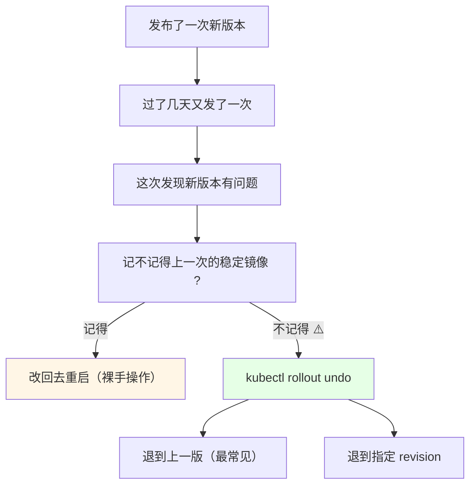
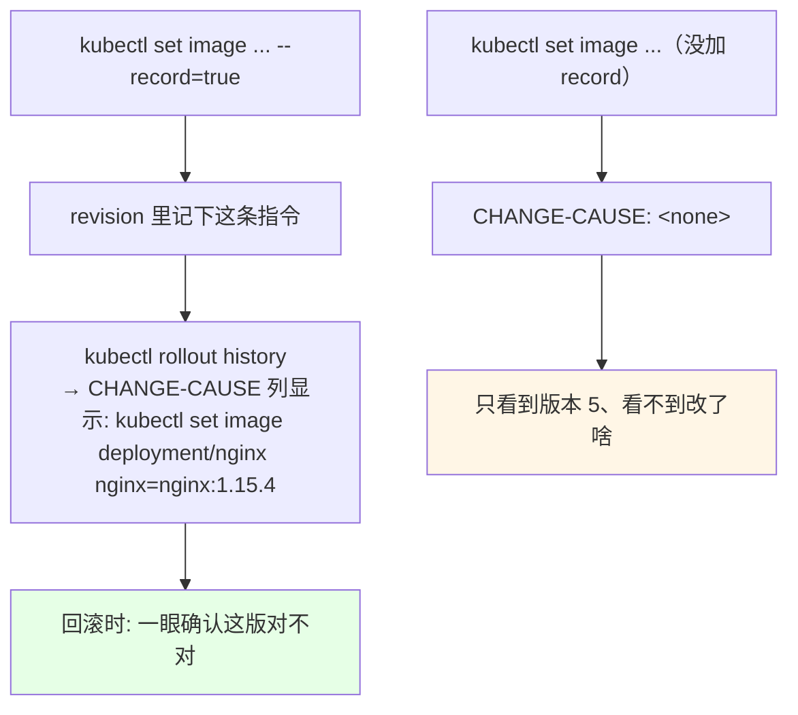
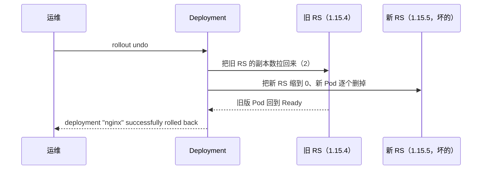
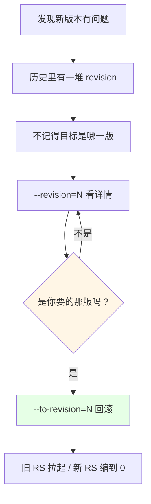
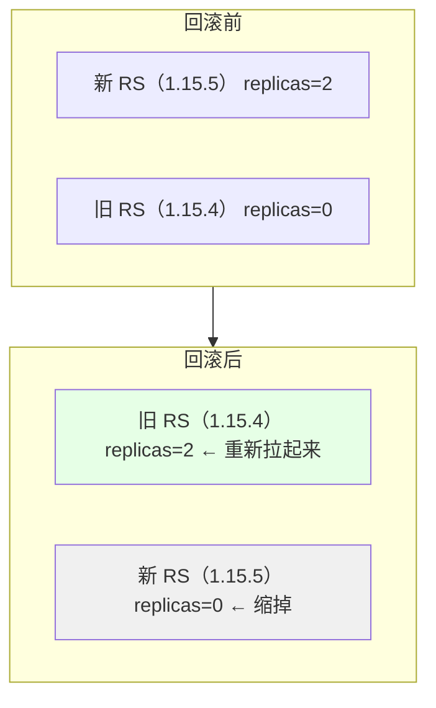
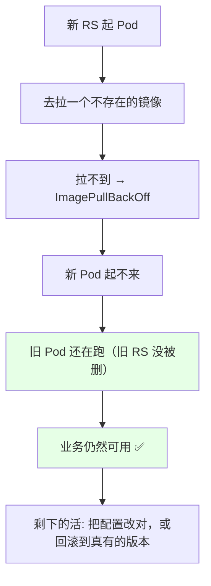
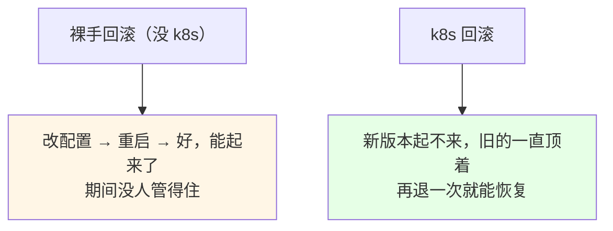

# Kubernetes 集群部署: Deployment 的回滚（undo 到上一版与指定 revision）

更新用 `set` 挺简单，但真出问题要往回退时你会发现：**过了一个星期，谁还记得上一版镜像是 `1.15.4` 还是 `1.15.3`？**

结论先给：

- **回滚两种**：`kubectl rollout undo deployment <名称>` 退到**上一版**；`kubectl rollout undo deployment <名称> --to-revision=N` 退到**指定版本**；
- **先查历史再动手**：`kubectl rollout history deployment <名称>`，配合当初 `set` 时加的 `--record`，能看到**每版对应的那条指令**（改了什么一目了然）；
- **指定版本先看再退**：`kubectl rollout history deployment <名称> --revision=5` 看 5 号的详细变更，确认是你要的再退；
- **回滚不是「把镜像改回去」**：它是把**旧的那个 RS 重新拉起来、新的 RS 缩到 0**；
- **k8s 自带保护**：新镜像拉不下来时，**旧 Pod 一直在跑着提供服务**，只有新 Pod 起来了旧的整体才会被删掉；
- 没上 k8s 的时候回滚全靠人记配置、改配置、重启，还**保证不了回滚后应用可用** —— 这就是差距。

## 纲要

- 回滚之前先想清楚：为什么会需要它
- 看历史：rollout history 与 --record
- 回滚到上一版：undo
- 回滚到指定版本：--to-revision
- 回滚到底动了什么（新旧 RS 互换）
- 新版本拉不下来时集群在干嘛
- 回滚时该怎么改配置（set / edit / replace）
- 常见排错

## 回滚之前先想清楚：为什么会需要它



**回滚上一版是日常主力**：发一次版、过一周再发一次，第二版炸了，第一件事就是「退回到上一次那个」—— 那多半是稳定版。

## 看历史：rollout history 与 --record

```bash
# 看所有版本
kubectl rollout history deployment/nginx

# 看指定版本的详细信息（不记得上一个稳定版是哪个，就先看它）
kubectl rollout history deployment/nginx --revision=5
```

```text
kubectl rollout history deployment/nginx 的输出结构:
├── REVISION   ← 版本号，从 1 开始递增
├── CHANGE-CAUSE  ← 当初 --record 记下的那条指令
├── 每条下面挂着当时的:
│   ├── 镜像地址 / tag
│   ├── 环境变量
│   └── 资源限制等 Pod 模板里的东西
└── 回滚时用 REVISION 号指定目标
```

| 能力 | 命令 | 依赖 |
| --- | --- | --- |
| 看全部历史 | `kubectl rollout history deployment <名称>` | 更新时加了 `--record` |
| 看某版详情 | `kubectl rollout history deployment <名称> --revision=N` | 同上 |
| 历史条数上限 | `spec.revisionHistoryLimit` | 太小会丢历史，回滚没得退 |

**关键点**：历史里那句「改了什么」是 `set ... --record` 记下来的。**当初没加 `--record`，历史里就是空的（`<none>`），回滚时你只看到版本号、看不到改了啥。**



## 回滚到上一版：undo

```bash
# 直接退一版
kubectl rollout undo deployment/nginx

# 看结果：Deployment 状态会出现 rollback 提示
kubectl describe deployment/nginx | grep -i rollback
```



回滚之后看一眼，镜像就该变回上一版：

```bash
kubectl get deploy nginx -o wide | grep nginx
# IMAGE 列回到 nginx:1.15.4 ✅
kubectl get rs
# 新的那个 RS 被删掉 / 缩到 0
```

## 回滚到指定版本：--to-revision

多次发布之后历史有一堆，**你不记得上一个稳定版是几号**，那就按号码退：

```bash
# 1. 先看有哪些版本
kubectl rollout history deployment/nginx

# 2. 抽查某个版本到底改了什么（这一步别省）
kubectl rollout history deployment/nginx --revision=5

# 3. 确认没问题，退到 5 号
kubectl rollout undo deployment/nginx --to-revision=5

# 4. 看结果
kubectl rollout status deployment/nginx
kubectl get rs
```



| 场景 | 用哪个命令 |
| --- | --- |
| 刚发完就发现炸了 | `kubectl rollout undo deployment/nginx` |
| 发了一周了，想退到上周那版 | 先 `rollout history` 找号，再 `--to-revision=N` |
| 完全不记得上一版镜像 | 靠 `--record` 记的 CHANGE-CAUSE 帮你回忆 |
| 想停在某一版不动了 | `rollout pause` + 确认 RS 副本数 |

## 回滚到底动了什么（新旧 RS 互换）



| 项目 | 说明 |
| --- | --- |
| 回滚不是改镜像字段 | 它是在**两个 RS 之间挪流量**：旧 RS 副本数拉回、新 RS 缩到 0 |
| 中间过程同样是滚动 | 旧的 Pod 一个个起来、新的一个个退，不是瞬间切换 |
| 用 `rollout status` 看进度 | 跟更新一样等它收敛 |
| 回滚也是一次「更新」 | 会占用一个 revision |

## 新版本拉不下来时集群在干嘛

课程里演示过一个很真实的情况：**回滚到某个 revision，结果那个镜像在仓库里根本不存在**。



```bash
# 看新 Pod 为什么起不来
BAD_POD=$(kubectl get pods -l app=nginx --sort-by=.metadata.creationTimestamp -o name | tail -1)
kubectl describe pod "$BAD_POD"
# Events: Failed to pull image, 提示这个 tag 不存在

# 这时候业务没挂 —— 旧的还在顶着
kubectl get pods -o wide
```

**这就是 k8s 的保护机制**：新版本起不来时，旧版本继续提供服务；**只有新 Pod 真正 Ready 之后，旧的整体才会被删掉**。不会因为你写错一个镜像 tag 就把线上搞挂。



## 回滚时该怎么改配置

| 方式 | 适合 | 评价 |
| --- | --- | --- |
| `kubectl set image ... --record` | **CI/CD 自动发版**（一般只改镜像版本） | 课堂推荐，命令行干净 |
| `kubectl edit deployment <名称>` | 手动改，改动项多 | 直接开编辑器改 |
| 改文件后 `kubectl replace -f` / `apply -f` | 有清单在 git 里，走审阅流程 | 可追溯、可复现 |
| `kubectl rollout undo` | **回滚** | 别自己造轮子去「改回旧值」 |

**手动改配置时别用 `set`**：一次改很多项，`set` 一条一条敲容易漏；直接 `edit` 或者改完文件的 `replace` 更清醒。

## 常见排错

| 现象 | 原因 | 处理 |
| --- | --- | --- |
| `rollout undo` 后镜像没变回去 | 目标 RS 已经不在历史里了 | 看 `revisionHistoryLimit`，调大后再退 |
| `rollout history` 里 CHANGE-CAUSE 是 `<none>` | 当初没加 `--record` | 只能看版本号，得靠 `describe` 反推 |
| 回滚到某版后 Pod 起不来 | 那个镜像仓库里没有 | `describe pod` 看 Events，换真有的版本 |
| `--to-revision=N` 报 revison not found | N 超出生效范围 / 被清掉 | 先 `rollout history` 看有效号段 |
| 回滚完还是坏的 | 坏的在那版就已经存在 | 退到真正稳定的那一版（先 `--revision` 看详情） |
| 回滚后一直 Terminating | 旧 Pod 收不尾 | 见 preStop / 宽限期那两篇 |
| 想确认回没回滚成功 | — | `kubectl get deploy -o wide` 看 IMAGE 列 |

## API 速览

| 能力 | 做法 | 关键点 |
| --- | --- | --- |
| 看全部历史 | `kubectl rollout history deployment <名称>` | 要 `--record` 才有 CHANGE-CAUSE |
| 看某版详情 | `kubectl rollout history deployment <名称> --revision=N` | 回滚前先做这一步 |
| 退到上一版 | `kubectl rollout undo deployment <名称>` | 最常见 |
| 退到指定版本 | `kubectl rollout undo deployment <名称> --to-revision=N` | 先查号 |
| 看回滚进度 | `kubectl rollout status deployment <名称>` | 跟更新一样等收敛 |
| 回滚结果 | `kubectl describe deployment <名称> \| grep -i rollback` | 会打一条 rollback 事件 |
| 改配置 | `kubectl edit` / `replace -f` / `apply -f` | 手动改别用 `set` |
| CI/CD 发版 | `kubectl set image ... --record=true` | 只改镜像版本 |
| 历史条数 | `spec.revisionHistoryLimit` | 太小会丢可回滚版本 |
| 确认落地 | `kubectl get deploy -o wide` 看 IMAGE 列 | 一眼看出退化到哪版 |

## Demo 示例

```bash
# 1. 造一份历史：从 1.15.2 一路升上来
kubectl create deployment nginx --image=nginx:1.15.2 --image-pull-policy=IfNotPresent --record=true
kubectl set image deployment/nginx nginx=nginx:1.15.3 --record=true
kubectl set image deployment/nginx nginx=nginx:1.15.4 --record=true
kubectl rollout status deployment/nginx

# 2. 手滑写了个仓库里不存在的版本
kubectl set image deployment/nginx nginx=nginx:1.15.999 --record=true
kubectl get pods
kubectl get pods -l app=nginx -o name | tail -1 | xargs -I {} kubectl describe pod {} | tail -20
# 期望: Failed to pull image / ImagePullBackOff，但旧 Pod 还在

# 3. 退到上一版（最常用）
kubectl rollout undo deployment/nginx
kubectl rollout status deployment/nginx
kubectl get deploy nginx -o wide | grep nginx
# IMAGE 回到 1.15.4

# 4. 多造几版，然后退到指定版本
kubectl set image deployment/nginx nginx=nginx:1.15.4 --record=true
kubectl set image deployment/nginx nginx=nginx:1.15.3 --record=true
kubectl set image deployment/nginx nginx=nginx:1.15.2 --record=true

kubectl rollout history deployment/nginx
kubectl rollout history deployment/nginx --revision=5
kubectl rollout undo deployment/nginx --to-revision=5
kubectl rollout status deployment/nginx

# 5. 最终确认：只剩一个 RS 在干活，镜像对上了
kubectl get rs
kubectl get rs -o jsonpath='{.items[*].spec.template.spec.containers[*].image}'
```

```bash
# 6. 生产里更稳的做法：改清单走 apply，别在命令行硬 set
cat <<'EOF' | kubectl apply -f -
apiVersion: apps/v1
kind: Deployment
metadata:
  name: nginx
  annotations:
    kubernetes.io/change-cause: "升级到 1.15.4，配套 config 变更"
spec:
  replicas: 2
  revisionHistoryLimit: 10
  selector:
    matchLabels:
      app: nginx
  template:
    metadata:
      labels:
        app: nginx
    spec:
      containers:
      - name: nginx
        image: nginx:1.15.4
        imagePullPolicy: IfNotPresent
        ports:
        - containerPort: 80
EOF

# 7. 回滚失败/异常时的兜底三连
REV=$(kubectl rollout history deployment/nginx | tail -1 | awk '{print $1}')
kubectl rollout undo deployment/nginx --to-revision="$REV"
kubectl describe deployment nginx
kubectl logs -l app=nginx --tail=50
```

### 总结

- **回滚就两条命令**：退一版 `rollout undo`，退指定版 `rollout undo --to-revision=N`，退之前先 `rollout history`；
- **`--record` 是回滚的复盘依据**：它把「这一版当初执行了哪条指令」记进 CHANGE-CAUSE，当初不加，事后只能干瞪眼；
- **回滚的本质是新旧 RS 互换**：旧 RS 拉起来、新 RS 缩到 0，中间同样是滚动过程，不是瞬切；
- **新版本起不来，旧版本照样顶着**：写错镜像 tag 不会拖垮线上 —— 这是 k8s 自带的保护，也是「裸手回滚」给不了的安全感；
- **手动改配置别用 `set`**，CI/CD 只改镜像版本时才用它；改动多的走 `edit` 或 `apply -f`，可追溯、可复盘；
- **想退得动，先把 `revisionHistoryLimit` 留够**，不然历史被清光，你连退到哪都选不了。

