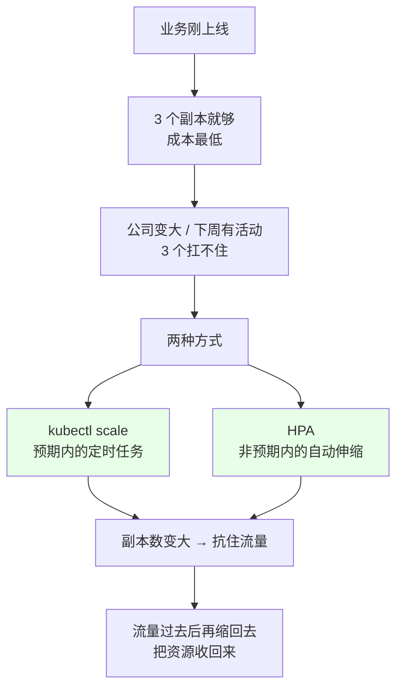
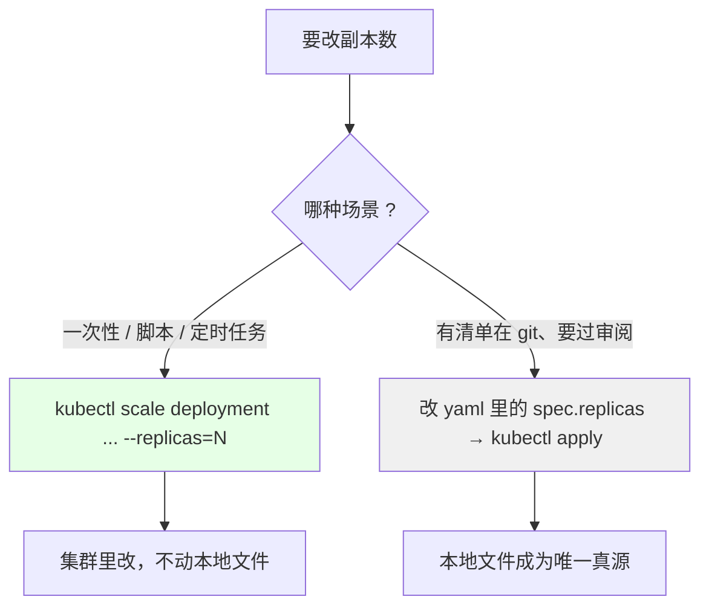
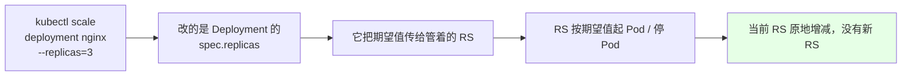
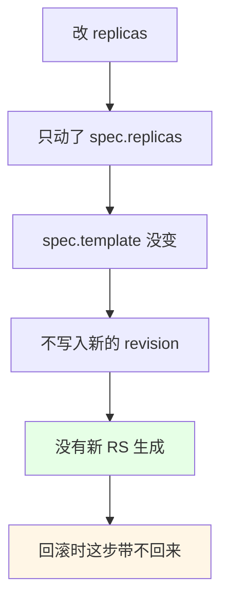
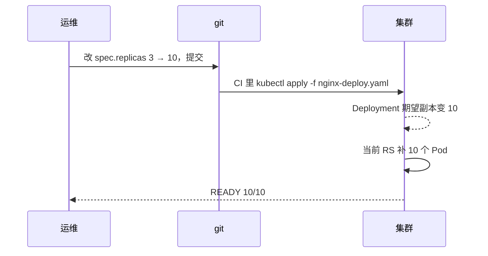
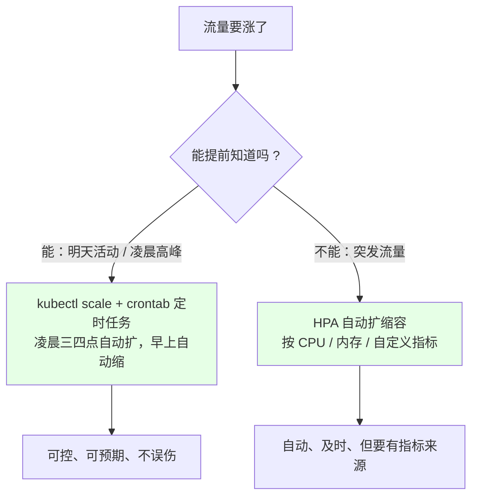

# Kubernetes 集群部署: Deployment 扩容和缩容（scale 与 HPA 的分工）

更新和回滚讲完了，还剩一种最常见的情况：**业务起来了**。前期三个副本够用，公司规模一大、或者提前预告有个活动，三个副本扛不住了 —— 这时候就得扩。

结论先给：

- **两种方式扩容**：`kubectl scale` 一条命令，或者直接改 yaml 文件再 `apply`；
- **推荐 `kubectl scale`**：它是可脚本化的，能塞进定时任务；
- **改小副本数就是缩容**，同一个命令、同一个 `--replicas` 参数；
- **扩缩容不产生新 RS**：因为它没改 `spec.template`，跟「更新」是两码事（更新那篇讲过：只有改 template 才会生成新 RS）；
- **能扩 Deployment / ReplicaSet / StatefulSet**，但**扩不了 DaemonSet** —— DaemonSet 是「每个节点一个」，扩它的语义不成立；
- **预期内的扩容**（明天有活动、凌晨流量高峰）用 `scale` + `crontab` 定时扩；**非预期内的**交给 **HPA** 按 CPU / 内存 / 自定义指标自动扩缩容（后续章节）。

## 纲要

- 为什么需要扩容：三个阶段
- 两种扩容方式
- scale 命令怎么写
- 扩缩容为什么不产生新 RS
- 手动改文件的方式
- 预期内 vs 非预期内：定时任务与 HPA
- 常见排错

## 为什么需要扩容：三个阶段



| 阶段 | 副本数 | 策略 |
| --- | --- | --- |
| 早期 | 3 | 够用就行，别浪费资源 |
| 预期内增长（活动、大促） | 3 → 10 | **提前 `scale` 扩，事后 `scale` 缩** |
| 非预期波动 | 自动 | **HPA 按指标自动扩缩** |

## 两种扩容方式



| 方式 | 适合 | 优点 | 注意 |
| --- | --- | --- | --- |
| `kubectl scale` | 定时脚本、CI/CD、临时救急 | 一条命令，可复现，好写进 crontab | 本地 yaml 不同步（下次 apply 会被改回） |
| 改文件 `apply -f` | 有 git 管清单、要可追溯 | 清单即真相，审计友好 | 得先改再 apply，两步 |

## scale 命令怎么写

```bash
# 基本形态：scale 资源类型 名称 --replicas=N
kubectl scale deployment nginx --replicas=3

# 指定命名空间（生产别用 default）
kubectl scale deployment nginx -n production --replicas=5

# 直接对 RS 操作也行
kubectl scale rs nginx-6c8d7f9b4c --replicas=5

# 有状态服务同样支持
kubectl scale statefulset redis --replicas=3

# 缩容：把副本数改小就是它
kubectl scale deployment nginx --replicas=2
```



| 资源类型 | 能不能 scale | 说明 |
| --- | --- | --- |
| `deployment` | ✅ | 最常用 |
| `replicaset` | ✅ | 直接对 RS 下手也行 |
| `statefulset` | ✅ | 有状态服务扩副本要按顺序来 |
| `daemonset` | ❌ | 语义是「每个节点一个」，扩它没意义 |

扩容之后确认一下：

```bash
kubectl get deploy nginx
# READY 列会先变成 0/3、1/3、2/3，最后 3/3
kubectl get pods -o wide
kubectl get rs
# RS 还是原来那个，没有新 RS 冒出来
```

## 扩缩容为什么不产生新 RS



```text
扩容与更新的差别，一张表看全:
├── 更新（改 spec.template）
│   ├── 会生成新 RS
│   ├── 会占一个 revision
│   └── rollout undo 能退回来
└── 扩缩容（改 spec.replicas）
    ├── 不生成新 RS
    ├── 不占 revision
    └── 只能靠 scale 命令 / 清单本身找回这个状态
```

**这条很关键**：因为扩缩容不进 revision 历史，所以「先扩到 5 个再回滚」这种组合动作，**回滚带不回那次扩容** —— 扩容状态得靠你自己记着（写成脚本或留在清单里）。

## 手动改文件的方式

```bash
# 1. 导出清单
kubectl get deploy nginx -o yaml > nginx-deploy.yaml

# 2. 找到 spec.replicas 改成目标值
grep -n "replicas" nginx-deploy.yaml

# 3. 应用
kubectl apply -f nginx-deploy.yaml
# 或
kubectl replace -f nginx-deploy.yaml
```



走 git 的好处是**扩容这件事被记录了**：谁在什么时候把副本从 3 改到 10、为什么（commit message），三个月后排查容量问题全都有据可查。

## 预期内 vs 非预期内：定时任务与 HPA



| 场景 | 做法 | 原因 |
| --- | --- | --- |
| 明天有活动，流量翻倍 | `kubectl scale` + `crontab` 定时任务 | 凌晨三四点不可能靠人盯；提前扩好，活动一开始就是满血 |
| 流量过去，资源要收回 | 定时任务再 `scale` 回去 | 不缩就是白烧 CPU / 内存 |
| 突发、不可预期 | **HPA**（后续章节） | 人反应不过来，让指标说话 |
| HPA 的依据 | CPU、内存、自定义指标 | 指标要能采集到（metrics-server 等） |

```text
一条典型的定时扩容思路（伪代码框架，具体调度按你们的公司规范来）:

cron 表达式                命令                                 说明
0 3 * * *                  kubectl scale deploy nginx --replicas=10   凌晨 3 点提前扩容
0 12 * * *                 kubectl scale deploy nginx --replicas=3    中午流量过去收回来
0 9 * * 1                  kubectl scale deploy nginx --replicas=8    周一早上开工前扩好
```

## 常见排错

| 现象 | 原因 | 处理 |
| --- | --- | --- |
| `scale` 报不支持 | 你传的是 DaemonSet | DS 按节点算，扩不了也无需扩 |
| 扩了副本但 Pod 起不来 | 节点资源不够 / 调度 constraints | `kubectl describe pod` 看 Events |
| READY 一直卡在 2/3 | 新 Pod 探针过不了 | 查探针与镜像 |
| 缩容后业务还是慢 | 缩太狠了，或者流量还没下来 | 缩容放在流量低谷，留余量 |
| apply 之后副本数又变回 3 | 本地 yaml 里还是 3 | 改 yaml 再 apply，别只 scale |
| 想回滚扩容这一步 | 它不进 revision | 记录脚本 / 靠清单；下一次 scale 回去 |
| 想自动扩 | 还没配 HPA | 等后续章节 |

## API 速览

| 能力 | 做法 | 关键点 |
| --- | --- | --- |
| 扩容 | `kubectl scale deployment <名称> --replicas=10` | 一条命令 |
| 缩容 | `kubectl scale deployment <名称> --replicas=3` | 同一个参数，改小就完 |
| 指定命名空间 | `-n <命名空间>` | 别用 default |
| 扩 RS | `kubectl scale rs <RS名> --replicas=N` | 一般没必要绕开 Deployment |
| 扩 StatefulSet | `kubectl scale statefulset <名称> --replicas=N` | 有状态的按序来 |
| 扩 DaemonSet | 不支持 | 它是每节点一个 |
| 走清单 | 改 `spec.replicas` 后 `apply -f` | 可审计、可追溯 |
| 定时扩容 | `kubectl scale` 写进 crontab | 预期内的活动用它 |
| 自动伸缩 | HPA（后续章节） | 按 CPU / 内存 / 自定义指标 |
| 看结果 | `kubectl get deploy` 的 READY 列 | 会从 0/3 慢慢涨到 3/3 |

## Demo 示例

```bash
# 1. 先回到 3 副本
kubectl create deployment nginx --image=nginx:1.15.2 --image-pull-policy=IfNotPresent
kubectl scale deployment nginx --replicas=3
kubectl get deploy nginx

# 2. 扩容到 5，看 READY 从 3/3 涨到 5/5
kubectl scale deployment nginx --replicas=5
kubectl get deploy nginx
kubectl get pods -o wide

# 3. 确认没有产生新 RS（和更新对比着看）
kubectl get rs
# 还是那一个，名字没变

# 4. 缩容回 2
kubectl scale deployment nginx --replicas=2
kubectl get deploy nginx
kubectl get pods

# 5. 走清单的方式：改文件再 apply
kubectl get deploy nginx -o yaml > nginx-deploy.yaml
grep -n "replicas:" nginx-deploy.yaml
kubectl apply -f nginx-deploy.yaml
kubectl get deploy nginx

# 6. 一次性把三个服务都扩上去（批量脚本）
for SVC in web api job; do
  kubectl scale deployment "$SVC" --replicas=5 -n production
done
kubectl get deploy -n production
```

```bash
# 7. 看扩容过程中 Pod 的状态变化
kubectl get pods -l app=nginx -w
# Pending → ContainerCreating → Running → Ready

# 8. 扩容后资源占用怎么算（配合 requests/limits 看）
kubectl get deploy nginx -o jsonpath='{.spec.template.spec.containers[*].resources}'
kubectl top pods -l app=nginx
```

### 总结

- **扩容缩容就是改 `replicas`**：`kubectl scale deployment <名称> --replicas=N`，改大是扩、改小是缩，一个命令两种用途；
- **两种方式选其一**：要脚本化和定时就 `scale`，要可追溯就改清单 `apply`；**别只 scale 不改文件**，下次 apply 会被打回原形；
- **扩缩容不产生新 RS、也不占 revision 历史** —— 所以回滚带不回扩容状态，扩容这件事得你自己记在脚本或 git 里；
- **DaemonSet 扩不了**（每节点一个），能扩的是 Deployment / RS / StatefulSet；
- **预期内的流量用定时任务**：明天有活动就凌晨扩好、中午收回来；凌晨那段靠人盯不现实；
- **非预期内的突发流量留给 HPA**：按 CPU / 内存 / 自定义指标自动扩缩，跟定时任务互补，具体内容在后续章节。

