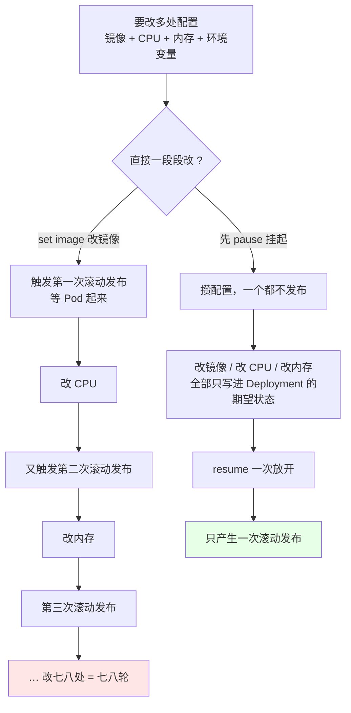
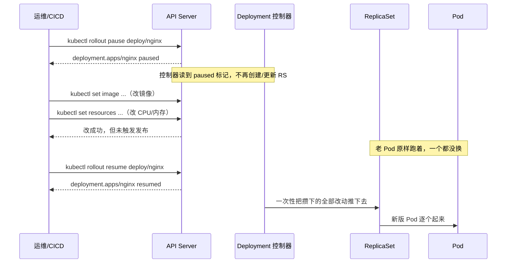
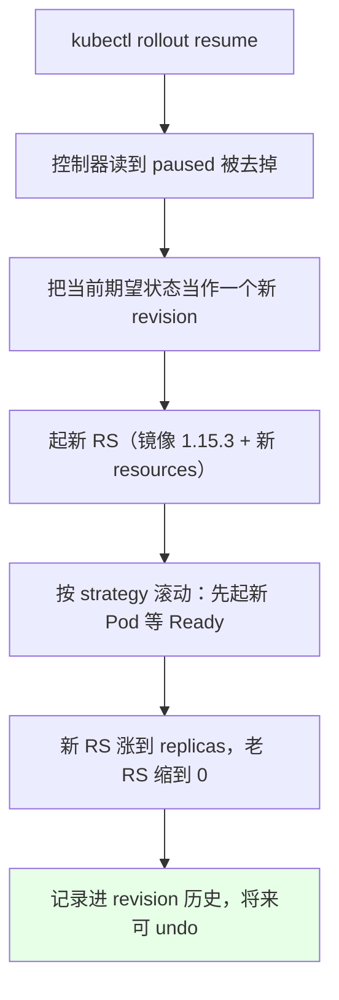
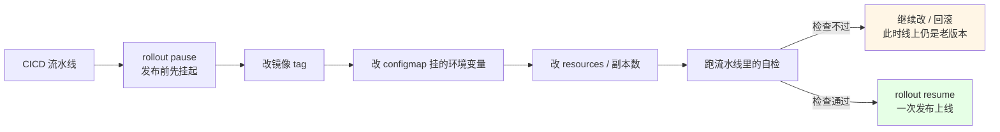

# Kubernetes 集群部署: Deployment 更新暂停与恢复（一次改动只发布一次）

前面几节反复演示 `kubectl set image`、`kubectl replace`，每敲一次命令就是一次滚动发布 —— 改镜像触发一次，改 CPU 又触发一次，改内存再触发一次。改七八个配置就是七八轮滚动更新，中间每一轮都要等 Pod 就绪，慢、占资源、还容易在中间态出问题。

结论：**用 `kubectl rollout pause` 先把这次更新整个挂起，把镜像、CPU、内存……一次改齐，最后 `kubectl rollout resume` 一次性放出去**。暂停期间无论怎么改，都只会触发一次滚动发布。

## 纲要

- 为什么需要暂停更新
- 暂停与恢复的命令长什么样
- 暂停期间改镜像看效果：配置变了但没发布
- 再改 CPU / 内存：resources 配置照样落到清单上
- 恢复：一次滚动发布把攒下的全部改动放出
- request 与 limits 是什么
- CICD 场景里怎么用它
- 常见排错

## 为什么需要暂停更新



| 做法 | 触发的滚动发布次数 | 问题 |
| --- | --- | --- |
| 一条条 `set` 改 | 改几处发几次 | 中间态多、慢、容易滚到一半 |
| 手改 yaml 后 `apply` | 同样一段段来（除非一次改齐再 apply） | 编辑过程容易出错 |
| **`rollout pause` → 攒 → `rollout resume`** | **永远只有 1 次** | 需要记得最后 resume |

关键点：**暂停不是「不改」，而是「改了先不发布」**。所有改动仍然写进 API Server 里 Deployment 的期望状态，只是控制器不再往下推。

## 暂停与恢复的命令长什么样



```bash
# 1. 暂停一个 Deployment 的更新
kubectl rollout pause deployment nginx

# 2. 确认它已经是暂停态
kubectl get deploy nginx
# 看到 annotations 里多了 kubectl.kubernetes.io/deployment.kubernetes.io/paused: "true"

# 3. 攒完所有改动后恢复
kubectl rollout resume deployment nginx
```

`pause` / `resume` 走的是 `kubectl rollout` 子命令，同一套里还有 `status`、`undo`、`history`（回滚那节单独讲）。

## 暂停期间改镜像看效果：配置变了但没发布

```bash
# 1. 先暂停
kubectl rollout pause deployment nginx

# 2. 改镜像（带 --record 记录这次改动到 revision 历史）
kubectl set image deployment nginx nginx=nginx:1.15.3 --record

# 3. 看它「有没有真的被更新」—— 答案是还没有
kubectl get deploy nginx
kubectl get rs -o wide | grep nginx
```

```text
# 此刻的状态：配置改了，但 Pod 没动
NAME                       DESIRED   CURRENT   READY   AGE
nginx-6b7c8d9f4d           1         1         1       10m      ← 还是老 RS，老的镜像

# kubectl get deploy 上会能看到 paused 相关的 annotation
kubectl.kubernetes.io/deployment.kubernetes.io/paused: "true"
```

**这就是暂停的意义**：`set image` 命令本身是成功的（API Server 已经收到新期望值），但控制器因为看到 paused 标记，**不创建新的 ReplicaSet、不动 Pod**。

## 再改 CPU / 内存：resources 配置照样落到清单上

```bash
# 改资源：limits 是上限，requests 是启动就保证的最小量
kubectl set resources deployment nginx \
  --limits=cpu=200m,memory=128Mi \
  --requests=cpu=16m,memory=64Mi \
  --container=nginx

# 想看改没改上，直接导出清单
kubectl get deploy nginx -o yaml | grep -A 6 resources
```

```text
nginx-deployment.yaml 里现在长这样（暂停中也照样写入）:
├── spec
│   ├── template
│   │   └── spec
│   │       └── containers
│   │           └── - name: nginx
│   │               ├── image: nginx:1.15.3        ← 已变成新版本
│   │               └── resources
│   │                   ├── limits
│   │                   │   ├── cpu: 200m
│   │                   │   └── memory: 128Mi
│   │                   └── requests
│   │                       ├── cpu: 16m
│   │                       └── memory: 64Mi
│   └── paused: "true"                             ← 唯一挡住发布的开关
```

同一个 Deployment 里**多个容器必须写 `--container=<名字>` 指明改哪个**，不写会报找不到容器。这个坑在暂停 + 批量改的场景里特别常见。

## 恢复：一次滚动发布把攒下的全部改动放出

```bash
# 恢复
kubectl rollout resume deployment nginx

# 看滚动过程
kubectl rollout status deployment nginx
kubectl get rs -o wide | grep nginx
```

```text
# 恢复后一会儿，能看到「十秒之前创建了一个新的 RS」
NAME                       DESIRED   CURRENT   READY   AGE
nginx-5f8a9c7b6d           1         0         0       10s       ← 新 RS，刚建
nginx-6b7c8d9f4d           1         1         1       12m       ← 老 RS 开始缩

# 等滚动结束
NAME                       DESIRED   CURRENT   READY   AGE
nginx-5f8a9c7b6d           1         1         1       40s
```



有一点要留意：**`resume` 不是「撤销刚才的改动」，而是「把攒着的一起发布」**。所以恢复前最好再 `kubectl get deploy nginx -o yaml` 扫一眼，避免攒进去一个手滑写错的值。

## request 与 limits 是什么

这一节顺手把 `set resources` 引出的概念交代清楚（后面的 QoS 章节会系统讲）。

| 字段 | 含义 | 作用 |
| --- | --- | --- |
| `requests.cpu` / `requests.memory` | 容器起来**至少**能用到的量 | 调度依据：kubelet 按 requests 去挑节点；也是「保证能拿到的量」 |
| `limits.cpu` / `limits.memory` | 容器**最高**只能用到这么多 | CPU 超了被限流（throttle），内存超了直接 OOM Kill |
| CPU 单位 | `100m` = 0.1 核 | 1 核 = 1000m，不用写 `0.1` |
| 内存单位 | `128Mi` / `64Mi` | `Mi` 是二进制（2 的幂），`M` 是十进制，别混 |

- **`requests` 决定调度位置**：节点剩余可分配量是按各 Pod 的 requests 汇总算的，跟 limits 无关；
- **`limits` 决定被压/被杀的阈值**：内存型场景只看 limits，超了 Pod 直接被杀重启；
- 只写 limits 不写 requests 时，k8s 会把 **requests 自动填成和 limits 一样**，这类 Pod 在节点紧张时属于「最后一波被牺牲」的（Burstable 之外的极端）。

## CICD 场景里怎么用它



实际落地时最常见的形态：

```yaml
# 发布前的流水线动作清单
- name: 暂停更新，攒本次发布的所有改动
  run: kubectl rollout pause deployment/$APP -n $NS

- name: 更新镜像
  run: kubectl set image deployment/$APP $C=$IMG --record -n $NS

- name: 更新资源规格
  run: kubectl set resources deployment/$APP --limits=cpu=$LIM_CPU,memory=$LIM_MEM -n $NS

- name: 校验（不通过就 exit 1，此时线上还是老版本）
  run: ./scripts/smoke-check.sh

- name: 恢复，统一发布
  run: kubectl rollout resume deployment/$APP -n $NS
```

这样「改错了就改错了」的成本被压到最低 —— 因为暂停期间线上跑的始终是**上一个已知可用的版本**。

## 常见排错

| 现象 | 原因 | 处理 |
| --- | --- | --- |
| `set image` 成功了但 Pod 没换 | 忘了 resume，或者被 pause 卡住 | `kubectl rollout resume deployment <名称>` |
| `set resources` 报容器不存在 | Deployment 有多个容器没写 `--container` | 显式写 `--container=<容器名>` |
| resume 后一直卡在 `Waiting for rollout to finish` | 新 Pod 起不来（镜像错 / 探针挂） | `kubectl describe pod`，再看 `rollout undo` 回滚 |
| 暂停太久，改动攒得面目全非 | 忘了 resume 就去做别的 | 恢复前 `kubectl get deploy -o yaml` 复核一遍 |
| 想撤销暂停但 `undo` 没用 | undo 是回滚 revision，跟暂停是两回事 | 先 resume，再按需要 undo |
| `rollout status` 报 `deployment ... paused` | 还处于暂停态 | 先 `resume`，status 才有意义 |

## API 速览

| 能力 | 做法 | 关键点 |
| --- | --- | --- |
| 暂停更新 | `kubectl rollout pause deployment <名称>` | 挂起后再改不发布 |
| 恢复更新 | `kubectl rollout resume deployment <名称>` | 攒的改动一次性发布 |
| 看发布进度 | `kubectl rollout status deployment <名称>` | 暂停态会直接提示 paused |
| 改镜像 | `kubectl set image deployment <名称> <容器>=<镜像>` | 加 `--record` 记进历史 |
| 改资源 | `kubectl set resources deployment <名称> --limits=cpu=200m,memory=128Mi` | 多容器要加 `--container` |
| 看是否改上 | `kubectl get deploy <名称> -o yaml` | grep `resources` / `image` |
| 看 RS 有没有换 | `kubectl get rs -o wide \| grep <名称>` | 新 RS 的 AGE 是几秒 |
| 应用/刷新 | `kubectl apply -f` | 手改清单时用它 |
| 指定命名空间 | `-n <命名空间>` | 不写落 default |

## Demo 示例

```bash
# 0. 先有一个可跑的 Deployment（此前章节的 nginx）
kubectl create deployment nginx --image=nginx:1.15.2 --image-pull-policy=IfNotPresent

# 1. 暂停
kubectl rollout pause deployment nginx
kubectl get deploy nginx -o yaml | grep -i paused
# 期望: kubectl.kubernetes.io/deployment.kubernetes.io/paused: "true"

# 2. 第一次改动：镜像
kubectl set image deployment nginx nginx=nginx:1.15.3 --record

# 3. 确认「改了但没发布」
kubectl get rs -o wide | grep nginx
# 期望: 只有老 RS，镜像列还是 1.15.2

# 4. 第二次改动：CPU / 内存
kubectl set resources deployment nginx \
  --limits=cpu=200m,memory=128Mi \
  --requests=cpu=16m,memory=64Mi \
  --container=nginx

# 5. 配置确实写进去了
kubectl get deploy nginx -o yaml | grep -A 6 resources

# 6. 恢复，一次性发布
kubectl rollout resume deployment nginx
kubectl rollout status deployment nginx

# 7. 复核结果
kubectl get deploy nginx
kubectl get rs -o wide | grep nginx
kubectl get pod --show-labels
```

```yaml
# 8. 暂停 + 批量改动的等价手工写法（手写清单时最后 apply 一次即可）
apiVersion: apps/v1
kind: Deployment
metadata:
  name: nginx
  labels:
    app: nginx
spec:
  replicas: 1
  revisionHistoryLimit: 2
  selector:
    matchLabels:
      app: nginx
  template:
    metadata:
      labels:
        app: nginx
    spec:
      containers:
      - name: nginx
        image: nginx:1.15.3          # 暂停期间改的
        imagePullPolicy: IfNotPresent
        ports:
        - containerPort: 80
        resources:                    # 暂停期间改的
          requests:
            cpu: 16m
            memory: 64Mi
          limits:
            cpu: 200m
            memory: 128Mi
```

### 总结

- **`kubectl set` 每敲一次就是一次滚动发布**，改七八处配置就滚七八轮 —— 又慢又占资源，还容易停在中间态；
- **正确姿势是 `rollout pause` → 一顿改 → `rollout resume`**：暂停期间改动照常写进 API Server 的期望状态，但控制器不推、Pod 不动，攒齐了再一次性发布，永远只滚一次；
- **暂停期间改完能用 `kubectl get deploy -o yaml` 自检**，确认镜像、resources 都落地了再 resume，避免把手滑的值一起放出去；
- **`set resources` 的多容器场景必须加 `--container=<容器名>`**，否则报容器不存在；`requests` 是「保证拿到的量」（也是调度依据），`limits` 是「最高只能用到这么多」（CPU 超了限流、内存超了 OOM Kill）；
- **CICD 里这是标配动作**：发布前 pause、改齐配置、跑自检、不过就继续改、过了才 resume —— 关键是暂停期间线上跑的一直是上一个已知可用的版本，回滚成本最低。

