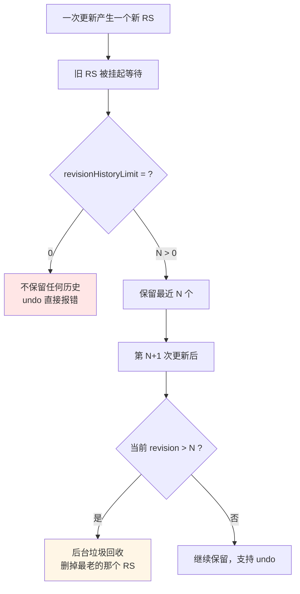
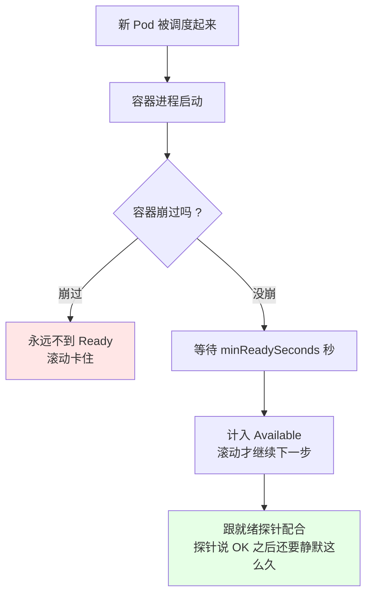
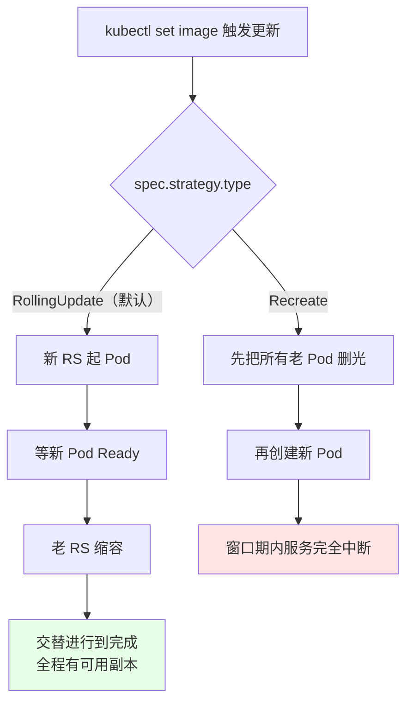
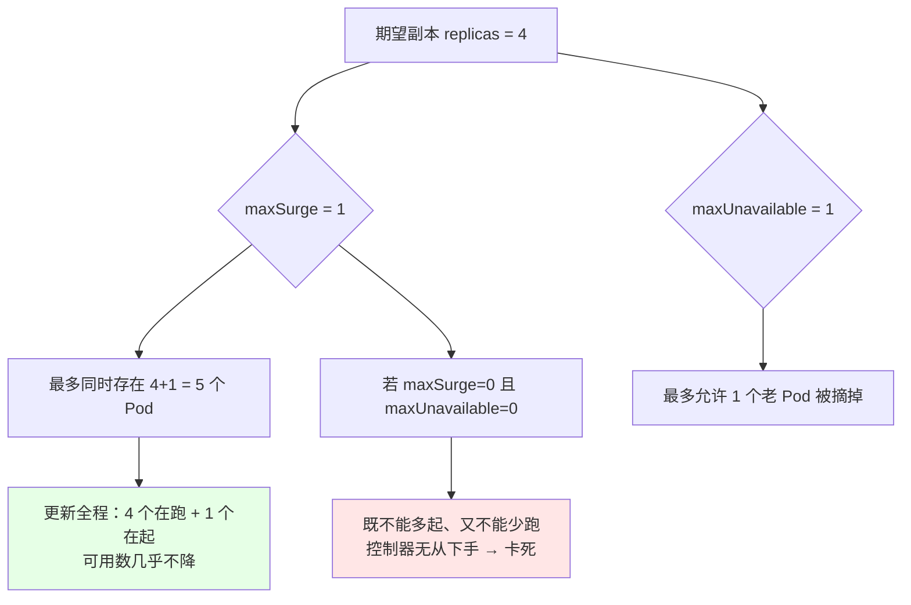
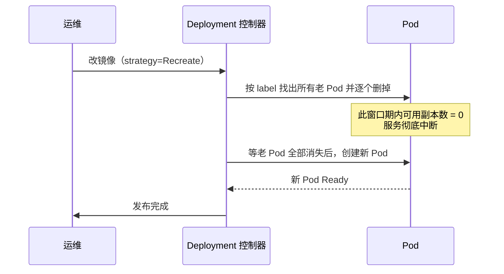

# Kubernetes 集群部署: Deployment 更新注意事项（revisionHistoryLimit / minReadySeconds / 两种更新策略）

把 Deployment 的 yaml 导出来，`kubectl get deploy -o yaml` 一眼望去几十个字段，看着都像「垃圾数据」。但里面其实藏着几个真会影响线上行为的参数 —— 保留了几个历史版本、新 Pod 要静默多久才算就绪、更新时怎么放流量。

结论：**三个必知项** —— `revisionHistoryLimit` 决定回滚能退回去几步（设 0 就退不动了）；`minReadySeconds` 决定新 Pod 稳多久才算 ready（配合探针用）；`spec.strategy` 决定发布方式（默认 `RollingUpdate`，少数场景用 `Recreate`）。

## 纲要

- 导出的 yaml 里哪些是运行时垃圾
- revisionHistoryLimit：保留几个历史版本
- minReadySeconds：新 Pod 静默多久才算可用
- 滚动更新策略默认长什么样
- maxUnavailable 怎么算
- maxSurge 怎么算，为什么两者不能同时为 0
- Recreate 策略与它的用武之地
- 常见排错

## 导出的 yaml 里哪些是运行时垃圾

先是动手前的规矩：`kubectl get deploy -o yaml` 导出来的清单是**运行时视图**，里面 `status`、`creationTimestamp`、`resourceVersion`、`uid` 这些全是 API Server 自己填的，手写清单一律删掉。真正需要你关注的只有 `spec` 下那一小撮。

```bash
# 导出（状态相关的字段会一并带出来）
kubectl get deploy nginx -o yaml > nginx-deploy.yaml

# 建议先删掉再当模板用
vim nginx-deploy.yaml
# 删掉：status / creationTimestamp / generation / resourceVersion / uid / selfLink
```

```text
nginx-deploy.yaml 导出后可保留与可删的划分:

├── apiVersion: apps/v1              ✅ 保留
├── kind: Deployment                 ✅ 保留
├── metadata
│   ├── name: nginx                  ✅ 保留
│   ├── labels:                      ✅ 保留（Deployment 自己的标签）
│   ├── creationTimestamp            ❌ 删（运行时生成）
│   ├── generation                   ❌ 删（运行时生成）
│   ├── resourceVersion              ❌ 删（运行时生成）
│   └── uid                          ❌ 删（运行时生成）
└── spec
    ├── replicas                     ✅ 保留（改它触发扩缩容）
    ├── selector                     ✅ 保留（不可变）
    ├── template                     ✅ 保留（Pod 模板）
    ├── revisionHistoryLimit         ✅ 本节主角，默认 10
    ├── minReadySeconds              ✅ 本节主角，默认 0
    ├── paused                       ✅ 上一节 pause 会写上
    ├── progressDeadlineSeconds      ⚠️ 后续章节讲
    └── strategy                     ✅ 本节主角，默认 RollingUpdate
```

## revisionHistoryLimit：保留几个历史版本

`spec.revisionHistoryLimit` 的意思是：**这个 Deployment 在后台替你保留多少个历史 ReplicaSet**。

| 值 | 行为 | 什么时候会踩坑 |
| --- | --- | --- |
| `10`（默认） | 留最近 10 个旧 RS，超出的后台垃圾回收掉 | 一般够用 |
| `0` | **一个历史都不留** | 想回滚时直接失败：`cannot rollback to revision that was not saved` |
| 大于 10（比如 `5`~`20`） | 留更多 |  revision 多 = 历史 RS 多，但旧 RS 本身空着也占 etcd 空间 |
| 大数字 | 留很多 | 小集群别乱设，纯浪费 |



实测一下：

```bash
# 看当前保留了多少
kubectl get deploy nginx -o yaml | grep revisionHistoryLimit

# 改成 0（等于放弃回滚能力）
kubectl edit deployment nginx
# 把 revisionHistoryLimit 改成 0 保存

# 再 update 一次，然后试着回滚 —— 会报找不到 revision
kubectl set image deployment nginx nginx=nginx:1.15.4 --record
kubectl rollout undo deployment nginx
# 期望错误: cannot rollback to a revision that was not saved (revision 2)
```

**所以生产建议**：别设 0，也别设太大。默认 10 打大多数场景够用；要做严格灰度回滚的团队可以调到 20～30。

## minReadySeconds：新 Pod 静默多久才算可用

`spec.minReadySeconds` 是可选参数，意思是：**新创建的 Pod 在没有容器崩溃的前提下，至少要「安静地活」多少秒，才被算作 Ready**。默认 `0`，也就是 Pod 一被创建就算可用。



- **默认 0 的含义**：Pod 一创建就被视为可用，滚动发布会一路冲到底；
- **为什么很少单独用**：更常用的是 **`startupProbe`**（启动慢的应用先等它启动完），`minReadySeconds` 是它的补充；
- **典型搭配**：应用启动要 30 秒，就绪探针回 OK 了但内部还没预热完 —— 这时把 `minReadySeconds` 设成 `10`，等于「探针 OK 之后还要再稳 10 秒才算数」，慢一点上线，少接一些注定 502 的首批请求；
- **代价**：这个值越大，单次滚动发布耗时越长。

```yaml
apiVersion: apps/v1
kind: Deployment
metadata:
  name: web
  namespace: production
spec:
  replicas: 3
  revisionHistoryLimit: 5
  minReadySeconds: 10
  selector:
    matchLabels:
      app: web
  template:
    metadata:
      labels:
        app: web
    spec:
      containers:
      - name: web
        image: registry/web:1.0
        startupProbe:
          httpGet:
            path: /healthz
            port: 8080
          failureThreshold: 30
          periodSeconds: 2
        readinessProbe:
          httpGet:
            path: /ready
            port: 8080
          periodSeconds: 5
```

## 滚动更新策略默认长什么样

`spec.strategy.type` 决定「更新 Deployment 用的是什么方式」，默认 **`RollingUpdate`**。

| 策略 | 做法 | 适用场景 |
| --- | --- | --- |
| `RollingUpdate`（默认） | 先起几个新的，等新的 Ready 了再删旧的，新旧交替 | **绝大多数生产场景，不中断服务** |
| `Recreate` | **先把旧的全部删掉，再创建新的** | 更新时允许短暂中断的场景 |



`RollingUpdate` 下还可配两个参数：

```yaml
spec:
  strategy:
    type: RollingUpdate
    rollingUpdate:
      maxSurge: 1
      maxUnavailable: 0
```

## maxUnavailable 怎么算

`maxUnavailable` = **滚动更新过程中，允许有多少个副本处于「不可用」状态**。

- 取值：**百分比**或**绝对数字**，默认 25%；
- 比如 10 个副本、25%，那最多允许 `10 × 25% = 2.5 → 2` 个副本不可用（向下取整）；
- **对可用性要求极高（比如要求 100% 可用）就把它设成 0** —— 意思是「任何时刻都不能有副本挂掉」；
- **坑：`maxUnavailable: 0` 时，`maxSurge` 不能为 0**。

## maxSurge 怎么算，为什么两者不能同时为 0

`maxSurge` = **除了期望副本数之外，最多还能额外起多少个副本**。

- 同样可以是百分比或数字，默认也是 25%；
- 比如 3 个副本、25%，那可以额外多起 `3 × 25% = 0.75 → 0`……所以通常写 `1` 更直观：**允许同时存在 4 个 Pod**；
- `maxSurge: 1` 时滚动过程里最多的形态是「老 3 + 新 1」共存。



**为什么不能同时为 0**（这一节的经典面试题）：

- `maxSurge: 0` = 不允许额外多起副本；
- `maxUnavailable: 0` = 又不允许老副本处于不可用；
- 两者一组合，控制器既「没得加」也「没得减」，滚动更新**根本无从推进**，会直接卡在原地（甚至报 `impossible` 类错误）。
- 所以约束是：**两者中至少有一个大于 0**；把 `maxUnavailable` 设 0 没问题，但 `maxSurge` 必须 >= 1，反之亦然。

```bash
# 只允许多起 1 个、不允许有副本不可用（最稳的发布形态）
kubectl patch deployment nginx -p '{"spec":{"strategy":{"rollingUpdate":{"maxSurge":1,"maxUnavailable":0}}}}'
kubectl get deploy nginx -o yaml | grep -A 4 rollingUpdate
```

## Recreate 策略与它的用武之地

`Recreate` 的做法很直白：先删光旧的 Pod，再创建新的。



什么时候才值得用：

| 场景 | 说明 |
| --- | --- |
| **用 `hostNetwork` 的应用** | 宿主机同一个端口**不能跑两个进程**，滚动更新时新旧 Pod 可能落同一节点直接起不来；`Recreate` 强制「先全删再全起」能避开 |
| 有本地端口/本地文件锁冲突的老应用 | 新旧副本无法共存时的兜底 |
| 更新期间允许停服的内部工具 | 想一次切干净、不要新旧混跑 |

**但它远不如 `RollingUpdate` 常用**，而且还有更好的替代解法：给这类应用配**节点反亲和**（`podAntiAffinity`，`requiredDuringScheduling`），强制新旧副本不落同一节点 —— 这样既能滚动更新，又不冲突。

顺带提一句 **DaemonSet 的 `updateStrategy` 里有 `OnDelete`**（只有删了才更新），那个才是常用形态；Deployment 的 `Recreate` 很少用。

## 常见排错

| 现象 | 原因 | 处理 |
| --- | --- | --- |
| `rollout undo` 报 `revision was not saved` | `revisionHistoryLimit: 0`，历史已被垃圾清理 | 调大该值（默认 10，可设 20+） |
| 想回滚但 `undo` 说 `cannot rollback to the same revision` | 已经停在目标版本了 | 先往前多走一个 revision 再 undo |
| 滚动卡住不动 | `maxSurge` 和 `maxUnavailable` 都是 0 | 至少放开一个 |
| 新 Pod 起来就报 502 | 应用慢启动，默认 0 秒就算 ready | 配 `minReadySeconds` + `startupProbe` |
| 滚动很慢 | `minReadySeconds` 设太大 / 探针周期太短太严 | 降到 5~10 秒，或放宽探针 |
| 更新后服务中断一段 | 用了 `Recreate` 策略 | 改成 `RollingUpdate` + `maxUnavailable: 0` |
| 更新时新旧 Pod 抢同一个宿主端口 | `hostNetwork` 应用 + 可能调度到同一节点 | 改用 `Recreate`，或配节点反亲和 |
| 导出的 yaml 一堆字段看不懂 | 混入了 `status` 等运行时字段 | 手写清单前删掉 `status` 段 |

## API 速览

| 能力 | 做法 | 关键点 |
| --- | --- | --- |
| 导出清单 | `kubectl get deploy <名称> -o yaml > <文件>.yaml` | 先导出后改 |
| 改历史版本数 | `spec.revisionHistoryLimit` | 默认 10，**0 等于放弃回滚** |
| 改最小就绪秒数 | `spec.minReadySeconds` | 默认 0；配合就绪/启动探针 |
| 用滚动更新 | `spec.strategy.type: RollingUpdate` | 默认，不中断服务 |
| 用重建更新 | `spec.strategy.type: Recreate` | 先删光再建，会中断 |
| 允许多起的副本数 | `spec.strategy.rollingUpdate.maxSurge` | 百分比或数字，默认 25% |
| 允许不可用的副本数 | `spec.strategy.rollingUpdate.maxUnavailable` | 要求 0 可用度时设 0 |
| 在线改策略 | `kubectl patch deployment <名称> -p '...'` | 比 edit 快，不进编辑器 |
| 回滚 | `kubectl rollout undo deployment <名称>` | 靠 revisionHistoryLimit 留的历史 |
| 指定命名空间 | `-n <命名空间>` | 不写落 default |

## Demo 示例

```bash
# 0. 起一个 4 副本的 Deployment 做实验
kubectl create deployment nginx --image=nginx:1.15.2 --replicas=4 --image-pull-policy=IfNotPresent

# 1. 观察默认策略长什么样
kubectl get deploy nginx -o yaml | grep -A 6 "strategy:"
# 期望: type: RollingUpdate + maxSurge/maxUnavailable（百分比）

# 2. 改成「多起 1 个、不允许不可用」的最稳形态
kubectl patch deployment nginx -p '{"spec":{"strategy":{"rollingUpdate":{"maxSurge":1,"maxUnavailable":0}}}}'

# 3. 顺手把历史版本改成 5（默认 10，这里演示收紧）
kubectl patch deployment nginx -p '{"spec":{"revisionHistoryLimit":5}}'

# 4. 滚动过程中观察新旧 RS 共存
kubectl set image deployment nginx nginx=nginx:1.15.3 --record
kubectl get rs -o wide | grep nginx
kubectl get pods
# 期望: 某一个时刻同时看到新旧两个 RS 的 Pod

# 5. 等滚动结束
kubectl rollout status deployment nginx

# 6. 看当前 revision
kubectl rollout history deployment nginx

# 7. 回滚到上一个版本
kubectl rollout undo deployment nginx
kubectl rollout status deployment nginx

# 8. 再改一次，观察 maxSurge/maxUnavailable 生效的节奏
kubectl set image deployment nginx nginx=nginx:1.15.4 --record
kubectl get deploy nginx -o yaml | grep -A 6 "strategy:"
kubectl get pods -o wide
```

```yaml
# 9. 生产可用的「稳妥滚动更新」完整骨架
apiVersion: apps/v1
kind: Deployment
metadata:
  name: web
  namespace: production
  labels:
    app: web
spec:
  replicas: 4
  revisionHistoryLimit: 5
  minReadySeconds: 5
  progressDeadlineSeconds: 600
  strategy:
    type: RollingUpdate
    rollingUpdate:
      maxSurge: 1
      maxUnavailable: 0
  selector:
    matchLabels:
      app: web
  template:
    metadata:
      labels:
        app: web
    spec:
      containers:
      - name: web
        image: registry/web:1.0
        imagePullPolicy: IfNotPresent
        ports:
        - containerPort: 8080
        readinessProbe:
          httpGet:
            path: /ready
            port: 8080
          periodSeconds: 5
```

### 总结

- **导出的 yaml 先当垃圾清一遍**：`status` / `creationTimestamp` / `resourceVersion` / `uid` 全是 API Server 运行时填的，手写清单一律删掉，真正要关心的是 `spec` 下那几个字段；
- **`revisionHistoryLimit` 决定回滚能退几步**，默认 10。**设成 0 等于自废武功** —— 一次更新后历史 RS 被后台垃圾回收，`rollout undo` 直接报找不到 revision；
- **`minReadySeconds` 默认 0**（Pod 一建就算可用），要想「探针 OK 之后再稳一会儿才算数」，配合 `startupProbe` + `readinessProbe` 一起用，代价是单次发布变慢；
- **更新策略默认 `RollingUpdate`**（先起新、等 Ready、再删旧，全程不中断），少数场景可用 `Recreate`（先删光旧 Pod 再建新的，会中断）—— 典型是 **`hostNetwork` 应用**，宿主机同一端口跑不了两个；更推荐的替代是配节点反亲和，让新旧副本不落同一个节点；
- **`maxSurge` 允许多起几个、`maxUnavailable` 允许挂几个，两者默认是 25%**；**它们不能同时为 0** —— 既不能加又不能减，控制器无从推进，滚动直接卡死。要求 100% 可用就把 `maxUnavailable` 设 0，同时把 `maxSurge` 设 1。

