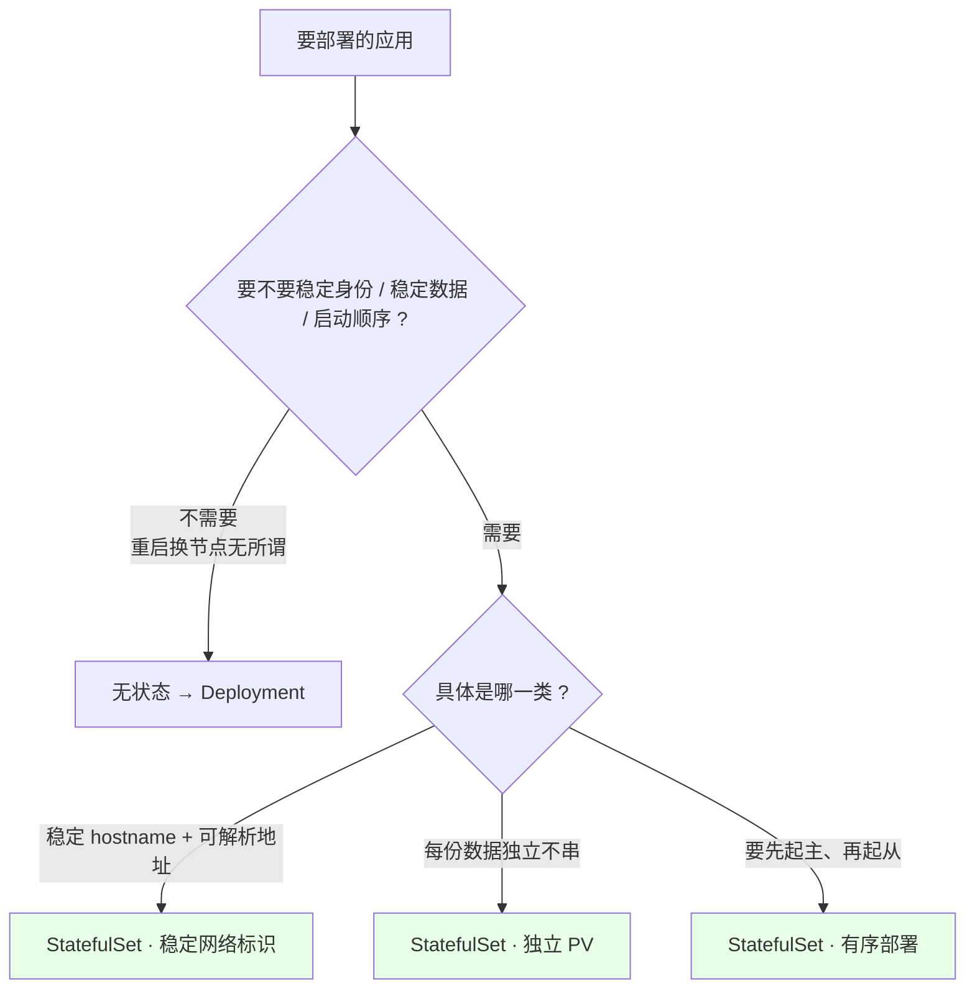
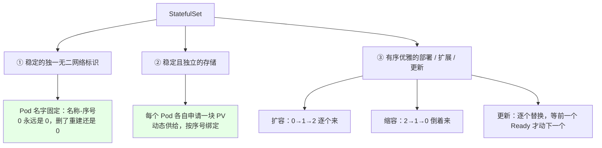
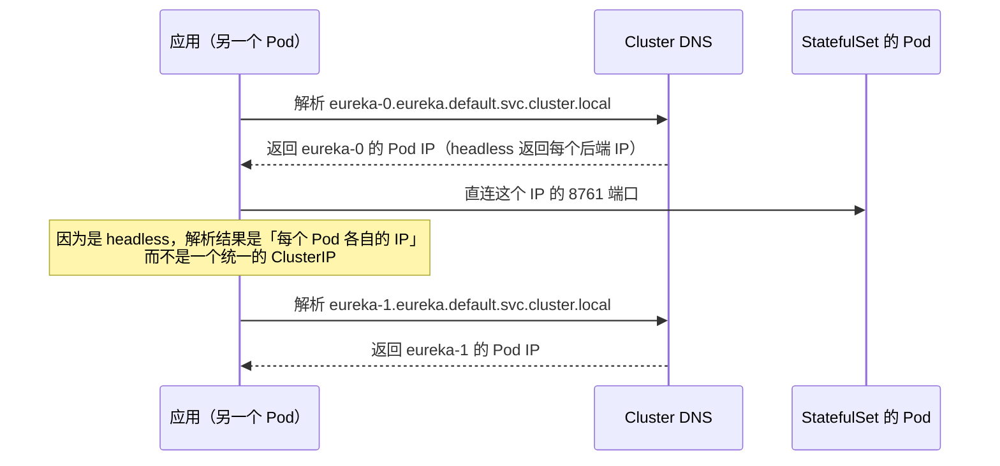
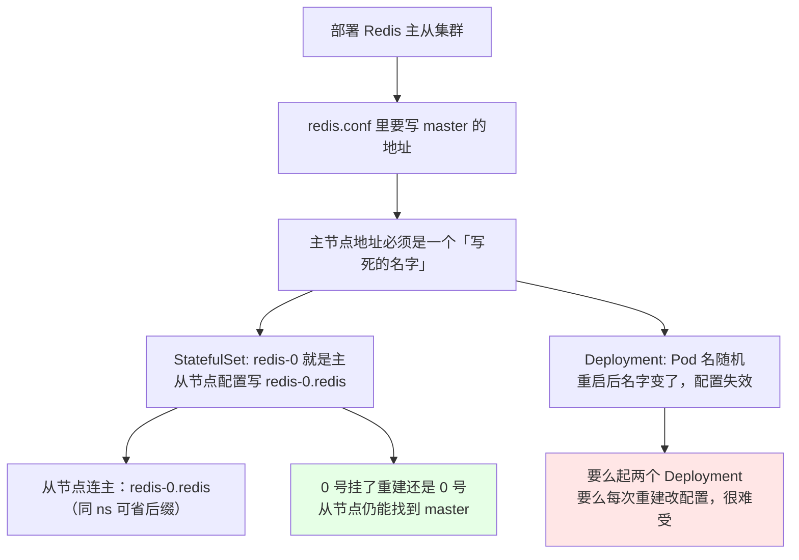
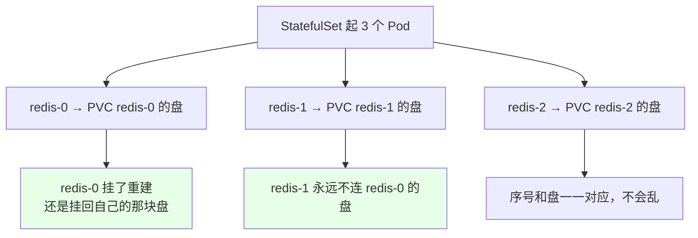
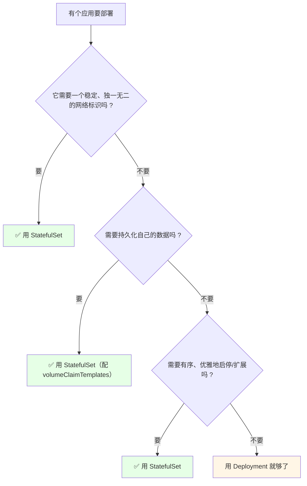

# Kubernetes 集群部署: 有状态应用管理 StatefulSet 概念（稳定标识 + 有序部署 + 独立存储）

Deployment 那套逻辑对无状态服务够用了，但 Redis 主从、MongoDB、RabbitMQ、 Elasticsearch 集群这些一上就露馅 —— 它们的配置文件里要写死「我连哪个 master」「我是集群里的第几号」，用 Deployment 就算起 3 个副本，名字也是一串随机哈希，重启一次全乱了。

结论：**StatefulSet 就是给这类应用准备的**。它做三件事：给每个 Pod 一个**永不变化的固定名字**（`名称-序号`）、**按序号一个个有序启停**、每个 Pod **各自绑定一块自己的 PV**（0 号不会连到 1 号的盘）。配上 headless Service，每个 Pod 都有自己可解析的 FQDN。

## 纲要

- 有状态应用到底「状态」在哪
- StatefulSet 的三个核心特性
- 稳定网络标识：从 FQDN 讲起
- headless service 是什么
- 副本名怎么拼出来（含 namespace 和集群域）
- 为什么 Redis 主从必须用 StatefulSet
- 和 Deployment 部署 Redis 的对比
- 什么时候用 / 什么时候不用
- 常见排错

## 有状态应用到底「状态」在哪



| 状态维度 | 无状态（Deployment） | 有状态（StatefulSet） |
| --- | --- | --- |
| Pod 名字 | 随机带哈希（`web-5f8a9c7b6d-x2k4p`） | **固定**（`redis-0`、`redis-1`、`redis-2`） |
| Pod 重启后 | 名字会变，地址全是 ClusterIP | **名字不变，IP 会变但名字可解析** |
| 数据 | 容器一删没了（或走共享存储） | **每 Pod 独占 PV，重启后仍挂载自己的盘** |
| 启停顺序 | 随机，谁先起来算谁 | **0 → 1 → 2 依次启动；删除时倒序** |
| 副本关系 | 彼此无关，可随意替换 | **有主次/次序关系**（master / 第几号） |

典型要用 StatefulSet 的生产组件：**Elasticsearch 集群、MongoDB、RabbitMQ、Redis 主从/集群、Zookeeper、Eureka**。

## StatefulSet 的三个核心特性



**「粘性标识」（sticky identity）** 是这一节唯一需要死记的点：Deployment 里 Pod 的名字是随机生成的，重建一次就换；StatefulSet 里 **第 0 个永远是第 0 个** —— 你把它删掉、节点坏了重新拉起来，名字还是 `redis-0`，所以它认得出的老数据还在那块 PV 上。

## 稳定网络标识：从 FQDN 讲起

StatefulSet **必须配一个 Service 才能工作** —— 而且这个 Service 得是 **headless Service**（`clusterIP: None`）。它不做负载均衡转发，只负责给每个 Pod 生成一个可解析的域名。

```yaml
apiVersion: v1
kind: Service
metadata:
  name: eureka
  namespace: default
spec:
  type: ClusterIP
  clusterIP: None            # ← 关键：headless，不给整组分配一个 ClusterIP
  selector:
    app: eureka
  ports:
  - port: 8761
    name: eureka
```



### 域名是怎么拼出来的

FQDN 格式是：

```text
<pod 序号>.<service 名称>.<namespace>.svc.<集群域>

举例（副本名 0 / 1 / 2，副本数 5 就是 0~4）:
├── eureka-0.eureka.default.svc.cluster.local
├── eureka-1.eureka.default.svc.cluster.local
├── eureka-2.eureka.default.svc.cluster.local
├── eureka-3.eureka.default.svc.cluster.local
└── eureka-4.eureka.default.svc.cluster.local
```

拆开逐段看：

```text
FQDN 逐段拆解:
├── eureka-0        ← Pod 名 = StatefulSet 名 + 序号，序号从 0 开始到 n-1
├── eureka         ← headless service 的名字（StatefulSet 名和服务名通常取一样）
├── default        ← namespace，换了命名空间就得带上
├── svc            ← 固定
└── cluster.local  ← 集群域（kubeadm 装完一般是这个）
```

| 通配写法 | 匹配什么 | 什么时候能省 |
| --- | --- | --- |
| `eureka-0.eureka` | 同 namespace 下的 0 号 | **同 namespace 里可以只写前两段** |
| `eureka-0.eureka.default.svc.cluster.local` | 完整 FQDN | 跨 namespace / 集群外访问时写全 |
| `eureka-0.eureka.$NS` | 用变量拼 namespace | 放到 CICD 模板里最省心 |

**实测量一下**：

```bash
# 看每个 Pod 自己的解析地址（headless 会返回全部 Pod IP）
kubectl exec -it $POD -- nslookup eureka
nslookup eureka-0.eureka

# 在集群里随便找个 Pod 验证域名可达
kubectl run -it --rm test --image=busybox --restart=Never -- sh
# 进去之后：
wget -O- -q http://eureka-0.eureka:8761
```

## 为什么 Redis 主从必须用 StatefulSet



具体长这样（从节点的配置片段）：

```text
# redis-slave 的配置文件里，master 地址就这么写死:
├── appendonly yes
└── replicaof redis-0.redis 6379
      │      │     │
      │      │     └── headless service 名
      │      └── 0 号 Pod（固定就是它当主）
      └── StatefulSet 名 = service 名
```

因为 **master 和 slave 大概率在同一个 namespace**，所以 `redis-0.redis` 这两段就够用了 —— 后面那一长串 `default.svc.cluster.local` 平时不用写，真要跨 namespace 才补上。

**如果用 Deployment 部署 Redis 主从来对比**：

| 做法 | 问题 |
| --- | --- |
| 一个 Deployment 起 3 副本 | 名字随机、无主次，配置文件根本没法写 master 地址 |
| 两个 Deployment（`redis-master` + `redis-slave`） | 能跑，但 slave 挂在 master 上，master 重建后名字变了，slave 得重新配；master 数据丢了也回不来 |
| **StatefulSet 一个清单搞定** | `redis-0` 当主，`redis-1`/`redis-2` 当从；主挂了重建还是 `redis-0`，从节点的 `replicaof redis-0.redis` 不用改 |

## 稳定且独立的存储

每次 StatefulSet 创建一个 Pod 时，会**同时为它单独申请一块 PV**（通过 `volumeClaimTemplates` 动态供给，存储章节会系统讲）。这带来一个关键性质：



这点非常关键：**0 号 Pod 绝不会挂到 1 号的 PV 上**，所以缩容再扩容、节点坏了重建，数据都不会串。

## 什么时候用 / 什么时候不用



注意：**「不需要持久化数据」时 StatefulSet 照样能用** —— 稳定标识和有序部署这两条本身就够用了。反过来，只满足「需要持久化」但不需要稳定标识的（比如所有副本共享一份配置的静态站点），Deployment + PVC 反而更轻。

## 常见排错

| 现象 | 原因 | 处理 |
| --- | --- | --- |
| `create StatefulSet` 被拒：需要指定 serviceName | 没写 `spec.serviceName` | 先建 headless Service，再写 serviceName |
| 创建后一直 `PodPending` | `volumeClaimTemplates` 的 StorageClass 不存在，PV 申请不下来 | `kubectl get sc`，或换个能用的 StorageClass |
| Pod 起了一部分就卡住 | 有序部署在等前一个 Ready | `kubectl rollout status sts <名称>` 看进度 |
| 从节点连不上 master | 写了完整 FQDN 但 namespace / 集群域不对 | 同 namespace 用 `redis-0.redis` 最稳 |
| `nslookup` 解析不到 `xxx-0` | headless Service 的 `clusterIP` 没设成 `None` | 改成 `clusterIP: None` |
| 想 scale 到 0 再起来，数据没了 | 用了 `emptyDir` 或没挂 volumeClaimTemplates | 挂上 PVC 模板，数据跟着 Pod 序号走 |
| 删了后又重建，IP 全变了 | 正常，名字不变 IP 会变 | **一律用域名连，不要写 IP** |

## API 速览

| 能力 | 做法 | 关键点 |
| --- | --- | --- |
| 建无头服务 | `spec.clusterIP: None` 的 Service | StatefulSet 依赖它做域名解析 |
| 声明服务名 | `spec.serviceName: <service 名>` | 必须指向上面那 Service |
| 副本名固定 | `<sts 名>-<序号>` | 序号 0 ~ replicas-1 |
| 访问单个副本 | `<pod 名>.<service 名>` | 同 namespace 下最短形式 |
| 跨 namespace 访问 | `<pod 名>.<service 名>.<namespace>.svc.cluster.local` | 命名空间不一致必须写全 |
| 每 Pod 独立存储 | `volumeClaimTemplates` | 每个副本自动申请一块 PV |
| 扩容 | `kubectl scale sts <名称> --replicas=N` | 从 0 号往后逐个起 |
| 缩容 | 改小 replicas | **从最大的序号往前倒着删** |
| 看 Pod 名 | `kubectl get pod` | 名字稳定，重启不变 |
| 看解析 | 进集群 `nslookup <service 名>` | headless 返回每个 Pod 的 IP |

## Demo 示例

```bash
# 0. 先建一个 headless service（StatefulSet 必须的配角）
kubectl create service clusterip redis --clusterip="None" --port=6379

# 1. 用命令/清单起一个 3 副本的 StatefulSet
kubectl create sts redis --image=redis:6 --replicas=3

# 2. 看固定名字：注意是 redis-0 / redis-1 / redis-2，一个哈希都没有
kubectl get pod

# 3. 看它挂的 PVC（每副本一块）
kubectl get pvc
kubectl get pv

# 4. 验证域名能解析
kubectl exec -it redis-0 -- nslookup redis-0.redis

# 5. 缩容到 2：从最大的序号倒着删
kubectl scale sts redis --replicas=2
kubectl get pod

# 6. 扩容回 3：0 先起，再 1，再 2
kubectl scale sts redis --replicas=3
kubectl get pod -w

# 7. 删一个 Pod 再等它起来，名字和数据都还在
kubectl delete pod redis-1
kubectl get pod
kubectl exec -it redis-1 -- redis-cli info replication

# 8. 看滚动更新的节奏（一个一个来）
kubectl rollout status sts redis
```

```yaml
# 9. StatefulSet 骨架（storage 章节会补全 volumeClaimTemplates 的细节）
apiVersion: v1
kind: Service
metadata:
  name: eureka
  namespace: default
spec:
  type: ClusterIP
  clusterIP: None
  selector:
    app: eureka
  ports:
  - port: 8761
    name: eureka
---
apiVersion: apps/v1
kind: StatefulSet
metadata:
  name: eureka
  namespace: default
spec:
  serviceName: eureka          # 必须指向上面的 headless service
  replicas: 3
  selector:
    matchLabels:
      app: eureka
  template:
    metadata:
      labels:
        app: eureka
    spec:
      containers:
      - name: eureka
        image: eureka:1.0
        imagePullPolicy: IfNotPresent
        ports:
        - containerPort: 8761
```

```text
10. 跑起来之后集群里长这样（名字全部可预测）:
├── pod
│   ├── eureka-0        ← 稳定标识，永远 0
│   ├── eureka-1
│   └── eureka-2
├── pvc
│   ├── eureka-eureka-0   ← 0 号专属盘
│   ├── eureka-eureka-1
│   └── eureka-eureka-2
├── service
│   └── eureka           ← headless，clusterIP: None
└── domain
    └── eureka-{0,1,2}.eureka.default.svc.cluster.local
```

### 总结

- **StatefulSet 是给「有状态」应用准备的工作负载 API**：Elasticsearch 集群、MongoDB、RabbitMQ、Redis 主从、Zookeeper、Eureka —— 凡是「配置文件里要写死「我连谁」「我是第几号」」的都归它管；
- **三件事记住一个就行——粘性标识**：Pod 名固定成 `<StatefulSet 名>-<序号>`（`redis-0` 删了重建还是 `redis-0`），这和 Deployment 里那一串随机哈希是本质区别；
- **每个 Pod 还得配一个 headless Service**（`clusterIP: None`）才能被访问：它不做负载均衡，只给每个 Pod 生成一条可解析记录，域名是 `<pod 名>.<service 名>.<namespace>.svc.cluster.local`；**同 namespace 下写 `redis-0.redis` 两段就够了**，跨 namespace 才需要写全；
- **稳定和有序是一套组合拳**：序号 0 起 n-1 逐个启动、缩容倒着来、每个 Pod 各自挂一块 PV（0 号绝不挂 1 号的盘），所以主挂了重建还是老主，从节点的 `replicaof` 配置不用改；
- **反过来看，用 Deployment 部署 Redis 主从来就很别扭** —— 要么起两个 Deployment 分主从（master 重建名字就变），要么每次重建重配；**判断标准就一句：要不要稳定唯一的网络标识、要不要持久化数据、要不要有序启停**，三条里占一条就该上 StatefulSet。

