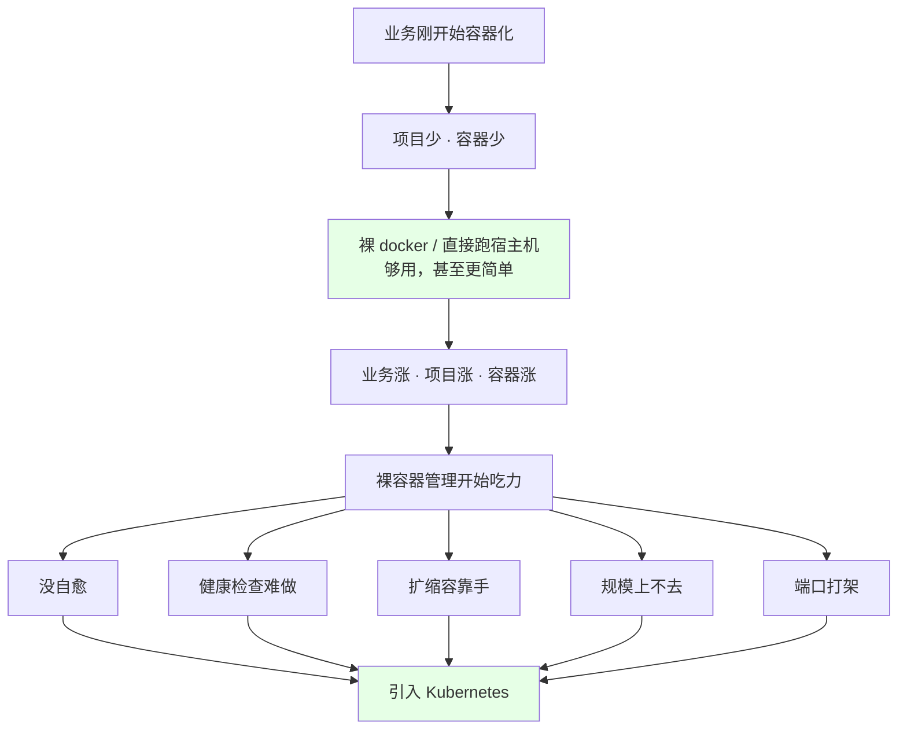
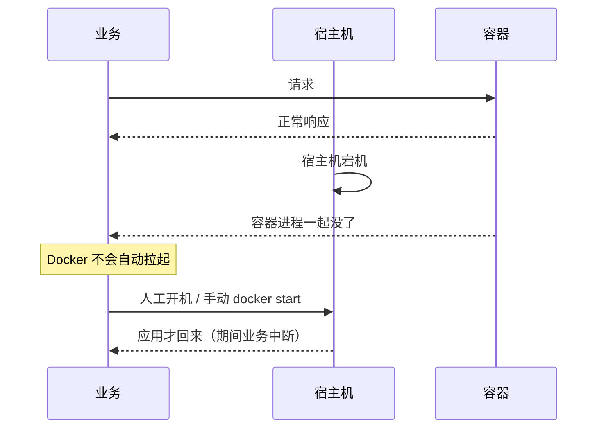
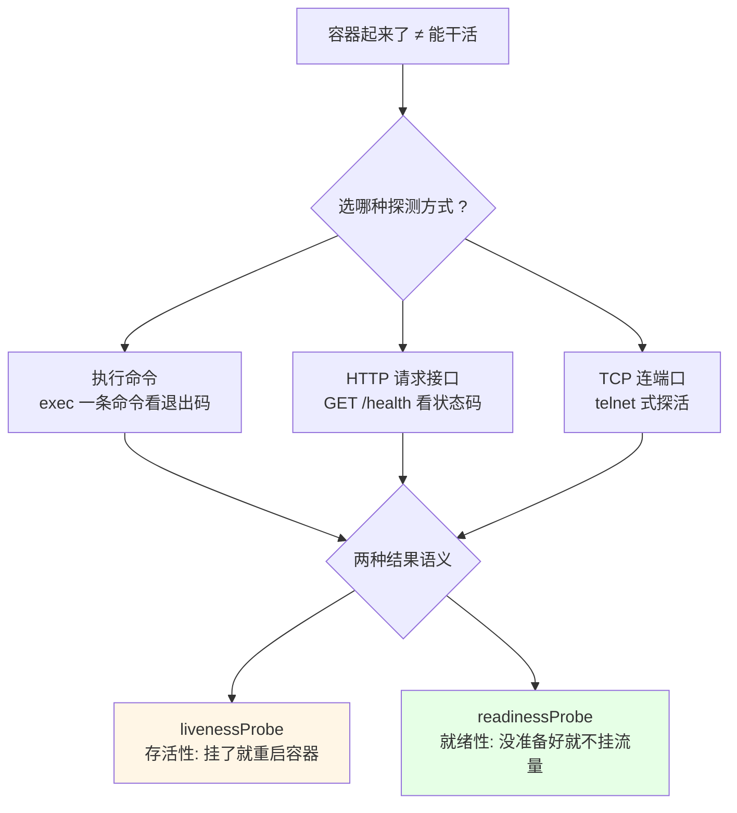
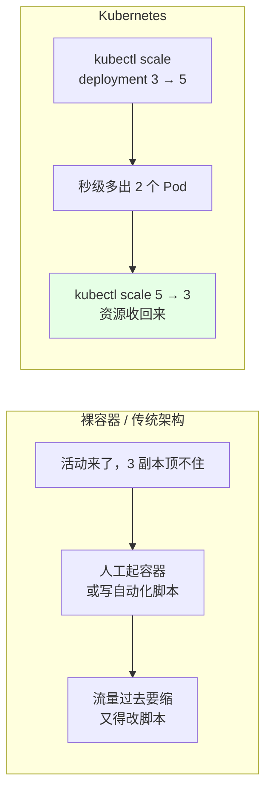
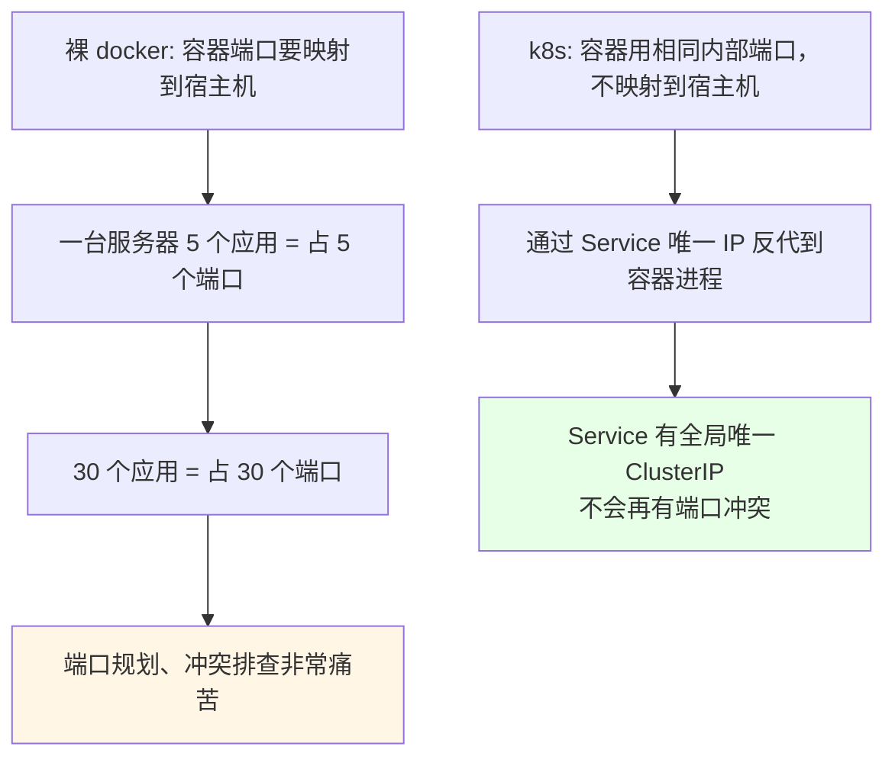
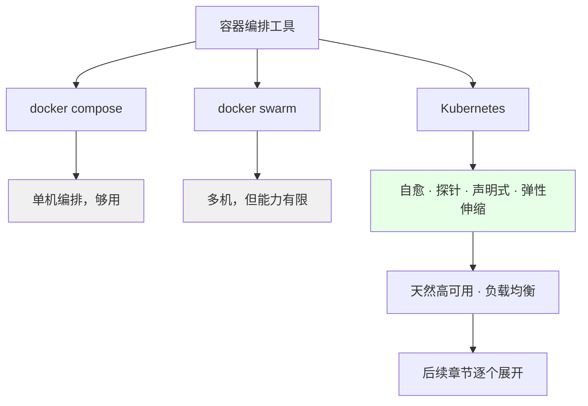

# Kubernetes 集群部署: 为什么要用 Kubernetes（裸容器管不动的五个真实痛点）

前面几章已经把 Kubernetes 装起来了，Docker 也玩明白了。这时候一个很自然的问题就冒出来：**「我有 Docker 了，为什么还要 Kubernetes？」** —— Docker 明明也能部署应用、也能打镜像、也能做镜像优化。

结论先给：

- **前期真不用 k8s**：刚容器化时项目少、容器少，裸 Docker 甚至直接跑在宿主机上就够用；
- **容器一多就管不动了**：业务涨、项目涨、容器从几十涨到上千，裸容器的五个短板会一个一个跳出来；
- **短板一：机器挂了就是真挂了** —— 单副本钉在某台宿主机上，宿主机一宕，Docker 没有自愈机制，得人工把机器拉起来；
- **短板二：程序假死查不出来** —— Java 端口起来了、telnet 也通，接口就是不响应；裸容器只能写一堆脚本硬判断，k8s 直接给 **liveness + readiness** 两种探针，还能选「执行命令 / 请求接口 / 连端口」三种方式；
- **短板三：扩缩容靠手敲** —— 活动来了三副本顶不住，要么手动起、要么写自动化工具；k8s **一条命令扩，一条命令缩**；
- **短板四：端口映射打架** —— 一台服务器跑 5 个应用就得占 5 个端口，30 个应用占 30 个端口；k8s 用 **Service 唯一 IP 做反代**，容器内部随便用相同端口，不对外占端口；
- **docker compose / docker swarm 也能编排，但 k8s 给的是它们没有的那些东西**：自愈、探针、声明式、天然高可用与负载均衡。

## 纲要

- 为什么会有这个问题：Docker 明明够用了
- 痛点一：单副本钉死在一台机器上，宕机即不可用
- 痛点二：程序假死，健康检查无从下手
- 痛点三：流量来了靠手动扩容
- 痛点四：容器规模上千，人工管理爆炸
- 痛点五：端口映射与端口冲突
- Service 是怎么解决端口问题的
- compose / swarm 与 k8s 的差别
- 常见误解
- 常见排错

## 为什么会有这个问题：Docker 明明够用了



| 阶段 | 容器数量 | 用什么方案 | 合适吗 |
| --- | --- | --- | --- |
| 起步 | 十几个 | 裸 Docker / 直接跑宿主机 | ✅ 完全够用 |
| 成长 | 几十到上百 | 裸 Docker + 一点脚本 | ⚠️ 开始吃力 |
| 规模化 | 上千 | **Kubernetes** | ✅ 迟早要上 |

镜像优化本身在 k8s 里也更重要：**删得越干净，安全性越高、拉取越快、发布越快**；镜像大，拉镜像慢，部署速度就被拖死。

## 痛点一：单副本钉死在一台机器上，宕机即不可用



| 裸容器 | Kubernetes |
| --- | --- |
| 一个副本手动 `docker run` 到某台机器 | 声明「我要 3 个副本」，调度器自己挑机器 |
| 宿主机挂 → 容器一起没了 | 节点 NotReady → Pod 在其他节点重建 |
| **没有自愈机制**，得人去开机重启 | 控制器持续调谐，最终状态向声明回归 |
| 恢复时间取决于人的响应速度 | 秒级重建 |

## 痛点二：程序假死，健康检查无从下手

课程里点了 Java 场景最典型：**端口起来了，telnet 也通，请求接口就是没响应** —— 这是典型的「程序假死」。

裸容器里做这种判断有多难：

1. 得写一堆脚本去探程序内部到底正不正常；
2. 得先定「什么算正常」的判断标准；
3. 还得判断「不正常之后怎么处理」；
4. 脚本本身也要维护，坏了没人知道。

k8s 的做法：



- **liveness（存活性）**：探不到 → 重启容器，解决「假死」；
- **readiness（就绪性）**：探不到 → 从 Service 后端摘掉，不接流量，但不重启；
- 三种探测方式（命令 / HTTP / TCP）按需选一个，配置量比手写脚本小一个数量级；
- **裸 Docker 没有这套机制**，这是 k8s 实打实的便利。

## 痛点三：流量来了靠手动扩容



| 维度 | 裸容器 | Kubernetes |
| --- | --- | --- |
| 扩容方式 | 手动 `docker run` / 自研自动化 | `kubectl scale` 一条命令 |
| 缩容方式 | 手动停，容易漏 | 一条命令，资源回收 |
| 触发方式 | 人发现流量涨了再动 | 声明副本数 / 配 HPA 自动伸缩 |
| 出错了怎么办 | 人盯着 | 控制器自动补回缺失副本 |

## 痛点四：容器规模上千，人工管理爆炸

| 容器规模 | 裸 Docker | Kubernetes |
| --- | --- | --- |
| 50 ~ 100 个 | 还扛得住 | 小事 |
| 上千个 | 人工管理基本失控 | 正常，起 100 个副本 / 200 个副本没压力 |
| 前提 | — | 节点规模得撑得住（CPU / 内存 / Pod 数配额） |

k8s 让你关心的是「我要几个副本、要跑什么」，而不是「这个容器该放哪台机器」—— 调度、漂移、重建全交给控制面。

## 痛点五：端口映射与端口冲突



对比：

| 方案 | 端口占用 | 访问方式 | 冲突风险 |
| --- | --- | --- | --- |
| 裸 Docker `-p 8080:80` | **宿主机端口被长期占用** | 宿主机 IP:映射端口 | 高，得提前规划端口表 |
| Kubernetes Service | **不占宿主机端口** | Service IP（ClusterIP）+ 端口，集群内直接访问 | 无，Service IP 本身唯一 |

关键点：k8s 里**多个 Pod 可以在容器里用相同的端口**（比如都是 80），因为对外暴露统一走 Service；Service 自己有一个独一无二的地址，把请求反代到后端 Pod，**端口冲突问题从根上被解决**。

## Service 是怎么解决端口问题的

```text
集群内访问:  curl http://10.96.217.43:80/
                        │
                        ▼
        ┌───────────────────────────────┐
        │  Service: web-svc             │
        │  ClusterIP: 10.96.217.43      │  ← 唯一，不占宿主机端口
        │  172.20.83.91:80 ─┐           │
        │  172.20.83.92:80 ─┤ 反代      │
        │  172.20.129.7:80 ─┘           │
        └───────────────────────────────┘
                        │
        ┌───────────────┼───────────────┐
        ▼               ▼               ▼
   Pod web-1        Pod web-2       Pod web-3
   (容器端口 80)    (容器端口 80)   (容器端口 80)   ← 相同端口也没事
```

## compose / swarm 与 k8s 的差别



k8s 相对它们的增量，后面章节会逐条落地：**自愈、健康检查、声明式副本、扩缩容、滚动更新与回滚、Service/Ingress 流量治理、配置与密钥管理、调度约束**。

## 常见误解

| 说法 | 实际情况 |
| --- | --- |
| 「我有 Docker 就够了」 | 单机 handful 够用，上千容器+宕机自愈+探针，裸 Docker 一样都没有 |
| 「k8s 就是 Docker 的升级版」 | k8s 用容器做运行时，但它解决的是**集群级编排**，不是跑容器这件事 |
| 「上了 k8s 就不用管运维了」 | 运维从「搬机器敲命令」变成「维护控制面和声明」，活没少，形态变了 |
| 「掌握 k8s 就掌握了云计算」 | 这是课上的夸张说法，但 k8s 确实是云原生的事实标准 |

## 常见排错

| 现象 | 原因 | 处理 |
| --- | --- | --- |
| 起了一个副本，宿主机重启后服务没了 | 裸容器无自愈 | 上 k8s，或至少配 restart policy + KeepAlive |
| 端口通但接口不响应 | 程序假死，只探端口不够 | 配 `readinessProbe` 探 HTTP 接口 |
| 重启也救不回来 | 探活只看端口 | 加 `livenessProbe` 用命令或 HTTP 接口探活 |
| 扩副本时手动起，起完忘了缩 | 人工流程漏项 | 交给 `kubectl scale` / HPA |
| 一台机器上的应用端口总打架 | 全靠 `-p` 映射 | 改用 Service，别占宿主机端口 |
| 节点够但 Pod 起不来 | 节点资源撑不住声明的副本数 | 扩容节点或降 requests |

## API 速览

| 能力 | 做法 | 关键点 |
| --- | --- | --- |
| 声明副本数 | `spec.replicas` | 不给 k8s，容器数靠人记 |
| 改副本数 | `kubectl scale deployment <名称> --replicas=5` | 一条命令扩/缩 |
| 自愈 | 控制器 + 节点状态 | 节点挂了 Pod 自动漂移重建 |
| 存活性探测 | `livenessProbe` | 失败重启容器，治假死 |
| 就绪性探测 | `readinessProbe` | 失败摘流量，不重启 |
| 探活方式 | 命令 / HTTP GET / TCP 端口 | 三选一，优先 HTTP 接口 |
| 集群内访问 | Service（ClusterIP） | 唯一 IP，避免端口冲突 |
| 对外访问 | NodePort / LoadBalancer / Ingress | 不必手动映射宿主机端口 |
| 编排放工具 | compose（单机）/ swarm（多机） | 都不含探针与自愈 |
| 弹性伸缩 | HPA（后续章节） | 按指标自动扩缩 |

## Demo 示例

```bash
# 1. 裸容器视角: 一个端口映射一个应用，端口表开始打架
docker run -d --name web1 -p 8081:80 nginx:1.19
docker run -d --name web2 -p 8082:80 nginx:1.19
docker run -d --name web3 -p 8083:80 nginx:1.19
# 应用一多就是一张端口表，还要防冲突

# 2. k8s 视角: 同一个镜像跑三副本，容器里都用 80 端口
cat <<'EOF' | kubectl apply -f -
apiVersion: apps/v1
kind: Deployment
metadata:
  name: web
spec:
  replicas: 3
  selector:
    matchLabels:
      app: web
  template:
    metadata:
      labels:
        app: web
    spec:
      containers:
      - name: web
        image: nginx:1.19
        ports:
        - containerPort: 80
        readinessProbe:
          httpGet:
            path: /
            port: 80
          initialDelaySeconds: 3
          periodSeconds: 5
        livenessProbe:
          httpGet:
            path: /
            port: 80
          initialDelaySeconds: 10
          periodSeconds: 10
---
apiVersion: v1
kind: Service
metadata:
  name: web-svc
spec:
  type: ClusterIP
  selector:
    app: web
  ports:
  - port: 80
    targetPort: 80
EOF

# 3. 看 Service 那个唯一的 ClusterIP —— 节点上不占端口
kubectl get svc web-svc
kubectl get pods -l app=web -o wide

# 4. 一条命令扩缩容，对比手动起容器
kubectl scale deployment web --replicas=5
kubectl get pods -l app=web

kubectl scale deployment web --replicas=3
kubectl get pods -l app=web

# 5. 看探针的态度：只有 readiness 没过之前 Pod 不会进 Service 后端
kubectl describe pod -l app=web | grep -A3 -i readiness
```

### 总结

- **前期用裸 Docker 完全没问题**，k8s 不是用来炫的，是容器多到管不动时才称手的家伙；
- **最疼的三个点**：机器挂了没人自动拉（无自愈）、程序假死探不出来（无探针）、流量来了靠手动扩（无弹性）；
- **健康检查是裸容器最大的坎**：Java 那种「端口通、接口死」的状态，靠脚本硬啃，k8s 用 `livenessProbe` / `readinessProbe` 直接给答案，还支持命令、HTTP、TCP 三种方式；
- **端口冲突在裸 Docker 里靠人肉规划端口表，在 k8s 里靠 Service 唯一 ClusterIP 反代**，容器内部相同端口互不干扰；
- **总账**：k8s 换来的是自愈、声明式、扩缩容一条命令、天然高可用与负载均衡 —— 与此同时，运维的形态也从「敲命令」变成「维护声明」，这就是掌握它这件事的分量。

