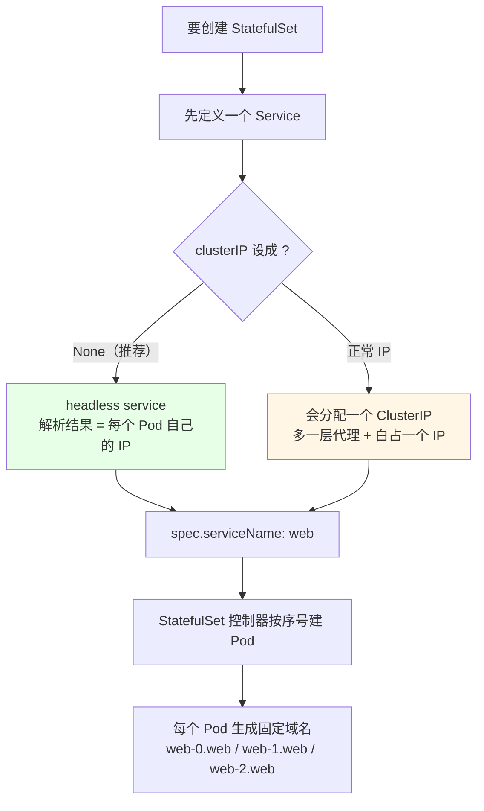
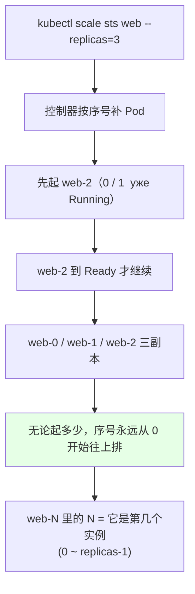
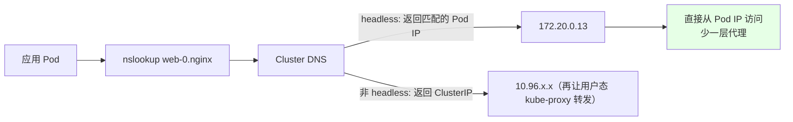
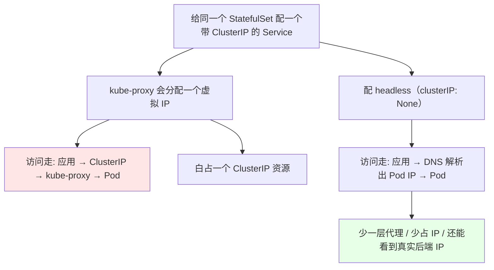
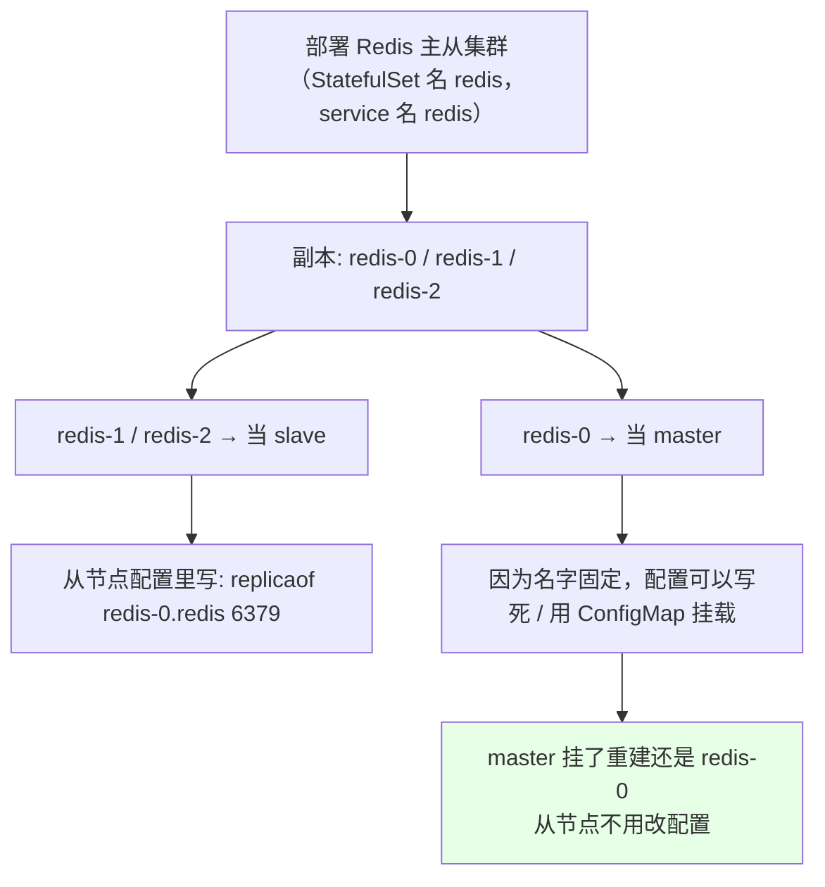

# Kubernetes 集群部署: 创建一个 StatefulSet 应用（headless Service 解析与有序扩容实测）

理论讲完得动手。这一节的目标很明确：**把 StatefulSet 跑起来，亲眼看到 `web-0` / `web-1` 两个固定名字，扩容到 3 个后变成 `web-2`，再用 busybox 进去 `nslookup` 验证 FQDN 真的能解析到 Pod IP。**

结论：**创建 StatefulSet 时 `spec.serviceName` 必须指向一个「已经存在的 Service」，而且推荐用 headless（`clusterIP: None`）** —— 它不加一层 ClusterIP 代理，解析结果直接是 Pod 自己的 IP，「少一层代理、性能还更高」，也不会白占一个虚拟 IP。

## 纲要

- 建 StatefulSet 前置条件：先有一个 Service
- 写一份 headless Service + StatefulSet
- 启动看固定标识符
- 扩容到 3 个：序号从 0 往下排
- 进 busybox 做 nslookup 实测
- wget 直连 web-0 验证业务可达
- 有 ClusterIP 也行，为什么不推荐
- 状态应用（Redis 主从）靠这个做服务发现
- 常见排错

## 建 StatefulSet 前置条件：先有一个 Service

**StatefulSet 创建时 `spec.serviceName` 必须指向一个已存在的 Service**，这是硬性要求 ——  service 是它做服务发现的前提。



> Service 不止能给 StatefulSet 用，**Deployment、DaemonSet 也可以挂 Service**，它本身就是一种服务发布方式（后续章节展开）。

## 写一份 headless Service + StatefulSet

```yaml
apiVersion: v1
kind: Service
metadata:
  name: web
  namespace: default
spec:
  type: ClusterIP
  clusterIP: None          # ← headless，不给这个 service 分配 ClusterIP
  selector:
    app: nginx             # 注意：selector 匹配的是 Pod 模板里的标签
  ports:
  - port: 80
    name: web
---
apiVersion: apps/v1
kind: StatefulSet
metadata:
  name: web
  namespace: default
spec:
  serviceName: web            # ← 必须指向上面那个已存在的 service
  replicas: 2
  selector:
    matchLabels:
      app: nginx
  template:
    metadata:
      labels:
        app: nginx            # 必须和上面的 selector 一致
    spec:
      containers:
      - name: nginx
        image: nginx:1.15.2
        imagePullPolicy: IfNotPresent   # 本地已有镜像就别再拉
        ports:
        - containerPort: 80
```

**两个必须对齐的地方**（和 Deployment 一模一样的规矩）：

| 字段 | 必须和谁一致 | 不一致的后果 |
| --- | --- | --- |
| `spec.selector.matchLabels` | `spec.template.metadata.labels` | 控制器管不住 Pod，副本永远起不满 |
| `spec.serviceName` | 上面那个 Service 的 `metadata.name` | 创建 StatefulSet 直接报错 |

```bash
# 一次性应用（两个资源用 --- 分隔，一个文件搞定）
kubectl apply -f web-sts.yaml

# 看结果
kubectl get svc web
kubectl get sts web
kubectl get pod
```

## 启动看固定标识符

```bash
kubectl get pod -o wide
```

```text
NAME      READY   STATUS    RESTARTS   AGE   IP             NODE
web-0     1/1     Running   0          40s   172.20.0.13    node-1
web-1     1/1     Running   0          40s   172.20.0.14    node-1
```

注意看名字：**`web-0`、`web-1` —— 没有一串随机哈希**，这就是上一节说的「粘性标识」。不管你重启多少次、重排多少次，第 0 个永远是 `web-0`。

顺手对比一下 Deployment 的形态：

```text
Deployment 的 Pod（随机名）:            StatefulSet 的 Pod（固定名）:
├── nginx-5f8a9c7b6d-x2k4p              ├── web-0
├── nginx-5f8a9c7b6d-jm7tz              ├── web-1
└── nginx-5f8a9c7b6d-p9vnq              └── web-2（扩容后）
```

## 扩容到 3 个：序号从 0 往下排

```bash
# 扩容（注意 sts 是 statefulset 的缩写）
kubectl scale sts web --replicas=3
kubectl get pod -w
```

```text
NAME      READY   STATUS    RESTARTS   AGE
web-0     1/1     Running   0          2m
web-1     1/1     Running   0          2m
web-2     0/1     ContainerCreating   5s   ← 新起的，序号接着往上涨
web-2     1/1     Running   0          20s
```



**这就是 StatefulSet 最省事的地方：把标识符彻底固定住了。** 你不用自己写「第几个实例叫什么」的逻辑，控制器替你编号。

再回头看那个 Service：

```bash
kubectl get svc web -o wide
```

```text
NAME   TYPE        CLUSTER-IP   EXTERNAL-IP   PORT(S)   AGE
web    ClusterIP   <none>        <none>        80/TCP    3m
```

注意 **`CLUSTER-IP` 这一列是 `<none>`** —— 这就是 headless 的肉眼证据：**它没有自己的 ClusterIP**，解析时直接返回后端 Pod 的 IP。

## 进 busybox 做 nslookup 实测

```bash
# 起一个临时 busybox 容器（调试解析/网络最常用）
kubectl run -it --rm test --image=busybox --restart=Never -- sh
```

在容器里：

```bash
# 1. 解析整个 headless service（会一次性返回所有 Pod IP）
nslookup web

# 2. 解析单个 Pod 的 FQDN
nslookup web-0.nginx
nslookup web-1.nginx
```

```text
# nslookup web-0.nginx 的结果（示意）:
Server:    10.96.0.10
Address:   10.96.0.10:53

Name:   web-0.default.svc.cluster.local
Address: 172.20.0.13        ← 就是 web-0 这个 Pod 自己的 IP
```



**关键点**：headless service 把域名直接解析成 **Pod 的 IP**，而不是走一个统一的 ClusterIP 再做转发 —— **少了一层代理，性能反而更高**，也少占一个虚拟 IP 资源。

> 同 namespace 下 `web-0.nginx` 这两段就够解析了；跨 namespace 才需要补 `.default.svc.cluster.local`。

## wget 直连 web-0 验证业务可达

还在 busybox 里：

```bash
# 3. 域名通不通 —— curl / wget 试一下
wget -O- -q http://web-0.nginx
# 期望: <!DOCTYPE html> ... Welcome to nginx! ...

curl http://web-1.nginx
# 期望: 同样返回 nginx 首页
```

```text
已完成的服务调用链路（一次都不用记 IP）:
├── 业务 Pod ──► web-0.nginx:80        ← 短名（同 namespace）
├── 业务 Pod ──► web-0.web.default.svc.cluster.local:80   ← 长名（跨 ns 通用）
└── DNS ──► 172.20.0.13（web-0 的 Pod IP）──► nginx 容器
```

**所以以后写代码、写配置，一律用域名连，不要写死 Pod IP** —— Pod 重建 IP 就变了，域名不会变。

## 有 ClusterIP 也行，为什么不推荐



| 对比 | headless（`clusterIP: None`） | 带 ClusterIP |
| --- | --- | --- |
| 有没有自己的 IP | **没有**（`get svc` 显示 `<none>`） | 有 |
| 解析结果 | **直接是后端 Pod 的 IP** | 是 ClusterIP |
| 代理层数 | 少一层 | 多一层 kube-proxy 转发 |
| 资源占用 | 不占虚拟 IP | 每个 service 占一个 IP |
| **推荐度** | **✅ 推荐给 StatefulSet** | 也能用，但没必要 |

> 注意这个 service **是强要求吗？不是。** 给 StatefulSet 配 service 不是强制的，但**想通过名字访问每个 Pod 就必须配**。既然要用 headless 直接拿到 Pod IP，再额外申请一个 ClusterIP 纯属浪费。

## 状态应用（Redis 主从）靠这个做服务发现



这就是前面说的「**用 ConfigMap 动态生成配置文件特别方便**」：

```yaml
apiVersion: v1
kind: ConfigMap
metadata:
  name: redis-conf
data:
  redis.conf: |
    appendonly yes
    # master 地址直接用 StatefulSet 的固定域名，不写 IP
    replicaof redis-0.redis 6379
```

同样的套路对 **RabbitMQ 集群、Elasticsearch 集群** 都成立 —— 用 K8s 这套服务发现自动把集群拉起来，比在宿主机上一台台配要简单太多。

## 常见排错

| 现象 | 原因 | 处理 |
| --- | --- | --- |
| `create sts` 报 service 不存在 | `spec.serviceName` 指向的 Service 还没建 | **先 apply Service，再 apply StatefulSet** |
| `spec.template.metadata.labels` 与 selector 不一致 | 手抖打错标签 | 对齐两处，否则副本永远起不满 |
| 没有 ClusterIP 是不是就访问不了？ | 理解反了 | **headless 直接解析到 Pod IP，照样能访问** |
| `nslookup web-0` 报 `can't find xxx` | service 名 / Pod 名写错 | Pod 名是 `<sts 名>-<序号>`，不是 sts 名本身 |
| 想连别的 namespace | 短域名解析不到 | 补成 `web-0.web.<namespace>.svc.cluster.local` |
| 扩容后新 Pod 一直 `ContainerCreating` | 镜像拉不动 / 存储申请不下 | `kubectl describe pod` 看 Events |
| `kubectl scale sts web` 打错成 `deployment` | 命令对象搞错 | StatefulSet 用 `sts` / `statefulset` |
| 不知道解析结果对不对 | 没有工具验证 | 起个 busybox 跑 `nslookup` / `wget` |

## API 速览

| 能力 | 做法 | 关键点 |
| --- | --- | --- |
| 建无头服务 | `kubectl create service clusterip web --clusterip=None --port=80` | `get svc` 里 CLUSTER-IP 显示 `<none>` |
| 声明服务名 | `spec.serviceName: web` | 必须指向已存在的 Service |
| 创建 StatefulSet | `kubectl create sts web --image=nginx:1.15.2 --replicas=2` | `sts` 是缩写 |
| 按文件创建 | `kubectl apply -f web-sts.yaml` | Service 和 sts 写在一个文件里用 `---` 隔开 |
| 扩缩容 | `kubectl scale sts web --replicas=3` | 序号从 0 开始往上排 |
| 看固定 Pod 名 | `kubectl get pod` | 名字是 `web-0` / `web-1`，无哈希 |
| 验证解析 | `kubectl run -it --rm test --image=busybox --restart=Never -- sh` | 进去跑 `nslookup web-0.nginx` |
| 验证业务可达 | `wget -O- -q http://web-0.nginx` | 期望返回 nginx 首页 |
| 看有没有 ClusterIP | `kubectl get svc web -o wide` | `<none>` 即 headless |
| 指定命名空间 | `-n <命名空间>` | 不写落 default |

## Demo 示例

```bash
# 1. （也可以用命令快速建 headless service）
kubectl create service clusterip web --clusterip="None" --port=80
kubectl get svc web
# 期望: CLUSTER-IP 那一列是 <none>

# 2. 按文件应用（含 Service + StatefulSet 两个资源）
kubectl apply -f web-sts.yaml

# 3. 看固定标识符
kubectl get pod
# 期望: web-0 / web-1

# 4. 扩容到 3，观察新序号
kubectl scale sts web --replicas=3
kubectl get pod -w
# 期望: web-2 出现，序号接着 0/1 往后排

# 5. 起个临时 busybox 验证解析与连通
kubectl run -it --rm test --image=busybox --restart=Never -- sh

# 在 busybox 里（$ 是容器内的 shell 提示符）:
nslookup web
nslookup web-0.nginx
wget -O- -q http://web-0.nginx
# 期望: 返回 nginx 首页 HTML

# 6. 退出后临时 Pod 自动删除（--rm 的作用）
exit

# 7. 缩容：从最大的序号倒着删
kubectl scale sts web --replicas=1
kubectl get pod
# 期望: 只剩 web-0

# 8. 回到 2 个，再看
kubectl scale sts web --replicas=2
kubectl get pod
```

```text
9. 跑起来之后集群里长这样:
├── service
│   └── web                    ← clusterIP: None（headless）
├── statefulset
│   └── web                    ← serviceName: web, replicas: 3
├── pod
│   ├── web-0                  ← 稳定标识，永远 0
│   ├── web-1
│   └── web-2
├── domain（headless 解析结果） 
│   ├── web-0.web.default.svc.cluster.local → 172.20.0.13
│   ├── web-1.web.default.svc.cluster.local → 172.20.0.14
│   └── web-2.web.default.svc.cluster.local → 172.20.0.15
└── 临时调试容器
    └── test（busybox，--rm 退出即删）
```

### 总结

- **创建 StatefulSet 的前提是「先有一个 Service」**：`spec.serviceName` 必须指向一个已经存在的 service，否则直接创建失败；Service 本身也是服务发布方式，Deployment / DaemonSet 一样能挂；
- **推荐用 headless Service（`clusterIP: None`）**：它**没有自己的 ClusterIP**（`get svc` 显示 `<none>`），解析结果**直接就是 Pod 自己的 IP** —— 少一层代理、性能更高、也不白占一个虚拟 IP；带 ClusterIP 也能用，但不是强要求，属于纯浪费；
- **固定标识符是实测出来的**：2 副本是 `web-0` / `web-1`，`kubectl scale sts web --replicas=3` 之后冒出 `web-2`，**无论起多少副本，序号永远从 0 开始往上排**，名字里干干净净、没有任何随机哈希；
- **解析怎么验**：起个 `busybox` 临时容器（`kubectl run -it --rm ... -- sh`），里面 `nslookup web-0.nginx` 直接返回那个 Pod 的 IP，再 `wget -O- -q http://web-0.nginx` 就能拿到 nginx 首页 —— 同 namespace 用 `web-0.nginx` 两段足够，跨 namespace 才补 `.default.svc.cluster.local`；
- **这套固定域名就是有状态应用的服务发现底座**：Redis 主从里把配置写成 `replicaof redis-0.redis 6379`（配 ConfigMap 挂载），master 挂了重建还是 `redis-0`，从节点一行配置都不用改；RabbitMQ、Elasticsearch 集群同理 —— 用 K8s 这套机制自动成集群，比在宿主机上一台台配简单太多；
- **铁律：写代码/配置一律用域名连，别写死 Pod IP** —— Pod 一重建 IP 就变，域名不会变。

