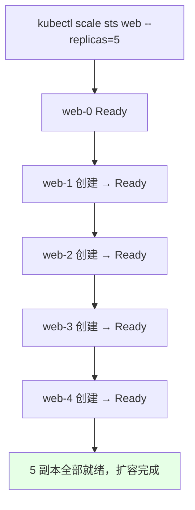
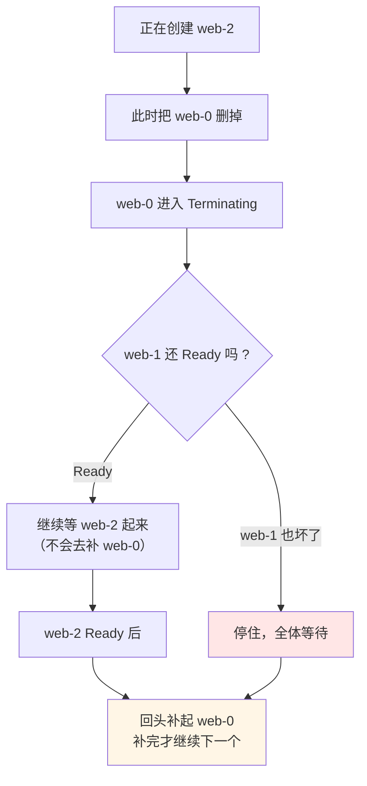
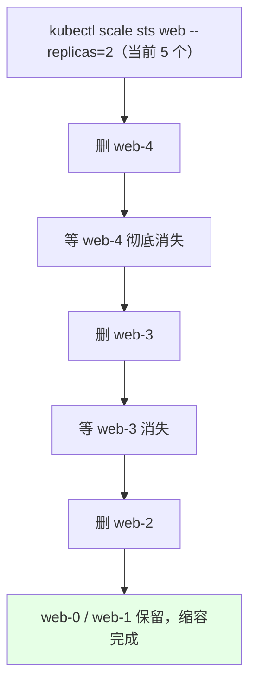
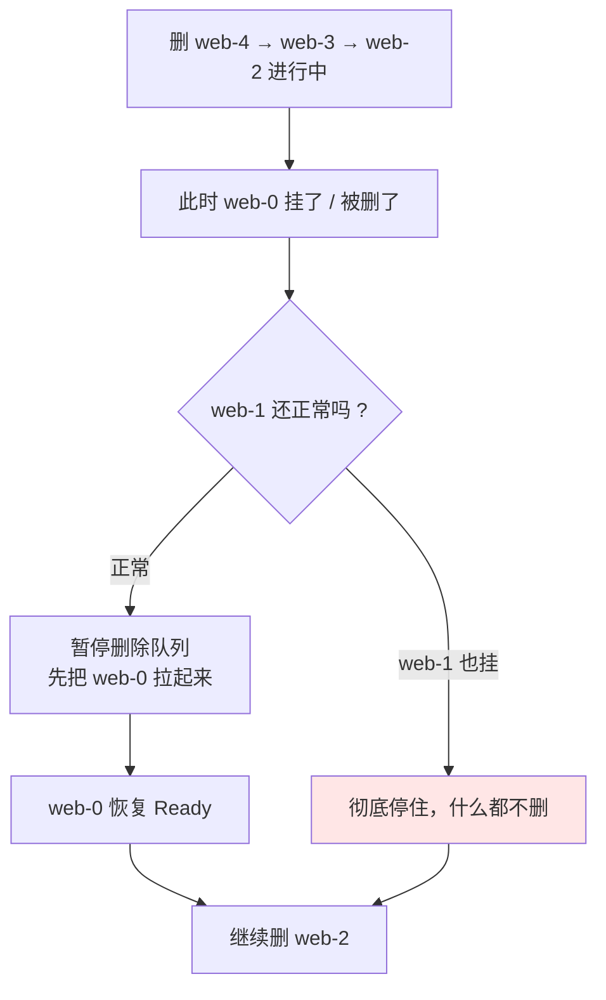
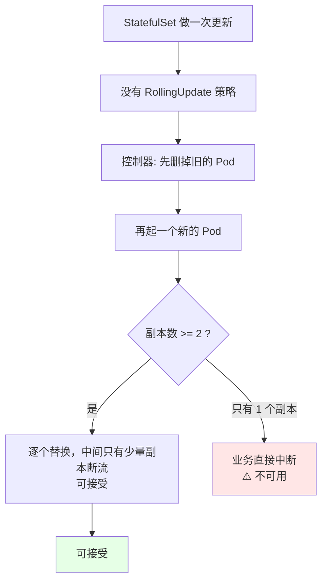
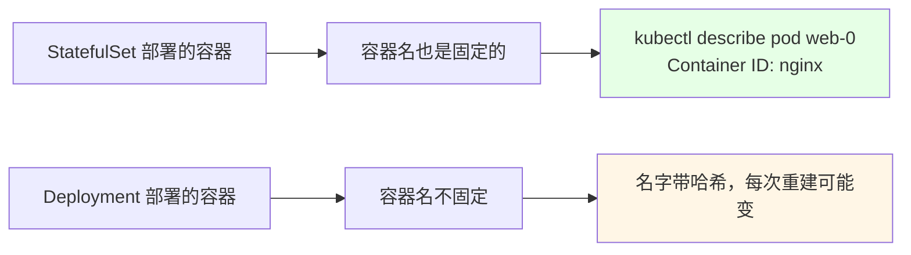

# Kubernetes 集群部署: StatefulSet 扩容缩容（有序创建、倒序删除与容器名的坑）

上一节把 `web-0` / `web-1` / `web-2` 跑起来了，但「扩容」不等于「一排一起起来」。StatefulSet 的扩缩容是**严格有序**的：扩容 **0 → 1 → 2 → 3 → 4** 顺着来，缩容 **4 → 3 → 2 → 1** 倒着来，而且**前一个没 Ready 绝不启动下一个**。

结论：**StatefulSet 没有 Deployment 那套 `RollingUpdate` 策略，它只能「先删旧的再起新的」** —— 单副本场景下这会造成业务中断，所以选 StatefulSet 还是 Deployment，得看你要的不是「固定主机名 / 固定 Pod 名」。

## 纲要

- 扩容是 0→1→2→3→4 顺着来
- 有序创建的真实规则：前一个不 Ready，后面全体等着
- 缩容是 4→3→2→1 倒着来
- 缩容途中坏了，同样卡住不往下删
- 用 watch 全程观察这个过程
- StatefulSet 没有滚动更新策略
- 选 StatefulSet 还是 Deployment
- 容器名也是固定的（和 Pod 名一个道理）
- 常见排错

## 扩容是 0→1→2→3→4 顺着来



对比一下 Deployment 的「一次性呼啦啦起一批」：

| 场景 | Deployment | StatefulSet |
| --- | --- | --- |
| replicas 从 2 加到 5 | 5 个 Pod 同时开始调度、同时拉镜像 | **一个一个来**，前一个 Ready 才起下一个 |
| 拉镜像慢的机器 | 无所谓，谁先好谁先服务 | **后面的全得排队等**（镜像没导入的节点会一直 `ContainerCreating`） |
| 中途某个 Pod 起不来 | 其他照跑，不影响 | **后面所有 Pod 全部挂起等它** |

## 有序创建的真实规则：前一个不 Ready，后面全体等着

这是最容易被误解的一条。规则不是简单的「串行」，而是：

> **在创建第 N 个 Pod 之前，它会检查所有序号小于 N 的 Pod —— 任何一个不 Ready，它就不往下走。**



原文那个场景讲得很直白：**在 `web-1` 启动过程中如果 `web-0` 挂了，`web-2` 是不会被启动的** —— 它会等 `web-0` 完全恢复成 Ready，才继续往下。

实际实验也印证了这一点：

- 扩容到 5 后，`web-2` 刚开始起、马上要起 `web-3` 的时候，手动 `kubectl delete pod web-0`；
- 控制器会**先去把 `web-0` 拉起来**（补旧账），`web-3` 的调度被压住不动；
- 等 `web-0` 重新 Ready 了，才继续 `web-3`、`web-4`。

```bash
# 扩容到 5
kubectl scale sts web --replicas=5

# 盯着看（watch 模式，一有变化就刷）
kubectl get pod -l app=nginx -w

# 在 web-3 正在起的时候，把 web-0 删掉制造故障
kubectl delete pod web-0

# 观察：web-3 停住不动，控制器先去补 web-0
kubectl get pod -l app=nginx -w
```

```text
# watch 输出形态（注意 web-3 卡在 ContainerCreating）:
NAME      READY   STATUS              RESTARTS   AGE
web-0     1/1     Running             0          6m
web-1     1/1     Running             0          5m
web-2     1/1     Running             0          2m
web-3     0/1     ContainerCreating   0          10s     ← 卡住，等 web-0
web-4     0/1     Pending             0          0
web-0     0/1     ContainerCreating   0          1s      ← 控制器回头补 web-0
web-0     1/1     Running             0          15s
web-3     1/1     Running             0          40s     ← web-0 好了，才继续
web-4     0/1     ContainerCreating   0          5s
web-4     1/1     Running             0          30s
```

顺带记住这个用法：**`-l app=nginx` 是 label 过滤**（后面 Label 与 Selector 那节会系统讲），`-w` 是 watch 实时刷新。

## 缩容是 4→3→2→1 倒着来

删除和创建**方向完全相反** —— **从最大的序号开始，往上倒着删**。



```bash
# 缩容回 2
kubectl scale sts web --replicas=2
kubectl get pod -l app=nginx -w
# 期望顺序: web-4 → web-3 → web-2 → 停在 web-0 / web-1
```

```text
# 缩容 watch 输出形态:
NAME      READY   STATUS        RESTARTS   AGE
web-4     1/1     Terminating   0          8m      ← 先删最大的
web-3     1/1     Running       0          7m
web-2     1/1     Running       0          6m
web-1     1/1     Running       0          5m
web-0     1/1     Running       0          6m
web-4     0/1     Terminating   0          40s
web-2     0/1     Terminating   0          5s      ← web-4 没了，才轮到 web-3→web-2
web-1     1/1     Running       0          5m
web-0     1/1     Running       0          6m
```

## 缩容途中坏了，同样卡住不往下删

创建有「等前一个」的规则，**缩容也有**：

> **在删除第 N 个 Pod 之前，它会等所有序号小于 N 的 Pod 处于 Running/Ready 状态。**



**为什么反向？** 因为缩容时想要的是「保留剩下的、删掉不需要的」。如果胡乱先删 0 号，那之前绑在 0 号 PV 上的数据就没人管了；从最大的往下删，等于「先让编号最大的（通常也是最边缘的角色）退场」。

## 用 watch 全程观察这个过程

这一节所有「有序」的结论，都靠 `-w` 实时看出来的，而不是猜的：

```bash
# 1. 按标签只看这批 Pod，watch 模式
kubectl get pod -l app=nginx -w

# 2. 想看它们落在哪个节点（扩容时可能调度到新节点）
kubectl get pod -l app=nginx -o wide

# 3. 扩 / 缩各来一次，对比顺序
kubectl scale sts web --replicas=5
kubectl get pod -l app=nginx -w
kubectl scale sts web --replicas=2
kubectl get pod -l app=nginx -w

# 4. 中途制造故障看它会不会停
kubectl delete pod web-0
kubectl get pod -l app=nginx -w
```

```text
kubectl get pod -l app=nginx -w 的观察要点:
├── -l app=nginx     ← 按标签过滤，只看这批（Label 章节细讲）
├── -w               ← watch，状态一变就刷一行
├── ROW 出现的顺序   ← 扩容看「0→1→2→3→4」的先后
├── Terminating      ← 缩容时老 Pod 的状态
└── ContainerCreating ← 卡住不动 = 前面的还没 Ready
```

## StatefulSet 没有滚动更新策略

这是选型的分水岭。



对照一下：

| | Deployment | StatefulSet |
| --- | --- | --- |
| 更新策略 | `RollingUpdate`（默认）/ `Recreate`，可配 `maxSurge` `maxUnavailable` | **只有一种：先删旧再建新** |
| 更新期间服务 | 全程有可用副本 | 单副本时**会中断** |
| 可控性 | 可配「允许多起几个 / 允许挂几个」 | 不可配，按序号一个一个来 |

**所以结论很实在**：

- **必须固定主机名 / 固定 Pod 名（有状态）→ 用 StatefulSet**；
- **副本数 >= 2、允许逐个替换 → StatefulSet 也能用**；
- **副本只有 1 个、绝不能停服 → 别用 StatefulSet 跑更新，或者配好 PodDisruptionBudget +  readinessProbe 让它稳一点**；
- 「哪个更好」没有绝对答案，**看公司场景**。

## 容器名也是固定的

原文最后特意补了一句很容易忽略的坑：



```text
对比（kubectl describe pod web-0）:
├── Containers:
│   └── nginx:                      ← StatefulSet: 容器名固定，就是 yaml 里写的那个
│       ├── Image:  nginx:1.15.2
│       └── State:  Running
└── 而 Deployment 的 Pod:
    └── Containers:
        └── nginx:                  ← 这里也是 nginx，但 Pod 名带随机哈希
```

**要记住的是「固定」体现在哪儿**：StatefulSet 固定的**不只是 Pod 名**，`web-0` 里那个容器名、以及它挂的那块 PV，都是跟着序号走的；Deployment 那套 Pod 名 + 容器名都是随机的。

## 常见排错

| 现象 | 原因 | 处理 |
| --- | --- | --- |
| 扩容后新 Pod 一直 `ContainerCreating` | 目标节点镜像没拉下来 / 没导入 | `kubectl describe pod` 看 Events，在对应节点 `docker load` 镜像 |
| 扩容卡住不动，后面几个全 `Pending` | 前面某个 Pod 没 Ready | 先修那个 Pod，后面的自动往下走 |
| 手动删了 `web-0` 却没人补 | StatefulSet 只在**扩容**时补号，删掉待恢复 | 再 scale 一次，或直接 `kubectl apply` 触发 |
| 缩容后 `web-2` 还在 | 删除队列被前一个卡住 | 检查 `web-0` / `web-1` 是不是真 Ready |
| 想「并行」起 Pod  speeding up | 默认串行 | `spec.podManagementPolicy: Parallel`（有状态场景慎用） |
| 更新时业务中断 | StatefulSet 先删后建，副本只有 1 个 | 副本加到 >= 2，或干脆改用 Deployment |
| `-w` 刷太快看不清顺序 | watch 输出密集 | 重定向到文件再 `grep` 关键字段 |
| 忘了指定 namespace | 默认落 default | 生产一律 `-n <命名空间>` |

## API 速览

| 能力 | 做法 | 关键点 |
| --- | --- | --- |
| 扩 / 缩容 | `kubectl scale sts <名称> --replicas=N` | `sts` 是 statefulset 缩写 |
| 实时观察 | `kubectl get pod -w` | watch，状态一变就刷 |
| 按标签过滤 | `kubectl get pod -l app=nginx` | Label 与 Selector 章节细讲 |
| 看落点 | `kubectl get pod -o wide` | IP / NODE 列 |
| 指定资源看状态 | `kubectl get sts <名称>` | 看 replica 与 ready 列 |
| 中途制造故障 | `kubectl delete pod <pod 名>` | 验证「等前一个」规则 |
| 看容器名 | `kubectl describe pod <pod 名>` | 容器名也是固定的 |
| 看卡在哪 | `kubectl describe pod <pod 名>` 的 Events | `ContainerCreating` / `FailedScheduling` |
| 改并行策略 | `spec.podManagementPolicy` | OrderedReady（默认）/ Parallel |
| 指定命名空间 | `-n <命名空间>` | 不写落 default |

## Demo 示例

```bash
# 0. 前提：已有一个 web 的 StatefulSet（含 headless service）

# 1. 扩容到 5，watch 观察「0→1→2→3→4」的顺序
kubectl scale sts web --replicas=5
kubectl get pod -l app=nginx -w

# 2. 选一个还没起来的时刻，把 web-0 删掉
#    预期: web-3 / web-4 的调度被压住，控制器先回头补 web-0
kubectl delete pod web-0

# 3. 等一切正常后看最终状态
kubectl get pod -l app=nginx -o wide

# 4. 缩容回 2，watch 观察「4→3→2」的倒序
kubectl scale sts web --replicas=2
kubectl get pod -l app=nginx -w

# 5. 复核：应该只剩 web-0 / web-1
kubectl get pod
kubectl get sts web

# 6. 对照实验：同样的缩容，手动去删 web-2（不存在，因为只剩 2 个）
kubectl delete pod web-1
kubectl get pod -l app=nginx -w
# 观察: 控制器补回 web-1，而不是并行起新的
```

```yaml
# 7. 两种管理策略（OrderedReady 是默认，Parallel 放开并行）
apiVersion: apps/v1
kind: StatefulSet
metadata:
  name: web
spec:
  serviceName: web
  replicas: 5
  podManagementPolicy: OrderedReady      # 默认：有序；Parallel 则一起起
  selector:
    matchLabels:
      app: nginx
  template:
    metadata:
      labels:
        app: nginx
    spec:
      containers:
      - name: nginx                      # 容器名也是固定的
        image: nginx:1.15.2
        imagePullPolicy: IfNotPresent
        ports:
        - containerPort: 80
```

### 总结

- **扩容是顺着的、缩容是倒着的**：扩容 `0→1→2→3→4` 一个一个来；缩容从**最大的序号**开始，`4→3→2→1` 往上删，删到 replicas 就停；
- **「等前一个」是真规则**：创建第 N 个之前，所有序号小于 N 的 Pod 必须 Ready —— 原文实测里「`web-2` 正起、把 `web-0` 删掉，`web-3` 立刻被压住不调度」，先把 `web-0` 补回来才继续，这和 Deployment 一次性呼啦啦起一批完全不同；
- **缩容同样会等**：删 `web-2` 之前要等 `web-0` / `web-1` 都正常，中途 `web-0` 挂了删除队列就暂停，修好才继续；
- **观察手段就三招**：`kubectl get pod -l app=nginx -w` 看顺序、`-o wide` 看落在哪个节点、`kubectl delete pod` 手动造故障验证「它会不会停」；
- **StatefulSet 没有滚动更新策略** —— 它是「先把旧的删掉再起新的」，副本数 >= 2 时只能接受逐个替换，**单副本会直接业务中断**；**所以别纠结「哪个更好」，看场景：要固定主机名 / 固定 Pod 名 → StatefulSet，否则 Deployment 更省心**；
- **别忘了容器名也是固定的**：`web-0` 里那个容器名就是你 yaml 里写的 `nginx`，跟着 Pod 名一起稳定；另外本地没镜像时目标节点得先 `docker load` 进去，否则新 Pod 会一直卡在 `ContainerCreating`。

