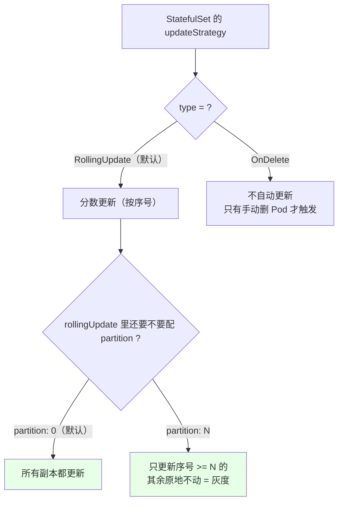
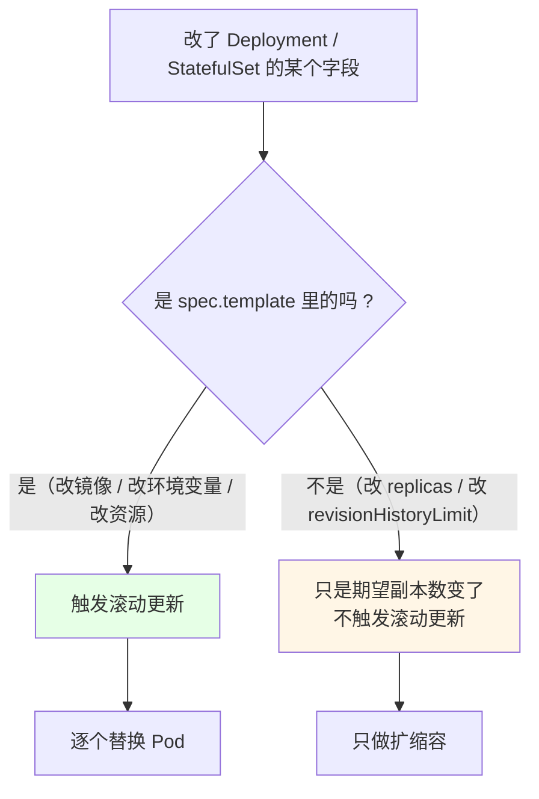
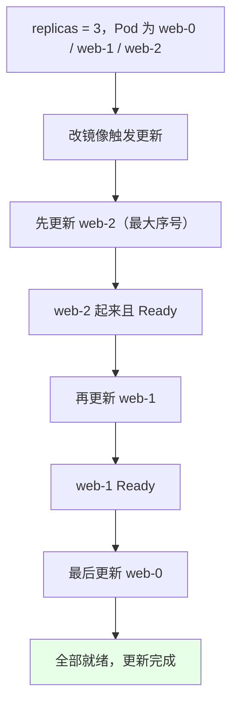
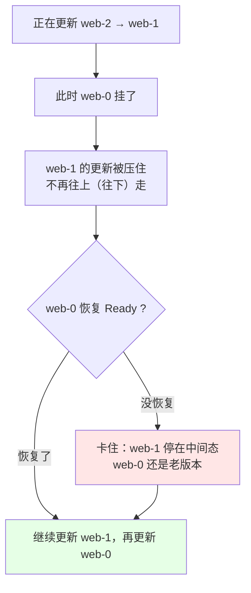
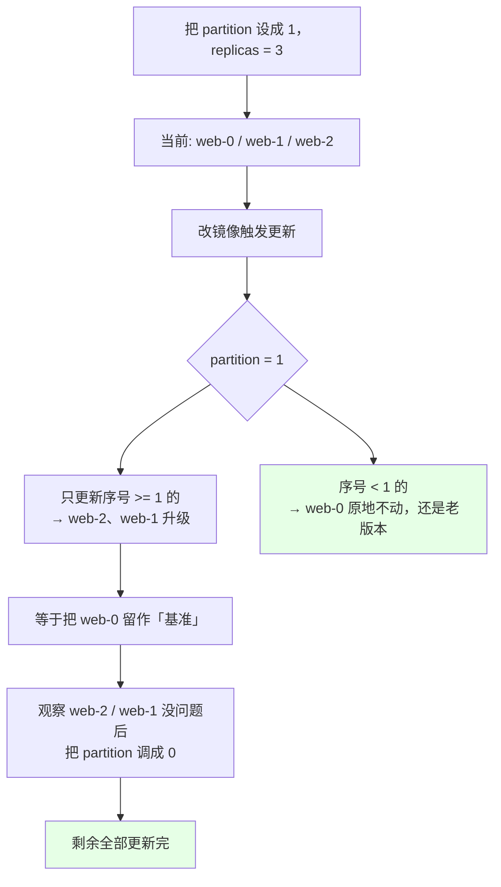
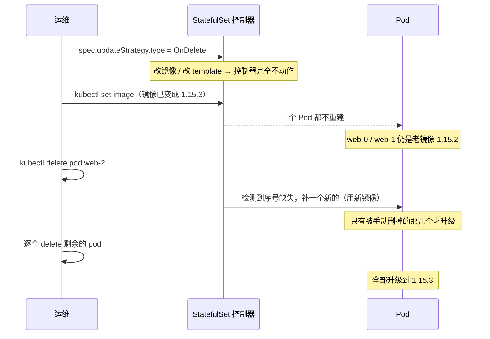
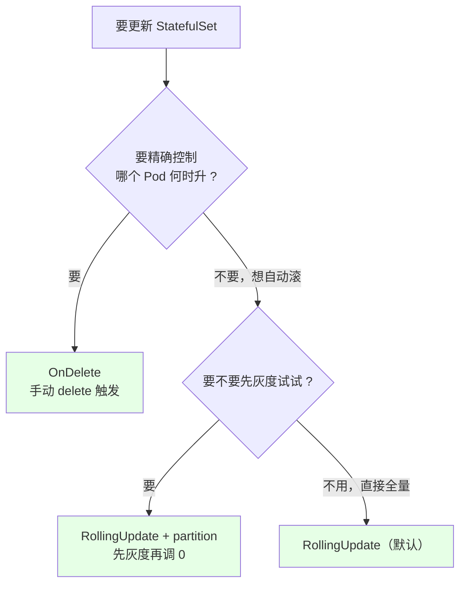

# Kubernetes 集群部署: StatefulSet 更新策略（RollingUpdate 倒序更新与 partition 灰度）

StatefulSet 跟 Deployment 一样提供了可选更新方式。而且**触发条件一模一样**：只有 `spec.template` 里的东西变了（最常见就是改镜像），才会真的滚；只改 `spec.replicas` 不算更新。

结论：**`RollingUpdate` 是从序号大的往小的更新（`2 → 1 → 0` 倒着来），而且中间任何一个 Pod 没起来就整体停住**；配一个 `partition` 就能只更新「序号 >= partition 的那部分」，这就是 StatefulSet 自带的**灰度/金丝雀**能力；**`OnDelete` 则完全不自动更新，只有你手动删 Pod 才更新**。

## 纲要

- 更新策略在哪看
- 触发更新的条件：只有 template 变
- RollingUpdate：从大到小倒序更新
- 更新途中出错会整体停住
- rollout status 看更新进度
- partition：灰度发布的核心参数
- OnDelete：只有手动删才更新
- 两种策略对比与选型
- 常见排错

## 更新策略在哪看

```bash
kubectl get sts web -o yaml | grep -A 6 updateStrategy
```

```text
# 输出形态（没显式指定时，默认就是这个）:
  updateStrategy:
    rollingUpdate:
      partition: 0
    type: RollingUpdate
```



注意 `partition: 0` 是默认值 —— 这一点很关键，**它意味着「默认就是全部更新」**。

## 触发更新的条件：只有 template 变



| 改动 | 算不算「更新」（触发滚动） |
| --- | --- |
| `spec.template.spec.containers[].image` 改版本 | ✅ 算（本节实测用的就是这个） |
| 改环境变量、加探针、改 `resources` | ✅ 算（都在 template 里） |
| 只改 `spec.replicas` | ❌ 不算，只扩缩容 |
| 只改 `spec.revisionHistoryLimit` / `minReadySeconds` | ❌ 不算，控制器不重建 Pod |
| 改 `spec.updateStrategy` | ❌ 不算 |

所以判断「什么时候会重起 Pod」的核心判据就是：**`spec.template` 的哈希变没变**。

## RollingUpdate：从大到小倒序更新

前面扩缩容时记住了「扩容顺排、缩容倒序」，**更新也是倒序** —— 从**序号最大**的开始往上更新。



实测一遍（把镜像从 `1.15.2` 改到 `1.15.3`）：

```bash
# 1. 改镜像 —— 这就是触发更新的那一下
kubectl set image sts web nginx=nginx:1.15.3

# 2. 看更新进度
kubectl rollout status sts web

# 3. 另一个窗口盯 Pod 的创建顺序
kubectl get pod -l app=nginx -w
```

```text
# watch 出来的顺序，注意是「2 → 1 → 0」倒着来的:
NAME      READY   STATUS              RESTARTS   AGE
web-0     1/1     Running             0          10m      ← 老，还没动
web-1     1/1     Running             0          9m
web-2     0/1     ContainerCreating   0          3s       ← 先动的是最大序号 2
web-2     0/1     Terminating         0          8s       ← 新的起来，旧的退
web-2     1/1     Running             0          15s
web-1     0/1     ContainerCreating   0          5s       ← web-2 OK 了，才轮到 1
web-1     1/1     Running             0          25s
web-0     0/1     ContainerCreating   0          5s       ← 最后才到 0
web-0     1/1     Running             0          20s
```

**为什么倒着来？** 和缩容一个道理 —— 有状态应用里，序号最大的往往是最「边缘」/ 最「新加入」的角色（比如 Redis 里最后一个从节点），先从边缘替换，风险最小。

## 更新途中出错会整体停住

和扩缩容一样，**更新也有「等前一个」的规则**：

> 更新第 N 个时，如果序号比 N 小的 Pod 出现异常，它就不会继续往上更新，等那个 Pod 恢复 Ready 才继续。



原文实测场景：**更新过程中 `web-0` 挂了，就不会继续更新，等 `web-0` 完全 Ready 才继续往下走** —— 和删除那节的逻辑几乎一模一样。

顺带一个实操坑：**镜像没导入的节点上，Pod 会一直卡在 `ContainerCreating`，而且没有报错事件（之前没报错就不会重试）** —— 这时候手动 `kubectl delete pod` 删掉让它重新拉起，本地已有镜像就直接起来了。

```bash
# 先看卡在哪
kubectl describe pod web-2 | tail -20
# 若只是「镜像本地没有、无报错」，删掉重来
kubectl delete pod web-2
kubectl get pod -l app=nginx -w
```

## rollout status 看更新进度

```bash
kubectl rollout status sts web
kubectl get sts web
```

```text
# kubectl get sts web
NAME   READY   AGE   CONTAINERS   IMAGES
web    3/3     12m   nginx        nginx:1.15.3
```

- **READY 3/3**：就绪副本 / 期望副本；
- **IMAGES 变成新版本**：说明更新完事了；
- 更新中途跑 `rollout status` 会阻塞到完成，或者超时报错（默认 progressDeadlineSeconds 到点）。

## partition：灰度发布的核心参数

`rollingUpdate.partition` 是 StatefulSet 自带的**灰度（金丝雀）开关**。



**规则一句话：只更新序号 >= partition 的 Pod。**

| partition 值 | 更新范围（replicas=3 时） |
| --- | --- |
| `0`（默认） | **全部更新**（web-0 / 1 / 2 都升） |
| `1` | 只更新 web-1、web-2；web-0 保持老版本 → **灰度** |
| `2` | 只更新 web-2；web-0 / web-1 保持老版本 → **最小范围灰度** |
| `3`（>= replicas） | **一个都不更新**（自动更新阶段） |

灰度怎么落地：

```bash
# 1. 先灰度：只让序号大的两个升级
kubectl patch sts web -p '{"spec":{"updateStrategy":{"rollingUpdate":{"partition":2}}}}'
kubectl set image sts web nginx=nginx:1.15.3
kubectl get pod -l app=nginx -w
# 期望: 只有 web-2 变了，web-0 / web-1 还是老镜像

# 2. 观察一段时间没问题
kubectl exec -it web-2 -- nginx -v

# 3. 放开剩下全部：partition 调到 0
kubectl patch sts web -p '{"spec":{"updateStrategy":{"rollingUpdate":{"partition":0}}}}'
kubectl rollout status sts web
kubectl get pod -l app=nginx
```

这就把「滚一个看看、没问题再全量」变成了两条命令，是 StatefulSet 相对 Deployment 的一个实用优势。

## OnDelete：只有手动删才更新



```bash
# 1. 切到 OnDelete
kubectl patch sts web -p '{"spec":{"updateStrategy":{"type":"OnDelete"}}}'

# 2. 改镜像 —— 观察：一个 Pod 都不动
kubectl set image sts web nginx=nginx:1.15.3
kubectl get pod -l app=nginx
# 期望: web-0 / web-1 还是老的，时间戳没变

# 3. 手动删 web-2
kubectl delete pod web-2
kubectl get pod web-2 -o yaml | grep -A 2 image
# 期望: nginx:1.15.3（只有被删的那个升级了）

# 4. 剩下的手动删，逐个触发更新
kubectl delete pod web-1
kubectl delete pod web-0

# 5. 一次性复核所有 Pod 的镜像
kubectl get pod -o yaml | grep image:
```

这个「改了镜像但 Pod 纹丝不动」的对比实验，是理解 OnDelete 最直观的方式。

## 两种策略对比与选型

| | `RollingUpdate`（默认） | `OnDelete` |
| --- | --- | --- |
| 改镜像后自动更新 | ✅ 自动，按序号倒序 | ❌ 不自动，要手动删 Pod |
| 更新粒度 | 整个滚动（配 partition 可灰度） | **每一个 Pod 由你亲手触发** |
| 适合谁 | 一般生产，想要可控滚动 | 需要**精确控制每个节点何时升级**的场景 |
| 风险 | 低（可按 partition 灰度） | 忘了删某个 Pod → 集群版本参差 |
| 和 Deployment 比 | 没有 `maxSurge` / `maxUnavailable` 可调 | 同左 |

选型判断：



## 常见排错

| 现象 | 原因 | 处理 |
| --- | --- | --- |
| 改了 `set image` 但 Pod 一个都没变 | 策略是 `OnDelete` | 手动 `kubectl delete pod <名称>` 逐个触发 |
| 想灰度但所有 Pod 都升级了 | `partition` 是 0（默认值） | `kubectl patch` 把 partition 调到目标序号 |
| 更新卡在 `ContainerCreating` 没报错 | 目标节点镜像没本地化，且不会自动重试 | 节点上 `docker load` 镜像，或 `delete pod` 重拉 |
| 更新一半停住不往下走 | 序号小的 Pod 没 Ready | `kubectl describe pod` 找那个不健康的 |
| 想回滚到老版本 | StatefulSet **没有 `kubectl rollout undo` 这一步**（没有 revision 历史 RS 那套） | 把镜像改回旧版本号再滚一次 |
| partition 设成大于副本数 | 自动更新阶段一个都不动 | 确认 partition < replicas |
| 更新后服务闪断 | StatefulSet 先删后建，副本少 | 副本数 >= 2，或用 partition 分批 |
| 忘了自己改过策略 | `updateStrategy` 没写在 yaml 里 | `kubectl get sts -o yaml \| grep updateStrategy` 复核 |

## API 速览

| 能力 | 做法 | 关键点 |
| --- | --- | --- |
| 看当前策略 | `kubectl get sts <名称> -o yaml \| grep -A 6 updateStrategy` | 默认 `type: RollingUpdate` + `partition: 0` |
| 改镜像触发更新 | `kubectl set image sts <名称> <容器>=<镜像>` | 只有 template 变才滚 |
| 看更新进度 | `kubectl rollout status sts <名称>` | 阻塞直到完成或超时 |
| 看状态列 | `kubectl get sts <名称>` | READY / IMAGES 反映进度 |
| 切灰度 | `kubectl patch sts <名称> -p '{"spec":{"updateStrategy":{"rollingUpdate":{"partition":N}}}}'` | 只更新序号 >= N 的 |
| 放开全量 | partition 调成 0 | 剩下的补齐 |
| 切 OnDelete | `kubectl patch sts <名称> -p '{"spec":{"updateStrategy":{"type":"OnDelete"}}}'` | 之后全靠手动删 |
| 手动触发某 Pod 更新 | `kubectl delete pod <pod 名>` | OnDelete 下是唯一入口 |
| 盯顺序 | `kubectl get pod -l <标签> -w` | 看是 `2→1→0` 倒序 |
| 看每个 Pod 的镜像 | `kubectl get pod -o yaml \| grep image:` | 复核灰度结果 |

## Demo 示例

```bash
# 0. 前提：web 这个 StatefulSet 已有 3 个副本（web-0 / web-1 / web-2）

# 1. 看默认策略
kubectl get sts web -o yaml | grep -A 5 updateStrategy
# 期望: type: RollingUpdate, partition: 0

# 2. 全量更新（倒序 2 → 1 → 0）
kubectl set image sts web nginx=nginx:1.15.3
kubectl get pod -l app=nginx -w
kubectl rollout status sts web

# 3. 复核所有 Pod 的镜像
kubectl get pod -o yaml | grep image:

# 4. 切灰度：partition = 2，只让 web-2 升级
kubectl patch sts web -p '{"spec":{"updateStrategy":{"rollingUpdate":{"partition":2}}}}'
kubectl set image sts web nginx=nginx:1.15.2
kubectl get pod -o yaml | grep image:
# 期望: web-2 变 1.15.2，web-0 / web-1 保持 1.15.3

# 5. 灰度通过，放开全量
kubectl patch sts web -p '{"spec":{"updateStrategy":{"rollingUpdate":{"partition":0}}}}'
kubectl rollout status sts web
kubectl get pod -l app=nginx

# 6. 切 OnDelete，验证「改镜像不动 Pod」
kubectl patch sts web -p '{"spec":{"updateStrategy":{"type":"OnDelete"}}}'
kubectl set image sts web nginx=nginx:1.15.4
kubectl get pod -l app=nginx
# 期望: 一个都还是 1.15.2

# 7. 手动删，逐个更新
kubectl delete pod web-2
kubectl get pod -o yaml | grep image:
kubectl delete pod web-1
kubectl delete pod web-0
kubectl get pod -o yaml | grep image:
```

```yaml
# 8. 两种策略的清单写法
apiVersion: apps/v1
kind: StatefulSet
metadata:
  name: web
spec:
  serviceName: web
  replicas: 3
  updateStrategy:
    type: RollingUpdate        # 或 OnDelete
    rollingUpdate:
      partition: 0             # 0 = 全量；N = 只更新序号 >= N 的
  selector:
    matchLabels:
      app: nginx
  template:
    metadata:
      labels:
        app: nginx
    spec:
      containers:
      - name: nginx
        image: nginx:1.15.2
        imagePullPolicy: IfNotPresent
        ports:
        - containerPort: 80
```

```text
9. 更新过程中的集群形态（replicas=3, partition=0）:
├── 改镜像前          ←────────────→  改镜像后（RollingUpdate）
│   ├── web-0  1.15.2                 ├── web-0  1.15.2  ← 最后才动
│   ├── web-1  1.15.2                 ├── web-1  1.15.2  ← 其次
│   └── web-2  1.15.2                 └── web-2  1.15.3  ← 最先动（序号最大）
└── 更新顺序: web-2 → web-1 → web-0（倒序）
```

### 总结

- **StatefulSet 也有更新策略，默认就是 `RollingUpdate`**：触发条件和 Deployment 一样 —— **只有 `spec.template` 里的内容变了**（典型就是 `set image`）才会真的滚，改 `replicas` / `revisionHistoryLimit` 只算扩缩容不算更新；
- **`RollingUpdate` 是从序号大到小「倒着」更新的**：3 副本时先更新 `web-2`，OK 了才 `web-1`，最后 `web-0`；和扩容顺排、缩容倒序是同一套「按序号」的秩序；
- **更新途中同样会停**：正在滚的时候如果 `web-0` 挂了，更新队列就压住不往下走，等 `web-0` 恢复 Ready 才继续 —— 用 `kubectl get pod -l app=nginx -w` 和 `kubectl rollout status sts web` 就能看见；
- **`partition` 是 StatefulSet 的白送灰度能力**：规则就一句「**只更新序号 >= partition 的 Pod**」，`partition: 0`（默认）全量、`partition: 2` 只灰度 `web-2`、设成 >= replicas 则一个都不动；灰度通过后再把 partition 调成 0 就是全量 —— 两条 patch 命令搞定金丝雀；
- **`OnDelete` 完全不自动更新**：切成它之后改镜像 Pod 纹丝不动，**只有你手动 `kubectl delete pod` 才更新那一个**（可以一个一个精确升级，代价是容易忘、集群版本会参差）；
- **选型看需求**：要自动滚 + 能灰度 → `RollingUpdate` + `partition`；要精确控制每个 Pod 何时升 → `OnDelete`；另外提醒一句 —— 卡在 `ContainerCreating` 且**没有报错事件**时（镜像没本地化），删掉 Pod 让它重拉往往比干等有效。

