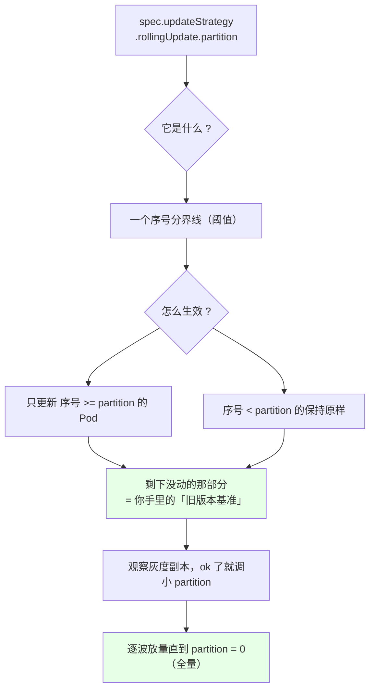
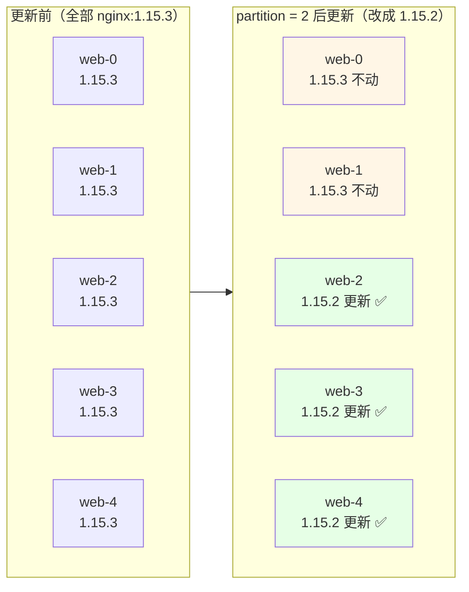
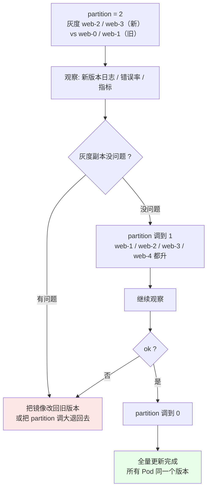
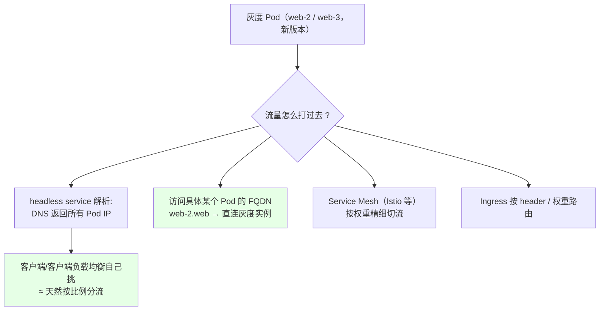
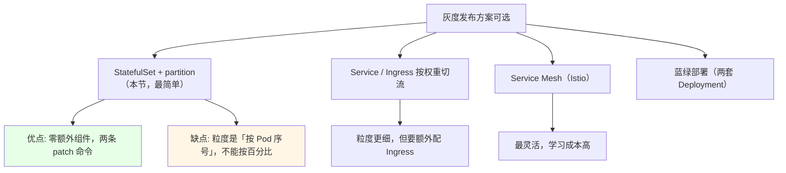

# Kubernetes 集群部署: StatefulSet 灰度发布（partition 分段更新与灰度放量）

上一节末尾留了个尾巴：`rollingUpdate` 里那个 `partition` 字段到底是干嘛的。这一节把它讲透。

结论：**`partition` 就是 StatefulSet 自带的灰度开关 —— 「只更新序号 >= partition 的 Pod」，序号小的原封不动当基准**。设成 2 就先让 `web-2`、`web-3` 升级，观察没问题再把 partition 调小（2 → 1 → 0）逐波放量，这就是一套**分段更新 = 简易灰度发布**。

## 纲要

- partition 到底是什么
- 画图理解：5 副本 + partition=2 会更新谁
- 规则一句话背下来
- 实测：web-0 / web-1 老版本，web-2 / web-3 新版本
- 灰度放量：partition 2 → 1 → 0
- 灰度期间流量怎么切
- 和其他灰度手段怎么配合
- 常见排错

## partition 到底是什么



先记住默认值：**`partition: 0` 意味着「序号 >= 0 的全部更新」= 全量更新**。所以它看起来像「不设灰度」，其实只是分界线在 0 那个最左端。

## 画图理解：5 副本 + partition=2 会更新谁



对应到 ASCII 上更直观：

```text
StatefulSet 分段更新（replicas=5，partition=2）

更新前:
├── web-0   nginx:1.15.3
├── web-1   nginx:1.15.3
├── web-2   nginx:1.15.3
├── web-3   nginx:1.15.3
└── web-4   nginx:1.15.3

执行: kubectl set image sts web nginx=nginx:1.15.2
      （updateStrategy.rollingUpdate.partition = 2）

更新后:
├── web-0   nginx:1.15.3   ← 序号 < 2，不更新（灰度基准）
├── web-1   nginx:1.15.3   ← 序号 < 2，不更新（灰度基准）
├── web-2   nginx:1.15.2   ← 序号 >= 2，更新 ✅
├── web-3   nginx:1.15.2   ← 序号 >= 2，更新 ✅
└── web-4   nginx:1.15.2   ← 序号 >= 2，更新 ✅

分界线:
      ├────── 不动 ──────┼────── 更新 ──────┤
      0        1          2        3        4
```

## 规则一句话背下来

> **只更新序号 >= partition 的 Pod；序号小于 partition 的一律原地不动。**

| 当前 partition | 会更新谁（5 副本） | 灰度范围 |
| --- | --- | --- |
| `0`（默认） | web-0 ~ web-4 **全部** | 无灰度，直接全量 |
| `2` | web-2 / web-3 / web-4 | **灰度 3 个**，web-0 / web-1 是基准 |
| `3` | web-3 / web-4 | 灰度更小，只 2 个 |
| `4` | 仅 web-4 | 最小灰度，1 个 |
| `5`（>= replicas） | **一个都不更新**（自动更新阶段） | 纯占位，等手动调小 |

## 实测：web-0 / web-1 老版本，web-2 / web-3 新版本

```bash
# 1. 先把副本数设成 4（也可以直接沿用 5，这里按原文演示走 4）
kubectl scale sts web --replicas=4
kubectl get pod -l app=nginx -o wide

# 2. 把灰度分界线设成 2：序号小于 2 的保持原样
kubectl edit sts web
# 改 updateStrategy.rollingUpdate.partition 为 2，保存

# 3. 改镜像触发更新 —— 只有 web-2 / web-3 会动
kubectl set image sts web nginx=nginx:1.15.2

# 4. 看更新过程（倒序：3 → 2）
kubectl get pod -l app=nginx -w
kubectl rollout status sts web

# 5. 复核每个 Pod 的镜像
kubectl get pod -o yaml | grep image:
```

```text
# 期望结果（注意饼：web-0 / web-1 还是 1.15.3）:
NAME      READY   STATUS    RESTARTS   AGE     IMAGE
web-0     1/1     Running   0          8m      nginx:1.15.3   ← 老版本（基准）
web-1     1/1     Running   0          8m      nginx:1.15.3   ← 老版本（基准）
web-2     1/1     Running   0          40s     nginx:1.15.2   ← 新版本 ✅
web-3     1/1     Running   0          50s     nginx:1.15.2   ← 新版本 ✅
```

| Pod | 序号 >= 2？ | 结果 |
| --- | --- | --- |
| `web-0` | 否 | 保持 `1.15.3` 不动 |
| `web-1` | 否 | 保持 `1.15.3` 不动 |
| `web-2` | 是 | 更新为 `1.15.2` |
| `web-3` | 是 | 更新为 `1.15.2` |

**「前面几个保持原样」就是它的价值所在** —— 你手里永远留着一批没动的旧版本实例当基准，随时能对比。

## 灰度放量：partition 2 → 1 → 0



```bash
# 第一波：灰度（partition=2）
kubectl patch sts web -p '{"spec":{"updateStrategy":{"rollingUpdate":{"partition":2}}}}'
kubectl set image sts web nginx=nginx:1.15.2
kubectl get pod -o yaml | grep image:
# 期望: web-0/1 = 1.15.3, web-2/3 = 1.15.2

# 观察一段时间（看日志、错误率、QPS…）

# 第二波：放量（partition 调小到 1）
kubectl patch sts web -p '{"spec":{"updateStrategy":{"rollingUpdate":{"partition":1}}}}'
kubectl get pod -l app=nginx -w

# 继续观察

# 第三波：全量（partition = 0）
kubectl patch sts web -p '{"spec":{"updateStrategy":{"rollingUpdate":{"partition":0}}}}'
kubectl rollout status sts web
kubectl get pod -o yaml | grep image:
# 期望: 全部 1.15.2
```

文本框提示一个容易踩的点：**`partition: 0` 是「全量更新」，不是「不更新」**。原文里特意纠正过这个误解 —— 有人以为 0 表示「小于 0 不存在所以不更新」，其实 0 表示「序号 >= 0 的都更新」，也就是全量。**想让自动更新阶段一个都不动，得把 partition 设成 >= replicas。**

## 灰度期间流量怎么切

partition 只解决了「哪些 Pod 是新版」，接不接流量是另一回事：



最省事的两种：

| 方式 | 做法 | 适合 |
| --- | --- | --- |
| **直连灰度实例** | `http://web-2.web` 直接打过去试 | 内部服务、手工验证 |
| **headless 解析 + 客户端LB** | `nslookup web` 返回全部 Pod IP，客户端自己分布请求 | 无状态客户端（Redis 客户端、MQ 客户端本来就会连多个节点） |
| Service Mesh | 按权重切流 | 需要精细百分比灰度 |

注意：**有状态应用（Redis / MQ）本身客户端就会连多个节点**，所以「DNS 返回一批 IP」天然就是按节点切流，不需要额外做负载均衡。

## 和其他灰度手段怎么配合



**结论：够用就先用 partition。** 生产里这招其实挺常用 —— 简单、不引组件、回滚就是「把镜像改回去」或者「把 partition 调大」。

## 常见排错

| 现象 | 原因 | 处理 |
| --- | --- | --- |
| 改了镜像但**一个 Pod 都没变** | partition >= replicas | 调小 partition（别设 0 以为是不更新） |
| 想灰度但所有 Pod 都升了 | partition 是 0（默认） | `kubectl patch` 设成目标序号 |
| 只想先试 1 个实例 | partition 设成 `replicas-1` | 5 副本就设 4，只更新 web-4 |
| 卡在半灰度，两个版本混着 | 故意的，这就是灰度态 | 确认是否要放量（调小）还是回滚（改镜像） |
| 想回滚 | StatefulSet 没有 `undo` 历史 RS | 把 `set image` 改回旧版本号，配合 partition 逐步换回 |
| 分界线算错了，灰度范围不对 | 忘了序号从 **0** 开始 | 序号是 0 ~ replicas-1，重新数一遍 |
| 灰度期间新版本起不来 | 新镜像问题 / 节点没镜像 | `kubectl describe pod` 看 Events |
| 忘了自己改过 partition | 当时随手 patch 的 | `kubectl get sts web -o yaml \| grep partition` 复核 |

## API 速览

| 能力 | 做法 | 关键点 |
| --- | --- | --- |
| 设灰度分界 | `kubectl patch sts <名称> -p '{"spec":{"updateStrategy":{"rollingUpdate":{"partition":N}}}}'` | 只更新序号 >= N 的 |
| 全量放量 | partition 调成 `0` | **0 = 全量，不是不更新** |
| 完全不自动更新 | partition 设成 `>= replicas` | 必须手动删 Pod 才动 |
| 触发灰度更新 | `kubectl set image sts <名称> <容器>=<镜像>` | 只有 template 变才滚 |
| 看当前分界 | `kubectl get sts <名称> -o yaml \| grep partition` | 复核用 |
| 看灰度结果 | `kubectl get pod -o yaml \| grep image:` | 逐个 Pod 对版本 |
| 看进度 | `kubectl rollout status sts <名称>` | 阻塞到完成/超时 |
| 盯更新顺序 | `kubectl get pod -l <标签> -w` | 从大到小倒序 |
| 直连灰度实例 | `http://web-<N>.<service 名>` | 手工验证最方便 |
| 指定命名空间 | `-n <命名空间>` | 不写落 default |

## Demo 示例

```bash
# 0. 前提：web 这个 StatefulSet，4 副本，当前镜像 nginx:1.15.3

# 1. 先把 partition 定成 2（序号 0、1 保持原样）
kubectl patch sts web -p '{"spec":{"updateStrategy":{"rollingUpdate":{"partition":2}}}}'

# 2. 改镜像触发更新
kubectl set image sts web nginx=nginx:1.15.2

# 3. 复核：应该 0/1 老、2/3 新
kubectl get pod -o yaml | grep image:
kubectl get pod -l app=nginx

# 4. 直连灰度实例手工验证
kubectl run -it --rm test --image=busybox --restart=Never -- sh
# 容器内:
curl -s http://web-2.web | head -3
exit

# 5. 灰度没问题 → 放量到 partition = 1
kubectl patch sts web -p '{"spec":{"updateStrategy":{"rollingUpdate":{"partition":1}}}}'

# 6. 再观察，OK 了 → 全量 partition = 0
kubectl patch sts web -p '{"spec":{"updateStrategy":{"rollingUpdate":{"partition":0}}}}'
kubectl rollout status sts web
kubectl get pod -l app=nginx
kubectl get pod -o yaml | grep image:

# 7. 回滚演示（灰度发现问题）：把 partition 拉大到 replicas，改回旧镜像
kubectl patch sts web -p '{"spec":{"updateStrategy":{"rollingUpdate":{"partition":4}}}}'
kubectl set image sts web nginx=nginx:1.15.3
kubectl get pod -l app=nginx -w
```

```yaml
# 8. 灰度态下的完整清单长这样
apiVersion: apps/v1
kind: StatefulSet
metadata:
  name: web
  namespace: default
spec:
  serviceName: web
  replicas: 4
  updateStrategy:
    type: RollingUpdate
    rollingUpdate:
      partition: 2          # ← 灰度分界：只更新序号 >= 2 的（web-2 / web-3）
  selector:
    matchLabels:
      app: nginx
  template:
    metadata:
      labels:
        app: nginx
    spec:
      containers:
      - name: nginx
        image: nginx:1.15.2
        imagePullPolicy: IfNotPresent
        ports:
        - containerPort: 80
```

```text
9. 灰度三阶段（replicas=4）:

阶段一  partition=2    [web-0 旧][web-1 旧] │ [web-2 新][web-3 新]
阶段二  partition=1    [web-0 旧]          │ [web-1 新][web-2 新][web-3 新]
阶段三  partition=0    [web-0 新][web-1 新][web-2 新][web-3 新]
                                            ↑ 分界线一路往左推 = 流量逐步放量
```

### 总结

- **`partition` 就是 StatefulSet 自带的灰度开关**，规则只有一句：**只更新序号 >= partition 的 Pod，序号小于它的原地不动** —— 那批「不动的」就是你手里的旧版本基准；
- **默认 `partition: 0` 表示全量更新**，不是「不更新」；想让自动更新阶段一个都不动，得把 partition 设成 **>= replicas**；
- **分阶段放量就是灰度发布**：`partition` 设 2 → 先让 `web-2`/`web-3` 升新版本 → 观察没问题 → 调到 1 → 再观察 → 调到 0 全量，相当于「先切一部分实例看看效果，没问题再切一波」；
- **灰度期间的流量不用额外做**：headless service 的 DNS 本来就返回所有 Pod IP（有状态应用的客户端本来就会连多个节点），要手工验证就直接 `curl http://web-2.web` 打单个灰度实例；要更精细的百分比切流再上 Service Mesh / Ingress；
- **优点和局限都很清楚**：partition 零额外组件、两条 patch 命令、回滚就是把 `set image` 改回去或把 partition 调大；**缺点是粒度只能按 Pod 序号，做不了「按百分比」的精细灰度**；
- **顺手纠正一个高频误解**：StatefulSet 没有 Deployment 那套 `rollout undo` 历史 RS 那玩意儿，所谓「回滚」就是**把镜像改回旧版本号再配合 partition 逐步换回**。

