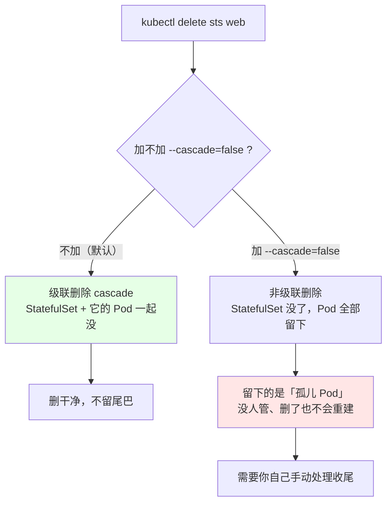
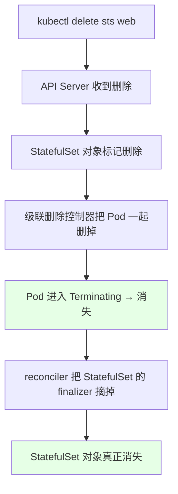
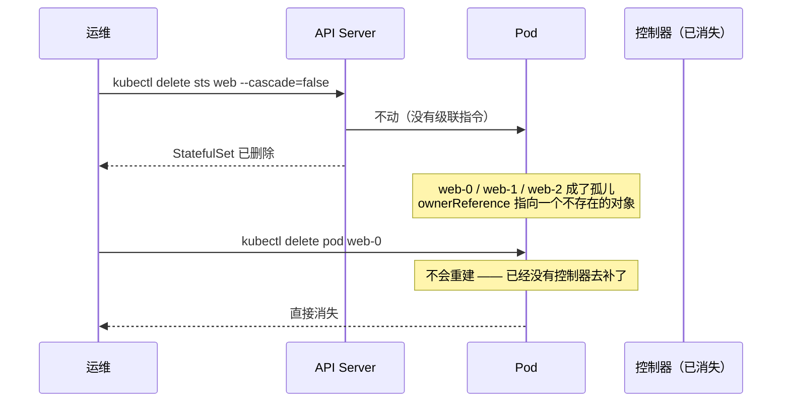
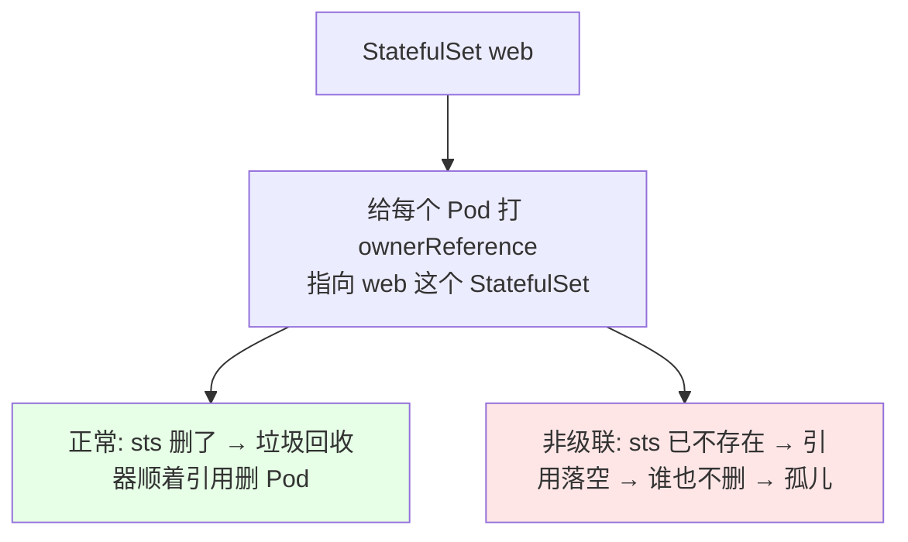
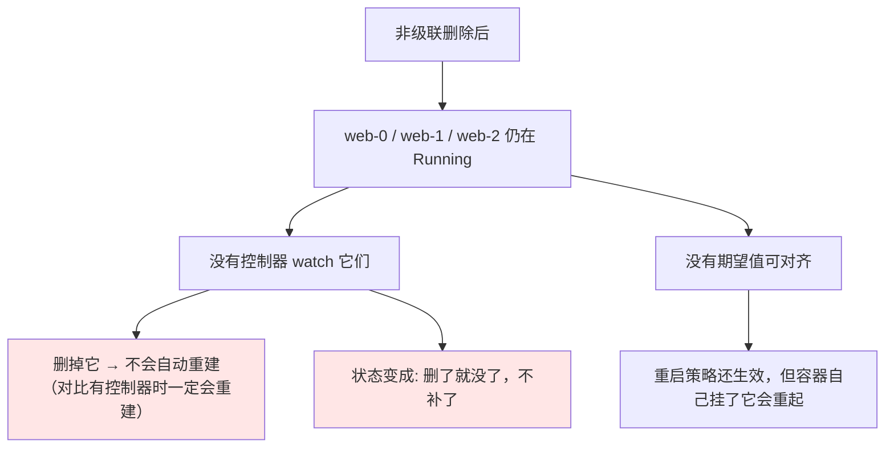
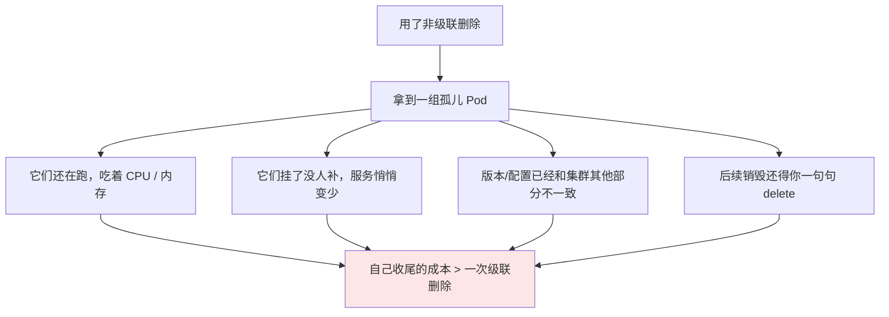

# Kubernetes 集群部署: StatefulSet 级联删除与非级联删除（--cascade=false 与孤儿 Pod）

StatefulSet 的删除和别的控制器不太一样 —— 它有**级联删除**和**非级联删除**两种模式。不加参数删除，是级联（连带 Pod 一起删）；加一个 `--cascade=false`，就是非级联（Pod 原地留下，变成没人管的孤儿）。

结论：**默认是级联删除**；非级联会产生一组**孤儿 Pod**，它们不再被任何控制器管理，删了也不会再重建 —— 生产上**几乎用不到非级联**，能少用就少用，孤儿 Pod 会让你自己承担全部收尾工作。

## 纲要

- 两种删除模式是啥
- 级联删除：默认行为
- 非级联删除：--cascade=false
- 孤儿 Pod 是什么，会有什么后果
- 对比：有控制器 vs 没控制器时的删除行为
- 为什么生产几乎不用非级联
- 常见排错

## 两种删除模式是啥



一句话对照：

| | 级联删除（默认） | 非级联删除 |
| --- | --- | --- |
| 命令 | `kubectl delete sts web` | `kubectl delete sts web --cascade=false` |
| StatefulSet 本身 | 删除 | 删除 |
| 它管下的 Pod | **一起删除** | **全部保留，变成孤儿** |
| Pod 删了会不会重建 | 会（控制器还没走远时） | **不会** |
| 收尾成本 | 零 | 你自己擦屁股 |

## 级联删除：默认行为

先看默认路径。

```bash
# 直接删（级联）
kubectl get pod -l app=nginx
# web-0  web-1  web-2

kubectl delete sts web
kubectl get pod -l app=nginx
# 期望: 空（Pod 跟着一起没了）
```



实测形态：

```text
# 删之前
NAME      READY   STATUS    RESTARTS   AGE
web-0     1/1     Running   0          10m
web-1     1/1     Running   0          10m
web-2     1/1     Running   0          8m

# 执行 kubectl delete sts web 之后立刻看
kubectl get pod -l app=nginx
NAME      READY   STATUS        RESTARTS   AGE
web-0     1/1     Terminating   0          10m
web-1     1/1     Terminating   0          10m
web-2     0/1     Terminating   0          8m

# 过几秒再看 —— 全没了
kubectl get pod -l app=nginx
# No resources found
```

**级联的好处：干净。** 这是绝大多数时候应该走的路径。

## 非级联删除：--cascade=false

再试非级联：

```bash
# 先确保 StatefulSet 还在
kubectl get sts web

# 加 --cascade=false，只删控制器本身
kubectl delete sts web --cascade=false
kubectl get sts web
# 期望: Error from server (NotFound): statefulsets.apps "web" not found

# 重点来了：看 Pod
kubectl get pod -l app=nginx
```

```text
# 删之后 —— StatefulSet 没了，但 Pod 还在!
NAME      READY   STATUS    RESTARTS   AGE
web-0     1/1     Running   0          12m      ← 还在
web-1     1/1     Running   0          12m      ← 还在
web-2     1/1     Running   0          10m      ← 还在

kubectl get sts web
# Error from server (NotFound): statefulsets.apps "web" not found
```



底层原理是 **ownerReference（所有者引用）**：



## 孤儿 Pod 是什么，会有什么后果

**孤儿 Pod（orphan Pod）= 还在跑、但没有任何控制器管着的 Pod。**



**对比实验**（这是理解的关键）：

| 场景 | 删掉一个 Pod 后会怎样 |
| --- | --- |
| **有 StatefulSet 在管** | 控制器发现少了 → **马上重建**回来（这就是「控制器总在逼近期望值」） |
| **StatefulSet 被非级联删了** | **没人管了，删了就是真没了** |

```bash
# 场景 A：控制器还在
kubectl delete pod web-1
kubectl get pod -l app=nginx
# 期望: web-1 被重新创建出来（有 NEW 的 AGE）

# 场景 B：已被非级联删除，控制器没了
kubectl delete sts web --cascade=false
kubectl get pod -l app=nginx        # 三个还在
kubectl delete pod web-1
kubectl get pod -l app=nginx
# 期望: web-1 真的没了，不会再冒出来
```

顺带把 PVC 留意一下：**删 StatefulSet（无论哪种方式）都不会自动删掉它的 PVC/PV**，所以非级联留下的孤儿 Pod 后面你想清理，还得单独 `kubectl delete pvc` 一把，否则存储资源一直占着。

## 为什么生产几乎不用非级联



| 考量 | 说明 |
| --- | --- |
| **几乎用不到** | 绝大多数场景直接级联删除就够了 |
| **能少用就少用** | 孤儿 Pod 的事只能你自己处理 |
| 唯一可能的用处 | 想在删控制器的同时**保住正在跑的实例**（比如想先观察残留实例的行为、或者临时摘掉控制器但保留现场） |
| 代价 | 手工清理 Pod + PVC + PV，稍不留神就漏删 |

## 常见排错

| 现象 | 原因 | 处理 |
| --- | --- | --- |
| 删了 sts，Pod 却还在跑 | 用了 `--cascade=false` | 确认没加参数；或补 `kubectl delete pod -l <标签>` |
| 删掉孤儿 Pod 后没重建 | 正常，非级联就是这样 | 想恢复就重新建一个 StatefulSet（Pod 名会重来） |
| 想一次性清理孤儿 Pod | 标签还在，可以按标签删 | `kubectl delete pod -l app=nginx --force` |
| 删了 StatefulSet 但 PVC 还在 | sts 不负责删存储 | 单独 `kubectl delete pvc <名称>` |
| `kubectl delete sts web` 卡住不返回 | Pod 有 finalizer 或优雅退出时间长 | `describe pod` 看终止原因，或观察 `Terminating` 状态 |
| 想强制删卡住的 | — | `kubectl delete pod <名称> --force --grace-period=0`（有状态场景慎用，可能丢数据） |
| 忘了自己做过非级联 | 随手加的参数 | `kubectl get pod` 找没有控制器对应的残留实例 |

## API 速览

| 能力 | 做法 | 关键点 |
| --- | --- | --- |
| 级联删除（默认） | `kubectl delete sts <名称>` | StatefulSet + Pod 一起没 |
| **非级联删除** | `kubectl delete sts <名称> --cascade=false` | **只删控制器，Pod 变孤儿** |
| 看 Pod 有没有被跟着删 | `kubectl get pod -l <标签>` | 还在 = 非级联 |
| 看控制器还在不在 | `kubectl get sts <名称>` | NotFound 但 Pod 在 = 非级联 |
| 清理孤儿 Pod | `kubectl delete pod -l <标签>` | 标签通常还在 |
| 看谁在管这个 Pod | `kubectl describe pod <名称> \| grep -A 3 Controlled By` | 看 ownerReference |
| 看 Pod 挂的 PVC | `kubectl get pod <名称> -o yaml \| grep -A 4 claimName` | 删 sts 不会连带删 PVC |
| 清理残留存储 | `kubectl delete pvc <名称>` | 手工收尾 |
| 按标签批量删 | `kubectl delete pod -l <标签> --all-namespaces` | 确认清楚再执行 |
| 指定命名空间 | `-n <命名空间>` | 不写落 default |

## Demo 示例

```bash
# === 实验一：级联删除（默认） ===
# 1. 确认现在有 3 个 Pod
kubectl get pod -l app=nginx

# 2. 直接删，不加任何参数
kubectl delete sts web

# 3. 观察：Pod 会一起进 Terminating 然后消失
kubectl get pod -l app=nginx -w

# === 实验二：非级联删除 ===
# 4. 重新建回来（service 还在，直接 apply 清单即可）
kubectl apply -f web-sts.yaml
kubectl scale sts web --replicas=3
kubectl get pod -l app=nginx

# 5. 加 --cascade=false 删
kubectl delete sts web --cascade=false

# 6. 关键验证：sts 没了，Pod 还在
kubectl get sts web
kubectl get pod -l app=nginx
# 期望: sts NotFound，3 个 Pod 依然 Running

# 7. 验证孤儿：删一个，不会重建
kubectl delete pod web-1
kubectl get pod -l app=nginx
# 期望: web-1 真消失了，没有新 web-1 冒出来

# 8. 看看 ownerReference 指向谁
kubectl describe pod web-0 | grep -A 3 "Controlled By"

# 9. 收尾：手动清掉剩下孤儿 Pod 和残留 PVC
kubectl delete pod web-0 web-2
kubectl get pvc
kubectl delete pvc web-nginx-0 web-nginx-1 web-nginx-2
```

```bash
# 10. 一条命令判断当前是不是「非级联残留状态」
kubectl get sts web 2>/dev/null | grep -q web && echo "sts 还在（级联态）" || \
  { echo "sts 已删，检查有没有残留 Pod:"; kubectl get pod -l app=nginx; }
```

```text
11. 两种删除的结果对照（replicas=3）:

级联删除  kubectl delete sts web
├── sts web                 → 删除
├── pod web-0               → 删除
├── pod web-1               → 删除
├── pod web-2               → 删除
└── pvc web-nginx-*         → 保留（需手工删）

非级联删除  kubectl delete sts web --cascade=false
├── sts web                 → 删除
├── pod web-0               → 保留（孤儿）→ 需手工删
├── pod web-1               → 保留（孤儿）→ 删了不会重建
├── pod web-2               → 保留（孤儿）→ 需手工删
└── pvc web-nginx-*         → 保留（需手工删）
```

### 总结

- **StatefulSet 的删除分两种：级联删除（默认）和非级联删除（`--cascade=false`）** —— 不加参数就是级联，`kubectl delete sts web` 会把 StatefulSet 和它管下的 Pod 一起带走，最干净，绝大多数时候走这条；
- **非级联就是加一个 `--cascade=false`**：StatefulSet 没了，但 Pod 一个个原地留着，**变成没人管的孤儿 Pod**；底层原因是 Pod 的 `ownerReference` 指向的那个控制器已经不存在了，垃圾回收器无从下手；
- **孤儿 Pod 最要命的性质：删了不会重建。** 有 StatefulSet 在管时你删一个它会立刻补回来（控制器在拼命逼近期望值），控制器一旦被非级联删掉，就再也没人替你补了 —— 服务副本会悄悄变少；
- **生产上几乎用不到非级联删除，能少用就少用**：它带来的孤儿 Pod 会继续吃 CPU / 内存、挂了没人补、版本还和其他部分不一致，收尾全得你自己一句句 `delete` ；
- **还有个容易漏的**：**无论哪种删除方式，StatefulSet 都不会自动删掉它的 PVC / PV** —— 非级联留下的孤儿 Pod 想清干净，还得单独 `kubectl delete pvc`，否则存储一直占着；
- **判断当前的删除态很简单**：`kubectl get sts web` 报 NotFound、但 `kubectl get pod -l <标签>` 还有东西 —— 这就是非级联残留，按标签批量清掉即可。

