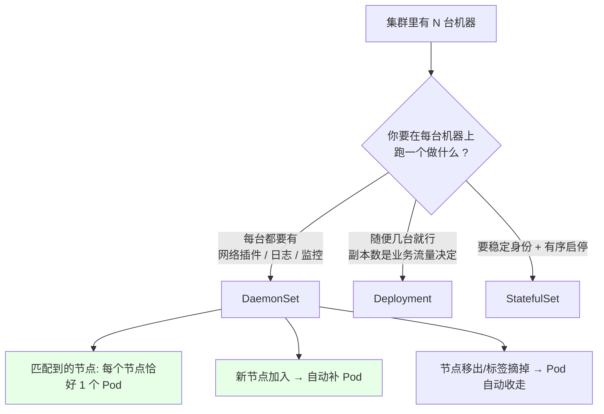
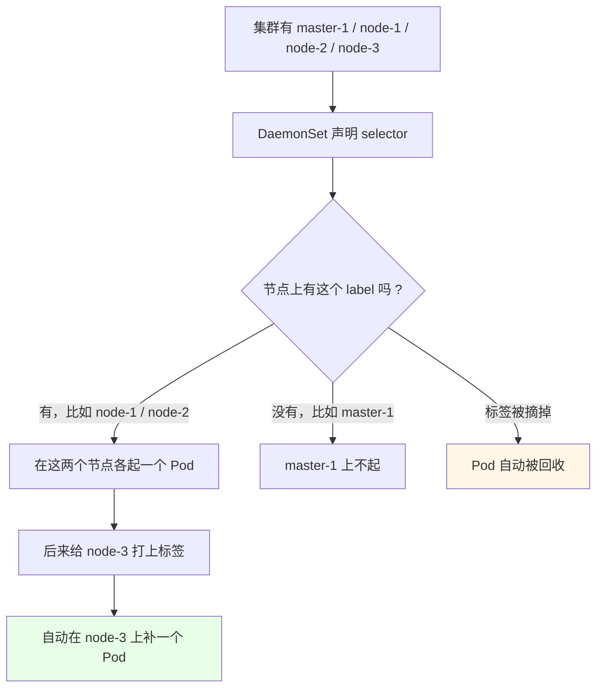
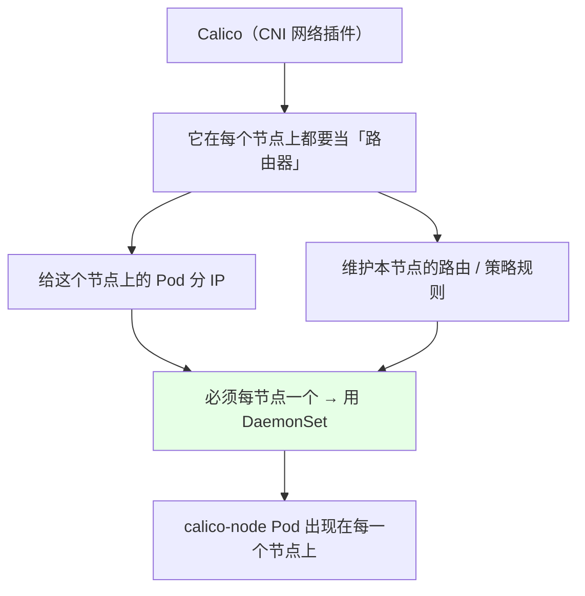
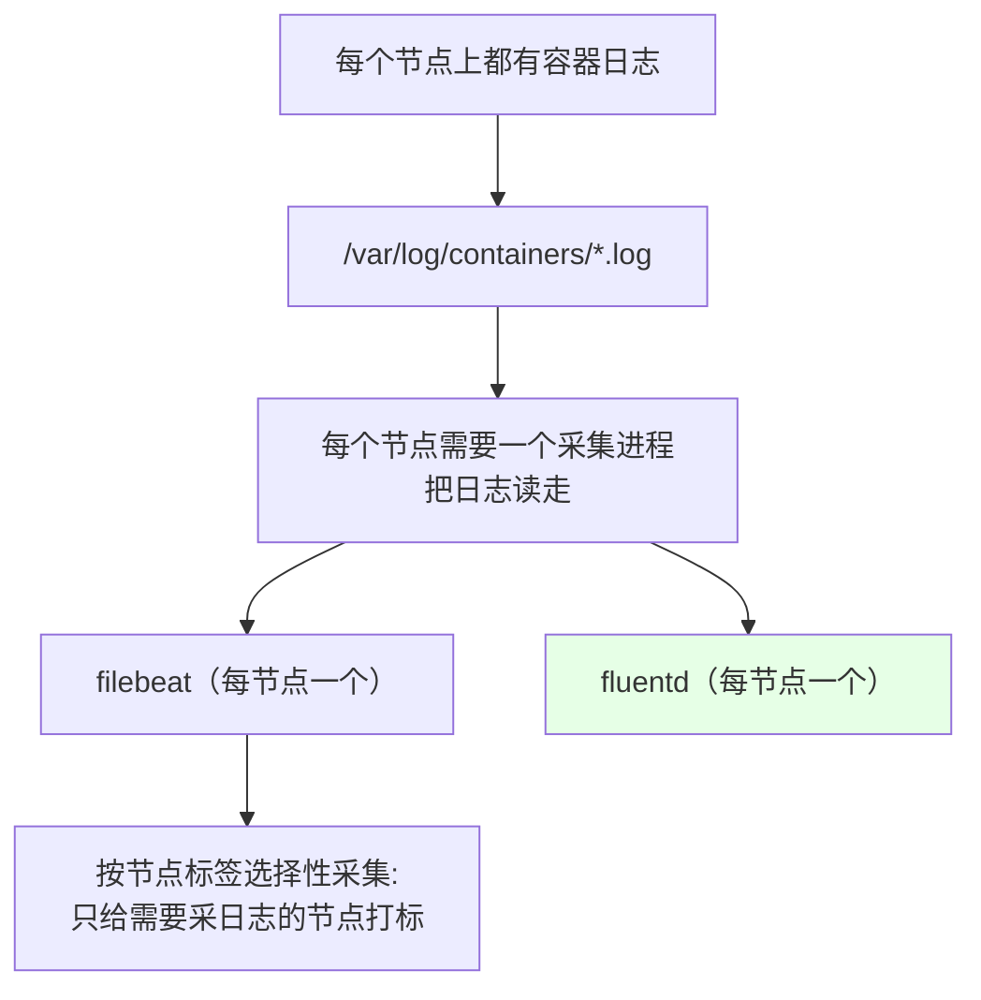
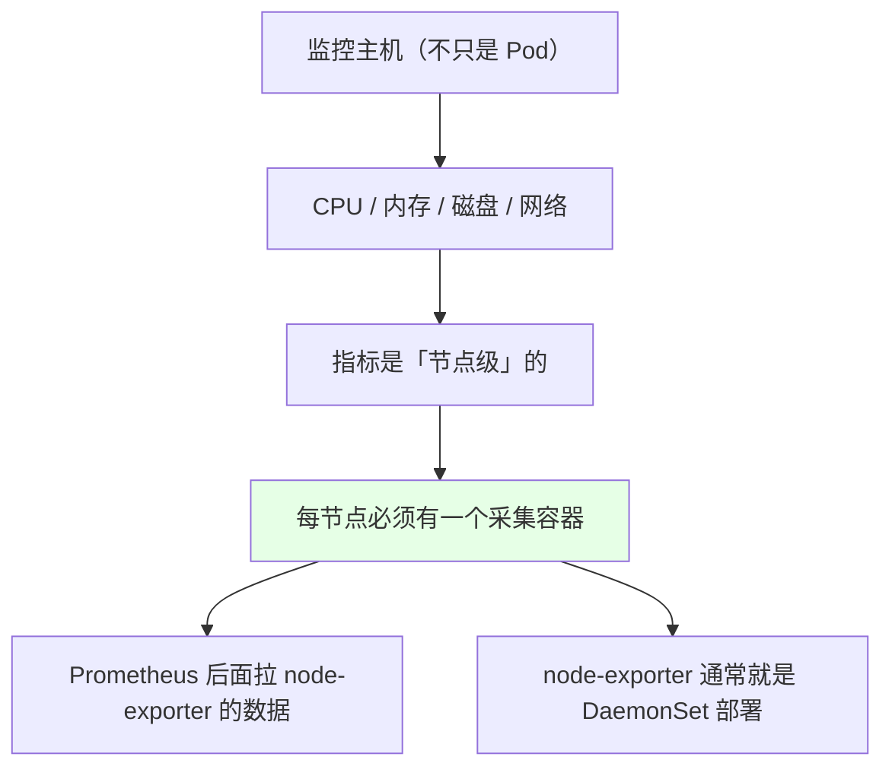
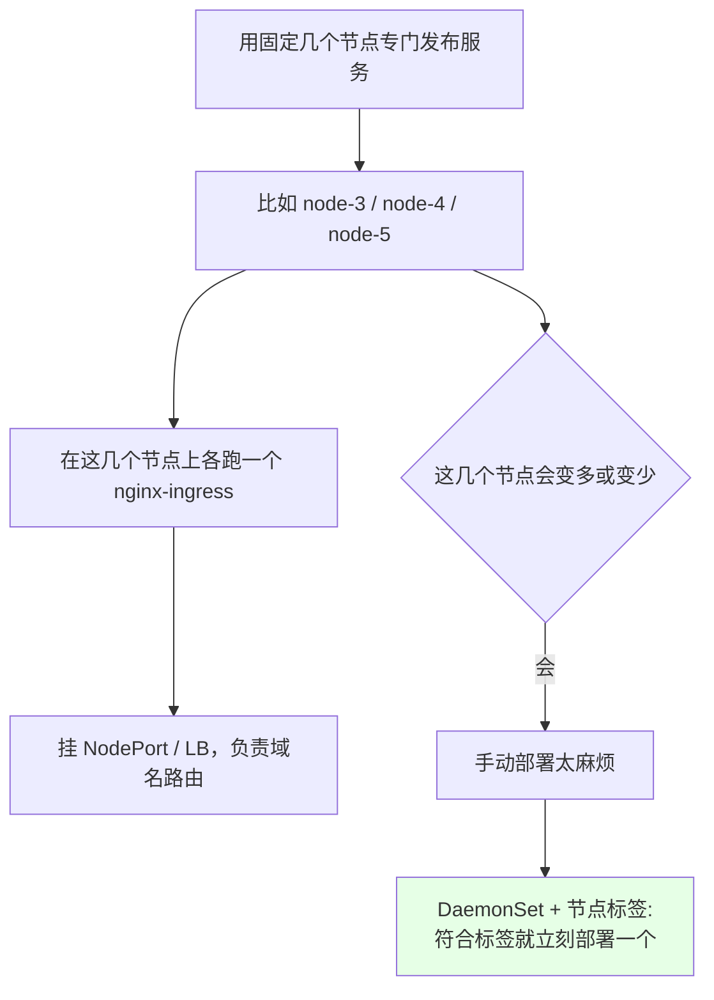
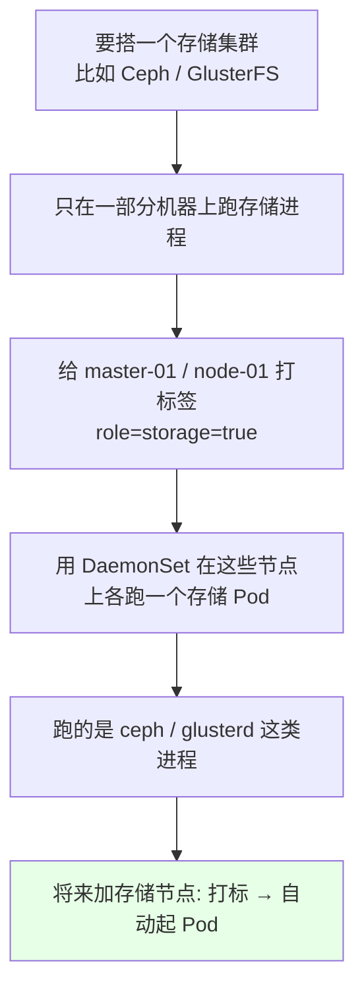

# Kubernetes 集群部署: 守护进程服务 DaemonSet（在每个节点上都跑一个 Pod）

Deployment 管无状态、StatefulSet 管有状态，第三种是 **DaemonSet（守护进程集，缩写 DS）** —— 它的语义更简单粗暴：**在每一个（或每一个符合标签的）节点上都部署且仅部署一个 Pod**。

结论：**凡是「这个节点上必须有这么一个进程」的需求，都用 DaemonSet** —— 网络插件（Calico）、日志采集（filebeat / fluentd）、主机监控（node-exporter）、ingress 控制器、集群存储节点（Ceph / GlusterFS）。而且**新加一台符合标签的机器，它会自动补一个 Pod；节点下线又自动收走**，不用你手动挨个机器去装。

## 纲要

- DaemonSet 的语义
- 三个控制器再对比一遍
- 它靠标签匹配节点
- 典型用途一：CNI 网络插件
- 典型用途二：日志采集
- 典型用途三：主机监控
- 典型用途四：ingress 控制器
- 典型用途五：集群存储节点
- 新加节点自动补 Pod
- 常见排错

## DaemonSet 的语义



一句话定义：**DaemonSet 保证在符合标签条件的每个节点上都运行一个 Pod 副本，节点多了自动补、节点少了自动收。**

## 三个控制器再对比一遍

| | Deployment | StatefulSet | **DaemonSet** |
| --- | --- | --- | --- |
| 副本数由谁定 | 你写 `spec.replicas` | 你写 `spec.replicas` | **节点数决定，不设 replicas** |
| 副本分布 | 调度器随便挑 | 调度器挑 | **每个符合条件的节点各一个** |
| Pod 名 | 随机带哈希 | 固定 `名称-序号` | 随机带哈希（无状态语义） |
| 典型用途 | 微服务、网关 | Redis / MongoDB / MQ | 网络插件、日志、监控 |

## 它靠标签匹配节点

DaemonSet 通过 `spec.selector` + 节点的 label 来筛节点。**不是所有节点都跑，只跑「被标签选中」的节点。**



```bash
# 看节点上都有什么标签（挑节点靠的就是这些）
kubectl get node --show-labels

# 只跑在某些节点上时，给节点打标
kubectl label node node-3 disktype=ssd
kubectl label node node-3 disktype-     # 摘掉标签， pods 会被回收
```

## 典型用途一：CNI 网络插件 Calico



- Calico 在每个节点上充当一个路由器，负责 Pod 的 IP 分配和本机网络；
- 它是 DaemonSet 最经典的用例之一，所以 `kube-system` 里几乎总能看到 `calico-node-xxxxx` 在每个节点上都有一个；
- 同理，**任何「本节点代理」性质的东西**（CNI、CSI node 插件、节点级防火墙 agent）都归 DaemonSet。

## 典型用途二：日志采集 filebeat / fluentd



采集进程必须是「每节点一个」：日志躺在节点磁盘上，跨节点采集反而乱。而且**不是所有节点都要采** —— 用标签选择性地在需要采集的节点上打标即可。

## 典型用途三：主机监控 node-exporter



监控主机时，指标是节点维度的，也要求每节点一份，同样是 DaemonSet 的活（Prometheus 那章会展开）。

## 典型用途四：ingress 控制器



这个场景特别能体现 DaemonSet 的价值：**「用来发布服务的节点」数量是会变动的**，新来一台就自动起一个 ingress 容器，不用你手动上去装。

## 典型用途五：集群存储节点（Ceph / GlusterFS）



注意这里**不是所有节点都跑**，而是「打了 `storage=true` 标签的节点」才跑 —— 又一次印证了「标签选择」这个核心能力。

## 加成节点自动补 Pod

这是 DaemonSet 相对「手工每台机器装一遍」的最大优势：

```bash
# 1. 看当前 calico / filebeat 铺了几个节点
kubectl get pod -n kube-system -o wide | grep calico-node

# 2. 新加一台机器加入集群后，它会自动出现在列表里
#    （前提：节点满足 DaemonSet 的标签条件）

# 3. 摘掉标签 → 这个节点上的 Pod 被自动回收
kubectl label node node-3 disktype-
kubectl get pod -n kube-system -o wide | grep calico-node
```

```text
扩容节点前的铺开情况（5 个节点）:

node-1   └── calico-node-abcde   ✅
node-2   └── calico-node-7fghi   ✅
node-3   └── calico-node-jklmn   ✅
node-4   └── calico-node-opqrs   ✅
node-5   └── calico-node-tuvwx   ✅

新加 node-6 加入集群后（自动补）:

node-1   └── calico-node-abcde   ✅
node-2   └── calico-node-7fghi   ✅
node-3   └── calico-node-jklmn   ✅
node-4   └── calico-node-opqrs   ✅
node-5   └── calico-node-tuvwx   ✅
node-6   └── calico-node-yz123   ✅  ← 自动补上，不用手工装
```

## 常见排错

| 现象 | 原因 | 处理 |
| --- | --- | --- |
| 新节点加进来没有对应 Pod | 节点标签不满足 selector | `kubectl label node <节点> <key>=<value>` |
| Pod 一直 `Pending` | 该节点不可调度（NotReady / 有污点） | `kubectl describe node` 看 taints，`describe pod` 看 Events |
| Master 上没有网络插件 Pod | master 默认带 NoSchedule 污点 | 要么容忍（加 toleration），要么给 master 打标放行 |
| 想限制只跑在部分节点 | 没写 `nodeSelector` / `affinity` | 在 DaemonSet 的 spec 里加节点选择条件 |
| Pod 数比节点数少 | 部分节点被标签排除 | `kubectl get node --show-labels` 核对 |
| 每节点起了两个 | 之前遗留的旧 DaemonSet 还在 | `kubectl get ds -A` 查一遍，删掉重复的 |
| 摘了标签 Pod 没被回收 | selector 匹配的是旧标签 | 确认 `nodeSelector` 与当前节点标签一致 |
| 日志/监控 Pod 起了但读不到数据 | 没挂宿主路径（`/var/log`、`/proc`） | 检查 `hostPath` 卷配置 |
| 想看 DaemonSet 铺了哪些节点 | — | `kubectl get ds -o wide`（NODE 列） |

## API 速览

| 能力 | 做法 | 关键点 |
| --- | --- | --- |
| 看所有 DaemonSet | `kubectl get ds -A` | 常用 `kube-system` 里那堆 |
| 看铺了哪些节点 | `kubectl get ds <名称> -o wide` | NODE / CONTAINERS 列 |
| 看当前 Pod 分布 | `kubectl get pod -o wide` | 每个节点一个 |
| 给节点打标 | `kubectl label node <节点> <key>=<value>` | 决定它跑不跑 |
| 摘掉标签 | `kubectl label node <节点> <key>-` | Pod 自动回收 |
| 看节点标签 | `kubectl get node --show-labels` | 核对 selector |
| 看节点污点 | `kubectl describe node <节点> \| grep -i taint` | master 默认 NoSchedule |
| 按标签筛 Pod | `kubectl get pod -l <标签>` | Label 与 Selector 章节细讲 |
| 指定命名空间 | `-n <命名空间>` | 不写落 default |
| 看更新状态 | `kubectl rollout status ds <名称>` | 等滚动完成 |

## Demo 示例

```bash
# 1. 看系统里现成的 DaemonSet（一般就有 calico-node）
kubectl get ds -A
kubectl get ds -n kube-system -o wide

# 2. 看它铺在哪些节点上
kubectl get pod -n kube-system -o wide | grep calico-node

# 3. 造一个只跑在「带标签节点」上的 DaemonSet
kubectl label node node-3 disktype=ssd
kubectl label node node-4 disktype=ssd

# 4. 观察节点标签
kubectl get node --show-labels | grep disktype

# 5. 摘掉标签，观察对应 Pod 被自动回收
kubectl label node node-4 disktype-
kubectl get pod -o wide

# 6. 再打回来，观察 Pod 自动补上
kubectl label node node-4 disktype=ssd
kubectl get pod -o wide
```

```yaml
# 7. 一个典型的「日志采集」DaemonSet 骨架
apiVersion: apps/v1
kind: DaemonSet
metadata:
  name: filebeat
  namespace: kube-system
  labels:
    k8s-app: filebeat
spec:
  selector:
    matchLabels:
      k8s-app: filebeat
  template:
    metadata:
      labels:
        k8s-app: filebeat
    spec:
      nodeSelector:              # ← 只跑在带这个标签的 nodes 上
        disktype: ssd
      tolerations:               # ← master 有污点也能容忍
      - key: node-role.kubernetes.io/master
        effect: NoSchedule
        operator: Exists
      containers:
      - name: filebeat
        image: filebeat:7.6.0
        imagePullPolicy: IfNotPresent
        env:
        - name: ELASTIC_HOST
          value: elasticsearch:9200
        volumeMounts:
        - name: varlog        # 容器标准输出 / 落盘的日志
          mountPath: /var/log
          readOnly: true
        - name: varlibdockercontainers
          mountPath: /var/lib/docker/containers
          readOnly: true
      volumes:
      - name: varlog
        hostPath:
          path: /var/log
      - name: varlibdockercontainers
        hostPath:
          path: /var/lib/docker/containers
```

```text
8. 跑起来之后集群里长这样:
├── node-1 (disktype=ssd)     └── filebeat-7f9d8   ✅
├── node-2 (disktype=hdd)     —— 不打标，不跑
├── node-3 (disktype=ssd)     └── filebeat-a4c12   ✅
├── node-4 (disktype=ssd)     └── filebeat-b8e77   ✅
└── node-5 (disktype=ssd)     └── filebeat-c9d33   ✅（新加入自动补）
```

### 总结

- **DaemonSet（守护进程集，缩写 DS）的语义就一句：在符合标签条件的每个节点上，恰好部署一个 Pod** —— 没有 `replicas`，副本数由节点数决定；
- **它和 Deployment / StatefulSet 的分工**：Deployment 副本数你说了算、调度器随便挑；StatefulSet 副本固定名 + 有序；**DaemonSet 是「每个节点一个」**，Pod 名随机无状态；
- **靠节点标签控制铺开范围** —— `kubectl label node node-3 disktype=ssd` 之后打了标的节点才跑，摘掉标签 Pod 自动回收，新机器加入自动补一个，**完全不用手工挨台去装**；
- **五个典型用途**：**CNI 网络插件 Calico**（每节点当路由器分 IP）、**日志采集 filebeat / fluentd**（读 `/var/log`）、**主机监控 node-exporter**（节点级指标）、**ingress 控制器**（专门发布服务的那几个节点，数量会变，最吃这套）、**集群存储 Ceph / GlusterFS**（给存储节点打 `storage=true` 标签，只在这些节点跑）；
- **Kind 于「本节点必须有」的东西**，DaemonSet 都是最优解：网络、日志、监控、agent、节点级代理；
- **两个常见坑**：**Master 默认带 NoSchedule 污点**，所以 master 上往往看不到网络插件 Pod（要么加 toleration，要么不打标）；另外它支持 `nodeSelector` / `affinity` 做精细控制，别以为「一定是全部节点都跑」。

