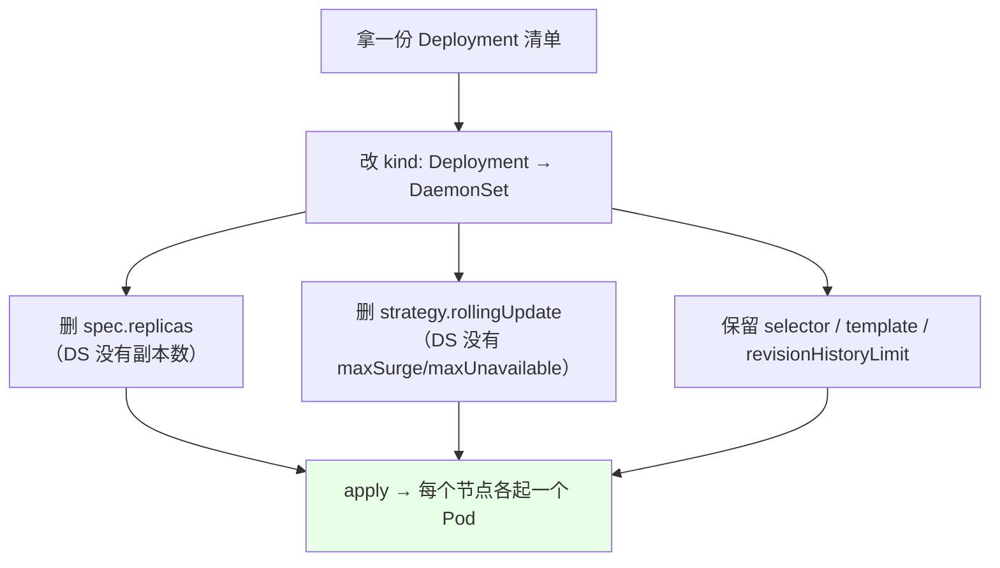
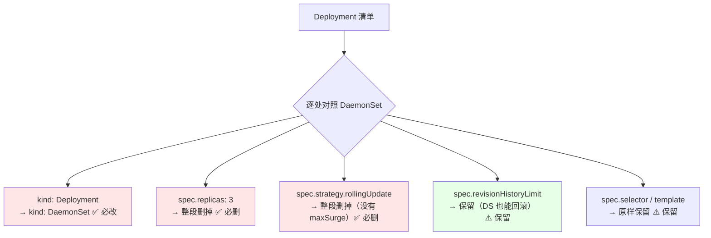
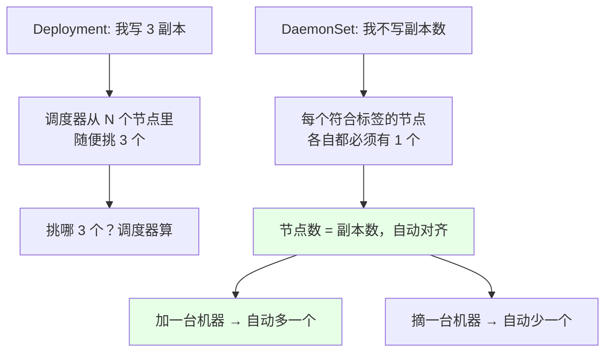
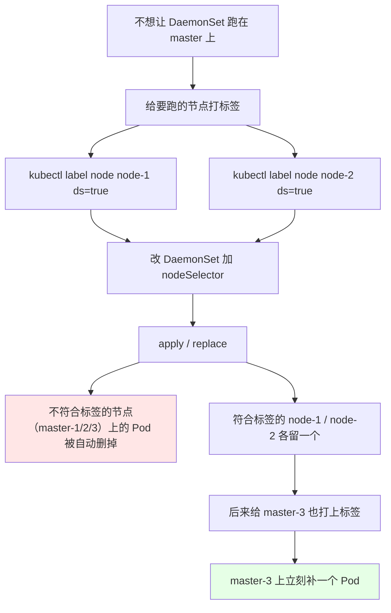

# Kubernetes 集群部署: DaemonSet 的使用（改造 Deployment 清单、去掉 replicas、nodeSelector 筛选节点）

会用之前有一步笨办法值得学：**从 Deployment 清单改一个 DaemonSet 出来**。差别其实只有几处 —— 换 `kind`、删 `replicas`、删 `maxSurge`。

结论：**DaemonSet 没有副本数这个概念**（一个节点只能一个，副本数由节点数决定），也没有 Deployment 那套 `maxSurge` / `maxUnavailable`；想控制它铺在哪几个节点，就靠 `nodeSelector` + `kubectl label node` —— **标签一打 Pod 立刻起来，标签一摘 Pod 立刻被删，全程不用改清单**。

## 纲要

- 从 Deployment 清单改造出 DaemonSet
- 必须改的三处（kind / replicas / strategy）
- 副本数为啥没了
- 没有 maxSurge / maxUnavailable
- 不写 nodeSelector 就是全节点铺开
- master 上会不会跑？看污点
- nodeSelector 筛选：只跑在打了标的节点
- 标签一打一摘，Pod 自动起落
- 更新与回滚也能用
- 常见排错

## 从 Deployment 清单改造出 DaemonSet



```bash
# 最省事的改法：导出来再编辑
kubectl get deploy nginx -o yaml > nginx-ds.yaml
vim nginx-ds.yaml        # 按下面三处改
kubectl replace -f nginx-ds.yaml
# 或者直接 apply 一份新写的 DS 清单
kubectl apply -f nginx-ds.yaml
```

## 必须改的三处（kind / replicas / strategy）



对照表：

| 字段 | Deployment | DaemonSet | 处理 |
| --- | --- | --- | --- |
| `kind` | `Deployment` | `DaemonSet` | **改成 DaemonSet** |
| `spec.replicas` | 有（你要几台） | **没有**（节点有几个就几个） | **整段删掉** |
| `spec.strategy.rollingUpdate.maxSurge` | 有 | **没有** | **整段删掉** |
| `spec.strategy.rollingUpdate.maxUnavailable` | 有 | **没有** | 同上 |
| `spec.updateStrategy` | 无 | **有**（DS 用这个） | 通常留默认，不配也行 |
| `spec.revisionHistoryLimit` | 有 | 有 | 保留，回滚要用 |
| `spec.selector` / `template` | 有 | 有 | 原样保留 |
| `spec.nodeSelector` | 有（可选） | 有（**这里才是核心**） | 想筛节点就加它 |

> 实践提醒：手滑把字段名写成 `strategy`（少写 update 那一段）会直接报错，DaemonSet 用的是 **`updateStrategy`**，不是 `strategy`。拿不准就 `kubectl get ds -n kube-system -o yaml` 抄现成的。

## 副本数为啥没了



**每个节点上只能有一个，不可能起两个** —— 所以「副本数」这个维度对 DaemonSet 就失去意义了，写 `replicas: 3` 反而会报错。

## 没有 maxSurge / maxUnavailable

Deployment 那两个「允许多起几个 / 允许挂几个」的参数，DaemonSet 一概没有：

| | Deployment | DaemonSet |
| --- | --- | --- |
| `maxSurge` | 有，可调 | **没有** |
| `maxUnavailable` | 有，可调 | **没有** |
| 更新方式 | `RollingUpdate` / `Recreate` 可选 | 只有滚动更新一种（逐个替换） |
| 更新策略字段 | `spec.strategy` | **`spec.updateStrategy`** |
| 其他字段 | — | `minReadySeconds`、`revisionHistoryLimit` 等照样有 |

```text
DaemonSet 里不该出现的东西（出现了就删）:
├── spec
│   ├── replicas          ← ❌ DS 没有，删
│   ├── strategy          ← ❌ DS 用 updateStrategy，把这段删掉
│   ├── updateStrategy    ← ✅ 这是 DS 的（留默认即可）
│   ├── revisionHistoryLimit   ← ✅ 保留
│   ├── selector          ← ✅ 保留
│   ├── template          ← ✅ 保留
│   └── nodeSelector      ← ✅ 想筛节点就加它
```

## 不写 nodeSelector 就是全节点铺开

```bash
# 不写 nodeSelector，直接创建
kubectl apply -f nginx-ds.yaml
kubectl get pod -o wide
```

```text
# 集群有 5 台（master-1/2/3 + node-1/2），master 没打污点时:
NAME                    READY   STATUS    RESTARTS   AGE   NODE
nginx-7f9d8-abcde       1/1     Running   0          30s   master-1
nginx-7f9d8-bcdef       1/1     Running   0          30s   master-2
nginx-7f9d8-cdefa       1/1     Running   0          29s   master-3
nginx-7f9d8-defab       1/1     Running   0          30s   node-1
nginx-7f9d8-efabc       1/1     Running   0          30s   node-2
```

**每台机器上一个，一个不多一个不少。**

> 原文特意提醒：演示环境里 master 没打污点，所以 master 上也跑了容器。**生产环境 master 一定不要部署业务容器** —— 污点（taint）和容忍（toleration）后面章节专门讲，这里先知道这个现象存在。

## nodeSelector 筛选：只跑在打了标的节点



第一步，**给节点打标签**。注意 label 是通用机制，任何资源都能打，写的时候把资源类型带上更清楚：

```bash
# 给节点打标（注意 key=value 都要是字符串）
kubectl label nodes k8s-node-01 ds=true
kubectl label nodes k8s-node-02 ds=true

# 看打没打上
kubectl get nodes --show-labels | grep ds

# 摘标签
kubectl label nodes k8s-master-03 ds-
```

第二步，**在 DaemonSet 里写 `nodeSelector`** —— 注意它是**和 `containers` 同级的**，别缩进错地方；而且 **`true` 必须写成字符串 `true`，直接写个 `true` 会报错**：

```yaml
apiVersion: apps/v1
kind: DaemonSet
metadata:
  name: nginx
spec:
  nodeSelector:            # ← 和 containers 同级，不要缩进错
    ds: "true"             # ← 必须是字符串 "true"
  revisionHistoryLimit: 2
  selector:
    matchLabels:
      app: nginx
  template:
    metadata:
      labels:
        app: nginx
    spec:
      containers:
      - name: nginx
        image: nginx:1.15.2
        imagePullPolicy: IfNotPresent
```

```bash
# 应用上去
kubectl replace -f nginx-ds.yaml
kubectl get pod -o wide
```

```text
# 打标后：只有 node-1 / node-2 有，master 上的被自动删掉了
NAME                    READY   STATUS    RESTARTS   AGE   NODE
nginx-6a1b2-11223       1/1     Running   0          2m    node-1
nginx-6a1b2-33445       1/1     Running   0          2m    node-2
nginx-6a1b2-55667       1/1     Terminating   0       2m    master-1  ← 被回收
nginx-6a1b2-77889       1/1     Terminating   0       2m    master-2  ← 被回收
```

**关键行为：不符合标签的节点上的 Pod 会被自动删掉** —— 这就是 DaemonSet 的「向期望状态收敛」，只不过它的期望状态是「每个选中节点上各一个」。

第三步，**新机器加进来直接打标就行**：

```bash
kubectl label nodes k8s-master-03 ds=true
kubectl get pod -o wide
```

```text
# master-3 刚打标，Pod 已经在创建了
NAME                    READY   STATUS             RESTARTS   AGE   NODE
nginx-6a1b2-11223       1/1     Running             0          3m    node-1
nginx-6a1b2-33445       1/1     Running             0          3m    node-2
nginx-9c3d4-99001       0/1     ContainerCreating   0          5s    master-3  ← 立刻补上
```

**标签一打 Pod 立刻起，标签一摘 Pod 立刻没** —— 全程不用碰清单。

## 更新与回滚也能用

```bash
# 改镜像 → 触发滚动更新
kubectl set image ds nginx nginx=nginx:1.15.3
kubectl rollout status ds nginx

# 看历史（DS 也有 revisionHistoryLimit 留的痕迹）
kubectl rollout history ds nginx

# 回滚
kubectl rollout undo ds nginx
```

```text
# kubectl rollout history ds nginx 的输出形态:
REVISION  CHANGE-CAUSE
1         <none>              ← 第一次创建
2         <none>              ← 第二次改镜像（没用 --record，所以是 none）
```

> 和 Deployment 一样，**没加 `--record` 的话 CHANGE-CAUSE 就是 `<none>`**；想让历史看得懂，就带 `--record`。

## 常见排错

| 现象 | 原因 | 处理 |
| --- | --- | --- |
| apply 清单报字段不存在 | 写了 `spec.replicas` | DaemonSet 没副本数，删掉 |
| 报 `strategy` 相关错误 | 写成 `spec.strategy` | 用 **`spec.updateStrategy`**，或直接删掉这段 |
| `nodeSelector` 不生效 | 字段名拼错 / 缩进错（跑到 template 里了） | 它必须和 `containers` 同级 |
| 加了 `ds: true` 报类型错 | `true` 没加引号 | 写成 `ds: "true"` |
| 加了 nodeSelector 但 Pod 反而少了 | 节点没打对应标签 | `kubectl label node ...` 补标签 |
| master 上不该跑却跑了 | master 没打污点 | 后面讲 taint/toleration；或改用 nodeSelector 排除 |
| 节点摘了标签 Pod 没被删 | selector 与标签对不上 | `kubectl get node --show-labels` 核对 |
| 想回滚但 `revisionHistoryLimit` 太小 | 历史被回收 | 调大它 |
| 点 `rollout history` 看不出改了什么 | 创建时没加 `--record` | 以后带 `--record` 创建 |

## API 速览

| 能力 | 做法 | 关键点 |
| --- | --- | --- |
| 导出模板 | `kubectl get deploy <名称> -o yaml > <文件>.yaml` | 改之前先导 |
| 改造为 DS | 改 `kind` / 删 `replicas` / 删 `strategy` | 三处必改 |
| 创建 / 刷新 | `kubectl apply -f <文件>` 或 `kubectl replace -f <文件>` | 两种都行 |
| 看所有 DS | `kubectl get ds -A` | 常看 kube-system |
| 看铺了哪些节点 | `kubectl get ds <名称> -o wide` | NODE 列 |
| 给节点打标 | `kubectl label nodes <节点> <key>=<value>` | 决定 DaemonSet 铺不铺 |
| 摘节点标签 | `kubectl label nodes <节点> <key>-` | Pod 自动回收 |
| 在 DS 里筛节点 | `spec.nodeSelector` | 与 containers 同级，`true` 要加引号 |
| 改镜像 | `kubectl set image ds <名称> <容器>=<镜像>` | 触发滚动更新 |
| 看历史 / 回滚 | `kubectl rollout history ds` / `kubectl rollout undo ds` | 靠 revisionHistoryLimit |

## Demo 示例

```bash
# 1. 从 Deployment 导一份清单当模板
kubectl get deploy nginx -o yaml > nginx-ds.yaml

# 2. 改三处: kind → DaemonSet；删 spec.replicas；删 spec.strategy
vim nginx-ds.yaml

# 3. 先不配 nodeSelector，全节点铺开
kubectl apply -f nginx-ds.yaml
kubectl get pod -o wide
# 期望: 每台机器各一个（master 没污点的话 master 也有）

# 4. 给要跑的节点打标
kubectl label nodes k8s-node-01 ds=true
kubectl label nodes k8s-node-02 ds=true
kubectl get nodes --show-labels | grep ds

# 5. 在清单里加 nodeSelector（注意是字符串 true）
#    spec 下、与 containers 同级:
#      nodeSelector:
#        ds: "true"

# 6. 应用：不符合标签的节点上的 Pod 会被自动删掉
kubectl replace -f nginx-ds.yaml
kubectl get pod -o wide

# 7. 给 master-3 补打标签，看它自动补 Pod
kubectl label nodes k8s-master-03 ds=true
kubectl get pod -o wide

# 8. 摘掉 node-2 的标签，看它自动回收
kubectl label nodes k8s-node-02 ds-
kubectl get pod -o wide

# 9. 更新与回滚
kubectl set image ds nginx nginx=nginx:1.15.3
kubectl rollout status ds nginx
kubectl rollout history ds nginx
kubectl rollout undo ds nginx
```

```text
10. 全量铺开 vs 标签筛选后的差异（5 节点集群）:

不写 nodeSelector（全铺）:
├── master-1  nginx-7f9d8-abcde
├── master-2  nginx-7f9d8-bcdef
├── master-3  nginx-7f9d8-cdefa
├── node-1    nginx-7f9d8-defab
└── node-2    nginx-7f9d8-efabc

加了 nodeSelector: ds="true"（只跑 node-1 / node-2）:
├── master-1  —— Pod 被自动回收
├── master-2  —— Pod 被自动回收
├── master-3  —— Pod 被自动回收
├── node-1    nginx-6a1b2-11223  ✅
└── node-2    nginx-6a1b2-33445  ✅
```

### 总结

- **最省事的建 DS 办法：拿 Deployment 清单改** —— 只动三处：**`kind` 改成 `DaemonSet`、删掉 `spec.replicas`、删掉 `spec.strategy`**；`selector` / `template` / `revisionHistoryLimit` 原样保留;
- **DaemonSet 没有副本数**：一个节点上只能有一个，副本数就是节点数 —— 写 `replicas` 会报错，加机器自动补、减机器自动收；
- **DaemonSet 既没有 `maxSurge` 也没有 `maxUnavailable`**，字段是 **`spec.updateStrategy`**（不是 `spec.strategy`，写错会报字段不存在），一般不配就用默认的；`revisionHistoryLimit` 照样保留，所以**回滚和 Deployment 一样能用**（`rollout undo ds`，没加 `--record` 的话 history 里是 `<none>`）；
- **控制它铺在哪几个节点靠 `nodeSelector` + `kubectl label node`** —— 标签一打 Pod 立刻起、一摘 Pod 立刻被自动删，全程不用改清单，这就是 DaemonSet 的收敛逻辑；
- **两个必踩的小坑**：`nodeSelector` 要**和 `containers` 同级**（缩进写错就不生效），`ds: true` 的 `true` **必须写成字符串 `"true"`**；另外 `kubectl label` 是通用机制，打标时把资源类型带上更清楚；
- **生产提醒**：演示环境 master 没打污点所以上面也跑了容器，但**生产 master 一定不要部署业务容器** —— 这里只是顺带看见了「污点」这个现象，taint / toleration 后面章节专门讲。

