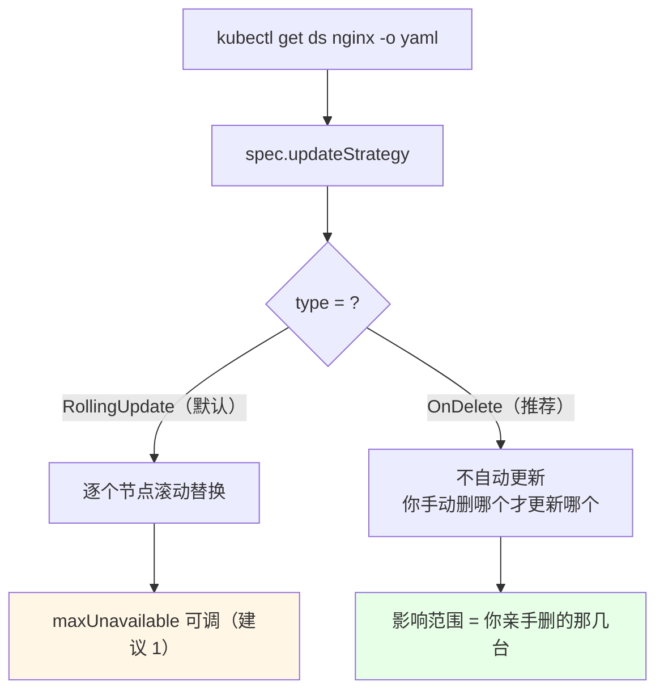
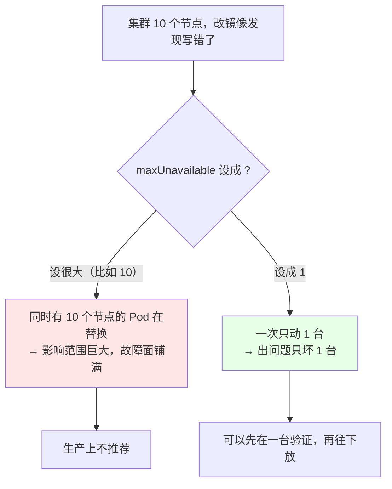
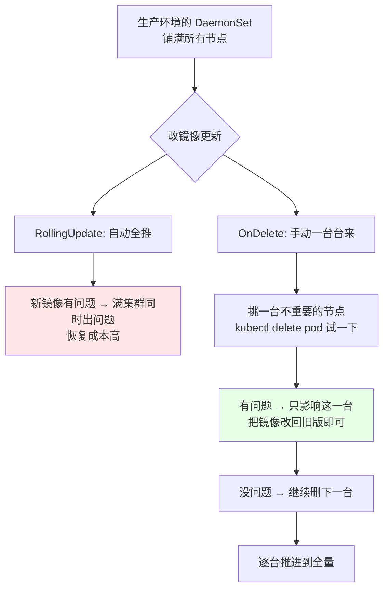
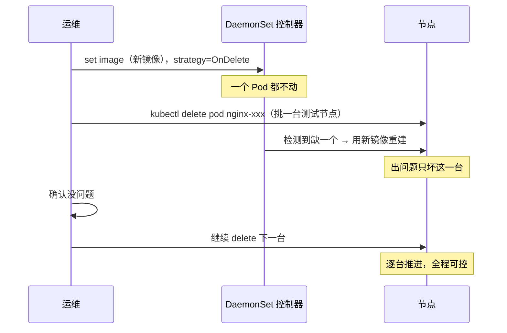
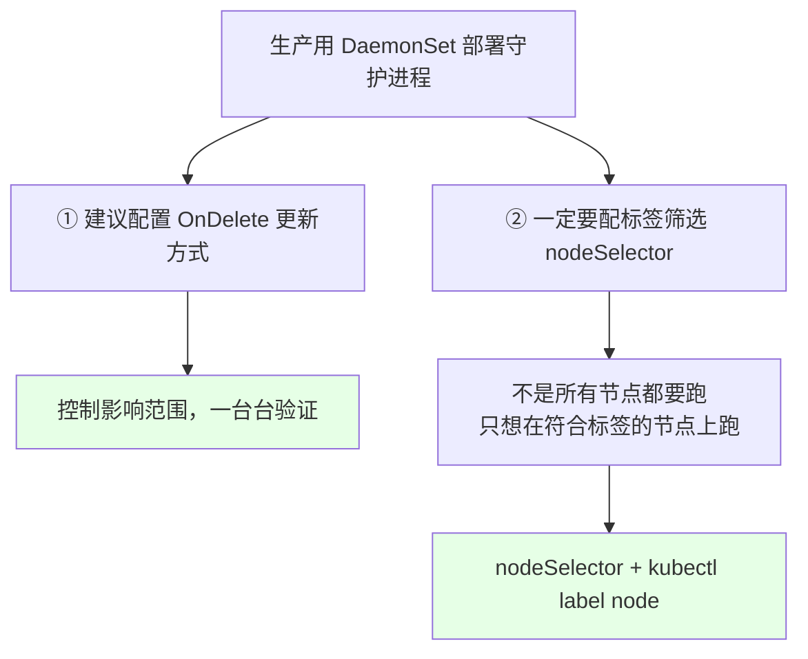

# Kubernetes 集群部署: DaemonSet 的更新和回滚（OnDelete 策略为什么更适合守护进程）

DaemonSet 铺的是「所有节点」，一滚就是满集群动 —— 所以它的更新策略选型比 Deployment 更重要。

结论：**DaemonSet 的 `updateStrategy` 同样只有 `RollingUpdate` 和 `OnDelete`，建议生产用 `OnDelete`** —— 先在一个不重要节点上手动删 Pod 试一个新镜像，**出问题只影响那一台**；确认没问题了再一台台放过去。 RollingUpdate 里建议把 `maxUnavailable` 设成 `1`，别设大了。

## 纲要

- DaemonSet 的 updateStrategy 长什么样
- maxUnavailable 建议设成 1
- 实测一次滚动更新（含镜像没本地化的坑）
- 为什么推荐使用 OnDelete
- 用 OnDelete 做「单机灰度」
- 更新记录与回滚
- 更新策略 + nodeSelector 的组合建议
- 常见排错

## DaemonSet 的 updateStrategy 长什么样



和 StatefulSet 一样，**只有两种**：

| | `RollingUpdate`（默认） | `OnDelete` |
| --- | --- | --- |
| 改镜像后 | 自动逐个替换所有节点的 Pod | **一个都不动** |
| 影响范围 | 可能一次动一批节点 | **只有你 `delete pod` 的那几台** |
| 适合 | 确信新版本没问题、想一键全推 | **生产推荐**；或者分批精确控制 |
| 额外参数 | `maxUnavailable` | 无 |

字段名是 **`spec.updateStrategy`**（不是 `spec.strategy`），DaemonSet 用的是：

```yaml
spec:
  updateStrategy:
    type: OnDelete          # 或 RollingUpdate
```

```text
DaemonSet 默认形态（没显式指定时）:
├── spec
│   ├── updateStrategy          ← DS 用这个（Deployment 用 strategy）
│   │   ├── type: RollingUpdate
│   │   └── rollingUpdate
│   │       └── maxUnavailable: 1
│   ├── revisionHistoryLimit
│   ├── selector
│   └── template
```

## maxUnavailable 建议设成 1

RollingUpdate 下有个 `rollingUpdate.maxUnavailable`（**平均不可用数**），原文给的建议很实在：**设成 `1`**。



| `maxUnavailable` | 滚动时最多几台同时不可用 | 评价 |
| --- | --- | --- |
| `1`（**建议**） | 一次一台 | 出问题影响面最小 |
| `2` / `3` | 一批 | 快一点但风险翻倍 |
| 大于节点数 | 满集群一起抖 | **生产不推荐** |

> 原话的意思就是：**如果部署配置写错了，这个值设太大影响范围就大；设小一点就不会波及这么多。**

```bash
# 把 DaemonSet 的滚动策略改成「一次最多不可 1 台」
kubectl patch ds nginx -p '{"spec":{"updateStrategy":{"type":"RollingUpdate","rollingUpdate":{"maxUnavailable":1}}}}'
kubectl get ds nginx -o yaml | grep -A 4 updateStrategy
```

## 实测一次滚动更新（含镜像没本地化的坑）

```bash
# 改镜像，触发滚动更新
kubectl set image ds nginx nginx=nginx:1.15.3 --record

# 看滚动过程
kubectl get pod -o wide -w
kubectl rollout status ds nginx
```

```text
# 滚动过程形态（先删旧的，再建新的）:
node-1  nginx-7f9d8   Terminating
node-1  nginx-7f9d8   Terminating
node-1  nginx-2b3c4   ContainerCreating   ← 新 Pod 起来
node-1  nginx-2b3c4   Running
node-2  nginx-7f9d8   Terminating          ← 一台一台来（maxUnavailable: 1）
...
```

**这里有个真实踩过的坑**：演示时把 `imagePullPolicy` 留在 `IfNotPresent`，但目标节点上**根本没有这个新镜像**，结果新 Pod 一直起不来、也不报错，一直卡在 `ContainerCreating` —— 因为「之前没报错就不会再次尝试」。

排查与修复：

```bash
# 1. 看卡在哪
kubectl describe pod nginx-2b3c4 | tail -20

# 2. 找到它落在哪个节点，把镜像导进去（离线环境）
docker save nginx:1.15.3 -o nginx-1.15.3.tar
docker load -i nginx-1.15.3.tar

# 3. 还是卡着的话，手动删掉让它重新拉（本地已有镜像就直接起来了）
kubectl delete pod nginx-2b3c4
kubectl get pod -o wide -w
```

## 为什么推荐使用 OnDelete



原文讲的这个场景特别贴切：**K8s 集群里除了生产节点，往往还有几个拿来当测试环境 / 其他环境的节点。** 用 OnDelete 可以先从那几台不重要节点上试 —— **「先从 `master-03` 这种没那么重要的节点上测试，删掉它触发更新」，如果镜像有问题，只影响这一台服务器，不会波及其他节点。**



对比一下：

| | RollingUpdate 全推 | OnDelete 逐台 |
| --- | --- | --- |
| 出问题影响面 | **满集群** | 一台（直到你放过去为止） |
| 回滚成本 | 高（全集群已经脏了） | 低（只有几台新，改回旧镜像即可） |
| 人工介入 | 不需要 | 需要（要一个个删） |
| 适合的场景 | 确信版本没问题 | **生产默认更稳** |

## 用 OnDelete 做「单机灰度」

```bash
# 1. 先切到 OnDelete
kubectl patch ds nginx -p '{"spec":{"updateStrategy":{"type":"OnDelete"}}}'

# 2. 改镜像 —— 观察：一个节点都不会动
kubectl set image ds nginx nginx=nginx:1.15.2
kubectl get pod -o wide
# 期望: 所有节点还是老 Pod

# 3. 挑一台不重要的节点（比如测试节点 / 临时节点）试水
kubectl get pod -o wide | grep nginx
kubectl delete pod nginx-7f9d8-xyzab      # 落在测试节点上的那个

# 4. 验证这一台是不是新版本
kubectl get pod -o wide | grep nginx-7f9d8
# 下面命令中的变量按你的集群环境赋值后再执行
kubectl exec -it $POD -- nginx -v

# 5. 有问题 → 把镜像改回旧版，剩下的还都是旧的，毫发无损
kubectl set image ds nginx nginx=nginx:1.15.1

# 6. 没问题 → 一台台 delete 推进全量
kubectl delete pod nginx-7f9d8-...   # node-1
kubectl delete pod nginx-7f9d8-...   # node-2
# ...
```

## 更新记录与回滚

DaemonSet 的回滚和 StatefulSet / Deployment **完全一样**（共用一套 `kubectl rollout` 子命令），所以没必要单开一章：

```bash
# 看历史
kubectl rollout history ds nginx

# 回滚到上一个版本
kubectl rollout undo ds nginx

# 回滚到指定 revision（1.15.2 时创建的那个）
kubectl rollout undo ds nginx --to-revision=1

# 等回滚完成
kubectl rollout status ds nginx
```

```text
# kubectl rollout history ds nginx 的输出形态:
REVISION  CHANGE-CAUSE
1         kubectl set image ds nginx nginx=1.15.2 --record
2         kubectl set image ds nginx nginx=1.15.3 --record
```

> 注意：**用 `kubectl edit` 直接改的不会产生 record**，所以 history 里 CHANGE-CAUSE 会是 `<none>`；想要看得出「这版改了什么」，就带 `--record` 走 `set image`。

## 更新策略 + nodeSelector 的组合建议

原文最后给的两条实操忠告，值得单独记住：



```yaml
# 生产推荐的 DaemonSet 形态
apiVersion: apps/v1
kind: DaemonSet
metadata:
  name: nginx-ds
  namespace: production
spec:
  updateStrategy:
    type: OnDelete            # ① 控制影响范围
  revisionHistoryLimit: 5
  nodeSelector:               # ② 只跑在带这个标签的节点
    ds: "true"
  selector:
    matchLabels:
      app: nginx-ds
  template:
    metadata:
      labels:
        app: nginx-ds
    spec:
      containers:
      - name: nginx
        image: nginx:1.15.2
        imagePullPolicy: IfNotPresent
        ports:
        - containerPort: 80
```

```text
两层控制叠加之后:
├── nodeSelector: ds="true"
│   └── 只有打了这个标签的节点才跑 DaemonSet
└── updateStrategy: OnDelete
    └── 跑的那些节点也只在你手动 delete 时才更新
         ├── master-03（测试/次要节点） → 先 delete 试新镜像
         ├── node-01 / node-02         → 验证过了再推
         └── ...                       → 逐台推进
```

## 常见排错

| 现象 | 原因 | 处理 |
| --- | --- | --- |
| 改了镜像但所有节点都没变 | `updateStrategy: OnDelete` 在生效 | 手动 `kubectl delete pod`，一台台推 |
| RollingUpdate 时同时好几台在抖 | `maxUnavailable` 设太大 | 改成 `1` |
| 新 Pod 一直 `ContainerCreating` 且不报错 | 节点没镜像 + `IfNotPresent` + 不会自动重试 | 节点上 `docker load` 镜像，或删 Pod 重来 |
| `rollout history` 里 CHANGE-CAUSE 是 `<none>` | 没用 `--record` 就改的 | 以后 `kubectl set image ds ... --record` |
| `rollout undo` 找不到版本 | `revisionHistoryLimit` 太小或历史被回收 | 调大它再滚一次 |
| 想滚动全量但只有默认策略 | 忘了 patch 过 OnDelete | 先 patch 回 RollingUpdate 或逐台删 |
| 新镜像铺满了才发现有问题 | 用了 RollingUpdate 自动全推 | 生产改回 OnDelete，逐台验证 |
| DaemonSet 在 master 上也跑了 | master 没打污点 / 没 nodeSelector | 加 `nodeSelector` 排除，或后面讲 taint/toleration |

## API 速览

| 能力 | 做法 | 关键点 |
| --- | --- | --- |
| 看当前策略 | `kubectl get ds <名称> -o yaml \| grep -A 4 updateStrategy` | 用 `updateStrategy`，不是 `strategy` |
| 切 OnDelete | `kubectl patch ds <名称> -p '{"spec":{"updateStrategy":{"type":"OnDelete"}}}'` | 之后全靠手动删 |
| 切 RollingUpdate + maxUnavailable=1 | `kubectl patch ds <名称> -p '{"spec":{"updateStrategy":{"rollingUpdate":{"maxUnavailable":1}}}}'` | 控制影响范围 |
| 改镜像（带记录） | `kubectl set image ds <名称> <容器>=<镜像> --record` | 不带 record history 里是 `<none>` |
| 单机验证 | `kubectl delete pod <pod 名>` | OnDelete 下唯一推更新的方式 |
| 看历史 | `kubectl rollout history ds <名称>` | REVISION / CHANGE-CAUSE |
| 回滚 | `kubectl rollout undo ds <名称>` | 和 Deployment 一样 |
| 回滚到指定版 | `kubectl rollout undo ds <名称> --to-revision=N` | N 从 history 里查 |
| 看滚动进度 | `kubectl rollout status ds <名称>` | 阻塞到完成/超时 |
| 看铺了哪些节点 | `kubectl get ds <名称> -o wide` / `kubectl get pod -o wide` | NODE 列 |

## Demo 示例

```bash
# 1. 看默认策略
kubectl get ds nginx -o yaml | grep -A 4 updateStrategy

# 2. 切到 OnDelete（生产推荐）
kubectl patch ds nginx -p '{"spec":{"updateStrategy":{"type":"OnDelete"}}}'

# 3. 改镜像 —— 观察：一个节点都不动
kubectl set image ds nginx nginx=nginx:1.15.3 --record
kubectl get pod -o wide
# 期望: Pod 名还是老的一批

# 4. 挑一台不重要的节点试水
kubectl get pod -o wide | grep nginx
TEST_POD=$(kubectl get pod -o wide | grep nginx | awk '{print $1}' | head -1)
kubectl delete pod $TEST_POD

# 5. 验证这一台已是新版本
kubectl get pod -o wide | grep nginx
NEWPOD=$(kubectl get pod -o wide | grep nginx | awk '{print $1}' | head -1)
kubectl exec -it $NEWPOD -- nginx -v

# 6. 有问题 → 改回旧镜像，其余节点毫发无损
kubectl set image ds nginx nginx=nginx:1.15.2 --record

# 7. 没问题 → 一台台推进全量
kubectl delete pod nginx-7f9d8-aaa   # node-1
kubectl delete pod nginx-7f9d8-bbb   # node-2
kubectl delete pod nginx-7f9d8-ccc   # node-3
kubectl get pod -o wide

# 8. 看记录、回滚
kubectl rollout history ds nginx
kubectl rollout undo ds nginx
kubectl rollout status ds nginx
```

```bash
# 9. 顺手把 maxUnavailable 也调到 1（如果坚持用 RollingUpdate 的话）
kubectl patch ds nginx -p '{"spec":{"updateStrategy":{"type":"RollingUpdate","rollingUpdate":{"maxUnavailable":1}}}}'
kubectl set image ds nginx nginx=nginx:1.15.3 --record
kubectl get pod -o wide -w
```

### 总结

- **DaemonSet 的 `updateStrategy` 只有 `RollingUpdate`（默认）和 `OnDelete` 两种** —— 写法是 `spec.updateStrategy`，**不是 Deployment 那个 `spec.strategy`**；
- **RollingUpdate 下强烈建议把 `maxUnavailable` 设成 `1`**：一次只动一台，**万一镜像写错影响面就是一台，而不是满集群同时抖** —— 原文实踩过「一不小心改错，影响范围还是很大的」；
- **生产更推荐 `OnDelete`**：因为 DaemonSet 铺满所有节点，**它的「影响范围」天生就大**。用 OnDelete 就能**先挑一台不重要的节点（比如当测试环境的 master-03）手动 `delete pod` 试新镜像**，出问题只坏这一台，把镜像改回旧版就完事，确认没问题再一台台放过去；
- **OnDelete 下推更新的唯一方式就是 `kubectl delete pod`** —— 所以「改了镜像但一个都没变」不是故障，是策略在起作用；配合 nodeSelector 还能进一步把 DaemonSet 限定在「符合标签的节点」上；
- **回滚和 StatefulSet / Deployment 完全共用一套命令**：`kubectl rollout history ds` / `rollout undo ds` / `rollout undo ds --to-revision=N`；但**只有 `set image ... --record` 才会产生 CHANGE-CAUSE 记录，用 `kubectl edit` 改的 history 里是 `<none>`**；
- **两个必须记住的坑**：一是**新 Pod 卡在 `ContainerCreating` 且没有任何报错**（`IfNotPresent` + 节点没镜像 + 不重试），得手动 `docker load` 或 `delete pod` 重拉；二是 DaemonSet 更新是**先删旧再建新**，正因为它「铺得广」，选型上才要把 OnDelete 放在第一位。

