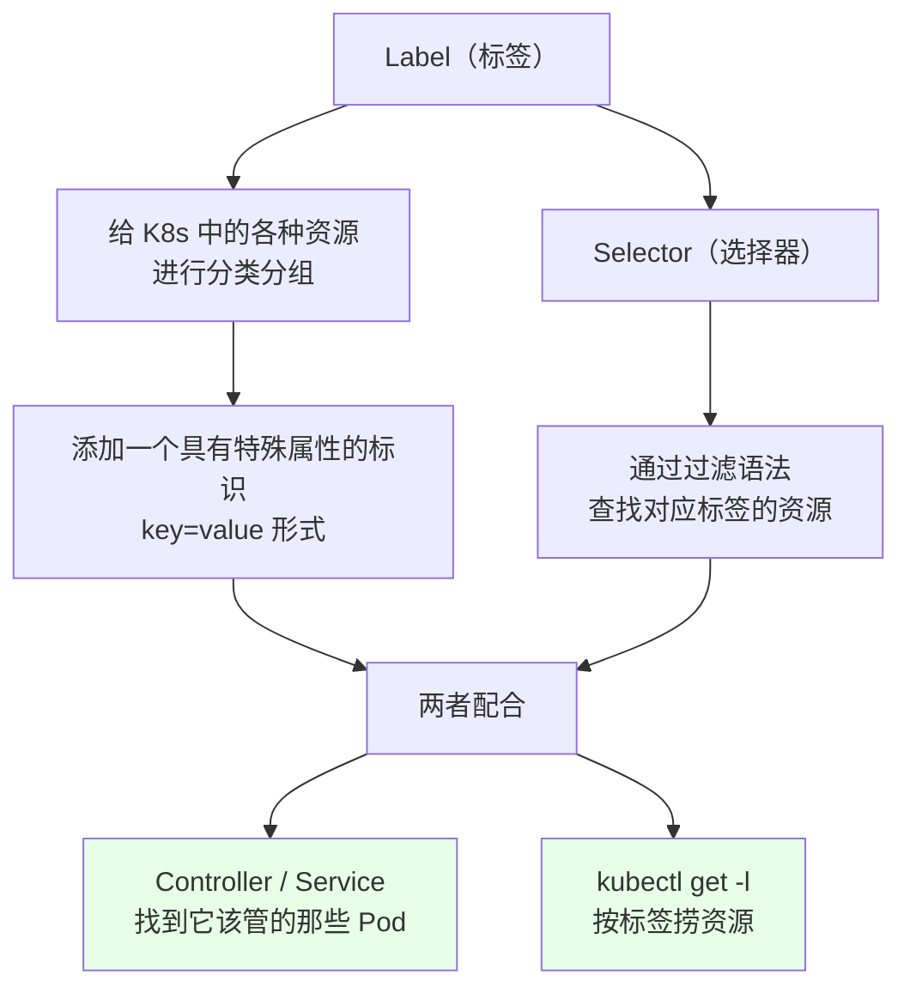
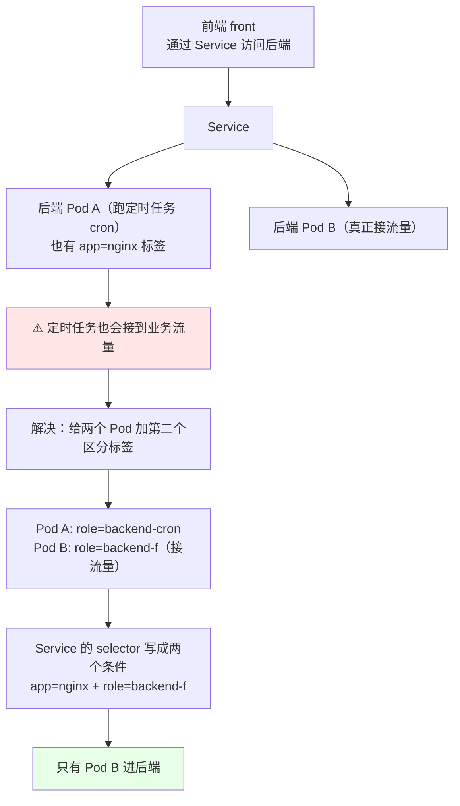
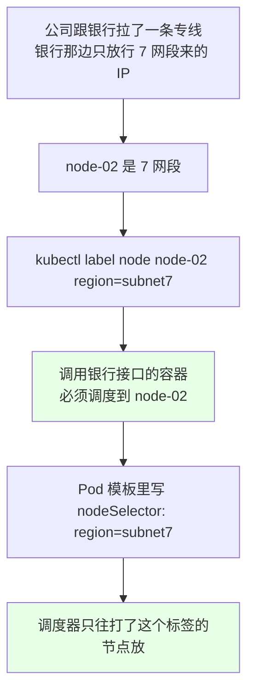
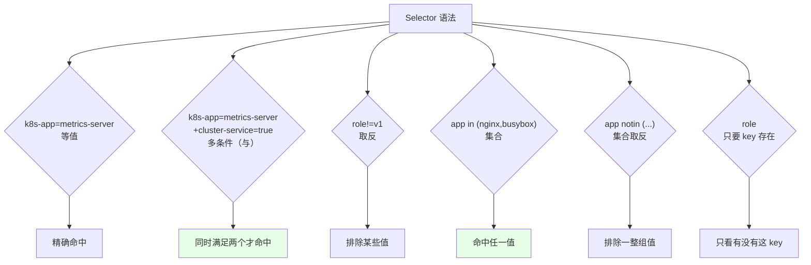
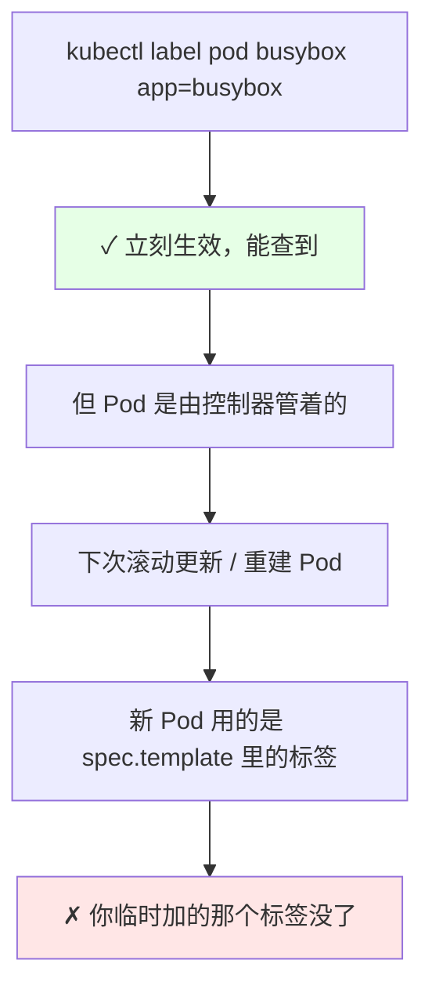

# Kubernetes 集群部署: Label 与 Selector（资源分组、按标签调度与选择器查询语法）

Label 和 Selector 是 K8s 里最基础、也最容易被讲成一句废话的概念。但它撑起了后面几乎所有东西 —— **Service 靠 selector 找到后端 Pod、DaemonSet 靠节点标签决定铺在哪、HPA 靠标签筛副本**。

结论：**Label（标签）是给资源贴的「分类属性」，Selector（选择器）是带过滤语法的查询条件**。两者配合能解决三类真实问题：**同一应用里「只给接流量的那批 Pod 配 Service」**、**把调用外部专线的容器调指定网段**、`kubectl get -l` 按标签捞资源。

## 纲要

- Label 和 Selector 的官方定义
- 为什么需要标签：一个「只接流量不跑定时任务」的例子
- 多条件选择器怎么叠加
- 用标签控制调度：专线网段场景
- 给任意资源打标
- 打标 / 改标 / 删标 的做法
- Selector 查询语法全解
- 注意：临时打标会被滚动更新冲掉
- 常见排错

## Label 和 Selector 的官方定义



| | Label | Selector |
| --- | --- | --- |
| 是什么 | 资源上的一组 **键值对**（`key: value`） | 一条**过滤条件** |
| 写在哪 | 创建时写在 metadata 里；事后可 `kubectl label` 补 | `spec.selector` / 命令行 `-l` |
| 作用 | 分类、分组、加属性 | 按条件把资源筛出来 |
| 能贴给谁 | **任何资源**：Pod、Node、Service、Deployment…… | — |

**标签可以打在 K8s 的任意资源上**，不限于 Pod。

## 为什么需要标签：一个「只接流量不跑定时任务」的例子



这个例子是理解「为什么一个 `app=nginx` 不够用」的经典场景：

- 两个 Pod 都是后端，**都有 `app: nginx` 标签**；
- 一个跑定时任务（`backend-cron`），**不该接业务流量**；
- 如果 Service 只写 `app=nginx`，两个都匹配上 —— 定时任务被流量打爆；
- 办法：**再给它们加一个有区分度的标签**，Service 的 selector 里再加一条过滤条件。

```yaml
# 两个后端 Pod 的标签不同，靠 role 区分
apiVersion: v1
kind: Pod
metadata:
  name: backend-cron
  labels:
    app: nginx
    role: backend-cron        # 跑计划任务，不接流量
spec:
  containers:
  - name: nginx
    image: nginx:1.15.2
---
apiVersion: v1
kind: Pod
metadata:
  name: backend-f
  labels:
    app: nginx
    role: backend-f           # 真正接流量
spec:
  containers:
  - name: nginx
    image: nginx:1.15.2
```

```yaml
# Service 用两个条件精准选中「接流量的那批」
apiVersion: v1
kind: Service
metadata:
  name: backend
spec:
  selector:
    app: nginx              # 条件一
    role: backend-f         # 条件二：把 cron 那个排除掉
  ports:
  - port: 80
    targetPort: 80
```

**多条件 = 逻辑「与」**：两个条件都满足的 Pod 才会被选中。

## 用标签控制调度：专线网段场景

标签除了「给人看」，更实用的是**控制 Pod 落在哪台机器**。



```bash
# 1. 给节点打标
kubectl label node k8s-node-02 region=subnet7
kubectl label node k8s-node-03 region=subnet7

# 2. 验证：按标签把节点捞出来
kubectl get nodes -l region=subnet7
kubectl get node --show-labels | grep region

# 3. 只要两个条件同时满足的（多节点同网段）
kubectl get nodes -l region=subnet7,zone=a
```

```yaml
# 4. 让 Pod 只落在这批节点上
apiVersion: v1
kind: Pod
metadata:
  name: bank-client
  labels:
    app: bank-client
spec:
  nodeSelector:
    region: subnet7        # ← 与 containers 同级
  containers:
  - name: bank-client
    image: bank-client:1.0
```

> 这就是 DaemonSet 那节演示过的 `nodeSelector` 的来处 —— **标签是调度器能「认识」的唯一语言**。

## Selector 查询语法全解

```bash
# 1. 等值匹配（单条件）
kubectl get pod -l app=nginx
kubectl get pod -l app=busybox

# 2. 多条件「与」（空格隔开，或逗号 —— 注意逗号在 shell 里要转义）
kubectl get pod -A -l k8s-app=kube-dashboard,kubernetes.io/cluster-service=true
kubectl get pods -A -l 'k8s-app=metrics-server,kubernetes.io/cluster-service=true'
# 也可以写成链式两个 -l（等价）
kubectl get pods -A -l k8s-app=metrics-server -l kubernetes.io/cluster-service=true

# 3. 取反（不等于该值）
kubectl get pod -l role!=v1
# 注意：带 != 时再加一个等值条件，-shell 里要用引号包住
kubectl get pod -l 'role!=v1,app=nginx'

# 4. 多值（属于集合：in）
kubectl get pod -l 'app in (nginx,busybox)'

# 5. 不属于（notin）
kubectl get pod -l 'app notin (nginx,busybox)'

# 6. 存在某个 key 即可
kubectl get pod -l role
```

```text
查询结果对照（集群里有 nginx / busybox / metrics-server 三类 Pod）:

Pod 标签分布:
├── nginx-1        app=nginx,   role=v1
├── nginx-2        app=nginx,   role=v1
├── busybox-1      app=busybox, role=linux
├── busybox-2      app=busybox, role=linux
└── coredns        app=coredns

命令:                                       匹配结果
kubectl get pod -l app=nginx          →     nginx-1, nginx-2
kubectl get pod -l 'role!=v1'         →     busybox-1, busybox-2
kubectl get pod -l 'role!=v1,app=nginx' →   （空，全部 role=v1）
kubectl get pod -l 'app in (nginx,busybox)' → nginx-1, nginx-2, busybox-1, busybox-2
kubectl get pod -l role               →     所有带 role 标签的（不含 coredns）
```



**语法总结就这些，不复杂**：等值 `=`、取反 `!=`、集合 `in` / `notin`、key 存在 `key`；多个条件之间是与关系。

> shell 小坑：**带 `!=` 或逗号/括号的 `-l` 参数要用单引号包住**，否则 shell 会把 `!`（历史展开）和 `(`（子 shell）吃掉，报 `syntax error`。

## 给任意资源打标 / 改标 / 删标

```bash
# 1. 给 Pod 打标
kubectl label pod busybox app=busybox
kubectl get pod --show-labels

# 2. 同样能加在 node / service / deployment 上 —— label 是通用机制
kubectl label node k8s-node-01 env=prod
kubectl label svc my-svc tier=backend
kubectl label deployment nginx app=nginx

# 3. 看所有资源的标签
kubectl get pod --show-labels
kubectl get pod -A --show-labels
kubectl get svc --show-labels
kubectl get node --show-labels

# 4. 改标签：加 --overwrite（不加会报「already exists」）
kubectl label pod busybox env=busybox2 --overwrite

# 5. 删标签：键名后面加减号
kubectl label pod busybox env-
kubectl get pod --show-labels

# 6. 一次打多个 / 一次删多个
kubectl label pod busybox app=busybox env=test --overwrite
kubectl label pod busybox app- env-
```

```text
打标 / 改标 / 删标的传参对照:

kubectl label pod busybox app=busybox          → 加（成功）
kubectl label pod busybox app=busybox          → 再跑一次: Error "app" already exists
kubectl label pod busybox app=busybox2 --overwrite → 改（成功，值变了）
kubectl label pod busybox app-                 → 删（标签消失）
```

**规则就一句：`=` 加、`--overwrite` 改、`-` 删，`--overwrite` 字段必须带在命令里。**

## 注意：临时打标会被滚动更新冲掉



原文特意提醒过：**临时加的标签，下次滚动更新时会被替换掉** —— 因为控制器重建 Pod 时只会照 `spec.template.metadata.labels` 来，你 `kubectl label` 加的是「运行时补丁」。

正确做法：

| 场景 | 做法 |
| --- | --- |
| 标签要长期有效 | **改控制器清单里的 `spec.template.metadata.labels`**，再 apply |
| 改已有控制器的标签（不能直接改） | ① 把旧清单复制一份改名 → ② 在新清单里加上标签 → ③ 先部署新的 → ④ 把 Service 的 selector 指向新的 → ⑤ 再把旧的删掉 |
| 只想临时验证 | `kubectl label` 随便用，知道它会消失就行 |
| Node 标签 | **不受影响**（节点不是控制器管的），随便打随便摘 |

## 常见排错

| 现象 | 原因 | 处理 |
| --- | --- | --- |
| 想改标签报 `already exists` | 没加 `--overwrite` | 加 `--overwrite` 再跑 |
| 加了标签但 `kubectl get -l` 查不到 | key / value 大小写或拼写不对 | `--show-labels` 看实际值 |
| `-l 'a!=b,c=d'` 报 shell 语法错 | 没用单引号包住 | 用 `'...'` 包住整段 |
| 逗号写法不生效 | shell 把逗号吃掉了 | 用空格分隔多个条件，或引号包住 |
| Service 选中了不该选的 Pod | selector 条件太少 | 补一个区分标签（如 `role=`） |
| `nodeSelector` 起了但 Pod 一直 Pending | 没有节点带这个标签 | `kubectl label node` 补标签 |
| 给 Pod 临时打的标签被冲掉了 | 滚动更新重建 Pod | 改清单里的 `spec.template.metadata.labels` |
| DaemonSet / Deployment 标签混乱 | 多个控制器 selector 重叠 | `kubectl get deploy -A --show-labels` 核对 |
| `--show-labels` 输出太长 | 标签太多 | `kubectl get pod -L app,role`（只显示指定列） |

## API 速览

| 能力 | 做法 | 关键点 |
| --- | --- | --- |
| 打标签 | `kubectl label <资源> <名称> <key>=<value>` | 任何资源都支持 |
| 改标签 | `kubectl label <资源> <名称> <key>=<新值> --overwrite` | **不加会报 already exists** |
| 删标签 | `kubectl label <资源> <名称> <key>-` | 减号即删除 |
| 一次多改 | `kubectl label pod $P a=1 b=2 --overwrite` | 逗号或空格都会被引号吃掉时用引号 |
| 看标签 | `kubectl get <资源> --show-labels` | 全量显示 |
| 只看某几列 | `kubectl get pod -L app,role` | 精简输出 |
| 按标签查 | `kubectl get pod -l <key>=<value>` | 等值 |
| 多条件 | `kubectl get pod -l 'k1=v1,k2=v2'` | 与关系 |
| 取反 | `kubectl get pod -l 'k!=v'` | 记得单引号 |
| 集合 | `kubectl get pod -l 'k in (a,b)'` | 括号也要引号 |
| key 存在 | `kubectl get pod -l <key>` | 只看有没有这 key |
| 按标签调节点 | `spec.nodeSelector` | 配合 `kubectl label node` |
| 看节点标签 | `kubectl get node --show-labels` | 挑节点靠这个 |

## Demo 示例

```bash
# 1. 先看一批 Pod 现在都有什么标签
kubectl get pod -A --show-labels
kubectl get pod --show-labels

# 2. 给 busybox 打标
kubectl label pod busybox app=busybox
kubectl get pod --show-labels

# 3. 按标签过滤
kubectl get pod -A -l app=busybox

# 4. 再起一个 busybox，也打同样的标签，看它进不进过滤结果
kubectl run busybox2 --image=busybox:1.28 -n default
kubectl label pod busybox2 app=busybox
kubectl get pod -A -l app=busybox

# 5. 试试不带 --overwrite 改标签（会报错）
kubectl label pod busybox app=busybox2
# 期望: error: 'app' already has a value 'busybox'

# 6. 带 --overwrite 改
kubectl label pod busybox app=busybox2 --overwrite
kubectl get pod --show-labels

# 7. 删标签
kubectl label pod busybox app-
kubectl get pod --show-labels

# 8. 多条件 / 取反 / 集合语法
kubectl get pod -A -l 'k8s-app=kube-dashboard,kubernetes.io/cluster-service=true'
kubectl get pod -l 'role!=v1'
kubectl get pod -l 'app in (nginx,busybox)'
kubectl get pod -l 'app notin (nginx,busybox)'

# 9. 给节点打标 + 按标签捞节点
kubectl label node k8s-node-02 region=subnet7
kubectl get node -l region=subnet7
kubectl get node --show-labels | grep region

# 10. 看 Service 都在（它们也有标签）
kubectl get svc -A --show-labels
```

```bash
# 11. 派生示例：临时起两个 busybox 并分别打标，再按标签捞
kubectl run b1 --image=busybox:1.28 --restart=Never -- sleep 3600
kubectl run b2 --image=busybox:1.28 --restart=Never -- sleep 3600
kubectl label pod b1 role=frontend
kubectl label pod b2 role=backend
kubectl get pod -l role
kubectl get pod -l 'role!=frontend'
kubectl delete pod b1 b2
```

```yaml
# 12. 帮控制器改标签的正确姿势：改清单里的 template.labels（不是临时 label）
apiVersion: apps/v1
kind: Deployment
metadata:
  name: nginx
spec:
  replicas: 2
  selector:
    matchLabels:
      app: nginx
      role: backend-f          # ← 加在这里，重建后依然在
  template:
    metadata:
      labels:
        app: nginx
        role: backend-f
    spec:
      containers:
      - name: nginx
        image: nginx:1.15.2
```

```text
13. 标签体系在集群里的样子（default + kube-system）:
├── node
│   ├── k8s-master-01   env=prod, node-role...=master
│   ├── k8s-node-01     env=prod
│   └── k8s-node-02     env=prod, region=subnet7   ← DaemonSet 靠它筛
├── pod (kube-system)
│   ├── coredns-xxx     k8s-app=coredns
│   ├── metrics-server-xxx  k8s-app=metrics-server, cluster-service=true
│   └── calico-node-yyy k8s-app=calico-node
├── pod (default)
│   ├── nginx-1         app=nginx, role=v1
│   └── busybox         app=busybox, role=linux
└── svc
    └── backend         selector: app=nginx + role=backend-f
```

### 总结

- **Label 是「给资源分类分组、加特殊属性的键值对」，Selector 是「带过滤语法把对应标签的资源查出来」** —— 标签能打在 **K8s 任意资源**上（Pod / Node / Service / Deployment 都行），不只是 Pod；
- **一个 `app=nginx` 往往不够用**：同一后端里跑定时任务的那个不该接流量，办法是**再加一个有区分度的标签**（`role=backend-cron` / `role=backend-f`），Service 的 selector 写上两个条件 —— **多条件就是逻辑「与」**；
- **标签最实用的第二用途是控制调度**：公司和银行拉了专线、对方只放行 7 网段，那就 `kubectl label node k8s-node-02 region=subnet7`，再在 Pod 模板里写 `nodeSelector: region=subnet7` —— **调度器只往打了这个标签的节点放**（这就是 DaemonSet 那节 `nodeSelector` 的来处）；
- **打标 / 改标 / 删标三件套**：`=` 加、**`--overwrite` 改**（不加会报 `'app' already has a value`）、**`-` 删**（`kubectl label pod busybox app-`）；查询语法就五种：等值 `=`、取反 `!=`、集合 `in` / `notin`、key 存在 —— **带 `!=` 和括号的一定要用单引号包住**，否则 shell 会吃掉；
- **一个真实坑别踩**：`kubectl label` 是运行时补丁，**下次滚动更新重建 Pod 时那个临时标签就没了** —— 要长期有效就去改清单里的 `spec.template.metadata.labels`；改已有控制器的标签还得走「复制清单改名 → 部署新的 → Service selector 切过去 → 删旧的」这套流程；
- **Node 标签相反，随便打随便摘**（节点不受控制器管），所以实验中优先动节点标签去试 `nodeSelector` 是最安全的玩法。

