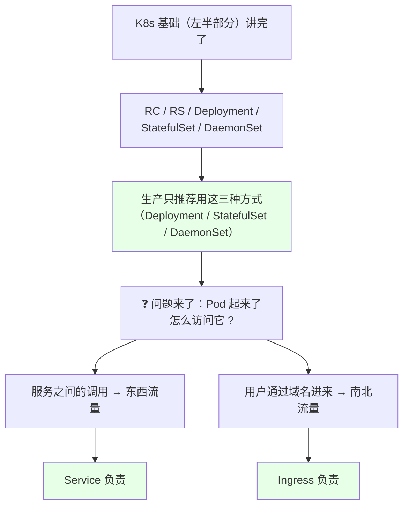
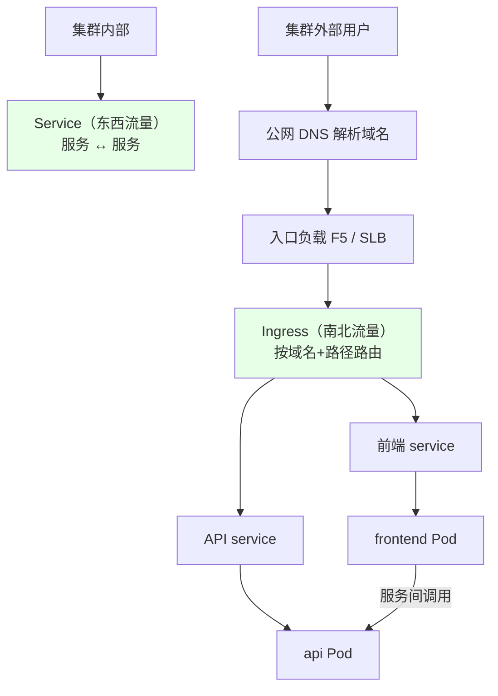
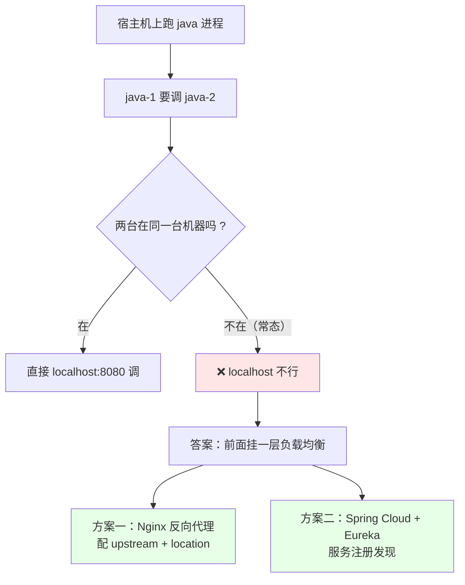
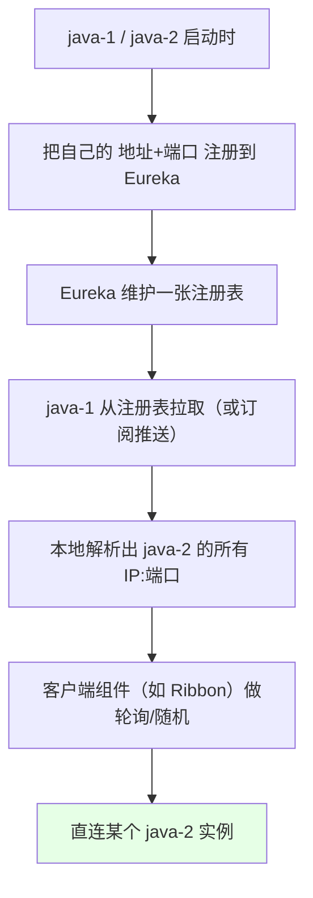
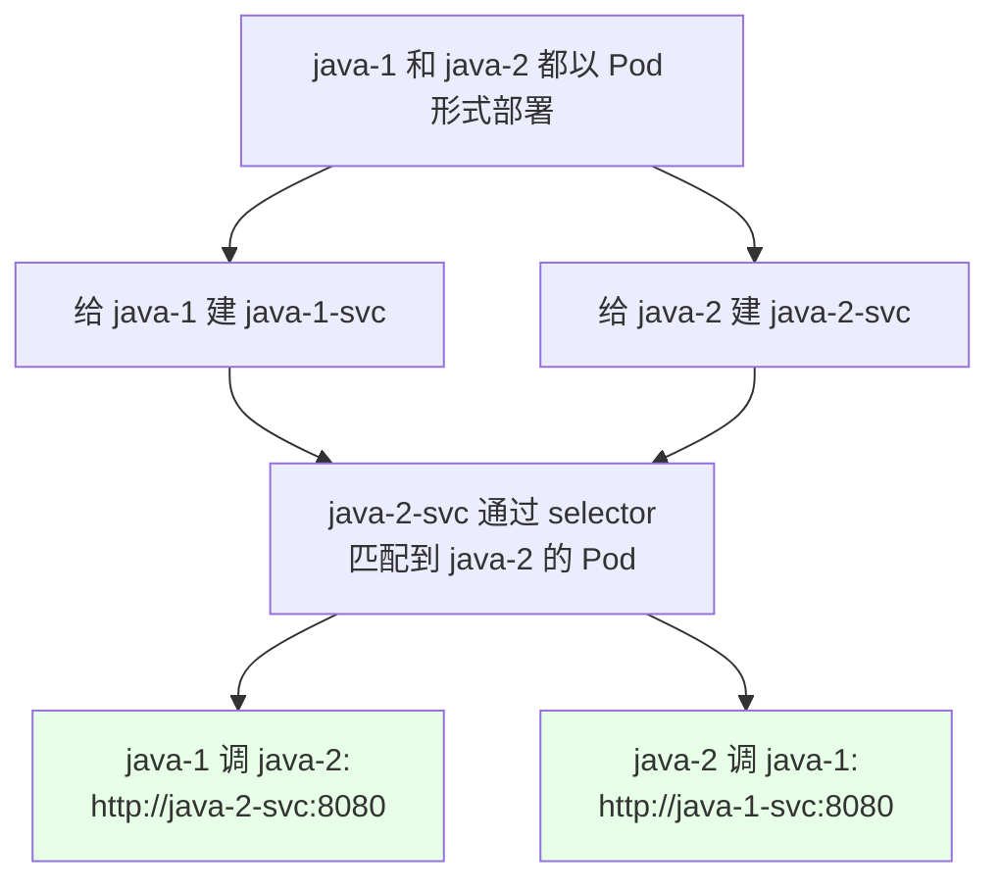
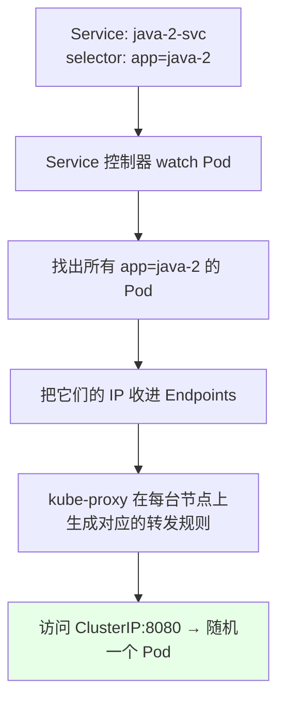
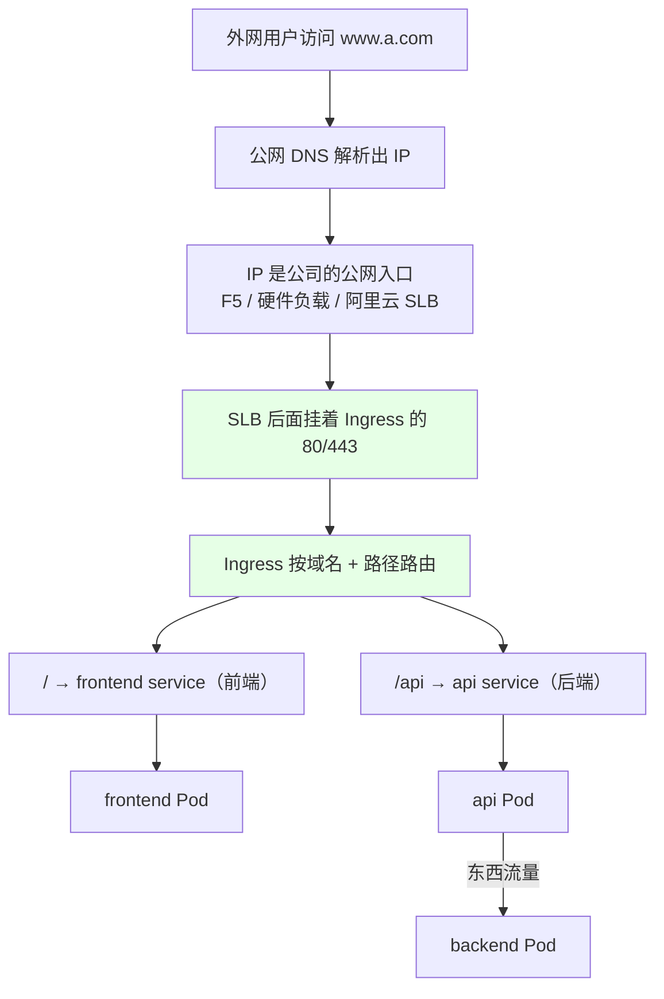

# Kubernetes 集群部署: 在 k8s 上是如何发布服务的（东西流量走 Service，南北流量走 Ingress）

前面把 RC / RS / Deployment / StatefulSet / DaemonSet 都讲完了 —— 但你会用一个疑问：**Pod 起起来了，我怎么访问它？** 这一节就是把这个口子补上，也顺带把 Service 和 Ingress 的分工讲清楚。

结论：**服务访问分两种** —— **东西流量（服务之间互相调用）由 Service 实现**，调用方直接用 `http://java-2-svc:端口` 就行；**南北流量（外网用户通过域名进来）由 Ingress 实现**，它在 ingress 上配域名和路径路由，把流量分发到对应 Service。

## 纲要

- 三种部署方式收尾 + 剩下的那个问题
- 东西流量 vs 南北流量
- 没有 K8s 之前，东西流量怎么做的
- Spring Cloud + Eureka 那套
- K8s 里：给每个服务建一个 Service
- Service 靠 Label 和 Selector 找到后端 Pod
- 南北流量：从传统 Nginx 到 Ingress
- Ingress 也要几台专用机器 + SLB 指进来
- 常见排错

## 三种部署方式收尾 + 剩下的那个问题



**生产上只推荐用 Deployment / StatefulSet / DaemonSet 这三种方式去部署应用，不建议直接用 RC / RS 管理 Pod** —— 它们缺了 Deployment 那套滚动更新、回滚、扩缩容。

## 东西流量 vs 南北流量

| 方向 | 英文 | 谁发起 | K8s 里靠谁 |
| --- | --- | --- | --- |
| **东西流量** | east-west | **服务调服务**（java-a 调 java-b） | **Service** |
| **南北流量** | north-south | **外网用户**通过域名进来 | **Ingress** |



**一句话：一般情况下，Service 实现东西流量，Ingress 实现南北流量。**

## 没有 K8s 之前，东西流量怎么做的



### 方案一：Nginx 配反向代理

传统架构里，java-1 调 java-2 通常这么搞：

```text
传统 Nginx 反向代理配置:
├── nginx 上配一个 upstream（java-2 的 IP:端口 列表）
├── 配一条 location /java2/ → proxy_pass http://java2/
└── java-1 用 http://a.com/java2/ 就能调到 java-2

如果是 java-1:
└── nginx 上再配一条 location /java1/ → proxy_pass http://java1/
```

这就带来了两个负担：**你得维护一张「哪个域名/路径指向哪台机器 IP」的表**，而且上游实例一变（扩缩容、机器坏了）就要改配置 reload。

### 方案二：Spring Cloud + Eureka



这种**不需要 Nginx 反代** —— 客户端自己会负载均衡，所以 Eureka 才这么流行：它顺手给了**负载均衡 + 高可用 + 容错**三件套。

## K8s 里：给每个服务建一个 Service



关键差异（对比传统架构）：

| | 传统 Nginx | K8s Service |
| --- | --- | --- |
| 你写的调用地址 | `http://a.com/java2/`（域名 + 路径 + 上游 IP） | **`http://java-2-svc:8080`**（服务名 + 端口） |
| 上游实例变化 | 改配置 + reload | **Service 自动跟上，代码一行不改** |
| 负载均衡谁做 | Nginx（服务端） | **kube-proxy（服务端，集群内）** |
| 配置表维护 | 人工维护 | **Selector 自动匹配** |

```bash
# 调用方直接这么访问就行
curl http://java-2-svc:8080/api
# 80 端口可以省略
curl http://java-2-svc/api
```

```text
K8s 里的调用链路（东西流量）:
├── java-1 Pod ──► http://java-2-svc:8080
│                      │
│                      ├── Cluster DNS 把 java-2-svc 解析成 ClusterIP
│                      └── kube-proxy 把 ClusterIP:8080 负载均衡到后端 Pod IP
│                                        ├── 10.244.1.5:8080
│                                        ├── 10.244.2.7:8080
│                                        └── 10.244.3.9:8080
```

> 如果集群里还在用 Spring Cloud 且没把 Eureka 换掉，**那套服务注册发现照样能用** —— 只是此时 Service 反而可以不上（这一节之后会单独讲 Spring Cloud 在 K8s 里的落地方式）。

## Service 靠 Label 和 Selector 找到后端 Pod

```yaml
apiVersion: v1
kind: Service
metadata:
  name: java-2-svc
  namespace: default
spec:
  selector:                 # ← 就是上一节讲的 Selector
    app: java-2             # 匹配带这个标签的 Pod
  ports:
  - port: 8080              # Service 自己的端口
    targetPort: 8080        # 容器真正监听的端口
```



**Service 不需要你写 IP、不需要维护配置表** —— selector 一写，后端 Pod 增减自动跟上（这就是上一节 Label 那节讲的「同一应用里加 `role` 标签排除掉定时任务 Pod」的场景）。

## 南北流量：从传统 Nginx 到 Ingress



对比传统做法：

| | 传统 Nginx | K8s Ingress |
| --- | --- | --- |
| 配置方式 | 手写 `nginx.conf`（upstream + server + location） | **写 Ingress 资源**，由 controller 翻译成配置文件 |
| 反代实现 | 自己维护 | **可以是 ingress-nginx、Apache APISIX、Traefik、Envoy** 等 |
| 改路由 | 改 conf + reload | **apply 一个 yaml 就行** |
| 你管不管配置表 | 要管 | **不用 —— 注释 + Ingress 资源自动生成配置** |

```bash
# 看集群里有没有现成的 ingress controller
kubectl get pod -n ingress-nginx
kubectl get svc -n ingress-nginx
```

Ingress 起来之后**会监听 80 和 443 端口**，所以：

1. **建议单独找几台服务器专门跑 ingress**（它们就是「专门发布服务的节点」）；
2. **SLB / F5 把 80、443 指向这些 ingress 机器的 IP 和端口**；
3. **在 Ingress 上配路由转发规则**，南北流量就通了。

```text
南北流量的完整链路:
用户 ──► www.a.com
          │ DNS
          ▼
     公网入口 IP（F5 / SLB）
          │ 80 / 443
   ┌──────┴──────┐
   │ ingress 机器 │  ← 独立几台，跑 ingress-nginx
   └──────┬──────┘
          │ 按 host + path 路由
     ┌────┴────┐
     ▼         ▼
 frontend   api service   ← 这是 Service（东西流量）
     │           │
   Pod Pod    Pod Pod
```

## 常见排错

| 现象 | 原因 | 处理 |
| --- | --- | --- |
| 服务名解析不出来 | Service 名写了大写（如 `Java-2-SVC`） | **Service 名必须小写**（DNS 是小写域名） |
| `curl http://svc:8080` 不通 | 端口不对 / 80 端口才可省略 | 80 可省，其他端口必须带 |
| Service 选不中后端 Pod | `selector` 与 Pod 的 `labels` 不一致 | `kubectl get pod --show-labels` 核对 |
| 建了 Service 但后端是空的 | selector 匹配不到任何 Pod | `kubectl get endpoints <svc>` 看有没有地址 |
| 想从集群外直连 Pod IP 访问 | Pod IP 是内部地址 | 走 Service（ClusterIP）或 Ingress |
| 外网访问不了域名 | 公网入口没配 / SLB 没指到 ingress | 检查 F5/SLB 的 80/443 指向 |
| Ingress 起了但路由不生效 | IngressClass 不对 / controller 没起来 | `kubectl get ingress,ingressclass -A` |
| 用户流量打不到 Pod | Service 的 `targetPort` 写错 | 核对容器实际监听端口 |
| 服务间调用绕了一圈走外网 | 用了 NodePort / LoadBalancer | 东西流量用 ClusterIP 类型的 Service |

## API 速览

| 能力 | 做法 | 关键点 |
| --- | --- | --- |
| 东西流量入口 | `http://<service 名>:<端口>` | 80 端口可省略 |
| 服务名命名 | 全小写（连字符分隔） | **大写会被 DNS 拒** |
| 建 Service | `kubectl expose deploy <名称> --port=80` | 自动建 ClusterIP |
| 看后端地址 | `kubectl get endpoints <service>` | 空 = selector 没匹配上 |
| 看解析 | 集群内 `nslookup <service 名>` | Cluster DNS |
| 服务间调用诊断 | 起个临时 busybox `kubectl run -it --rm` | 在集群内部 curl |
| 南北流量入口 | Ingress controller 的 80 / 443 | 前面接 F5 / SLB |
| 看 ingress controller | `kubectl get pod -n ingress-nginx` | 常见 namespace |
| 看路由规则 | `kubectl get ingress -A` | host / path → service |
| 看 Service 类型 | `kubectl get svc -o wide` | ClusterIP / NodePort / LoadBalancer |

## Demo 示例

```bash
# 1. 先有两个后端应用（这里用 nginx 代替 java-1 / java-2）
kubectl create deployment java-1 --image=nginx:1.15.2
kubectl create deployment java-2 --image=nginx:1.15.2

# 2. 给它们建 Service（东西流量的入口）
kubectl expose deployment java-2 --port=80 --name=java-2-svc
kubectl get svc

# 3. 看 Service 选中的后端地址
kubectl get endpoints java-2-svc
kubectl get svc java-2-svc -o wide

# 4. 在集群内部验证「服务间调用」
kubectl run -it --rm test --image=busybox --restart=Never -- sh
# 容器内:
nslookup java-2-svc
curl http://java-2-svc
curl http://java-2-svc:80
exit

# 5. 缩容 java-2，看 Service 的 endpoints 会不会自动跟上
kubectl scale deployment java-2 --replicas=1
kubectl get endpoints java-2-svc
```

```bash
# 6. 看集群里有没有 Ingress controller（南北流量的入口）
kubectl get pod -A | grep -i ingress
kubectl get svc -A | grep -i ingress
kubectl get ingress -A

# 7. 看 Service 的转发规则（kube-proxy 生成的东西）
kubectl get svc java-2-svc
kubectl describe svc java-2-svc
```

```yaml
# 8. 一个 Service + Ingress 的最小可用组合
apiVersion: v1
kind: Service
metadata:
  name: frontend
  namespace: default
spec:
  selector:
    app: frontend
  ports:
  - port: 80
    targetPort: 80
---
apiVersion: networking.k8s.io/v1
kind: Ingress
metadata:
  name: web
  namespace: default
spec:
  rules:
  - host: www.a.com
    http:
      paths:
      - path: /
        pathType: Prefix
        backend:
          service:
            name: frontend      # ← 南北流量落到哪个 Service
            port:
              number: 80
      - path: /api
        pathType: Prefix
        backend:
          service:
            name: api           # ← 另一个 service，东西流量从这里进
            port:
              number: 8080
```

```text
9. 完整的服务访问全景（东西 + 南北）:

外网用户 ──► www.a.com
              │
         公网 DNS
              ▼
          F5 / SLB (80, 443)
              ▼
     ┌── ingress 机器 ──┐
     │ /      → frontend│ ──► frontend Pod
     │ /api   → api     │ ──► api Pod ──► backend Pod（东西流量）
     └──────────────────┘
                              │
集群内部各服务 ──► http://java-2-svc:8080   （Service，东西流量）
```

### 总结

- **Pod 起来了怎么访问？服务访问分两种**：**东西流量（服务调服务）走 Service**，**南北流量（外网用户通过域名进来）走 Ingress** —— 这是本节最该记住的一条分工；
- **东西流量在 K8s 里就是「给每个服务建一个 Service」**：`java-1` 调 `java-2` 直接写 `http://java-2-svc:8080`（80 端口可省略），**不用域名、不用路径、不用维护 Nginx 那张 upstream 表**；
- **Service 靠 Label + Selector 找到后端 Pod**：你只写 `selector: app=java-2`，后端 Pod 增减它自动跟上，这正好是上一节 Label 那节的用武之地 —— 传统 Nginx 还得改配置 reload；
- **南北流量靠 Ingress**：Ingress 的原理和「反向代理」几乎一样（底层可以是 ingress-nginx、APISIX、Traefik、Envoy 等），**但你不写 `nginx.conf`，只写 Ingress 资源，controller 自动翻译** —— 这是它相对传统 Nginx 最大的减负；
- **落地姿势：建议单独找几台机器专门跑 ingress，让 SLB / F5 把 80、443 指到这些机器的 IP 和端口**，然后在 Ingress 上配域名 + 路径路由（`/` → 前端 service，`/api` → 后端 service）；
- **两个高频坑**：**Service 名必须全小写**（`Java-2-SVC` 这种大写 DNS 直接拒），以及 **selector 匹配不上会导致 Endpoints 为空**（`kubectl get endpoints <svc>` 一眼能看出来）。另外如果集群里还在跑 Spring Cloud + Eureka，那套注册发现照样能用，Service 可以先不用。

