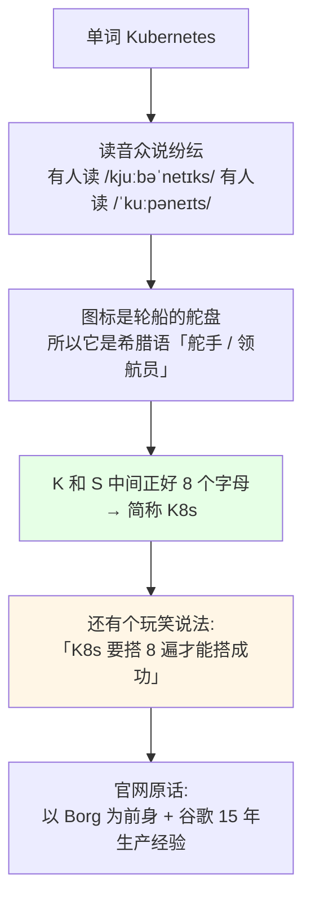
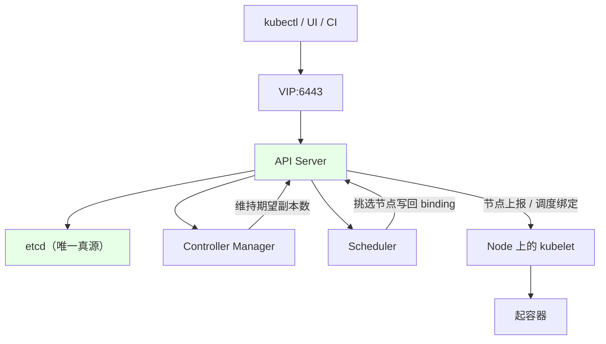
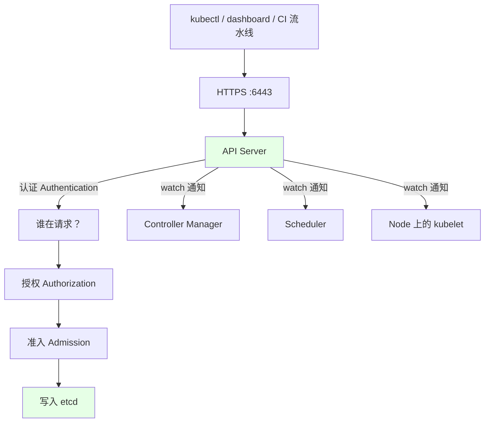
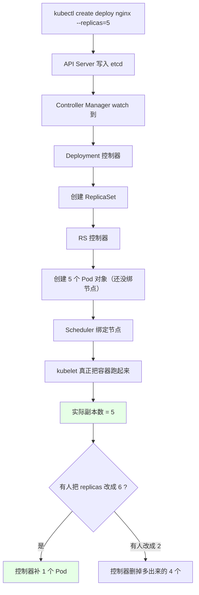
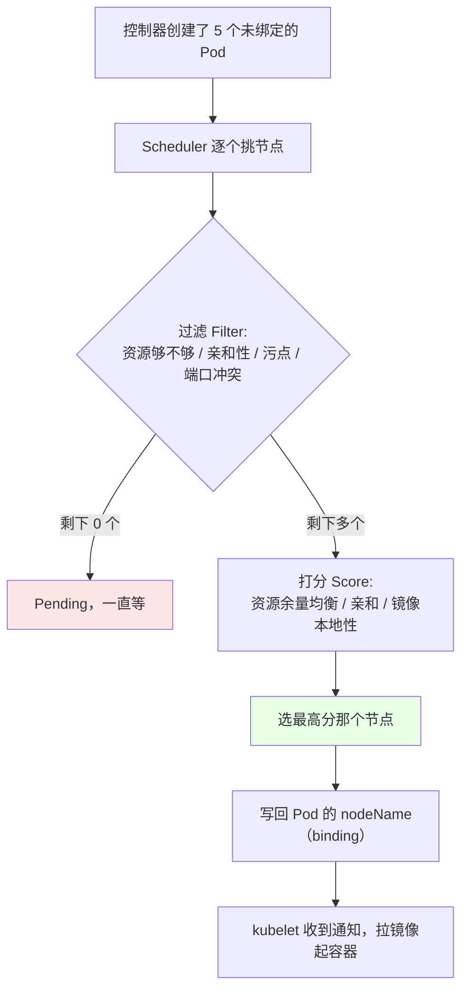
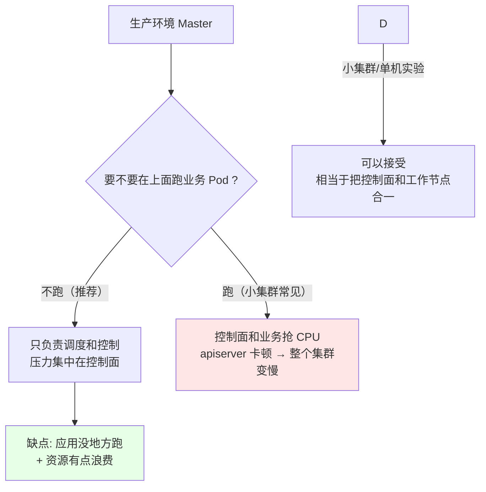

# Kubernetes 集群部署: Master 节点（控制面 API Server / Scheduler / Controller Manager / etcd 的角色划分）

K8s 的架构图永远画成「主从」两块：Master 管控制，Node 管干活。很多人搭建时能装起来，却说不清「我 `kubectl create` 一下，这一串操作到底谁在处理、谁在拍板」。

结论：**Master 是整个集群的控制单元，生产上一般 3 个就够**（承载成百上千个 Node 毫无压力）；它下面真正干活的四个组件是 **API Server（所有操作的唯一入口）、Controller Manager（把资源推向期望值）、Scheduler（挑节点）、etcd（唯一真源）**。生产里 Master **不建议跑业务应用**，还建议把 etcd 独立出来、上 SSD。

## 纲要

- Kubernetes 这名字怎么来的
- 主从架构整体形态
- 三个 Master 就够？Node 随便扩
- API Server：整个集群的大脑
- Controller Manager：把资源推向期望值的那只手
- Scheduler：Pod 到底落在哪台机器
- etcd：唯一的数据库，必须上 SSD
- Master 上跑不跑应用 / 负载均衡怎么搭
- 常见排错

## Kubernetes 这名字怎么来的



官网那句话值得记住：**Kubernetes 是 Google 以 Borg 为基础、基于 15 年生产经验构建的容器编排平台**，目标是「跨主机集群地自动部署、扩展、高可用地运行应用容器」。

这意味着两件事：

| 结论 | 说明 |
| --- | --- |
| **生产用它不会出什么问题** | 这套平台已经过十几年超大规模生产验证，不是玩具 |
| **它的能力开箱即用** | 自动扩缩容、程序级健康检查、滚动更新、自愈 —— 不用自己造轮子 |

## 主从架构整体形态

```text
K8s 集群（主从架构）

┌─────────────── Master 控制面（3 台，不跑业务）───────────────┐
│                                                              │
│   VIP(6443) ── haproxy / keepalived / F5 / 云 SLB            │
│        │                                                     │
│        ├── master-1: apiserver + controller-manager +        │
│        │               scheduler (+ etcd 独立部署)           │
│        ├── master-2: apiserver + controller-manager +        │
│        │               scheduler (+ etcd)                    │
│        └── master-3: apiserver + controller-manager +        │
│                      scheduler (+ etcd)                      │
│                                                              │
└──────────────────────────────────────────────────────────────┘
                            │
        ┌───────────────────┼───────────────────┐
        ▼                   ▼                   ▼
    node-1              node-2             node-3  ...  node-N
  kubelet            kubelet            kubelet         kubelet
  kube-proxy         kube-proxy         kube-proxy      kube-proxy
  docker/containerd  docker/containerd  docker/...      ...
  Calico             Calico             Calico          Calico
    └─ 业务 Pod        └─ 业务 Pod        └─ 业务 Pod     └─ 业务 Pod
```



## 三个 Master 就够？Node 随便扩

| 维度 | 规模建议 | 说明 |
| --- | --- | --- |
| **Master 数量** | **3 个足够**（生产常见 3） | 控制面是无状态的（除 etcd），多一个只是多一份 quorum |
| **承载的 Node** | 3 个高配 Master 扛成百上千 Node | **瓶颈永远在 Master / etcd，不在 Node** |
| **Node 数量** | 可以横向无限扩 | 加机器就行，只要 Master 扛得住 |
| 大规模时的特殊要求 | **etcd 必须与 Master 分开部署** | 下面 etcd 那节展开 |

所以扩容思路很清楚：**Node 随便加，Master 能扛即可**；真到 etcd 成为瓶颈，就拆 etcd 到独立机器。

## API Server：整个集群的大脑

**API Server（kube-apiserver）是整个集群的控制中枢** —— 所有模块之间的信息交互都得走它。



它的三重身份：

| 身份 | 说明 |
| --- | --- |
| **资源操作的唯一入口** | 你 `kubectl create/get/edit/delete` 的请求全部打到它；`kubectl` 只是客户端 |
| **集群安全机制的入口** | 认证（谁）、授权（能干什么）、准入（资源合不合规）都由它把关 |
| **各组件通信的中枢** | 组件之间**不直连**，全靠 API Server 做中转 + etcd 做状态存储 |

这就是为什么 Master 只有一个 apiserver 端口（默认 **6443**）要对外暴露 —— 想连集群，只要能通这个端口 + 拿到 kubeconfig 就行。

> 小知识：早期二进制部署常配一个 `kube 的调度/管理类工具（ kubeconfig 文件 ）`，它里面指向的就是 apiserver 的 VIP:6443；`kubectl config view` 能看到当前指向哪台。

## Controller Manager：把资源推向期望值的那只手

**kube-controller-manager 是集群的状态管理器** —— 它的唯一职责：**让各类资源的实际状态不断逼近你写的期望值**。



举个最直观的：**你部署了 5 个副本的 nginx，事后改成 6，是谁去补那 1 个？改成 2，是谁去删掉 4 个？都是 controller-manager 里的控制器干的。**

| 控制器（举例） | 管什么 |
| --- | --- |
| deployment / replicaset / statefulset / daemonset 控制器 | 各类工作负载的副本维持 |
| node 控制器 | Node 失联时标记 NotReady、驱逐 Pod |
| endpoint / endpointslice 控制器 | 维护 Service 背后的 Pod 地址列表 |
| service 控制器 | LoadBalancer 类型的 Service 申请云厂商负载均衡 |
| volume 控制器 | 挂载 / 卸载存储卷 |

## Scheduler：Pod 到底落在哪台机器

**kube-scheduler 是集群的调度中心** —— 你的 Pod 会落到哪台 Node，是它算出来的，不是你说了算。



关键点：

- **你不知道副本会落到哪台机器** —— 不写限制就是它按算法挑，本次在 node-1、更新时可能跑到 node-2；
- **Pod 的 IP 每次重建都会变**（这是后面 Service 章节要解决的痛点）；
- **传统架构是「先定机器再装进程」，K8s 反过来了**：你只声明「要 5 个 nginx」，机器由调度器分配。

## etcd：唯一的数据库，必须上 SSD

**etcd 是 K8s 的数据库**，你做的所有操作（创建、修改、删除）最终都落在这里。它和 Zookeeper 是同类的一致性键值存储。

| 建议 | 值 | 为什么 |
| --- | --- | --- |
| **必须 SSD** | **硬性要求，没有商量余地** | 磁盘性能不够，集群会越用越慢、kube-apiserver 延迟飙升 |
| **部署几台** | **3 台以上，且必须是奇数** | 奇数个才不会脑裂（quorum = 半数以上） |
| 推荐节点数 | 3 / 5 / 7 / 9 | Redis 集群、RabbitMQ 集群同理都是奇数 |
| **大规模时** | **etcd 与 Master 分开部署** | 别和 apiserver 抢磁盘 IO |
| 一致性算法 | Raft | 所以一致性比 ZooKeeper 强、性能也更强，K8s 才选它 |

```bash
# 看 etcd 里存了什么（key 前缀是 registry 命名空间）
kubectl get pods --all-namespaces -o jsonpath='{range .items[*]}{.metadata.namespace}{"\n"}{end}' | sort -u

# 直接查 etcd 的健康与成员（装在 etcd 那台机器上）
etcctl endpoint health
etcctl member list
```

> 注意：`etcdctl` 在 3.4 之前直接 `ETCDCTL_API=3 etcdctl ...`，有些老版本必须设 `ETCDCTL_API=3`，否则会走 v2 接口报 key 不存在。

## Master 上跑不跑应用 / 负载均衡怎么搭



**生产建议：Master 上不要部署任何业务应用** —— 它会平白增加控制面的压力，而且一旦业务把 CPU 吃满，apiserver 响应变慢，你会连「登不上集群看状态」都做不到。小集群/实验环境图省事跑一起可以，心里有数就行。

至于 **负载均衡（VIP）**，按环境选型：

| 环境 | 方案 | 备注 |
| --- | --- | --- |
| 自建机房 / 演示环境 | **keepalived + haproxy** 虚拟 VIP，绑到 Master 网卡 | 本章搭建章节用的就是这个 |
| 公司有硬件 | **F5** 这类硬件负载均衡 | 直接把 apiserver 节点挂上去，不用配 keepalived |
| 阿里云 | 云 **SLB** | **坑：SLB 后端可能不能反向访问回来**（需跟云厂商确认 / 特殊方案） |
| 腾讯云 | 云 **ELB** | 同上留意回源问题 |
| 单 Master 没高可用 | keepalived/haproxy 全都不需要 | 直接把 VIP:6443 换成 master-1 的 IP:6443 即可 |

> **apiserver 默认端口是 6443**。整个集群对外只需要暴露这一个端口（+ Node 上的 kubelet 10250 / 10256 等）。

## 常见排错

| 现象 | 原因 | 处理 |
| --- | --- | --- |
| `kubectl` 连不上集群 | kubeconfig 里的 server 指向的 IP/端口不通 | 确认是 **VIP:6443** 还是 master-1 的 IP，再 `curl -k https://<ip>:6443/healthz` |
| 卡了半天报超时 | **Master 与 Node 时钟不同步** / 网络不通 | 先检查时间同步（chrony/ntp） |
| `curl https://<apiserver>:6443` 返回 401 | 认证没过（用证书直连时） | 用 `kubectl` 或带 kubeconfig 的客户端 |
| apiserver 响应越来越慢 | **etcd 磁盘性能不足**（没上 SSD 或 etcd 与 Master 混部） | etcd 独立部署 + SSD，定期 `etcdctl defrag` |
| Pod 一直 `Pending` | Scheduler 没挑出节点（资源不足 / 污点 / 亲和性不符） | `kubectl describe pod` 看 Events，`kubectl describe node` 看 taints |
| 集群中创建 Pod 极慢 | 控制面压力大（Master 跑业务 / etcd IO 差） | 迁移业务 Pod，检查 etcd 延迟 |
| 5 副本只起了 3 个 | 控制器在等，或节点不够 | `kubectl get deploy -o wide` + `kubectl scale` 前先看 `describe` |
| etcd 选主脑裂 | 部署了偶数个节点 | 改成 3/5/7 奇数个 |
| Node 变 NotReady 后 Pod 不挪走 | node 控制器等待默认驱逐超时 | 看 `kubectl get node` 的 `Taint: node.kubernetes.io/unreachable` 与 tolerationSeconds |

## API 速览

| 能力 | 做法 | 关键点 |
| --- | --- | --- |
| 连集群 | kubeconfig 指向 `https://<VIP>:6443` | 默认端口 6443 |
| 健康检查 | `curl -k https://<apiserver>:6443/healthz` | 通了才算网络 OK |
| 看当前指向 | `kubectl config view` | 看 server 段 |
| 看控制面组件 | `kubectl get pods -n kube-system` | 组件以 Pod 形式跑（kubeadm 装） |
| 看节点状态 | `kubectl get node -o wide` | STATUS / ROLES / VERSION |
| 看 etcd 健康 | `etcdctl endpoint health`（需 `ETCDCTL_API=3`） | 在 etcd 所在机器上跑 |
| 看 etcd 成员 | `etcdctl member list` | 应为奇数个 |
| 看调度器怎么选的 | `kubectl describe pod <pod>` 的 Events | 有 `Successfully assigned ...` |
| 看 Pod 落在哪 | `kubectl get pod -o wide` 的 NODE 列 | 调度结果只有这里看得到 |
| 驱逐压力 | `kubectl describe node <node> \| grep -i taint` | Master 默认带 NoSchedule 污点 |

## Demo 示例

```bash
# 1. 看当前集群有几个节点、各是什么角色
kubectl get node -o wide

# 2. 看 Master 是不是被打了污点，所以业务 Pod 不会排上去
kubectl describe node master-1 | grep -i -A 3 taints
# 期望: node-role.kubernetes.io/master:NoSchedule（或 control-plane）

# 3. 验证 apiserver 可达
curl -k https://127.0.0.1:6443/healthz
# 期望: ok

# 4. 控制面组件（kubeadm 装的是 Pod 形态）
kubectl get pods -n kube-system
# 期望看到 kube-apiserver / kube-controller-manager / kube-scheduler / etcd

# 5. 想看具体是谁在维持副本 —— 手动把副本改大，观察补齐
kubectl create deployment nginx --image=nginx:1.15.2 --replicas=2
kubectl scale deployment nginx --replicas=5
kubectl get deploy nginx
kubectl get pod

# 6. 看 Pod 是被调度到哪台机器（而不是猜）
kubectl get pod -o wide
kubectl describe pod nginx-xxxxx | grep -A 5 Events

# 7. 断掉一台 node，看它会不会被标记 NotReady
kubectl cordon node-2
kubectl get node
kubectl uncordon node-2

# 8. 看 etcd 的成员与健康（在 etcd 节点上）
export ETCDCTL_API=3
etcdctl member list
etcdctl endpoint health
```

```yaml
# 9. 一个典型的 3 Master 高可用控制面（kubeadm 视角的清单结构）
apiVersion: kubeadm.k8s.io/v1beta2
kind: ClusterConfiguration
kubernetesVersion: v1.18.0
apiServer:
  certSANs:
  - master-1
  - master-2
  - master-3
  - 192.168.1.11
  - 192.168.1.12
  - 192.168.1.13
  - vip.example.com
controlPlaneEndpoint: vip.example.com:6443     # ← VIP，keepalived/haproxy 挂着
---
apiVersion: kubeadm.k8s.io/v1beta2
kind: InitConfiguration
localAPIEndpoint:
  advertiseAddress: 192.168.1.11
  bindPort: 6443
```

```text
10. 控制面在集群里的位置（3 台 Master + N 台 Node）:
├── master-1  kube-apiserver / kube-controller-manager / kube-scheduler
├── master-2  kube-apiserver / kube-controller-manager / kube-scheduler
├── master-3  kube-apiserver / kube-controller-manager / kube-scheduler
├── etcd-a    ← 生产建议独立部署，SSD
├── etcd-b
├── etcd-c
└── node-1..node-N   kubelet / kube-proxy / containerd / CNI / 业务 Pod
```

### 总结

- **K8s 是主从架构**：Master 管控制、Node 管干活；**生产上 3 个 Master 就足够**，三个高配 Master 扛成百上千个 Node 完全没问题，**瓶颈永远在 Master 和 etcd，Node 可以随便横向加**；
- **API Server 是整个集群的大脑和唯一入口** —— 所有操作、所有模块间的信息交互都得经过它，它还兼管认证 / 授权 / 准入三道关卡；`kubectl` 只是客户端，真正干活的是 apiserver（默认 **6443** 端口）；
- **Controller Manager 是把资源推向期望值的那只手** —— 你把副本从 2 改成 6 是它去补、改成 2 是它去删，Node 失联时的驱逐标记也是它打；
- **Scheduler 决定 Pod 落在哪台机器** —— 不写限制就是它按算法挑，所以你**永远不知道副本这次在哪台、下次在哪台**，Pod IP 每次重建也会变（这是后面要用 Service 解决的痛点）；
- **etcd 是唯一的数据库，三条硬性建议记牢**：**必须用 SSD**（没有商量余地）、**部署 3 台以上且必须是奇数**（3/5/7/9，偶数会脑裂）、**大规模时和 Master 分开部署**；
- **生产上不要把业务应用部署到 Master**，控制面抢 CPU 会直接导致你「连集群都登不进去看状态」；单 Master 没做高可用时 keepalived/haproxy 全都不需要，直接把 VIP:6443 换成 master-1 的 IP 就行 —— 有硬件就上 F5，有云就上 SLB/ELB（**阿里云 SLB 要留意后端不能反向访问回来这个坑**）。

