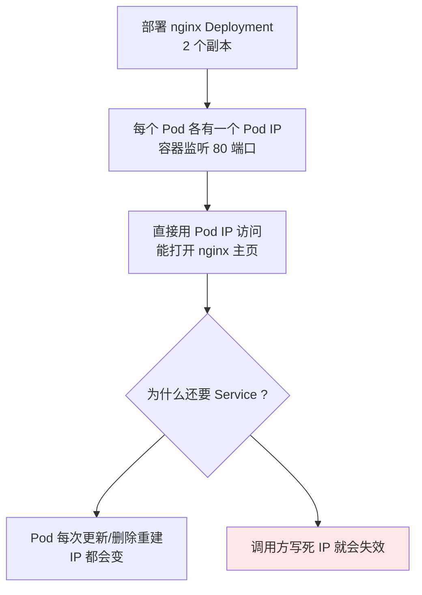
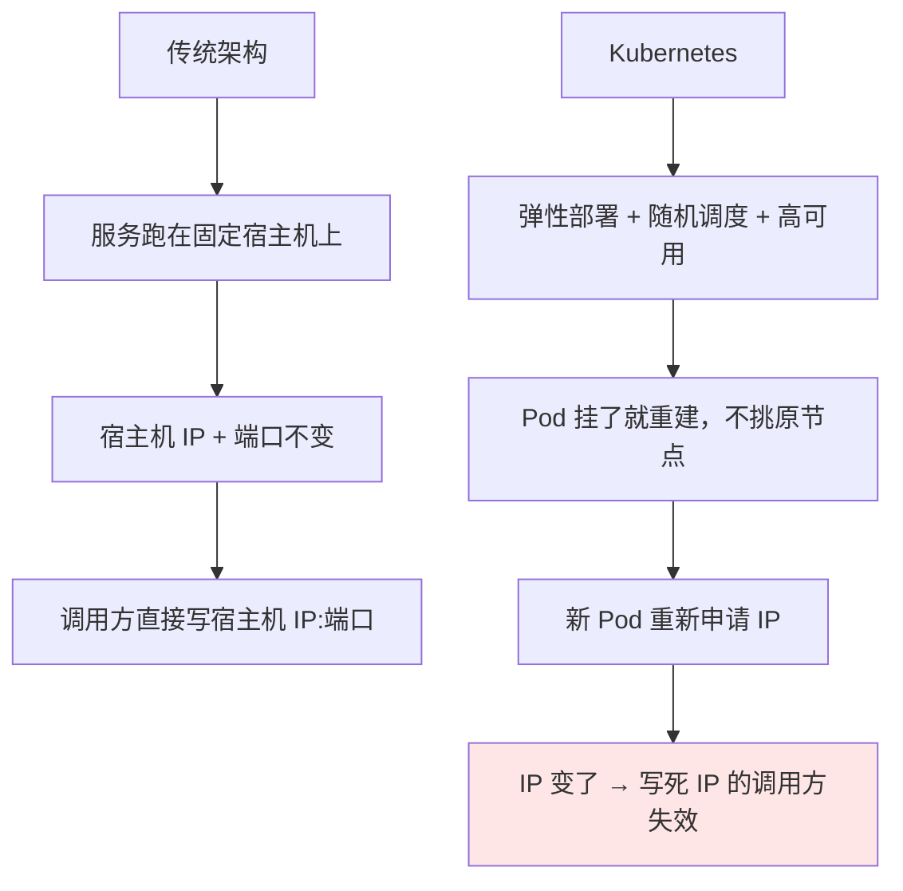
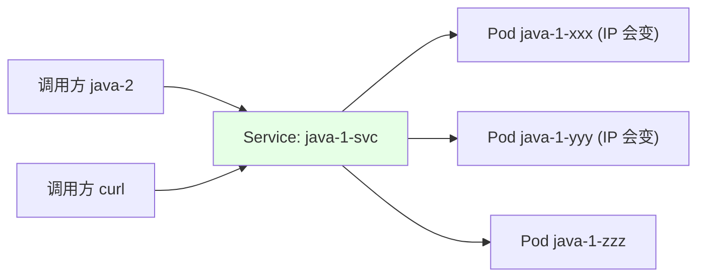
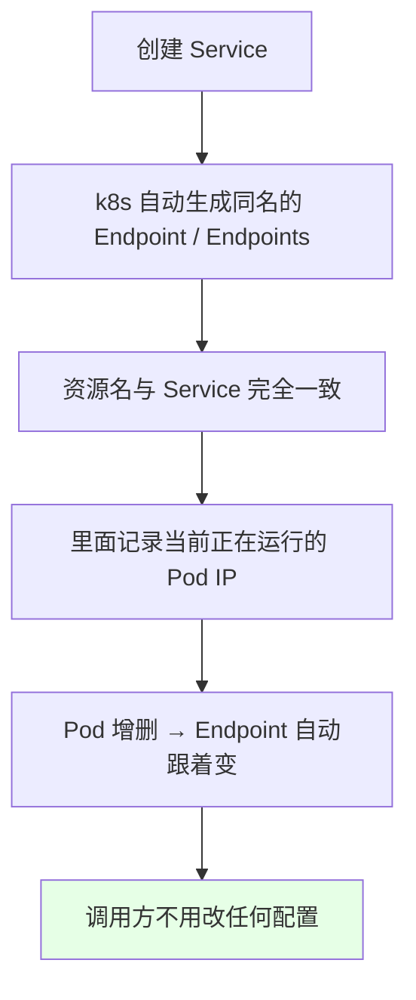

# Kubernetes 集群部署: 什么是 Service（逻辑上的一组 Pod，带稳定名称的反向代理）

上一节把 Node 上跑的那些组件拆完了：kubelet 盯状态、kube-proxy 转发、Calico 组网、CoreDNS 解析、Metrics Server 供数。这一节回到服务调用本身 —— **先讲为什么 Kubernetes 非要引入 Service 这个概念**。

还得从 Pod 说起。我们部署一个 nginx 的 Deployment，起两个 Pod，每个 Pod 都有个 IP，nginx 在 80 端口上监听，直接用 Pod IP 访问是能打开 nginx 主页的。那既然能拿到 IP，干嘛还要 Service？

结论：**Service 就是「逻辑上的一组 Pod」加一套访问策略**。它靠 `selector` 挑出要代理的 Pod，把这些 Pod 聚成一组，对外只暴露一个**固定名称**，谁要访问后端都走这个名称，后端 Pod 怎么删、怎么建、怎么更新，调用方一律不用改。

## 纲要

- 先复现问题：Pod IP 为什么不能直接用
- 弹性调度下 IP 会变，传统架构却没有这个问题
- Service 是什么：逻辑上的一组 Pod + 访问策略
- 它本质是个四层负载均衡 / 反向代理
- 固定名称带来的稳定性
- 创建 Service 时会自动生成的 Endpoint
- 一次性资源清理的好习惯

## 先复现问题：Pod IP 为什么不能直接用



实操建议先养成一个习惯：**做实验临时创建的文件、临时资源，用完就删**。过段时间自己都会忘，留一堆 `test-xxx` Pod 在集群里，排查问题时全是噪音。

## 弹性调度下 IP 会变，传统架构却没有这个问题



**传统架构**：先停旧服务，再起新服务，同一时刻只有一个进程占端口，所以不会冲突，IP 也不动。

**Kubernetes**：Pod 是弹性计算的，调度器用一套算法挑「最优节点」，可能这次落在 `node01`、下次落在 `master03`。就算万一调度回同一个节点（这时候 IP 恰好没变），也会出现**同一个宿主机上两个 Pod 抢同一个 IP** —— 网段重复，直接网络不通。两个节点的网段本来就不一样（一个 `85.203.x.x`、一个 `195.7.x.x`），更不可能复用同一个 IP。

所以结论很硬：**Pod IP 不能写进调用方的配置里**。

| | 传统架构 | Kubernetes |
| --- | --- | --- |
| 服务地址 | 宿主机 IP + 端口，**不变** | Pod IP，**每次重建都会变** |
| 发布方式 | 先停旧的，再起新的 | 滚动更新，新旧并存一段时间 |
| 调度 | 绑死在某台机器上 | 算法挑最优节点，可能跨节点 |
| 地址复用 | 不会（同一时刻只有一个） | 会（同节点两个 Pod 抢 IP）→ 直接不通 |
| 调用方写法 | 写死 IP:端口 | 写 Service 名称 |

## Service 是什么：逻辑上的一组 Pod

```text
Service 的结构:

├── Service              ← 稳定名称（如 kube-dns、java-1-svc）
│   ├── selector         ← 标签选择器, 决定代理哪些 Pod
│   │   └── app=nginx
│   ├── port             ← Service 暴露的端口
│   └── endpoints (EP)   ← 自动生成的端点列表
│       ├── Pod IP 1:port
│       ├── Pod IP 2:port
│       └── Pod IP N:port
```

**Service 可以简单理解为逻辑上的一组 Pod**。它不是「管理」Pod，而是「代理」Pod：用 `selector` 把一组同类型的应用聚拢到一起，对外只暴露一个入口，谁访问这个入口，流量就落到后面任意一个 Pod 上。

> 你也可以把 Service 理解成一个 **LB / 四层负载均衡**，或者一个**反向代理** —— 我们画的架构图几百遍都是同一个样子：Service 后面跟一串同类型的应用副本。

**Service 相对于 Pod 最大的优势就一个字：稳。**
- 临时 label 会被滚动更新冲掉，但 Service 的**名称一旦创建就不会变**（只要不去改它的 yaml）。
- Pod 删了重建 IP 就变，**Service 名称不变**。
- 后端 Pod 怎么删、怎么建、怎么更新，调用方都走同一个名字：
  - 比如 `java-2` 调 `java-1`，配置里写的就是 Service 名；
  - 后面的 Pod IP 是谁、哪个可用，是 Service 自己维护的事。

所以「用 Service 名称访问」比「用 Pod IP 访问」**可靠得多、稳定得多**。



## 创建 Service 时会自动生成的 Endpoint



**Endpoint（缩写 EP）就是「端点」的意思**。我们创建一个 `kube-dns` 的 Service，系统会顺手创建一个同名 `kube-dns` 的 Endpoint，里面记的就是后面那些 Pod 的 IP —— 用 `kubectl get endpoints` 就能看到，例如 `10.244.1.152`。

Endpoints 是按**端口**分的：一个 Service 如果有 53/TCP 和 53/UDP 两个端口，就会对应两组端点。

### 一个真实实验

```bash
# 1. 先部署 nginx Deployment（2 个副本），注意记录 Pod IP
kubectl create deployment nginx --image=nginx:1.20.1 --replicas=2
kubectl get pod -o wide

# 2. 直接访问 Pod IP 是可以打开 nginx 主页的
curl http://$(kubectl get pod -o wide | grep nginx | awk '{print $7}' | head -1)

# 3. 删掉一个 Pod，会立刻重建
kubectl delete pod nginx-7d5d9c5c8b-abcde
kubectl get pod -o wide

# 4. 对比前后 IP —— 已经变了
#    旧 Pod IP: 85.203.x.x
#    新 Pod IP: 122.152.x.x
#    但业务调用方完全无感，因为它调的是 Service 名
```

## 一次性资源清理

实验做完的临时 Deployment、临时 Service、临时 namespace，随手清掉：

```bash
kubectl delete deployment nginx
kubectl get pod,svc -A
```

## API 速览

| 类型 / 命令 | 说明 |
| --- | --- |
| `kubectl get svc` / `kubectl get service` | 列所有 Service |
| `kubectl get endpoints` / `kubectl get ep` | 列所有 Endpoint（端点列表） |
| `kubectl get pod -o wide` | 看 Pod 落在哪个节点、IP 是多少 |
| `kubectl describe svc <名称>` | 看 selector、port、Endpoints 是否正常 |
| `kubectl create deployment nginx --image=nginx:1.20.1 --replicas=2` | 建一个临时 Deployment 做实验 |
| `kubectl delete pod <名称>` | 删 Pod，触发重建与新 IP |
| `kubectl delete deployment nginx` | 清理临时资源 |

Service 关键字段（本篇只做铺垫，下一节写清单）：

| 字段 | 作用 |
| --- | --- |
| `spec.selector` | 标签选择器，决定代理哪些 Pod |
| `spec.ports` | Service 暴露的端口（port / targetPort / nodePort） |
| `spec.type` | 暴露方式（ClusterIP / NodePort / LoadBalancer） |
| 自动生成 | 同名 `Endpoints` 资源，动态记录后端 Pod IP |

## Demo 示例

```bash
# 1. 看集群里已经存在的 Service（kube-dns 就在里面）
kubectl get svc -A
# kube-system   kube-dns     10.96.0.10   <none>   53/UDP,53/TCP   39d

# 2. 看 kube-dns 的 Endpoint —— 里面就是真正干活的 Pod IP
kubectl get endpoints kube-dns -n kube-system
# NAME         ENDPOINTS                        PORT
# kube-dns     10.244.1.152:53,10.244.2.87:53   53/UDP,53/TCP

# 3. 看 Service 的 selector 配置
kubectl describe svc kube-dns -n kube-system | grep -A2 Selector

# 4. 新建 Service 的部分动作（完整清单下一节给）
#    Service 名一旦确定就不变，调用方写死 Service 名即可
kubectl get svc -A -o wide
```

```text
Service 与 Endpoint 的关系:

┌────────────────────────┐        ┌────────────────────────┐
│  Service: kube-dns     │        │  Endpoints: kube-dns   │
│  selector: k8s-app=kube-dns │──▶ │  10.244.1.152:53 (UDP) │
│  port: 53              │        │  10.244.2.87:53  (TCP) │
└────────────────────────┘        └────────────────────────┘
```

### 总结

- **Pod IP 不能写进调用方配置**：Kubernetes 是弹性部署 + 随机调度，Pod 每次重建都会重新申请 IP，写死必踩坑。
- **Service = 逻辑上的一组 Pod**：靠 `selector` 把同类型应用聚成一组，对外只暴露一个入口。
- **Service 本质是个四层负载均衡 / 反向代理**：访问 Service 就落到后面任意一个可用 Pod 上。
- **Service 名称一旦创建就不变**（不改 yaml 就不会变），比 Pod IP 稳定得多，所以服务间调用一律走 Service 名。
- **创建 Service 会自动生成同名 Endpoint/Endpoints**，里面动态记录当前运行的 Pod IP，Pod 增减时自动同步，调用方完全无感。

