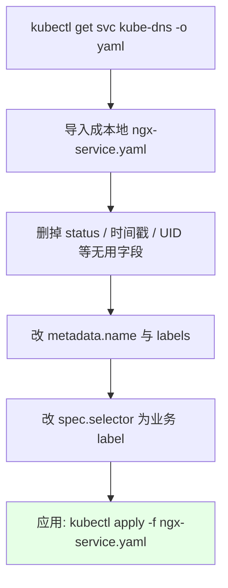
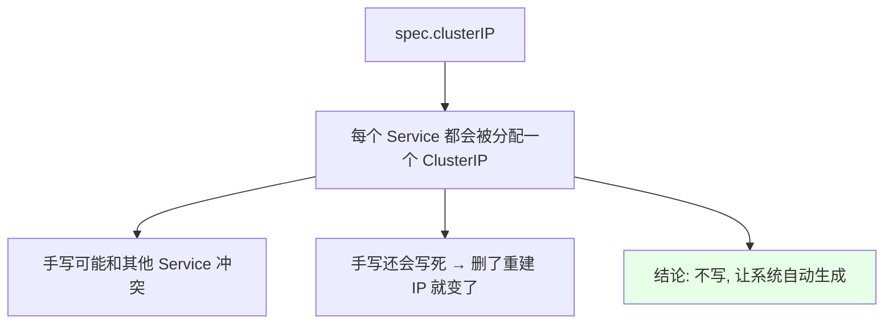
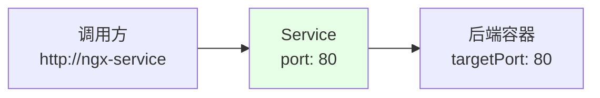
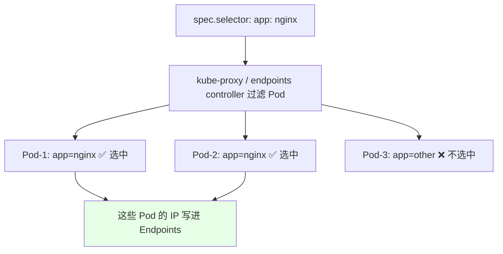
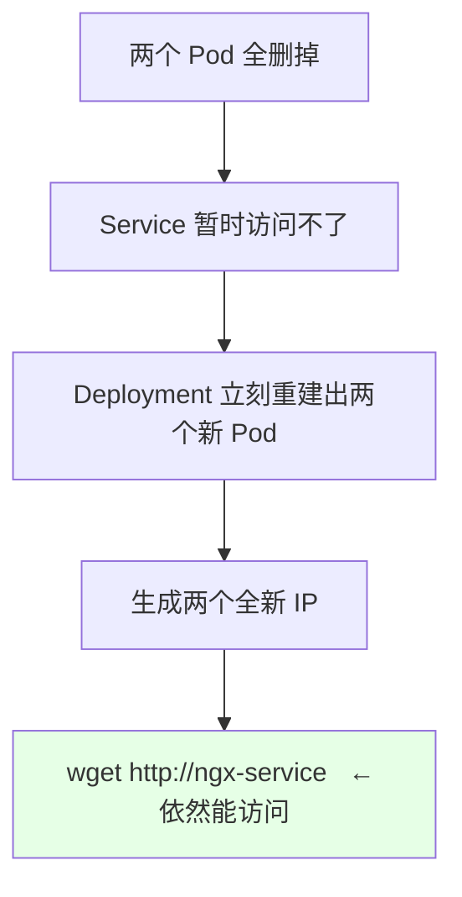

# Kubernetes 集群部署: 定义一个 Service（port / targetPort / selector 与 clusterIP 自动分配）

上一节把「Service 是什么」讲清楚了：逻辑上的一组 Pod，带一个固定名称，外加自动生成的 Endpoint。这一节动手 **写一个 Service 清单**，看每个字段到底在干什么。

最快的办法不是从零敲，而是**把别人正在跑的 Service 导出来改一份** —— 比如把 `kube-dns` 的 Service `kubectl get svc kube-dns -o yaml` 导入到当前目录成 `ngx-service.yaml`，然后把没用的信息删掉。

结论先摆：
1. **`clusterIP` 千万别手写**，让系统自动生成，手写可能冲突，而且 Service 删了重建 IP 就变。
2. **`spec.ports` 有两个端口要分清**：`port` 是 Service 自己的端口，`targetPort` 是后端应用容器的端口，两者可以不一样。
3. **`selector` 千万别抄 `pod-template-hash`** 那类自动加的 label，要写业务 label。

## 纲要

- 从 kube-dns 导一份 Service 出来改造
- metadata：name 与 labels 怎么改
- clusterIP 为什么不能手写
- ports：port 与 targetPort 的区别
- 协议 TCP / UDP / SCTP
- selector：源码里那行自动 label 是坑
- 创建并验证：ClusterIP 能访问
- 同 namespace 与跨 namespace 的访问写法
- 后端 Pod 全删重建，Service 依然可用
- Endpoint 的动态变化实测

## 从 kube-dns 导一份 Service 出来改造



导出来的 yaml 长这样（简化）：

```text
导出后需要改动的地方:

├── metadata
│   ├── name:        kube-dns   →  ngx-service
│   └── labels:      k8s-app=kube-dns  →  app=ngx
├── spec
│   ├── clusterIP:   10.96.x.x      ← 保留也行，但建议删掉自动生成
│   ├── type:        ClusterIP      ← 先不动, 后面讲
│   ├── sessionAffinity: None       ← 先不动, 后面讲
│   └── ports / selector            ← 本节重点
```

我们打开第二个窗口一边改一边看，Service 现在还是给 `kube-dns` 用的，必须改。

## metadata：name 与 labels 怎么改

`metadata` 部分和之前写 Deployment 没区别，主要就两处：

| 字段 | 改前（kube-dns） | 改后（我们自己的） |
| --- | --- | --- |
| `metadata.name` | `kube-dns` | `ngx-service` |
| `metadata.labels` | `k8s-app: kube-dns` | 随便写，比如 `app: ngx-service`，也可以多写几个 |

名称随便起一个就行（比如 `ngx-service`），也可以根据自己的实际情况多写几个 label。

## clusterIP 为什么不能手写



- `clusterIP` 和 Pod IP 一个道理：**每次创建都会生成一个新的**，不要手动配置，配错了还可能和其他 Service 撞。
- 而且**不建议在配置里写 clusterIP**，因为 Service 删掉再重建之后，它就会变。
- 所以我们创建 Service 时**让它自动生成**就行。

## ports：port 与 targetPort 的区别



`spec.ports` 定义这个 Service 要开放的端口，一个 Service **至少两个端口要区分开**：

| 字段 | 含义 | 例子 |
| --- | --- | --- |
| `port` | **Service 自己的端口** | `80` |
| `targetPort` | **后端 Pod 容器真正监听的端口** | `80`（也可以写 `8080`） |
| `name` | 端口名，配多个端口时**不能重复** | `http` / `https` |
| `protocol` | 协议，默认 TCP | `TCP` / `UDP` / `SCTP` |

两个端口**可以不一样**，这点要注意。nginx 进程起的是 80，我们既可以直接写 80，也可以配成 8080，看需要。

**端口名的命名要按用途来，别随便写**：nginx 暴露 80，命名就写 `http`；443 是加密端口，命名就写 `https`。

### 为什么建议 port 配 80

```text
port 配 80 时:
    调用方直接写  http://ngx-service        ← 不用带端口

port 配 8080 时:
    调用方必须写  http://ngx-service:8080   ← 麻烦
```

每个 Service 都有自己的 IP，所以**不同 Service 用同一个端口也不会冲突**。大部分场景建议就配 80，调用方写 `http://service-b` 就能连上；如果 port 不是 80，就得老老实实写 `service-b:8080`。

> 协议现在支持得挺全：nginx 的 80 是 TCP（`TCP` 是默认值，可以省略），还能写 `UDP`、`SCTP`（SCTP 目前基本用不到，感兴趣的自己查）。

## selector：源码里那行自动 label 是坑



`selector` 决定 Service 代理的是**谁**，这是最重要的字段：

- 它把 `spec.selector` 里的 label 拿去过滤 `nameSpace` 下的 Pod；
- 配了几个 label，就要**几个都匹配上**才选得出来（写两个要两个都匹配，写三个要三个都匹配）；
- 只有被选中的 Pod 的流量，Service 才代理。

**坑在这里**：从 `kubectl get pod` 看 Pod 时，除了我们写的 `app=nginx`，系统还会自动附加一个 `pod-template-hash` 之类的 label。**这个千万别写进 selector** —— 它是自动附加、会变的。

应该写成业务 label：

```yaml
apiVersion: v1
kind: Service
metadata:
  name: ngx-service
  labels:
    app: ngx-service
spec:
  selector:
    app: nginx
  ports:
    - name: http
      port: 80
      targetPort: 80
      protocol: TCP
    - name: https
      port: 443
      targetPort: 443
```

这样 `app: nginx` 就能把那两个 Pod 过滤出来，Service 就能代理这两个 Pod 的流量了。

> **Service 是有 namespace 隔离的**：`default` 命名空间下的 Service，只能管理 `default` 命名空间下的 Pod。

## 创建并验证

```bash
# 1. 应用清单
kubectl apply -f ngx-service.yaml

# 2. 看新 Service：会自动分配 ClusterIP，端口 80/443
kubectl get svc
# NAME         TYPE        CLUSTER-IP      PORT(S)
# ngx-service  ClusterIP   10.96.214.87   80/TCP,443/TCP

# 3. 直接访问 Pod IP（Pod 内容 Welcome to nginx）
POD_IP=$(kubectl get pod -o wide | grep nginx | awk '{print $7}' | head -1)
curl http://$POD_IP

# 4. 访问 Service 的 ClusterIP，一样能打开（但不推荐用 ClusterIP）
curl http://10.96.214.87

# 5. 看后端 Pod 的日志, 已经打出来有人请求根路径了
kubectl logs ngx-7d5d9c5c8b-abcde
```

## 同 namespace 与跨 namespace 的访问写法

```text
同一个 namespace 内:
    wget http://ngx-service

跨 namespace（busybox 在别的 ns, 要访问 default 的 ngx-service）:
    wget http://ngx-service.default
```

- 因为 busybox 和 Service 在**同一个 namespace**，直接 `wget http://nginx-service` 就行，busybox 里没 `curl` 就用 `wget`。
- 跨 namespace 要加 namespace 名：`ngx-service.default`（格式是 `服务名.命名空间`）。

**什么时候才需要跨 namespace？** 一般情况下，**应用之间的调用千万不要跨 namespace**，因为很容易形成**网状结构**的调用关系，非常难维护。

真要用，典型场景是**中间件**：比如 RabbitMQ 或 Redis，专门给好几个项目共用，而这些项目被分到了不同 namespace。这时可以把中间件单独放一个 namespace 供其他项目调用。

> 结论：**这种方式几乎都不推荐使用**。

## 后端 Pod 全删重建，Service 依然可用



拿 busybox 实测：先把 Service 管理的 Pod 全删了（和发版是一个效果），重建之后会生成新的 IP，这时再用 `wget http://ngx-service` 访问，**照样能访问到**。

所以有了 Service，**后端应用怎么翻天覆地我们都不用关心**，那是 Service 该操心的事。

### Endpoint 的动态变化实测

```bash
# 1. 看 Endpoint：里面有 Pod IP
kubectl get endpoints ngx-service
# NAME         ENDPOINTS                  PORT
# ngx-service  85.231.x.x:80,195.32.x.x:80  80/TCP

# 2. 删掉其中一个 Pod（比如 85.231 那个）
kubectl delete pod ngx-7d5d9c5c8b-abcde

# 3. 再看 Endpoint：85.231 没了
kubectl get endpoints ngx-service
# NAME         ENDPOINTS                  PORT
# ngx-service  195.32.x.x:80              80/TCP

# 4. 新 Pod 起来后: 新 IP 自动被加进来
kubectl get endpoints ngx-service
# NAME         ENDPOINTS                  PORT
# ngx-service  195.32.x.x:80,195.33.x.x:80  80/TCP

# 5. 用 Service 名访问依然通
kubectl exec -it busybox -- wget -qO- http://ngx-service
```

删掉旧 IP，`Endpoints` 里立刻消失；新 Pod 的 IP 出现后，**自动被加进 Endpoints**。所以 Service 名称比直接访问 Pod **更可靠、更稳定**，服务间调用一律用 Service 名，不要用 Pod IP。

> 顺带一提：Kubernetes 的 Service **只能在集群内部访问**，集群外是访问不到的。真要让外部访问，得靠后面要讲的暴露方式。

## API 速览

| 命令 | 说明 |
| --- | --- |
| `kubectl get svc kube-dns -o yaml > ngx-service.yaml` | 导一份已有 Service 当模板 |
| `kubectl apply -f ngx-service.yaml` | 创建 Service |
| `kubectl get svc` | 看 Service 名、类型、ClusterIP、端口 |
| `kubectl get endpoints ngx-service` | 看 Endpoint（后端 Pod IP 列表） |
| `kubectl describe svc ngx-service` | 看 selector 与端口映射 |
| `kubectl exec -it busybox -- wget -qO- http://ngx-service` | 在 Pod 里按 Service 名访问 |
| `kubectl delete pod <名称>` | 删 Pod，观察 Endpoint 变化 |

Service 字段速查：

| 字段 | 必填 | 说明 |
| --- | --- | --- |
| `metadata.name` | 是 | Service 名称，创建后不变 |
| `spec.type` | 否 | 默认 ClusterIP，其他类型后面讲 |
| `spec.clusterIP` | 否 | **不要手写**，让系统自动分配 |
| `spec.ports[].port` | 是 | Service 自己的端口 |
| `spec.ports[].targetPort` | 否 | 后端容器端口，可省略（默认等于 port） |
| `spec.ports[].name` | 多端口时必填 | 端口名，不可重复 |
| `spec.ports[].protocol` | 否 | 默认 TCP |
| `spec.selector` | 视情况 | 业务 label 选择器，**不要写自动生成的 label** |

## Demo 示例

```bash
# 1. 导模板并改造
kubectl get svc kube-dns -o yaml > ngx-service.yaml
# 删掉 status / 时间戳 / UID, 改 name/labels/selector

# 2. 应用
kubectl apply -f ngx-service.yaml
kubectl get svc
kubectl get endpoints ngx-service

# 3. 集群内用 Service 名访问（busybox 里没 curl 就用 wget）
kubectl exec -it busybox -- wget -qO- http://ngx-service
# <!DOCTYPE html><html><head><title>Welcome to nginx!</title>...</html>

# 4. 看请求已经落到 Pod 上
kubectl logs -l app=nginx --tail=5

# 5. 全删 Pod 再验证 Service 仍可用
kubectl delete pod -l app=nginx
kubectl exec -it busybox -- wget -qO- http://ngx-service
```

```text
一次完整的服务调用链路:

调用方 Pod (busybox)
   │  wget http://ngx-service
   ▼
DNS 解析 (CoreDNS)  →  ngx-service → 10.96.214.87
   ▼
Service ClusterIP: 10.96.214.87:80
   ▼
kube-proxy (IPVS) 转发
   ├──▶ Pod-1  85.231.x.x:80
   ├──▶ Pod-2  195.32.x.x:80
   └──▶ Pod-N  ...
```

### 总结

- **clusterIP 不要手写**：每个 Service 都会自动分配 IP，手写可能冲突、重建还会变，一律让系统生成。
- **port 是 Service 自己的端口，targetPort 是后端容器端口**，两者可以不一样；多端口必须用 `name` 区分且不能重名。
- **port 配 80 最省事**：调用方直接写 `http://ngx-service` 即可，非 80 就得写 `service:8080`。
- **selector 只写业务 label**：K8s 自动附加的 label 会变，写进去选择器就失效了；配了几个 label 就要全部匹配。
- **服务间调用一律用 Service 名，不要用 Pod IP**：实测后端 Pod 全删重建后，Service 名照常访问；Endpoint 里的旧 IP 自动消失、新 IP 自动补上。
- **跨 namespace 调用（服务名.命名空间）几乎不推荐**，只用在中转中间件共用的场景，否则容易产生网状调用。

