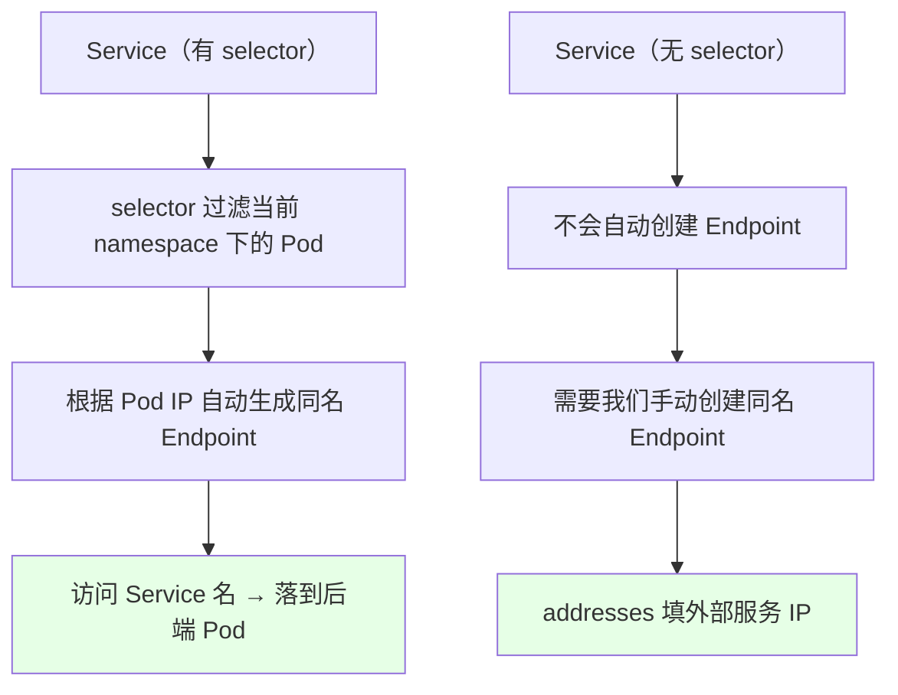
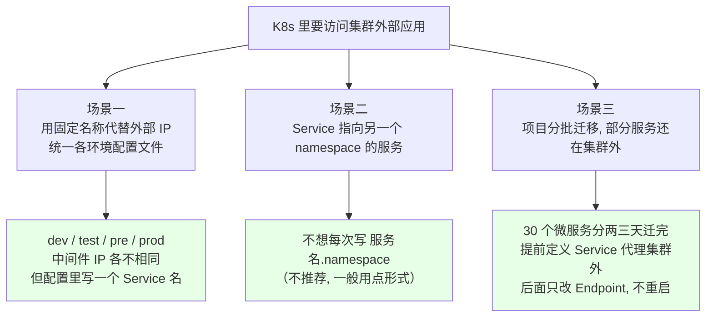
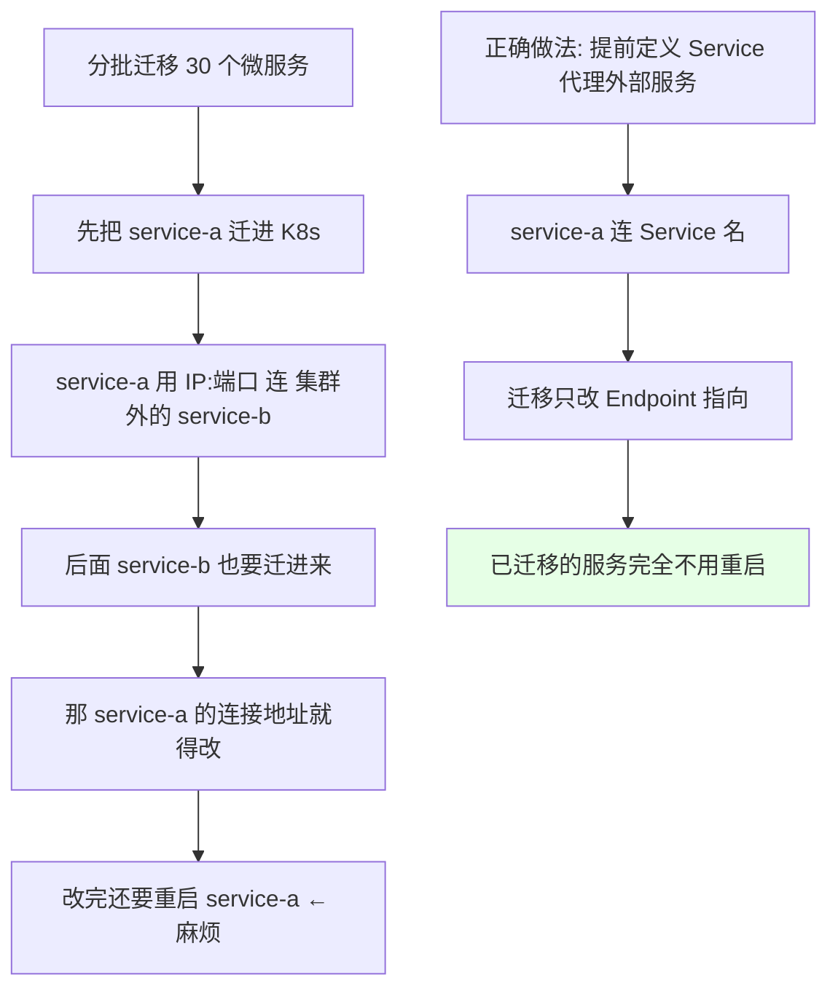
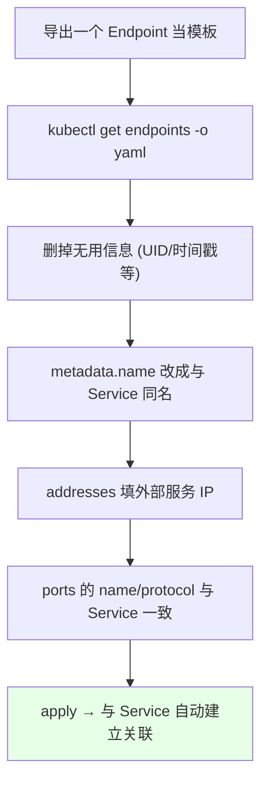

# Kubernetes 集群部署: 使用 Service 代理 Kubernetes 外部服务（三种真实使用场景）

上一节定义了一个 Service，靠 `selector` 匹配 Pod、自动生成 Endpoint，集群内用 Service 名访问容器应用。那是 Kubernetes 里最常用的一种 —— 访问**集群内部**的应用。

但现实里大量需求是反过来的：**Kubernetes 里需要访问集群外部的应用**。这一节讲的就是「用 Service 代理 K8s 外部服务」。

结论先说：
1. **手写 Service 时把 `selector` 去掉**，它就不会自动创建 Endpoint，得**自己手动建一个同名 Endpoint** 把外部 IP 填进去。
2. **Endpoint 的名字必须和 Service 的名字一模一样**，同名才会自动建立关联。
3. 这样中间件地址换了，只改 Endpoint 里的 IP，**应用一个都不用重启**。

## 纲要

- 内部 Service 的回顾：selector → 自动 Endpoint
- 什么时候需要代理外部服务
- 场景一：用固定名称代替外部 IP，统一配置
- 场景二：Service 指向另一个 namespace 的服务
- 场景三：分批迁移，老服务还在集群外
- 手写无 selector 的 Service
- 手动创建 Endpoint（名称必须一致）
- 实测代理百度，再切到淘宝
- 变更 Endpoint 后应用无需重启

## 内部 Service 的回顾



把 Service 的 yaml `kubectl get svc -o yaml` 导出来看，里面定义了两个 port（`http` 80、`https` 443），`port` 是 Service 自己的端口、`targetPort` 是容器进程起的端口；`selector` 会去查当前 namespace 下的 Pod，过滤出来之后按 Pod IP 生成（或刷新）Endpoint。

`195.32.x.x`、`58.223.x.x` 这些 Pod IP 就绑在 Endpoint 里。**同名 Endpoint 和 Service 会自动建立关联**，所以通过 Service 的地址或名称就能访问到容器应用。

### 两种 Service 的区别

```text
有 selector 的 Service:
├── spec.selector: app: nginx
└── → 自动生成同名 Endpoint（Pod IP 列表）

无 selector 的 Service:
├── 没有 spec.selector
└── → 不自动生成 Endpoint
     └── 必须手动创建同名 Endpoint
          └── subsets.addresses 填外部 IP
```

## 什么时候需要代理外部服务



### 场景一：用固定名称代替外部 IP，统一配置

开发环境、测试环境、预生产、生产，**每个环境连的中间件都不一样** —— 测试环境连测试中间件，开发环境连开发中间件，生产环境连生产中间件。

中间件的 IP 在每个环境肯定是不一样的，那应用启动时就要指定连哪个中间件，就**需要一份配置文件**。四个环境就是四份配置？

为了不让开发（或运维）维护一大堆配置文件，就可以用 Service 去代理外部服务：**无论在哪个环境，都用同一个 Service 名称**，这样配置文件就统一了，而且用的是一个固定的**名称**而不是 IP —— IP 是会变的，**IP 不可靠**。

同理，配置一个 hosts 解析也能解决，用 Service 代理也行，看自己需求。我们连接 `servicea-mysql` 这种名字，换环境时只换一个 Endpoint 就够了。

> 不只是 MySQL：代理数据库、RabbitMQ、Redis **都可以用这种方式**。

### 场景二：Service 指向另一个 namespace 的服务

跨 namespace 访问时，不想每次都写 `服务名.namespace`，那就用一个 Service 代理到另一个 namespace 下的 Service。

> 不过**这种方式个人并不推荐**，还是尽量别跨 namespace。真要跨，就用点（`服务名.命名空间`）的形式。

### 场景三：项目正在迁移，部分服务还在集群外

公司一个项目涉及几十个微服务（比如 30 个），**不可能一两天全迁完**。问题就来了：



- 之前的微服务可能部署在宿主机或虚拟机上，暴露的是 IP + 端口，靠 IP 和端口访问；
- 先把某些服务迁进 K8s，它们连的还是外部服务的 IP；
- 等把其他服务也迁进来时，之前迁过来的服务的连接地址就得改，改完还得**重启服务** —— 特别不好；
- **提前定义好 Service 代理集群外应用**，迁移之后也不影响之前的服务，**只需要改 Service 指向的地址**，之前迁进来的服务一律不用重启。

### 综合好处

- **统一配置文件**：几个环境共用一份配置，写的全是 Service 名；
- **免重启换地址**：配置文件里写的是 IP 的话，中间件 IP 一变，应用就得重启；用 Service 就**不需要重启应用**，只改 Endpoint 里的 IP。

## 手写无 selector 的 Service

```bash
# 1. 拷一份之前那个 nginx-service 出来改
kubectl get svc ngx-service -o yaml > ngx-service-external.yaml

# 2. 改两处: 去掉 selector, 改个名字
vi ngx-service-external.yaml
```

```yaml
apiVersion: v1
kind: Service
metadata:
  name: ngx-service-external
  labels:
    app: ngx-service-external
spec:
  # 关键: 没有 selector, 所以不会自动创建 Endpoint
  ports:
    - name: http
      port: 80
      targetPort: 80
      protocol: TCP
```

和之前的 Service 比，**就两个地方不一样**：
1. **把 `selector` 注释掉 / 删掉** —— 我不去匹配当前 namespace 下的 Pod；
2. **名字改成带 `-external` 的**（`ngx-service-external`），端口那里 443 那一段不需要就删掉。

## 手动创建 Endpoint

没有 selector 的 Service **不会自己创建 Endpoint**，那怎么连到外部？**自己手写一个 Endpoint**。



**关键三条**：

| 要求 | 说明 |
| --- | --- |
| **名称一致** | Endpoint 的 `metadata.name` 必须和 Service 名一致，不然连不上 |
| **端口名一致** | Endpoint 里 ports 的 `name` 要和 Service 里的一致 |
| **协议一致** | `protocol` 也要对应得上（这里是 TCP） |

```yaml
apiVersion: v1
kind: Endpoints
metadata:
  name: ngx-service-external
  labels:
    app: ngx-service-external
subsets:
  - addresses:
      - ip: 110.242.68.3      # 外部服务（比如百度）的 IP
    ports:
      - name: http
        port: 80
        protocol: TCP
```

## 实测：代理百度，再切到淘宝

```bash
# 1. 创建无 selector 的 Service 与同名 Endpoint
kubectl apply -f ngx-service-external.yaml
kubectl apply -f ngx-ep-external.yaml

# 2. 确认 Endpoint 是手动建的（之前那个有 selector 的是自动生成）
kubectl get endpoints
# NAME                  ENDPOINTS                PORT
# ngx-service           195.32.x.x:80,58.223.x.x:80   80/TCP
# ngx-service-external  110.242.68.3:80          80/TCP

# 3. 从 Pod 里访问
kubectl exec -it busybox -- wget -S http://ngx-service-external
# HTTP/1.1 200 OK
# ... 打开的就是百度的页面
```

再换一个：代理淘宝（淘宝是基于 nginx 自研的 Web 服务器），只要把 Endpoint 里的 IP 改掉：

```bash
# 方式一: replace 整个文件
vi ngx-ep-external.yaml      # 把 ip 改成淘宝的地址
kubectl replace -f ngx-ep-external.yaml

# 方式二: 直接用 edit 编辑（保存退出即可）
kubectl edit ep ngx-service-external
```

改完再看：

```bash
kubectl exec -it busybox -- wget -S http://ngx-service-external
# HTTP/1.1 501 Not Implemented
```

**返回值变了**（从 200 变成 501，淘宝那个自研 Web 服务器的响应），说明流量已经打到新地址上去了。

> 注意一点：宿主机上没配 CoreDNS 的地址，所以这边在 Pod 里访问时直接用 Service 名或 IP 都行。

### 为什么要改 Endpoint 而不是改配置

```text
配置文件写 IP 的方式:
├── 中间件 IP 变更
└── → 改配置文件 → 应用重启 → 重新加载

Endpoint 代理的方式:
├── 中间件 IP 变更
└── → kubectl edit ep <名称> 改 IP
     └── 正在连这个 Service 的程序完全不用重启
```

这就是这种方式在**生产环境里用得比较多**的原因：改一个 Endpoint 就把整个中间件地址切换了，程序不用重启，配置也统一。

## API 速览

| 命令 | 说明 |
| --- | --- |
| `kubectl get svc -o yaml > x.yaml` | 导出 Service 当模板 |
| `kubectl get endpoints` / `kubectl get ep` | 看 Endpoint 列表 |
| `kubectl apply -f <文件>` | 创建无 selector 的 Service + 手动 Endpoint |
| `kubectl replace -f <文件>` | 整体替换 Endpoint（换外部地址） |
| `kubectl edit ep <名称>` | 直接编辑 Endpoint，保存退出 |
| `kubectl exec -it busybox -- wget -S http://<服务名>` | 从 Pod 里验证代理是否生效 |

无 selector Service 的字段差异：

| 位置 | 有 selector（内部服务） | 无 selector（代理外部服务） |
| --- | --- | --- |
| `spec.selector` | 写业务 label | **删掉** |
| 自动 Endpoint | **自动生成** | **不生成** |
| 端点来源 | Pod IP 列表 | 手动 Endpoint 的 `addresses` |
| 关联方式 | 自动 | Endpoint 名称必须等于 Service 名称 |

## Demo 示例

```bash
# 1. 准备：拷贝已有 Service 做模板
kubectl get svc ngx-service -o yaml > ngx-service-external.yaml
# 改 name → ngx-service-external，去掉 selector

# 2. 准备 Endpoint：导出模板后改造
kubectl get endpoints -o yaml > ngx-ep-external.yaml
# metadata.name 改成 ngx-service-external（必须同名）
# addresses 填外部服务 IP，ports 的 name/protocol 与 Service 一致

# 3. 应用
kubectl apply -f ngx-service-external.yaml
kubectl apply -f ngx-ep-external.yaml
kubectl get svc,ep

# 4. 验证代理到百度
wget -S http://ngx-service-external

# 5. 换地址（代理淘宝）
kubectl edit ep ngx-service-external
wget -S http://ngx-service-external
```

```text
代理外部服务的完整链路:

Pod (busybox)
   │  wget http://ngx-service-external
   ▼
Service: ngx-service-external   (无 selector, 端口 80)
   │  同名自动关联
   ▼
Endpoints: ngx-service-external
   └── subsets.addresses → 110.242.68.3  ← 这里改 IP 就等于换后端
   │
   ▼
外部服务（百度 / 淘宝 / MySQL / Redis / RabbitMQ）
```

### 总结

- **代理外部服务的关键动作就两步**：手写 Service 时**去掉 `selector`**，再手写一个**与 Service 同名的 Endpoint** 把外部 IP 填进 `addresses`。
- **Endpoint 名称、端口名、协议必须和 Service 一致**，否则两者建立不了关联；没有 selector 的 Service 是不会自动生成 Endpoint 的。
- **场景一（最常见）**：dev/test/pre/prod 各环境的中间件 IP 不同，用同一个 Service 名就能统一配置文件，不用维护四套配置。
- **场景三（迁移过渡）**：几十个微服务分批迁 K8s，提前用 Service 代理集群外服务，后面迁完只改 Endpoint，**已迁移的服务一律不用重启**。
- **换后端不重启**：配置文件里写 IP 的话中间件 IP 一变应用就得重启；改成 Endpoint 代理后，`kubectl edit ep` 改个 IP 就切过去了，程序无感知。
- **跨 namespace 代理方式个人不推荐**，真要跨还是用 `服务名.命名空间` 的点形式。

