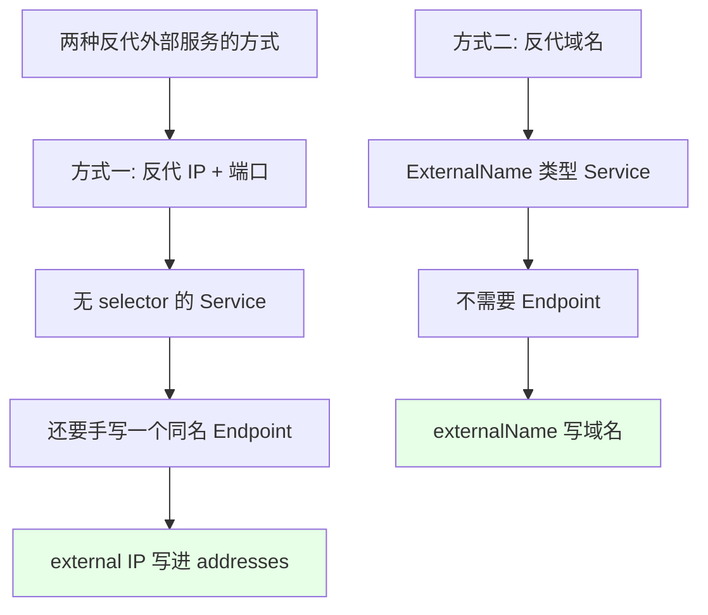
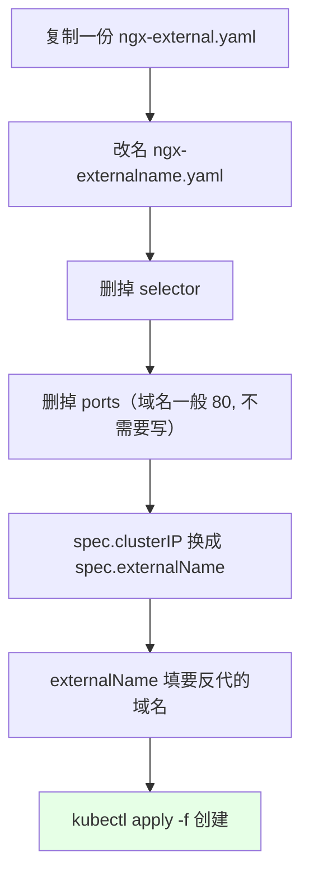
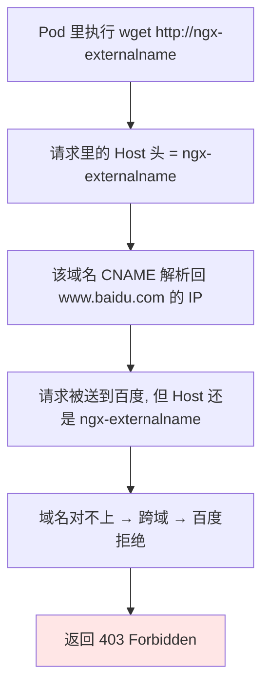

# Kubernetes 集群部署: 使用 Service 反代外部域名（ExternalName 类型与跨域问题）

上一节讲了用 Service 反代**集群之外的 IP + 端口**（RabbitMQ、Redis、MySQL 之类），给它们一个统一的 Service 名，所有环境的配置文件就能统一；Service 名一旦定义就固定了，不像 IP 和端口老变 —— 后端地址变了不用重启应用、不用改配置，只改 Endpoint 就行。

这一节讲的**反代外部域名**和那个有点类似，但**用的并不是很多**。原因等下演示完就清楚了。

结论先摆：
1. **ExternalName 类型的 Service 既没有 `selector`，也不需要 `Endpoint`** —— 比反代 IP + 端口那套还省事。
2. 它**没有 `clusterIP`**，靠 `spec.externalName` 直接指向一个域名。
3. **坑点在跨域**：用 Service 名去 wget 外部域名，会因为 Host 变了被对方拒掉（实测百度返回 **403**）。

## 纲要

- 反代 IP + 端口的回顾
- 反代域名的配置：还是无 selector，连 Endpoint 都不要
- externalName 字段替换 clusterIP
- apply 与 create 的区别
- 实测：Service 没有 clusterIP，返回 403
- 为什么会 403：跨域问题
- 对比小结与适用场景

## 反代 IP + 端口的回顾



方式一（上一节）是：无 selector 的 Service + **手动创建的同名 Endpoint**，`addresses` 里填外部 IP，`ports` 里填端口。

方式二（本节）是：**连 Endpoint 都不需要定义**。

## 反代域名的配置



配置方式和反代 IP + 端口**差不多**，也是一种 **没有 selector 的 Service**，但**它连 Endpoint 都不需要**。

```yaml
apiVersion: v1
kind: Service
metadata:
  name: ngx-externalname
  labels:
    app: ngx-externalname
spec:
  type: ExternalName
  externalName: www.baidu.com
```

有三处不一样：

| 位置 | 反代 IP + 端口 | 反代域名（ExternalName） |
| --- | --- | --- |
| `spec.type` | 默认 ClusterIP | **`ExternalName`** |
| `spec.clusterIP` | 有（自动分配的 ClusterIP） | **没有** |
| 端点来源 | 手动 Endpoint 的 `addresses` | **`spec.externalName` 直接指域名** |
| `spec.ports` | 要写 port / targetPort | **一般不需要写**（域名都是 80） |
| `spec.selector` | 无 | 无 |
| Endpoint | **要手动创建** | **完全不需要** |

## apply 与 create 的区别

```text
kubectl create -f  :
    资源名已存在 → 直接报错

kubectl apply -f   :
    不存在 → 创建
    已存在 → 相当于 replace, 不报错, 直接覆盖
```

实操里直接 `apply` 更省事 —— 换个 IP、调个端口改完再 `apply` 一遍就行，不用担心名字已存在。

## 实测：Service 没有 clusterIP，返回 403

```bash
# 1. 创建 ExternalName 类型的 Service
kubectl apply -f ngx-externalname.yaml

# 2. 看结果 —— 这个 Service 是没有 clusterIP 的
kubectl get svc
# NAME               TYPE           CLUSTER-IP   EXTERNAL-IP   PORT(S)   AGE
# ngx-externalname   ExternalName   <none>       www.baidu.com   <none>   10s

# 3. 打开之前的 busybox 验证
kubectl exec -it busybox -- wget http://ngx-externalname
# HTTP request sent, awaiting response... 403 Forbidden
```

可以看到：这个 Service **没有 clusterIP**，反带的就是 `www.baidu.com`。

### 为什么是 403



直接解析一下这个 Service 名，它会返回百度那两个 IP（一条 CNAME 记录），我们直接访问那个域名/IP，**是可以打开的**。

但通过 Service 名去访问就 403。原因很直白：

- `wget` 请求时带的 Host 是 **Service 名**（`ngx-externalname`）；
- 这个域名又被反代到 `www.baidu.com`；
- **这是一个跨域现象**，百度认的是 `www.baidu.com` 这个 Host，认别的直接拒；
- 所以报 403。

**所以这个东西真正用的时候，一定要先想清楚跨域这个问题** —— 它不像无 selector 反代 IP + 端口那种用得多，实际场景里用得相对少，**简单了解即可**。

## 对比小结

```text
两种反代外部服务的取舍:

反代 IP + 端口（无 selector + Endpoint）
├── 后端换成什么 IP 都行
├── 改 Endpoint 就切地址, 应用不重启
├── 环境差异用同一 Service 名统一配置
└── 生产里用得比较多

反代域名（ExternalName）
├── 直接指向一个外部域名
├── 连 Endpoint 都不用建
├── 但有跨域问题: Host 变了会被拒 (403)
└── 用得不多, 了解即可
```

| 维度 | 反代 IP + 端口 | ExternalName 反代域名 |
| --- | --- | --- |
| 需要 Endpoint | **需要**（同名手建） | 不需要 |
| 有无 clusterIP | 有 | **没有** |
| 换后端成本 | 改 Endpoint 里的 IP | 改 `spec.externalName` |
| 跨域风险 | 无（自己指定 IP） | **有**，Host 不符会被拒 |
| 实际使用频率 | 高 | 低 |

## API 速览

| 命令 | 说明 |
| --- | --- |
| `kubectl apply -f <文件>` | 创建（已存在则 replace，不报错） |
| `kubectl create -f <文件>` | 创建，资源名已存在会报错 |
| `kubectl get svc` | 看 TYPE / CLUSTER-IP / EXTERNAL-IP 列 |
| `kubectl describe svc ngx-externalname` | 看是不是 ExternalName 及指到哪个域名 |
| `kubectl nslookup ngx-externalname`（busybox 内） | 看解析结果（CNAME + IP） |
| `kubectl exec -it busybox -- wget http://<服务名>` | 从 Pod 内验证 |
| `kubectl delete -f <文件>` | 清理 |

ExternalName Service 关键字段：

| 字段 | 作用 |
| --- | --- |
| `spec.type: ExternalName` | 声明这是一个反代域名的 Service |
| `spec.externalName` | 要反代的外部域名（如 `www.baidu.com`） |
| `spec.ports` | 一般不需要（域名默认走 80） |
| `spec.clusterIP` | **不存在**（没有 ClusterIP） |

## Demo 示例

```bash
# 1. 准备：复制一份外部服务清单改造
kubectl get svc ngx-service -o yaml > ngx-externalname.yaml
# 改 name → ngx-externalname
# type → ExternalName
# clusterIP 换成 externalName: www.baidu.com
# 去掉 selector / ports

# 2. 用 apply 创建（存在也 OK，等于 replace）
kubectl apply -f ngx-externalname.yaml
kubectl get svc
kubectl describe svc ngx-externalname

# 3. 在 busybox 里解析，看 CNAME 与 IP
kubectl exec -it busybox -- nslookup ngx-externalname

# 4. 直接访问域名/IP —— 能打开
kubectl exec -it busybox -- wget -qO- http://www.baidu.com

# 5. 通过 Service 名访问 —— 403（跨域被拒）
kubectl exec -it busybox -- wget -S http://ngx-externalname
```

```text
ExternalName 的解析链路:

Pod (busybox)
   │  wget http://ngx-externalname
   ▼
Service: ngx-externalname   (type=ExternalName, 无 clusterIP)
   │  spec.externalName = www.baidu.com
   ▼
CoreDNS 返回 CNAME + 百度 IP
   │
   ▼
请求到达百度, 但 Host: ngx-externalname  ← 跨域
   ▼
403 Forbidden
```

### 总结

- **ExternalName 类型的 Service 既没有 `selector` 也不需要 `Endpoint`**，比反代 IP + 端口更省事，靠 `spec.externalName` 直接指一个外部域名。
- **它没有 `clusterIP`**，`kubectl get svc` 里 CLUSTER-IP 是 `<none>`，EXTERNAL-IP 那列显示的是外部域名。
- **端口一般不用写**：域名默认走 80；`kubectl apply` 比 `create` 省心，资源已存在也不报错，等于 replace。
- **坑在跨域**：实测用 Service 名去 wget，返回 **403** —— 请求 Host 是 Service 名，反代到 `www.baidu.com` 后域名对不上，被对方拒绝。
- **结论**：无 selector 反代 IP + 端口那种在生产里用得比较多；ExternalName 反代域名因为跨域限制**用得不多，简单了解即可**。

