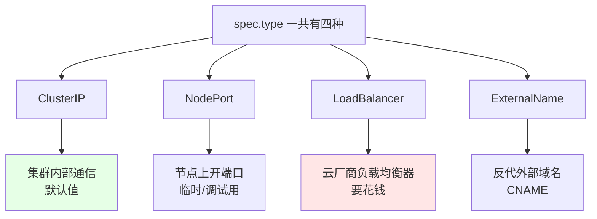
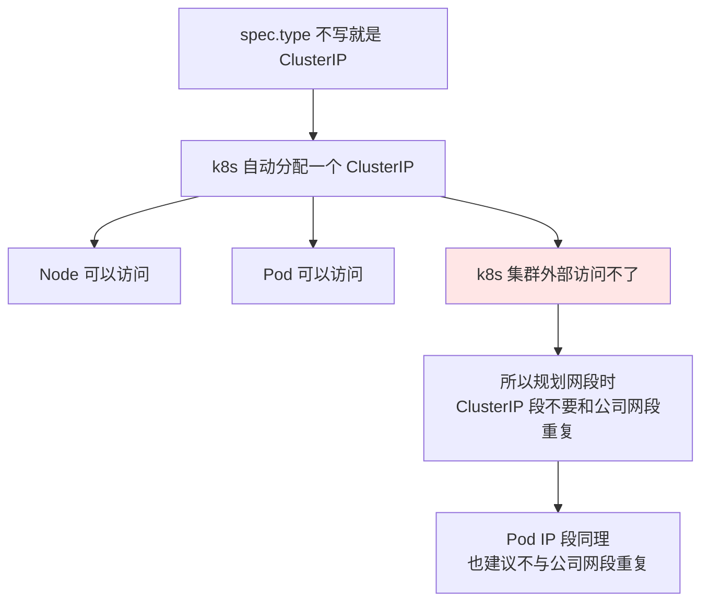
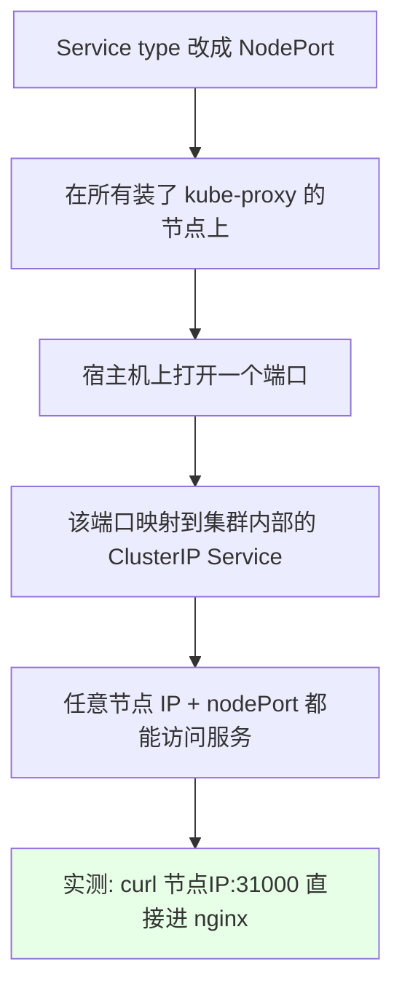
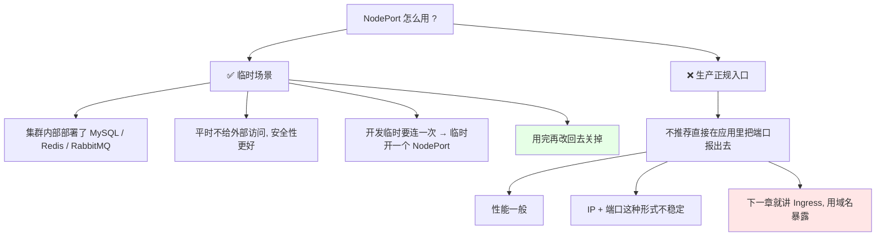
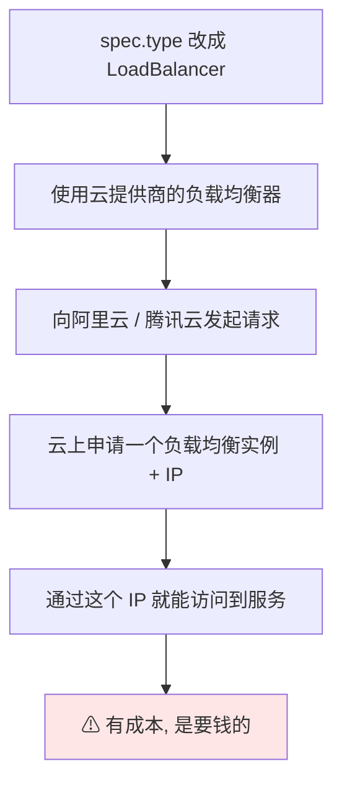

# Kubernetes 集群部署: Service 常用类型（ClusterIP / NodePort / ExternalName / LoadBalancer）

前面几节把 Service 的定义、端口、selector、clusterIP、反代外部服务都讲完了，但清单里 `spec.type` 一会儿是 ClusterIP、一会儿是 ExternalName，这个字段决定的是「这个 Service 以什么姿势把 Pod 暴露出去」。这一节把常用的四种类型一次讲全。

结论先摆：

1. **ClusterIP 是默认值**，只在集群内部用，Pod 和 Node 能访问，**集群外部访问不了**；
2. **NodePort 在每台装了 kube-proxy 的节点上开一个端口**，外部用「节点 IP + 端口」就能进来；默认端口范围是 **30000~32767**，可改；
3. **ExternalName 没有 selector 也不需要 Endpoint**，`spec.externalName` 直接反代一个外部域名（上一节刚讲过，用得不多）；
4. **LoadBalancer 要靠云厂商（阿里云、腾讯云）**，会真的去申请一个公网 IP，**是要花钱的**；
5. **生产最推荐的姿势是 ClusterIP + Ingress 走域名**，NodePort 只适合临时调试，别拿它当正式的对外入口。

## 纲要

- 四种类型总览
- ClusterIP：默认值与它的地址规划约束
- ExternalName 顺带回顾
- NodePort：在每个节点上开端口
- 默认 30000~32767 从哪儿来的、怎么改
- 手动指定 nodePort 实测
- NodePort 的适用场景与不推荐的原因
- LoadBalancer 与云厂商负载均衡器
- 怎么选：三种对外路径对比

## 四种类型总览



| 类型 | 作用 | 谁可以访问 | 成本 |
| --- | --- | --- | --- |
| **ClusterIP** | 集群内部统一入口，自动分配 ClusterIP | 只能集群内部（Pod / Node） | 无 |
| **NodePort** | 每个节点开一个端口做映射 | 任意节点 IP + nodePort | 无 |
| **LoadBalancer** | 申请云厂商负载均衡器拿公网 IP | 公网 | **要钱** |
| **ExternalName** | 直接反代一个外部域名 | 集群内解析出 CNAME | 无 |

真正用得最多的就是 **ClusterIP 和 NodePort** 这两种。

## ClusterIP：默认值与它的地址规划约束



- ClusterIP 是 Service 的**默认值**，`spec.type` 不写就是它；
- **Pod IP 和 ClusterIP 都是 k8s 自己管的**，在 k8s 集群外部是访问不了的 —— Node 节点可以访问，Pod 内部也可以访问，**只有集群外不行**；
- 所以装集群的时候建议：**ClusterIP 网段不要和公司现有网段重复**，Pod IP 网段同理。否则排障时会分不清「这个 IP 是集群里的还是外网的」，路由也容易打架。

## ExternalName 顺带回顾

```text
ExternalName 的本质（上一节已展开）:

Service: ngx-externalname
├── type: ExternalName
├── 没有 spec.selector
├── 没有 Endpoint
├── 没有 clusterIP
└── externalName: www.baidu.com
      ↓  CoreDNS 返回 CNAME + 目标 IP
     Pod 里 wget http://ngx-externalname → Host 不对 → 403
```

它靠 `spec.externalName` 返回一个别名（CNAME）记录，解析 Service 名就能拿到外部域名对应的 IP。**用得不多**，知道它「连 Endpoint 都不用建」就够了。

## NodePort：在每个节点上开端口



装完集群之后（比如 Kuboard / Dashboard 那种带界面的组件），它创建出来的 Service 类型往往就是 NodePort —— 在每台装了 kube-proxy 的节点上都会启动这个端口，你可以直接去看。

## 默认 30000~32767 从哪儿来的

NodePort 的默认端口范围是 **30000~32767**（注意是五位数，不是随便一段）。这个范围写在 kube-apiserver 的启动配置里：

| 部署方式 | 查看位置 |
| --- | --- |
| kubeadm 部署 | `/etc/kubernetes/manifests/kube-apiserver.yaml`（静态 Pod 清单） |
| 二进制部署 | kube-apiserver 的启动配置文件（Config 文件） |

这个范围**是可以改的**，改完重启 kube-apiserver 生效。

```bash
# 1. kubeadm 部署：看静态 Pod 清单里的 --service-node-port-range
grep service-node-port-range /etc/kubernetes/manifests/kube-apiserver.yaml

# 2. 二进制部署：看 kube-apiserver 的启动参数
ps -ef | grep kube-apiserver
# 或 grep 配置文件目录
grep -R service-node-port-range /opt/kubernetes/cfg/
```

## 手动指定 nodePort 实测

```bash
# 1. 之前的 Service 只能在集群内部访问，把它类型改掉
kubectl edit service nginx-svc
# 把 spec.type: ClusterIP 改成 NodePort
# 再补一行 nodePort: 31000（必须在 30000~32767 范围内）

# 2. 没指定 nodePort 的话，会自动随机生成一个，省事但不固定
kubectl get svc nginx-svc
# NAME       TYPE       CLUSTER-IP      EXTERNAL-IP   PORT(S)          AGE
# nginx-svc  NodePort   10.96.137.22   <none>        80:31000/TCP   5m
```

**nodePort 一定要在允许范围内**，比如我们指定 `31000`；不指定的话 apiserver 会随机给你分配一个。

```bash
# 3. 用节点 IP + 端口访问（注意把 https 去掉）
curl http://192.168.31.10:31000
# <!DOCTYPE html> ...  nginx 首页出来
```

已经访问到 nginx 了 —— **NodePort 也是一种从外部访问集群内服务的方式**。

```text
NodePort 的转发链路:

外部客户端
   │  curl http://<节点IP>:31000
   ▼
宿主机端口 31000 (每台装了 kube-proxy 的节点都有)
   │  iptables / IPVS 规则
   ▼
集群内 ClusterIP Service (10.96.137.22:80)
   │
   ▼
后端 Pod IP:80
```

## NodePort 的适用场景与不推荐的原因



**推荐用法**：集群内部（Pod 之间、Node 之间）访问比较安全，MySQL / Redis 这类一般不该让集群外部访问；但如果开发临时要连一次，可以**临时**给他建一个 NodePort，用完就关掉。

**不推荐**：直接在应用上开一个 NodePort 供别人访问。可能你是通过 NodePort 报了端口，前面再套一个 nginx 反代配个域名 —— 但既然要套反代，那就直接用 **Ingress 通过域名暴露**，那才是推荐的方式。

> NodePort 只是**最常用**的暴露方式，并不是**最推荐**的暴露方式，这个区别要拎清楚。

## LoadBalancer 与云厂商负载均衡器



- LoadBalancer 是**云环境专属**：阿里云、腾讯云这类云厂商支持这套，会把 `type` 改成 LoadBalancer 时**去云上申请一个负载均衡器和 IP**；
- **它是收费的**，实际用得不多；
- 裸机机房没有云厂商，这个类型基本用不上。

## 怎么选：三种对外路径对比

```text
对外暴露服务的三条路:

路一（最推荐）
├── Service type: ClusterIP（默认）
├── 再叠一个 Ingress
├── 通过域名访问
└── 生产标准姿势

路二（常用, 但适合临时）
├── Service type: NodePort
├── 宿主机上开端口
└── 用完记得关掉

路三（云上专属）
├── Service type: LoadBalancer
├── 云厂商申请负载均衡器 IP
└── 要花钱
```

| 维度 | ClusterIP + Ingress | NodePort | LoadBalancer |
| --- | --- | --- | --- |
| 入口形态 | **域名** | 节点 IP + 端口 | 云负载均衡器 IP |
| 性能 | 好（走 Ingress Controller） | 一般 | 好 |
| 是否需要改 Service 类型 | 不需要 | 需要改成 NodePort | 需要改成 LoadBalancer |
| 成本 | 无 | 无 | **要钱** |
| 稳定性 | 域名不变，后端随便换 | **IP + 端口容易变** | 公网 IP 固定 |
| 适用场景 | **生产正式入口** | 临时调试 | 云上直接暴露 |

** ClusterIP 上加一个 Ingress 通过域名暴露** + **NodePort 在主机上开端口**，这两种是最常见的；没有「最好」，只有「更合适」。

## API 速览

| 能力 | 做法 | 关键点 |
| --- | --- | --- |
| 默认内部服务 | `spec.type` 不写（ClusterIP） | 只有集群内可访问 |
| 改类型 | `kubectl edit service <名称>` | 把 type 改成 NodePort / LoadBalancer |
| 指定对外端口 | `spec.ports[].nodePort: 31000` | 必须落在 30000~32767 |
| 不指定端口 | 省略 nodePort | 由 apiserver 随机分配 |
| 看端口映射 | `kubectl get svc` | PORT(S) 列显示 `80:31000/TCP` |
| 集群外验证 | `curl http://<节点IP>:31000` | 不要带 https |
| 查端口范围（kubeadm） | `grep service-node-port-range /etc/kubernetes/manifests/kube-apiserver.yaml` | 静态 Pod 清单 |
| 查端口范围（二进制） | `ps -ef | grep kube-apiserver` | 看启动参数 |
| 反代外部域名 | `type: ExternalName` + `externalName` | 无 selector、无 Endpoint、无 clusterIP |

四种类型的关键差异：

| 类型 | 有 clusterIP | 有 selector | 需要 Endpoint | 集群外可访问 |
| --- | --- | --- | --- | --- |
| ClusterIP | 有 | 有 | 不需要（自动） | 否 |
| NodePort | 有 | 有 | 不需要（自动） | **是**（节点 IP + nodePort） |
| LoadBalancer | 有 | 有 | 不需要（自动） | 是（云 LB 的 IP） |
| ExternalName | **没有** | 无 | **不需要** | 看外部域名 |

## Demo 示例

```bash
# 1. 看当前 Service 是什么类型
kubectl get svc
kubectl describe service nginx-svc
# Type:                  ClusterIP

# 2. 改成 NodePort 并手动指定端口 31000
kubectl edit service nginx-svc

# 3. 确认端口映射已经生效
kubectl get svc nginx-svc
# PORT(S) 列变成 80:31000/TCP

# 4. 不指定 nodePort 时, apiserver 会随机分配一个
#    想要固定的对外入口就显式写 nodePort

# 5. 在集群外验证（去掉 https）
curl -s http://192.168.31.10:31000
curl -s http://192.168.31.11:31000   # 每个节点都有这个端口
```

```yaml
# 6. NodePort 类型的完整写法
apiVersion: v1
kind: Service
metadata:
  name: nginx-svc
spec:
  type: NodePort
  selector:
    app: nginx
  ports:
  - port: 80            # 集群内部 Service 端口
    targetPort: 80      # 容器端口
    nodePort: 31000     # 宿主机端口, 必须在 30000~32767
    protocol: TCP
```

```text
7. 改端口范围（kubeadm 部署）:

/etc/kubernetes/manifests/
├── kube-apiserver.yaml        ← 这里加 --service-node-port-range=30000-35000
├── kube-controller-manager.yaml
├── kube-scheduler.yaml
└── etcd.yaml
```

```bash
# 8. 改完 kube-apiserver 是静态 Pod, 会自动重启拉起
kubectl get pod -n kube-system | grep kube-apiserver
```

### 总结

- **Service 的四种类型**：ClusterIP（默认，只进不出群）、NodePort（节点开端口）、LoadBalancer（云厂商负载均衡器、要钱）、ExternalName（反代外部域名，用得不多）；
- **ClusterIP 网段和 Pod IP 网段都要避开公司现有网段** —— 二者都是 k8s 自管、集群外访问不到，网段撞了路由和排障都会乱；
- **NodePort 默认端口范围 30000~32767**，写在 kube-apiserver 的 `--service-node-port-range` 里，kubeadm 看 `/etc/kubernetes/manifests/kube-apiserver.yaml`，二进制看启动参数，改完是静态 Pod 自动重启；
- **nodePort 可以手动指定（如 31000）也可以不写（随机分配）**，实战里想固定入口就显式写；
- **NodePort 适合临时调试**（开发临时连一次 MySQL / Redis，用完关掉），**不推荐当生产正规入口**；
- **生产最推荐 ClusterIP + Ingress 走域名**，NodePort 是最常用、LoadBalancer 最贵 —— 没有最好，只有更合适。

