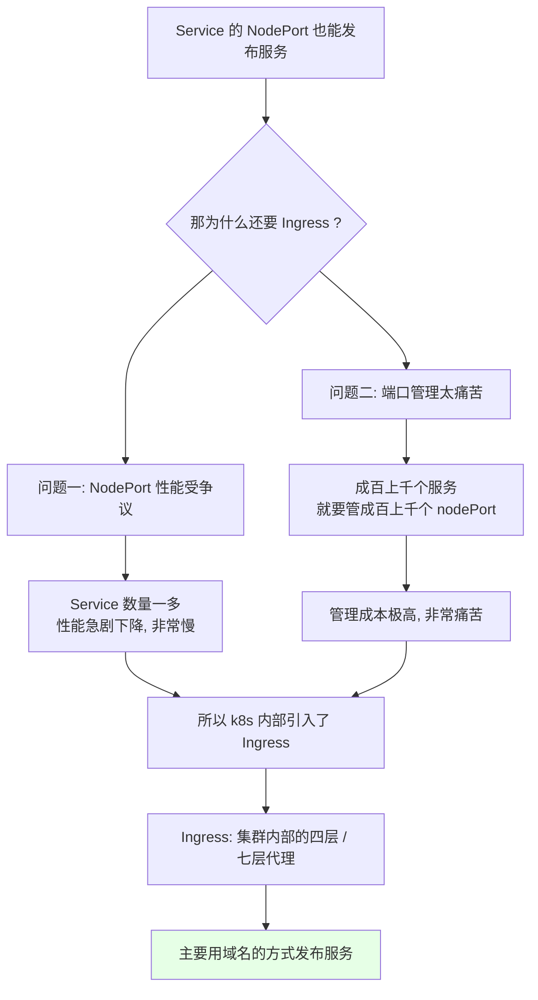
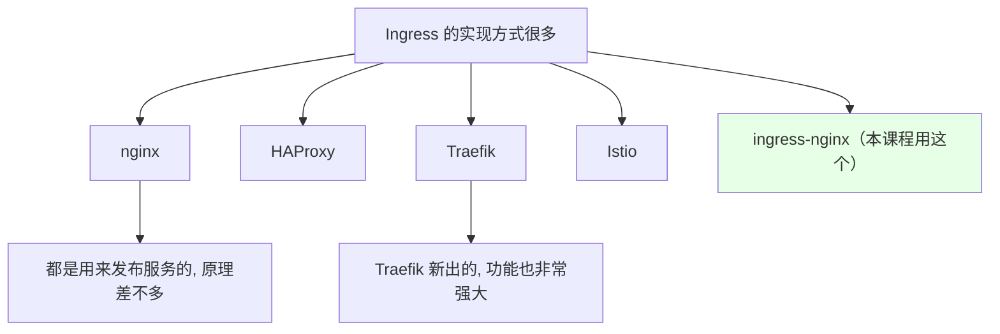
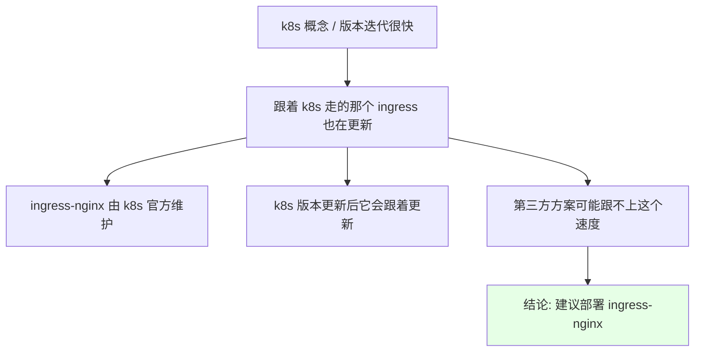
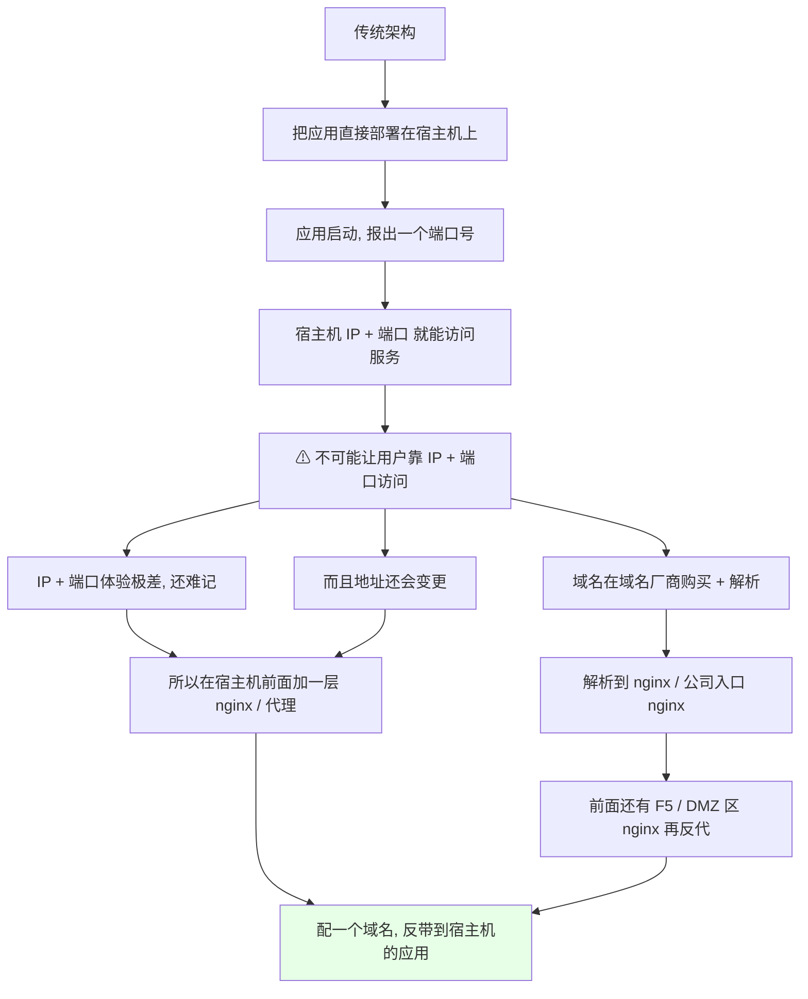
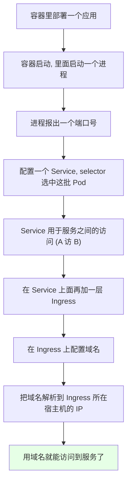
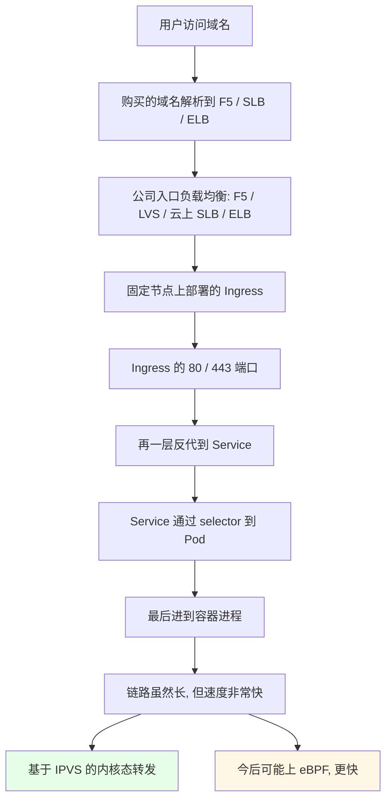
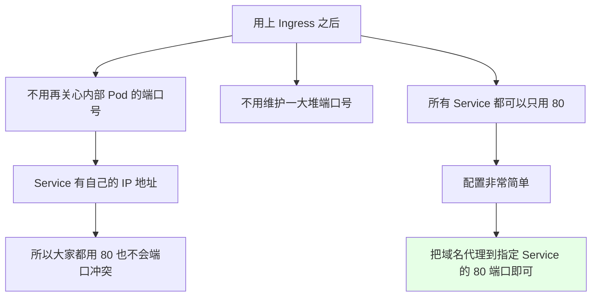

# Kubernetes 集群部署: 什么是 Ingress（Ingress 是什么、为什么不用 NodePort）

讲 Service 的时候就已经提过 Ingress 是个什么东西，但从这一节开始系统把它讲透。Service 已经能把应用发布出去了（NodePort 在宿主机上开端口映射到内部服务），**那为什么还要 Ingress？**

结论先摆：

1. **Ingress 和 Service / Deployment / DaemonSet / StatefulSet 一样，也是一种 k8s 资源类型**，只不过 Service 解决的是**服务之间的访问**，Ingress 解决的是**用域名访问 k8s 内部应用**；
2. **NodePort 有俩硬伤**：一是 Service 一多、性能会急剧下降（争议一直很大）；二是几百上千个服务就要管几百上千个 nodePort，端口管理极其痛苦；
3. **在 k8s 外面自己再架一台 nginx 反代到 nodePort 上，是极不推荐的** —— 花了 k8s 这个平台，又回到上个世纪的架构；
4. **Ingress 可以在 k8s 内部实现七层（HTTP）甚至四层代理**，既能做端口代理也能做域名发布，本节点主推**域名发布**；
5. **好处是终于不用管内部 Pod 端口号了**：所有 Service 都可以只用 80 端口 —— Service 各有各的 IP，不会端口冲突。

## 纲要

- 有了 NodePort 为什么还要 Ingress
- Ingress 的实现方式：ingress-nginx 与 nginx-ingress 别搞混
- 为什么建议用 Kubernetes 官方维护的那套
- 传统架构里服务是怎么发布的
- k8s 里的服务发布链路：容器 → Service → Ingress
- 生产真实链路：入口负载到 Ingress 再到 Pod
- Ingress 带来的实际好处
- 下一节预告

## 有了 NodePort 为什么还要 Ingress



两个问题说得很直白：

| 问题 | 具体表现 |
| --- | --- |
| **性能** | NodePort 一直很有争议，Service 数量一多，性能会急剧下降，慢得非常明显 |
| **端口管理** | 服务有成百上千个，就要管理成百上千个 nodePort，光维护这张端口表就已经很痛苦了 |

而且既然用了 k8s 这么好的平台，就**不能在 k8s 上面再套上个世纪的架构** —— 在集群外面自己维护一台 nginx 反代到 k8s 的 nodePort 上，这是**非常非常不推荐**的做法。

## Ingress 的实现方式



**本课程讲的 Ingress 实现方式，是 Kubernetes 官方维护的那套** —— 它内部也是用 **nginx + openresty** 来实现。

这里有个很容易搞混的点：

| 项目 | 谁维护 | 名字 |
| --- | --- | --- |
| k8s 官方维护 | Kubernetes 社区 | **ingress-nginx** |
| nginx 官方维护 | NGINX 官方 | **nginx-ingress** |

**这两个不是一回事，别搞混。**

### 为什么建议用 ingress-nginx



- k8s 这个概念的**版本更新其实挺快**的；
- 既然是官方维护的，**k8s 版本一更新，对应的 ingress 大概率也会跟着更新**；
- 第三方方案**更新速度可能跟不上**（也可能没有这个问题，但要考虑这个风险）；
- 所以**建议还是用 ingress-nginx** 来部署。当然像新出的 **Traefik** 功能也非常强大，有兴趣可以自己研究，原理都差不多，本质上都是用来发布服务的。

## 传统架构里服务是怎么发布的



回顾一下传统玩法：宿主机上部署应用 → 应用报一个端口 → 用「宿主机 IP + 端口」访问。但**线上环境绝不可能让用户通过 IP + 端口访问**，体验非常不好、IP 和端口难记、还可能变更。所以要在宿主机前面加一层 nginx 之类的代理工具，配一个域名反带到应用。

而买来的域名在域名厂商那里**得先解析到 nginx**（或公司入口的 nginx），前面可能还套着 F5、DMZ 区的 nginx 再一层层反代下来 —— 这就是传统架构的域名发布方式。

## k8s 里的服务发布链路



```text
k8s 内部的发布链路（从内到外）:

Pod (容器进程: 端口)
   ▲
Service (selector 选中 Pod, 集群内统一入口)
   ▲
Ingress (配置域名, 集群内七层代理)
   ▲
公司入口代理 F5 / LVS / 阿里云 SLB / 腾讯云 ELB
   ▲
域名解析 (域名厂商买的域名)
   ▲
用户 / 客户端
```

**Ingress 这一层的角色其实还是「代理」**。配上域名之后，通过「Ingress 所在宿主机的 IP + 端口」把域名解析过去，就能用域名访问到服务了。

### 生产真实链路

因为 Ingress 也跑在 k8s 内部，所以**在 Ingress 前面往往还会有一层**：



- 公司入口的 F5 / LVS / 阿里云 SLB / 腾讯云 ELB 会**代理到 Ingress 的 80 和 443 端口**；
- 域名再解析到 F5 / SLB / ELB 上，一层层反代到 Ingress → Service → Pod；
- **别看经过的层多，速度还是非常快的** —— 毕竟是基于 **IPVS** 做的内核态转发；今后可能用上 **eBPF** 会更更快；
- 所以**完全不用担心性能**，这就是用 Ingress 的底气。

## Ingress 带来的实际好处



这是 Ingress 最实在的价值：

- **不需要关心内部 Pod 的端口号**，也就不用再去维护那么多的 nodePort；
- **所有 Service 都可以统一用 80 端口** —— 因为 Service 各有自己的 IP 地址，**不会出现端口冲突**；
- 配置 Ingress 因此非常简单：**把域名代理到指定 Service 的 80 端口**，服务发布就完成了。

```text
端口管理对比:

用 NodePort（几百上千个服务）
├── nginx-svc      → nodePort 31001
├── redis-svc      → nodePort 31002
├── mysql-svc      → nodePort 31003
├── api-gw-svc     → nodePort 31004
└── ... 一张几百行的端口表要人工维护

用 Ingress（所有服务统一 80）
├── nginx-svc      → ingress → 域名 nginx.example.com → 80
├── redis-svc      → ingress → 域名 redis.example.com → 80
├── mysql-svc      → ingress → 域名 mysql.example.com → 80
└── 只维护一张「域名 → Service → 80」的映射表
```

> 这一节把 Ingress「是什么、为什么存在、快不快、省了什么」讲清楚了，**下一节就动手把它装进 k8s 集群里**。

## API 速览

| 能力 | 做法 / 关键点 |
| --- | --- |
| 理解资源类型 | Ingress 和 Service / Deployment / DaemonSet / StatefulSet 平级，也是一种 k8s 资源 |
| 解决什么 | Service 负责**服务之间**的访问；Ingress 负责**用域名**访问集群内应用 |
| 代理能力 | k8s 内部可实现**七层（HTTP）和四层代理**，端口代理、域名发布都行 |
| 官方实现 | **ingress-nginx**（k8s 官方维护，内部 nginx + openresty） |
| 别和谁混淆 | **nginx-ingress** 是 nginx 官方维护的，不是一回事 |
| 其他可选实现 | HAProxy、Traefik、Istio，原理差不多 |
| 选型建议 | 优先 ingress-nginx，跟 k8s 版本同步更新；第三方可能跟不上 |
| 推荐发布姿势 | **ClusterIP Service + Ingress 走域名**，不要拿 NodePort 当正式入口 |
| 端口约定 | 所有 Service 统一用 80，Service 有独立 IP 不冲突 |
| 性能 | 内核态 IPVS 转发，很快；后续 eBPF 会更快 |

Ingress 与 Service 的分工：

| 维度 | Service | Ingress |
| --- | --- | --- |
| 主要用途 | **服务之间**的访问（A 访 B） | **从外部用域名**访问集群内应用 |
| 工作层级 | 四层（TCP / IP） | 七层（HTTP）为主，也支持四层 |
| 有没有自己 IP | 有 ClusterIP | 本身不暴露 IP，靠前置代理/宿主机 IP |
| 端口 | 内部端口，也可开 nodePort | 统一接 80 / 443 |
| 典型写法 | `type: ClusterIP` + selector | `host` + 转发规则到 Service |

## Demo 示例

```bash
# 1. 先确认集群里现在的 Service 都是什么类型
kubectl get svc -A
# 发现大量 ClusterIP 类型, 它们只在集群内部互通

# 2. 看某个服务（先导出现有清单当模板）
kubectl get svc nginx-svc -o yaml > nginx-svc.yaml
kubectl describe svc nginx-svc
# Type: ClusterIP
# Endpoints: 10.244.1.12:80

# 3. 后面装完 ingress-nginx 后, 就看这条链路通不通
kubectl get svc -n ingress-nginx
# NAME                   TYPE       CLUSTER-IP    PORT(S)
# ingress-nginx-controller   NodePort   10.96.12.30   80:30080/TCP, 443:30443/TCP

# 4. 域名解析到 Ingress 所在节点 IP 之后验证
curl -s -H "Host: nginx.example.com" http://192.168.31.10:30080
```

```text
5. 一条配置就能发布服务（Ingress 的骨架）:

apiVersion: networking.k8s.io/v1   # 1.19 起 Ingress 已是 GA 的正式 API（extensions/v1beta1 早已移除）
kind: Ingress
metadata:
  name: ngx-ingress
spec:
  rules:
  - host: nginx.example.com      # 域名
    http:
      paths:
      - path: /
        pathType: Prefix         # v1 必须显式声明匹配类型
        backend:
          service:
            name: nginx-svc      # 指向哪个 Service
            port:
              number: 80         # 统一用 80
```

```bash
# 6. 后面装好 ingress-nginx 之后, 这条链路每层都要能通
kubectl get pod -n ingress-nginx                 # Ingress Pod 起来了没
kubectl logs -f -n ingress-nginx -l app=ingress-nginx  # 看转发日志
# 下面命令中的变量按你的集群环境赋值后再执行
kubectl exec -it -n ingress-nginx $POD -- netstat -tlnp   # 看 80 / 443 监听
```

### 总结

- **Ingress 也是一种 k8s 资源类型**，和 Service / Deployment / DaemonSet / StatefulSet 平级；Service 管**服务之间**的访问，Ingress 管**用域名访问集群内应用**，它能在 k8s 内部实现四层 / 七层代理；
- **不用 NodePort 的两个理由**：Service 一多 NodePort 性能会急剧下降（争议一直很大），几百上千个服务就要管几百上千个 nodePort，端口管理极其痛苦；
- **在集群外自己架 nginx 反代到 nodePort，非常不推荐** —— 用了 k8s 就不能再套上个世纪的架构；
- **实现方式选 ingress-nginx**（k8s 官方维护，内部 nginx + openresty），**别和 nginx 官方的 nginx-ingress 搞混**；跟 k8s 版本同步更新，第三方可能跟不上；Traefik 等其他实现原理差不多；
- **链路虽然长但不用担心性能**：入口 F5 / LVS / 云 SLB / ELB → Ingress 的 80 / 443 → Service → Pod，走的是 IPVS 内核态转发，今后 eBPF 还会更快；
- **Ingress 最大的好处是终于不用管内部 Pod 端口**：所有 Service 统一只用 80（Service 各有 IP，不会端口冲突），配置只剩「把域名代理到指定 Service 的 80 端口」这一件事。

