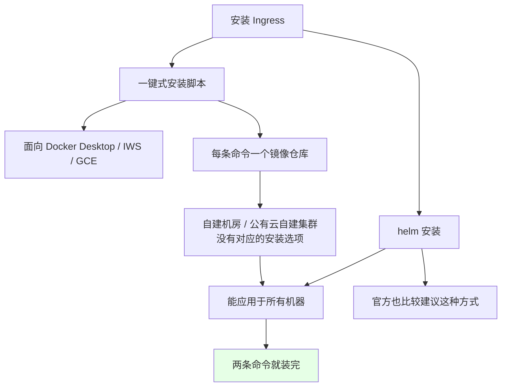
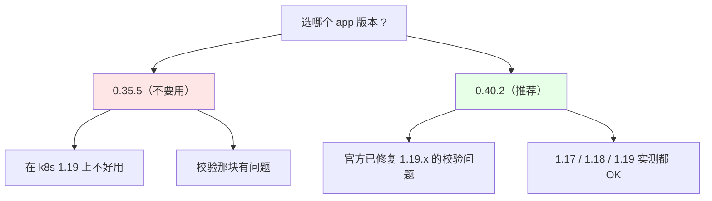
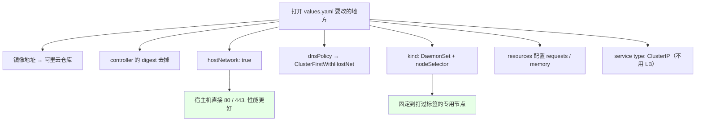
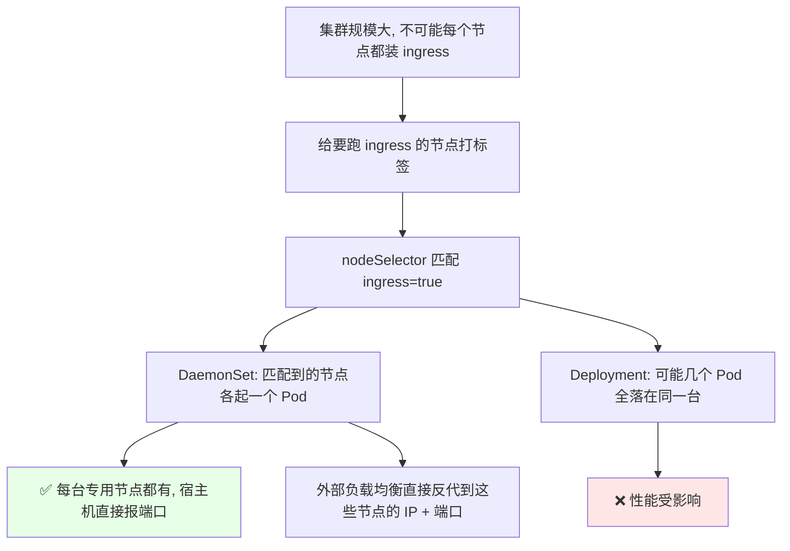
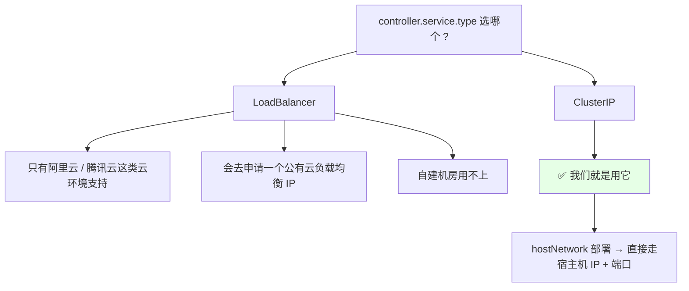
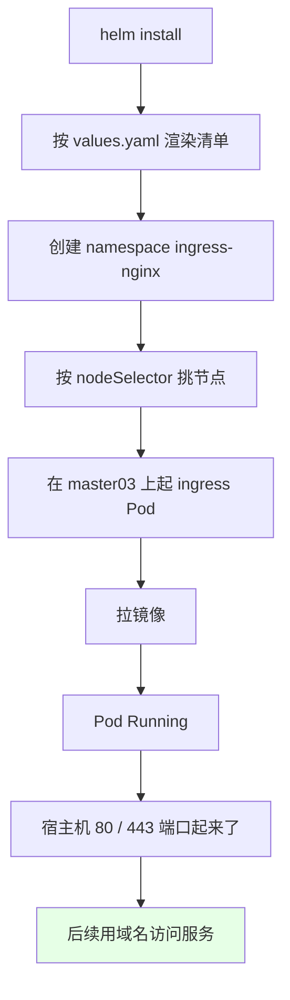

# Kubernetes 集群部署: 使用 Helm 安装 Ingress（ingress-nginx 的 values 改造与 DaemonSet 部署）

Ingress 的概念讲完了，这一节动手把它装进集群。**官方文档现在最新版本的 ingress 都已经建议使用 helm 安装**了 —— 我们也用 helm。

结论先摆：

1. **自己维护的 k8s（机房自建 / 公有云上自建）不能用「一键式一条命令」的安装包** —— 那些包是按 Docker Desktop、IWS、GCE 做的，没有针对自建集群的安装选项；**helm 可以应用在所有的机器上，这是官方比较建议的方式**；
2. **helm 客户端不用装进集群**，找一台能和 k8s 通讯的服务器装就行；
3. **版本别踩 0.35.5**：它在 k8s 1.19 上有问题（校验那块报错），**建议用 0.40.2 以上**，官方已经把 1.19.x 的校验问题修了，0.40.2 在 1.17 / 1.18 / 1.19 都实测过；
4. **values.yaml 要改四处**：镜像地址换阿里云、开 `hostNetwork`、`dnsPolicy` 改成 `ClusterFirstWithHostNet`、`nodeSelector` 把 ingress 固定到专用节点；
5. **部署方式推荐 DaemonSet 而不是 Deployment** —— Deployment 随机调度可能几个 Pod 全挤在同一台宿主机上，DaemonSet 才能保证每台专用节点都有一个、并且直接在宿主机上报端口。

## 纲要

- 为什么用 helm 而不是一键脚本
- 安装 helm 客户端
- 添加 ingress-nginx 仓库并看版本
- 版本选择：0.40.2 与 1.19 的坑
- 把 chart 包拉下来解压
- values.yaml 逐处改造
- 创建 namespace 与打节点标签
- helm install 部署
- 验证与收尾

## 为什么用 helm 而不是一键脚本



一键式安装脚本看着省事，但它是**为 Docker、IWS、GCE 这些环境做的**，每个环境一条不同的命令。我们自维护的 k8s —— 可能在自己机房搭的，也可能在某台公有云上搭的 —— **没有针对这种自建方式的安装选项**。所以还是用 helm，它一处配置能通吃所有机器。

## 安装 helm 客户端

```text
 helm 客户端安装步骤:

1. 下载 helm 的 gz 包
2. 解压 → 得到 linux-amd64/ 目录
3. 目录里的二进制文件就是 helm
4. 把二进制文件移动到 /usr/local/bin/
5. 任意目录执行 helm version 验证
```

```bash
# 1. 下载（这里给的是 3.3.3，装最新版也可以）
curl -fsSL https://get.helm.sh/helm-v3.3.3-linux-amd64.tar.gz -o helm.tar.gz

# 2. 解压
tar -zxvf helm.tar.gz

# 3. linux-amd64 目录里有一个二进制文件
ls -l linux-amd64/
# -rwxr-xr-x  1 root root .... linux-amd64/helm

# 4. 移过去
mv linux-amd64/helm /usr/local/bin/

# 5. 验证
helm version
# v3.3.3 + gogoprotobuf
```

- 装完 `helm version` 能看到版本（这里是 **3.3.3**，装个最新版也行）；
- **如果你的机器不是 amd64 架构，要去下对应架构的包，别下错**；
- 这个客户端**不需要塞进 k8s 集群里**，随便找一台**能和 k8s 通讯**的服务器装上就行。

## 添加 ingress-nginx 仓库并看版本

```bash
# 1. 添加一个 ingress 的仓库
helm repo add ingress-nginx https://kubernetes.github.io/ingress-nginx

# 2. 看看已经有哪些 helm 仓库
helm repo list

# 3. 搜一下 ingress 的包
helm search repo ingress-nginx
# NAME                            CHART VERSION   APP VERSION   DESCRIPTION
# ingress-nginx/ingress-nginx     3.6.0           0.40.2        Ingress controller ...
```

可以看到 **chart 版本 3.6.0，app 版本 0.40.2**。

### 版本选择：0.40.2 与 1.19 的坑



| 版本 | 在 k8s 1.19 上的表现 |
| --- | --- |
| **0.35.5** | **不推荐**，实测在 1.19 上有问题，校验流程报错 |
| **0.40.2** | **推荐**，官方升级后已解决 1.19.x 的问题；1.17 / 1.18 / 1.19 都试过没毛病 |

课程录制的时点看到的是 0.40.2，**这个版本建议在 k8s 1.17 / 1.18 / 1.19 上直接用**。你看到这篇博客时版本可能已经更高 —— 高版本功能更全、稳定性更好，用最新版也无所谓。

另外一个要注意的点：**admissionWebhook 这个准入控制**，低版本（比如 0.35.5 那档）在 k8s 1.19 上设进去会**报证书不对**；0.40.0 之后就没有这个问题了，**所以不要部署太低版本的**。

## 把 chart 包拉下来解压

官方直接给的是 `helm install` 一条命令装完，但**我们要改参数，所以不能直接用那条命令** —— 先把包下载下来。

```bash
# 1. 把 ingress-nginx 的安装包下载到当前目录
helm pull ingress-nginx/ingress-nginx

# 2. 当前目录会多一个包（这里显示 3.0.0，和仓库里查到的 chart 版本对应）
ls -l ingress-nginx-3.0.0.tgz

# 3. 挪到一个目录里解压
mkdir -p /tmp/ingress
mv ingress-nginx-3.0.0.tgz /tmp/ingress/
cd /tmp/ingress && tar -zxvf ingress-nginx-3.0.0.tgz

# 4. 解压出来的目录里就是 chart
ls
# ingress-nginx/
# └── values.yaml   ← 配置文件就在这里
```

## values.yaml 逐处改造



### 第一处：镜像地址

```text
镜像地址改造:

原值 (国内访问不了 gcr.io):
  repository: k8s.gcr.io/ingress-nginx/controller
  digest: sha256:xxxx...

改后 (改成已同步好的阿里云镜像仓库):
  repository: registry.cn-hangzhou.aliyuncs.com/xxx/controller
  # 把 controller 这个名字留着
  # 把 sha256 摘要值 (digest) 去掉
```

- 国内服务器**访问不到 gcr 的镜像**，国外服务器可以，那就忽略这一处；
- 国内的话把镜像地址**改成阿里云镜像仓库**（我把镜像下载下来同步到阿里云仓库了）；
- **注意把 `controller` 这个名字留着，把 sha256 摘要值去掉** —— digest 指向的是 gcr 上的镜像，换了仓库以后对不上；
- 第二处**默认的 backend 镜像也一样换成阿里云的**，这样拉镜像会快很多。

### 第二处：hostNetwork

```yaml
# 推荐用 hostNetwork 部署
controller:
  hostNetwork: true
```

**hostNetwork 是直接使用宿主机的端口号，性能会比较好一点**，推荐使用这种方式部署 ingress。

### 第三处：dnsPolicy

```yaml
controller:
  hostNetwork: true
  dnsPolicy: ClusterFirstWithHostNet
```

> **用了 `hostNetwork` 就必须把 DNS 策略设成 `ClusterFirstWithHostNet`**，要不然 ingress 里面**解析不了 k8s 内部的 Service 名**（解析不到内部 service 的 ClusterIP）。这个前面讲 Pod / DNS 的章节讲过，忘了可以回去翻。

### 第四处：DaemonSet + nodeSelector

```yaml
controller:
  kind: DaemonSet          # 推荐用 DaemonSet 部署
  hostNetwork: true
  dnsPolicy: ClusterFirstWithHostNet
  nodeSelector:
    ingress: "true"        # 只部署在打了这个标签的节点上
```



- 生产环境**不需要在每个节点上都部署 ingress**，要**固定到指定的某几个节点**（比如集群里有几个节点专门跑 ingress）；
- **推荐 DaemonSet 而不是 Deployment**：
  - Deployment 是随机调度的，**有可能几个 Pod 全落在同一台宿主机上**；
  - DaemonSet 更可控，匹配到标签的节点各起一个，顺带**直接在宿主机上报了端口号**；
  - 外部负载均衡就能直接反代到 ingress 所在节点的 IP + 端口；
  - 用 Deployment 的话暴露 nodePort，性能可能会受影响。

### 第五处：resources

```yaml
controller:
  resources:
    requests:
      cpu: 300m
      memory: 500Mi
    limits:
      cpu: "1"
      memory: 1000Mi
```

- 生产环境**最好配置一下 requests 和 memory**，结合后面 QoS 那章的配置方法一起调；
- 如果是**专用节点**，也可以不限制，让它吃满这台机器的资源 —— 但**也要给宿主机本身留一些余量**；
- 这个东西是 **k8s 的入口，一般要给大一点，不能给太小**。

### 第六处：service type 用 ClusterIP，不用 LoadBalancer



- **LoadBalancer 只有支持的云环境才可以用**（阿里云、腾讯云会真的申请一个公有云 IP，再把域名解析到这个 LB IP），**自建机房用不上**；
- 我们这种部署直接用 **ClusterIP 就行** —— 因为走的是 hostNetwork，**直接通过宿主机 IP 和端口就能访问**；
- 如果是在云上且需要，可以把域名解析到公有云 LoadBalancer 的那个 IP 上。

其他参数（`securityContext` 之类）前面都讲过，**按自己需要配，一般不用改**。

## 创建 namespace 与打节点标签

```bash
# 1. 创建一个 namespace（建议 ingress 单独放一个，比如 ingress-nginx）
kubectl create namespace ingress-nginx

# 2. 看节点列表，挑一台想跑 ingress 的（比如 master03）
kubectl get nodes

# 3. 给这个节点打标签 —— 前面 values 里匹配的就是它
kubectl label node master03 ingress=true

# 4. 确认标签打上了
kubectl get nodes --show-labels | grep ingress
# k8s      master03   Ready   ...  ingress=true
```

> 生产环境**并不是每个节点都要部署 ingress**，所以要指定节点：先给节点打标签，再在部署文件里匹配这个标签就行。

## helm install 部署

```bash
# 用 helm 在 ingress-nginx 这个 namespace 里安装
helm install ingress-nginx ingress-nginx/ingress-nginx \
  --namespace ingress-nginx \
  -f /tmp/ingress/ingress-nginx/values.yaml \
  --set controller.hostNetwork=true

# 这个过程可能有点慢，耐心等一下
```



## 验证与收尾

```bash
# 1. 看 Pod 起来没（正在创建 / 正在拉镜像，等一会儿）
kubectl get pod -n ingress-nginx
# NAME                             READY   STATUS    RESTARTS   AGE
# ingress-nginx-controller-xxxxx   0/1     ContainerCreating   0   20s
# ingress-nginx-default-backend-xxxxx   1/1   Running   0   20s

# 2. 看落在哪个节点（应该是打了 ingress=true 的那台）
kubectl get pod -n ingress-nginx -o wide

# 3. 阿里云的镜像还是比较快的, 一会儿就拉完了
kubectl get pod -n ingress-nginx -w
```

- 安装完成以后会提示你可以用 `kubectl create ingress xxx` 去创建 —— 那部分**下一节讲**；
- 如果拉的镜像慢，**那就说明你装的不是那个版本** —— 去把那个版本的镜像同步到你自己的镜像仓库（生产环境**一定要把镜像放到公司的 harbor 或其他镜像仓库**，然后把地址改掉，这步别忘）；
- 其他镜像仓库里没有你装的版本的话，可以把 GCR 上的镜像同步到自己的仓库里再用。

```text
生产环境收尾检查清单:

├── 镜像地址全部换成本公司镜像仓库 (controller + default backend)
├── digest (sha256 摘要) 已经去掉
├── hostNetwork: true + dnsPolicy: ClusterFirstWithHostNet 成对出现
├── 节点标签打好了 (kubectl label node <节点> ingress=true)
├── nodeSelector 匹配到专用节点
├── DaemonSet 生效, 每台专用节点各一个 Pod
├── resources 的 requests / limits 配了, 入口给得够大
├── service type 是 ClusterIP (自建机房)
├── 镜像推到公司 harbor, 地址改成本仓地址
└── ingress-nginx namespace 单独隔离
```

## API 速览

| 能力 | 做法 | 关键点 |
| --- | --- | --- |
| 装 helm 客户端 | 下 gz 包 → 解压 → 移二进制到 `/usr/local/bin` | 不用装进集群，能连 k8s 即可 |
| 验证 helm | `helm version` | 3.3.3 / 最新版都行，按架构选包 |
| 加仓库 | `helm repo add ingress-nginx https://kubernetes.github.io/ingress-nginx` | 仓库名和 chart 名都叫 ingress-nginx |
| 看仓库 | `helm repo list` / `helm search repo ingress-nginx` | 能查到 chart 3.6.0 / app 0.40.2 |
| 拉包改参 | `helm pull ingress-nginx/ingress-nginx` + `tar -zxvf` | 官方 `helm install` 一条命令不方便改参数 |
| 版本选择 | 用 **app 0.40.2 以上** | 0.35.5 在 1.19 上校验报错 |
| 改镜像 | values 里 repository 换阿里云 / 公司仓库 + 去掉 digest | 国内访问不了 gcr.io |
| 提升性能 | `hostNetwork: true` | 直接用宿主机端口 |
| DNS 配套 | `dnsPolicy: ClusterFirstWithHostNet` | 不开就解析不了内部 Service |
| 固定节点 | `kind: DaemonSet` + `nodeSelector: {ingress: "true"}` | Deployment 会挤在同一台 |
| 打标签 | `kubectl label node <节点> ingress=true` | 生产不必每节点都装 |
| 资源 | `resources.requests` / `limits` | 入口要给大一点 |
| 云环境可选 | service type `LoadBalancer` | 自建机房用 ClusterIP |
| 部署 | `helm install ingress-nginx <包名> -n ingress-nginx -f values.yaml` | -f 指定改过的 values |

## Demo 示例

```bash
# 1. 安装 helm 客户端（amd64 示例）
curl -fsSL https://get.helm.sh/helm-v3.3.3-linux-amd64.tar.gz -o helm.tar.gz
tar -zxvf helm.tar.gz
mv linux-amd64/helm /usr/local/bin/
helm version

# 2. 添加仓库并查看版本
helm repo add ingress-nginx https://kubernetes.github.io/ingress-nginx
helm repo update
helm repo list
helm search repo ingress-nginx

# 3. 拉包解压
helm pull ingress-nginx/ingress-nginx
mkdir -p /tmp/ingress && mv ingress-nginx-3.0.0.tgz /tmp/ingress/
cd /tmp/ingress && tar -zxvf ingress-nginx-3.0.0.tgz
vim ingress-nginx/values.yaml
```

```bash
# 4. 准备节点
kubectl create namespace ingress-nginx
kubectl get nodes
kubectl label node master03 ingress=true
kubectl get nodes --show-labels | grep ingress

# 5. 安装（带 -f 指定改过的 values）
helm install ingress-nginx ingress-nginx/ingress-nginx \
  --namespace ingress-nginx \
  -f /tmp/ingress/ingress-nginx/values.yaml

# 6. 观察
kubectl get pod -n ingress-nginx -w
kubectl get pod -n ingress-nginx -o wide
kubectl get svc -n ingress-nginx

# 7. 看一眼改完的 values 关键片段
grep -n -E "hostNetwork|dnsPolicy|kind:|nodeSelector" /tmp/ingress/ingress-nginx/values.yaml
```

```text
8. values.yaml 里这几个 key 的层级（controller 下面）:

controller:
├── image:
│   ├── repository: registry.cn-hangzhou.aliyuncs.com/xxx/controller   ← 改这里
│   └── digest: ""                                                      ← 摘要去掉
├── hostNetwork: true          ← 必须配
├── dnsPolicy: ClusterFirstWithHostNet   ← 必须配, 成对出现
├── kind: DaemonSet            ← 推荐
├── nodeSelector:
│   └── ingress: "true"        ← 匹配打过标签的节点
├── resources:
│   ├── requests: { cpu, memory }
│   └── limits: { cpu, memory }
└── service:
    └── type: ClusterIP        ← 自建机房不要 LoadBalancer
```

### 总结

- **自建集群就用 helm**：一键式安装包是给 Docker / IWS / GCE 做的，没有针对机房自建或公有云自建集群的选项，helm 通吃所有机器，也是官方建议的方式；
- **helm 客户端装在哪都行**，找一台能连通 k8s 的机器，下 gz 包解压把二进制移到 `/usr/local/bin`，`helm version` 验证（注意按 CPU 架构选包，别下错 amd64）；
- **版本选 0.40.2 起步**：0.35.5 在 k8s 1.19 上校验会报错，官方升级后已修复 1.19.x 的问题，0.40.2 在 1.17 / 1.18 / 1.19 实测都没问题，`admissionWebhook` 那个准入控制在 0.40.0 之后才不报证书错；
- **values.yaml 六处必改**：镜像地址换阿里云（controller 名字留着、sha256 摘要去掉）、`hostNetwork: true`、`dnsPolicy: ClusterFirstWithHostNet`（两者必须成对，否则解析不了内部 Service）、`kind: DaemonSet` 加 `nodeSelector`、`resources` 配好、`service.type` 用 ClusterIP（自建机房别用 LoadBalancer）；
- **用 DaemonSet + 节点标签把 ingress 固定到专用节点**，别用 Deployment（随机调度会把几个 Pod 挤在同一台宿主机上），宿主机上直接报 80 / 443，外部负载均衡反代过来就行；
- **生产收尾别忘了把镜像推到公司自己的镜像仓库并改掉地址**，拉镜像慢多半就是版本或仓库没对上。

