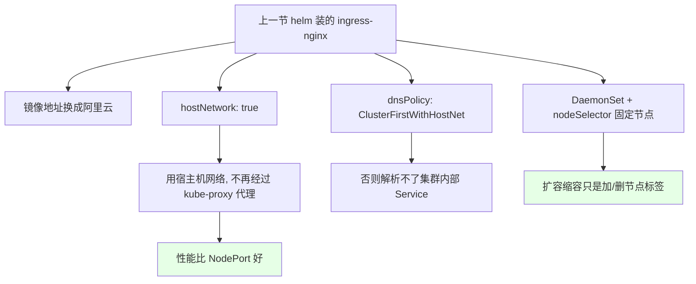
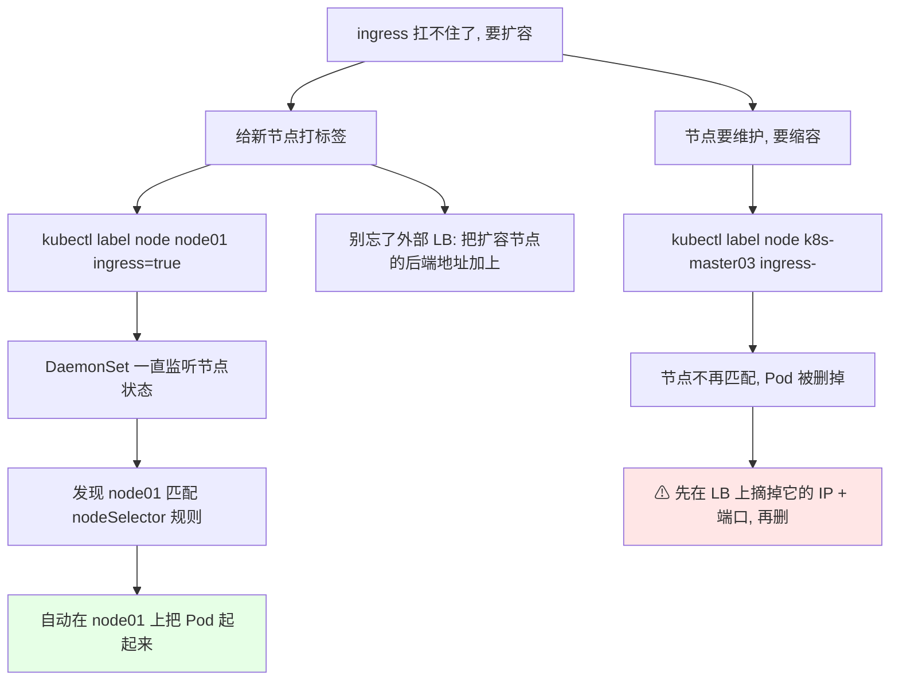
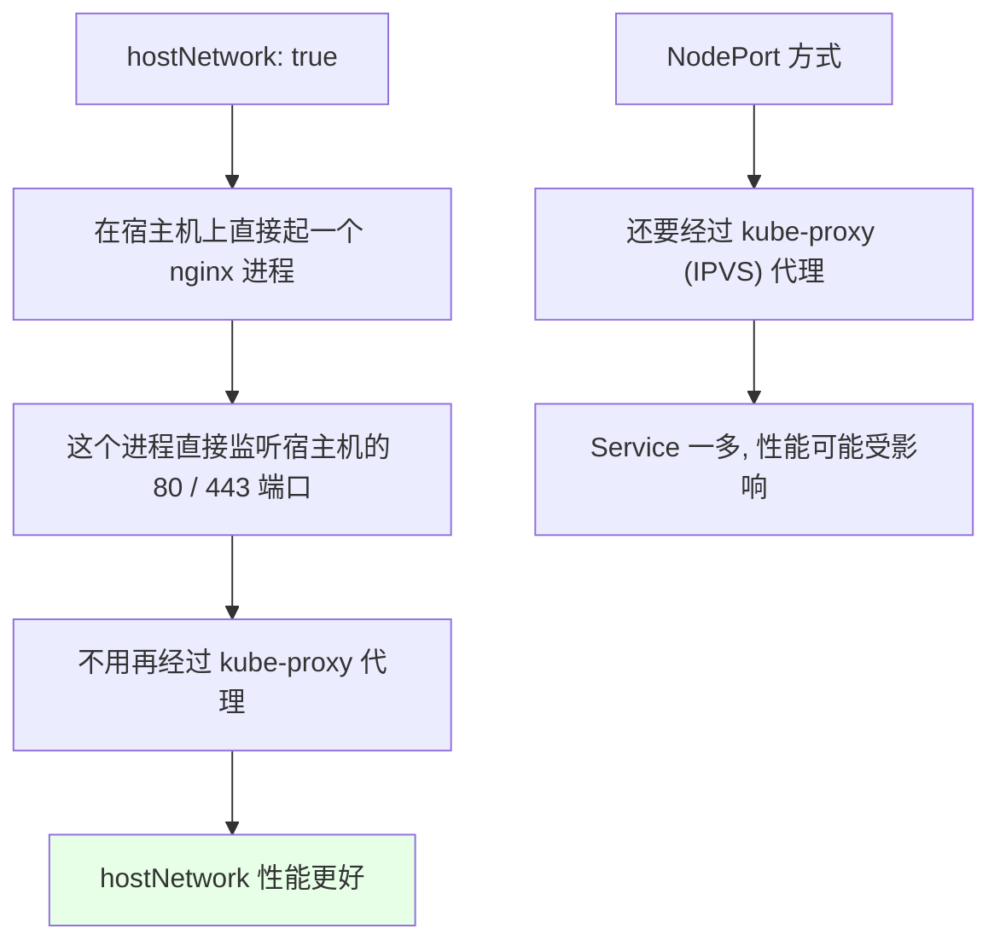
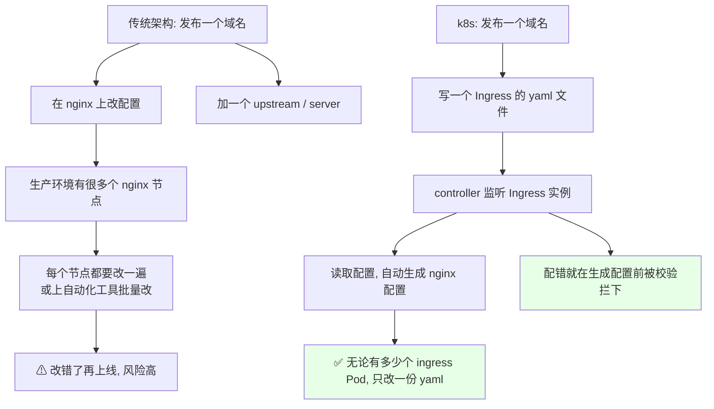
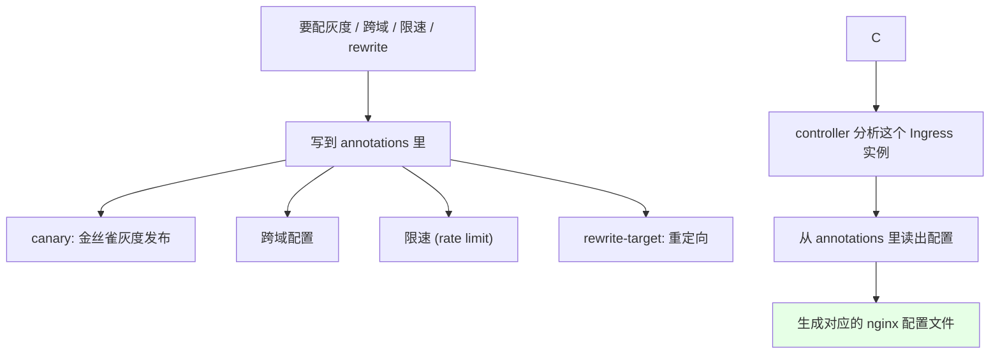
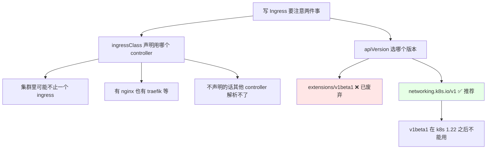
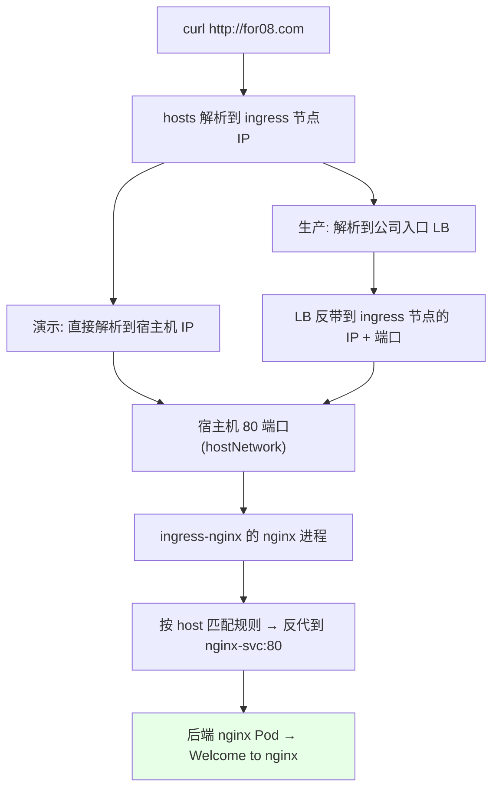
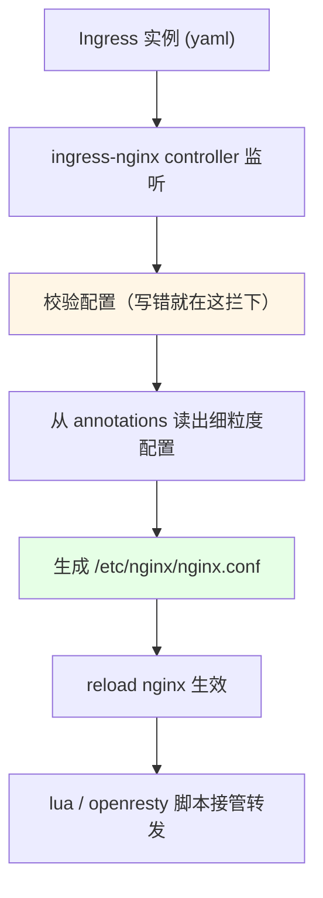

# Kubernetes 集群部署: Ingress 简单使用（用域名发布一个 Service 的完整流程）

上一节用 helm 把 ingress-nginx 装好了，改了镜像地址、`hostNetwork: true`、`dnsPolicy: ClusterFirstWithHostNet` 这几处。这一节就上手**用域名把一个 Service 发布出去**。

结论先摆：

1. **Ingress 也是一种资源类型**，和 Deployment / DaemonSet 一样靠 yaml 声明 —— **不管集群里起了多少个 ingress Pod，只改一份 yaml，controller 会自动把它翻译成 nginx 配置**，再也不用逐个节点改 nginx.conf；
2. **controller 带校验**：yaml 写错或配得不对，**生成配置之前就被拦下并报错**，不会带着错配置上线，也不会影响正在跑的服务；
3. **所有细粒度配置都写在 `annotations` 里**（灰度、跨域、限速、rewrite……），**你完全不用会写 nginx 配置**，只要找到对应的 annotation 项；
4. **`apiVersion` 别再写 `extensions/v1beta1`**（1.22 就废了），用 `networking.k8s.io/v1`；但要注意**老 controller 可能不支持 v1**，写法和 v1beta1 不一样；
5. **Ingress 和 Service 必须在同一个 namespace**，这也正是 ingress 比裸 nginx 好管的关键：**按 namespace 隔离**，上百上千个域名直接按项目找。

## 纲要

- 先回顾 helm 那几处改动
- DaemonSet + nodeSelector 的扩容与缩容
- 扩容缩容的顺序坑：先摘 LB 再摘节点
- hostNetwork 下的 nginx 进程长什么样
- 传统架构 vs k8s：为什么不用逐台改 nginx
- annotations 是 ingress 的配置入口
- 写一个最简单的 Ingress 发布 nginx 服务
- ingressClass 与 API 版本选择
- 域名没有 DNS：改 hosts 验证
- 看看它到底生成了什么 nginx 配置

## 先回顾 helm 那几处改动



## DaemonSet + nodeSelector 的扩容与缩容



```bash
# 1. 扩容: 找一个新节点打上标签（比如 node01）
kubectl label node node01 ingress=true

# 2. DaemonSet 会自动在 node01 上补一个 ingress Pod
kubectl get pod -n ingress-nginx -o wide
# ingress-nginx-controller-xxxxx   1/1   Running   0   10s   node01

# 3. 缩容: 把标签摘掉（这里是 master03）
kubectl label node k8s-master03 ingress-

# 4. 标签没了, 它不再匹配 nodeSelector, Pod 就会被删掉
kubectl get pod -n ingress-nginx -o wide
```

标签那套语法（label、label selector）前面章节讲过。

### 扩容缩容的顺序坑

> **摘节点之前，一定先在集群外的 LB（或 SLB）上把这台节点的 IP + 端口剔除掉，然后再删标签 / 删 Pod。** 顺序反了会出现服务宕机、服务不稳定。

```text
正确顺序 vs 错误顺序:

✅ 正确:
  1. LB 上摘掉 master03 的后端 IP:端口
  2. kubectl label node k8s-master03 ingress-
  3. Pod 被 DaemonSet 回收

❌ 错误:
  1. kubectl label node k8s-master03 ingress-    ← Pod 先没了
  2. 再去 LB 上摘                                 ← 这中间有空窗期
  3. 用户请求打到已摘掉 / 已销毁的节点 → 服务不稳定
```

扩容完同样要注意：**去 LB / SLB 的后端地址列表里把新节点加上**，不然新 Pod 起来了但入口还是在转发到老节点。

## hostNetwork 下的 nginx 进程长什么样

```bash
# 进到 node01（或者 master03）上看进程
ps -ef | grep nginx
# nginx: master process /usr/sbin/nginx -c /etc/nginx/nginx.conf
# nginx: worker process

ps -ef | grep ingress-nginx-controller
# ingress-nginx-controller ... 
```



ingress 内部就是 **nginx + openresty** 实现的，所以在宿主机上能直接看到 nginx 进程在监听。**hostNetwork 用的是宿主机网络，不会再经过一层代理**；而 NodePort 是走 kube-proxy 转发的，Service 数量一多性能会受影响 —— 所以 hostNetwork 会更好一点。

## 传统架构 vs k8s：为什么不用逐台改 nginx



- 传统架构：在 nginx 上改配置、加一个 `server` 或 `upstream`；**生产里 nginx 节点很多，每次改配置每一台都得改**（或者上自动化工具批量改），改错了再上线风险很高；
- k8s 里：**Ingress 和 Deployment / DaemonSet 一样是资源类型**，通过 yaml 文件声明一个 Ingress 实例；
- **无论你起了多少个 ingress 的 Pod，只需要创建一个 yaml 文件** —— controller 会监听这个 Ingress 实例、读取里面的配置、自动生成到 nginx 的配置文件里，**无需逐个改 controller 的配置**；
- **Ingress controller 还带校验**：yaml 写错或者配得不对，**在生成配置文件之前就会校验**，不会应用、也不会影响现有服务，直接把「这里配错了」反馈给你。

## annotations 是 ingress 的配置入口



- 配置**一般写在这个 ingress 的 `annotations`（注释项）里面**，controller 会分析这个 Ingress 实例，从 annotations 读出来配置，再生成对应的 nginx 配置；
- 常见配置项：金丝雀灰度发布（canary）、**跨域配置**、**限速配置**、重定向（rewrite）；
- **你不需要会写 nginx 配置** —— 只要找到对应的 annotation 项，把它写进去就完事。以限速为例，只需要在 annotation 里加一个注释项就达到限速效果；
- 重定向那个例子长这样：匹配 path 后面的第二段（`$2`），重定向到 `/ABC` —— 这个能力后面可以用来做**前后端分离**。

> 这一节只是**入门认识一下**服务发布的流程，后面还有专门章节讲怎么用它应对各种场景。

## 写一个最简单的 Ingress 发布 nginx 服务

我们之前创建了 nginx 的 Service（用 NodePort 能访问到），但**用 IP + 端口这种形式非常不建议**，所以配置一个 Ingress 通过域名访问。

```bash
# 1. 先确认这个 Service 是通的
kubectl get svc nginx-svc
kubectl get pod -n default -o wide
```

> **注意：Ingress 需要和你的 Service 在同一个 namespace 下。** 这也是 ingress 的一大好处 —— 用裸 nginx 管上百上千个域名时找一个域名特别麻烦；ingress 有 **namespace 隔离**，只要找到项目对应的 namespace，`kubectl get ingress -n <命名空间>` 直接就看到了。

```yaml
apiVersion: networking.k8s.io/v1
kind: Ingress
metadata:
  name: ngx-ingress
  namespace: default
  annotations:
    kubernetes.io/ingress.class: nginx
spec:
  rules:
  - host: for08.com
    http:
      paths:
      - path: /
        pathType: Prefix
        backend:
          service:
            name: nginx-svc
            port:
              number: 80
```

几个字段说清楚：

| 位置 | 写法 | 说明 |
| --- | --- | --- |
| `metadata.annotations` | `kubernetes.io/ingress.class: nginx` | 声明我这个实例用的是 **nginx 这个 ingressClass** |
| `spec.rules[].host` | `for08.com` | 要发布的域名，**一个 Ingress 可以配多个 host**（复制一份改个域名即可） |
| `spec.rules[].http.paths[]` | `path: /` | 相当于 nginx 的 `location`，**同一个 host 可以配多个 path** |
| `backend.service.name` | `nginx-svc` | 要代理到哪个 Service |
| `backend.service.port.number` | `80` | **写 Service 端口 80，不要写三万一千（NodePort）那一段** |

- `host` 也可以不写（匹配所有域名反代），**但这样不推荐**，实际都用固定域名；正则形式（比如 `*.abc.com`）也可以写；
- `path` 同一个 host 下能配多个：比如 `/` 反代到 A 服务、`/abc` 反代到 B 服务，这就是 nginx 里 `location` 的用法；
- 一个 Ingress 里可以配多个 `host`，复制一份改域名就行（横杠代表切片/多值，写法是固定的）。

## ingressClass 与 API 版本选择



### ingressClass 有什么用

**集群里可能不止一个 ingress**（比如 nginx 的和 traefik 的），写了 `kubernetes.io/ingress.class: nginx` 就是**声明我这个配置要交给 nginx 这个 ingressClass 去解析，其他的解析不了**。

### API 版本

```text
三种写法, 只用后两种:

❌ extensions/v1beta1
   最一开始的写法, 已经废弃, 不要再写
   (虽然还能被解析, 但官方不推荐了)

❌ networking.k8s.io/v1beta1
   过渡版本, 也不推荐

✅ networking.k8s.io/v1
   1.19 之后建议使用, 我们这份就是 v1
   最新版的 ingress-nginx 支持 v1
   但老 controller 有可能不支持 v1, 要确认
   v1 的配置写法和 v1beta1 有区别
```

- `ipadworning` 那类老写法（`extensions/v1beta1`）**在 k8s 1.22 之后会被废弃掉**，现在建议直接写 `networking.k8s.io/v1`；
- 用 `networking.k8s.io/v1` 时**你的 controller 可能不支持 v1** —— 这次装的是最新版的 ingress-nginx，它是支持 v1 的，但要注意**你用的那个 controller 版本要能认**；
- v1 和 v1beta1 的字段写法不一样（v1 是 `backend.service.name` + `backend.service.port.number`，v1beta1/老写法是 `serviceName` + `servicePort`），后面专门讲 ingress-nginx 那节会细讲区别。

## 域名没有 DNS：改 hosts 验证

```bash
# 1. 创建 Ingress
kubectl apply -f ngx-ingress.yaml

# 2. 看状态（v1beta1 会提示将被废弃，让我们用 v1）
kubectl get ingress
# NAME         CLASS   HOST         ADDRESS          PORTS   AGE
# ngx-ingress  nginx   for08.com    192.168.31.11   80      10s
```

域名没有 DNS 解析，那就**改 hosts 文件**。注意：

```text
hosts 解析（演示环境）:

# 直接解析到 ingress 所在节点的 IP
192.168.31.11  for08.com
```

- **演示环境**：直接把域名解析到 ingress 所在节点的 IP 上就行；
- **生产环境**：你们买的域名**做一个 DNS 解析，解析到公司入口的 LB 上**（LB 是有地址的），**LB 再反带到 k8s ingress 节点的 IP + 端口**上。

```bash
# 3. 在本机加上 hosts 条目（演示用）
echo "192.168.31.11 for08.com" >> /etc/hosts

# 4. 访问
curl http://for08.com
# <title>Welcome to nginx!</title>
```



已经到后端服务了 —— **这就是最推荐的生产常用发布方式**。

## 看看它到底生成了什么 nginx 配置

```bash
# 1. 找到 ingress controller 的 Pod
kubectl get pod -n ingress-nginx -o wide

# 2. 进容器看生成的 nginx.conf（过滤一下这个域名）
POD=$(kubectl get pod -n ingress-nginx -l app=ingress-nginx -o jsonpath='{.items[0].metadata.name}')
kubectl exec -it -n ingress-nginx $POD -- grep -A 20 "server_name for08.com" /etc/nginx/nginx.conf
```

生成出来的东西长这样，**跟你手写 nginx 配置是一模一样的**：

```text
ingress-nginx 自动生成的配置片段:

server {
    server_name for08.com;

    location / {
        set $upstream_name "default-nginx-svc-80";
        ...
        proxy_set_header Host $host;
        proxy_pass http://$upstream_name;
    }
}
```



- 这里配的 service 名叫 `for08.com` 那段的 `server`，它**反代到 `default` namespace 下的 `nginx-svc` 这个 Service，端口 80**；
- 这套配置是用 **lua 脚本（openresty 用 lua 写的）** 实现的，所以配置里能看到 lua 的格式，但整体你基本都能看懂 —— 这就是一个 `location`、一个 `server`；
- **你不用再一个个维护配置文件了，只要用 yaml 声明就行** —— 这就是 ingress 实现的域名发布方式，**生产中最常用、也是推荐的方式**。

## API 速览

| 能力 | 做法 | 关键点 |
| --- | --- | --- |
| 扩容 ingress | `kubectl label node <节点> ingress=true` | DaemonSet 自动在新节点补 Pod |
| 缩容 ingress | `kubectl label node <节点> ingress-` | 标签没了 Pod 就被回收 |
| **缩容顺序** | **先在 LB 摘掉 IP + 端口，再删标签** | 反了会服务不稳定 |
| 扩容后 | 去 LB / SLB 后端列表加新节点 | 新 Pod 起来了入口也要跟进 |
| 看 nginx 进程 | `ps -ef | grep nginx`（在宿主节点上） | hostNetwork 直接起在宿主机 |
| 看 controller 进程 | `ps -ef | grep ingress-nginx-controller` | nginx + openresty 实现 |
| 声明用哪个 controller | `annotations.kubernetes.io/ingress.class: nginx` | 集群里有多个 ingress 时必写 |
| 细粒度配置 | 全部写在 `metadata.annotations` | 灰度 / 跨域 / 限速 / rewrite |
| 发布域名 | `spec.rules[].host` | 一个 Ingress 可配多个 host |
| 路径规则 | `spec.rules[].http.paths[].path` | 相当于 nginx 的 location，可配多个 |
| 后端 | `backend.service.name` + `port.number` | **写 80，别写 NodePort 那一段** |
| API 版本 | `networking.k8s.io/v1` | **不要写 `extensions/v1beta1`（1.22 废弃）** |
| namespace | Ingress 与 Service 必须在同一 namespace | 也是按项目隔离的关键 |
| 本机验证 | 往 `/etc/hosts` 加一行域名 → 节点 IP | 生产走 DNS 解析到入口 LB |
| 看生成配置 | `kubectl exec -it -n ingress-nginx $POD -- grep -A 20 "server_name <域名>" /etc/nginx/nginx.conf` | controller 自动生成的 |

## Demo 示例

```bash
# 1. 记录当前 ingress 落在哪些节点
kubectl get pod -n ingress-nginx -o wide

# 2. 扩容: 给 node01 打标签
kubectl label node node01 ingress=true
kubectl get pod -n ingress-nginx -o wide
# 去 LB / SLB 后端加上 node01 的 IP + 端口

# 3. 缩容: 先摘 LB, 再摘标签
#    第一步: 在集群外 LB 上剔除 node01 的后端地址
kubectl label node k8s-master03 ingress-
kubectl get pod -n ingress-nginx -o wide

# 4. 确认原 Service 还通（用 NodePort 的端口探一下）
NODE_IP=192.168.31.11
NODEPORT=31000
curl -s -o /dev/null -w "%{http_code}\n" "http://${NODE_IP}:${NODEPORT}"
```

```bash
# 5. 创建 Ingress 发布服务
kubectl apply -f ngx-ingress.yaml
kubectl get ingress
kubectl describe ingress ngx-ingress

# 6. 本机 hosts 解析（演示用）
echo "192.168.31.11 for08.com" >> /etc/hosts
curl -s http://for08.com | head -5
# <title>Welcome to nginx!</title>

# 7. 看它生成了什么 nginx 配置
POD=$(kubectl get pod -n ingress-nginx -l app=ingress-nginx -o jsonpath='{.items[0].metadata.name}')
kubectl exec -it -n ingress-nginx $POD -- grep -A 20 "server_name for08.com" /etc/nginx/nginx.conf
```

```text
8. 一份 Ingress 承载多个域名 / 多个路径:

ngx-ingress.yaml
├── metadata.annotations
│   └── kubernetes.io/ingress.class: nginx
└── spec.rules
    ├── host: for08.com
    │   ├── path: /      → service A
    │   └── path: /abc   → service B
    └── host: other.com  → 复制一份改域名
        └── path: /      → service C

生成的 nginx 配置（controller 自动翻译）:
/etc/nginx/nginx.conf
└── http
    ├── server { server_name for08.com;  ... }   ← host 决定
    │   └── location /      → proxy_pass default-nginx-svc-80
    │   └── location /abc   → proxy_pass default-abc-svc-80
    └── server { server_name other.com;  ... }
        └── location /      → proxy_pass default-other-svc-80
```

### 总结

- **Ingress 和 Deployment / DaemonSet 一样是资源类型**，一份 yaml 声明完，controller 会**监听实例、校验、从 annotations 读配置、自动生成 `/etc/nginx/nginx.conf`** —— 不管集群里多少个 ingress Pod，**再也不用逐个节点改 nginx.conf**；
- **controller 带校验**：yaml 写错或配得不对，会在生成配置前被拦下并报错，不会带着错配置上线、也不影响现有服务；
- **细粒度配置全在 `annotations`**：灰度 canary、跨域、限速、rewrite 重定向（可做前后端分离）都往里写，**不用会 nginx 配置，只要找到对应 annotation 项**；
- **`apiVersion` 用 `networking.k8s.io/v1`**，`extensions/v1beta1` 是老写法、1.22 会废弃掉；同时要确认你的 controller 版本支持 v1（v1 的 backend 写法是 `service.name` + `service.port.number`）；用 `kubernetes.io/ingress.class: nginx` 声明交给哪个 controller 解析；
- **Ingress 必须和 Service 在同一个 namespace** —— 这正是它比裸 nginx 好管的地方：**按 namespace 隔离**，几百上千个域名按项目一找就到；`backend.service.port.number` 写 Service 的 **80**，别写 NodePort 那一段；
- **扩缩容就是给节点打标签 / 摘标签**（DaemonSet 会自动补 Pod / 回收 Pod），但**顺序一定先摘 LB 后端地址、再摘标签**，扩容完也别忘了把新节点加进 LB；宿主机上能看到 nginx 进程直接监听 80（hostNetwork 不走 kube-proxy，比 NodePort 性能好）。

