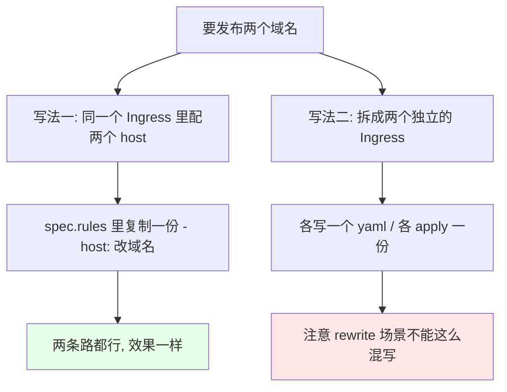
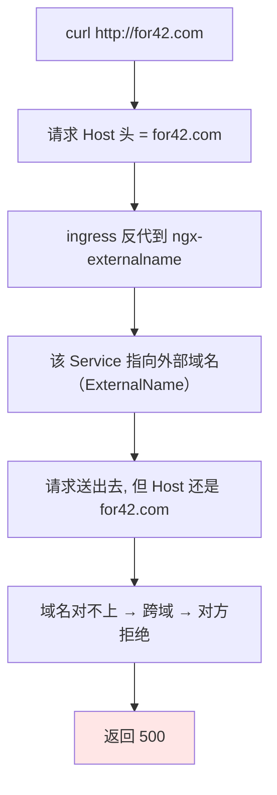
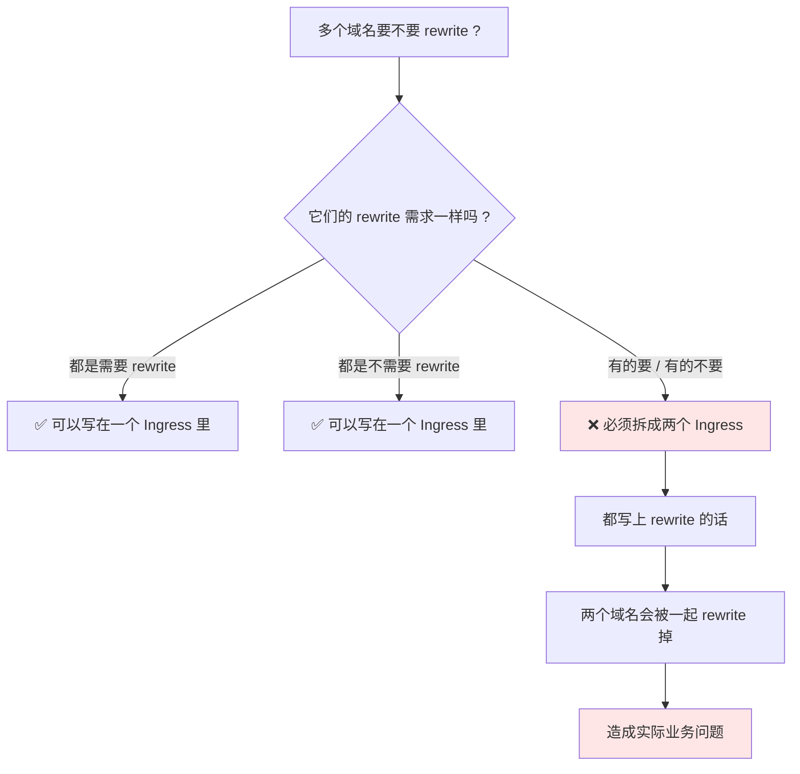

# Kubernetes 集群部署: Ingress 多域名使用（一个 Ingress 配多个 host 与 replace 更新）

上一节简单用了一次 Ingress，只配了**一个域名**。这一节讲多域名 —— 其实很简单：**把 `host` 那一段复制一份改个域名就行**。

结论先摆：

1. **多域名有两种写法**：把多个 `host` 写在**同一个 Ingress** 里，或者**拆成两个独立的 Ingress**，效果一样；
2. **更新已有 Ingress 用 `kubectl replace -f`**，不用 `create`（create 遇到已存在会直接报错）；
3. **坑在 rewrite**：**需要 rewrite 的域名和不需要 rewrite 的域名必须拆成两个 Ingress** —— 都写上 rewrite 会把两个域名一起 rewrite 掉，直接出问题；
4. **跨 namespace 时指定 `namespace` 字段**，Service 只要写名字就行；
5. **多域名确实生效了**：第二个域名反代的是外部（ExternalName）服务，实测被跨域拦下返回 500。

## 纲要

- 多域名的两种写法
- 复制一份 host 配置成第二个域名
- replace 更新 vs create
- 看 Ingress 里到底配了什么
- 实测两个域名的访问结果
- 跨域拦下来的原因
- rewrite 的拆分红线
- 写法小结

## 多域名的两种写法



| 写法 | 适合场景 | 注意点 |
| --- | --- | --- |
| **同一个 Ingress 多个 host** | 多个域名配置**都一样**（都要 rewrite 或都不 rewrite） | 复制一份 `- host:` 改域名即可 |
| **拆成两个 Ingress** | 有的要 rewrite、有的不要 | **rewrite 混写会出事，必须拆** |

## 复制一份 host 配置成第二个域名

刚才那份配置只写了一个域名，多域名就是把**这个地方复制一份**。

```yaml
apiVersion: networking.k8s.io/v1
kind: Ingress
metadata:
  name: ngx-ingress
  namespace: default
  annotations:
    kubernetes.io/ingress.class: nginx
spec:
  rules:
  - host: for08.com
    http:
      paths:
      - path: /
        pathType: Prefix
        backend:
          service:
            name: nginx-svc
            port:
              number: 80
  - host: for42.com
    http:
      paths:
      - path: /
        pathType: Prefix
        backend:
          service:
            name: ngx-externalname
            port:
              number: 80
```

几个点：

- 再起一个域名（比如 `for42.com`），**指定到另一个 Service**（这里拿之前那个 ExternalName 的 `ngx-externalname` 试，端口也是 80）；
- **只能在 `default` namespace 下这样写** —— 因为现在只创建在 default 命名空间下；**如果你创建到其他 namespace 下，指定一下 namespace 就行**，Service 名照样写短名；
- 除了 `host` 不一样，**其他配置（path、backend）都可以照抄一份再改**；
- `pathType` 后面专门有章节讲，这里先照着写 `Prefix`。

## replace 更新 vs create

```text
已经存在同名 Ingress 时怎么改 ?

kubectl replace -f ngx-ingress.yaml
  ✅ 已存在 → 直接覆盖更新, 不报错
  ✅ 不存在 → 也会创建（相当于没有 create 的报错顾虑）

kubectl create -f ngx-ingress.yaml
  ❌ 资源名已存在 → 直接报错
```

```bash
# 1. 这个 Ingress 已经有了, 要改就 replace
kubectl replace -f ngx-ingress.yaml

# 2. 看结果 —— 两个域名都在了
kubectl get ingress
# NAME         CLASS   HOST                     ADDRESS          PORTS   AGE
# ngx-ingress  nginx   for08.com,for42.com      192.168.31.11   80      5m

# 3. 导出看一下, 和配置写的是一样的
kubectl get ingress ngx-ingress -o yaml
```

`kubectl get ingress` 里 HOST 列直接把两个域名都列出来了（逗号隔开）。`kubectl get ingress -o yaml` 导出来核对，跟你自己写的那份配置是一致的。

## 实测两个域名的访问结果

```mermaid
flowchart TD
    A["配 hosts 文件"] --> B1["for08.com  →  ingress 节点 IP"]
    A --> B2["for42.com  →  ingress 节点 IP"]
    B1 --> C1["✅ 访问 for08.com → 能打开]
    B2 --> C2["❌ 访问 for42.com → 500"]
    C2 --> D1["它反代的是外部 ExternalName 服务"]
    D1 --> D2["Host 变了 → 跨域被拒"]
    D2 --> E["但配置是生效的"]
    style C1 fill:#e6ffe6
    style E fill:#fff6e6
```

```bash
# 1. 两个域名都解析到 ingress 所在节点（演示环境改 hosts）
echo "192.168.31.11 for08.com" >> /etc/hosts
echo "192.168.31.11 for42.com" >> /etc/hosts

# 2. 第一个域名 —— 通
curl -s http://for08.com
# <title>Welcome to nginx!</title>

# 3. 第二个域名 —— 返回 500
curl -s -o /dev/null -w "%{http_code}\n" http://for42.com
# 500
```

- **第一个域名的访问是可以的**；
- **第二个域名返回了 500**。

### 跨域拦下来的原因



第二个域名反代的是**外部服务**（ExternalName 类型的 Service，指向集群外的域名），所以**它不允许我们用这种形式访问** —— 和之前讲 ExternalName 时被拒是同一个道理。

验证一下：**直接请求那个外部 IP，报的也是同一个错误码**。

```bash
# 4. 直接请求外部地址, 错误码一样 → 说明多域名配置是生效的
EXT_ADDR=www.baidu.com
curl -s -o /dev/null -w "%{http_code}\n" "http://${EXT_ADDR}"
# 500

# 5. Ingress 这边的错误码也是 500 → 配置确实生效了, 不是没配上去
kubectl describe ingress ngx-ingress
kubectl get ingress ngx-ingress -o yaml
```

所以结论很清楚：**多域名配置是生效的**，只是它反代的是外部服务、被跨域卡住了。

## rewrite 的拆分红线



> **特别提醒**：写 rewrite 的时候，**需要做 rewrite 的域名，和不需要做 rewrite 的域名，要分开写成两个 Ingress**。

原因很直接：**如果你都把 rewrite 写上，两个域名会一起被 rewrite 掉**，本来不需要 rewrite 的那个就被改坏了。

- 同一类型的（**要么都是需要 rewrite 的，要么都是不需要 rewrite 的**）→ 可以写在一块；
- 需求不一样 → **必须拆开**。

```text
rewrite 拆分对照:

❌ 错误（一个 Ingress 混写）
ngx-ingress-single.yaml
├── host: a.com    → rewrite-target: /$1
└── host: b.com    → rewrite-target: /$1   ← b 本来不需要, 被一起改了

✅ 正确（拆成两个 Ingress）
├── ngx-ingress-a.yaml
│   └── host: a.com    → rewrite-target: /$1
└── ngx-ingress-b.yaml
    └── host: b.com    → 不写 rewrite-target
```

## 写法小结

```text
多域名配置的两种组织方式:

放在同一个 Ingress 里
├── 适合: 多个域名配置完全一样
├── 写法: spec.rules 下复制一份 "- host:" 改域名
└── 注意: rewrite 需求不一致时不要这么干

拆成两个 Ingress
├── 适合: rewrite 需求不一样 / 想按项目拆分
├── 写法: 两份 yaml, 各自 apply
└── 注意: 同名 Ingress 更新用 replace -f
```

另外两种玩法也可以混着来：在**同一个 host 下再配一个 path**（比如 `/` 反代 A 服务、`/abc` 反代 B 服务），**path 和 host 都能复制**，怎么方便怎么来。

## API 速览

| 能力 | 做法 | 关键点 |
| --- | --- | --- |
| 配多域名 | 同一 Ingress 的 `spec.rules` 里复制 `- host:` 改域名 | 也可以拆成两个 Ingress |
| 看有几个域名 | `kubectl get ingress` | HOST 列逗号分隔显示 |
| 核对配置 | `kubectl get ingress <名称> -o yaml` | 和你写的清单一致 |
| 更新已有 Ingress | `kubectl replace -f <文件>` | 已存在直接覆盖，不报错 |
| 创建同名会报错 | `kubectl create -f <文件>` | 资源名已存在会直接失败 |
| 跨 namespace | yaml 里指定 `metadata.namespace` | Service 仍写短名 |
| 换后端 | 复制一份把 `backend.service.name` 换掉 | 端口通常是 80 |
| path 匹配 | `spec.rules[].http.paths[].path` + `pathType` | `pathType` 后面章节细讲 |
| rewrite 限制 | **需要 / 不需要 rewrite 的域名必须拆成两个 Ingress** | 混写会一起被 rewrite |
| 本机验证 | `/etc/hosts` 把每个域名都指向 ingress 节点 IP | 生产走 DNS 解析到入口 LB |
| 排错判断 | 直接请求外部地址对比错误码 | 错误码一致说明是跨域，不是没配上 |

## Demo 示例

```bash
# 1. 已经有了一份单域名的 Ingress, 改成本文件
vim ngx-ingress.yaml
# 把 host 那段复制一份, 改域名 + 换 service

# 2. 已存在, 所以用 replace（create 会报 AlreadyExists）
kubectl replace -f ngx-ingress.yaml

# 3. 确认两个域名都在
kubectl get ingress
kubectl get ingress ngx-ingress -o yaml

# 4. 两个域名都解析到 ingress 节点（演示环境）
echo "192.168.31.11 for08.com" >> /etc/hosts
echo "192.168.31.11 for42.com" >> /etc/hosts

# 5. 逐个验证
curl -s -o /dev/null -w "for08.com => %{http_code}\n" http://for08.com
curl -s -o /dev/null -w "for42.com => %{http_code}\n" http://for42.com
```

```text
6. 需要 rewrite 与不需要 rewrite 的拆开写法:

目录结构:
├── nginx-ingress-rewrite.yaml     ← a.com 需要 rewrite
│   └── host: a.com
│       └── rewrite-target: /$1
└── nginx-ingress-plain.yaml       ← b.com 不需要 rewrite
    └── host: b.com

ngx-ingress-rewrite.yaml 的 annotations:
├── kubernetes.io/ingress.class: nginx
└── nginx.ingress.kubernetes.io/rewrite-target: /$1

ngx-ingress-plain.yaml 的 annotations:
└── kubernetes.io/ingress.class: nginx
    （不写 rewrite-target）
```

### 总结

- **多域名就是复制一份 `host`**：同一个 Ingress 的 `spec.rules` 里写多个 `- host:`，或者干脆拆成两个 Ingress，**两条路效果一样**；
- **Ingress 已存在时更新用 `kubectl replace -f`**，`create -f` 撞到同名资源会直接报错；`kubectl get ingress` 的 HOST 列会把所有域名逗号列出来，`-o yaml` 能核对配置与自己写的一致；
- **第二个域名返回 500 不是没配上** —— 它反代的是 ExternalName 的外部服务，Host 变了被跨域拒绝；直接请求那个外部地址也是同一个错误码，说明多域名配置确实生效；
- **rewrite 的红线**：需要 rewrite 的域名和不需要 rewrite 的域名**必须拆成两个 Ingress**，不然会被一起 rewrite 掉；只有「都要 rewrite」或「都不 rewrite」才能写在一块；path 和 host 一样都可以复制配置；
- **跨 namespace 时在 yaml 里指定 `metadata.namespace`**，Service 名照写短名就行；`pathType` 的具体行为留到后面专门章节讲。

