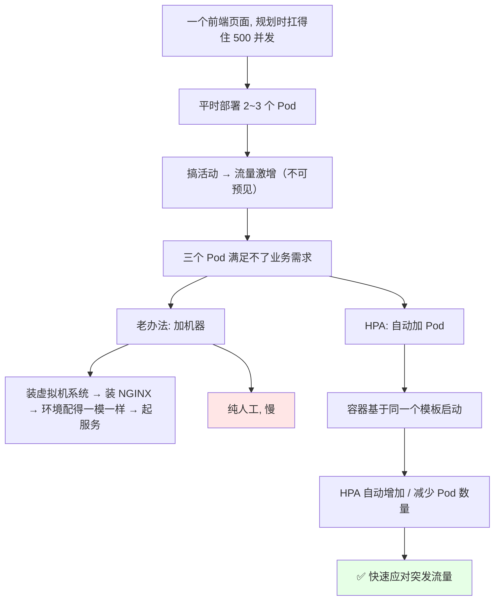
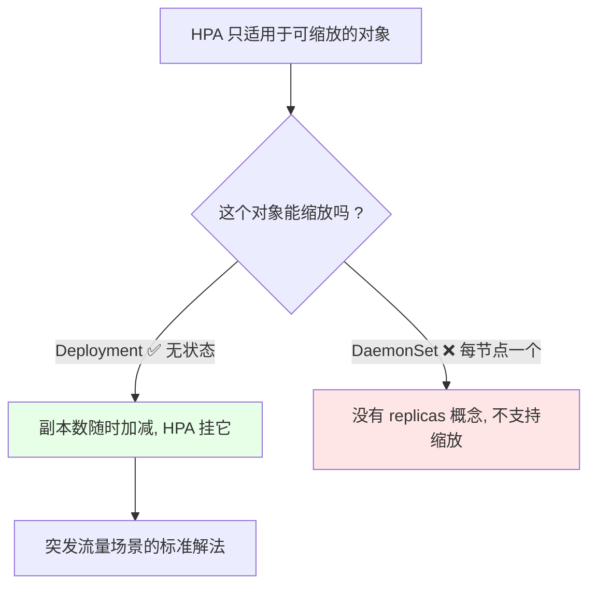
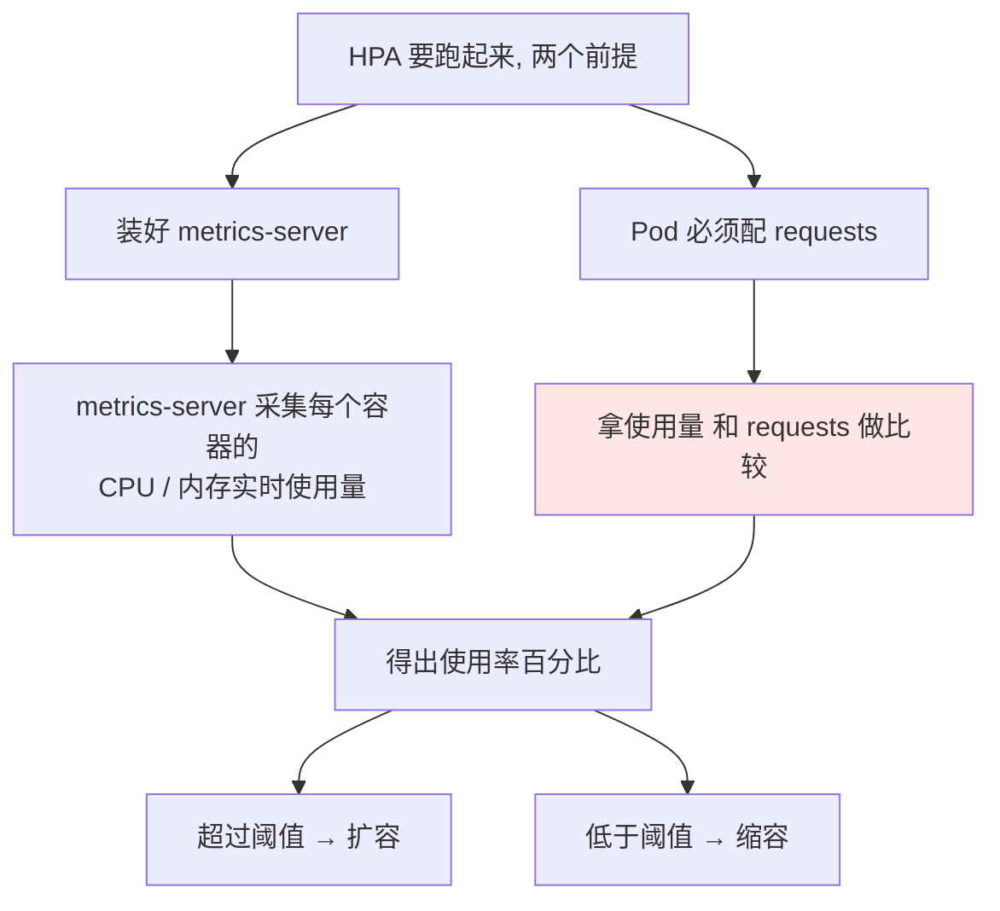
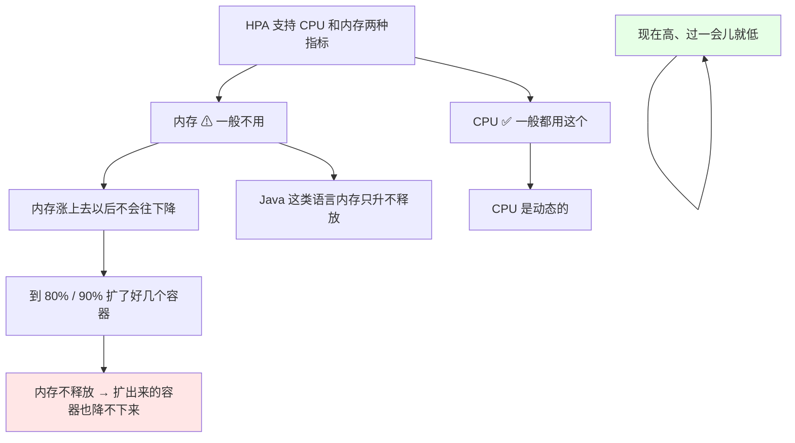
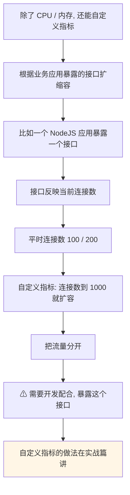
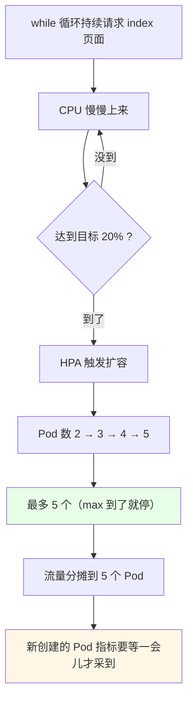
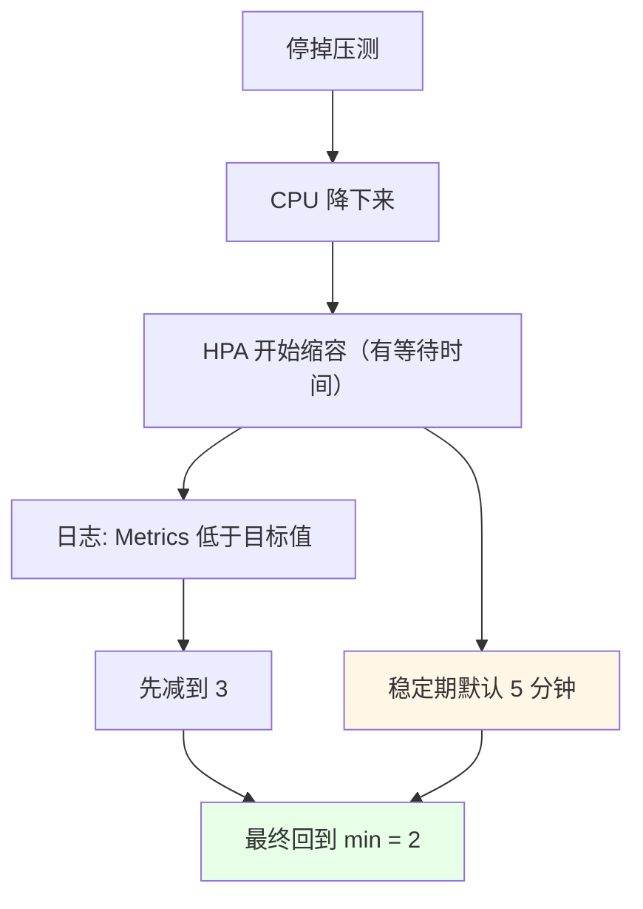
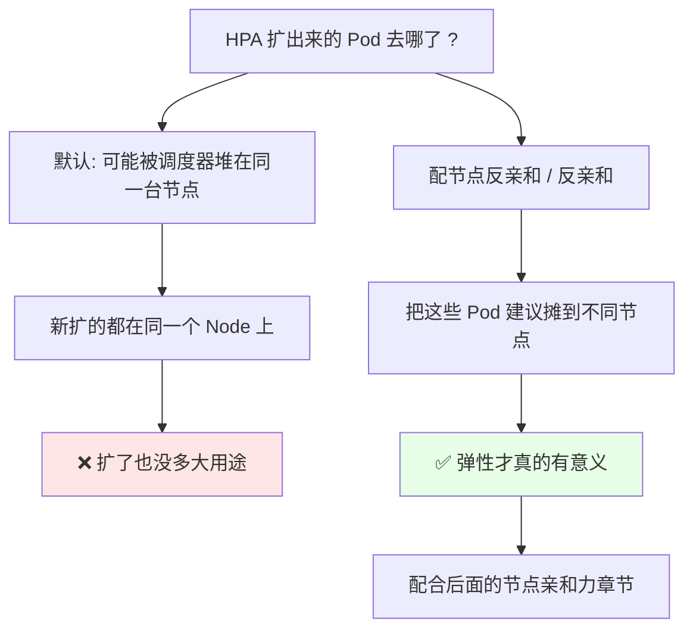

# Kubernetes 集群部署: HPA 自动扩缩容（HorizontalPodAutoscaler 基于 metrics-server 的 CPU 扩缩容实测）

Ingress 入门讲完，已经能配个域名把服务发布出去了。这一节讲 **HPA（HorizontalPodAutoscaler，水平自动伸缩）** —— 让 Pod 数量跟着流量自己涨自己落。

结论先摆：

1. **HPA 观察 Pod 的 CPU / 内存使用率，自动增加或减少 Pod 数量**，应对不可预见的流量激增（比如活动页面像淘宝双十一那样突然爆量）；
2. **必须先把 metrics-server 装好**，它负责采集每个容器的 CPU / 内存使用量；**比较的基准是 `requests`，不是 `limits`** —— 所以 `requests` 不配，HPA 根本过不了；
3. **实测用 CPU，不要用内存**：内存涨上去之后**不会自己降**（Java 这类语言内存只升不释放），扩出来的容器也跟着降不下来；CPU 是动态的，高一阵低一阵；
4. **只适用于可缩放的对象** —— DaemonSet 没有 replicas 概念，**不支持缩放**；一般挂在 Deployment 上（无状态，随时能起）；
5. **HPA 只能扛住前面应用的突发流量，瓶颈很可能其实在数据库** —— 真出现瓶颈时，数据库那边还得靠别的技术解决；
6. **扩了没用？配反亲和**：如果新扩出来的 Pod 全落在同一台 Node 上，**扩了也没多大用途**，要做节点反亲和把它们摊开。

## 纲要

- HPA 是什么、解决什么问题
- 从虚拟机扩容到容器弹性
- 用在哪：Deployment 而不是 DaemonSet
- metrics-server 与 requests 这个前提
- 为什么扩缩容别用内存
- 自定义指标扩缩容
- autoscale 一条命令生成 HPA
- 压测触发扩容实测
- 缩容：稳定期与收敛过程
- 扩了没用？节点反亲和
- 适用场景与边界

## HPA 是什么、解决什么问题



- HPA 就是 **HorizontalPodAutoscaler（水平自动伸缩）**，水平 = 加 Pod 数量，不是加机器；
- 它**观察 Pod 的 CPU / 内存使用率，然后自动扩展或缩容 Pod 的数量**；
- 典型的业务场景：平时两个、三个 Pod 够用，但**搞活动的时候流量会激增**（淘宝双十一那种能预见，我们说的是**不可预见**的），你不知道它什么时候爆，爆了三个 Pod 就扛不住了；
- 老办法是加机器：**先装虚拟机系统、再装 NGINX、把环境弄成一模一样、然后起服务**，全是人工；虚拟机虽然也能做弹性，但**不一定特别好**；
- 容器那边**都是基于某个模板启动的**，Pod 不够的时候 HPA 可以**自动增加或减少 Pod** 来扛住这波突发流量。

## 用在哪：Deployment 而不是 DaemonSet



| 对象 | 能不能做 HPA | 原因 |
| --- | --- | --- |
| **Deployment** | ✅ 可以，最常用 | 无状态，Pod 随时可以起来、随时可以销毁 |
| **DaemonSet** | ❌ 不支持 | 它是「每个节点一个」，**没有 replicas 那个复位（replicas）概念**，没法缩放 |
| StatefulSet | 概念上有，但场景受限 | 有状态，扩缩容要考虑身份与存储 |

HPA **不适用于无法缩放的对象**。实战里基本都是挂在 **Deployment** 上 —— 因为 Deployment 是无状态的，想加几个加几个。

> 但要清醒一点：**突发流量过来之后瓶颈很可能不在前端页面，而在数据库**。HPA 只能缓解前面应用的突发流量，**数据库那边还是得靠其他技术方案解决**。

## metrics-server 与 requests 这个前提



- **HPA 必须先把 metrics-server 装好** —— metrics-server 负责**看每一台（每一个容器）现在的内存使用量和 CPU 使用量**；
- HPA **基于当前的 CPU / 内存使用量，跟 Deployment 的 `requests` 值去比较** —— 注意是 **`requests` 不是 `limits`**；
- 比如我们可以定一个「**CPU 到 requests 的 80% / 200% 就扩容**」这样的阈值；
- **所以 `requests` 这个参数是必须要有的，不然 HPA 过不了** —— 做自动扩缩容，requests 必须写；
- 装集群的时候已经装过 metrics-server 了（前面的安装章节装过）。

```yaml
apiVersion: apps/v1
kind: Deployment
metadata:
  name: nginx-demo
spec:
  replicas: 2
  selector:
    matchLabels:
      app: nginx-demo
  template:
    metadata:
      labels:
        app: nginx-demo
    spec:
      containers:
      - name: nginx
        image: nginx:1.15.2
        # HPA 比较的基准是 requests, 必须配
        resources:
          requests:
            cpu: 100m
            memory: 100Mi
          limits:
            cpu: 200m
            memory: 200Mi
```

## 为什么扩缩容别用内存



基于 metrics-server 的 HPA **支持 CPU 内存两种方式进行扩缩容**（现在这种只支持这两种）。但**一般不用内存做扩缩容**：

- **内存一般情况下涨上去了不会往下降**；
- 比如 **Java 这类语言**，内存可能就一直往上升、不释放；
- 涨到 80%、90% 以后，HPA 给你扩了好几个容器；但因为**内存不释放，扩出来的那些容器也不会往下降**，最后就一直挂着一堆 Pod；
- **CPU 是动态的** —— 现在高，过一会儿就低了，回落干净，扩缩容才有意义。

> 结论：**用 CPU 的方式做扩缩容**。

## 自定义指标扩缩容



除了 CPU / 内存这两种，**HPA 还支持自定义指标**：

- 根据**业务应用暴露的接口**来做扩缩容；
- 比如有个 **NodeJS 应用，报（暴露）了一个接口，这个接口能反映出当前连接数是多少** —— 平时连接数一两百，定一个自定义指标：**连接数到 1000 就扩容**，把流量分开；
- 这个需要**跟开发说，让应用暴露一个接口**，才能拿它来制定指标；
- 自定义指标这套的完整工程，会放到后面的**实战篇**单独讲，这一节只练**基于 CPU** 的做法。

## autoscale 一条命令生成 HPA

实操：我们之前有个 NGINX 的 **Deployment，副本数是 2**。为了好模拟，先把它的 **CPU 上限（limits）调小一点**（比如很小的值），这样 CPU 很快就能打上去。

```bash
# 1. 看现在的 Deployment 和副本数
kubectl get deploy nginx-demo
kubectl get pod

# 2. 把容器 CPU 的 limit 改小（好模拟打满）
kubectl edit deployment nginx-demo
# 把 resources.limits.cpu 改成一个很小的值

# 3. 一条命令就能生成 HPA
kubectl autoscale deployment nginx-demo --min=2 --max=5 --cpu-percent=20
```

```text
autoscale 命令的三个关键参数:

kubectl autoscale deployment <名称> --min=<最小值> --max=<最大值> --cpu-percent=<目标百分比>
├── --min       缩容下限（平时正常值, 缩到底就停在这）
├── --max       扩容上限（最多扩到几个）
└── --cpu-percent  目标使用率（相对 requests 的百分比）
```

```bash
# 4. 看 HPA
kubectl get hpa
# NAME         REFERENCE                 TARGETS   MINPODS   MAXPODS   REPLICAS   AGE
# nginx-demo   Deployment/nginx-demo     10%/20%   2         5         2          30s
```

- `TARGETS` 那列**前面是当前值、后面是目标值**：比如当前 CPU 用量是 10%、我们定义的目标阈值是 20%；
- **实际上一般得超了这个 CPU 才会扩**，不超的话不会扩 —— 这个百分比按自己的需求配，**不是死的**。

## 压测触发扩容实测



```bash
# 1. 写一个死循环, 一直请求它的 index 页面
SVC_IP=10.96.137.22
while true; do wget -q -O - "http://${SVC_IP}"; done
```

- 只发请求、不下载页面，`wget -q -O -` 就这个意思；
- 也可以在另外两台机器上（`master02`、`master03`）一起起几个这样的循环，压得更猛；
- 能看到它一直在访问，CPU 慢慢往上爬。

```bash
# 2. 盯着看
kubectl get hpa -w
kubectl get pod
```

观察过程：

| 阶段 | 现象 |
| --- | --- |
| 起压 | CPU 从 10% 慢慢上来 |
| 刚过阈值 | 已经开始扩，Pod 还在启动中（还没 Ready，指标没采到） |
| 155% / 186% | **HPA 已经扩到 5 个了**（max=5 到顶） |
| 等待 | 新创建的 Pod **指标要等一会儿才能采集到**，再等一会儿 |
| 摊流量 | 请求被分摊到这 5 个节点上 |

> **扩容提示**：现在已经扩到顶了（max 就是 5）。

## 缩容：稳定期与收敛过程



停掉压测之后，CPU 就下来了，然后它会**往回滚，缩回到最小的那个值（min = 2）**：

- **缩容是有等待时间的**（稳定期默认大概 **5 分钟** 那种量级），不会一降下来就秒删；
- 看 `kubectl describe hpa` 的**事件日志**，会打出来 **Metrics 低于目标值** 这类记录，说明它开始缩了；
- 实际过程是一步步收敛的：**先减到 3，最后回到 2**；
- 这段时间自己等着就行，它按理说会自己删掉，**不需要人工干预**。

```bash
# 3. 看 HPA 的详细事件（缩容日志就看这里）
kubectl describe hpa nginx-demo
# Type    Reason              Message
# ----    ------              -------
# Normal  ScalingReplicaSet  ScalingReplicaSet(nginx-demo): metrics [cpu] below target
```

```text
扩容缩容的完整过程（实测时间线）:

t0   起压, CPU 10% / 目标 20%
t1   CPU 爬到 20% 以上
t2   HPA 扩容 → 2 → 3 个 Pod
t3   CPU 到 155%, 继续扩 → 4
t4   CPU 到 186%, 扩到 5（max 到顶）
t5   流量分摊到 5 个 Pod（新 Pod 指标稍后采集）
t6   停压 → CPU 降下来
t7   缩容开始（稳定期约 5 分钟）
t8   减到 3
t9   最终缩回 min = 2
```

## 扩了没用？节点反亲和



这是做弹性时**特别容易忽略的一点**：

- 如果你**没做节点互斥（反亲和）**，HPA 新扩出来的 Pod **有可能全落在同一个 Node 上面**；
- 都堆在一台机器上，**这样扩其实没有多大用途** —— 机器还是那台机器，CPU 内存照样吃满，只是多了几个空壳；
- 所以**建议把 Pod 摊到不同的节点上面**，这样做弹性才有意义 —— 这块对应后面「节点亲和性 / 反亲和」那几节，这里先记住这个坑。

## 适用场景与边界

```text
HPA 的适用边界:

✅ 适合
├── 无状态前端 / 微服务（Deployment 部署）
├── 突发流量、不可预见的峰值（活动、营销页）
├── 用 CPU 使用率做指标（动态, 能回落）
├── requests 必须配（它是比较基准）
└── 有 metrics-server 提供数据

⚠ 边界
├── 瓶颈可能在数据库, HPA 管不到
├── 内存指标会扩了不缩（Java 内存不释放）
├── DaemonSet 没法用
├── 自定义指标要开发配合暴露接口
└── 没做反亲和时可能扩了个寂寞
```

## API 速览

| 能力 | 做法 | 关键点 |
| --- | --- | --- |
| 是什么 | HorizontalPodAutoscaler，水平自动伸缩 | 自动加减 **Pod 数量**，不是加机器 |
| 采集数据 | **metrics-server** | 不装它 HPA 没数据 |
| 比较基准 | **Pod 的 `requests`** | **不是 limits**；requests 不配就过不了 |
| 常用指标 | **CPU**（recommended） | CPU 动态能回落；内存涨了不降 |
| 内存指标的坑 | Java 类语言内存只升不释放 | 扩出来也降不回来 |
| 能用谁 | **Deployment** | DaemonSet 没有 replicas，不支持缩放 |
| 生成 HPA | `kubectl autoscale deployment <名称> --min=2 --max=5 --cpu-percent=20` | 一条命令 |
| 看当前/目标 | `kubectl get hpa` | TARGETS 列：当前%/目标% |
| 看缩放事件 | `kubectl describe hpa <名称>` | 打 Metrics 低于/高于目标的日志 |
| 压测触发 | `while true; do wget -q -O - http://<服务IP>; done` | 多开几台一起压更明显 |
| 缩容 | 自动，有稳定期（约 5 分钟量级） | 一步步收敛到 min |
| 自定义指标 | 业务应用暴露接口（如连接数） | 要开发配合，实战篇细讲 |
| 别忘 | 配节点反亲和，别让新 Pod 堆在一台机器 | 否则扩了没用 |

## Demo 示例

```bash
# 1. 前提: metrics-server 在跑
kubectl get pod -n kube-system | grep metrics-server

# 2. 看 Deployment 现在的副本数和资源声明
kubectl get deploy nginx-demo
kubectl get deploy nginx-demo -o yaml | grep -A 6 resources

# 3. 把 CPU limit 改小一点, 方便模拟打满
kubectl edit deployment nginx-demo

# 4. 生成 HPA（min 2 / max 5 / 目标 CPU 20%）
kubectl autoscale deployment nginx-demo --min=2 --max=5 --cpu-percent=20
kubectl get hpa
```

```bash
# 5. 起压（在另外的机器上多起几个更明显）
SVC_IP=10.96.137.22
while true; do wget -q -O - "http://${SVC_IP}"; done

# 6. 同时盯着扩容过程（终端 2）
kubectl get hpa -w
kubectl get pod -w

# 7. 看缩放事件
kubectl describe hpa nginx-demo
# Normal  ScalingReplicaSet  metrics [cpu] above target → 一直扩到 max=5
```

```bash
# 8. 停掉压测（Ctrl+C）, 然后等它自己缩
kubectl get hpa -w
kubectl describe hpa nginx-demo
# Normal  ScalingReplicaSet  metrics [cpu] below target → 减到 3 → 最后回到 2

# 9. 清理
kubectl delete hpa nginx-demo
```

```text
10. 配合反亲和, 别让新扩的 Pod 挤在一台机器上:

nodeSelector / affinity 建议写法:

spec:
  affinity:
    podAntiAffinity:
      preferredDuringSchedulingIgnoredDuringExecution:
      - weight: 100
        podAffinityTerm:
          topologyKey: kubernetes.io/hostname
          labelSelector:
            matchLabels:
              app: nginx-demo
```

### 总结

- **HPA（HorizontalPodAutoscaler）是水平自动伸缩**：观察 Pod 的 **CPU / 内存使用率**，自动增加或**减少 Pod 数量**，用来扛不可预见的流量激增（比老办法「装虚拟机 → 装 NGINX → 环境配一样 → 起服务」快得多）；
- **两个硬前提**：① 先装好 **metrics-server**（它采集每个容器的 CPU / 内存实时用量）；② **Pod 必须配 `requests`** —— HPA 是拿用量跟 **requests** 比（不是 limits），requests 不写 HPA 过不了；
- **扩缩容用 CPU，别用内存**：内存涨上去一般不往降（Java 这类只升不释放），扩出来几个容器也跟着降不回来；CPU 是动态的，高一阵低一阵，缩得回来；
- **只能挂可缩放的对象上**：DaemonSet 没有 replicas 概念、不支持缩放；实战基本都挂 **Deployment**（无状态随时起）；**HPA 只能缓解前端突发流量，瓶颈很可能其实在数据库**；
- **实测流程**：`kubectl autoscale deployment nginx-demo --min=2 --max=5 --cpu-percent=20` 一条命令生成，`while true; do wget -q -O - http://<服务IP>; done` 起压，CPU 爬到阈值就一路扩到 max=5，流量分摊到 5 个 Pod；停压后 CPU 下来，缩容**有稳定期（约 5 分钟量级）**，一步收敛 3 → 最后回到 min=2，`kubectl describe hpa` 能看到 Metrics 低于目标的事件；
- **别忽略反亲和**：新扩的 Pod 可能全落同一台 Node，那样**扩了没多大用途**；要配节点反亲和把它们摊开，弹性才真的有意义；自定义指标（比如 NodeJS 暴露连接数接口，到 1000 扩）要开发配合，做法留到实战篇。

