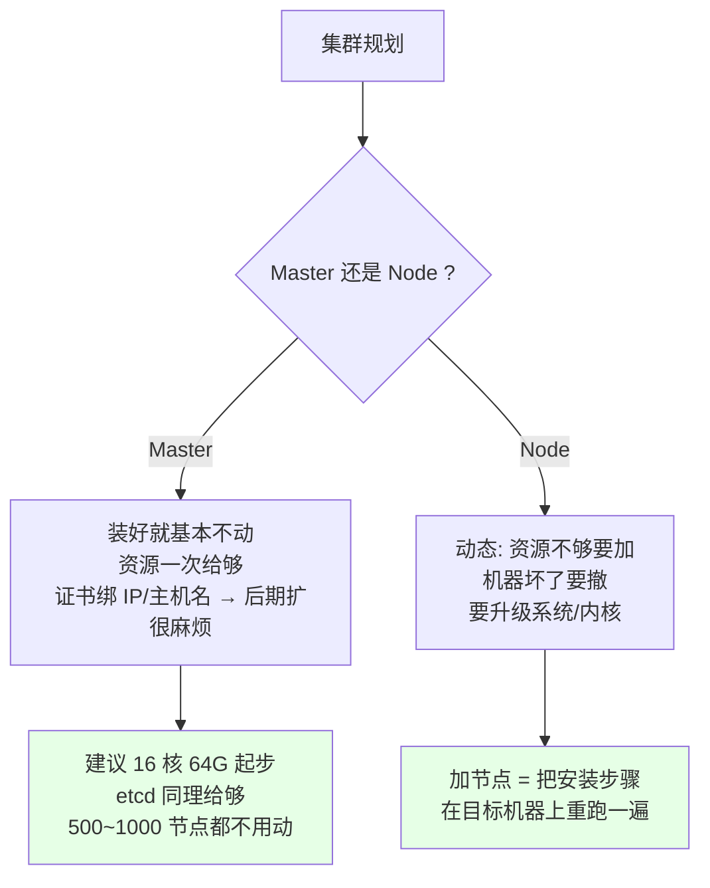
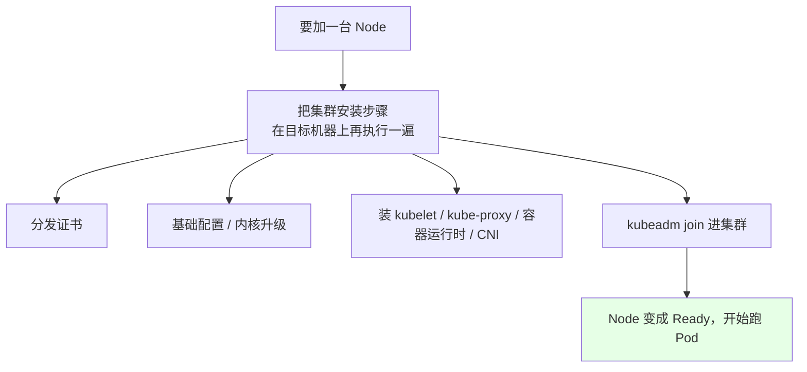
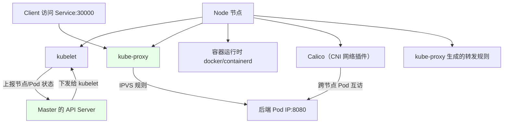
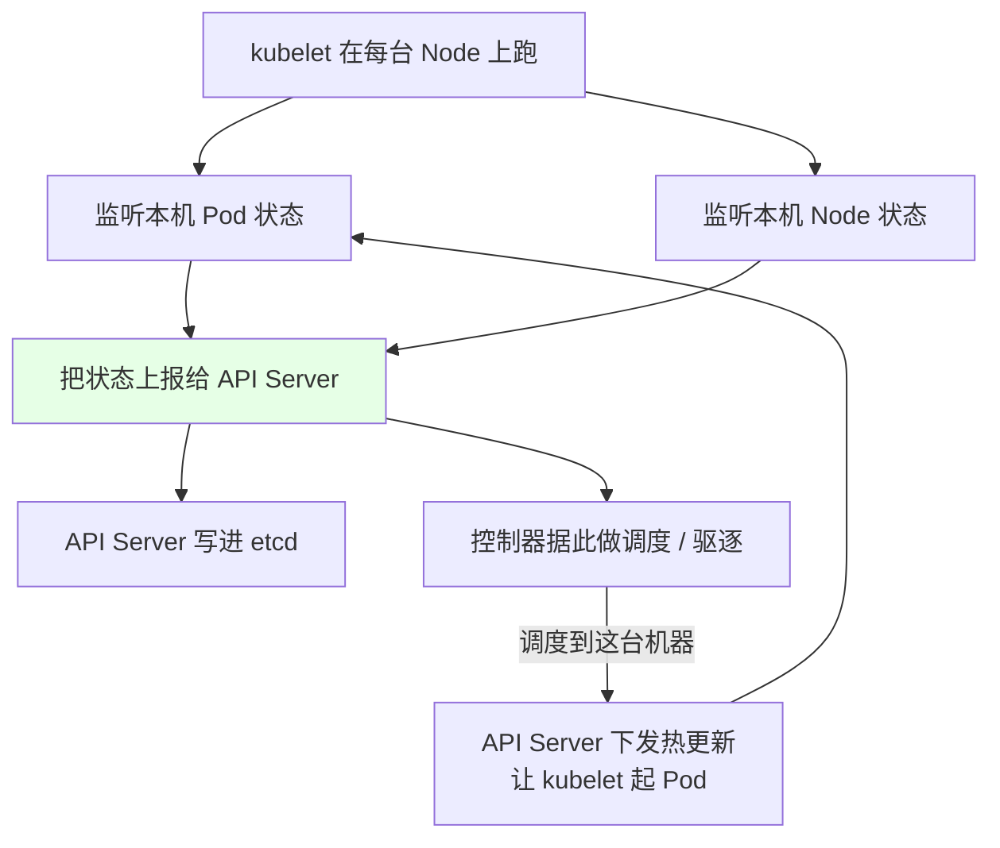
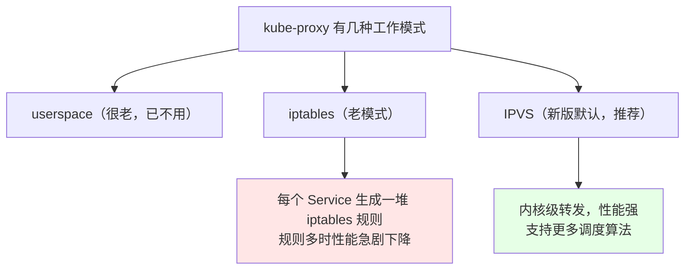
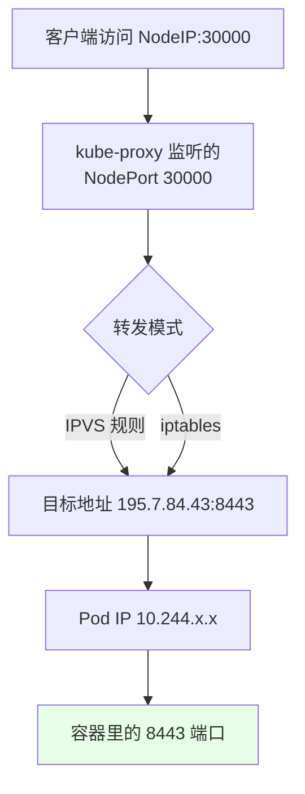
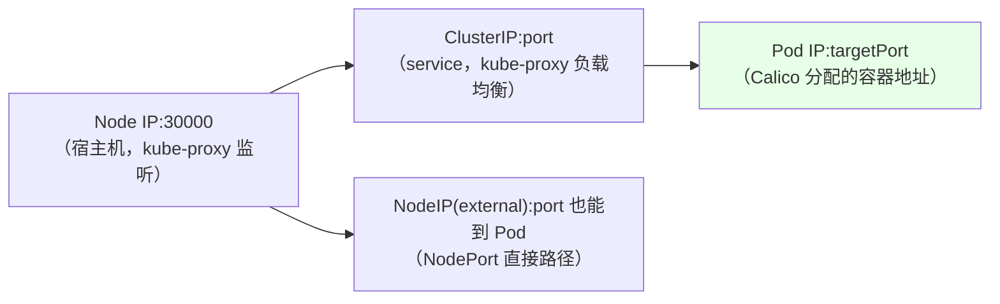
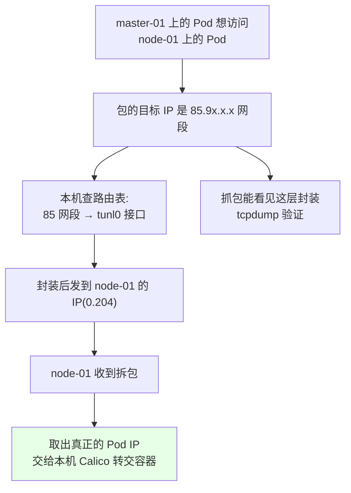
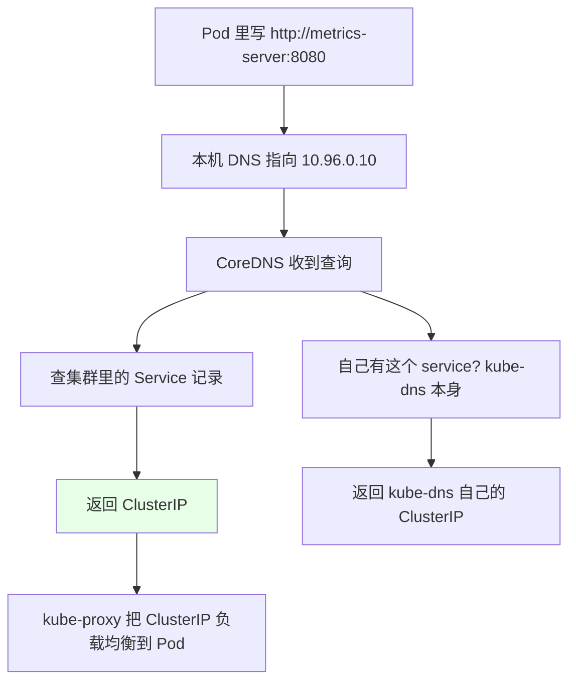
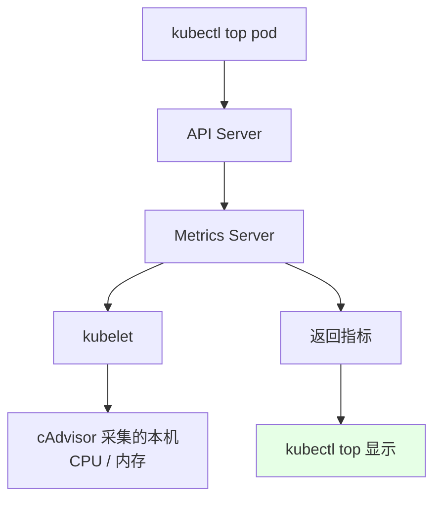

# Kubernetes 集群部署: Node 节点（kubelet / kube-proxy / Calico / CoreDNS / Metrics Server）

上一节讲 Master 时留了个提醒：**Master 装好之后很长一段时间不会动，所以规划阶段一定要把资源给够** —— 因为证书绑定了 Master 的 IP 和主机名，后期扩机器往往要重新签证书、逐节点替换，麻烦得要命。Node 正好相反：**它是动态的**，随时要加、随时要撤、随时要升级。

结论：**Node 上真正跑的组件就那几个** —— **kubelet**（管节点上的 Pod 并上报状态）、**kube-proxy**（做服务转发，新模式是 IPVS）、**Calico**（CNI 网络插件，每节点当路由器）、**CoreDNS**（把 service 名解析成 IP）、**Metrics Server**（给 `kubectl top` 供数）。

## 纲要

- 先说 Node 和 Master 的规划差异
- Node 上加/删节点其实很简单
- Node 上的三大组件
- kubelet：盯状态 + 上报状态
- kube-proxy：IPVS / iptables 两种模式
- 一次真实转发链路（30000 → 195.7.84.43）
- Calico：CNI 网络插件与跨节点通信
- CoreDNS：service 名怎么变成 IP
- Metrics Server：kubectl top 的数据源
- 常见排错

## 先说 Node 和 Master 的规划差异



| | Master | Node |
| --- | --- | --- |
| 变动频率 | **几乎不动** | **很频繁**（加 / 删 / 升级） |
| 资源规划 | **一次给够，别省**（16 核 64G 起） | 按需扩容 |
| etcd | 大规模时独立部署 + SSD | — |
| 后期扩的代价 | **麻烦**：证书绑 IP/主机名，要重签再逐节点替换 | 简单：重跑一遍 Node 安装步骤 |

> 测试环境随意，能起来就行。但生产里 Master 的这份钱**最好别省** —— 500~1000 个节点的规模下，给够资源的 Master 可以五年十年不用动。

## Node 上加/删节点其实很简单



**扩容 = 把之前装 Node 的那套步骤重跑一遍**，没有额外的玄学。要下线也简单（cordon → drain → 摘节点）。

## Node 上的三大组件

```text
一个 Node 节点上跑的东西:

├── kubelet                ← 节点上的「大管家」
├── kube-proxy             ← 服务转发（IPVS / iptables）
├── docker / containerd    ← 容器运行时（负责管容器）
├── Calico (CNI)           ← 网络插件，每节点一个（DaemonSet）
├── CoreDNS (可选，集群级)  ← service 名解析
└── Metrics Server (可选)   ← 指标采集
```



> 小习惯：Master 上虽然也会部署 kubelet 和 kube-proxy（这样 `kubectl get node` 能直接看到状态），但会**给它打一个污点（taint）**，容忍不了这个污点的 Pod 就跑不上去 —— **生产上 Master 不能跑业务应用**。

## kubelet：盯状态 + 上报状态

**kubelet 负责监听节点上 Pod 的状态，同时把节点和 Pod 的状态上报给 Master。**



| kubelet 干的事 | 说明 |
| --- | --- |
| 起/停容器 | 收到 PodSpec 就去找容器运行时执行 |
| 上报状态 | 节点 Ready/NotReady、Pod Running/Pending/Failed |
| 执行探针 | 存活探针 / 就绪探针都是它跑的 |
| 挂载存储 | PVC / ConfigMap / Secret 的挂载 |

## kube-proxy：IPVS / iptables 两种模式

**kube-proxy 负责 Service 之间的通信和负载均衡，把指定的流量分发到后端的机器上。**



| | iptables 模式 | IPVS 模式（推荐） |
| --- | --- | --- |
| 转发实现 | 内核 iptables 规则链 | 内核 LVS（IPVS） |
| 规则数量增长 | Service 多了**性能急剧下降** | 内核级转发，稳定 |
| 调度算法 | 随机 / 统计 | rr / lc / dh / sh / sed / nq 等 |
| 新版默认 | 已不再默认使用 | **新版集群默认用 IPVS** |
| 需要 iptables 吗 | — | **还是需要**：有些功能 IPVS 实现不了，仍依赖 iptables |

```bash
# 1. 看 kube-proxy 的工作模式（端口 10249）
curl http://127.0.0.1:10249/proxyMode
# 期望: ipvs

# 2. 看 kube-proxy 自己的 Pod（每个节点一个）
kubectl get pod -n kube-system -o wide | grep kube-proxy

# 3. 用 ipvsadm 看真实转发规则
ipvsadm -Ln
ipvsadm -Ln --stats
```

> 提示：`proxyMode` 的探测端口是 **10249**。

## 一次真实转发链路（30000 → 195.7.84.43）



把原文那个实例串一遍（NodePort → Pod）：

```text
1. 集群里有个 Service（kube-state-metrics 之类）
   kubectl get svc -n kube-system
   → kube-state-metrics 的 NodePort 是 30000

2. 这个 30000 是 kube-proxy 在 Node 上监听的（NodePort 映射出去的）

3. 看 ipvs 规则:
   ipvsadm -Ln
   TCP  10.96.x.x:8443 → 195.7.84.43:8443
   这就是这条 Service 背后的 Pod 地址

4. 验证 195.7.84.43 是谁:
   kubectl get pod -n kube-system -o wide | grep 195.7
   → 正好是一个 Pod 的 IP

结论: 访问 Node:30000 → IPVS 规则反代到 Pod 的 IP:8443
```

```bash
# 完整验证一条命令链
kubectl get svc -A -o wide | grep 30000          # 找到 NodePort 30000 的 service
ipvsadm -Ln | grep 30000                          # 看它转发到哪
kubectl get pod -A -o wide | grep 195.7.84        # 对上 Pod 的 IP
curl http://<node ip>:30000/healthz               # 实际访问验证
```

| 角色 | 谁负责 | 典型数值 |
| --- | --- | --- |
| NodePort（宿主机端口） | **kube-proxy** 监听 | `30000` 段 |
| ClusterIP（service 虚拟 IP） | kube-proxy + DNS | `10.96.x.x` |
| Pod IP | **Calico（CNI）** 分配 | `10.244.x.x` |

**三者一定要分清**，排障时逐个对：



## Calico：CNI 网络插件与跨节点通信

**Calico 是符合 CNI 标准的网络插件** —— 它给每个 Pod 分配一个唯一 IP，并且**把每个节点当成一个路由器**，这样跨节点的 Pod 就能互相通。



```bash
# 看每个 Pod 的 IP（注意网段不同 = 在不同节点）
kubectl get pod -A -o wide
# kube-system  metrics-server-xxx   10.244.1.138   master-01
# kube-system  calico-node-yyy      10.244.2.x     node-01
# 网段不一样 → 说明它俩在不同节点上

# 看节点路由表（85 网段走 tunl0）
ip route
# 85.98.0.0/16 dev tunl0

# 抓包看封装（master-01 上抓到 node-01 的流量）
tcpdump -i any host 195.7.84.43 -nn
```

| 组件 | 作用 |
| --- | --- |
| **Calico** | CNI 网络插件，每节点一个（DaemonSet），分配 Pod IP + 当路由器 + 跨节点通信 |
| Flannel | 另一个常见 CNI，但**不支持网络策略（NetworkPolicy）** |
| Calico 的优势 | 既符合 CNI 标准，**又能做网络策略** ← 这是选它的主因 |
| Cilium（ebpf） | 原生支持 **eBPF**，有可能取代 kube-proxy；Calico 也支持了但未经大规模生产验证 |

> 新趋势值得知道：**kube-proxy 在 Service 成千上万个时扛不住**，社区引入了 **eBPF** 机制，Cilium 就是专为 K8s 设计、原生支持 eBPF 的网络方案，理论上可以完全不部署 kube-proxy。但目前生产里 Calico 还是首选、验证最多。

## CoreDNS：service 名怎么变成 IP

**kube-dns（CoreDNS）负责集群内部 Service 的解析**，让 Pod 把 service 名解析成 IP，再通过 Service 的 IP 连到对应应用。



```bash
# 1. CoreDNS 的 ClusterIP 一般是 service 网段的第 10 个
kubectl get svc -n kube-system
# kube-dns       10.96.0.10   ← 默认就是 service 网段的第 10 个
# metrics-server 10.96.x.x
# 第 1 个一般是给 kube-ns（kube-system 之类）用的

# 2. 生产里 kube-dns 一定要起多个副本（按集群规模调）
kubectl scale deploy -n kube-system coredns --replicas=3

# 3. 在 Pod 里验证解析
kubectl run -it --rm test --image=busybox --restart=Never -- sh
nslookup metrics-server
nslookup kube-dns
```

为什么不能直接写 Service 的 IP：

- **ClusterIP 会变** —— Service 删掉重建，IP 就换了；
- 所以**一律用 service 名访问**，名字不变，CoreDNS 负责把它变成 IP。

## Metrics Server：kubectl top 的数据源



- **Metrics Server 就是来采集数据的**，让 `kubectl top` 能看到容器占了多少内存、CPU；
- 它**既能看 Pod 的，也能看 Node 的**；
- 这是 HPA（自动扩缩容）的数据来源 —— 没装 Metrics Server，`kubectl top` 和 HPA 都用不了。

## 常见排错

| 现象 | 原因 | 处理 |
| --- | --- | --- |
| Node 一直 `NotReady` | kubelet 没起来 / 证书过期 / 磁盘满 | `systemctl status kubelet`，看 `/var/log/messages` |
| `kubectl top` 报 `metrics not available` | 没装 Metrics Server 或它没 Ready | 检查 `kubectl get pod -n kube-system \| grep metrics` |
| 服务名解析不出来 | CoreDNS 没装 / 副本 0 | `kubectl get svc -n kube-system`，scale 上去 |
| 跨节点 Pod 互访不通 | CNI 没装好 / 路由缺 tunl0 | `ip route` 看网段路由，`kubectl get pod -n kube-system \| grep calico` |
| Service 通但 Pod 不通 | 容器监听端口 ≠ `targetPort` | 核对 `targetPort` 与容器实际端口 |
| NodePort 访问失败 | kube-proxy 模式不对 / 规则没生成 | `curl 127.0.0.1:10249/proxyMode` 看模式，`ipvsadm -Ln` 看规则 |
| Service 多之后转发变慢 | 还在用 iptables 模式 | 切 IPVS（新版默认） |
| 新加的 Node 跑不了 Pod | Master 的污点 / 没打 nodeSelector 需要的标签 | `kubectl describe node \| grep -i taint` |
| 加了节点但证书不对 | 没按安装步骤重跑 | 重跑 Node 初始化 + join |
| Pod IP 网段和预想不一样 | CNI 配置（Calico 的 IPPool）改过 | 看 Calico 的 IPPool 配置 |

## API 速览

| 能力 | 做法 | 关键点 |
| --- | --- | --- |
| 看节点状态 | `kubectl get node -o wide` | STATUS / ROLES / VERSION |
| 看节点污点 | `kubectl describe node <节点> \| grep -i taint` | Master 默认 NoSchedule |
| 看节点标签 | `kubectl get node --show-labels` | 决定 Pod 落不落这 |
| 看节点资源用量 | `kubectl top node` | 依赖 Metrics Server |
| 看 Pod 用量 | `kubectl top pod -A` | 同上 |
| 看 kube-proxy 模式 | `curl 127.0.0.1:10249/proxyMode` | 期望 `ipvs` |
| 看转发规则 | `ipvsadm -Ln` | NodePort / ClusterIP → Pod IP |
| 看路由表 | `ip route` | Calico 的网段走 tunl0 |
| 看系统组件 | `kubectl get pod -n kube-system -o wide` | Namespace 必须指定 |
| 看 DNS 地址 | `kubectl get svc -n kube-system` | kube-dns 通常 10.96.0.10 |
| 扩容 DNS | `kubectl scale deploy -n kube-system coredns --replicas=N` | 按集群规模 |

## Demo 示例

```bash
# 1. 看节点整体状态（含 master / node 各几台）
kubectl get node -o wide

# 2. 看系统组件（Namespace 必须指定，不然只看 default）
kubectl get pod -n kube-system -o wide
# 期望看到: calico-node / kube-proxy / coredns / metrics-server / kube-apiserver ...

# 3. 看 kube-proxy 的转发模式（在任意节点上）
curl http://127.0.0.1:10249/proxyMode

# 4. 看 IPVS 规则，找到某条 Service 转发的 Pod 地址
ipvsadm -Ln
ipvsadm -Ln --stats

# 5. 顺着一条 NodePort 走一遍
kubectl get svc -A -o wide | grep Node
ipvsadm -Ln | grep 30000
kubectl get pod -A -o wide
curl -k https://<node ip>:30000/healthz

# 6. 看 kubelet 是否活着
systemctl status kubelet
journalctl -u kubelet -f

# 7. 看 CoreDNS 解析
kubectl run -it --rm test --image=busybox --restart=Never -- sh
nslookup kube-dns
nslookup metrics-server
exit

# 8. 看指标（依赖 Metrics Server）
kubectl top node
kubectl top pod -A
```

```bash
# 9. 给 DNS 扩容（生产建议多副本）
kubectl scale deploy -n kube-system coredns --replicas=3
kubectl get deploy -n kube-system coredns

# 10. 看节点上的路由（Calico 网段走 tunl0）
ip route
tcpdump -i any host 195.7.84.43 -nn
```

```text
11. 一个 Node 节点上的东西（拓扑）:

┌────────── role=worker (Node) ──────────┐
│                                         │
│  kubeproxy ──► IPVS 规则 (10249)        │
│       │                                 │
│       ├── 监听 NodePort (30000 段)       │
│       └── 转发到 ClusterIP / Pod IP      │
│                                         │
│  kubelet ────► 管 Pod / 上报状态          │
│       │                                 │
│       ├── 起容器 (docker / containerd)   │
│       └── 执行探针                        │
│                                         │
│  calico-node (DaemonSet)                │
│       └── 每节点当路由器, 分配 Pod IP     │
│           本节点 Pod 网段 10.244.1.0/24  │
└─────────────────────────────────────────┘
```

### 总结

- **Node 和 Master 的规划逻辑完全相反**：**Master 装好就几乎不动，所以资源一次给够**（16 核 64G 起、etcd 同理），因为证书绑定了 Master 的 IP 和主机名，**后期扩 Master 要重签证书再逐节点替换，非常麻烦**；**Node 是动态的**，扩容就是把之前装 Node 的步骤在目标机器上重跑一遍；
- **Node 上真正干活的是这几个**：**kubelet**（监听并上报节点和 Pod 状态，同时收到调度指令去起/停容器、跑探针）、**kube-proxy**（做 Service 转发和负载均衡）、**Calico**（CNI 网络插件，**每节点当路由器**）、**CoreDNS**（把 service 名解析成 IP）、**Metrics Server**（给 `kubectl top` 和 HPA 供数）；
- **kube-proxy 现在推荐 IPVS 模式**（`curl 127.0.0.1:10249/proxyMode` 可查），它和 iptables 一样都是「监听 Master 上 Service/Endpoint 的变化 → 生成转发规则」，但 **IPVS 是内核级转发，Service 成千上万个时也不会像 iptables 那样性能急剧下降**；不过 **iptables 仍不可少**，有些功能 IPVS 实现不了还得靠它（userspace 那种老模式已淘汰）；
- **分清三类 IP 排障最省力**：**NodePort（宿主机端口，kube-proxy 监听）→ ClusterIP（service 虚拟 IP）→ Pod IP（Calico 分配）**，用 `kubectl get svc -o wide` + `ipvsadm -Ln` + `kubectl get pod -A -o wide` 三步就能把链路串起来；
- **Calico 选它的理由不是「能通」而是「能做网络策略」** —— Flannel 也能通但不支持 NetworkPolicy；它给每个 Pod 分唯一 IP、每节点跑一个（DaemonSet）、把跨节点流量走 tunl0 封装路由；**新趋势是 eBPF（Cilium）**，理论上能取代 kube-proxy，但目前生产首选还是 Calico；
- **CoreDNS 必须重视**：ClusterIP **删了重建就会变**，所以服务间一律用 service 名访问，由 kube-dns 解析（默认地址是 service 网段的第 10 个，一般是 `10.96.0.10`），**生产里要多副本**（`kubectl scale deploy -n kube-system coredns --replicas=N`）；另外**没装 Metrics Server，`kubectl top` 和 HPA 都用不了**。

