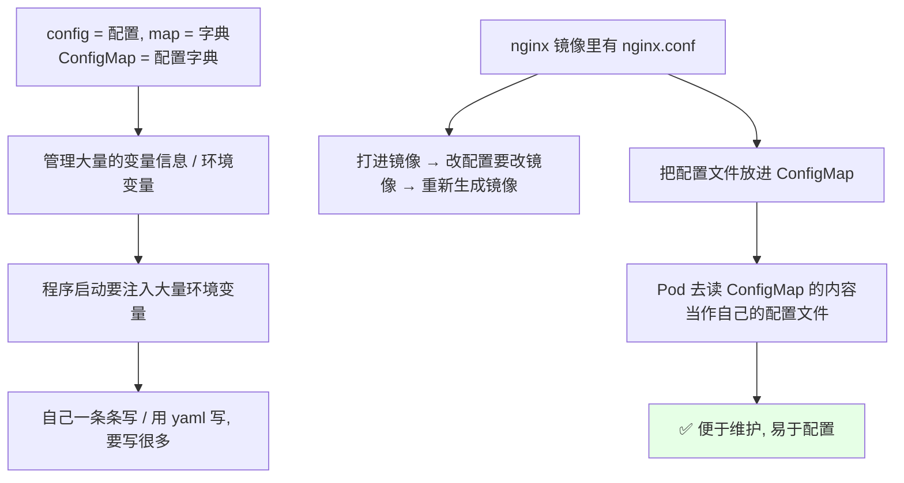
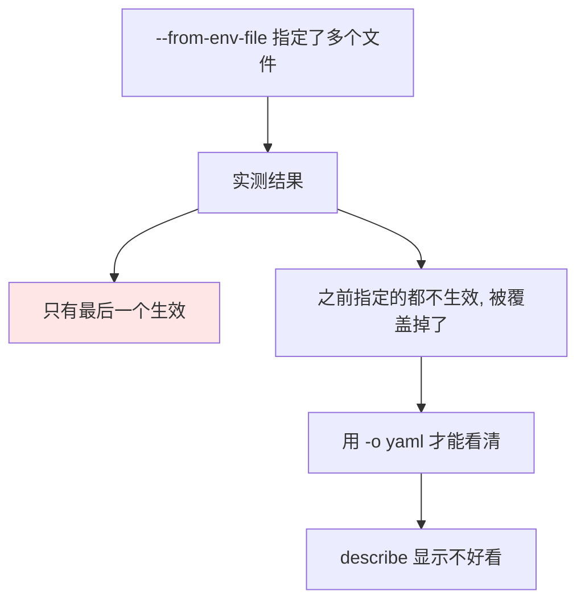
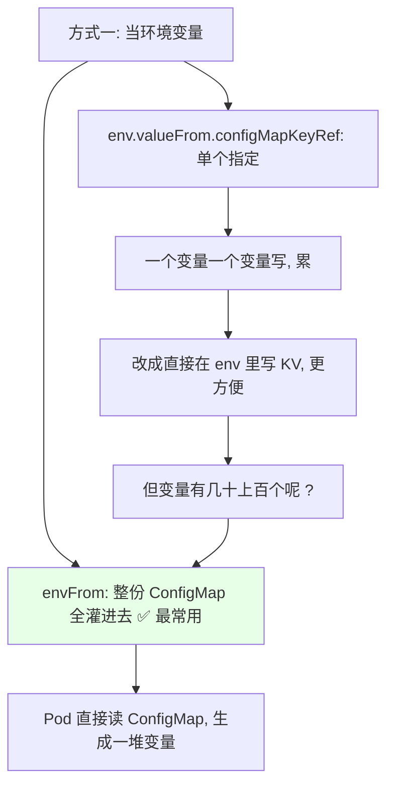
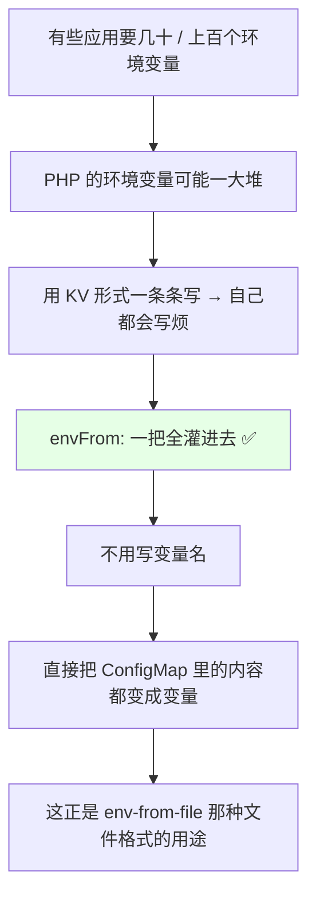
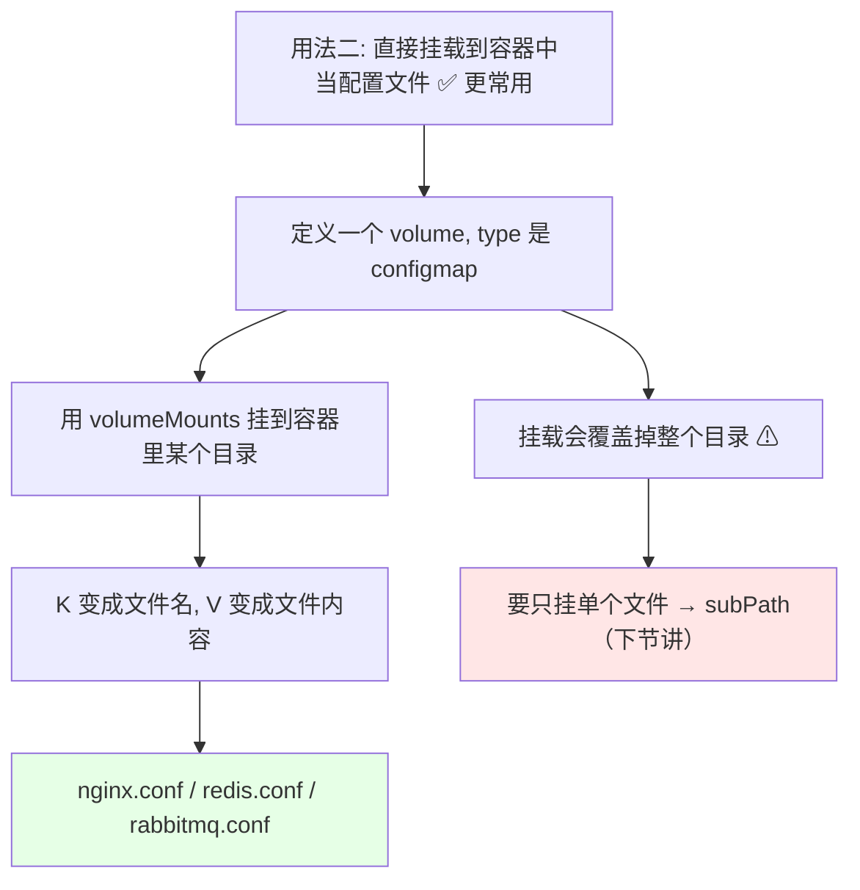
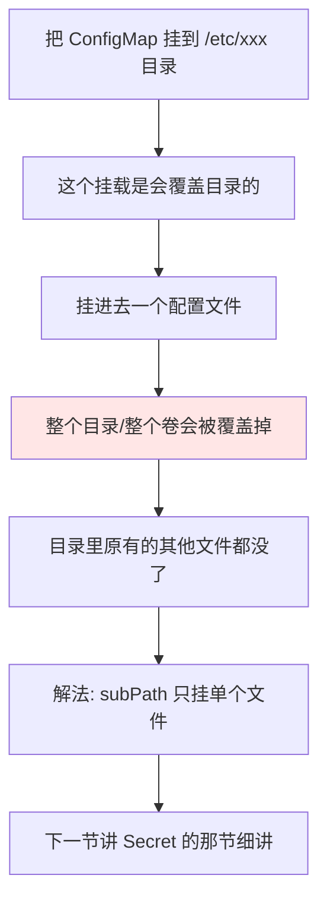
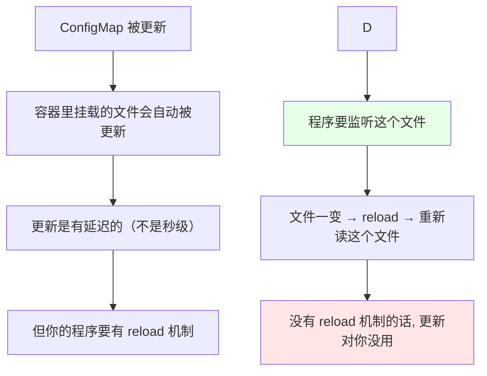

# Kubernetes 集群部署: 配置管理 ConfigMap（四种创建方式与挂载成环境变量 / 配置文件）

上一节 HPA 讲完（基于内存扩缩容现在还不太好，下一章讲自定义指标）。这一节讲 **ConfigMap**，它和 Secret 是**同一类客体** —— 只不过一个**不加密**、一个**加密**。

结论先摆：

1. **ConfigMap = 配置字典**（config 是配置、map 是字典），专门用来管理**大量的变量信息 / 环境变量**；
2. **核心价值是把配置和镜像解耦**：nginx.conf 打进镜像后改起来非常麻烦（改配置还得重新 build 镜像），放到 ConfigMap 里 Pod 直接读，**改动配置不用碰镜像**；
3. **四种创建方式**：从目录/文件中创建（最常用）、`--from-env-file` 从 env 文件创建、`--from-literal` 从字面量创建、`kubectl apply -k` 从 kustomization 生成器创建（1.14 新功能，生成的还带哈希值）；
4. **当环境变量用有两种**：逐个写 `configMapKeyRef`（累）和 **`envFrom` 一把全灌（最常用）** —— 变量几十上百个时（比如 PHP）必须用它；
5. **更常用的是直接挂载成配置文件**：ConfigMap 的 **K 变成文件名、V 变成文件内容**；但**挂载会覆盖整个目录**，想只挂单个文件得靠 subPath（下节讲）。

## 纲要

- ConfigMap 是什么、解决什么问题
- 与 Secret 的区别
- 创建方式一：从一个目录中创建
- 创建方式二：从单个文件中创建（生产最常用）
- 创建方式三：from-env-file 与多文件覆盖的坑
- 创建方式四：字面量与生成器创建
- 用法一：读 ConfigMap 充当容器环境变量
- envFrom 与 configMapKeyRef 怎么选
- 用法二：挂成配置文件（volumes + volumeMounts）
- 挂载格式与覆盖目录的坑
- 自动更新与程序的 reload 机制
- namespace 隔离与整体小结

## ConfigMap 是什么、解决什么问题



- 名字拆开看就懂了：**config 是配置、map 是字典，ConfigMap 就是一个配置字典**；
- 一般用它来**管理一些大量的变量信息 / 环境变量** —— 比如一个程序启动的时候**需要注入大量的环境变量**，如果你自己去写、或者用 yaml 一条条写，**可能要写很多**；
- 可以直接用 yaml 的形式创建一个 ConfigMap，**然后 Pod 去读这个 ConfigMap 的内容，作为它们自己的环境变量**；
- 它最主要的**作用就是把 Pod 和 Pod 的配置解耦（分离）**；
- 举个最典型的例子：NGX（nginx）镜像里有 **nginx.conf** 这个文件，如果把它打到镜像里，**改它会非常非常不好改** —— 改配置可能还得**去改镜像、再重新生成一个镜像**；
- 所以我们**把这个配置文件保存到 ConfigMap 里**，然后 **Pod 去读 ConfigMap 里的内容，充当自己的配置文件**；
- 一般我们会把 **nginx 的配置文件、redis 的配置文件、ZK 的配置文件**等都放进 ConfigMap —— **管理起来比较方便**。

### 与 Secret 的区别

| | ConfigMap | Secret |
| --- | --- | --- |
| 数据是否加密 | **不加密**（非敏感配置） | **加密**（敏感数据） |
| 内容 | 配置、环境变量、配置文件 | 密码、token、证书这类 |
| 用法 | **完全一样** | **完全一样** |
| 备注 | 本次讲这套 | 加密**还是可以被解密的** |

> Secret 的用法和 ConfigMap **是同一套**，只是把命令里的 `configmap` 换成 `secret`。所以这一节讲透 ConfigMap，Secret 也就通了。

## 创建方式一：从一个目录中创建

```text
从一个目录创建:

本地目录 ./docs/
├── game.properties     ← KV 形式
└── ui.properties       ← KV 形式

kubectl create configmap <名称> --from-file=./docs/
  → 把这两个文件都写进 ConfigMap 里
  → 之后就可以把它挂载到容器里面使用
```

```bash
# 1. 建一个本地目录, 放两个模板文件
mkdir -p docs
cat > docs/game.properties <<'EOF'
enemies=aliens
lives=3
EOF
cat > docs/ui.properties <<'EOF'
color=blue
EOF
ls docs/
# game.properties  ui.properties

# 2. 从同一个目录创建（两个文件一起进去）
kubectl create configmap game-demo --from-file=./docs/

# 3. 看内容 —— 两个文件的内容都被读进来了
kubectl get cm game-demo -o yaml
kubectl describe cm game-demo
```

> 官网示例里那个命令 `kubectl create configmap` 写少了字母（少了个 c），照抄会报错，自己敲的时候注意。

## 创建方式二：从单个文件中创建（生产最常用）

**生产环境最常用、最多的创建方式，就是从一个文件中创建。**

```bash
# 1. 只从 ui.properties 这个单个文件创建
kubectl create configmap game-ui-properties --from-file=ui.properties

# 2. 看结果 —— 这次只有这一个
kubectl get cm game-ui-properties -o yaml
# data:
#   ui.properties: |
#     color=blue

# 3. 也可以自定义 key 名（不改就按文件名命名）
kubectl create configmap game-ui-properties --from-file=my-ui.properties=ui.properties
```

- **不指定名称的话，key 就按文件名来**（`ui.properties`）；
- **加上前缀/自定义名的话，就按你命名的来**（比如改成 `ui-` 开头那个名字）；
- 于是 ConfigMap 里就变成**你自己指定的那个字段名 + 文件内容**；
- 后面跟的参数（键）就是 **KV 形式**的；
- 这种方式**在生产环境里是见得最多的**。

## 创建方式三：from-env-file 与多文件覆盖的坑

```bash
# 1. 准备一个 KV 形式的 env 文件（空行会被忽略）
cat > game-env-file.txt <<'EOF'
enemies=aliens
lives=3
EOF

# 2. 从 env 文件创建
kubectl create configmap game-env-file --from-env-file=game-env-file.txt
kubectl get cm game-env-file -o yaml
# data:
#   enemies: aliens
#   lives: "3"
```

- `from-env-file` 也是 **KV 形式**，和上面差别不大；
- **空行会被忽略掉**；
- 这份 ENV 文件**可以用去生成我们的环境变量**。

### 一次性传多个文件：只有最后一个生效



```bash
# 一次指定两个文件（这里用 env-file 演示这个现象）
kubectl create configmap multi-file --from-env-file=a.txt --from-env-file=b.txt
kubectl get cm multi-file -o yaml
# 只有 b.txt 的内容, a.txt 的没了
```

> 实测结论：**如果你一次性通过 `--from-env-file` 指定了多个文件，只有最后一个生效，之前的会被覆盖掉**（`kubectl describe` 看不那么清楚，用 `-o yaml` 才看得清）。多个文件要并存的话，就分多次 `create` 或者一次传目录。

## 创建方式四：字面量与生成器创建

```bash
# 1. 从字符（字面量）创建 —— 少量字段时用, 但不多
kubectl create configmap special-config \
  --from-literal=special.how=very \
  --from-literal=special.type=charm

kubectl get cm special-config -o yaml
# data:
#   special.how: very
#   special.type: charm

# 2. 从生成器（kustomize）创建 —— 1.14 开始的新功能
#    写一个 kustomization.yaml 定义 ConfigMap 的路径
cat > kustomization.yaml <<'EOF'
configMapGenerator:
- name: special-config
  files:
  - game.properties
EOF
kubectl apply -k .
kubectl get cm special-config -o yaml
# 自动生成, 还带一个哈希值后缀
```

- **从字符（literal）创建**用得**不多** —— 字段少的话你可能直接写到容器里或者容器的环境变量里；**字段多的话就先写到一个文件里**，这样加字段不用一条条敲；
- **从生成器创建是 1.14 开始的新功能**（`kubectl apply -k`），自动生成 ConfigMap，**还会带上哈希值**；内容和前面几种方式是一样的，指定名字之后生成出来也是一样的。

## 用法一：读 ConfigMap 充当容器环境变量



先看单个指定的写法：

```yaml
apiVersion: v1
kind: Pod
metadata:
  name: busybox-pod
spec:
  containers:
  - name: busybox
    image: busybox:1.28
    command: ["sleep", "3600"]
    env:
    - name: special.how                    # 变量名
      valueFrom:
        configMapKeyRef:
          name: special-config            # 来自哪个 ConfigMap
          key: special.how                # ConfigMap 里的哪个字段
    - name: test                           # 也可以直接写 KV
      value: "very"
```

```bash
# 起一个 busybox 容器看结果
kubectl apply -f busybox-pod.yaml
kubectl exec -it busybox-pod -- /bin/sh
# 在容器里 echo 一下这个变量
# special.how 的值 = very（来自 special-config 这个 ConfigMap）
```

> 说明一下：debug 用的容器一般会 `sleep 3600` 让它别退出来，不然执行完变量就退出了、看不到效果（实测里这个 Pod 状态直接是 Completed）。

**这种一个一个配的方式其实用得不多，也不划算** —— 你不如直接在 `env` 里写一个 KV（比如 `MYSQL_HOST` / `MYSQL_PORT`），简单方便得多；**单个 K 用 ConfigMap 是很不划算的**。

### envFrom 才是常用的



- 但如果像 **PHP 这样的环境，环境变量可能有几十个甚至上百个**，你再用 KV 形式一条条写，**自己都会写烦**；
- 这种情况下就用 **`envFrom`** —— **从指定的 ConfigMap（或 Secret）整体取值，自动变成容器变量**；
- 也就是**不用写变量名**，直接把 ConfigMap 里的内容都灌成变量，这在配环境变量的时候**是我们最常用、最常见的形式**；
- 前面那个 `from-env-file` 创建出来的就是这种 KV 文件，**正好配成 `envFrom` 用**。

```yaml
apiVersion: v1
kind: Pod
metadata:
  name: envfrom-pod
spec:
  containers:
  - name: busybox
    image: busybox:1.28
    command: ["sleep", "3600"]
    envFrom:
    - configMapRef:
        name: special-config      # 这份 ConfigMap 的 KV 全变成环境变量
```

```bash
kubectl apply -f envfrom-pod.yaml
kubectl exec -it envfrom-pod -- printenv | grep special
# special.how=very
# special.type=charm
```

> 小坑：**数字一定要加引号**（比如 `"3"`），`env` 的值**只能接收字符串**。

## 用法二：挂成配置文件（更常用）



```yaml
apiVersion: v1
kind: Pod
metadata:
  name: ngx-cm-pod
spec:
  volumes:                       # ← 和 containers 同级（spec 级别）
  - name: config-volume          # volume 名字
    configMap:                   # 类型可以是 configmap / NFS / GFS
      name: special-config       # 指定 ConfigMap 的名字
  containers:
  - name: busybox
    image: busybox:1.28
    command: ["sleep", "3600"]
    volumeMounts:                # ← 这是 container 级别的
    - name: config-volume        # 对应上面 volume 的 name
      mountPath: /etc/configmap  # 挂到哪儿
      readOnly: true
```

**这个写法一定要记清楚层级**：

```text
spec 下面三块是同级的:

spec:
├── containers          ← 容器列表
├── volumes             ← 卷定义（和 containers 同级）
└── restartPolicy       ← 也是同级

而 volumeMounts 是 container 级别的:
spec.containers[].volumeMounts[]   ← 每个容器的挂载路线可以不一样
```

### K 是文件名，V 是文件内容

```bash
kubectl exec -it ngx-cm-pod -- ls -l /etc/configmap
# -rw-r--r-- ... 
# special.how        ← K 当文件名
# special.type       ← K 当文件名

kubectl exec -it ngx-cm-pod -- cat /etc/configmap/special.how
# very               ← V 就是文件内容
```

- 可以看到：**ConfigMap 是以 KV 形式存在的，挂载以后 K 会变成一个文件名，V 就是这个文件的内容**；
- 我们创建 ConfigMap 时指定的那个**文件名，会当成文件名，内容就是它的内容**，进去一对比一模一样；
- 这种形式的 ConfigMap **经常被用到**：挂载到容器里当做一个配置文件；
- **KV 形式（envFrom）用于环境变量，这种直接挂一个文件的形式才是绝大多数场景** —— 配置文件就是 nginx 的、redis 的、rabbitmq 的那些 conf。

### 挂载会覆盖目录



> **注意：挂载是会覆盖目录的** —— 挂完一个配置文件的话，会把整个目录覆盖掉。如果你不想覆盖目录，**就要用到 ConfigMap 的另一个功能叫 subPath**，它会把指定的文件挂载进去、不会覆盖目录。**这个下一节会专门讲。**

## 自动更新与程序的 reload 机制



- **ConfigMap 挂载的文件会自动被更新**（不用你手动去改容器里的文件），但**更新是有时间的**；
- **但是！你的程序要有这种 reload 的机制** —— 它要**监听这个文件，文件一有变化就 reload 一下、重新读取这个文件**，要不然的话**它更新了对你来说没有任何用处**；
- 典型例子：**Prometheus** —— 它专门有一个容器叫 **config-reloader**，它会读取 Prometheus 的配置文件（配置文件由 configMap / Secret 那套定义）；
  - **ConfigMap 更新以后，它会自动同步到容器里你挂载的那个文件上**，把新内容更新到这个文件上面；
  - **Prometheus 的 config-reloader 会监听这个文件，文件一旦发生变化，就触发 Prometheus reload**；
  - 然后 **Prometheus 重新读取这个文件，把新配置再载入到程序里** —— 这套链路才算完整。

## namespace 隔离与整体小结

```text
有 namespace 隔离的资源:

├── Pod
├── Service
├── HPA
├── PVC
├── ConfigMap     ← 本次
└── Secret

（PV / ClusterRole / StorageClass / IngressClass 没有 namespace 隔离）

ConfigMap 是按 namespace 隔离的:
├── 本 namespace 的 ConfigMap 只能被本 namespace 的 Pod 挂载
└── 不同 namespace 互不相通
```

ConfigMap **也是按 namespace 隔离的** —— 每个 namespace 不连通，**你这个 Pod 只能挂当前 namespace 里那个 ConfigMap**。

```text
ConfigMap 的全部用法一览:

创建（4 种）
├── --from-file=<单个文件>          ← 生产最常见
├── --from-file=<目录>              ← 一次多个文件
├── --from-env-file=<env 文件>      ← KV, 空行忽略; 多文件只有最后一个生效
├── --from-literal=K=V              ← 少字段时用
└── kubectl apply -k .              ← 1.14 生成器, 带哈希

使用（2 种）
├── envFrom.configMapRef            ← 整份当环境变量（最常用）
├── env.valueFrom.configMapKeyRef   ← 单个指定（不划算）
├── volumes.configMap + volumeMounts ← 挂成配置文件（更常用）
└── items / subPath                 ← 指定 key、只挂单个文件（不覆盖目录）
```

## API 速览

| 能力 | 做法 | 关键点 |
| --- | --- | --- |
| 是什么 | config + map = **配置字典** | 存变量信息 / 环境变量 / 配置文件 |
| 核心价值 | **把 Pod 和 Pod 的配置解耦** | 改配置不用 rebuild 镜像 |
| 与 Secret | ConfigMap 不加密，Secret 加密（也可解） | **用法完全一样** |
| 从文件创建 | `kubectl create configmap <名> --from-file=<文件>` | **生产最常用** |
| 从目录创建 | `kubectl create configmap <名> --from-file=./目录` | 目录下多个文件一起进 |
| 自定义 key | `--from-file=<key名>=<文件路径>` | 不写就是文件名 |
| 从 env 文件 | `kubectl create configmap <名> --from-env-file=<文件>` | 空行忽略，KV 形式 |
| **多 env 文件** | **`--from-env-file` 传多个 → 只有最后一个生效** | 前面的被覆盖 |
| 从字面量 | `kubectl create configmap <名> --from-literal=k=v` | 字段少时用，不多 |
| 从生成器 | `kubectl apply -k .` | 1.14 新功能，生成带哈希 |
| 当环境变量 | `envFrom.configMapRef` | **变量多时最常用，不用写变量名** |
| 单个指定 | `env.valueFrom.configMapKeyRef` | 一个一个配，累且不划算 |
| 数字坑 | value 必须加引号 `"3"` | env 只接字符串 |
| 挂成文件 | `volumes.configMap` + `volumeMounts.mountPath` | **更常用** |
| 挂载层级 | `volumes` 与 `containers` 同级；`volumeMounts` 是 container 级 | 写法易错点 |
| 挂载形态 | **K 变成文件名，V 变成文件内容** | nginx.conf / redis.conf 都靠它 |
| ⚠ 覆盖 | 挂载会**覆盖整个目录** | 用 subPath 只挂单文件（下节） |
| 热更新 | 文件会自动更新（有延迟） | **程序必须自己有 reload 机制** |
| 隔离 | 按 namespace 隔离 | 本 namespace 的只能本 namespace 用 |

## Demo 示例

```bash
# 1. 准备本地配置文件
mkdir -p docs
cat > docs/ui.properties <<'EOF'
color=blue
EOF
cat > docs/game.properties <<'EOF'
enemies=aliens
lives=3
EOF

# 2. 从目录创建（两个文件一起进去）
kubectl create configmap game-demo --from-file=./docs/
kubectl get cm game-demo -o yaml

# 3. 从单个文件创建（最常用）+ 自定义 key 名
kubectl create configmap game-ui-properties --from-file=ui.properties
kubectl create configmap game-ui-properties --from-file=my-ui.properties=ui.properties
kubectl get cm game-ui-properties -o yaml

# 4. 从 env 文件创建
kubectl create configmap game-env-file --from-env-file=game-env-file.txt
kubectl get cm game-env-file -o yaml
```

```bash
# 5. 从字面量创建
kubectl create configmap special-config --from-literal=special.how=very --from-literal=special.type=charm
kubectl get cm special-config -o yaml

# 6. 起一个容器把 ConfigMap 灌成环境变量, 看效果
kubectl apply -f envfrom-pod.yaml
kubectl exec -it envfrom-pod -- printenv | grep special
# special.how=very
# special.type=charm

# 7. 起一个容器把 ConfigMap 挂成文件, 看挂载形态
kubectl apply -f ngx-cm-pod.yaml
kubectl exec -it ngx-cm-pod -- ls -l /etc/configmap
kubectl exec -it ngx-cm-pod -- cat /etc/configmap/special.how
# very
```

```text
8. 两种用法对照（记住哪个场景用哪个）:

挂载成文件（绝大多数场景）
├── nginx.conf / redis.conf / zk.conf / rabbitmq.conf
├── 挂到 /etc/xxx 或任意目录
├── 形态: K → 文件名, V → 文件内容
└── ⚠ 覆盖整个目录, 要单文件挂载得用 subPath

灌成环境变量（变量特别多时）
├── PHP 之类几十上百个环境变量
├── envFrom 一把全灌, 不写变量名
└── 少量变量直接在 env 里写 KV 更省事
```

### 总结

- **ConfigMap 就是配置字典**（config + map），用来管理大量变量信息 / 环境变量；**核心价值是把 Pod 和它的配置解耦** —— nginx.conf 之类打进镜像后改起来要 rebuild，放进 ConfigMap 后 Pod 直接读配置文件，**改配置不动镜像**；nginx、redis、zk 的 conf 都这么管；
- **Secret 和它是同一类客体**（Secret 加密、ConfigMap 不加密，**用法完全一样**），所以这一节讲透 ConfigMap 就等于会了 Secret；
- **创建方式**：`--from-file<单个文件>`（**生产最常见**）、`--from-file<目录>`（一次多个）、`--from-env-file`（KV，空行忽略，**传多个只有最后一个生效，前面的被覆盖**）、`--from-literal`（少字段）、`kubectl apply -k`（1.14 生成器，带哈希）；key 名不写就按文件名，写了就按你指定的；
- **当环境变量用有两个层次**：单个写 `env.valueFrom.configMapKeyRef` 又累又不划算，变量几十上百个（PHP 那种）时必须上 **`envFrom.configMapRef` 一把全灌、不用写变量名**；数字值要加引号（env 只收字符串）；
- **更常用的是直接挂成配置文件**：`volumes.configMap` + `volumeMounts`，**K 变成文件名、V 变成文件内容**；写法上 **`volumes` 和 `containers` 同属 spec 级，`volumeMounts` 是 container 级**，这个层级最容易写错；
- **两个必记的坑**：① 挂载会**覆盖整个目录**，只挂单个文件要用 **subPath**（下一节讲）；② 挂载的文件**会自动更新（有延迟），但你的程序必须自己有 reload 机制** —— 像 Prometheus 那样靠 config-reloader 监听文件变化触发 reload，否则更新了对你没有任何用处；ConfigMap 本身是按 namespace 隔离的。

