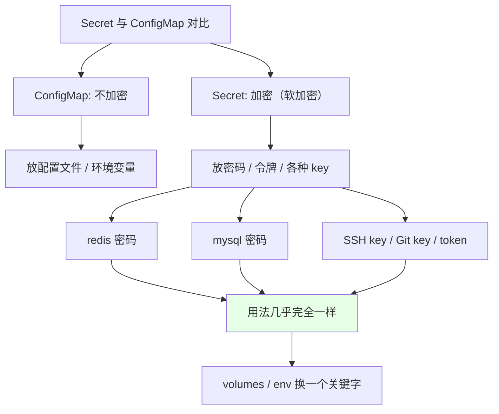
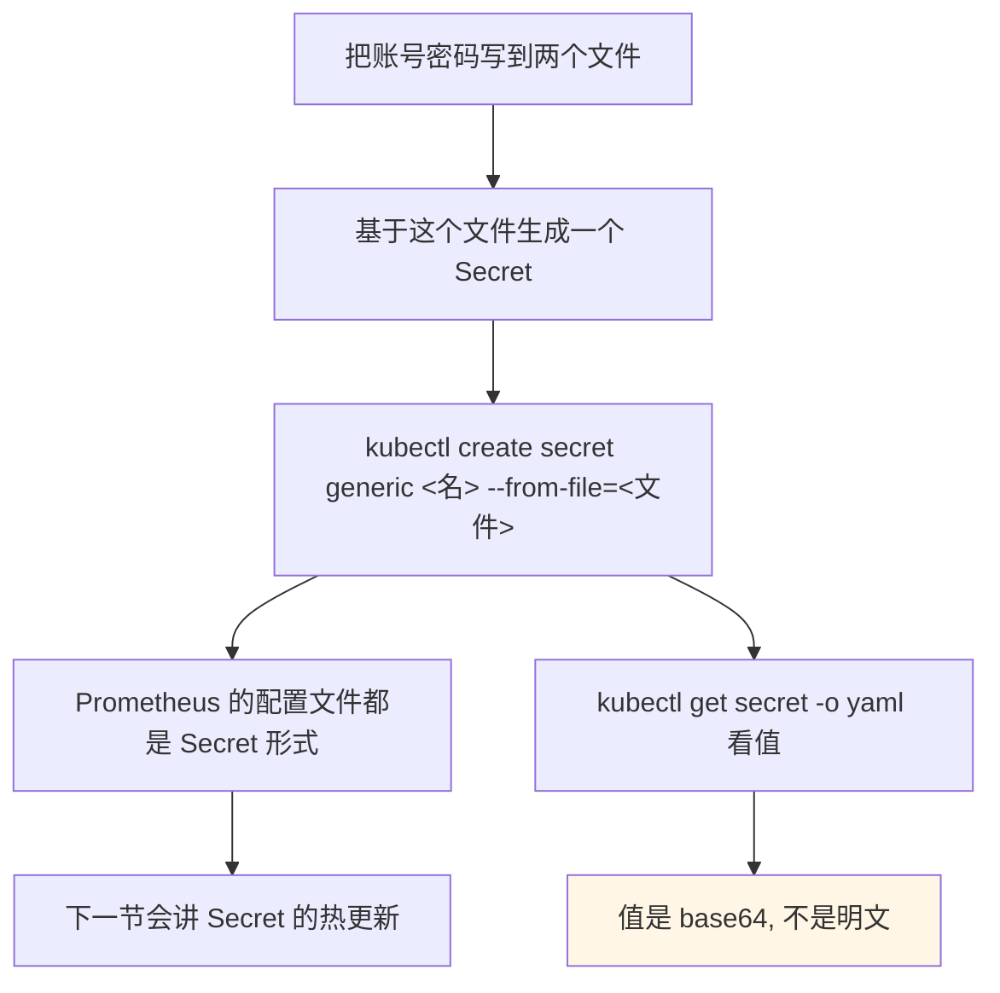
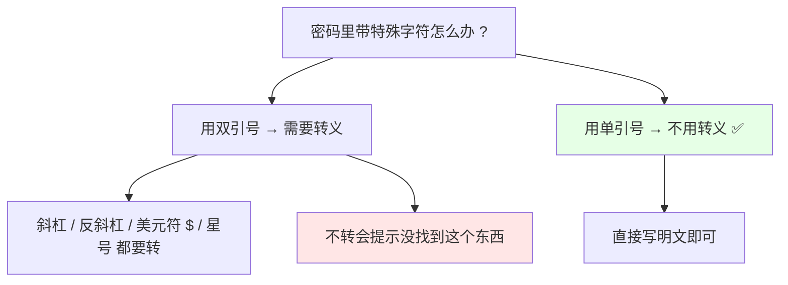
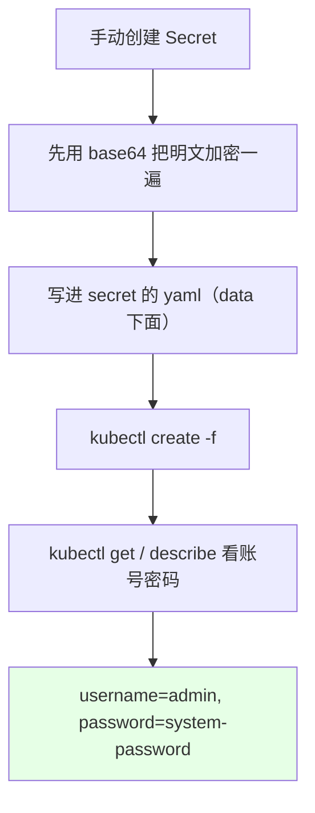
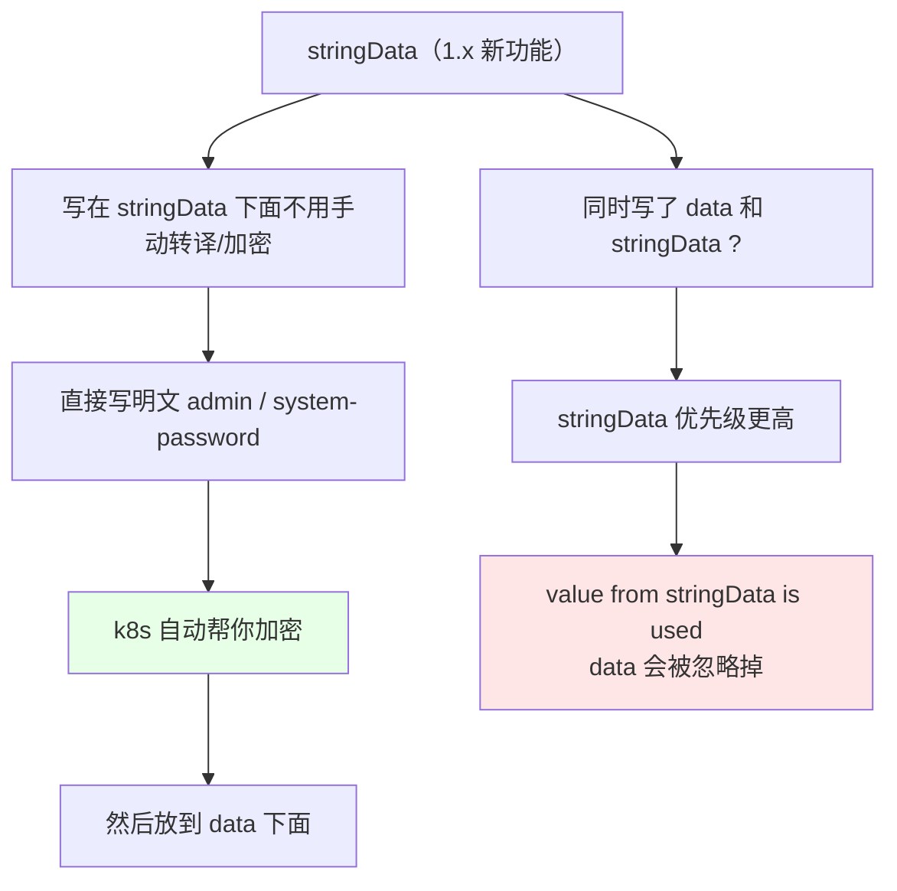
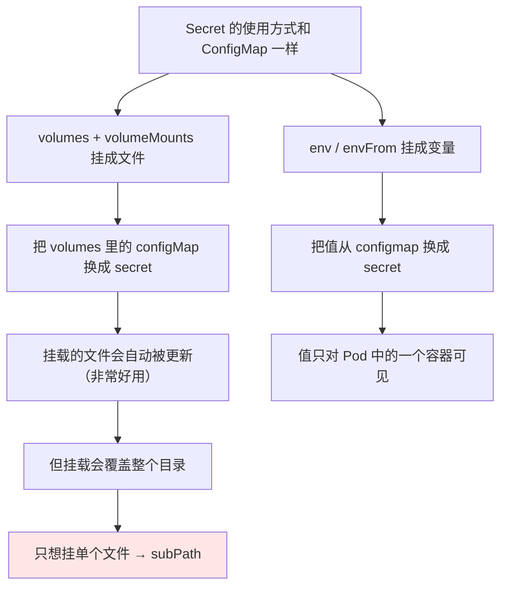
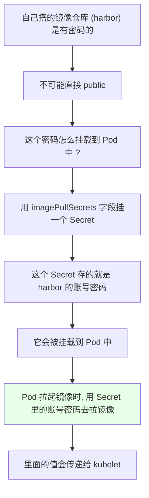
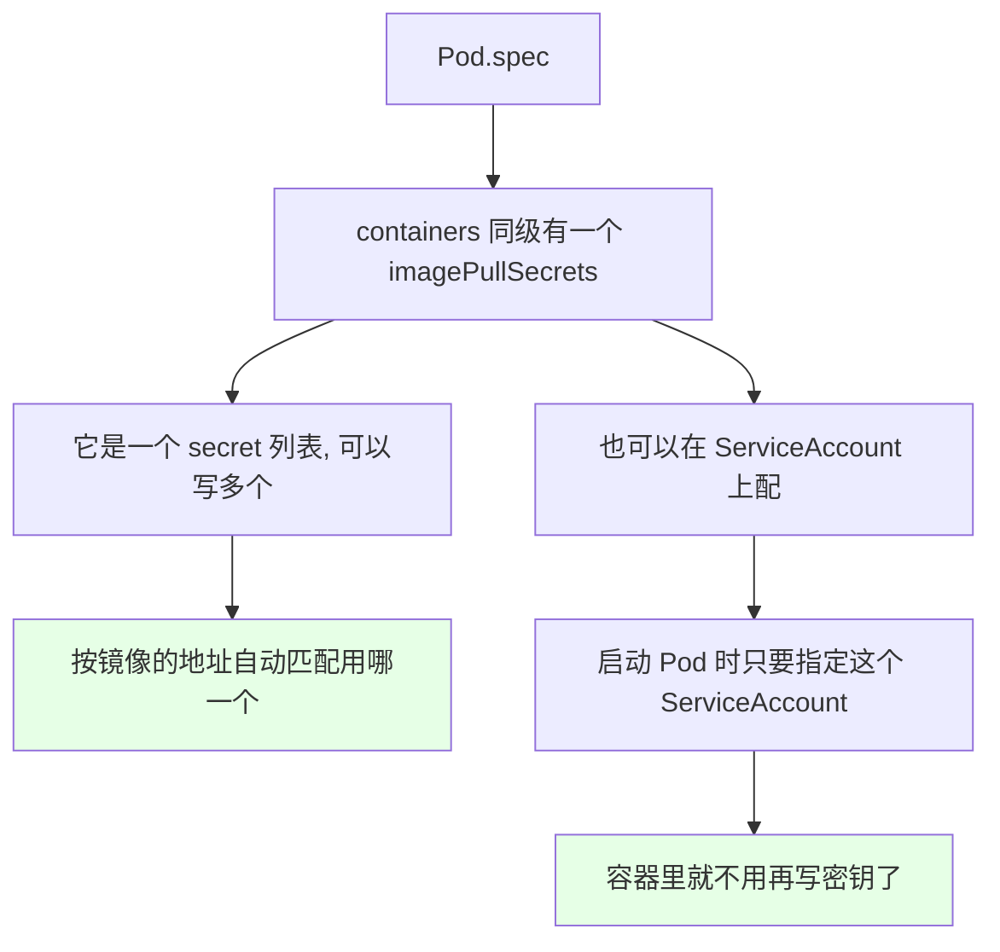
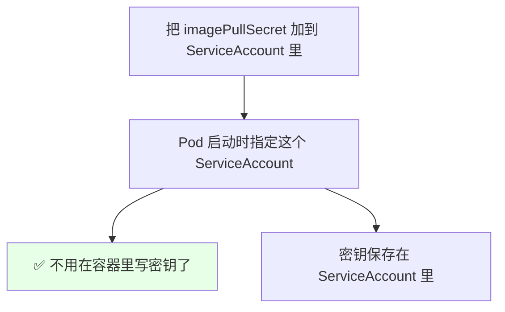

# Kubernetes 集群部署: 加密数据管理 Secret（创建方式、stringData 与 imagePullSecrets 拉私有镜像）

昨天（上一节）讲 ConfigMap 主要是放配置文件。**Secret 和 ConfigMap 的区别其实不大** —— ConfigMap 是不加密的配置，Secret 是**加密**的敏感数据。

结论先摆：

1. **Secret 用来保存敏感信息**：密码、令牌（token）、各种 key（SSH key、Git 的 key），以及 **redis / mysql 这类应用的密码**；
2. **它的"加密"是软加密**：base64 编码，**可以反解回来** —— 看 yaml 没有明文，但 `base64 -d` 一下就出来了，**不是硬加密**；
3. **用法和 ConfigMap 几乎一模一样**：`volumes` 里把 `configMap` 换成 `secret` 就行，参数（`readOnly`、`items`、`defaultMode`、变量注入、热更新）全通；
4. **`stringData` 是新功能**：写在它下面**不用手动 base64**，直接写明文，k8s 自动帮你加密再放进 `data`；但**`stringData` 优先级更高**，同时写了 `data` 和 `stringData`，**`stringData` 的值会生效，`data` 被忽略**；
5. **最最常用的一个功能是 `imagePullSecrets`**：给 Pod 配上存着 harbor 账号密码的 secret，**Pod 拉私有镜像时自动用它去拉**。

## 纲要

- Secret 与 ConfigMap 的区别
- 从文件创建 Secret（最常用）
- base64 软加密与手动解密
- 特殊字符的转义坑
- 手动 base64 创建
- stringData：自动加密与优先级
- 使用方式：挂成文件、挂成变量
- defaultMode 与只读、items
- imagePullSecrets：拉取私有镜像（重点）
- 挂到 ServiceAccount 上
- 小结

## Secret 与 ConfigMap 的区别



昨天讲 ConfigMap 的时候说过，**Secret 和 ConfigMap 的用法大部分都一样**，只不过 **Secret 是加密的**。所以这一节讲得简单些 —— 大致过一遍它的用法就行。

- **Secret 是用来保存敏感信息的** —— 比如**密码、令牌（token）、各种 key（SSH 的 key、Git 的 key）**；
- **redis、mysql 这类应用的密码**，都可以放在 Secret 里；
- Secret 会把文字进行**加密**（其实是 base64 编码）然后放进去；
- **但这个加密不是强制性的，是可以反解过来的** —— 所以别把它当成硬加密用。

## 从文件创建 Secret（最常用）

**`--from-file` 是非常非常常用的方式**。



```bash
# 1. 建一个文件夹, 把账号密码各放一个文件
mkdir -p secret-files
echo -n "admin" > secret-files/username
echo -n "system-password" > secret-files/password
ls secret-files/
# password  username

# 2. 基于这个文件创建一个 Secret
kubectl create secret generic my-credentials --from-file=secret-files/

# 3. 看内容
kubectl get secret my-credentials -o yaml
# data:
#   password: c3lzdGVtLXBhc3N3b3Jk
#   username: YWRtaW4=
```

### base64 软加密与手动解密

```bash
# 4. 这个值看着不是明文
kubectl get secret my-credentials -o jsonpath='{.data.password}'
# c3lzdGVtLXBhc3N3b3Jk

# 5. 手动解密一下
VAL=$(kubectl get secret my-credentials -o jsonpath='{.data.password}')
echo "$VAL" | base64 -d
# system-password   ← 和原密码一样
```

所以：**它确实是加密存储的**（yaml 里看不到明文），**但用 base64 还是可以解出来的** —— **这不是硬加密，是软加密**。

## 特殊字符的转义坑



```bash
# 1. 从字符（字面量）创建
kubectl create secret generic my-secret \
  --from-literal=username=admin \
  --from-literal=password='!b/*$d'

# 2. 用单引号: 不需要转义, 直接用就行
kubectl get secret my-secret -o yaml
# data:
#   password: ICliKi8qJGU=

# 3. 用双引号: 特殊字符(斜杠 / 、反斜杠、美元符 $、星号)必须转义
#    不转义会报 not found 之类的问题
kubectl create secret generic my-secret \
  --from-literal=password="!b\\/\\*$d"

# 4. 看两个是不是一样的
kubectl get secret my-secret -o yaml
```

> 结论：**如果你的密码有特殊字符，就需要用反斜杠进行转译/转义；不想转义的话，用单引号包起来就行。** 用双引号的话这些符号（斜杠、美元符、星号）都得先转译一下。

## 手动 base64 创建



```bash
# 1. 先手动把字符串加密
echo -n "admin" | base64
# YWRtaW4=
echo -n "system-password" | base64
# c3lzdGVtLXBhc3N3b3Jk
```

```yaml
apiVersion: v1
kind: Secret
metadata:
  name: manual-secret
type: Opaque
data:
  username: YWRtaW4=          # 前置手动 base64 过的
  password: c3lzdGVtLXBhc3N3b3Jk
```

```bash
# 2. 创建并核对
kubectl create -f manual-secret.yaml
kubectl get secret manual-secret -o yaml
kubectl describe secret manual-secret
# username  ← admin
# password  ← system-password
```

## stringData：自动加密与优先级



```yaml
apiVersion: v1
kind: Secret
metadata:
  name: stringdata-secret
type: Opaque
stringData:                    # ← 注意, 不是 data
  username: admin              # 直接写明文, 不用 base64
  password: system-password
```

```bash
kubectl apply -f stringdata-secret.yaml
kubectl get secret stringdata-secret -o yaml
# data:
#   password: c3lzdGVtLXBhc3N3b3Jk   ← 自动加密好了, 跑到 data 下面了
#   username: YWRtaW4=
```

- **`stringData` 就是让你以字符串的形式去编写 Secret 文件、生成这个 Secret 资源对象**，比较方便，不用自己先敲一遍 base64；
- 注意：**它的字母不能大写**；
- 有一个点要注意：**如果你同时写了 `data` 还有一个 `stringData`**，那 **`stringData` 里的值会生效，`data` 会被忽略**（文档原话类似 `the value from stringData is used`）—— 也就是 **`stringData` 的优先级比较高**；
- 生成器（1.14 版本开始）创建 Secret 跟 ConfigMap 是一样的，这里就不重复讲了。

## 使用方式：挂成文件、挂成变量



```yaml
apiVersion: v1
kind: Pod
metadata:
  name: secret-pod
spec:
  volumes:
  - name: secret-volume
    secret:                    # ← 昨天是 configMap, 今天换成 secret
      secretName: my-credentials
      defaultMode: 420         # 老版本写 256 → 0400; 新版本直接写 420
      readOnly: true
      items:
      - key: username
        path: my-username      # 指定挂载的 key 和路径
  containers:
  - name: busybox
    image: busybox:1.28
    command: ["sleep", "3600"]
    volumeMounts:
    - name: secret-volume
      mountPath: /etc/secret
      readOnly: true
```

几个参数和 ConfigMap 是一样的：

| 参数 | 说明 |
| --- | --- |
| `secret.secretName` | 用哪个 Secret |
| `defaultMode` | 权限（mode）值；老版本要写反过来的值（写 `256` 挂载权限是 `0400`），**新版本直接写 `400` / `777` 就行**，不用写那种反过来的 |
| `readOnly` | 是只读还是可写 —— **这个一般不能反向写回去** |
| `items` | 指定挂载的 key 和对应的路径（昨天 ConfigMap 那节没细讲过），用法一样 |
| 挂载更新 | 被挂载的 Secret **会被自动更新**（和 ConfigMap 一样，非常好用） |
| 覆盖问题 | 挂载之后**会把目录给覆盖掉**，可能你只想挂一个文件而不需要替换整个目录 → **就需要 subPath** |

> 另外 **`kubectl edit secret` 这种编辑方式用的不多** —— 如果只放了账号密码还能用；但**如果你放了很多配置文件（比如 Prometheus 那种，一个 Secret 里很多个配置文件），用 edit 就不行了**，那时候需要 Secret 和 ConfigMap 的热更新（后面 Prometheus 那节演示）。

## imagePullSecrets：拉取私有镜像（最常用）



这是 **Secret 最常用、可能也是用得最多的用途**：

- 我们**自己搭建的镜像仓库（harbor）是不可能直接 public 的，肯定有密码**；
- 这个密码怎么挂载到 Pod 中呢？**用 `imagePullSecrets` 字段去挂载一个 Secret**，这个 Secret 里存的就是 **harbor 的账号密码**；
- 这个 Secret **会被挂载到 Pod 中**，**Pod 拉起镜像的时候会使用这个 Secret 里面的账号密码信息去拉我们的镜像** —— 也就是 **Pod 拉取私有镜像时的账号**；
- **这个值里面的信息会传递给 kubelet**，由 kubelet 去完成带密码的镜像拉取。

### 创建

```bash
# 一条命令就能创建（类型就是 docker-registry）
kubectl create secret docker-registry docker-harbor \
  --docker-server=192.168.31.200 \
  --docker-username=admin \
  --docker-password=Harbor12345 \
  --docker-email=admin@example.com

# 看类型
kubectl get secret docker-harbor -o yaml
# type: kubernetes.io/dockerconfigjson
# data:
#   .dockerconfigjson: xxx...   ← 是个文件
```

参数对照：

| 参数 | 填什么 |
| --- | --- |
| `--docker-server` | **harbor 的地址**（公司内网地址；如果是 docker hub 官网就不需要加地址） |
| `--docker-username` | harbor 账号 |
| `--docker-password` | harbor 密码 |
| `--docker-email` | 管理员邮箱 |

创建出来的这个 Secret 类型是 **`kubernetes.io/dockerconfigjson`**，里面存的**是一个 `.dockerconfigjson` 文件（一个 json 文件）**，内容是地址、账号、密码、email，外加那个哈希串。

### 使用



```yaml
apiVersion: v1
kind: Pod
metadata:
  name: private-image-pod
spec:
  imagePullSecrets:            # ← 和 containers 是同级的
  - name: docker-harbor        # 可以写多个, 按镜像地址自动匹配
  containers:
  - name: web
    image: 192.168.31.200/library/nginx:1.15.2
```

> `imagePullSecrets` **和 `containers` 是同级的**，是个 Secret 列表，**写多个的话，它会根据你的镜像地址自动匹配是哪一个**。

## 挂到 ServiceAccount 上



```bash
# 1. 查看 ServiceAccount
kubectl get sa
# NAME      SECRETS   AGE
# default   1         20d

# 2. 把密钥写到 ServiceAccount 里
kubectl patch serviceaccount default \
  -p '{"imagePullSecrets":[{"name":"docker-harbor"}]}'

# 3. 之后启动 Pod 时直接指定这个 ServiceAccount 就行
#    不用再写 imagePullSecrets 了（按自己喜好选）
```

这个看自己喜好 —— 有的团队把它挂在 ServiceAccount 上，**就不用在每个 Pod 的容器里写密钥了**。

## 小结

```text
Secret 的全景图:

创建（4 种）
├── --from-secret-file=<账号密码文件>   ← 最常用
├── --from-literal=K=V                  ← 密码有特殊字符用单引号
├── 手动 base64 写 data                  ← 老办法
└── stringData: 写明文, 自动加密 ✅      ← 优先级高于 data

使用（和 ConfigMap 一样）
├── volumes.secret + volumeMounts        ← 挂成文件
├── env / envFrom                        ← 挂成变量（只对 Pod 中一个容器可见）
├── defaultMode / readOnly / items       ← 参数通吃
└── 挂载的文件会被自动更新 ⚠ 覆盖目录 → subPath

独属于 Secret 的王牌
└── imagePullSecrets
    ├── docker-registry 类型 secret 存 harbor 账号密码
    ├── 值会传递给 kubelet, 用于拉私有镜像
    ├── 可挂到 ServiceAccount, 省得每个 Pod 写一遍
    └── 也可把文件加个点变成隐藏文件（演示用）
```

## API 速览

| 能力 | 做法 | 关键点 |
| --- | --- | --- |
| 存什么 | 密码 / 令牌 token / SSH key / Git key / redis / mysql 密码 | 敏感信息 |
| 与 ConfigMap | 用法**几乎完全一样**，Secret 是加密版 | volumes 里换 `secret` 关键字 |
| 加密强度 | **软加密（base64）**，可以 `base64 -d` 解回来 | 不是硬加密 |
| 从文件创建 | `kubectl create secret generic <名> --from-file=<文件>` | **最常用**，Prometheus 配置也这么放 |
| 从字面量 | `--from-literal=password=<值>` | 密码有 `/`、`$`、`*` 要转义 |
| 转义技巧 | **单引号不用转义，双引号要转义** | 双引号不转会报 not found |
| 手动创建 | 先 `echo -n x \| base64` 再写 `data` | 老办法 |
| `stringData` | 直接写明文，k8s 自动加密后放进 `data` | 新功能，比较方便 |
| ⚠ 优先级 | 同时写 `data` + `stringData`，**`stringData` 生效，`data` 被忽略** | stringData 优先级高 |
| 查看解密 | `echo "$VAL" \| base64 -d` | 用 `-o jsonpath` 取值 |
| 挂成文件 | `volumes.secret.secretName` + `volumeMounts` | 与 ConfigMap 同构 |
| 权限 | `defaultMode`：老版本写反向值（`256`→`0400`），**新版本直接写 `400`/`777`** | 新版本写法更直观 |
| 热更新 | 挂载的 Secret **会被自动更新** | 但覆盖目录 → subPath |
| **拉私有镜像** | **`imagePullSecrets`** | **最常用用途** |
| 创建镜像密钥 | `kubectl create secret docker-registry <名> --docker-server/--docker-username/--docker-password/--docker-email` | 类型是 `kubernetes.io/dockerconfigjson` |
| 镜像密钥用法 | `spec.imagePullSecrets`（与 containers 同级，可配多个按地址匹配） | 也可挂到 ServiceAccount |

## Demo 示例

```bash
# 1. 从文件创建 Secret（最常用）
mkdir -p secret-files
echo -n "admin" > secret-files/username
echo -n "system-password" > secret-files/password
kubectl create secret generic my-credentials --from-file=secret-files/

# 2. 看软加密的效果并手动解密
kubectl get secret my-credentials -o yaml
VAL=$(kubectl get secret my-credentials -o jsonpath='{.data.password}')
echo "$VAL" | base64 -d
# system-password
```

```bash
# 3. 带特殊字符的密码（用单引号, 不用转义）
kubectl create secret generic my-secret --from-literal=password='!b/*$d'
kubectl get secret my-secret -o yaml

# 4. stringData 自动加密
kubectl apply -f stringdata-secret.yaml
kubectl get secret stringdata-secret -o yaml

# 5. 拉私有镜像的密钥
kubectl create secret docker-registry docker-harbor \
  --docker-server=192.168.31.200 \
  --docker-username=admin \
  --docker-password=Harbor12345 \
  --docker-email=admin@example.com
kubectl get secret docker-harbor -o yaml
```

```bash
# 6. 先看默认的 ServiceAccount 长这样
kubectl get sa
kubectl describe sa default

# 7. 把镜像密钥挂到 ServiceAccount 上（容器里就不用写了）
kubectl patch serviceaccount default -p '{"imagePullSecrets":[{"name":"docker-harbor"}]}'
kubectl describe sa default

# 8. 起一个拉私有镜像的 Pod 验证
kubectl apply -f private-image-pod.yaml
kubectl get pod -o wide
```

```text
9. 一个 Secret 里放多个配置文件的形态（Prometheus 那种）:

Prometheus Secret
├── prometheus.yml          ← K 是文件名
├── rules.yml
└── alertmanager.yml

挂载到容器里:
/etc/prometheus/
├── prometheus.yml      ← V 是文件内容
├── rules.yml
└── alertmanager.yml

这种一个 Secret 装一堆配置文件的场景,
kubectl edit 就不好使了, 得靠热更新 + subPath
```

### 总结

- **Secret 和 ConfigMap 区别不大，Secret 是加密版**：ConfigMap 放配置文件，Secret 存**密码、令牌 token、SSH key / Git key、redis / mysql 的密码**这类敏感信息；`volumes` 里把 `configMap` 换成 `secret`，其余用法全通；
- **它的加密是软加密**：yaml 里看不到明文，但 `echo "$VAL" | base64 -d` 马上还原 —— **不要当成硬加密来依赖**；
- **创建四种方式**：`--from-file`（最常用）、`--from-literal`（密码含 `/`、`$`、`*` 等特殊字符时**用单引号包起来就不用转义**，双引号要转译不然报错）、手动先 base64 再写 `data`、`stringData`（直接写明文、k8s 自动帮你加密后放进 `data`，**但 `stringData` 优先级更高，同时写 `data` 的话 `data` 会被忽略**）；
- **使用方式照抄 ConfigMap**：挂成文件（`volumes.secret` + `volumeMounts`，可配 `defaultMode`、`readOnly`、`items`，挂载的文件会被自动更新）；挂成变量（`env` / `envFrom`，值只对 Pod 中一个容器可见）—— **注意挂载会覆盖整个目录，只想挂单文件得靠 subPath**，文本量大的 Secret（Prometheus 那种）`kubectl edit` 也不好使，得靠热更新；
- **`defaultMode` 版本差异**：老版本要写反向值（写 `256` 挂载出来是 `0400`），**新版本直接写 `400` / `777`**；
- **Secret 最王牌的用途是 `imagePullSecrets`**：`kubectl create secret docker-registry <名> --docker-server/--docker-username/--docker-password/--docker-email` 一条命令造出 harbor 的账号密码，类型是 `kubernetes.io/dockerconfigjson`；在 **Pod 的 `spec.imagePullSecrets`（与 containers 同级，可多个按镜像地址自动匹配）** 上引用，**值会传递给 kubelet** 去拉私有镜像；也可以把它 patch 到 **ServiceAccount** 上，这样启动 Pod 时指定 SA 就行，**容器里就不用再写一遍密钥**。

