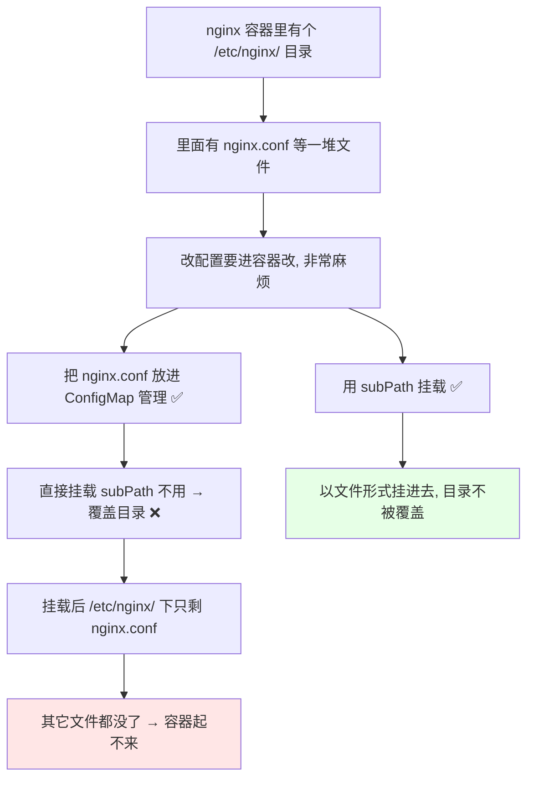
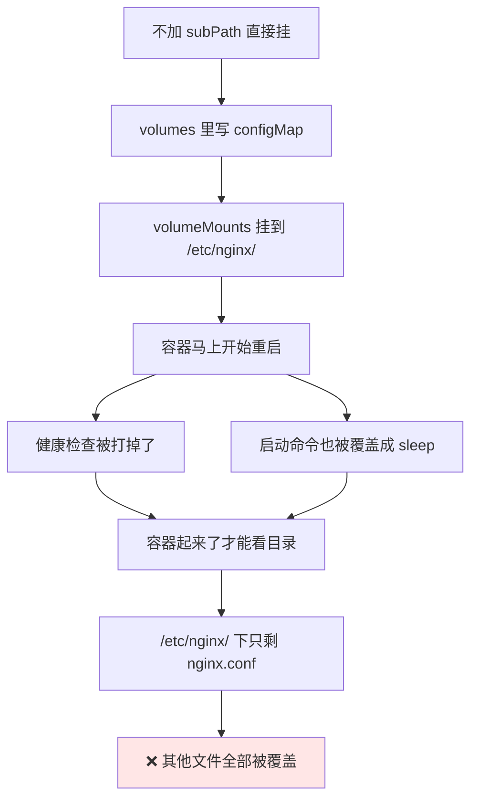
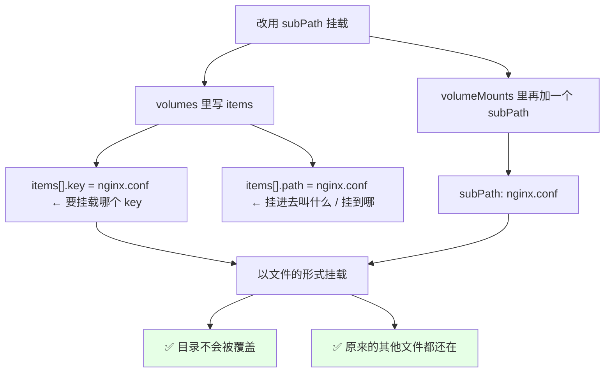
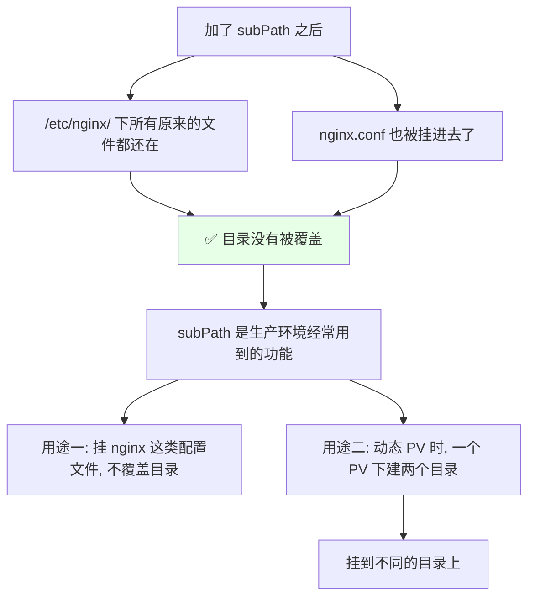
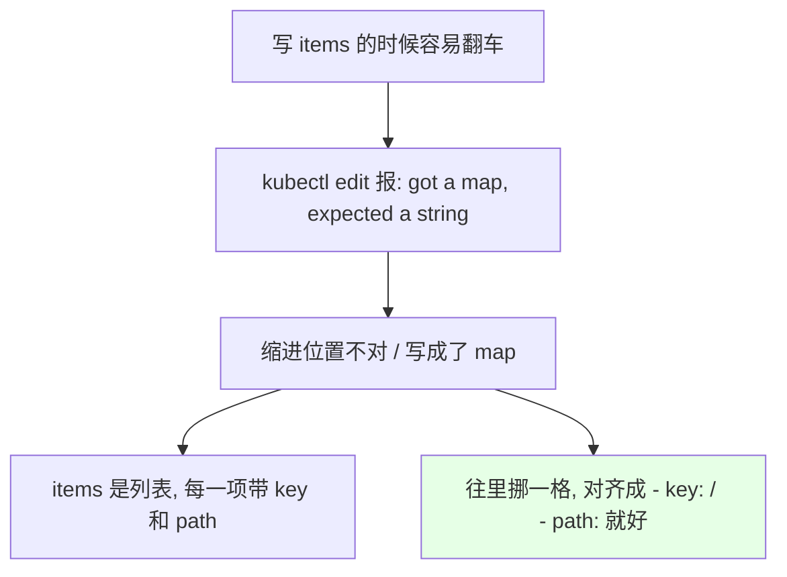

# Kubernetes 集群部署: ConfigMap & Secret 使用 SubPath（解决挂载覆盖目录的问题）

上一节讲 ConfigMap 和 Secret 的用法时留了个尾巴：**它们挂载的时候是会覆盖那个目录的**，SubPath 就是用来解决这个覆盖问题的。

结论先摆：

1. **把 nginx.conf 挂到 `/etc/nginx/` 下，会把这个目录下其它文件全部覆盖掉** —— 容器直接起不来（本次演示还顺带把健康检查关掉、启动命令改成 `sleep`，才能看到挂载后的目录）；
2. **`subPath` 就是为这个场景生的**：把 ConfigMap 里的**一个文件以文件的形式挂进去，目录不再被覆盖**；
3. **两处代码要配套**：`volumes[].configMap.items[].path` 指定**要挂载哪个 key**，`volumeMounts[].subPath` 指定**以子路径形式挂载**；
4. **层级别写错**：`volumes` 是和 `containers`、`dnsPolicy` 对齐的（spec 级），`volumeMounts` 是**容器级**的，每个要用这个配置的容器都得写一遍；
5. **items 的 `path` 前面的根不要写**（写成 `etc/nginx/nginx.conf` 那种），**subPath 是生产环境经常用到的功能**，另外在动态 PV 那节还会用到它（一个 PV 下建两个目录挂到不同目录）。

## 纲要

- 覆盖目录这个问题从哪来
- 场景回顾：nginx.conf 该放哪
- 先直接挂载看看（目录被覆盖）
- 演示用的两个开关：健康检查与启动命令
- 用 subPath 挂载单文件
- 完整清单逐段解读
- 验证：文件都在，目录没被覆盖
- 层级写法与常见报错
- subPath 的其它用途

## 覆盖目录这个问题从哪来



- 我们之前创建的 **demo 和 nginx 这个容器**里，是**有一个配置目录的，里面有 `nginx.conf`**；
- 如果我们把 `nginx.conf` 放到这个容器里，要改它就得改容器，**非常非常麻烦** —— 所以要把 **nginx.conf 放到 ConfigMap 去管理**；
- 但**直接挂载到 `/etc/nginx/` 下的话，会把 `/etc/nginx/` 下其他的文件给覆盖掉** —— 挂载完这个目录**只剩 nginx.conf 一个文件**，容器肯定就出问题了。

## 场景回顾：nginx.conf 该放哪

```bash
# 1. 先把这个配置文件（一个 nginx.conf 文件）导出来
kubectl cp nginx-demo:/etc/nginx/nginx.conf ./nginx.conf
ls -l nginx.conf

# 2. 以文件形式创建一个 ConfigMap（这个用法是你最常用的一个用法）
kubectl create configmap nginx-conf-cm --from-file=nginx.conf

# 3. 看创建完成
kubectl get cm nginx-conf-cm -o yaml
# data:
#   nginx.conf: |
#     server { ... }
```

**以文件形式创建 ConfigMap 是你最常用的用法** —— 前面 ConfigMap 那节讲过，这里正好用上。

## 先直接挂载看看（目录被覆盖）

```bash
# 先不加 subPath, 直接挂, 看会有什么问题
kubectl edit pod nginx-demo
```



### 演示用的两个开关

直接挂上去容器会起不来，为了能看清挂载后的目录，演示时做了两件事：

```text
为了演示, 把这两处改掉:

1. 把健康检查（readiness / liveness 那两个探针）关掉
   → 不然容器一直判不健康

2. 把启动命令改成 sleep
   → 原来的启动命令是把 nginx 起起来, 挂载覆盖之后
     命令执行失败, 容器状态就不正常, 看不到挂载的目录
   → 改成 sh -c "sleep 3600" 只是为了演示

演示完记得按自己的需求把它们加回来
```

## 用 subPath 挂载单文件



- 需要写成 `configMap`，然后**加一个 `items`** —— **key 就是 `nginx.conf`**；
- `path` 就是**要挂载到的路径**（比如我们要挂载 `/etc/nginx/` 下的 `nginx.conf`）；
- **注意：前面的根（`/`）不能写**，写了就还是那种覆盖的形式；
- 然后**再加一个参数 `subPath`**，跟前面那个写法一样；
- 这样它的 ConfigMap **就是以文件的形式去挂载，目录就不会被覆盖**。

## 完整清单逐段解读

```yaml
apiVersion: v1
kind: Pod
metadata:
  name: nginx-demo
spec:
  volumes:                          # ← 和 containers、dnsPolicy 对齐（spec 级）
  - name: config-volume
    configMap:
      name: nginx-conf-cm           # 用哪个 ConfigMap
      items:                        # ← 关键: 只挑指定项
      - key: nginx.conf             # ConfigMap 里的 key
        path: etc/nginx/nginx.conf  # 注意: 前面的根不写
  containers:
  - name: nginx
    image: nginx:1.15.2
    # readinessProbe:  ...   ← 演示时先关掉
    # livenessProbe:   ...   ← 演示时先关掉
    command: ["sh", "-c", "sleep 3600"]   # 演示时改掉启动命令
    volumeMounts:                  # ← 容器级: 每个容器都要写
    - name: config-volume
      mountPath: /etc/nginx/nginx.conf     # 挂到容器里的哪个路径
      subPath: etc/nginx/nginx.conf        # ← 关键: 子路径形式
```

### 两段配置的分工

| 位置 | 字段 | 作用 |
| --- | --- | --- |
| `volumes[].configMap.items[]` | `key` | **ConfigMap 里的哪个 key**（就是 data 上面那个 `nginx.conf`） |
| `volumes[].configMap.items[]` | `path` | 挂进去之后叫啥 / 放哪，**前面的根不写**（如 `etc/nginx/nginx.conf`） |
| `volumeMounts[]` | `mountPath` | **容器里的最终挂载路径**（`/etc/nginx/nginx.conf`） |
| `volumeMounts[]` | `subPath` | **以子路径形式挂载**，这才是不覆盖目录的关键 |

> 也可以写成最常见的简短形式：`items[].path: nginx.conf` 配 `subPath: nginx.conf`，效果一样 —— 都是一个文件单独挂进去。

### 层级写法

```text
spec 下面对齐的三块:

spec:
├── containers      ← 容器列表
├── volumes         ← 卷定义（和 containers 对齐）
└── dnsPolicy       ← 也是对齐的

而挂载是容器级:
spec.containers[].volumeMounts[]
  └── 哪个容器要用这个配置, 就在这个容器里写一行 volumeMounts
```

- **volumes 这个地方是和 `dnsPolicy` 对齐的**，也就是和 `containers` 对齐（spec 级）；
- **挂载（volumeMounts）是以容器为基础的** —— **哪个容器要用这个配置文件，每个容器都得写一行 `volumeMounts`**。

## 验证：文件都在，目录没被覆盖

```bash
# 保存退出, 等它起
kubectl get pod nginx-demo -w

# 进容器看目录
kubectl exec -it nginx-demo -- ls -l /etc/nginx/
# 还是这么多文件, 一个没少
# nginx.conf  ← 我们挂进去的那份也在

kubectl exec -it nginx-demo -- cat /etc/nginx/nginx.conf
# 内容就是 ConfigMap 里的那份
```



- 进去看，**所有的文件都还在**，而且 **nginx.conf 也在** —— 目录**没有被覆盖**；
- 这就是 subPath 真正解决问题的时候。

## 层级写法与常见报错



编辑的时候容易出现这类报错（**获得一个 map，期望的是一个 string** 那种），多半是 `items` 的缩进和位置写错了：

- `items` 是**列表**，每一项带 `key` 和 `path`，**列表项前面要写 `-`**；
- 顺序搞反（`path` 写到了 `key` 的位置）或者**缩进错了一格**都会报这个；
- 往里/往外挪一格对齐一下就好，**这种格式肉眼最容易看错**，用 `kubectl edit` 时尤其明显。

## subPath 的其它用途

```text
subPath 的用途不止一个:

用途一（本节, 非常常用）
├── 挂 nginx.conf 这类配置文件
├── 以文件形式挂载, 不覆盖目录
└── 生产里见到频率极高

用途二（动态 PV 那节会讲）
├── 在一个 PV 下面创建两个目录
└── 分别挂载到不同的目录上
```

- **用途一（本节）**：像 nginx 这种**配置文件不覆盖目录**，用的非常多；
- **用途二**：**讲动态 PV 的时候还会用到这个 subPath** —— 那时候可以在**一个 PV 下创建两个目录，然后挂载到不同的目录上面**，那个也是 subPath 的一个用途。

> 演示时把健康检查去掉了，**你们可以按自己的需求把它加回来**。

## API 速览

| 能力 | 做法 | 关键点 |
| --- | --- | --- |
| 解决什么 | ConfigMap / Secret **挂载会覆盖整个目录** | subPath 用来解决覆盖 |
| 典型场景 | 挂 `nginx.conf` 到 `/etc/nginx/` | 挂完目录只剩这一个文件，容器起不来 |
| 挑出单个文件 | `volumes[].configMap.items[].key` | key 就是 ConfigMap data 上面那个 key |
| 挂到哪 / 叫什么 | `volumes[].configMap.items[].path` | **前面的根不写**（`etc/nginx/nginx.conf`） |
| 容器里最终路径 | `volumeMounts[].mountPath` | 如 `/etc/nginx/nginx.conf` |
| **关键** | `volumeMounts[].subPath` | **有它才以文件形式挂载、不覆盖目录** |
| 层级 | `volumes` 与 `containers` 对齐（spec 级） | `volumeMounts` 是容器级，每个容器都要写 |
| 演示技巧 | 关掉探针 + 启动命令改成 `sleep` | 否则容器起不来看不到挂载目录 |
| 常见报错 | `got a map, expected a string` | items 缩进/顺序写错，列表项漏 `-` |
| 其它用途 | 动态 PV：一个 PV 下两个目录挂到不同目录 | 后面存储章节会讲 |
| 创建前置 | `kubectl create configmap <名> --from-file=<文件>` | 以文件创建 ConfigMap，最常用 |

## Demo 示例

```bash
# 1. 把 nginx.conf 从容器里导出来
kubectl cp nginx-demo:/etc/nginx/nginx.conf ./nginx.conf

# 2. 以文件形式创建 ConfigMap（最常用写法）
kubectl create configmap nginx-conf-cm --from-file=nginx.conf
kubectl get cm nginx-conf-cm -o yaml

# 3. 先看不加 subPath 的后果（容器会异常）
kubectl apply -f nginx-direct-mount.yaml
kubectl get pod nginx-demo
kubectl exec -it nginx-demo -- ls -l /etc/nginx/
# 只剩 nginx.conf, 其他全没了
```

```bash
# 4. 改成 subPath 挂载
kubectl apply -f nginx-subpath-mount.yaml

# 5. 验证: 目录没被覆盖
kubectl get pod nginx-demo
kubectl exec -it nginx-demo -- ls -l /etc/nginx/
# 原来的文件都还在, nginx.conf 也在

kubectl exec -it nginx-demo -- cat /etc/nginx/nginx.conf
# 就是 ConfigMap 里那份配置
```

```text
6. 两种挂载形态对照:

❌ 直接挂（volumes.configMap, 无 items / 无 subPath）
   /etc/nginx/
   └── nginx.conf                      ← 目录被整个替换

✅ subPath 挂单文件
   /etc/nginx/
   ├── nginx.conf                      ← 挂进来的这一份
   ├── conf.d/                         ← 原来的都还在
   ├── mime.types
   └── ...（一个没少）
```

### 总结

- **ConfigMap / Secret 挂载默认会覆盖整个目录** —— 把 `nginx.conf` 挂到 `/etc/nginx/` 下，这个目录里其他文件会**全被替换成挂载内容，容器直接起不来**；
- **`subPath` 就是为这个场景生的**：`volumes[].configMap.items` 里用 `key` 挑出那个 key、`path` 指定挂进去的路径（**前面的根不要写**），`volumeMounts` 里再加 **`subPath`**，ConfigMap 就以**文件形式**挂进去，**目录不被覆盖**，原来文件一个不少；
- **层级要记牢**：`volumes` 是和 `containers`、`dnsPolicy` **对齐的（spec 级）**，`volumeMounts` 是**容器级**的 —— 哪个容器要用这个配置，每个容器都要写一行；
- **写 `items` 时最容易翻车**：缩进错一格或列表项漏 `-`，会报 `got a map, expected a string` 这类错，挪对齐就好 —— 这种格式肉眼很难扫干净；
- **演示时要把探针关掉、把启动命令改成 `sleep 3600`**，否则容器起不来根本看不到挂载目录（**演示完记得按自己需求加回来**）；
- **subPath 不止这一处用**：前面以文件创建 ConfigMap 是最常用写法，而**动态 PV 那节还会用它** —— 一个 PV 下面建两个目录、分别挂到不同目录上。

