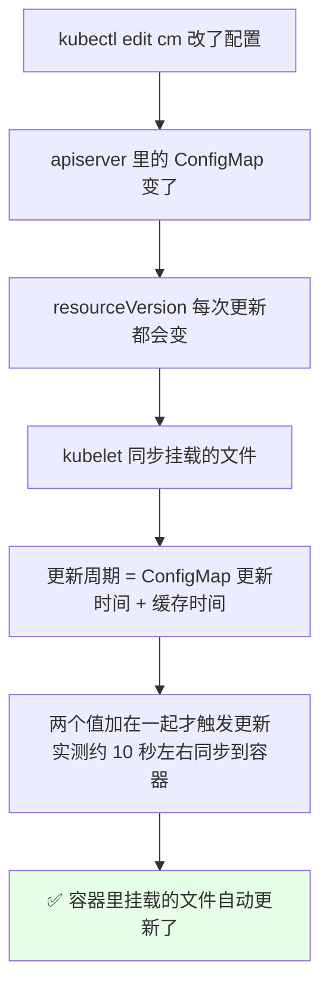
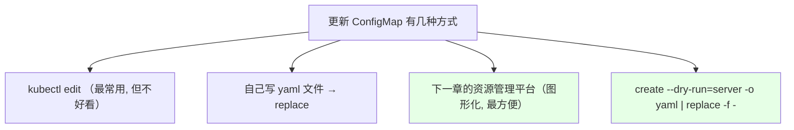
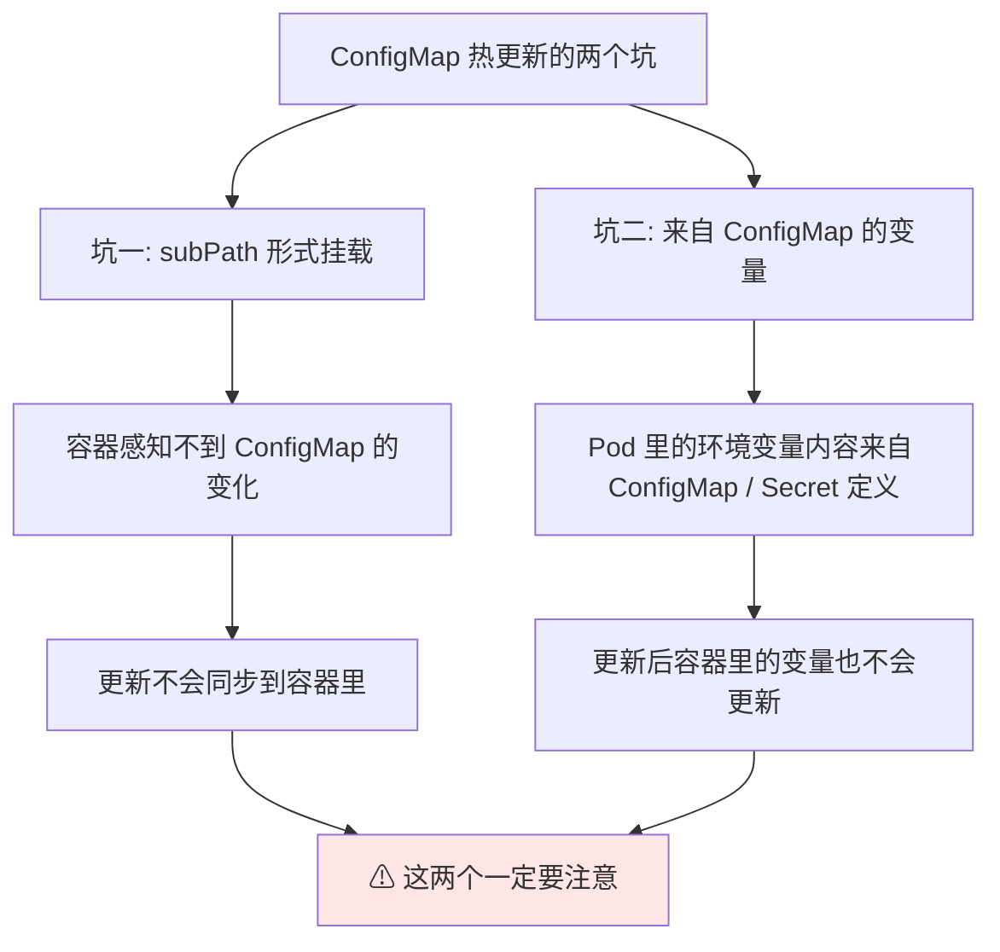
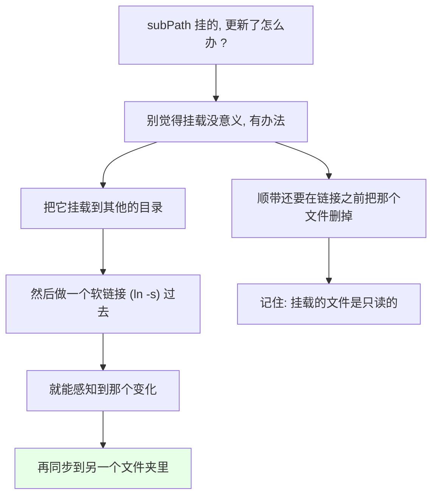
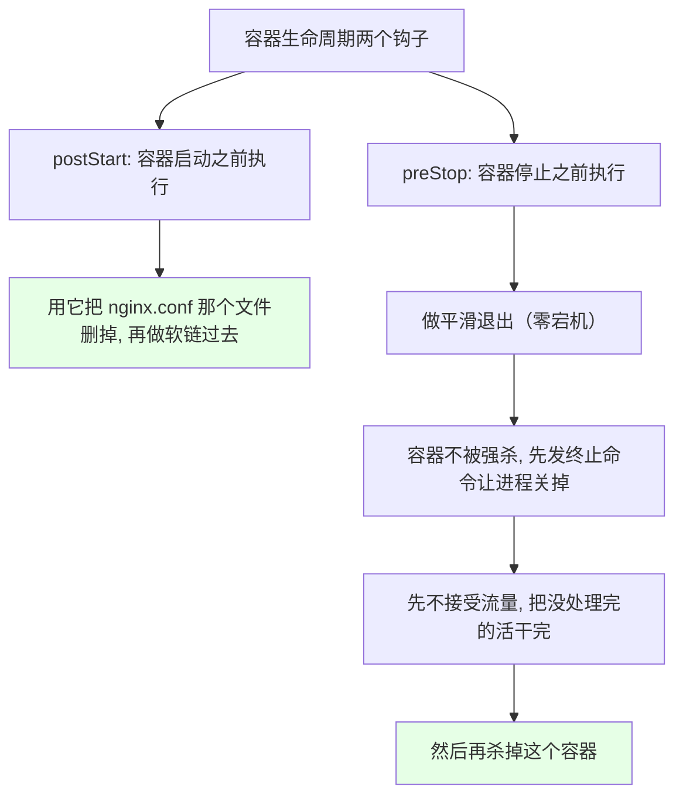
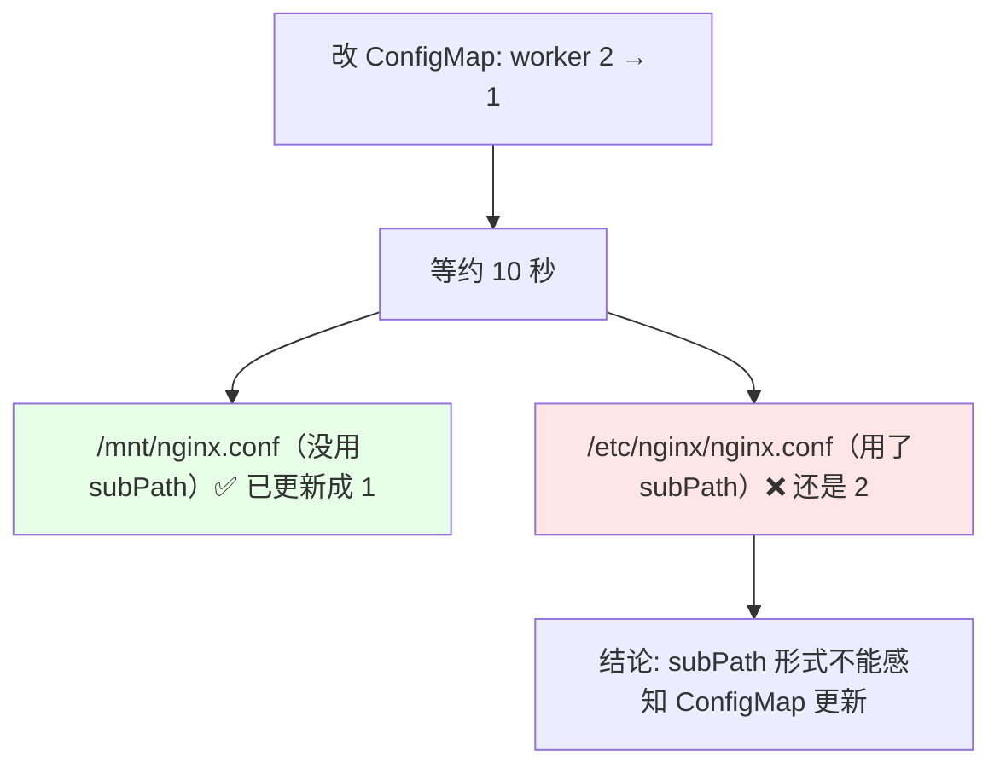
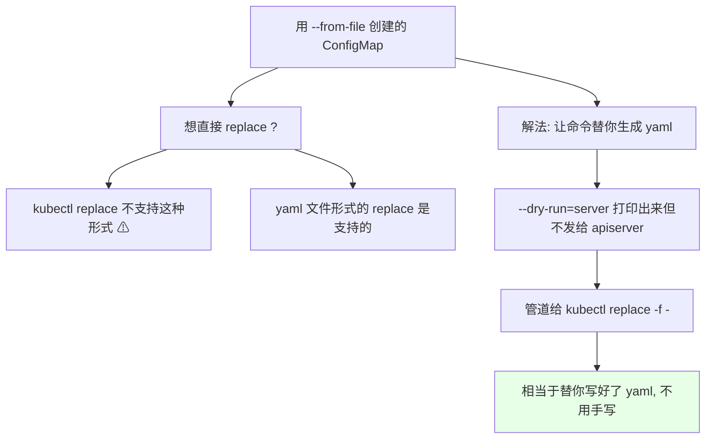
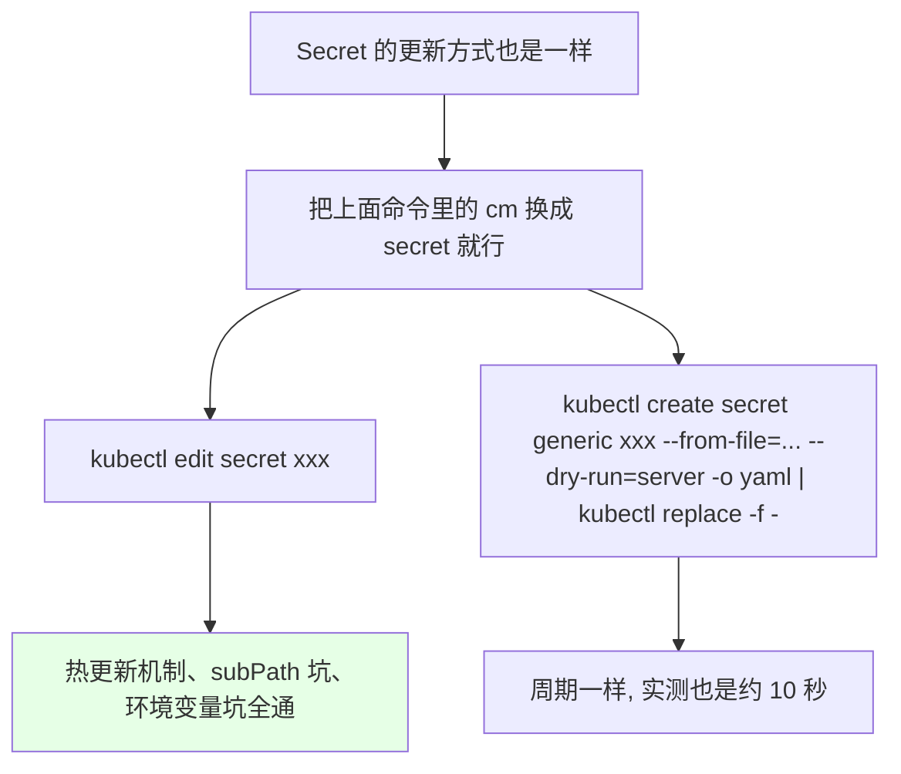

# Kubernetes 集群部署: ConfigMap & Secret 热更新（更新方式、subPath 感知不到与 dry-run 技巧）

上一节讲 subPath 的用途，这一节趁热打铁讲 **ConfigMap 和 Secret 的热更新** —— 更新 ConfigMap 后，它会自动把内容同步到容器里。

结论先摆：

1. **ConfigMap（和 Secret）更新以后会自动同步到容器里** —— 但**有周期**，周期 = ConfigMap 的**更新时间 + 缓存时间**，两个值加在一起才会触发更新（实测改完约 **10 秒** 左右能同步）；
2. **两个大坑**：① **以 `subPath` 形式挂载的，容器感知不到变动，更新同步不进去**；② **来自 ConfigMap / Secret 的**环境变量**更新后容器里的变量也不变**；
3. **subPath 场景的解决办法**：把 ConfigMap **挂到别的目录（如 `/mnt`）**，再用 `ln -s` **软链过去** —— 就能感知更新再同步过去（链接前先把原文件删掉，用 `postStart` 干这件事）；
4. **`kubectl edit` 大部分情况下不好用**：内容短时直接把整段内容塞进 ConfigMap 里**非常不好看**，内容长时又只显示文件大小；
5. **最常用的非编辑更新法**：`kubectl create cm ... --from-file=... --dry-run=server -o yaml | kubectl replace -f -` —— 让命令行**替你生成 yaml**，不用手写。

## 纲要

- 热更新是怎么工作的
- 更新方式一：kubectl edit
- 两个必须记住的坑
- 坑一：subPath 挂载感知不到更新
- 软链接的解决办法
- postStart / preStop 顺带一提
- 实测对比：两个目录一个更新一个没更新
- 更新方式二：导出 yaml 后 replace
- 更新方式三：dry-run 生成再 replace（最推荐）
- dry-run 的原理
- 与 Secret 的关系

## 热更新是怎么工作的





我们只演示 ConfigMap 就好 —— **Secret 的更新方式是一样的**。

## 更新方式一：kubectl edit

```bash
# 1. 编辑 ConfigMap
kubectl edit configmap nginx-conf-cm
# 把 worker_processes 改成 2, 保存退出
#   worker_processes  2;

# 2. 看 resourceVersion —— 每次更新它都会变
kubectl get configmap nginx-conf-cm -o yaml | grep resourceVersion
# resourceVersion: "12345"   ← 每次更新都不同
```

改完就更新了，可以去看容器里挂载的那个文件。

> **但 `kubectl edit` 大部分情况下不能很好用**：如果这个文件内容比较**小**，它会**直接把整段内容显示到 ConfigMap 里面，非常不好看、也改不动**（你看到的是一大坨拼接后的文本）；如果这个文件**特别长**，它**只会显示这个文件的大小**，压根看不到内容。

## 两个必须记住的坑



**坑一**：如果 ConfigMap（和 Secret）**是以 subPath 的形式挂载**的，那么 **ConfigMap 更新了，Pod 感知不到它的变化，更新不会同步到你的容器里面**。

**坑二**：**如果 Pod 里的变量（环境变量）内容来自 ConfigMap / Secret 的定义**，那 ConfigMap、Secret 更新了，**容器里的变量也不会更新**。

> 这两点一定要记住。

## 坑一：subPath 挂载感知不到更新



解决办法：

- 我们可以**把它挂载到其他的目录，然后做一个软链接过去**；
- 这样的话**它就可以感知到那个变化，然后再同步到另一个文件夹里面** —— 用 **`ln -s` 这种软链的形式**；
- **注意：链接之前要把那个文件给删掉**（挂载进去的文件是只读的，不能直接替换成一个链接）。

```text
软链方案:

ConfigMap: nginx-conf-cm
   │  挂载（不带 subPath, 直接挂目录）
   ▼
/mnt/nginx.conf            ← 这里能感知到更新
   │  ln -s /mnt/nginx.conf /etc/nginx/nginx.conf
   ▼
/etc/nginx/nginx.conf      ← 程序读的还是这个路径
```

## postStart / preStop 顺带一提



- **`postStart`** = **容器启动之前**执行，容器启动前会先执行它 —— **我们可以用 `postStart` 把那个 `nginx.conf` 删掉，然后做一个软链过去**，这样**既可以感知到更新，又能被程序用到**；
- **`preStop`** = **容器停止之前**执行，用途是**做平滑退出（平滑的中心）** —— 我们**可以让容器不会被强杀掉**：先发一个终止命令，让里面的进程先关掉（上面可能还有好多请求没处理完，不能强杀），**先不接受流量，把所有任务处理完成以后再去杀掉这个容器**；
- 这两个钩子属于容器生命周期的用法，**放到下一章的第一节讲**（就是那个资源管理平台那块一起讲）。

## 实测对比：两个目录一个更新一个没更新

```bash
# 1. 建两份挂载: 一份带 subPath（/etc/nginx/nginx.conf）
#              一份不带 subPath（/mnt 下直接挂目录）
kubectl apply -f nginx-mnt.yaml

# 2. 进容器看一下两个目录, 比较一下
kubectl exec -it nginx-demo -- ls -l /mnt/
# worker_processes 是 2
kubectl exec -it nginx-demo -- cat /etc/nginx/nginx.conf
# worker_processes 是 2
```

> 直接挂到 `/mnt` 下（**不用指定它的文件名**，直接写到 `/mnt` 下就行）。实际使用中这个文件名也可以不写 —— 挂到 `/mnt` 下或其他目录下。

```bash
# 3. 更新 ConfigMap: 把 worker_processes 改成 1
kubectl create configmap nginx-conf-cm \
  --from-file=nginx.conf \
  --dry-run=server -o yaml | kubectl replace -f -

# 4. 等大概十秒钟左右
kubectl exec -it nginx-demo -- cat /mnt/nginx.conf
# worker_processes 1      ← ✅ 已经更新成 1 了

kubectl exec -it nginx-demo -- cat /etc/nginx/nginx.conf
# worker_processes 2      ← ❌ 还是没更新
```



- **直接挂的那种已经更新成 1 了**；
- **subPath 形式还是没更新**；
- 所以：**subPath 的形式是不能感知到 ConfigMap 的更新的**，这一点要注意。

## 更新方式二：导出 yaml 后 replace

除了 `edit`，还有：

1. **下一章讲的资源管理平台** —— 它可以直接进行编辑，**图形化的方式**，也是更方便的一种；
2. 把这个文件**导成一个 yaml 文件，然后去改里面的内容，再 `replace` 一下**。

## 更新方式三：dry-run 生成再 replace（最推荐）



```bash
# 我们创建时用的是 --from-file=nginx.conf 这种形式
# 直接 replace 它会提示没有这个参数（yaml 的 replace 支持, 这种 is not supported）

# 正确写法: 前面命令照旧, 加一个 --dry-run 参数
kubectl create configmap nginx-conf-cm \
  --from-file=nginx.conf \
  --dry-run=server \
  -o yaml

# 这个参数的意思:
#   把前面这条命令的执行结果打印出来
#   但不会把它发给 apiserver
#   所以不会被真正执行, 只是打印成了 yaml
```

验证一下它**没被执行、只是打印了出来**：

```bash
# 5. 加上管道, 交给 replace 去执行
kubectl create configmap nginx-conf-cm \
  --from-file=nginx.conf \
  --dry-run=server -o yaml | kubectl replace -f -

# 输出: configmap/nginx-conf-cm replaced
# 然后看 worker, 已经变成 3 了
```

### dry-run 的原理

```text
--dry-run 参数说明:

默认: --dry-run=false
  → 对象会被发送到 apiserver, 真的执行

--dry-run=true（server）
  → 只打印你发送的这个对象
  → 不会被发送到 apiserver
  → apiserver 不会去执行它

所以这套组合相当于:
  kubectl create ... --dry-run=server -o yaml   ← 帮你生成 yaml
      | 管道
  kubectl replace -f -                          ← 拿这份 yaml 去 replace

就不需要你自己去手写一份这样的 yaml 文件了
```

- 再看一次，**这才开始更新**，看那几个值 —— **worker 已经变成 3 了**；
- 这也是**更新 ConfigMap 的一个方式，这个命令你会经常用到**；
- **如果你不用我们开发的那个平台，这条命令应该会经常遇到**。

## 与 Secret 的关系



- 把上面的 **cm 改成 secret 就是一样的** —— **两个命令是一样的**；
- 热更新机制、**subPath 那个坑**、**环境变量那个坑**，Secret 全通。

## 更新方式一览表

```text
更新 ConfigMap / Secret 的四种方式:

kubectl
├── edit configmap <名称>
│   ✅ 最常用, 但短内容显示不好看
│   ❌ 内容特别长时只显示文件大小
├── replace -f <写好的 yaml>
│   ✅ 直观
│   ⚠ --from-file 创建的那种直接 replace 不支持
├── 资源管理平台（下一章）
│   ✅ 图形化编辑, 最方便改权限 / 挂载目录
└── 管道组合（最推荐, 不用手写 yaml）
    kubectl create configmap <名> --from-file=<文件> \
        --dry-run=server -o yaml | kubectl replace -f -
    ✅ --dry-run=server 只打印不发送
    ✅ 相当于替你写好了 yaml

同一个结构套到 Secret 上, 把 configmap 换成 secret 即可
```

## API 速览

| 能力 | 做法 | 关键点 |
| --- | --- | --- |
| 热更新 | 更新 ConfigMap，**自动同步到容器** | 也有周期，实测约 10 秒 |
| 同步周期 | **ConfigMap 更新时间 + 缓存时间** | 两个值加在一起才触发 |
| 版本标记 | `resourceVersion` | **每次更新都会变** |
| 更新方式 | `kubectl edit` / 写 yaml `replace` / 管理平台 | **短内容 edit 显示不好看，长内容只显示大小** |
| **坑一** | **`subPath` 挂载 → 容器感知不到更新** | 更新同步不进容器 |
| 坑一解法 | 挂到别的目录 + **`ln -s` 软链过去** | 链接前先删掉原文件（挂载的是只读的） |
| 钩子 | `postStart` 启动前执行（删文件做软链） | 下一章讲 |
| 钩子 | `preStop` 停止前执行（平滑退出、不被强杀） | 零宕机那套用法 |
| **坑二** | **来自 ConfigMap / Secret 的环境变量**更新后**不变** | 变量值不会热更新 |
| 常用更新命令 | `create ... --dry-run=server -o yaml \| replace -f -` | **不用手写 yaml** |
| `--dry-run` 语义 | 默认 false 会真的发 apiserver；设 true **只打印不发送** | 配合管道才有用 |
| 支持性 | yaml 文件形式的 `replace` 支持；`--from-file` 创建的直接 replace **不支持** | 所以要走管道 |
| Secret 通用 | 把 `cm`/`configmap` 换成 `secret` | 机制、坑都一样 |

## Demo 示例

```bash
# 1. 看当前值和 resourceVersion
kubectl get cm nginx-conf-cm -o yaml
kubectl get cm nginx-conf-cm -o yaml | grep resourceVersion

# 2. edit 改一个值（短内容显示不好看, 但能改）
kubectl edit configmap nginx-conf-cm
# 把 worker_processes 改成 2

# 3. 等一会儿看容器里挂载的文件有没有跟着变
kubectl exec -it nginx-demo -- cat /mnt/nginx.conf
kubectl exec -it nginx-demo -- cat /etc/nginx/nginx.conf
```

```bash
# 4. 用 dry-run + replace 更新（最推荐, 不用手写 yaml）
#    先把配置里的 worker_processes 改成 3
kubectl create configmap nginx-conf-cm \
  --from-file=nginx.conf \
  --dry-run=server -o yaml | kubectl replace -f -

# 输出: configmap/nginx-conf-cm replaced
kubectl exec -it nginx-demo -- cat /mnt/nginx.conf
# worker_processes 3
```

```text
5. 软链方案复现（解决 subPath 感知不到更新）:

# 挂载带 subPath 的那份（感知不到更新）
/etc/nginx/nginx.conf   ← cat 出来还是旧值

# 再挂一份不带 subPath 的到 /mnt
/mnt/nginx.conf         ← 自动跟着 ConfigMap 更新

# 把原来那个文件删掉, 做个软链过去
ln -s /mnt/nginx.conf /etc/nginx/nginx.conf

# 这样程序读 /etc/nginx/nginx.conf 时
# 实际读的是 /mnt/nginx.conf → 能感知到更新
```

### 总结

- **ConfigMap / Secret 更新后会自动同步到容器里**，同步**有周期**（周期 = ConfigMap 的更新时间 + 缓存时间，两个值加一起才触发），**实测改完约 10 秒左右**能看到；每次更新 `resourceVersion` 都会变；
- **两个坑必须记住**：① **以 `subPath` 形式挂载的，容器感知不到 ConfigMap 变化，更新同步不进去**；② **来自 ConfigMap / Secret 的环境变量，更新后容器里的变量也不变**；
- **subPath 场景的解法**：把 ConfigMap **挂到别的目录（如 `/mnt`，直接挂目录不用指定文件名）**，再用 **`ln -s` 软链**到 `/etc/nginx/nginx.conf`，**链接前先把原文件删掉**（挂载的文件只读）—— 这样既能感知更新又能被程序用到，删文件这件事可以交给 **`postStart`** 钩子；
- **`postStart` / `preStop`** 顺带记一下：前者**容器启动前执行**（删文件做软链），后者**容器停止前执行**（先发终止命令让进程关掉、先不接流量、把活干完再杀容器，用于平滑退出/零宕机），这套钩子下一章细讲；
- **更新方式四种**：`kubectl edit`（最常用但**短内容显示不好看、长内容只显示大小**）、自己写 yaml `replace`、**资源管理平台（图形化，最方便）**、以及**最推荐的管道组合** `kubectl create configmap <名> --from-file=<文件> --dry-run=server -o yaml | kubectl replace -f -`；
- **`--dry-run` 的语义**：默认 false 会真发 apiserver，设成 true（server）**只打印你发送的对象、不发送、不被执行** —— 所以配合管道才能变成"替你生成 yaml"，因为 `--from-file` 创建的那种直接 `replace` 是不支持的；**换 Secret 就是同套命令，机制、坑全通**。

