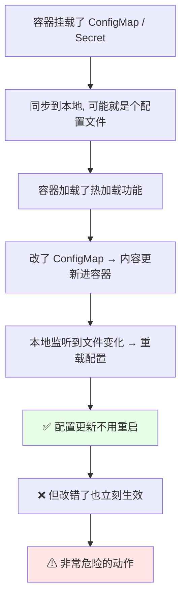
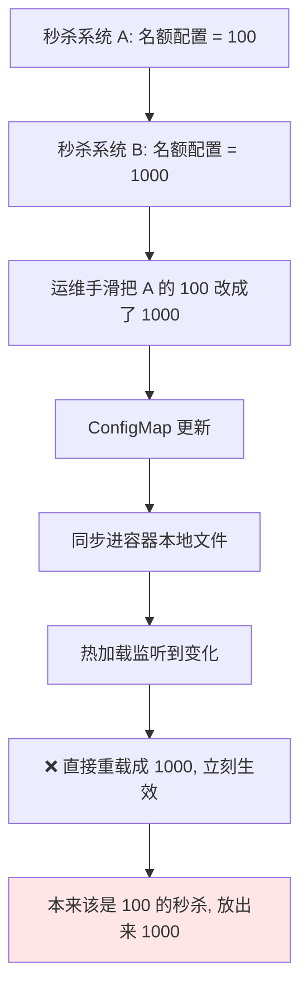
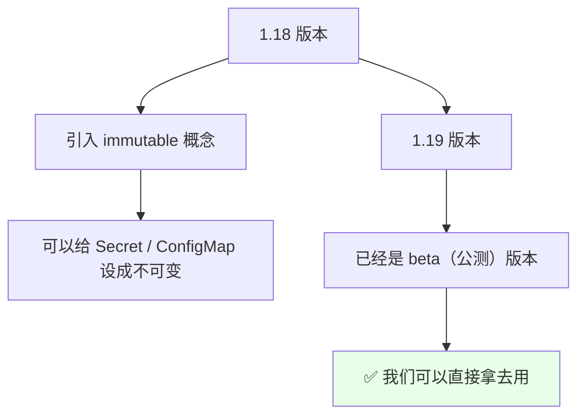
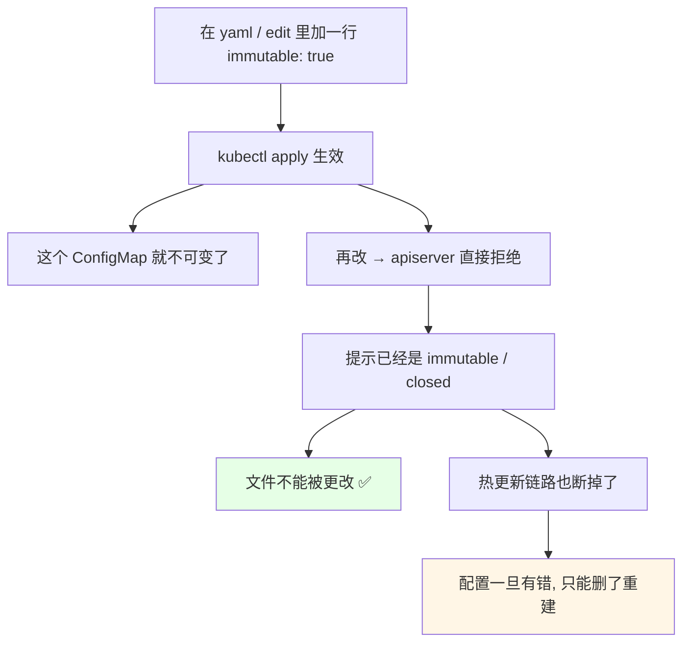
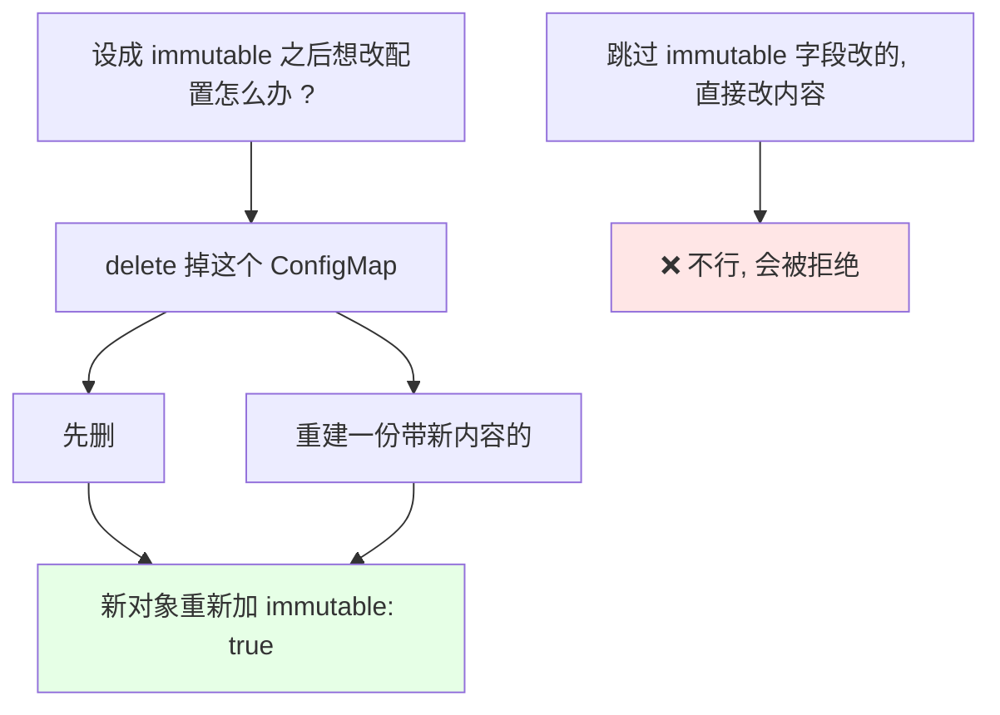

# Kubernetes 集群部署: 不可变的 Secret 和 ConfigMap（immutable 参数与热加载风险）

前面讲过：**容器挂了 ConfigMap / Secret 到本地，本地可能就是个配置文件；容器如果加载了热加载功能，改了 ConfigMap 就会把内容同步进容器，本地监听到文件变化就重载配置**。这条链路方便，但也危险。

结论先摆：

1. **k8s 1.18 引入了一个叫 `immutable`（不可变）的概念** —— 可以给 ConfigMap / Secret **加上这个参数，把它设成不可变的**；
2. **到 1.19 这个特性已经是 beta 版本（公测版本）了，可以放心去用**；
3. **为什么需要它**：程序带热加载时，你把配置改错了会**自动生效**，比如秒杀名额本该是 100，手一滑改成 1000 —— **热加载一加载，这就是个非常危险的动作**；
4. **加了 `immutable: true` 之后再改，apiserver 会直接拒绝**（报已经是不可变了），文件就再也改不动了；
5. **它同时也是一项安全配置** —— 只有一个参数，配就完了。

## 纲要

- 热加载这条链路的风险
- 秒杀系统的例子
- immutable 是什么、从哪个版本开始
- 不加参数：改得动
- 加上 immutable：直接拒绝
- 怎么样才改得了
- 适用建议

## 热加载这条链路的风险



回顾一下前面热更新那节的链路：

- 我们的容器挂载了 ConfigMap / Secret，同步到本地，**它可能是一个配置文件**；
- 如果**容器配置了加载（热加载）这个功能** —— 我们**更改了 ConfigMap 或 Secret，它就会把这个内容更新到我们容器的本地**；
- **本地监听到这个文件变化，它就会重载这个配置**；
- **如果配置改错了，就会影响它的使用**。

### 秒杀系统的例子



举个最形象的例子：**我们有个秒杀系统，秒杀名额可能是 100；另一个秒杀系统的名额可能是 1000。如果把这个秒杀系统的配置改错了** —— 把 100 改成了 1000 —— 而**程序又有热加载，这就不是个非常危险的动作吗**。

> 所以 k8s 在 **1.18 版本引入了一个概念叫 immutable（不可变）**，可以把 Secret 和 ConfigMap **设成不可变的**。

## immutable 是什么、从哪个版本开始



| 版本 | immutable 的状态 |
| --- | --- |
| **k8s 1.18** | **引入这个概念** —— 可以设成不可变 |
| **k8s 1.19** | **已经是 beta 版本（公测版本）** —— 可以放心使用 |

## 不加参数：改得动

```bash
# 1. 随便看一个 ConfigMap
kubectl get configmap nginx-conf-cm -o yaml

# 2. 直接 edit 改它（随便改一行、删两行）
kubectl edit configmap nginx-conf-cm
# 改完保存 → 是能改动的
```

```text
nginx-conf-cm 的内容（未加 immutable 时）:

---- 修改前 ----              ---- 修改后 ----
worker_processes 2;           worker_processes 1;
server_tokens on;             (server_tokens 那行删掉了)
keepalive_timeout 65;         keepalive_timeout 65;
                              (空行也删掉了)
✅ 能改, 热更新同步进容器
```

这时候**它现在是正常开放的，改一行删两行都可以**。

## 加上 immutable：直接拒绝



写法很简单 —— **直接在下面写个 `immutable: true`（布尔值）就行**：

```yaml
apiVersion: v1
kind: ConfigMap
metadata:
  name: nginx-conf-cm
data:
  nginx.conf: |
    worker_processes 2;
    server_tokens on;
    keepalive_timeout 65;
immutable: true            # ← 就这一行
```

```bash
# 3. 加完参数再 apply 上去
kubectl apply -f nginx-conf-cm.yaml

# 4. 再次尝试更改这个 ConfigMap
kubectl edit configmap nginx-conf-cm
# Error: StorageError: ... is immutable / the object has been closed
#        —— 已经设成不可变了
```

- 再改一次这个 ConfigMap 看，**它会直接报错，说已经是 immutable（不可变）了**；
- 说明 **它的这个文件就不能被更改了**；
- **这个还是非常好用的** —— 而且**这也是涉及到安全的一个配置**。

## 怎么样才改得了



> **有需求的话可以去配置一下**，也比较简单，**就一个参数，也没有什么好讲的了**。如果真的要改，**只能先删掉这个 ConfigMap、重建一份带新内容的**（新对象可以继续带上 `immutable: true`）。

```bash
# 真要改: 删掉重建
kubectl delete configmap nginx-conf-cm
kubectl apply -f nginx-conf-cm-new.yaml

# 重建之后想继续保持不可变, 继续带上 immutable: true 即可
```

## 适用建议

```text
什么时候该加 immutable: true ?

✅ 适合
├── 配置已经定稿、基本不会再改
├── 配合程序的热加载使用时, 担心误改直接生效
├── 秒杀 / 限额 / 名额这类数字配置（改错代价大）
└── 想当安全配置用, 锁死配置

⚠ 注意
├── 加了就改不了, 只能 delete + 重建
├── 热更新链路同步不进来了
├── 1.19 是 beta, 大版本上验证过可用
└── 别一次给太多正在频繁调整的配置加上
```

## API 速览

| 能力 | 做法 | 关键点 |
| --- | --- | --- |
| 引入版本 | **k8s 1.18** 引入 immutable 概念 | Secret 和 ConfigMap 都能设 |
| 可用版本 | **k8s 1.19 是 beta（公测）版本** | 可以放心使用 |
| 怎么用 | 在清单里加一行 **`immutable: true`** | 布尔值，就一个参数 |
| 效果 | 对象**不能再被修改** | apiserver 直接拒绝 |
| 改不动的报错 | 提示已是 immutable / the object has been closed | edit / apply 都改不了 |
| 想改怎么办 | **`delete` 掉这个 ConfigMap，再重建一份新的** | 重建时可继续带 immutable |
| 附带影响 | 热更新同步链路断掉，容器里不再自动更新 | 配合热加载时要想清楚 |
| 定位 | **一项安全配置** | 改错了不会立刻生效 |
| 典型场景 | 秒杀名额、限额这类数字配置 | 100 手滑写成 1000 会很危险 |

## Demo 示例

```bash
# 1. 看一个现成的 ConfigMap
kubectl get configmap nginx-conf-cm -o yaml

# 2. 先验证: 不加 immutable 时能改
kubectl edit configmap nginx-conf-cm
# 改成 worker_processes 1, 保存 —— 能保存

# 3. 加上 immutable: true 再 apply
#    （在清单最后加一行 immutable: true）
kubectl apply -f nginx-conf-cm.yaml
kubectl get configmap nginx-conf-cm -o yaml | grep -A 2 immutable
# immutable: true

# 4. 再改一次, 这次会被拒绝
kubectl edit configmap nginx-conf-cm
# Error: ... immutable / closed, 已经设成不可变了

# 5. 确认它挂到容器里的那份也不会被热更新覆盖
kubectl exec -it nginx-demo -- cat /etc/nginx/nginx.conf
```

```text
6. 改与不改的对照:

不可变（immutable: true）
├── apiserver: 拒绝修改
├── 热更新: 同步不进来
├── 要改: delete + 重建
└── 适合定稿配置 / 安全兜底

可变（默认）
├── apiserver: 随时改, resourceVersion 变
├── 热更新: 自动同步进容器（约 10 秒级）
├── 改错了: 热加载立刻生效 ⚠
└── 适合还在频繁调的配置
```

### 总结

- **k8s 1.18 引入了 `immutable`（不可变）概念**，可以给 Secret / ConfigMap 设成不可变；**到 1.19 已经是 beta（公测）版本**，可以直接拿去用；
- **为什么需要它**：容器挂载 ConfigMap / Secret 后**本地可能就是配置文件**，容器开了热加载的话，**改错了会立刻重载生效** —— 比如秒杀名额本该是 100，手滑改成 1000，**热加载一生效这就是个非常危险的动作**；
- **用法就一个参数**：在清单里加 `immutable: true`，`kubectl apply` 之后**这个对象再也改不动**，再 `kubectl edit` / `apply` 会直接报「已经是 immutable / the object has been closed」；
- **真要改只能 `delete` 掉再重建一份新的**（重建时可以继续带上 `immutable: true`），**热更新同步链路会一起断掉**；
- **它同时是一项安全配置**：适合**配置已定稿、基本不改**、或者**秒杀 / 限额 / 名额这类改错代价大的数字配置**，但**别一次性给正在频繁调整的配置全加上**；
- 整体就一个参数、没什么复杂逻辑 —— **有需求直接配上就行**。

