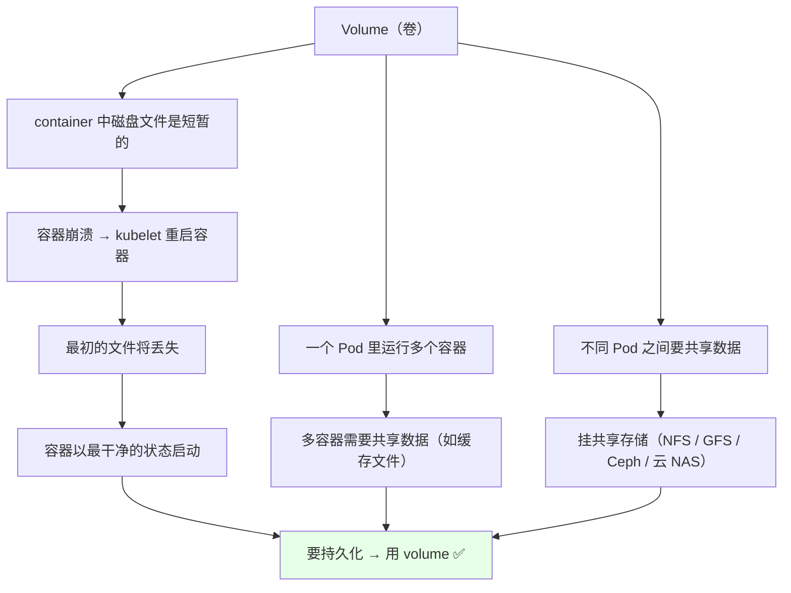
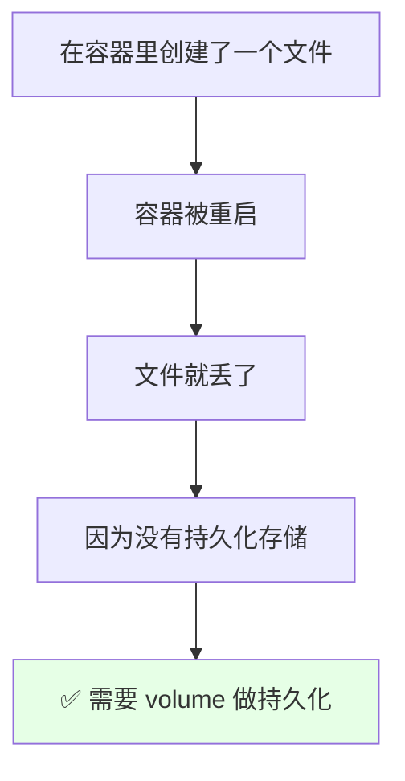
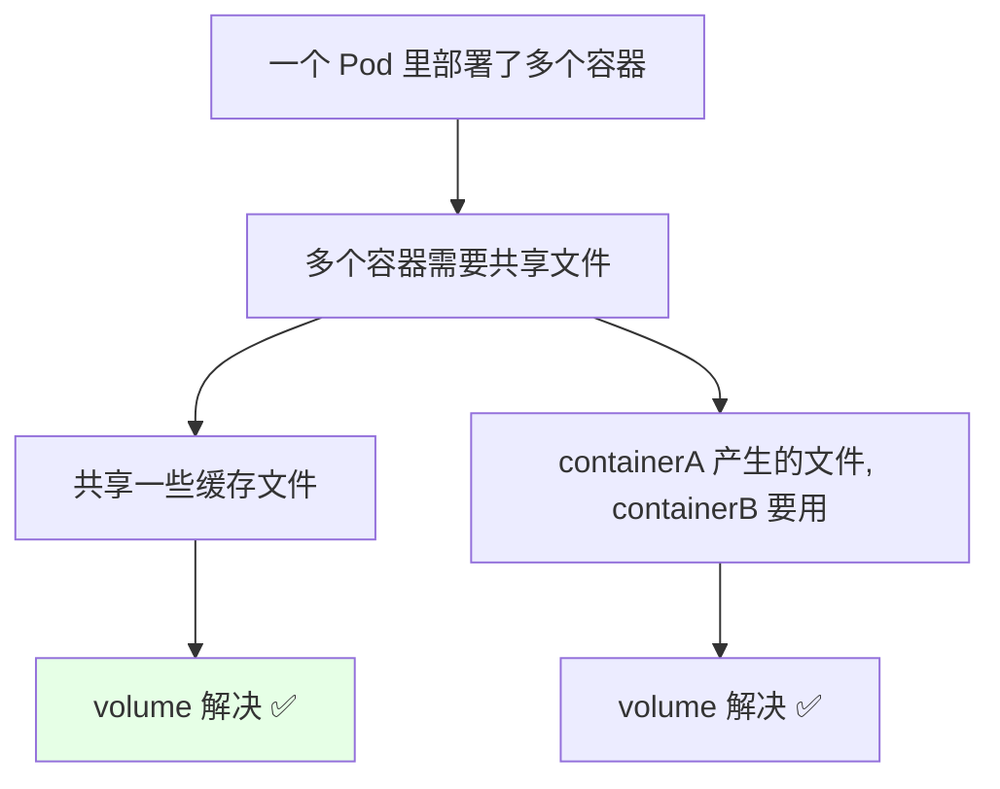
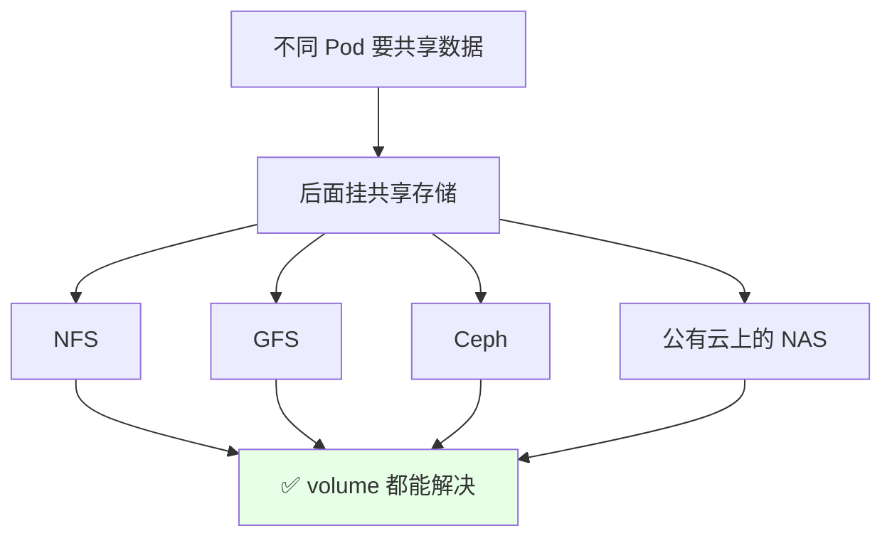
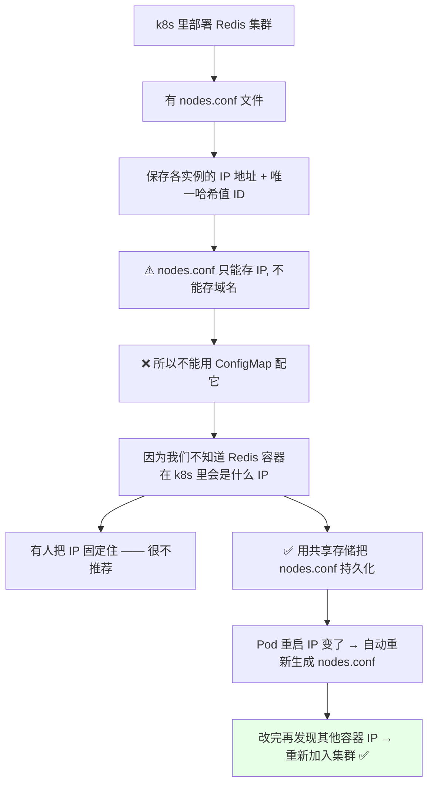
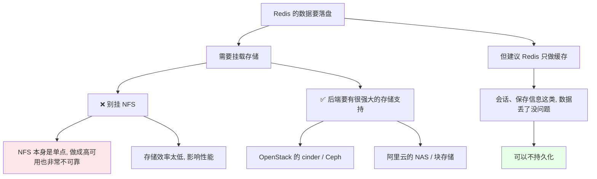
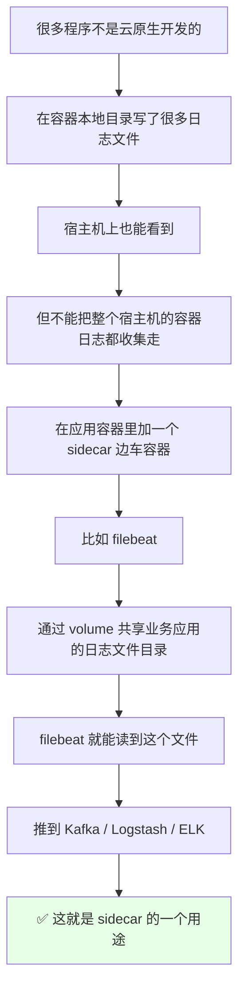
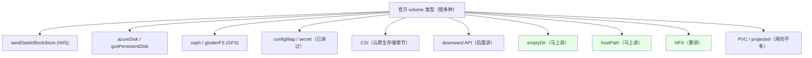

# Kubernetes 集群部署: 存储 Volumes 介绍（为什么需要卷、Redis nodes.conf 与日志收集 sidecar）

`volume` 翻译过来就是**卷**的名字里就能听出来 —— 卷就是做一些**文件存储**。前面讲 ConfigMap 和 Secret 的时候就已经用过 volume 去挂载它们了。

结论先摆：

1. **容器里的磁盘文件是短暂的**：容器崩溃时 **kubelet 会重启容器，最初的文件将丢失，容器以最干净的状态启动** —— 想持久化就必须用 **volume**；
2. **volume 解决的三种需求**：**持久化数据**、**同一个 Pod 多容器共享数据**、**不同 Pod 共享数据**（后面挂共享存储 NFS / GFS / Ceph / 云 NAS）；
3. **Redis 集群是经典场景**：`nodes.conf` **只存 IP、不存域名**，而 k8s 里 Pod 的 IP 会变，所以**这个文件不能用 ConfigMap 管**，只能做持久化 —— Pod 重启重新生成 nodes.conf、自动重新加回集群；
4. **不要给 Redis / MySQL / RabbitMQ 挂 NFS** —— NFS 是单点，即使做高可用也**非常不可靠、存储效率太低影响性能**；要持久化就得有**后端强存储**（云 cinder / Ceph / 云盘），**Redis 实际建议只做缓存**；
5. **sidecar 日志收集也是 volume 的招牌用法**：业务容器和 **filebeat 容器通过 volume 共享一个日志目录**，filebeat 读走推到 Kafka / Logstash / ELK；
6. **本课程只讲三种**：`emptyDir`、`hostPath`、`NFS`（CSI 留到云原生存储章节）。

## 纲要

- Volume 是什么、解决什么问题
- 需求一：容器文件是短暂的
- 需求二：同 Pod 多容器共享数据
- 需求三：不同 Pod 共享数据
- 经典场景：Redis 集群的 nodes.conf
- Redis 到底要不要落盘、能不能挂 NFS
- 日志收集 sidecar 需求
- 官网支持哪些 volume 类型
- 本课程要讲哪三种

## Volume 是什么、解决什么问题



**Volume 的作用就是官方这段描述**：

> 容器中的磁盘文件是短暂的。**当容器崩溃时，kubelet 会重启这个容器，最初的文件将丢失 —— 容器会以最干净的状态启动。** 而当一个 Pod 运行多个容器需要共享数据时，这个 volume 也能解决这个问题。

我们之前讲 ConfigMap / Secret 时，**就是用一个 volume 去挂载它们的** —— 那本身就是 volume 的一种用法。

## 需求一：容器文件是短暂的



- 使用容器部署时我们知道：**容器每次重启，都会以最干净的状态去启动**；
- 比如我们在容器里面创建了一个文件，**但是容器重启之后，这个文件就丢了** —— 因为**没有对它进行持久化存储**；
- **所以如果要做持久化存储，就需要用到 volume 这个东西**。

## 需求二：同一个 Pod 多容器共享数据



还有一种情况：**一个 Pod 里可能部署了多个容器，多个容器可能需要去共享它的一些文件**，比如共享一些缓存文件 —— **containerA 产生的文件，containerB 要用到** —— 这时候**也会用到 volume 去实现**。

## 需求三：不同 Pod 共享数据



还有一种方式：**不同的 Pod 去共享数据，也可以通过 volume 去解决** —— 后面挂的是我们的**共享存储**，比如 **NFS、GFS、Ceph**，或者**公有云上面的 NAS** 这一类东西。

> 总结什么时候会用到 volume：**需要持久化数据的程序**、**需要共享数据的容器**（同 Pod 多容器共享 / 不同 Pod 共享共享存储）。

## 经典场景：Redis 集群的 nodes.conf



- 我们在 k8s 里可能要**部署一个 Redis 集群**，Redis 集群会有一个 **`nodes.conf` 文件**；
- 这个 `nodes.conf` **保存了 Redis 集群各个实例的 IP 地址，加上它的一个唯一的哈希值（ID）**；
- **它只能去保存我们的 IP 地址，不能保存我们的域名**；
- **所以这个 nodes.conf 文件是不能使用 ConfigMap 去配置的** —— 因为我们**不知道这个 Redis 容器在 k8s 里会是一个什么样的 IP 地址**；
- 当然**有的人会把它的 IP 地址给固定住**，但**这个方式我个人是不推荐的**；
- **正确的是用一个共享存储的方式，把这个 nodes.conf 做一个持久化**：
  - 当我们的 Pod 被冲掉，**它虽然 IP 地址会变，但会自动修改 nodes.conf，再去发现它其他容器的 IP，然后重新加入到集群**；
  - 所以当有一个 Pod 或两个 Pod 重启的时候，**IP 变了会自动重新生成这个 nodes file**；
  - **所以我们要对这个 nodes.conf 做一个持久化的处理，整个 Redis 集群才能用**。

```text
Redis 集群 nodes.conf 的持久化链路:

Pod 重启
   │  IP 从 10.244.1.12 变成 10.244.2.15
   ▼
共享存储上的 nodes.conf 被重写
   │  写入新 IP + 新哈希 ID
   ▼
重新发现其他实例的 IP
   │
   ▼
重新 join 集群 ✅

如果 nodes.conf 不持久化 → 重启一次集群就散了
```

## Redis 到底要不要落盘、能不能挂 NFS



- **还有一种可能：你的 Redis 数据需要落盘，你也是需要去挂载存储的**；
- **但实际使用过程中，我们建议 Redis 只做缓存使用** —— 像**会话保存信息**这类，**数据丢了是没有问题的**，可以不做持久化；
- **如果真的要有持久化数据，后端要有一个很强大的存储支持**；
- **绝对不能把 Redis 挂一个 NFS 就上去了** —— **NFS 本身它是个单点，它有可能你会做成高可用的，但是非常不可靠**；
- **RabbitMQ、MySQL 都不能去挂 NFS 这种东西** —— **NFS 的存储效率是太低了，会影响我们的性能**；
- 你如果在公有云，或者公司有一个云平台：**肯定有后端存储** —— 比如 **OpenStack 可以用 cinder 或者是 Ceph**，**我们可以直接连到 cinder 或 Ceph 上，再挂载到 Pod 里给 Pod 用**；**阿里云有 NAS 或者其他块存储**，也可以用 volume 直接挂载再给容器用；
- **当然你也可以在云上挂高效存储给数据库或者 Redis 用** —— **但我个人是非常不建议自己拿 NFS 上去挂的，测试环境也千万不要这么做**。

## 日志收集 sidecar 需求



- **日志收集也是一个需求**：我们有很多程序**并不是基于云原生去开发的**，它在**容器的本地目录**写了很多日志文件；
- 我们**虽然说在宿主机上也能看到**，但是**不能说把整个宿主机的、那个容器的日志都给它收集走**；
- 所以**需要在应用程序的容器里面加一个 sidecar 边车容器** —— 比如 **filebeat**；
- **filebeat 通过 volumes 共享应用程序的日志文件目录**，**这样 filebeat 容器和业务应用容器就共享了一个目录**，**filebeat 就可以读到它的这个文件**；
- 然后它就可以**去收集它的日志，再推到 Kafka、Logstash 或者 ELK** 里面。

```text
sidecar 日志收集靠的就是同 Pod 共享 volume:

Pod
├── 业务应用容器   ← 往 /var/log/app/ 写日志
│   └── volumeMounts: log-volume → /var/log/app
└── filebeat 容器  ← 从 /var/log/app 读日志
    └── volumeMounts: log-volume → /var/log/app

两个容器挂的是同一个 volume（log-volume）
  → 天然共享目录 → filebeat 读得到 → 推走
```

> 前面讲 Pod 的时候说过，**sidecar（边车容器）** 直接写英文 + 中文注释，不要写成「副车」。

## 官网支持哪些 volume 类型



- **CSI** 这个东西我们**在云原生存储那章节会专门讲** —— 那几节**不是讲存储怎么选，而是讲 CSI / 动态存储该怎么用**；
- **downward API** 后面也会讲；
- 还有 **PVC**，以及 **projected** —— **projected 用的其实不多**，它是**把 ConfigMap、Secret 什么的多封进去、多加了一层**，你点开它的配置看，**里面还是 Secret、ConfigMap**，所以**这个东西你们也不会用到**；
- **RBD** 也不讲，Secret 已经讲过了，**CephFS 的 model 也是可以的**。

### 本课程讲哪三种

```text
本课程重点讲三种 volume:

├── emptyDir        ← 本节之后马上演示（同 Pod 内共享）
├── hostPath        ← 挂载宿主机的路径
└── NFS             ← 共享存储 / 动态 PV 后端

其他:
├── PVC   → 后面章节讲
├── CSI   → 云原生存储那章讲
└── projected → 你们也用不到
```

**下节就直接去演示它** —— 从 `emptyDir`、`hostPath`、再到 `NFS` 一个个来。

## API 速览

| 能力 | 做法 / 关键点 |
| --- | --- |
| 是什么 | **volume（卷）**，做文件存储 |
| 为什么需要 | **容器磁盘文件是短暂的**，崩溃重启后容器以最干净状态启动，文件丢失 |
| 需求一 | **持久化数据** —— 不挂卷重启就丢 |
| 需求二 | **同 Pod 多容器共享数据**（缓存文件、containerA 的文件 containerB 用） |
| 需求三 | **不同 Pod 共享数据** —— 挂共享存储 NFS / GFS / Ceph / 云 NAS |
| 反例 | Redis 集群 **`nodes.conf` 只存 IP 不存域名** → **不能用 ConfigMap 管**；固定 IP 也不推荐 |
| 正确做法 | **共享存储持久化 nodes.conf**，Pod 重启自动重写并重新 join 集群 |
| Redis 落盘 | **建议只做缓存**（会话类数据丢了没关系）；真要持久化**后端必须有强存储** |
| ❌ 别挂 | **Redis / MySQL / RabbitMQ 都不要挂 NFS**：单点、不可靠、存储效率低影响性能 |
| ✅ 该挂 | **cinder / Ceph / 阿里云 NAS 或块存储** —— volume 直接连上再挂给 Pod |
| sidecar 日志 | **业务容器 + filebeat 容器共享同一个 volume 目录** → filebeat 收集推 Kafka / Logstash / ELK |
| 官方类型 | awsEBS / azureDisk / gcePD / ceph / glusterFS / configMap / secret / CSI / downwardAPI / **emptyDir / hostPath / NFS** / PVC / projected |
| projected | **里面还是 Secret + ConfigMap 多封一层，基本用不到** |
| 本课程 | **只讲 emptyDir、hostPath、NFS 三种** |

## Demo 示例

```bash
# 1. 回顾: 之前用 volume 挂 ConfigMap 的写法（就是 volume 的一种用法）
kubectl get pod nginx-demo -o yaml | grep -A 8 volumes

# 2. 看一个 Pod 挂了哪些卷
# 下面命令中的变量按你的集群环境赋值后再执行
kubectl get pod $POD -o yaml | sed -n '/volumes:/,/^  containers:/p'

# 3. 官方案例里 volume 类型很多, 看一眼有哪些
kubectl explain pod.spec.volumes
```

```text
4. 三种马上要讲的 volume 位置:

pod.spec
├── volumes            ← 卷定义（spec 级, 和 containers 对齐）
│   ├── configMap      ← 已讲
│   ├── secret         ← 已讲
│   ├── emptyDir       ← 下节演示: 同 Pod 内共享
│   ├── hostPath       ← 下下节演示: 挂宿主机路径
│   └── nfs            ← 后面演示: 共享存储
└── containers
    └── volumeMounts   ← 容器级, 每个容器都写
        ├── name
        ├── mountPath
        └── subPath
```

```bash
# 5. 验证「容器文件是短暂的」这个特性
POD=my-pod
kubectl exec -it $POD -- touch /tmp/testfile
kubectl exec -it $POD -- ls -l /tmp/testfile
# 文件在

# 6. 删掉 Pod 重建之后再进容器看
kubectl delete pod $POD
kubectl exec -it $POD -- ls -l /tmp/testfile
# Not found —— 没挂 volume 的目录, 重建就空了
```

### 总结

- **Volume（卷）就是做文件存储**，它的核心作用官方说得最准：**容器里的磁盘文件是短暂的** —— 容器崩溃时 kubelet 重启容器、**最初的文件将丢失、容器以最干净的状态启动**，要持久化就必须用卷；
- **三个典型需求**：**持久化数据**、**同一个 Pod 里多容器共享数据**（如 sidecar 日志收集）、**不同 Pod 共享数据**（后面挂 NFS / GFS / Ceph / 云 NAS）；
- **Redis 集群是卷的经典场景**：`nodes.conf` **只能存 IP、不能存域名**，而 Pod 的 IP 会变，**所以它不能用 ConfigMap 管**（把 IP 固定住也不推荐）—— 正确做法是拿**共享存储持久化 nodes.conf**，Pod 重启后**自动重写这个文件、重新发现其他实例 IP、重新 join 集群**；
- **Redis 落盘要谨慎**：**实际建议 Redis 只做缓存**（会话类数据丢了无所谓）；真要持久化**后端必须有强存储**；**Redis / MySQL / RabbitMQ 都不要挂 NFS**（单点、不可靠、存储效率太低拖性能），要挂就用 **cinder / Ceph / 云 NAS / 云盘**，但**自己拿 NFS 上生产是我不推荐的，测试环境也别这么干**；
- **sidecar 日志收集靠的就是同 Pod 共享 volume**：业务容器写日志的目录和 **filebeat 容器挂同一个卷**，filebeat 读走推到 **Kafka / Logstash / ELK**；
- **官方 volume 类型一大堆**（awsEBS / azure / gcePD / ceph / glusterFS / CSI / downwardAPI / PVC / projected 等），其中 **projected 里面绕一圈还是 Secret + ConfigMap，基本用不到**；**本课程只重点讲三种：`emptyDir`、`hostPath`、`NFS`**（PVC 后面章节，CSI 留到云原生存储那章）。

