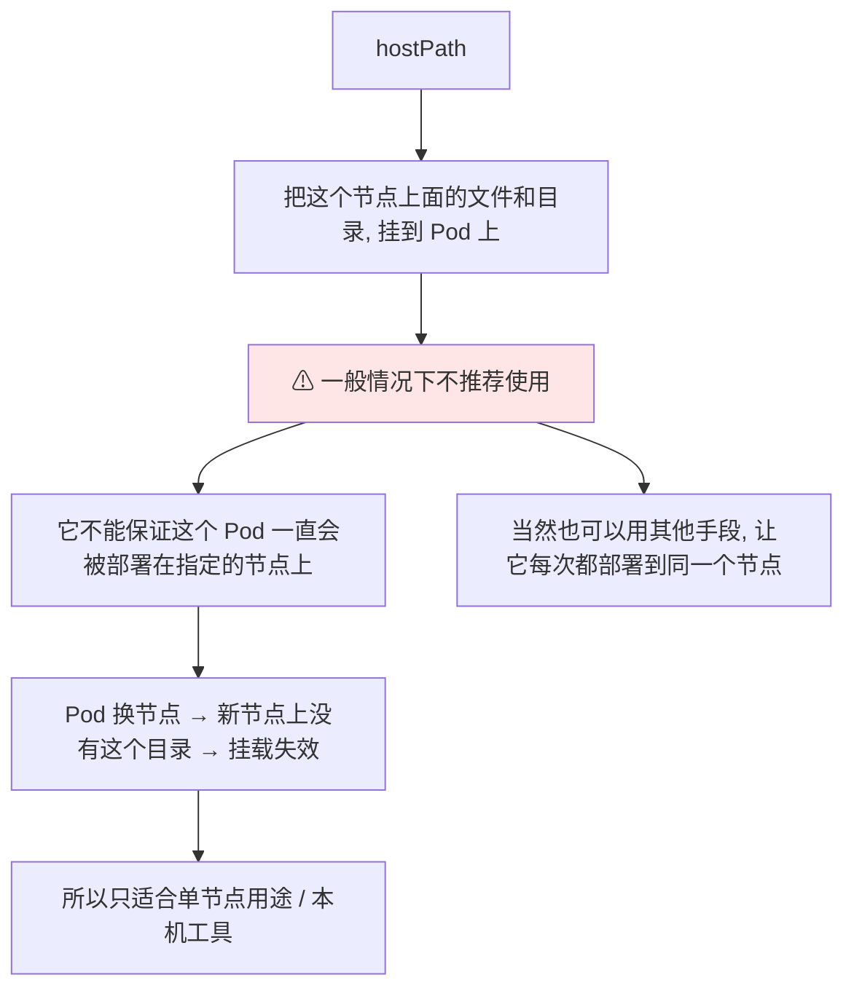
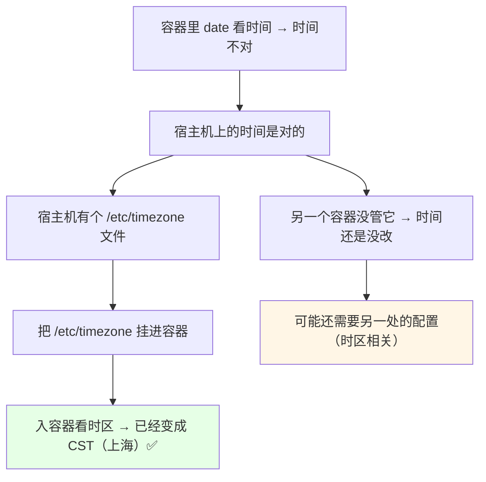
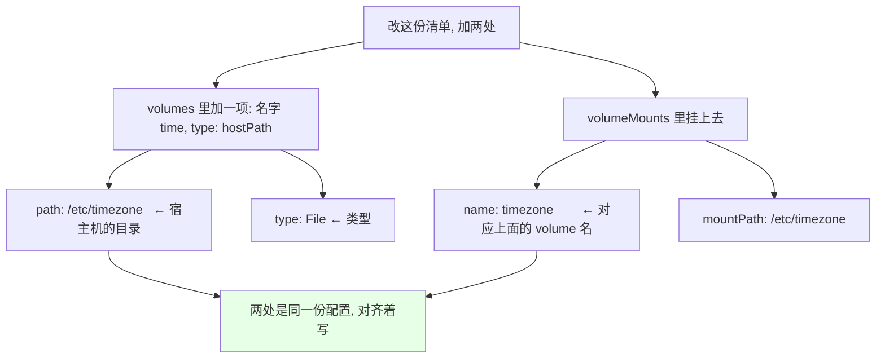
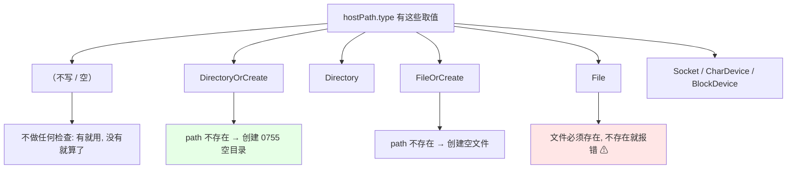
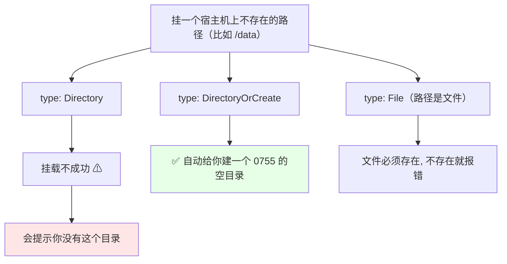

# Kubernetes 集群部署: Volumes HostPath 挂载宿主机路径（type 取值与目录创建行为）

讲完 emptyDir，来看下一个配置 —— **`hostPath`**。

结论先摆：

1. **`hostPath` 一般情况下是不推荐使用的** —— 因为它**不能保证这个 Pod 一直会被部署在指定的节点上**（当然你也可以使用其他手段，让它每次都部署到同一个节点）；
2. 它的作用就一句话：**把节点（宿主机）上面的文件和目录挂到 Pod 上**；
3. **实操演示**：把宿主机的 **`/etc/timezone`** 挂进容器，**容器里的时区就变成 CST（上海）了**；
4. **`type` 字段是 hostPath 的重点**：不写（空）**不做任何检查**、`DirectoryOrCreate` **缺目录就建一个 0755 的空目录**、`FileOrCreate` **缺文件就建一个空文件**；
5. **`File` 类型的文件必须存在，不存在直接报错** —— 所以**想挂文件，type 一定要写对**。

## 纲要

- hostPath 是什么、为什么不建议用
- 演示：挂 /etc/timezone 改容器时区
- volumes 与 volumeMounts 两处配置
- 实测结果
- type 取值全表
- 目录不存在会怎样
- socket 文件与块设备
- 适用建议与后续

## hostPath 是什么、为什么不建议用



- **hostPath 一般情况下是不推荐使用的**；
- **原因：它不能保证这个 Pod 一直会被部署在指定的节点上** —— 你可以用其他手段（比如节点亲和、固定调度）**让它每次都部署到同一个节点**，也是可以的；
- **它的本质就是把节点上的文件和目录挂到 Pod 上**，就这么一个东西，没什么难点；
- 实际用法上：它**适合宿主机上的本机工具、标识文件、本机数据**这类**单节点特性明显**的场景。

## 演示：挂 /etc/timezone 改容器时区



- 我们看这个容器 —— **容器里 `date` 看时间，时间是不对的**；
- **宿主机的时间是对的**；
- 我们可以通过 **timezone 这个文件**把这个文件挂载进去，**看挂载一个时区文件会不会把容器的时间改成正确的**；
- 挂载进去之后**已经变成了 CST（上海）**了；
- 而**另一个 nginx2 容器我们没管它**，它的时间**还是没改** —— 因为**它可能还是需要另一个地方的配置**（时区相关的另外那一份）。

> **时区怎么改下一章节会讲**（会讲 **PodPreset** 可以用来预设一个容器的时间），有兴趣可以去听一下，**这一节主要演示 hostPath 的使用**，不再重复时区那块。

## volumes 与 volumeMounts 两处配置



```yaml
apiVersion: v1
kind: Pod
metadata:
  name: timezone-demo
spec:
  volumes:
  - name: time            # volume 名字, 唯一
    hostPath:
      path: /etc/timezone # 宿主机（节点）上的目录
      type: File          # 类型
  containers:
  - name: nginx
    image: nginx:1.15.2
    volumeMounts:
    - name: time          # 对应上面 volume 的名字
      mountPath: /etc/timezone
```

写法上的两个注意点：

| 位置 | 字段 | 说明 |
| --- | --- | --- |
| `volumes[]` | `name` | volume 名字（**名字是唯一的**），本例叫 `time` |
| `volumes[].hostPath` | `path` | **宿主机（节点）上的路径**，如 `/etc/timezone` |
| `volumes[].hostPath` | `type` | 类型，本例是 **`File`** |
| `volumeMounts[]` | `name` | 对应**上面那个 volume 的名字** |
| `volumeMounts[]` | `mountPath` | 挂到容器里的哪个路径 |

> 这是多个配置，**你需要给它对齐着写** —— `volumes` 是 spec 级（和 containers 对齐），`volumeMounts` 是容器级。

```bash
# 1. 改完清单之后 apply / replace 一下
kubectl replace -f timezone-demo.yaml

# 2. 已经起来了, 执行命令看看
kubectl exec -it timezone-demo -- date
# CST: 已经变成上海时区了

# 3. 看另一个没挂的这个
kubectl exec -it nginx2 -- date
# 时间还是没改
```

### 也可以挂目录

> 我们刚才挂载的是**宿主机的一个文件**，**你也可以去挂载一个路径、或者挂载一个目录** —— 都是可以的。

## type 取值全表



**`type` 是 hostPath 值得单独拿出来说的东西**，我们一个一个看：

| type 取值 | 行为 |
| --- | --- |
| **`（不写 / 空）`** | 挂载 hostPath 卷**不会做任何检查** —— **你有就有没有就算了** |
| **`DirectoryOrCreate`** | 如果**给定的 path 不存在任何东西，那么将创建一个权限为 0755 的空目录**（这个权限和 kubelet 具有相同的组合权限）—— **没有这个目录，它就给你创建一个好 directory** |
| **`Directory`** | 挂载一个目录；**如果宿主机没有这个路径，就挂载不成功，会提示你没有这个目录** |
| **`FileOrCreate`** | 和 `DirectoryOrCreate` 类似，**没有的话就会创建一个空文件** |
| **`File`** | 挂载一个文件，**这个文件就必须要存在，不存的话就报错** ⚠ |
| **`Socket`** | 挂载一个 socket 文件（启动进程时的一个文件，比如 nginx / docker 的 sock 文件），**可以挂载到容器里面** |
| **`CharDevice` / `BlockDevice`** | 字符设备 / 块设备，**用的可能不多，就不讲** |

### 目录不存在会怎样



- 比如你**挂一个目录到 Pod 里**，写的是 `/data`，**但如果宿主机没有这个路径，那就挂载不成功了**，它会提示你没有这个目录；
- 这时候**换成 `DirectoryOrCreate`，它没有的话就会自动创建一个**（权限 0755）；
- **而 `File` 类型就不用它 —— 文件必须存在，不存在直接报错** —— 所以**想挂文件，type 一定要写对**。

## socket 文件与块设备

```text
hostPath 还能挂这些:

├── File         ← 普通文件（如 /etc/timezone）
├── Directory    ← 目录（不存在则挂载失败）
├── Socket       ← socket 文件
│                  比如 nginx / docker 的 sock 文件
│                  启动进程时会用到, 可以挂进容器
├── CharDevice   ← 字符设备（用得不多）
├── BlockDevice  ← 块设备（用得不多）
└── DirectoryOrCreate / FileOrCreate  ← 缺了自动建
```

> 字符设备 / 块设备那两块**用的可能不多**，这里就不展开讲了。

## 适用建议与后续

```text
hostPath 使用建议:

✅ 可以用于
├── 挂宿主机上的本机标识 / 时区文件
├── 挂本机工具要用的目录
├── 单节点特性明显的场景（配合固定调度）
└── 挂 socket 文件给 sidecar 用

❌ 别随意用
├── 它不能保证 Pod 一直落在同一个节点
├── Pod 换节点新节点上没这个目录 → 挂载直接失效
└── 所以「一般情况下不推荐使用」

⏭ 下一节接着看
└── NFS ← 共享存储, 多节点都能访问
```

这一节就是 hostPath 的使用，**没什么难点** —— 记住**「一般不推荐」**和**「type 要写对」**这两条就够了。下一节接着看 **`NFS`** 这种**多节点都能访问的共享存储**。

## API 速览

| 能力 | 做法 / 关键点 |
| --- | --- |
| 是什么 | **把宿主机（节点）上的文件和目录挂到 Pod 上** |
| 推荐度 | ⚠ **一般情况下不推荐使用** |
| 不推荐的原因 | **不能保证 Pod 一直被部署在指定的节点上**（需另用手段固定节点） |
| 演示 | 挂 `/etc/timezone` → 容器时区变 CST（上海） |
| 配置一 | `volumes[].hostPath.path` = 宿主机路径 |
| 配置二 | `volumes[].hostPath.type` = `File` / `Directory` / `DirectoryOrCreate` / `FileOrCreate` / `Socket` / 设备 |
| 配置三 | `volumeMounts[].name` = volume 名（**名字唯一**） |
| 配置四 | `volumeMounts[].mountPath` = 容器里路径 |
| **type 为空** | **不做任何检查，有就用没就算** |
| **DirectoryOrCreate** | **path 不存在 → 建 0755 空目录**（权限同 kubelet） |
| **Directory** | 挂目录；**宿主机没这个路径 → 挂载失败并提示** |
| **FileOrCreate** | 不存在 → 创建空文件 |
| **File** | **文件必须存在，不存在直接报错** ⚠ |
| Socket | 挂 socket 文件（nginx / docker 的 sock）进容器 |
| 相邻 | 时区改法下一章 **PodPreset** 讲；再下一节看 **NFS** |

## Demo 示例

```bash
# 1. 先看容器里的时间（不对）
kubectl exec -it timezone-demo -- date

# 2. 看宿主机上的时间（是对的）
date

# 3. 改清单: volumes 加 hostPath, volumeMounts 挂上去
kubectl replace -f timezone-demo.yaml

# 4. 再看容器里的时区 → 已经变成 CST（上海）
kubectl exec -it timezone-demo -- date

# 5. 没挂的那个容器, 时间还是没改
kubectl exec -it nginx2 -- date
```

```bash
# 6. 试一个宿主机上不存在的目录, 对比 type 行为
#    type: Directory  → 挂载失败, 提示没有这个目录
#    type: DirectoryOrCreate → 自动建一个 0755 的空目录
cat > dir-demo.yaml <<'EOF'
apiVersion: v1
kind: Pod
metadata:
  name: dir-demo
spec:
  volumes:
  - name: data
    hostPath:
      path: /data
      type: DirectoryOrCreate
  containers:
  - name: busybox
    image: busybox:1.28
    command: ["sleep", "3600"]
    volumeMounts:
    - name: data
      mountPath: /data
EOF
kubectl apply -f dir-demo.yaml
kubectl exec -it dir-demo -- ls -ld /data
# drwxr-xr-x  ← 0755 的空目录, kubelet 建的
```

```text
7. hostPath 的两处配置一定要对上:

pod.spec
├── volumes            ← spec 级
│   └── name: time            ← 这个名字是唯一的
│       └── hostPath:
│           ├── path: /etc/timezone   ← 宿主机路径
│           └── type: File
└── containers
    └── volumeMounts   ← 容器级
        ├── name: time        ← 和上面 volume 的 name 对上
        └── mountPath: /etc/timezone
```

### 总结

- **`hostPath` 就是把节点（宿主机）上的文件和目录挂到 Pod 上** —— **但它一般情况下不推荐使用**，因为**不能保证 Pod 一直被部署在指定的节点上**（你可以用其他手段让它每次落到同一个节点，但那是额外成本）；
- **演示场景**：容器里 `date` 时间不对、宿主机是对的 → **把宿主机的 `/etc/timezone` 挂进去**，容器时区**立刻变成 CST（上海）**；另一个没挂的容器时间不变（时区改动本身下一章用 **PodPreset** 讲）；
- **配置两处要对齐**：`volumes[].name`（**名字唯一**）+ `volumes[].hostPath.path`（宿主机路径）+ `volumes[].hostPath.type`；`volumeMounts[].name`（对上 volume 名）+ `mountPath`；
- **`type` 是 hostPath 的重点**：**空 / 不写 → 不做任何检查，有就用没就算**；**`DirectoryOrCreate` → 不存在就建一个 0755 空目录（权限同 kubelet）**；**`Directory` → 宿主机没这个路径就挂载失败并提示**；**`FileOrCreate` → 不存在建空文件**；**`File` → 文件必须存在，不存在直接报错**；还可以挂 **`Socket`** 文件（nginx / docker 的 sock）给 sidecar 用，字符/块设备用得不多；
- **挂文件一定要把 `type` 写对**，否则文件不存在会直接报错 —— 这是 hostPath 最常见的翻车点；
- 记住 **「一般不推荐」+「type 要写对」** 两条，这一节就算过关了；**下一节接着看 `NFS`** —— 那种**多节点都能访问的共享存储**，才是生产里该走的路子。

