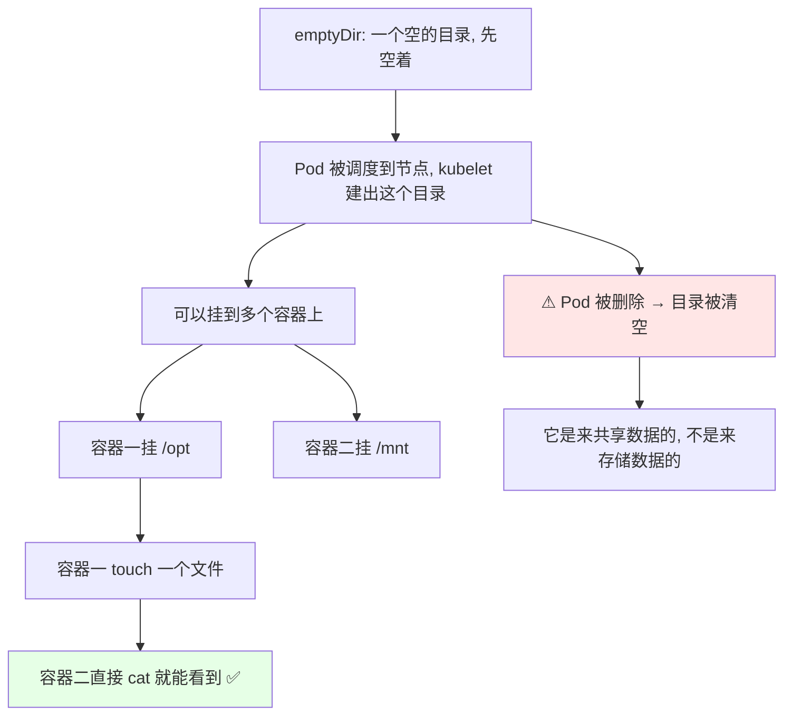
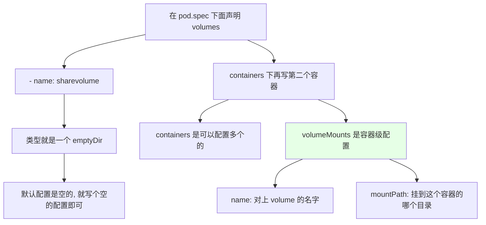
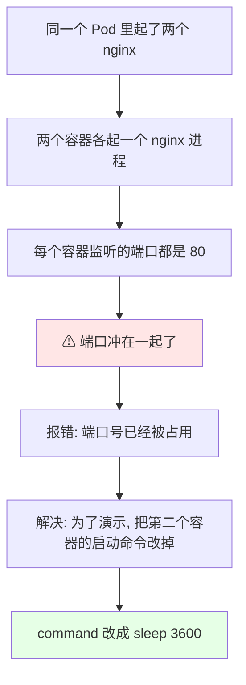
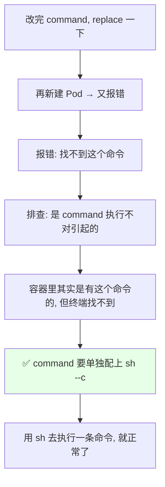
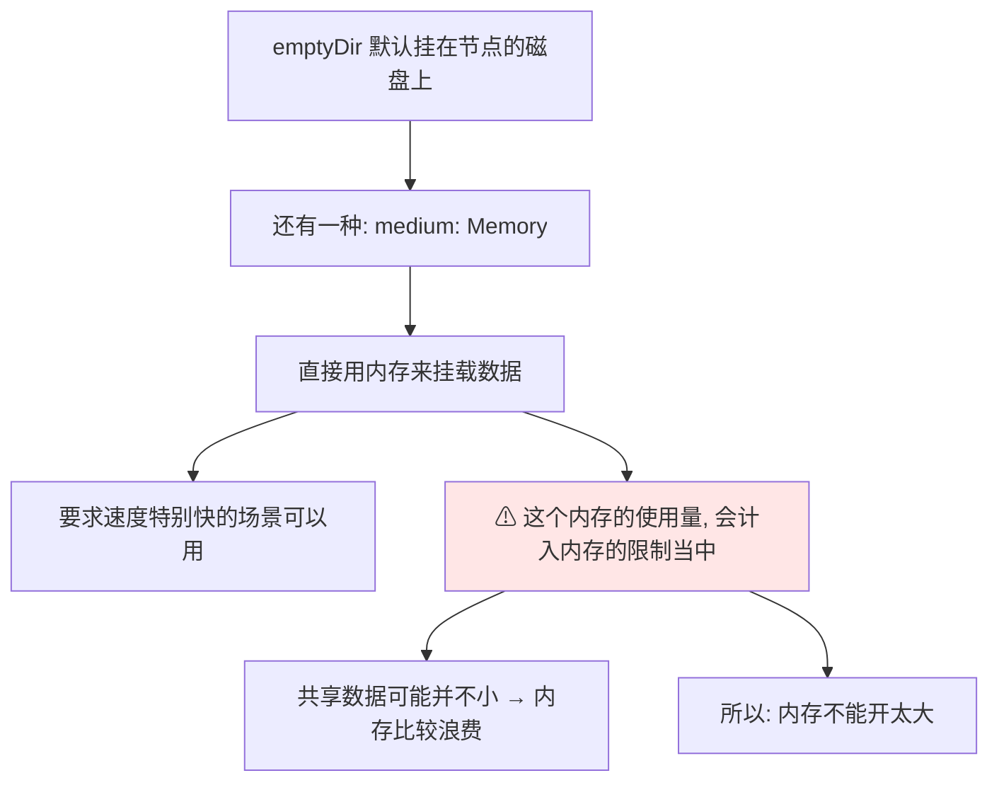

# Kubernetes 集群部署: Volumes EmptyDir 实现数据共享（同 Pod 多容器共享目录与 medium 内存盘）

Pod 里放了两个容器，各自跑在自己的 RootFS 里 —— **A 容器写的文件，B 容器到底能不能看到？**

结论先摆：

1. **`emptyDir` 就是用来在「同一个 Pod 里的多个容器之间共享数据」的** —— 它可以挂到**不同容器、不同目录**上；
2. **一个容器产生的文件，另一个容器能看到** —— 演示方式：容器一在 `/opt` 下 `touch` 一个文件，容器二在 `/mnt` 下直接就能看到；
3. **`emptyDir` 不是用来存数据的**：**Pod 被删掉之后，它的数据会被清空** —— 它只负责「共享」，不负责「持久化」；
4. **`medium: Memory` 可以用内存当共享盘**（速度极快），但**占用的内存会计入容器的内存限制**，容易浪费内存，不宜开太大；
5. **实操两个坑**：同 Pod 起两个 nginx 会**端口冲突（都监 80）**；把启动命令改成 `sleep` 时**要显式写 `/bin/sh -c`**，否则容器起不来。

## 纲要

- emptyDir 是什么、数据共享的场景
- 声明位置：volumes 与 containers 平齐
- 一份清单：两个容器挂同一卷的不同目录
- 踩坑一：同 Pod 两个 nginx 端口冲突
- 踩坑二：command 找不到终端，要显式写 sh -c
- 实测：一边 touch，另一边 cat 得到
- medium: Memory 用内存做共享盘
- 后续：filebeat 采集日志还会再用到它

## emptyDir 是什么



**`emptyDir` 一般用于一个 Pod 中的多个容器，用来共享数据** —— 它**可以被挂载到不同容器的不同目录上**，靠这一份卷把两个容器之间的数据打通：**A 容器产生的文件，B 容器是可以看到的**。

两条要记死的定性：

- **`emptyDir` 在 Pod 被删除之后，它的数据也会被清空**；
- **所以它的定位是「做数据共享」，不是「存数据」** —— 要持久化得靠上一节的 **NFS** 和后面的 PV/PVC。

## 声明方式：volumes 与 containers 平齐



写这个清单的几个要点：

- **volume 是声明在 `pod.spec` 下面的** —— **因为它可以被多个容器使用，所以它和 `containers` 是平级（平齐）的**，不要把它缩进到容器里面去；
- **`volumes` 本身是个切片，可以配多个** —— 用 `-` 横线一项一项写；
- **`volumeMounts` 是 `containers` 级别的配置** —— 它**只针对单个容器**，所以它和容器的 `name` 是对齐的（同级缩进）；
- **同一个 Pod 里不能启动两个同名的容器** —— 所以两个容器名字要改成不一样的（比如 `ngx` 和 `ngx2`）；
- **成员名（volume 名）本身是唯一的**，本例叫 `sharevolume`。

## 一份清单：两个容器挂同一卷的不同目录

```yaml
apiVersion: v1
kind: Pod
metadata:
  name: emptydir-demo
spec:
  volumes:
  - name: sharevolume     # volume 名字, 唯一
    emptyDir: {}          # 空目录, 不做任何额外配置
  containers:
  - name: ngx             # 容器一, 名字不能和下面重复
    image: nginx:1.15.2
    volumeMounts:
    - name: sharevolume   # 对应上面 volume 的名字
      mountPath: /opt     # 挂在容器一的 /opt 下
  - name: ngx2            # 容器二
    image: nginx:1.15.2
    volumeMounts:
    - name: sharevolume   # 同一个卷, 挂到另一个目录
      mountPath: /mnt     # 挂在容器二的 /mnt 下
```

| 位置 | 字段 | 说明 |
| --- | --- | --- |
| `spec.volumes[]` | `name` | volume 名字（**唯一**），本例 `sharevolume` |
| `spec.volumes[].emptyDir` | `（空）` | 普通空目录，**配置是空的**，写 `{}` 就行 |
| `spec.containers[]` | `name` | 容器名，**同 Pod 内不能重名**（`ngx` / `ngx2`） |
| `spec.containers[].volumeMounts[]` | `name` | 对应**上面那个 volume 的名字** |
| `spec.containers[].volumeMounts[]` | `mountPath` | 挂到**这个容器**里的哪个目录（`/opt` / `/mnt`） |

> 两个容器**挂的是同一份卷、只是挂到了不同目录**（一个 `/opt`、一个 `/mnt`），**这就是 emptyDir 的用法**：一份数据，多个容器、多个入口都能读写。

## 踩坑一：同 Pod 两个 nginx 端口冲突



- **之前讲过：一个 Pod 里起多个容器，它们的命名空间（网络空间）是共享的**；
- **我们起了两个 nginx，每个容器都起了一个 nginx 进程，监听的都是 80 端口** —— 一个 Pod 里两个 nginx 都去起 80，**端口就冲了**；
- 实际跑起来看，**会报「端口号已经被占用」**（`address already in use`）；
- **解决办法**：为了演示**只是想让第二个容器活起来**，把**第二个容器的启动参数改掉**即可 —— 它本来是把 nginx 的启动命令打到容器里的，我们把这个入口**重写掉**。

## 踩坑二：command 找不到终端，要显式写 sh -c



- 把 **nginx2 的 `command` 重置掉**（比如改成 `sleep 3600`），`replace` 之后再来看容器状态，**正在创建新的 Pod 又报错了**；
- **这类报错一般是 `command` 的执行不对引起的** —— 提示**找不到这个命令**，但其实这个容器里是有这条命令的；
- **这是用 `command` 时要单独注意的一点**：它**可能会找不到我们用的终端**（`sh` 或者 `bash`）—— 所以要**单独把 shell 配出来，写成 `sh --c`** 这个形式：
  - **`sh -c` 就相当于「用 sh 这个 shell 去执行一条命令」**，本例就是去执行那条 `sleep` 命令；
- 配好之后再看 **Pod 已经起来了**。

> 自己写这类清单的时候，**这两处（端口冲突要改启动命令、command 要带 `sh -c`）一定要留意**，否则排查起来会绕很久。

## 实测：一边 touch，另一边 cat 得到

```bash
# 1. 进第一个容器（挂载在 /opt）, 建一个文件
kubectl exec -it emptydir-demo -c ngx -- sh
cd /opt
touch 123
ls
# 123

# 2. 换第二个容器看（挂载在 /mnt）
kubectl exec -it emptydir-demo -c ngx2 -- sh
cd /mnt
ls
# 123   ← 文件已经在第二个容器里了
```

几个操作细节：

- **在一个 Pod 里对多个容器执行操作，用 `kubectl exec` 时要用 `-c` 指定是在哪个容器里执行**；
- **进到容器里就是 `sh`（交互进），不进容器只想执行一条指令的，可以**把 `-it` 去掉**，直接 `cat` 一下就行**；
- **进容器一在 `/opt` 下 touch 一个 `123`，进容器二在 `/mnt` 下就能看到 `123`** —— 一份卷，两个入口；
- 反过来也成立：**在容器二里写点数据（重定向写进文件），再到容器一去看，数据同样在**。

> 顺带一个现象：**容器一里刚建的文件，在 Pod 重建之后就没了** —— 这正说明了 **emptyDir 不是来存储数据的，是来共享数据的**。

### medium: Memory 用内存当共享盘



```yaml
  volumes:
  - name: sharevolume
    emptyDir:
      medium: Memory     # 用内存做共享盘（速度最快）
  containers:
  # ... 挂载方式和上面一样, 不变
```

- **如果不加 `medium`，就是普通的空目录（走节点磁盘）**；**要是想用内存挂载数据，就在里面写一个 `medium`（取值 `Memory`）**；
- **注意：使用内存挂载的话，这个内存的使用量会被计入到容器的内存限制里**；
- 也就是说：**既然是来共享数据，用内存去共享可能会造成比较大的内存浪费** —— 你觉得共享的数据可能并不小；
- 所以 **只有在「要求速度特别快」的场景才用内存盘**，而且**这个内存不能太大**。

## 卷与挂载的两级结构

```text
pod.spec
├── volumes                  ← spec 级, 和 containers 平齐
│   └── - name: sharevolume  ← 名字唯一
│       └── emptyDir: {}
│           └── medium（可选）: Memory
└── containers
    ├── containers[0]  name: ngx
    │   └── volumeMounts    ← 容器级, 和 name 对齐
    │       ├── name: sharevolume
    │       └── mountPath: /opt      ← 容器一只看到 /opt
    └── containers[1]  name: ngx2
        └── volumeMounts
            ├── name: sharevolume
            └── mountPath: /mnt      ← 容器二只看到 /mnt

同一份卷, 两个容器、两个目录, 数据互通;
Pod 一删, 目录连带数据一起清空。
```

## 后续：filebeat 采集日志还会再用到它

> **emptyDir 这个用法其实很好用** —— 后面讲**日志收集**那一章还会再用到：
>
> **用 filebeat 去收集日志的时候，会用 emptyDir 去共享「业务容器的日志目录」和「filebeat 容器」**，这样 **filebeat 就能采到业务容器产生的日志，再把它推到日志平台（Kafka / Logstash / ELK）上去**。
>
> 所以这一节的用法别学漏了 —— 它是 sidecar 模式的标准底座。

## 适用建议

```text
emptyDir 使用建议:

✅ 适合
├── 同 Pod 多个容器共享临时数据（业务容器 ↔ filebeat）
├── 业务容器之间的中间结果传递
├── 速度要求极快的场景（medium: Memory）
└── 不需要持久化的临时目录

❌ 别拿它干这些
├── 别拿来存数据（Pod 一删就没了）
├── 别用 Memory 撑大共享数据（计入内存限制, 浪费内存）
└── 别指望跨 Pod 共享（跨 Pod 要用 NFS / PV）
```

**这一节东西不多、配起来也简单** —— 记住 **「Pod 里多容器共享数据」**、**「Pod 一删数据清空」**、**「`medium: Memory` 会计入内存限制」** 这三条，一个空目录卷就吃透了。

## API 速览

| 能力 | 做法 / 关键点 |
| --- | --- |
| 是什么 | **`emptyDir`**：一个**先空着的目录**，随 Pod 创建、随 Pod 删除 |
| 主要用途 | **一个 Pod 里多个容器共享数据**（可挂到不同容器的不同目录） |
| 生命周期 | ✅ Pod 存在 → 目录在；⚠ **Pod 被删 → 数据被清空**（不负责持久化） |
| 声明位置 | **`spec.volumes[]`**，与 `containers` **平齐**（spec 级） |
| 卷名 | `volumes[].name`（**名字唯一**），本例 `sharevolume` |
| 类型写法 | `volumes[].emptyDir: {}` —— **默认配置是空的** |
| 挂载位置 | `containers[].volumeMounts[]`，**容器级**，与容器 `name` 对齐 |
| 挂载字段 | `volumeMounts[].name` 对上卷名 + `mountPath` 指定容器内目录 |
| 多容器 | `containers` 是个切片，配多个；**同 Pod 内容器名不能重复** |
| 内存盘 | `emptyDir.medium: Memory` —— 用内存共享 |
| ⚠ 内存盘代价 | **内存占用计入容器内存限制（limits）**，共享数据大就很浪费，**别开太大** |
| ⚠ 坑一 | **同 Pod 两个 nginx 都监 80 → 端口冲突**，端口已被占用 |
| ⚠ 坑二 | 改 `command` 为 `sleep` 时**要显式写 `/bin/sh -c`**，否则找不到终端/命令 |
| 实操命令 | `kubectl exec -it $POD -c $C -- sh`；**用 `-c` 指定容器** |
| 后续 | 日志章节用 emptyDir 共享业务容器日志目录给 **filebeat** |

## Demo 示例

```bash
# 1. 起这份带 emptyDir 的 Pod（先删掉之前的 demo 清单）
kubectl delete -f emptydir-demo.yaml
kubectl apply -f emptydir-demo.yaml
kubectl get pod emptydir-demo

# 2. 容器一起不来？先看事件, 大概率是端口冲突
kubectl describe pod emptydir-demo
kubectl logs emptydir-demo -c ngx2
# 端口号已经被占用 → 两个容器都监 80

# 3. 把第二个容器的启动命令改成 sleep（记得带 /bin/sh -c）
cat > emptydir-demo.yaml <<'EOF'
apiVersion: v1
kind: Pod
metadata:
  name: emptydir-demo
spec:
  volumes:
  - name: sharevolume
    emptyDir: {}
  containers:
  - name: ngx
    image: nginx:1.15.2
    volumeMounts:
    - name: sharevolume
      mountPath: /opt
  - name: ngx2
    image: nginx:1.15.2
    command: ["/bin/sh", "-c", "sleep 3600"]
    volumeMounts:
    - name: sharevolume
      mountPath: /mnt
EOF
kubectl replace -f emptydir-demo.yaml
kubectl get pod emptydir-demo
```

```bash
# 4. 容器一在 /opt 下建文件
POD=emptydir-demo
kubectl exec -it $POD -c ngx -- touch /opt/123
kubectl exec -it $POD -c ngx -- ls /opt
# 123

# 5. 容器二在 /mnt 下看 —— 同一个文件已经在了
kubectl exec $POD -c ngx2 -- ls /mnt
# 123

# 6. 反过来: 容器二写数据, 容器一看
kubectl exec $POD -c ngx2 -- sh -c 'echo testdata > /mnt/data.txt'
kubectl exec $POD -c ngx -- cat /opt/data.txt
# testdata      ← 一份卷, 两个容器都读得到
```

```bash
# 7. 对比一下「不共享」: 没挂这个卷的目录是各看各的
kubectl exec $POD -c ngx -- ls /usr/share/nginx/html
kubectl exec $POD -c ngx2 -- ls /usr/share/nginx/html

# 8. 用内存盘（速度更快, 但计入内存限制）
#    把 volumes 那一段改成:
#    - name: sharevolume
#      emptyDir:
#        medium: Memory
# 再 apply, 共享照样生效, 只是数据落在内存里
kubectl apply -f emptydir-demo.yaml
kubectl exec $POD -c ngx2 -- cat /mnt/data.txt
```

```text
9. 整个链路捋一遍:

Pod: emptydir-demo
├── volumes
│   └── sharevolume (emptyDir)
│       ├── 容器 ngx  挂载到 /opt
│       └── 容器 ngx2 挂载到 /mnt
├── ngx  touch /opt/123  →  ngx2 的 /mnt/123 立刻可见
├── ngx2 echo > /mnt/data.txt  →  ngx 的 /opt/data.txt 也读得到
└── Pod 一删（kubectl delete pod）→ 目录和数据一起没 ✅
```

### 总结

- **`emptyDir` 就是用来在「同一个 Pod 里的多个容器之间共享数据」的** —— 它**可以挂到不同容器、不同目录上**，一个容器产生的文件，另一个容器直接就能看到（容器一 `touch /opt/123`，容器二在 `/mnt` 下 `ls` 就看见了）；
- **它的定位是「共享」不是「存数据」** —— **Pod 被删除之后，目录和数据会被一起清空**；要持久化请走上一节的 **NFS** 和后面的 PV/PVC，跨 Pod 共享同理；
- **配置两处别搞错层级**：`volumes[]` 声明在 `spec` 下、**和 `containers` 平齐**（它要被多个容器共用，所以是 spec 级）；`volumeMounts[]` 是**容器级**，和容器 `name` 对齐，**用 `name` 对上卷名、`mountPath` 指定各自目录**；**同 Pod 里容器名不能重复**（`ngx` / `ngx2`）；
- **实操两个坑**：① **同 Pod 里两个 nginx 各监 80 → 端口冲突**（端口已被占用），演示时把第二个容器入口改成 `sleep 3600`；② 改 `command` 之后容器起不来、报「找不到命令」，**因为 `command` 可能找不到终端，要显式写成 `/bin/sh -c` 的形式**；
- **`medium: Memory` 可以让 emptyDir 直接吃内存做共享盘**（速度最快），但**这个内存使用量会计入容器的内存限制（limits）**，共享数据一大就很浪费，**所以只在要求速度极快的场景用、而且内存不能开太大**；
- 顺带记住这个卷的**标准去处**：后面**日志收集**章节**用 emptyDir 把业务容器的日志目录共享给 filebeat**，由 filebeat 采集后推到 Kafka / Logstash / ELK —— **sidecar 模式就靠它打底**。

