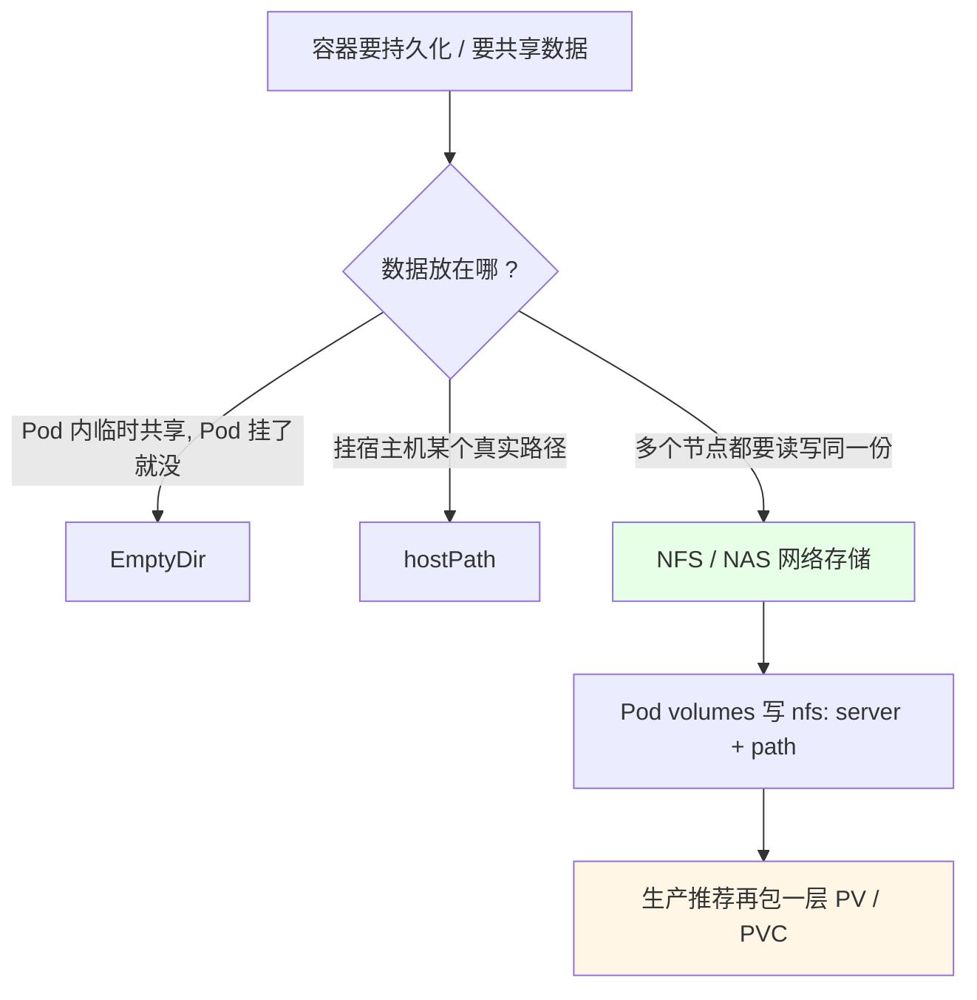
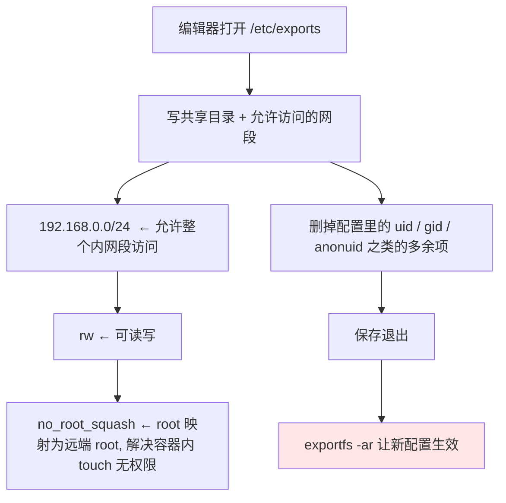
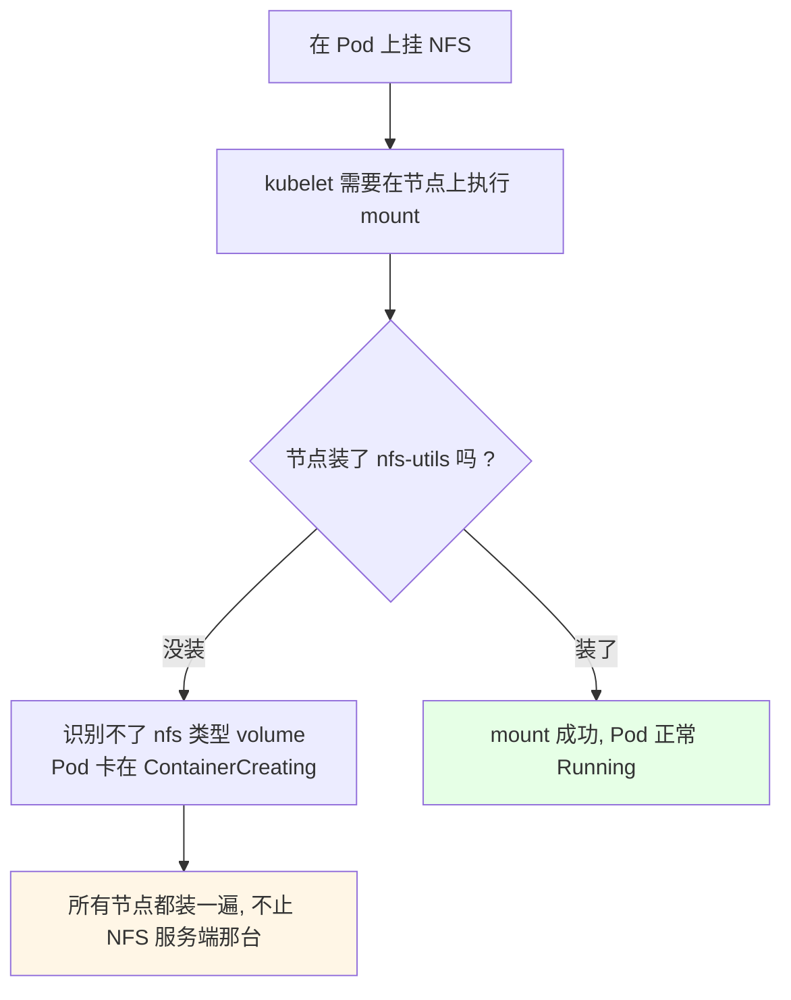
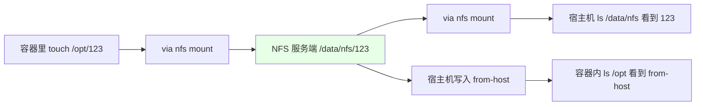

# Kubernetes 集群部署: 挂载 NFS 至容器（NFS 服务端配置与 Pod 直挂 volume 实测）

挂载这块前面已经看过 `EmptyDir`（Pod 内临时共享）和 `hostPath`（挂宿主机目录），这一节把**真正的共享存储**跑通：在一台节点上装 NFS 服务端、配 `/etc/exports`、让 `exportfs` 生效，客户端节点装 `nfs-utils` 后用 `mount -t nfs` 验证互通，最后在 Pod 的 `volumes` 里直接写 `nfs` 字段挂进容器，实测两侧文件互相可见。

结论先摆：

1. **Pod 挂载 NFS 只需要 `server` + `path` 两个参数**，和挂本地目录一样写进 `spec.volumes` 即可；
2. **客户端节点必须装 `nfs-utils`**，不装 kubelet 根本识别不了 NFS 类型的 volume（实测直接挂载失败）；
3. **`exportfs -ar` 改完 `_exports` 必须执行，否则挂载出来的是旧授权**，这是最容易踩的坑；
4. **生产不建议直接在 volume 里写 NFS**，正确姿势是「PVC 绑 PV、PV 指向 NFS」（下节展开）；云上用兼容 NFS 协议的 NAS 平台（如阿里云 NAS）替换地址即可。

## 纲要

- NFS 在存储体系里的位置
- 装 NFS 服务端并建共享目录
- 改 /etc/exports 做授权
- exportfs -ar 让配置生效
- 每个节点装 nfs-utils 客户端
- 手工 mount 验证读写
- Pod 里用 volume 挂 NFS 进容器
- 实测：容器内与宿主机双向可见
- 生产建议：走 PV/PVC 或云 NAS

## NFS 在存储体系里的位置



| 方案 | 生命周期 | 能否跨节点共享 | 生产可用度 |
| --- | --- | --- | --- |
| `EmptyDir` | 随 Pod（跟 Pod 同生共死） | 不行 | 临时缓存、sidecar 共享日志 |
| `hostPath` | 跟宿主机 | 只能本机 | 少用（节点故障就丢） |
| **NFS / NAS** | 独立存储服务 | **能，多副本同时读写** | 测环境可用，生产走 PV/PVC |
| PV + PVC | 独立于 Pod | 能 | **生产推荐** |

## 装 NFS 服务端并建共享目录

```bash
# 1. 选一台节点当 NFS 服务端（这里用 node01）
yum install -y nfs-utils
# 旧系统用 yum，新版 Rockylinux/CentOS8 用 dnf

# 2. 建共享目录，-p 保证父目录一起建
mkdir -p /data/nfs

# 3. 看服务端版本（现在一般都用 4.x 以上）
 nfsstat -v
```

```text
/data 目录树（共享目录建好后是这个样子）:

/data
└── nfs            ← 共享出去的目录, 由 /etc/exports 指定
```

## 改 /etc/exports 做授权

```text
/etc/exports 的写法:

/data/nfs    192.168.0.0/24(rw,no_root_squash)
```



要注意的点：

- 网段要和集群实际网段一致，写错了客户端根本连不上（课程里一开始写成别的网段，导致后面 `touch` 报无权限，排查了一轮才定位到是这里）；
- **`no_root_squash` 是关键**：容器里是 root 用户，不写这个，服务端会把 root 压成 nobody，容器内立刻 `touch` 无权限；
- 课程里顺带配的 redis 之类只是测试残留，**不要拿 NFS 去当 Redis 的存储**，那只是演示。

## exportfs -ar 让配置生效

```bash
# .reload 导出表（重新导出所有, 让 /etc/exports 的修改生效）
exportfs -ar

# 或者用服务方式刷新
systemctl reload nfs
systemctl enable --now nfs
```

改完 `exports` 不刷新，`mount` 挂上去看到的还是**旧的授权规则**，表现就是「能挂载、但写文件报权限不足」——这是这一节最典型的坑。

## 每个节点装 nfs-utils 客户端

```bash
# 所有参与调度的节点都要装, 包括 master
yum install -y nfs-utils

# 装完才能识别 nfs 类型挂载
showmount -e 192.168.0.204
# Export list for 192.168.0.204:
# /data/nfs 192.168.0.0/24
```



## 手工 mount 验证读写

```bash
# 在客户端节点上先手工挂一份, 确认服务端是通的
mount -t nfs 192.168.0.204:/data/nfs /mnt

# 写个文件试试权限
echo 123 > /mnt/123

# 看挂载结果
 df -h | grep nfs
```

能 `echo` 成功、文件真的出现在 `/data/nfs` 下，说明服务端配置没问题了，才轮到下面「Pod 里用 volume 挂 NFS 进容器」这一步。

## Pod 里用 volume 挂 NFS 进容器

```yaml
apiVersion: apps/v1
kind: Deployment
metadata:
  name: ngx2
  labels:
    app: ngx2
spec:
  replicas: 1
  selector:
    matchLabels:
      app: ngx2
  template:
    metadata:
      labels:
        app: ngx2
    spec:
      containers:
      - name: nginx
        image: nginx:1.15.2
        imagePullPolicy: IfNotPresent
        volumeMounts:
        - name: nfs-vol
          mountPath: /opt
      volumes:
      - name: nfs-vol
        nfs:
          server: 192.168.0.204
          path: /data/nfs
```

```text
一个 Pod 里挂 NFS 时, 目录结构的对应关系:

NFS 服务端 (node01:192.168.0.204)
└── /data/nfs                    ← exports 里导出的目录
    │   path: /data/nfs
    │   server: 192.168.0.204
    ▼
Pod 的 volumes[0] (name: nfs-vol)
    │   volumeMounts: mountPath: /opt
    ▼
容器内的 /opt                     ← 业务进程读写就落到这里
```

两个参数就够了：

| `nfs` 字段 | 作用 | 示例 |
| --- | --- | --- |
| `server` | NFS 服务端 IP | `192.168.0.204` |
| `path` | 服务端导出的目录（**支持多级子目录**） | `/data/nfs`、`/data/nfs/test` |
| `readOnly` | 是否只读挂载，默认 `false`（可读写） | `true` |

```bash
# 改完清单直接 replace / apply
kubectl replace -f nginx-nfs.yaml
# 卡在 ContainerCreating 时先看事件, 大多就是 nfs-utils 没装或 exports 没刷新
kubectl describe pod ngx2-xxx
```

## 实测：容器内与宿主机双向可见

```bash
# 1. 进容器看挂载点
kubectl exec -it ngx2-xxx -- df -h
# 可以看到 /opt 已经挂上了 NFS 的挂载点

# 2. 容器里写文件
kubectl exec -it ngx2-xxx -- touch /opt/123

# 3. 回到服务端节点看 —— 文件出现了
ls -l /data/nfs
# -rw-r--r-- 1 root root 0 ... 123

# 4. 服务端写文件, 容器内也能看到
echo hello > /data/nfs/from-host
kubectl exec -it ngx2-xxx -- ls /opt
# from-host
```



**这就是 NFS 的价值**：同一份数据在多个节点、多个 Pod 之间一致，一个 Pod 挂了数据还在。

## 生产建议：走 PV/PVC 或云 NAS

```text
课程最后给的结论（两种挂载方式的取舍）:

直接在 volume 里写 NFS
├── 配置简单, 两行就够
├── 适合测试环境 / 单集群小场景
├── 服务端硬编码在清单里, 换存储要改所有 Pod
└── 生产不推荐

PV 指向 NFS + PVC 申请
├── PV 里写 nfs server + path
├── PVC 绑 PV, Pod 只认 PVC 名
├── 换后端存储只改 PV, Pod 不动
└── 生产推荐（下一节展开）

云 NAS 平台（阿里云 NAS 等）
├── 兼容 NFS 协议, 直接换 IP + 路径即可
└── 比自建 NFS 多一层保障
```

| 维度 | 直挂 NFS | PV + PVC | 云 NAS |
| --- | --- | --- | --- |
| 配置复杂度 | 低（两行） | 中（两个对象） | 低（换地址） |
| 换存储成本 | 改所有 Pod 清单 | 只改 PV | 改 PV/直写地址 |
| 数据安全 | 取决于自建 NFS 机器 | 同左，但解耦了 | 平台兜底 |
| 是否推荐生产 | 否（仅测试） | **是** | **是** |

课程里说得很直白：**自建 NFS 没啥保障，很难做高可用架构**；云平台直接买 NAS 更稳，只要兼容 NFS 协议，把清单里的 `server` / `path` 换成 NAS 地址就行。

## API 速览

| 能力 | 做法 | 关键点 |
| --- | --- | --- |
| 装 NFS 服务端 | `yum install -y nfs-utils` | 新版系统可用 `dnf` |
| 建共享目录 | `mkdir -p /data/nfs` | 必须绝对路径 |
| 配授权 | 编辑 `/etc/exports` | 网段 + `rw,no_root_squash` |
| 刷新导出表 | `exportfs -ar` | **改完必执行，否则权限不对** |
| 服务方式刷新 | `systemctl reload nfs` | 等价于重新导出 |
| 看共享列表 | `showmount -e <服务端IP>` | 客户端节点上执行 |
| 装客户端 | `yum install -y nfs-utils` | **所有节点都要装** |
| 手工挂载 | `mount -t nfs <IP>:<path> /mnt` | 验证服务端连通性 |
| Pod 挂载 | `volumes[].nfs.{server,path}` | 配 `volumeMounts.mountPath` |
| 应用清单 | `kubectl replace -f <文件>` | 也可以 `apply` |
| 看挂载点 | `kubectl exec -it <Pod> -- df -h` | 卡住时看 `describe pod` |
| 换云 NAS | 替换 `server` / `path` | 协议兼容即可 |

## Demo 示例

```bash
# 1. NFS 服务端（node01）
yum install -y nfs-utils
mkdir -p /data/nfs
cat > /etc/exports <<'EOF'
/data/nfs   192.168.0.0/24(rw,no_root_squash)
EOF
exportfs -ar
systemctl enable --now nfs
showmount -e 192.168.0.204

# 2. 所有节点装客户端
yum install -y nfs-utils

# 3. 手工挂一次验证
mount -t nfs 192.168.0.204:/data/nfs /mnt
echo ok > /mnt/hello
ls -l /data/nfs

 umount /mnt

# 4. Pod 挂载（清单见上文 nginx-nfs.yaml）
kubectl apply -f nginx-nfs.yaml
kubectl get pod -o wide
kubectl exec -it ngx2-xxx -- df -h

# 5. 双向验证
kubectl exec -it ngx2-xxx -- touch /opt/123
ls -l /data/nfs

 echo host-side > /data/nfs/from-host
kubectl exec -it ngx2-xxx -- ls /opt

# 6. 清理
kubectl delete -f nginx-nfs.yaml
```

```text
整条链路（NFS 挂载的数据流）:

业务容器 (nginx)
   │  volumeMounts: /opt
   ▼
Pod volumes: nfs-vol
   │  nfs.server = 192.168.0.204
   │  nfs.path   = /data/nfs
   ▼
节点内核 nfs 客户端
   │  mount -t nfs（kubelet 代执行）
   ▼
TCP/IP → NFS 服务端 (node01)
   │  /etc/exports 授权校验
   ▼
/data/nfs 真实目录
   │
   ▼
第二个节点同样挂载 → 看到同一份数据
```

### 总结

- **NFS 挂进容器只要 `server` + `path` 两个字段**，写在 `spec.volumes[].nfs` 里，再用 `volumeMounts` 挂到容器的 `/opt` 之类路径，和挂本地目录体验一致；
- **客户端节点必须统一装 `nfs-utils`**，不装 kubelet 识别不了 NFS volume，Pod 会卡在 `ContainerCreating`，排查时用 `kubectl describe pod` 看事件；
- **`exportfs -ar` 是这一节最容易漏的一步** —— 改完 `/etc/exports` 不刷新，挂载能成功但写文件报无权限（`no_root_squash` 该写没写也是同一个症状）；
- **实测双向可见**：容器 `touch /opt/123` → 服务端 `/data/nfs` 立刻有；服务端写文件 → 容器内 `ls /opt` 能看到，多个节点挂同一份数据是一致的；
- **生产不推荐把 NFS 地址直接写进 Pod 清单**（自建 NFS 没保障、做不了高可用），正确做法是 PV 指向 NFS、PVC 去绑，或者干脆换成兼容 NFS 协议的云 NAS 平台；直挂 NFS 留着测试环境用。

