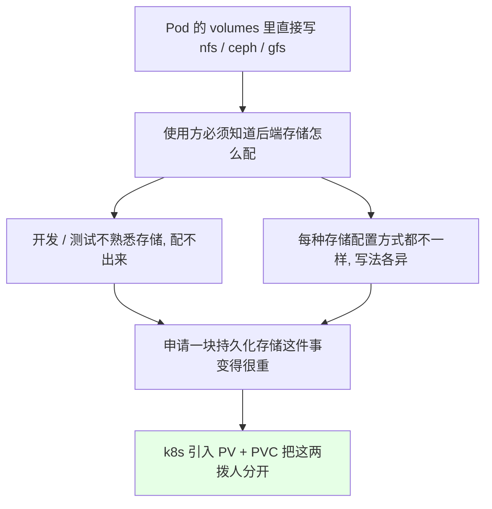
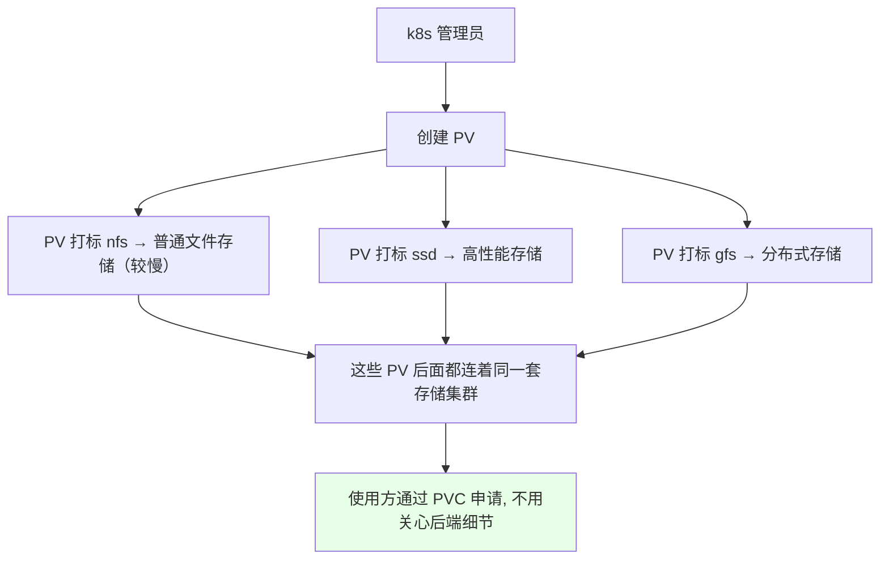
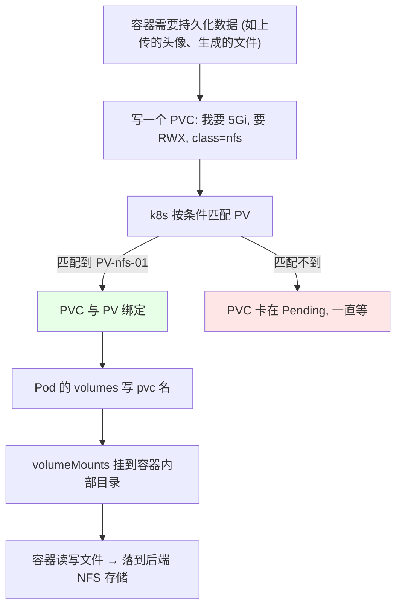
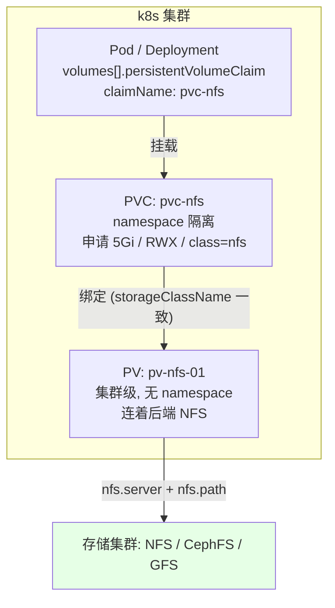
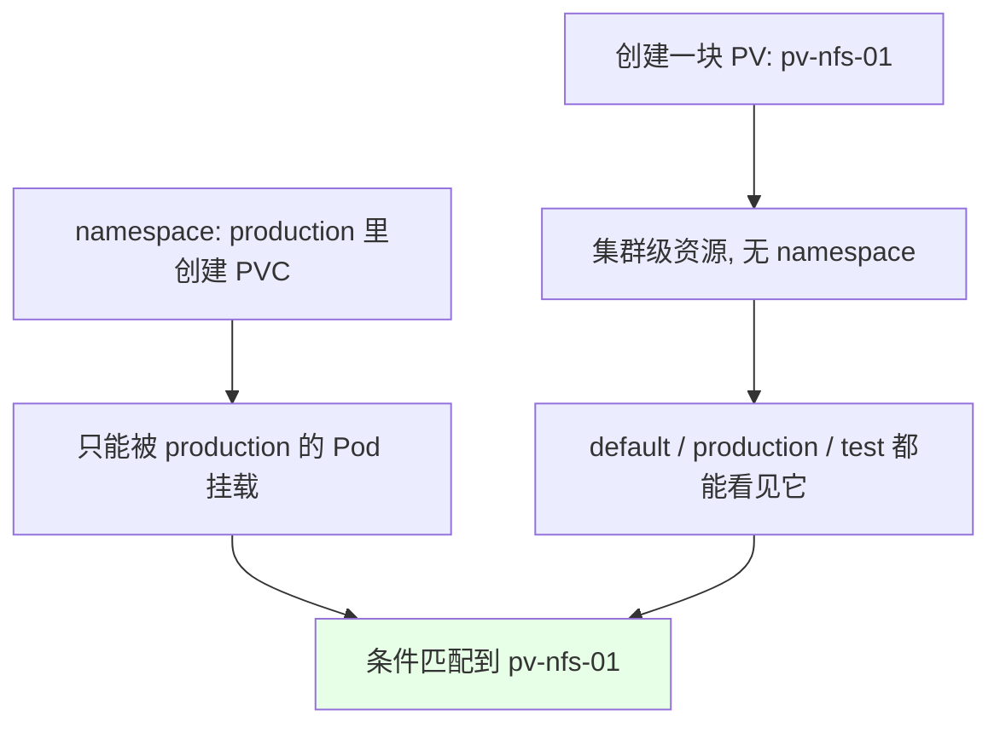
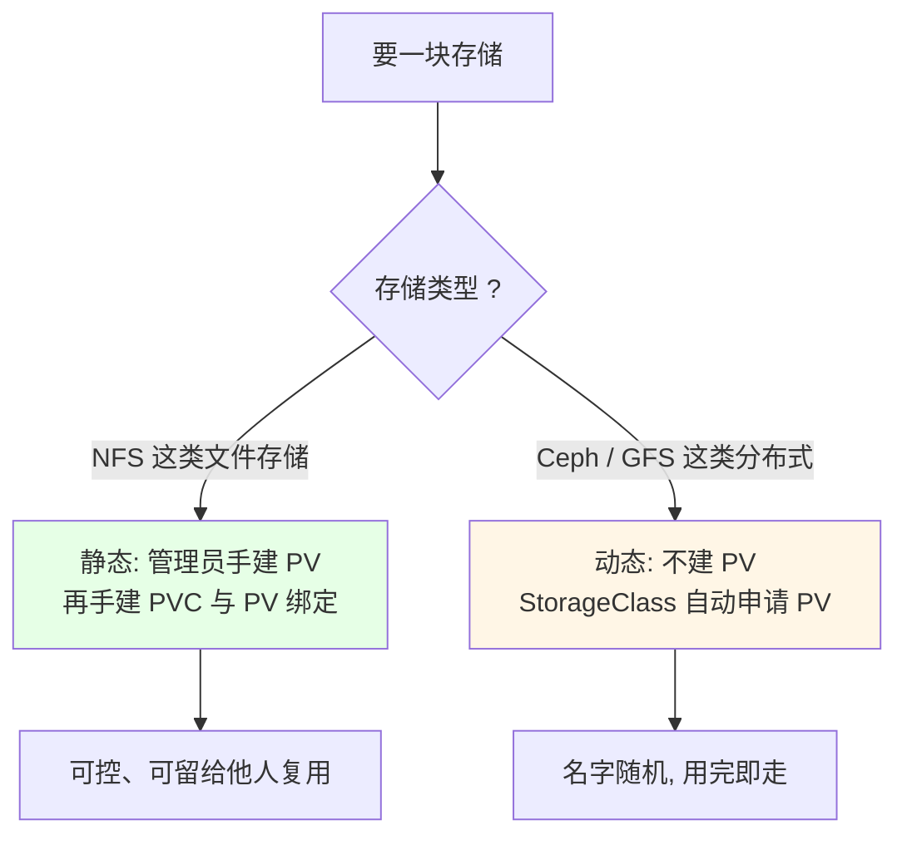
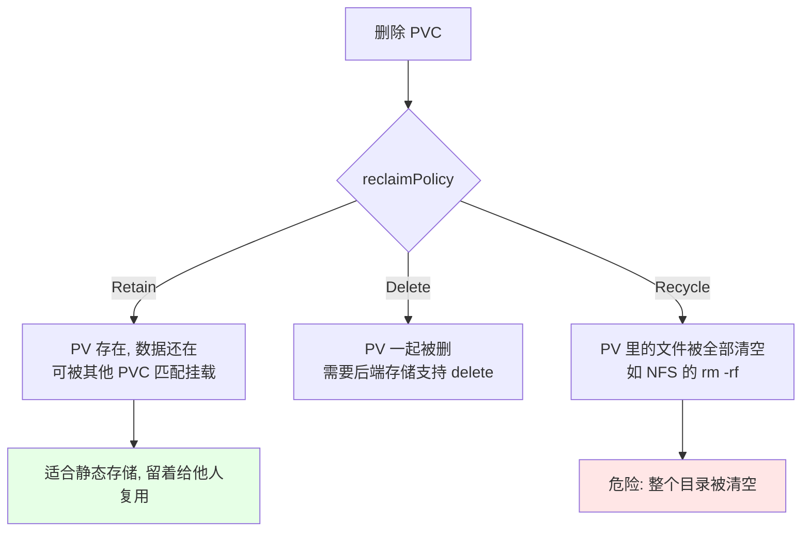
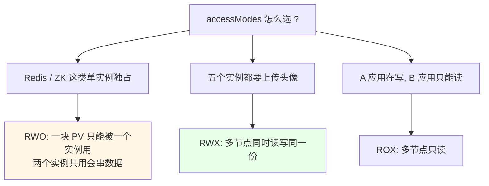
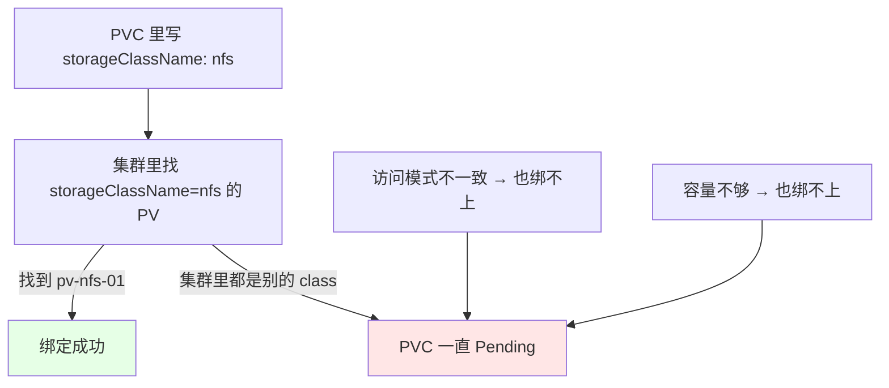

# Kubernetes 集群部署: PV 与 PVC 概念上（存储解耦原理、回收策略与访问模式解读）

上一节的 `volumes` 里可以直接写 `nfs` 连后端存储 —— 能跑通，但**每个使用 k8s 的人都得先学会 NFS、CephFS、GFS 各自怎么配**。这在公司里是走不通的：管理员知道怎么连存储，可开发、测试要去申请一块盘，他既不懂存储概念，也不知道后端到底有什么。

这一节就把「存储」这件事**从使用方手里抽走**：管理员预先创建好一堆 **PV（PersistentVolume，持久卷）** 连着后端存储，使用方只需要写一个 **PVC（PersistentVolumeClaim，持久卷申请）** 说「我要什么类型、多大」，k8s 自动把 PVC 绑到-matched 的 PV 上，Pod 的 `volumes` 里再写 `pvc` 类型把这块盘挂进容器。

结论先摆：

1. **PV 是「存储资源」本身（集群级，无 namespace），PVC 是「对存储的申请（namespace 级，有隔离）**，两者靠 **`storageClassName` 等条件匹配后绑定**；
2. **绑定后 Pod 只认 PVC 名**，换后端存储（NFS 换 Ceph、扩容、迁移）只改 PV，Pod 清单一行不动；
3. **访问模式只有三种**：`ReadWriteOnce`（RWO，单节点读写）、`ReadOnlyMany`（ROX，多节点只读）、`ReadWriteMany`（RWX，多节点读写）；
4. **回收策略三种**：`Retain` 删 PVC 后数据保留、`Delete` 连 PV 一起删（动态存储默认）、`Recycle` 会清空数据（仅部分存储支持，已不推荐）；
5. **静态 / 动态两派**：NFS 这类一般是**手动创建 PV 再绑 PVC**（静态），Ceph / GFS 这类走 **StorageClass 动态申请 PV**（动态，不用手建 PV）；
6. **学习重点在原理**：PV 连 GFS 怎么配、连 Ceph 怎么配各不相同，但 **PVC 连 PV、Pod 用 PVC 这三步写法对所有类型都一样**。

## 纲要

- 为什么 volume 直连存储不够用
- PV 是什么：管理员定义的存储资源
- PVC 是什么：对 PV 的申请
- 一张图看清 Pod / PVC / PV / 存储集群
- 两种挂载路线的区别：直连 vs 经过 PVC
- 命名空间：PV 集群级，PVC 有隔离
- 静态创建与动态创建
- 回收策略三种写法
- 访问模式三种 + volumeMode
- PV 关键字段逐条解读（NFS 模板）
- 其他存储类型的连接方式

## 为什么 volume 直连存储不够用



直连方式的问题不是「不能用」，而是**把运维知识强加给了每一个使用方**：

| 角色 | 他知道什么 | 他要做什么 |
| --- | --- | --- |
| k8s 管理员 | 后端存储怎么配、连 NFS / Ceph / GFS 的参数 | 配存储、配集群 |
| 开发者 | 自己要多大容量、要什么性能、要读写还是只读 | 只想要一块能持久化的盘 |

于是 k8s 的分工变成：**管理员管「有什么」，使用方只管「我要什么」**。

## PV 是什么：管理员定义的存储资源

**PV = PersistentVolume（持久卷）**，是由 k8s 管理员创建的、连接后端存储的一块存储资源。它可以用 yaml 定义，和 Deployment、DaemonSet 一样是一种资源。

管理员创建 PV 时可以去连 NFS、Ceph（CEPH）、GFS 等各种存储，**按类型建成一堆 PV 并打上标记**：

```text
集群里管理员预先建好的一批 PV:

PV-nfs-01      storageClassName: nfs     → 后端: NFS 文件存储
├── PV-nfs-02  storageClassName: nfs     → 后端: NFS 文件存储
├── PV-ssd-01  storageClassName: ssd     → 后端: SSD 硬盘存储
└── PV-gfs-01  storageClassName: gfs     → 后端: GFS / Ceph 存储
```



## PVC 是什么：对 PV 的申请

**PVC = PersistentVolumeClaim（持久卷申请）**，就是「我要一块存储」。

类比很好记：Pod 可以申请内存、CPU，也可以申请磁盘；**PVC 就是申请 PV**。写完之后：

- PVC 会根据条件（容量、访问模式、`storageClassName`）**自动在集群里匹配一个 PV**；
- 匹配上就**两者绑定**起来，PVC 相当于已经挂到一块存储了；
- Pod 的 `volumes` 里写 PVC 类型 + 这个 PVC 名，容器就把这块盘挂进自己的目录。



## 一张图看清 Pod / PVC / PV / 存储集群



```text
完整的四层引用关系:

Deployment / StatefulSet
└── Pod
    └── spec.volumes
        └── - name: data
            └── persistentVolumeClaim:
                └── claimName: pvc-nfs        ← 你只写 PVC 的名字
                    │
                    ▼  绑定关系（k8s 自动完成）
                    PV: pv-nfs-01
                    ├── capacity: 5Gi
                    ├── accessModes: [ReadWriteMany]
                    ├── storageClassName: nfs
                    └── nfs:
                        ├── server: 192.168.0.204
                        └── path: /data/nfs
                            │
                            ▼
                        真实存储集群（NFS / Ceph / GFS）
```

## 两种挂载路线的区别

```text
路线一: volume 直连存储（上一节的做法）

Pod → volumes.nfs{server,path} → 存储集群
   └── 使用方要自己写对存储地址与参数

路线二: 经过 PV + PVC（本节做法）

Pod → volumes.persistentVolumeClaim → PVC → PV → 存储集群
   └── 使用方只写 PVC 名, 后端换 storage 也不用改 Pod
```

| 维度 | 直连 volume | PV + PVC |
| --- | --- | --- |
| 谁配置后端存储 | 使用方 | 管理员 |
| 后端更换成本 | 改所有 Pod 清单 | 只改 PV |
| 使用方需要懂存储吗 | 需要 | **不需要** |
| 配额与分类管理 | 无法统一 | 靠一堆 PV 分等级 |
| 生产推荐度 | 测试环境可用 | **推荐** |

## 命名空间：PV 集群级，PVC 有隔离

- **PV 没有 namespace 隔离**：它是集群级资源，创建出来之后**所有 namespace 都能访问**；
- **PVC 有 namespace 隔离**：某个 namespace 里创建的 PVC，**只在该 namespace 内可见、只能被同 namespace 的 Pod 挂载**。



## 静态创建与动态创建



| 方式 | 步骤 | 典型存储 | 特点 |
| --- | --- | --- | --- |
| **静态** | 手动创建 PV → 手动创建 PVC → 绑定 | NFS、hostPath | PV 可留着给其他人复用 |
| **动态** | 只创建 PVC（带 `storageClassName`）→ 自动创建 PV | CephFS、GFS、云盘 | 不用手写 PV 模板，PVC 删了 PV 也跟着走 |

课程里的判断：**NFS 属于静态存储，GFS / Ceph 都是动态的**；动态存储下 PVC 删掉之后 PV 留着也没用（名字是随机生成的，没法给别人复用），所以默认回收行为是 `Delete`。

## 回收策略

```text
persistentVolumeReclaimPolicy 三种取值:

Retain    ← 删除 PVC 后, PV 和数据都保留, 可被其他 PVC 重新挂载
Delete    ← 删除 PVC 后, 它连着的 PV 也一起删掉（动态存储默认）
Recycle   ← 删除 PVC 后, PV 里的内容全部擦除（仅部分存储支持, 已不推荐）
```



| 策略 | 删 PVC 后 PV | 数据 | 适用 |
| --- | --- | --- | --- |
| `Retain` | 还在 | 还在，可被其他 PVC 挂载 | **静态存储首选**（NFS 这类没必要清空） |
| `Delete` | 被删除 | 一起没 | 动态存储默认（Ceph / 云盘） |
| `Recycle` | 还在 | **被清空** | 仅 NFS 支持，已基本淘汰 |

一个容易误伤的场景：Deployment 配了 PVC，删 Deployment 时可以选「带 PVC 一起删」还是「只删 Pod、保留 PVC」。**如果 PV 配的是 `Recycle`，PVC 一删，那个目录里的内容全没了** —— 所以课程里专门提醒这一条。

## 访问模式与 volumeMode

**访问模式（`accessModes`）只有三种：**

| 模式 | 缩写 | 含义 | 后端要求 |
| --- | --- | --- | --- |
| `ReadWriteOnce` | RWO | 可被**单个节点**以读写方式挂载 | 本地盘、多数块存储 |
| `ReadOnlyMany` | ROX | 可被**多个节点**只读挂载 | NFS 等共享文件存储 |
| `ReadWriteMany` | RWX | 可被**多个节点**读写 | **NFS / CephFS 这类文件存储** |



**`volumeMode` 是挂载类型**：

- `Filesystem`（默认）：挂成文件系统，容器里看到的是一个目录；
- `Block`：裸块设备，容器里看到的是 `/dev/sdX` 裸盘，交给数据库这类自己管文件系统的进程用。

## PV 关键字段逐条解读（NFS 模板）

```yaml
apiVersion: v1
kind: PersistentVolume
metadata:
  name: pv-nfs-01
spec:
  capacity:
    storage: 5Gi
  volumeMode: Filesystem
  accessModes:
  - ReadWriteMany
  persistentVolumeReclaimPolicy: Retain
  storageClassName: nfs
  nfs:
    server: 192.168.0.204
    path: /data/nfs
    readOnly: false
```

| 字段 | 作用 | 注意点 |
| --- | --- | --- |
| `capacity.storage` | PV 容量，如 `5Gi` | 可以调大（扩容章节会讲） |
| `volumeMode` | 挂载类型 | 默认 `Filesystem`，可选 `Block` |
| `accessModes` | 访问模式 | RWO / ROX / RWX，见上表 |
| `persistentVolumeReclaimPolicy` | 回收策略 | `Retain` / `Delete` / `Recycle` |
| `storageClassName` | **PV 的名字（也是匹配 key）** | **必须与 PVC 一致才能绑定** |
| `spec.nfs.server` | NFS 服务端 IP | NFS 类型专用 |
| `spec.nfs.path` | NFS 导出的目录 | 支持多级子目录 |
| `spec.nfs.readOnly` | 是否只读挂载 | 一般写 `false` |

```text
这段 yaml 的字段拆分（看官方 PV 模板时按这个顺序对）:

spec
├── capacity.storage          ← 容量（PV 独有, volume 里没有）
├── volumeMode                ← 挂载类型（PV 独有）
├── accessModes               ← 访问模式
├── persistentVolumeReclaimPolicy ← 回收策略
├── storageClassName          ← 匹配 PVC 的关键
└── nfs                       ← persistentVolumeSource, 各存储类型不同
    ├── server                ← NFS 地址
    └── path                  ← NFS 导出目录
```

### storageClassName 为什么是绑定关键



**只有 PVC 里的 `storageClassName` 和 PV 的 `storageClassName` 一样才能绑**；访问模式、容量不匹配同样绑不上，PVC 会长期停在 `Pending`。这点必须记牢。

## 其他存储类型的连接方式

**`spec.persistentVolumeSource`（`persistentVolumesource`）支持很广**，和 `volumes` 里支持的差不多：`hostPath`、`CephFS`、GCE、AWS、`NFS`、`RBD`、`iSCSI`、`Ceph`、local 等。

但它们**各自的连接参数完全不一样**：

| 存储类型 | 连接时要写什么 | 课程里的说明 |
| --- | --- | --- |
| **NFS** | `nfs: {server, path, readOnly}` | 本节课演示的类型 |
| **Ceph / GFS** | `cephfs: {monitors, path, user, secretRef}` | 连 monitor 节点 + 路径 + 用户密钥 |
| **hostPath** | `hostPath: {path, type}` | 挂宿主机本地目录，不常用 |
| **local** | `local: {path}` + `nodeAffinity` | 本地磁盘，需绑定节点 |

课程里还提了一条生产经验：**外部的 GFS / Ceph 集群最好不要和 k8s 集群部署在一起**（放一起不安全），一般单独建，k8s 侧通过 endpoint 指过去 —— 这就是为什么 PV 里配的是「监控节点地址 + 路径」而不是集群内部地址。

**所以没必要把每种存储的 yaml 都背一遍**：原理清楚之后，**PV 连什么存储去查那类存储的配置模板即可，而 PVC 连 PV、Pod 用 PVC 这三步写法对所有类型都一样**。

## API 速览

| 能力 | 做法 | 关键点 |
| --- | --- | --- |
| 看集群里有哪些 PV | `kubectl get pv` | 看 CAPACITY / ACCESS MODES / RECLAIM POLICY / CLASS |
| 看 PVC | `kubectl get pvc -n <命名空间>` | 看 STATUS 是否 Bound |
| 看 PV 详情 | `kubectl describe pv <PV>` | 看绑定到哪个 PVC、连的哪个后端 |
| 手动创建 PV | `kubectl apply -f pv.yaml` | 集群级资源，不带 namespace |
| 手动创建 PVC | `kubectl apply -f pvc.yaml` | **必须指定 namespace** |
| 看 PVC 绑定情况 | `kubectl get pvc -o wide` | `CAPACITY` / `VOLUME` 列 |
| 查 storage class | `kubectl get sc` | 动态存储入口 |
| 清掉一个 PVC | `kubectl delete pvc <PVC> -n <命名空间>` | 之后 PV 按回收策略处理 |
| 改 PV 回收策略 | `kubectl patch pv <PV> -p '{"spec":{"persistentVolumeReclaimPolicy":"Retain"}}'` | 已绑定的 PV 部分字段不可改 |

PV 字段速查：

| 字段 | 必填 | 说明 |
| --- | --- | --- |
| `spec.capacity.storage` | 是 | 容量，如 `5Gi` |
| `spec.accessModes` | 是 | RWO / ROX / RWX |
| `spec.storageClassName` | 是 | 与 PVC 匹配的关键 |
| `spec.persistentVolumeReclaimPolicy` | 否（默认 Retain） | Retain / Delete / Recycle |
| `spec.volumeMode` | 否（默认 Filesystem） | Filesystem / Block |
| `spec.nfs` / `spec.cephfs` / ... | 视类型 | 后端存储连接方式 |
| `metadata.namespace` | — | **不写**（PV 是集群级） |

## Demo 示例

```bash
# 0. 先确认 NFS 服务端可达（上一节的 /data/nfs 已经导出）
showmount -e 192.168.0.204

# 1. 管理员创建 PV（集群级, 不用指定 namespace）
kubectl apply -f pv-nfs-01.yaml

# 2. 使用方在业务 namespace 里创建 PVC
kubectl apply -f pvc-nfs.yaml

# 3. 看绑定结果
kubectl get pv
kubectl get pvc -n production
# 两条都是 Bound 才说明绑定成功

# 4. 在 Pod 里挂载这个 PVC
kubectl apply -f app-with-pvc.yaml
kubectl exec -it app-xxx -- df -h

# 5. 写文件, 验证落到 NFS
kubectl exec -it app-xxx -- touch /data/test.txt
ls -l /data/nfs
```

```yaml
# pv-nfs-01.yaml —— 管理员创建
apiVersion: v1
kind: PersistentVolume
metadata:
  name: pv-nfs-01
spec:
  capacity:
    storage: 5Gi
  volumeMode: Filesystem
  accessModes:
  - ReadWriteMany
  persistentVolumeReclaimPolicy: Retain
  storageClassName: nfs
  nfs:
    server: 192.168.0.204
    path: /data/nfs
    readOnly: false
```

```yaml
# pvc-nfs.yaml —— 使用方申请
apiVersion: v1
kind: PersistentVolumeClaim
metadata:
  name: pvc-nfs
  namespace: production
spec:
  accessModes:
  - ReadWriteMany
  storageClassName: nfs
  resources:
    requests:
      storage: 2Gi
```

```yaml
# app-with-pvc.yaml —— Pod 侧只认 PVC 名
apiVersion: v1
kind: Pod
metadata:
  name: app
  namespace: production
spec:
  containers:
  - name: app
    image: busybox:1.32
    command: ["sh", "-c", "sleep 3600"]
    volumeMounts:
    - name: data
      mountPath: /data
  volumes:
  - name: data
    persistentVolumeClaim:
      claimName: pvc-nfs
```

```text
三个对象到存储的落点关系:

production 命名空间
└── Pod: app
    └── /data  ── volumeMounts: name=data
        └── volumes: name=data
            └── persistentVolumeClaim:
                └── claimName: pvc-nfs  ← 只写名字
                    │
                    ▼  已经 Bound
                    PV: pv-nfs-01  (class=nfs, RWX, Retain)
                    │  nfs.server = 192.168.0.204
                    ▼
                    /data/nfs  ← 真实NFS目录, 五个副本都能写
```

### 总结

- **PV 是存储资源本身（集群级、无 namespace，由管理员创建并连着后端存储），PVC 是对 PV 的申请（namespace 级、有隔离）**，两者按条件匹配后绑定，Pod 的 `volumes` 里写 `persistentVolumeClaim.claimName` 即可挂载 —— **使用方从此不需要懂 NFS / Ceph / GFS 怎么配**；
- **`storageClassName` 是绑定的命门**：PVC 的 class 与 PV 的 class 不一致、访问模式不一致、容量不够，PVC 都会一直 `Pending`；
- **回收策略三选一**：`Retain` 删 PVC 后 PV 与数据都留着（静态存储首选）、`Delete` 连 PV 一起删（动态存储默认）、`Recycle` 会把 PV 内容**全清空**（危险，已不推荐）；
- **访问模式只有 RWO / ROX / RWX 三种**：Redis、ZK 这类单实例独占用 `ReadWriteOnce`（两块实例共用会串数据），多实例上传头像这类共享场景才用 `ReadWriteMany`（NFS 支持），只读共享用 `ReadOnlyMany`；
- **静态与动态要分清**：NFS 走「手建 PV + 手建 PVC」（PV 可留给他人复用），Ceph / GFS 走 StorageClass 自动申请 PV（PVC 删了 PV 一般也跟着没）；
- **原理比模板重要**：PV 连什么存储各有各的参数，查官方模板即可；而 **PVC 连 PV、Pod 用 PVC 这三步对所有存储类型都一样**。

