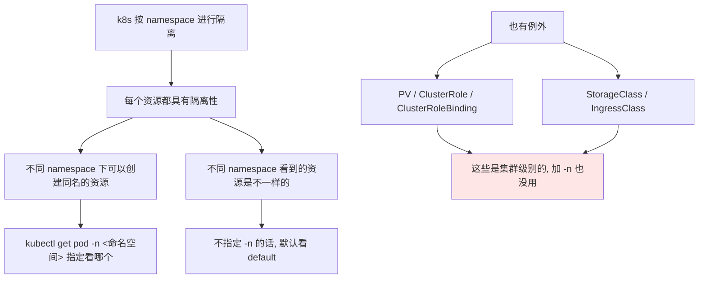
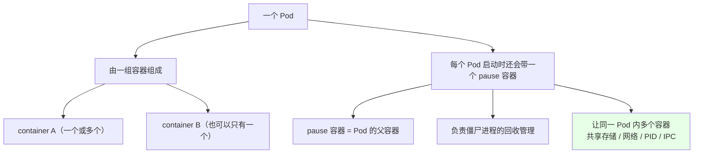
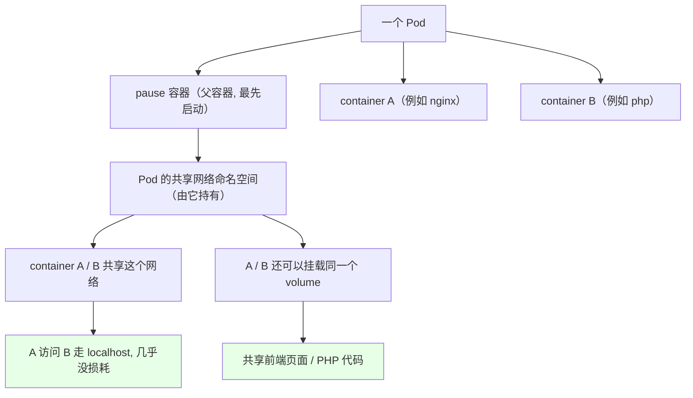
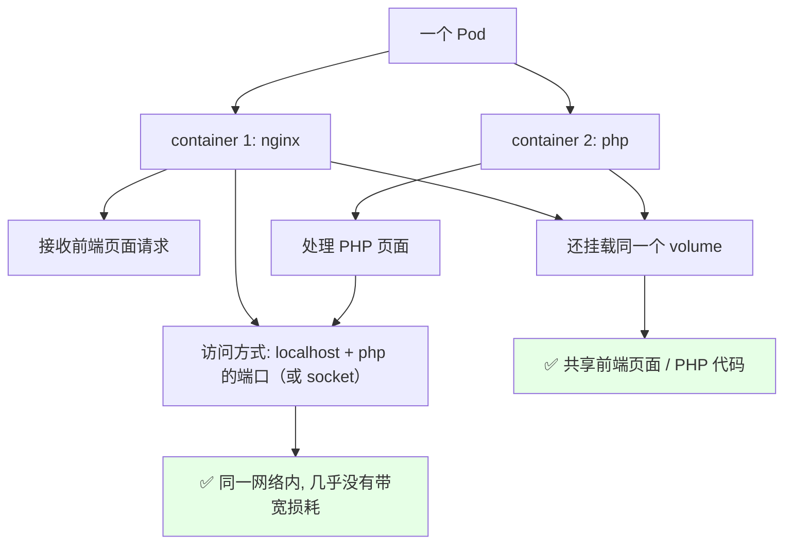
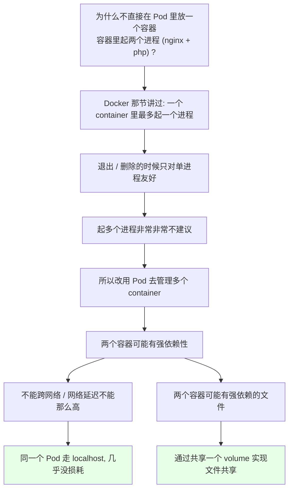

# Kubernetes 集群部署: 什么是 Pod（最小单元、pause 容器与 namespace 隔离性）

集群搭好了、Docker 基础也学完了，从这一节正式进入 k8s 基础知识。**从最基础的 Pod 讲起，一路往上越来越复杂。**

结论先摆：

1. **Pod 是 k8s 中最小的单元（最小的操作单元）**，也是我们用 k8s 时**打交道最多**的东西，必须学透；
2. **Pod 由**一组**一个或多个容器组成**，另外每个 Pod 启动时还会自动带一个 **`pause` 容器（父容器）**；
3. **`pause` 容器的两个职责**：**负责僵尸进程的回收管理**，并且**让同一个 Pod 里多个容器共享存储、网络、PID、IPC**；
4. **k8s 按 namespace 做隔离**：不同 namespace **可以创建同名的资源**；但 **PV / ClusterRole / ClusterRoleBinding / StorageClass / IngressClass 没有 namespace 隔离**，是集群级的，**资源名不能重复**；
5. **不要把两个进程塞进一个容器**（一个容器最多一个进程，否则退出/删除会互相影响）—— 该用**一个 Pod 里放两个容器**的场景，靠 `localhost` 通信**几乎没有网络损耗**，还能**挂同一个 volume 共享文件**。

## 纲要

- 先说 namespace 隔离性
- 哪些资源有 namespace 隔离，哪些没有
- Pod 是什么：k8s 的最小单元
- Pod 里的一组容器与 pause 镜像
- pause 容器到底干什么的
- Pod 的结构图解
- 企业经典场景：一个 Pod 跑 nginx + php
- nginx 怎么访问 php：localhost + 端口
- 为什么不在一个容器里起两个进程
- 什么时候该拆成两个容器

## 先说 namespace 隔离性



```bash
# 1. 看集群里有多少个 namespace
kubectl get ns

# 2. 不指定 -n, 默认就是 default 命名空间
kubectl get pod
# 当前 default 下没有任何容器 / 任何 Pod

# 3. 系统组件的 Pod 都在 kube-system 下
kubectl get pod -n kube-system
# coredns-xxxx    1/1  Running
# metrics-server-xxxx  1/1  Running
# calico-node-xxxx 1/1  Running
# kube-proxy-xxxx  1/1  Running
# ...
```

### 哪些资源有 namespace 隔离，哪些没有

```text
有 namespace 隔离（常见于这些):
├── Pod
├── ReplicationController (RC)
├── ReplicaSet (RS)
├── Deployment
├── StatefulSet
├── Service
├── HPA
├── ConfigMap
└── Secret

没有 namespace 隔离（集群级别):
├── PV (PersistentVolume)          ← 持久化存储用, 后面章节讲
├── ClusterRole                    ← 群集级别权限配置
├── ClusterRoleBinding
├── StorageClass                   ← 动态存储
└── IngressClass                   ← 1.18 提出, 还没正式使用
```

实测一下这个区别：

```bash
# 4. default 命名空间下有这个 secret
kubectl get secret -n default

# 5. kube-system 下的 secret 又是另一堆
kubectl get secret -n kube-system
# 有这么多, 和 default 完全不一样
kubectl get secret -n kube-system
```

- 像 **RC、RS、Deployment、StatefulSet、Service、Ingress、HPA、ConfigMap、Secret** 这些，**绝大部分都有 namespace 隔离**；
- **没有隔离性的**：
  - **PV（PersistentVolume）** —— 持久化存储用的，后面章节讲；
  - **ClusterRole / ClusterRoleBinding** —— 集群级别的权限配置；你加个 `-n kube-system` 去看，**还是这么多**，说明它不是 namespace 级的；
  - **StorageClass** —— 动态存储，后面存储章节会讲；
  - **IngressClass** —— **1.18 才提出来**，现在还没正式投入使用，后面存储/ingress 章节会碰到，不用急。

> 注意区别：**namespace 级的资源不同 namespace 下可以有相同名称**；但 **ClusterRole / ClusterRoleBinding 这一类没有 namespace 隔离，它的资源名称是不能重复的**，这个要记牢。

## Pod 是什么：k8s 的最小单元

```text
什么是 Pod:

Pod 是 k8s 中最小最小的单元

我们从上往下讲, 就是从 Pod 开始
 └── 然后才是 Deployment / StatefulSet / DaemonSet 这些控制器

用 k8s 的时候, 和 Pod 打交道是最多的
 所以 Pod 一定要学好, 要掌握它的各种知识
```

- **Pod 是 k8s 中最小的单元（最小操作单元）**；
- 我们**使用 k8s 时跟 Pod 打交道打的最多**，所以一定要把它学明白；
- 从 Pod 一路往上，会越来越复杂、越来越难。

## Pod 里的一组容器与 pause 镜像



我们之前搭集群的时候创建了一些系统 Pod：

- **CoreDNS、metrics-server、calico** 这些，启动的时候**里面包含一个容器**（`1/1`），**还带着一个 pause 容器**；
- 看节点上的其他 Pod —— 比如 **kube-controller-manager、kube-scheduler**，**起了三个容器，下面挂了三个 pause 镜像**，是**一对一**的；
- 也就是：**每一个 Pod 启动的时候，都会带一个 pause 容器**。

### pause 容器到底干什么的

- **pause 容器是 Pod 的副容器（父容器）**；
- **主要负责僵尸进程的回收管理**；
- **同时，通过 pause 容器可以使同一个 Pod 里面的多个容器共享存储、网络、PID、IPC 等**。

## Pod 的结构图解



```text
一个 Pod 内部的结构:

Pod
├── pause 容器  (pause 镜像, 父容器)
│   ├── 持有这个 Pod 的共享网络命名空间
│   └── 负责僵尸进程回收
├── container A  (nginx)
│   ├── 共享同一个网络命名空间
│   └── 挂载共享 volume
└── container B  (php)
    ├── 共享同一个网络命名空间
    └── 挂载共享 volume

这个 pause 镜像可以让一个 Pod 里
不同的 container 共享存储 / 共享网络
```

Pod 里管理的是我们的容器（比如 containerA、containerB，可能一个也可能多个），**下面还会有一个 pause 镜像**，通过这一个 pause 镜像，**可以让一个 Pod 里不同的 container 去共享它的存储或者共享它的网络**。

## 企业经典场景：一个 Pod 跑 nginx + php

企业里部署 PHP 应用的时候，**最常见的一种部署方式就是一个 Pod 里起两个容器**：



- **nginx** 接收前端的一些页面请求；
- 有些 **PHP 页面要交给 PHP 去处理**；
- **nginx 访问 PHP 有两种方式**：访问 PHP 的一个 **socket 文件**，或者访问 **PHP 的 9000 端口**；
- 因为这个在一个 Pod 里面，**nginx 访问 php 通过 `localhost` + php 的端口就能访问到**；
- **访问的时候没有网络带宽上面的消耗** —— 直接在同一个网络内访问；
- 而且**两个容器还可以挂载同一个 volume**，比如**共享一块前端页面、或者共享 PHP 代码**。

## nginx 怎么访问 php：localhost + 端口

```yaml
apiVersion: v1
kind: Pod
metadata:
  name: nginx-php
  namespace: default
spec:
  containers:
  - name: nginx
    image: nginx:1.15.2
    ports:
    - containerPort: 80
    volumeMounts:
    - name: code
      mountPath: /usr/share/nginx/html
  - name: php
    image: php:7.4-fpm
    ports:
    - containerPort: 9000
    volumeMounts:
    - name: code
      mountPath: /usr/share/nginx/html   # 同一个 volume, 代码共享
  volumes:
  - name: code
    emptyDir: {}
```

同一个 Pod 里 nginx 配一行快速访问 PHP 就行：

```text
nginx 里访问 php:

server {
    listen 80;
    root /usr/share/nginx/html;

    location ~ \.php$ {
        # 用 localhost + php 的 9000 端口, 走 Pod 内部的回环网络
        fastcgi_pass 127.0.0.1:9000;
        include fastcgi_params;
    }
}
```

> `127.0.0.1:9000` 就是「**同一个 Pod 内不同容器，通过 localhost 就能互相访问**」的实际效果 —— 网络几乎不损耗。

## 为什么不在一个容器里起两个进程



- **为什么不在 Pod 里只部署一个容器、这个容器里起两个进程（nginx + PHP）？** —— 讲 Docker 的时候提过：**建议一个 container 里最多起一个进程**；
- 这样**做退出操作或者是做删除的时候，不会对多个进程造成影响**；**在一个容器里起多个进程是非常非常不建议的**；
- 所以**用 Pod 来管理多个 container** —— 不一定非是 nginx + PHP 这一对：
  - **两个容器可能有强依赖性** —— 不能跨网络，或者两者之间的**网络延迟不能那么高**；
  - 用同一个 Pod 部署两个容器，**通过 localhost 去访问它的网络，几乎是没有损耗的**；
  - **两个容器可能还有强依赖的文件** —— containerA 产生的文件 containerB 要用来，**通过共享一个 volume 就实现了文件共享**。

### 什么时候该拆成两个容器

| 场景 | 结论 |
| --- | --- |
| 两个进程之间不需要跨网络、延迟要低 | ✅ 放同一个 Pod（如 nginx + php） |
| A 产生的文件 B 要直接用 | ✅ 共享同一个 volume |
| 两者共享前端页面 / 代码 | ✅ 挂同一块 volume |
| 一个容器里塞两个进程 | ❌ **不要**，退出/删除会互相影响 |

## API 速览

| 能力 | 做法 / 关键点 |
| --- | --- |
| 看有哪些 namespace | `kubectl get ns` |
| 看某个 namespace 下的 Pod | `kubectl get pod -n <命名空间>` |
| 不指定 namespace | 默认看 `default` |
| 系统组件 Pod 在哪 | 都在 `kube-system` 下 |
| 看 namespace 级的资源 | `kubectl get secret -n default` 与 `-n kube-system` 结果不同 |
| 最小单元 | **Pod 是 k8s 中最小最小的操作单元** |
| Pod 的组成 | 一组（**一个或多个**）容器 + 一个自动带的 `pause` 容器 |
| pause 容器的职责 | ① **回收僵尸进程** ② 让同 Pod 内容器**共享存储 / 网络 / PID / IPC** |
| 容器间通信 | `localhost` + 端口（或 socket），**几乎没有网络损耗** |
| 容器间文件共享 | 挂载**同一个 volume** |
| 一个容器多个进程 | ❌ 不建议，退出/删除会互相影响 |
| 有 namespace 隔离 | Pod、RC、RS、Deployment、StatefulSet、Service、Ingress、HPA、ConfigMap、Secret |
| **没有** namespace 隔离 | **PV、ClusterRole、ClusterRoleBinding、StorageClass、IngressClass**（集群级，名字不能重复） |

## Demo 示例

```bash
# 1. 看 namespace 与隔离性
kubectl get ns
kubectl get pod
kubectl get pod -n kube-system

# 2. 对比两个 namespace 下的 secret（内容完全不一样）
kubectl get secret -n default
kubectl get secret -n kube-system

# 3. 集群级资源: 加 -n 也没用, 还是这么多
kubectl get clusterrole -n kube-system
kubectl get clusterrolebinding -n kube-system

# 4. 看系统 Pod 里带的 pause 容器
kubectl get pod -n kube-system
kubectl describe pod -n kube-system coredns-xxxx
```

```text
5. 一个 Pod 里两个容器 + 共享 volume:

nginx-php
├── pause                 ← 父容器, 最先启动
│   └── 持有共享网络命名空间, 回收僵尸进程
├── nginx (containerPort 80)
│   └── volumeMounts: code → /usr/share/nginx/html
└── php (containerPort 9000)
    └── volumeMounts: code → /usr/share/nginx/html   ← 同一个 volume

nginx → php: localhost:9000（走 Pod 内部回环, 无带宽损耗）
```

```bash
# 6. 起一个双容器 Pod 验证 localhost 通信
kubectl apply -f nginx-php.yaml
kubectl get pod nginx-php
kubectl exec -it nginx-php -c nginx -- sh
# 在 nginx 容器里直接用 localhost 访问 php
# curl http://127.0.0.1:9000  /  fastcgi_pass 127.0.0.1:9000

# 7. 看 pause 容器
kubectl get pod nginx-php -o yaml | grep -A 5 pause
kubectl describe pod nginx-php | grep -A 3 pause
```

### 总结

- **Pod 是 k8s 中最小最小的操作单元**，也是日常打交道最多的东西；它**由一组（一个或多个）容器组成**，启动的时候还会自动带一个 **`pause` 容器**；
- **`pause` 容器是 Pod 的父容器**：**负责僵尸进程的回收管理**，同时**让同一个 Pod 里多个容器共享存储、网络、PID、IPC** —— 系统组件（CoreDNS、metrics-server、calico）和各节点的 controller / scheduler 都是「几个容器 + 一一对应的 pause 镜像」；
- **k8s 按 namespace 隔离**：不同 namespace 下**可以有同名资源**（`kubectl get pod -n xxx` 指定看哪个，不写就是 default，系统组件都在 kube-system）；但 **PV / ClusterRole / ClusterRoleBinding / StorageClass / IngressClass 没有 namespace 隔离**，是集群级的，**加 `-n` 也是那么多，名字不能重复**；
- **经典用法是一个 Pod 跑两个容器**：nginx 接收前端页面、php 处理 PHP 页面，**nginx 通过 `localhost` + php 端口（或 socket）访问 php，同一个网络内几乎没有带宽损耗**；
- **两个容器还可以挂同一个 volume 共享文件**（containerA 产生的文件 containerB 直接用），共享前端页面 / PHP 代码；
- **别把一个容器塞两个进程**（Docker 那节的建议：一个容器最多一个进程，否则退出/删除会互相影响）；该拆就拆成同一个 Pod 的两个容器 —— 只有当两者**网络延迟不能高、有强依赖文件**时才值得，不然单个容器单进程更省心。

